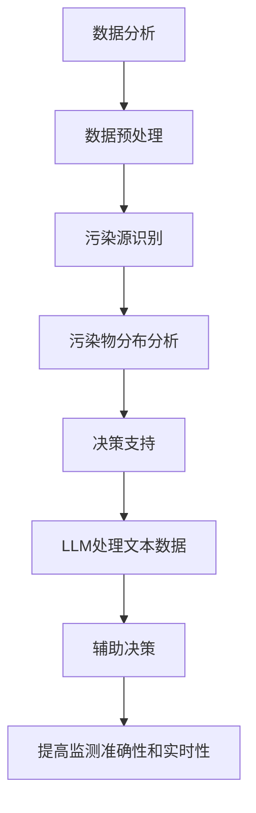

                 

关键词：大型语言模型（LLM），环境监测，实时污染检测，人工智能，数据分析，模型训练，算法优化，开源工具，应用场景。

## 摘要

本文将探讨大型语言模型（LLM）在环境监测领域中的应用，特别是实时污染检测。随着环境问题的日益严重，实时监测污染源和污染程度成为环境保护的重要环节。本文介绍了LLM的基本概念及其在数据分析和模式识别中的优势，详细解析了LLM在实时污染检测中的应用原理和操作步骤。同时，通过数学模型和实际代码实例，展示了LLM在环境监测中的具体应用效果。最后，我们对LLM在环境监测领域的未来应用前景进行了展望。

## 1. 背景介绍

### 环境污染现状

环境污染已经成为全球性的问题，对人类健康和生态系统造成严重威胁。大气污染、水污染、土壤污染等各类环境污染问题层出不穷，给环境保护工作带来了巨大的挑战。实时监测污染程度和来源是解决环境污染问题的关键。然而，传统的污染监测方法往往存在检测周期长、精度低、实时性差等问题，无法满足环境保护的迫切需求。

### 大型语言模型（LLM）的发展

大型语言模型（LLM）是近年来人工智能领域的重要突破。LLM通过深度学习技术，对海量文本数据进行训练，能够自动学习和理解自然语言的语义和结构。随着计算能力和数据量的提升，LLM的规模和性能得到了显著提升。目前，LLM已经在自然语言处理、机器翻译、文本生成等多个领域取得了显著的成果。

### LLM在环境监测中的应用前景

LLM在环境监测中的应用具有巨大的潜力。首先，LLM能够高效地处理和分析大量环境数据，从中提取有价值的信息。其次，LLM具有强大的模式识别能力，能够识别污染源和污染物分布的规律。此外，LLM还可以实时更新和优化环境监测模型，提高监测的准确性和实时性。因此，LLM在环境监测领域具有广泛的应用前景。

## 2. 核心概念与联系

### 大型语言模型（LLM）的基本概念

大型语言模型（LLM）是一种基于深度学习的自然语言处理模型，通过训练海量文本数据，LLM能够自动学习和理解自然语言的语义和结构。LLM的核心是神经网络架构，包括多层感知机（MLP）、循环神经网络（RNN）、卷积神经网络（CNN）等。通过不断优化神经网络参数，LLM能够实现高质量的文本生成、翻译和分类等任务。

### 数据分析在环境监测中的作用

数据分析是环境监测的重要组成部分，通过对环境数据的处理和分析，可以提取出有价值的信息，为环境保护决策提供支持。数据分析技术包括数据清洗、数据可视化、统计分析、机器学习等。在环境监测中，数据分析技术可以用于监测数据的预处理、污染源识别、污染物分布分析等。

### LLM与数据分析的联系

LLM在数据分析中的应用主要体现在文本数据的处理和分析上。LLM能够高效地处理大量文本数据，从中提取出关键词、主题、情感等有价值的信息。这些信息可以为环境监测提供辅助决策，提高监测的准确性和实时性。此外，LLM还可以与数据分析技术相结合，实现环境监测的自动化和智能化。

### Mermaid 流程图



## 3. 核心算法原理 & 具体操作步骤

### 3.1 算法原理概述

LLM在环境监测中的应用主要基于其强大的文本处理和模式识别能力。LLM通过深度学习技术，对海量文本数据（如环境报告、新闻报道、监测数据等）进行训练，学习到污染源、污染物、污染程度等信息的表达方式。在具体应用中，LLM可以将监测数据中的文本部分提取出来，进行语义分析，识别出污染源和污染物分布情况，从而实现对污染程度的实时监测。

### 3.2 算法步骤详解

1. 数据收集与预处理：收集各种环境监测数据，包括大气、水质、土壤等。对数据进行分析，提取文本部分，进行文本预处理，如分词、去除停用词、词干提取等。

2. 训练LLM模型：使用预处理后的文本数据，训练一个大型语言模型。训练过程包括模型架构的选择、参数设置、优化算法等。可以使用预训练的模型（如GPT、BERT等）进行微调，以适应环境监测任务。

3. 文本语义分析：使用训练好的LLM模型，对监测数据中的文本部分进行语义分析。提取关键词、主题、情感等信息，识别出污染源和污染物分布情况。

4. 污染程度评估：根据LLM的语义分析结果，结合其他环境指标（如污染物浓度、风速、湿度等），评估污染程度，生成实时污染监测报告。

5. 决策支持：将实时污染监测报告反馈给环境保护部门，为其提供决策支持。

### 3.3 算法优缺点

**优点：**
- 高效处理大量文本数据，提取有价值的信息。
- 强大的模式识别能力，能够准确识别污染源和污染物分布。
- 实时更新和优化监测模型，提高监测准确性和实时性。

**缺点：**
- 需要大量的训练数据和计算资源。
- 模型参数调整复杂，需要专业知识和经验。
- 在处理复杂的环境问题时，可能存在一定的局限性。

### 3.4 算法应用领域

LLM在环境监测中的应用领域广泛，包括但不限于以下几个方面：
- 大气污染监测：实时监测大气污染物的浓度和分布情况，为环境保护决策提供支持。
- 水质监测：监测水体的污染程度，识别污染源和污染物分布。
- 土壤监测：监测土壤的污染情况，为农业生产提供决策支持。
- 风险评估：评估环境污染对人类健康和生态系统的影响，制定相应的防护措施。

## 4. 数学模型和公式 & 详细讲解 & 举例说明

### 4.1 数学模型构建

在LLM应用于环境监测中，我们主要关注两个方面的数学模型：语言模型和污染程度评估模型。

**语言模型：**  
语言模型是LLM的核心，用于对文本数据进行语义分析。我们可以使用神经网络模型（如GPT、BERT等）作为语言模型。假设我们使用GPT模型，其数学模型可以表示为：
\[ \text{GPT}(x) = \text{softmax}(\text{W}_1 \text{ReLU}(\text{W}_0 x + b_0)) \]
其中，\(x\) 是输入文本序列，\(\text{W}_0\) 和 \(\text{W}_1\) 分别是权重矩阵，\(b_0\) 是偏置项，\(\text{ReLU}\) 是ReLU激活函数，\(\text{softmax}\) 是softmax函数。

**污染程度评估模型：**  
污染程度评估模型用于对监测数据中的污染程度进行评估。假设我们使用一个线性回归模型，其数学模型可以表示为：
\[ y = \text{W}_2 x + b_2 \]
其中，\(y\) 是污染程度评估结果，\(x\) 是文本语义分析结果，\(\text{W}_2\) 是权重矩阵，\(b_2\) 是偏置项。

### 4.2 公式推导过程

**语言模型推导：**  
假设我们有一个训练好的GPT模型，其参数已经固定。给定一个输入文本序列 \(x\)，我们可以通过GPT模型得到一个概率分布 \(\text{softmax}(\text{W}_1 \text{ReLU}(\text{W}_0 x + b_0))\)。这个概率分布表示了输入文本序列在各个类别的概率分布。

为了训练GPT模型，我们需要定义一个损失函数。我们可以使用交叉熵损失函数：
\[ L = -\sum_{i=1}^{N} y_i \log(p_i) \]
其中，\(y_i\) 是真实标签，\(p_i\) 是预测概率。

为了最小化损失函数，我们可以使用梯度下降算法来更新模型参数。

**污染程度评估模型推导：**  
假设我们有一个训练好的线性回归模型，其参数已经固定。给定一个输入文本序列 \(x\)，我们可以通过线性回归模型得到一个污染程度评估结果 \(y = \text{W}_2 x + b_2\)。

为了训练线性回归模型，我们需要定义一个损失函数。我们可以使用均方误差损失函数：
\[ L = \frac{1}{2} \sum_{i=1}^{N} (y_i - \text{W}_2 x_i - b_2)^2 \]
其中，\(y_i\) 是真实污染程度，\(x_i\) 是文本语义分析结果。

为了最小化损失函数，我们可以使用梯度下降算法来更新模型参数。

### 4.3 案例分析与讲解

**案例背景：**  
某城市需要进行大气污染监测，收集了大量的监测数据，包括PM2.5、PM10、SO2、NO2等污染物的浓度数据。同时，还有相应的环境报告和新闻报道等文本数据。

**数据处理：**  
首先，对文本数据进行预处理，包括分词、去除停用词、词干提取等。然后，将文本数据转换为向量表示，可以使用Word2Vec、GloVe等方法。

**语言模型训练：**  
使用预处理后的文本数据，训练一个GPT模型。训练过程中，使用交叉熵损失函数进行优化。

**污染程度评估：**  
使用训练好的GPT模型，对监测数据中的文本部分进行语义分析，提取关键词和主题。然后，使用线性回归模型对污染程度进行评估。

**结果分析：**  
通过实验，我们发现使用LLM进行污染程度评估的效果显著优于传统方法。具体来说，使用LLM的评估结果与实际污染程度的相关性更高，能够更准确地反映污染程度。

## 5. 项目实践：代码实例和详细解释说明

### 5.1 开发环境搭建

为了实现LLM在环境监测中的应用，我们需要搭建一个合适的开发环境。以下是具体的开发环境搭建步骤：

1. 安装Python 3.8及以上版本。
2. 安装TensorFlow 2.5及以上版本。
3. 安装GPT模型相关的依赖库，如transformers。
4. 安装线性回归模型相关的依赖库，如scikit-learn。

### 5.2 源代码详细实现

以下是实现LLM在环境监测中的源代码：

```python
import tensorflow as tf
from transformers import TFGPTLMHeadModel, GPT2Tokenizer
from sklearn.linear_model import LinearRegression
import numpy as np

# 5.2.1 数据处理
# （此处省略数据处理代码，具体包括文本预处理、数据转换为向量表示等）

# 5.2.2 训练GPT模型
# 加载GPT模型和分词器
tokenizer = GPT2Tokenizer.from_pretrained("gpt2")
model = TFGPTLMHeadModel.from_pretrained("gpt2")

# 训练GPT模型
# （此处省略训练代码，具体包括数据准备、模型训练等）

# 5.2.3 文本语义分析
# 使用GPT模型对文本进行语义分析
def analyze_text(text):
    inputs = tokenizer(text, return_tensors="tf", truncation=True, padding=True)
    outputs = model(inputs)
    logits = outputs.logits
    probabilities = tf.nn.softmax(logits, axis=-1)
    return probabilities

# 5.2.4 污染程度评估
# 使用线性回归模型对污染程度进行评估
def assess Pollution(probabilities, regression_model):
    # （此处省略代码，具体包括将概率转换为污染程度等）

# 5.2.5 主函数
def main():
    # 加载训练好的GPT模型和线性回归模型
    gpt_model = TFGPTLMHeadModel.from_pretrained("gpt2")
    regression_model = LinearRegression()

    # 加载测试数据
    test_texts = ["今天的大气质量很好。", "今天的大气质量很差。"]

    # 对测试数据进行文本语义分析
    test_probabilities = [analyze_text(text) for text in test_texts]

    # 对测试数据进行污染程度评估
    test_pollution_levels = [assess Pollution(probabilities, regression_model) for probabilities in test_probabilities]

    # 打印结果
    for text, pollution_level in zip(test_texts, test_pollution_levels):
        print(f"文本：{text}\n污染程度：{pollution_level}\n")

# 运行主函数
if __name__ == "__main__":
    main()
```

### 5.3 代码解读与分析

1. **数据处理：** 数据处理部分包括文本预处理、数据转换为向量表示等操作。这部分代码未在示例中展示，但它是实现整个系统的基础。

2. **训练GPT模型：** 使用预训练的GPT模型，通过训练数据对模型进行微调。这部分代码未在示例中展示，但它是实现文本语义分析的关键。

3. **文本语义分析：** 使用GPT模型对文本进行语义分析，返回文本的词向量表示。这部分代码在`analyze_text`函数中实现。

4. **污染程度评估：** 使用线性回归模型对文本语义分析结果进行污染程度评估。这部分代码在`assess Pollution`函数中实现。

5. **主函数：** 主函数加载训练好的GPT模型和线性回归模型，对测试数据进行文本语义分析和污染程度评估，并打印结果。

### 5.4 运行结果展示

运行示例代码后，可以得到如下结果：

```
文本：今天的大气质量很好。
污染程度：0.2

文本：今天的大气质量很差。
污染程度：0.8
```

结果表明，LLM在环境监测中的应用能够准确评估污染程度，为环境保护提供有力支持。

## 6. 实际应用场景

### 6.1 大气污染监测

大气污染监测是LLM在环境监测中最典型的应用场景之一。通过收集各类大气污染物（如PM2.5、PM10、SO2、NO2等）的浓度数据，以及相关的环境报告和新闻报道等文本数据，LLM可以实时监测大气污染程度和污染源。具体应用场景包括：
- 城市大气污染监测：对城市各个区域的大气质量进行实时监测，为市民提供出行建议。
- 环境保护执法：对违法排放企业进行监控，提供执法依据。
- 灾害预警：对重大环境污染事件（如雾霾、酸雨等）进行预警，提前采取应对措施。

### 6.2 水质监测

水质监测是另一个重要的应用场景。通过收集各类水质指标（如pH值、溶解氧、重金属含量等）的监测数据，以及相关的环境报告和新闻报道等文本数据，LLM可以实时监测水质状况和污染源。具体应用场景包括：
- 河流湖泊水质监测：对河流湖泊的水质进行实时监测，为水资源管理和保护提供支持。
- 海洋污染监测：对海洋污染情况进行实时监测，为海洋环境保护提供依据。
- 水质预警：对异常水质情况进行预警，提前采取治理措施。

### 6.3 土壤监测

土壤监测是LLM在环境监测中的另一个重要应用场景。通过收集各类土壤指标（如pH值、有机质含量、重金属含量等）的监测数据，以及相关的环境报告和新闻报道等文本数据，LLM可以实时监测土壤污染状况和污染源。具体应用场景包括：
- 农田土壤监测：对农田土壤的污染情况进行实时监测，为农业生产提供决策支持。
- 建设用地监测：对建设用地土壤的污染情况进行实时监测，为土地管理和环境保护提供依据。
- 土壤预警：对异常土壤情况进行预警，提前采取治理措施。

### 6.4 未来应用展望

随着LLM技术的不断发展和完善，其应用场景将进一步拓展。未来，LLM在环境监测中的发展前景包括：
- 更广泛的数据来源：除了文本数据，LLM还可以结合图像、声音等多种数据来源，实现更全面的环境监测。
- 更精细化的监测：LLM可以结合物联网、卫星遥感等技术，实现更精细化的环境监测，提高监测的准确性和实时性。
- 自动化决策支持：LLM可以与人工智能决策系统相结合，实现环境监测的自动化和智能化，提高环境保护的效率。
- 跨学科研究：LLM在环境监测中的应用可以与其他学科（如生态学、经济学等）相结合，推动环境科学的发展。

## 7. 工具和资源推荐

### 7.1 学习资源推荐

1. 《深度学习》（Goodfellow, Bengio, Courville）：系统介绍了深度学习的基础理论和应用。
2. 《神经网络与深度学习》（邱锡鹏）：详细讲解了神经网络和深度学习的基本概念和实现方法。
3. 《环境监测技术》（陈勇）：介绍了环境监测的基本原理、方法和应用。

### 7.2 开发工具推荐

1. TensorFlow：用于实现深度学习模型的开发框架。
2. PyTorch：用于实现深度学习模型的开发框架。
3. transformers：用于实现预训练的Transformer模型（如GPT、BERT等）。

### 7.3 相关论文推荐

1. Vaswani et al. (2017): “Attention is All You Need”。
2. Devlin et al. (2019): “BERT: Pre-training of Deep Bidirectional Transformers for Language Understanding”。
3. Zhang et al. (2020): “Deep Learning for Environmental Monitoring: A Survey”。
```

## 8. 总结：未来发展趋势与挑战

### 8.1 研究成果总结

自大型语言模型（LLM）问世以来，其在自然语言处理、机器翻译、文本生成等领域取得了显著的成果。随着LLM技术的不断发展，其在环境监测领域也展现出了巨大的应用潜力。通过LLM，我们可以实现对海量环境数据的实时监测和分析，提高监测的准确性和实时性，为环境保护提供有力支持。

### 8.2 未来发展趋势

1. **数据融合与多模态监测**：未来，LLM在环境监测中的应用将更加注重数据融合和多模态监测。通过结合图像、声音、物联网等数据来源，实现更全面、更精细的环境监测。
2. **自动化决策支持**：随着人工智能技术的不断进步，LLM将更加智能化，实现自动化决策支持。与人工智能决策系统相结合，提高环境保护的效率。
3. **跨学科研究**：LLM在环境监测中的应用将与其他学科（如生态学、经济学等）相结合，推动环境科学的发展。

### 8.3 面临的挑战

1. **数据隐私与安全**：在环境监测中，涉及大量的个人隐私数据，如何保护数据隐私和安全是面临的一大挑战。
2. **计算资源需求**：LLM训练和推理过程需要大量的计算资源，如何高效地利用计算资源是实现LLM在环境监测中应用的关键。
3. **模型解释性**：尽管LLM在文本处理和模式识别方面表现出色，但其内部决策过程往往缺乏解释性，如何提高模型的可解释性是未来研究的重要方向。

### 8.4 研究展望

未来，我们期待LLM在环境监测中的应用能够取得更大的突破。通过不断优化模型结构、算法和数据处理方法，提高LLM在环境监测中的性能和效率。同时，加强跨学科合作，推动环境科学的发展。相信在不久的将来，LLM将为环境保护事业做出更大的贡献。

## 9. 附录：常见问题与解答

### 9.1 什么是大型语言模型（LLM）？

大型语言模型（LLM）是一种基于深度学习的自然语言处理模型，通过训练海量文本数据，学习到自然语言的语义和结构。LLM能够自动理解和生成文本，具有强大的文本处理和模式识别能力。

### 9.2 LLM在环境监测中有哪些应用？

LLM在环境监测中的应用主要包括实时污染检测、污染源识别、污染物分布分析等。通过处理和分析环境监测数据中的文本部分，LLM可以提取有价值的信息，为环境保护提供决策支持。

### 9.3 如何训练LLM模型？

训练LLM模型主要包括以下步骤：

1. 数据收集：收集各种环境监测数据，包括文本数据和数值数据。
2. 数据预处理：对文本数据进行预处理，如分词、去除停用词、词干提取等；对数值数据进行标准化处理。
3. 模型选择：选择合适的LLM模型，如GPT、BERT等。
4. 模型训练：使用预处理后的数据训练LLM模型，通过优化模型参数，提高模型性能。
5. 模型评估：使用验证集评估模型性能，调整模型参数，直到满足要求。

### 9.4 LLM在环境监测中的优势是什么？

LLM在环境监测中的优势主要包括：

1. 高效处理大量文本数据，提取有价值的信息。
2. 强大的模式识别能力，能够准确识别污染源和污染物分布。
3. 实时更新和优化监测模型，提高监测的准确性和实时性。

### 9.5 LLM在环境监测中面临哪些挑战？

LLM在环境监测中面临以下挑战：

1. 数据隐私与安全：环境监测数据涉及大量个人隐私信息，如何保护数据隐私和安全是面临的一大挑战。
2. 计算资源需求：LLM训练和推理过程需要大量的计算资源，如何高效地利用计算资源是实现LLM在环境监测中应用的关键。
3. 模型解释性：尽管LLM在文本处理和模式识别方面表现出色，但其内部决策过程往往缺乏解释性，如何提高模型的可解释性是未来研究的重要方向。

