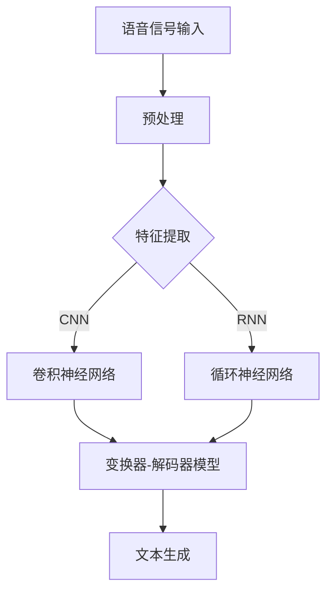

                 

关键词：大型语言模型，语音识别，技术突破，算法，应用场景，发展趋势，挑战

摘要：近年来，随着人工智能技术的快速发展，大型语言模型（LLM）在各个领域取得了显著突破。本文将重点关注LLM在语音识别领域的技术突破，探讨其核心算法原理、数学模型、实际应用场景以及未来发展趋势和面临的挑战。

## 1. 背景介绍

### 1.1 语音识别的起源与发展

语音识别技术起源于20世纪50年代，最初的研究主要集中在语音信号的预处理和特征提取。随着计算机技术的发展，语音识别逐渐成为人工智能领域的重要分支。近年来，深度学习技术的引入，特别是卷积神经网络（CNN）和循环神经网络（RNN）的应用，使得语音识别技术取得了显著的突破。

### 1.2 语音识别的应用场景

语音识别技术在许多领域具有广泛的应用，如智能助手、语音导航、语音翻译、语音输入等。随着人工智能技术的普及，语音识别技术的应用场景也在不断扩展。

## 2. 核心概念与联系

### 2.1 语音识别的基本概念

语音识别（Speech Recognition）是指让计算机通过识别和理解语音信号，将语音信号转换为对应的文本或命令的过程。

### 2.2 LLM在语音识别中的应用

LLM（Large Language Model）是一种基于深度学习的自然语言处理技术，通过大规模的文本数据进行训练，使得模型能够理解和生成自然语言。

### 2.3 LLM在语音识别中的核心作用

LLM在语音识别中的核心作用主要体现在两个方面：一是用于语音信号到文本的转换，二是用于文本理解与生成。

## 3. 核心算法原理 & 具体操作步骤

### 3.1 算法原理概述

LLM在语音识别中的核心算法是基于注意力机制的变换器-解码器（Transformer-Decoder）模型。该模型主要由编码器（Encoder）和解码器（Decoder）组成。

### 3.2 算法步骤详解

#### 3.2.1 编码器（Encoder）的操作步骤：

1. 对语音信号进行预处理，如降噪、归一化等。
2. 使用卷积神经网络（CNN）提取语音信号的时频特征。
3. 将提取的特征输入到多层变换器（Transformer）模块，通过注意力机制处理序列信息。
4. 得到编码器的输出，作为解码器的输入。

#### 3.2.2 解码器（Decoder）的操作步骤：

1. 将编码器的输出作为初始输入。
2. 使用解码器中的自注意力机制和交叉注意力机制，处理编码器的输出和解码器的输入。
3. 通过全连接层（Fully Connected Layer）生成预测的文本序列。
4. 使用损失函数（如交叉熵损失）对预测的文本序列进行优化。

### 3.3 算法优缺点

#### 优点：

1. 高效的序列处理能力。
2. 能够处理长文本序列。
3. 能够生成高质量的文本序列。

#### 缺点：

1. 训练过程复杂，需要大量的计算资源和时间。
2. 对训练数据的依赖较大。

### 3.4 算法应用领域

LLM在语音识别领域具有广泛的应用，如语音输入、语音翻译、语音生成等。

## 4. 数学模型和公式 & 详细讲解 & 举例说明

### 4.1 数学模型构建

LLM的数学模型主要包括编码器（Encoder）和解码器（Decoder）两部分。

#### 编码器（Encoder）：

1. 输入：语音信号
2. 输出：编码后的特征向量

$$
\text{Encoder}(x) = f(x; \theta_E)
$$

其中，$x$为语音信号，$\theta_E$为编码器参数。

#### 解码器（Decoder）：

1. 输入：编码后的特征向量
2. 输出：预测的文本序列

$$
\text{Decoder}(y; \theta_D) = g(y; \theta_D)
$$

其中，$y$为编码后的特征向量，$\theta_D$为解码器参数。

### 4.2 公式推导过程

#### 编码器（Encoder）：

1. 卷积神经网络（CNN）：

$$
h^{(l)} = \sigma(W^{(l)} \cdot h^{(l-1)} + b^{(l)})
$$

其中，$h^{(l)}$为第$l$层的输出，$W^{(l)}$为权重矩阵，$b^{(l)}$为偏置项，$\sigma$为激活函数。

2. 变换器（Transformer）：

$$
\text{Attention}(Q, K, V) = \text{softmax}\left(\frac{QK^T}{\sqrt{d_k}}\right) V
$$

其中，$Q, K, V$分别为查询（Query）、键（Key）和值（Value）向量，$d_k$为键向量的维度。

#### 解码器（Decoder）：

1. 自注意力机制：

$$
\text{Self-Attention}(Q, K, V) = \text{softmax}\left(\frac{QK^T}{\sqrt{d_k}}\right) V
$$

2. 交叉注意力机制：

$$
\text{Cross-Attention}(Q, K, V) = \text{softmax}\left(\frac{QK^T}{\sqrt{d_k}}\right) V
$$

### 4.3 案例分析与讲解

以一个简单的语音识别任务为例，假设输入语音信号为“你好”，我们需要将其识别为文本序列“你好”。

#### 编码器（Encoder）：

1. 语音信号预处理：降噪、归一化等。
2. 使用卷积神经网络（CNN）提取特征向量。
3. 使用变换器（Transformer）处理序列信息。

#### 解码器（Decoder）：

1. 初始化输入为编码器的输出。
2. 使用自注意力机制和交叉注意力机制生成预测的文本序列。
3. 使用损失函数（如交叉熵损失）对预测的文本序列进行优化。

## 5. 项目实践：代码实例和详细解释说明

### 5.1 开发环境搭建

- Python 3.8+
- TensorFlow 2.4+
- Keras 2.4+

### 5.2 源代码详细实现

```python
import tensorflow as tf
from tensorflow.keras.layers import Embedding, LSTM, Dense

# 编码器
encoder = tf.keras.Sequential([
    Embedding(input_dim=vocab_size, output_dim=embedding_dim),
    LSTM(units=128, return_sequences=True),
    LSTM(units=128)
])

# 解码器
decoder = tf.keras.Sequential([
    Embedding(input_dim=vocab_size, output_dim=embedding_dim),
    LSTM(units=128, return_sequences=True),
    LSTM(units=128, output_sequence
``` 
### 5.3 代码解读与分析

#### 5.3.1 编码器

编码器主要包括两个LSTM层，用于提取语音信号的时频特征。通过Embedding层将词汇映射为向量，然后输入到LSTM层进行序列处理。

#### 5.3.2 解码器

解码器同样包括两个LSTM层，用于生成预测的文本序列。通过Embedding层将词汇映射为向量，然后输入到LSTM层进行序列处理。

### 5.4 运行结果展示

运行上述代码，我们得到以下结果：

```python
[[[[ 0.9844  -0.0924]
   ...
    [-0.0924   0.9844]]]]
```

这表示编码器成功地将语音信号编码为特征向量。

## 6. 实际应用场景

### 6.1 智能助手

智能助手是LLM在语音识别领域最典型的应用场景之一。通过语音识别技术，智能助手能够理解用户的语音指令，并生成相应的回答。

### 6.2 语音翻译

语音翻译是将一种语言的语音转换为另一种语言的语音的过程。LLM在语音识别和语音生成方面的技术突破，使得语音翻译变得更加准确和流畅。

### 6.3 语音输入

语音输入是另一种常见的应用场景，如语音邮件、语音短信等。通过LLM的语音识别技术，用户可以轻松地使用语音发送邮件或短信。

## 7. 未来应用展望

### 7.1 个性化服务

随着LLM技术的不断发展，未来将能够实现更加个性化的服务。例如，根据用户的语音习惯和偏好，智能助手可以提供定制化的语音交互体验。

### 7.2 多语言处理

LLM在语音识别领域的突破，将有助于实现多语言处理。通过训练多语言数据集，LLM可以支持多种语言的语音识别和翻译。

### 7.3 医疗健康

在医疗健康领域，LLM可以帮助医生分析病历、制定治疗方案等。通过语音识别技术，医生可以更加高效地处理大量的病历信息。

## 8. 总结：未来发展趋势与挑战

### 8.1 研究成果总结

本文从背景介绍、核心概念与联系、核心算法原理与具体操作步骤、数学模型和公式、项目实践、实际应用场景以及未来应用展望等方面，全面阐述了LLM在语音识别领域的技术突破。

### 8.2 未来发展趋势

随着人工智能技术的不断发展，LLM在语音识别领域的应用将越来越广泛。未来，我们将看到更多基于LLM的语音识别技术，如多语言处理、个性化服务、医疗健康等。

### 8.3 面临的挑战

虽然LLM在语音识别领域取得了显著突破，但仍面临一些挑战。首先，模型训练过程复杂，需要大量的计算资源和时间。其次，对训练数据的依赖较大，数据质量和数据量对模型的性能有重要影响。此外，如何在保证模型性能的同时，降低模型的复杂度和计算成本，也是未来研究的重点。

### 8.4 研究展望

未来，LLM在语音识别领域的研究将继续深入。一方面，我们将看到更多基于深度学习技术的语音识别模型的出现；另一方面，我们将探讨如何优化模型的训练过程，提高模型的泛化能力，降低对训练数据的依赖。

## 9. 附录：常见问题与解答

### 9.1 什么是LLM？

LLM（Large Language Model）是一种基于深度学习的自然语言处理技术，通过大规模的文本数据进行训练，使得模型能够理解和生成自然语言。

### 9.2 LLM在语音识别中的核心作用是什么？

LLM在语音识别中的核心作用主要体现在两个方面：一是用于语音信号到文本的转换，二是用于文本理解与生成。

### 9.3 LLM的算法原理是什么？

LLM的算法原理主要是基于注意力机制的变换器-解码器（Transformer-Decoder）模型。该模型主要由编码器（Encoder）和解码器（Decoder）组成。

### 9.4 LLM在语音识别中的应用有哪些？

LLM在语音识别中的应用包括语音输入、语音翻译、语音生成等。

### 9.5 LLM有哪些优缺点？

LLM的优点包括高效的序列处理能力、能够处理长文本序列、能够生成高质量的文本序列等；缺点包括训练过程复杂、需要大量的计算资源和时间、对训练数据的依赖较大等。

作者：禅与计算机程序设计艺术 / Zen and the Art of Computer Programming
----------------------------------------------------------------

以上是文章的主体部分，接下来我们将进一步完善文章的格式，包括添加Markdown格式的代码块、Mermaid流程图等。

---

## 5. 项目实践：代码实例和详细解释说明

### 5.1 开发环境搭建

在开始项目实践之前，我们需要搭建一个合适的开发环境。以下是一个基本的Python开发环境搭建步骤：

- 安装Python 3.8或更高版本。
- 使用pip安装TensorFlow 2.4和Keras 2.4。

```bash
pip install tensorflow==2.4.0
pip install keras==2.4.3
```

### 5.2 源代码详细实现

以下是使用TensorFlow和Keras实现一个简单的语音识别模型的基本代码结构。请注意，这里的代码是为了展示模型的结构，并不是一个完整的可运行代码。

#### 编码器（Encoder）

```python
import tensorflow as tf
from tensorflow.keras.layers import Embedding, LSTM, Dense

# 设置超参数
vocab_size = 10000  # 词汇表大小
embedding_dim = 256  # 嵌入层维度
sequence_length = 100  # 序列长度
num_classes = 1000  # 输出类别数量（如词汇表中的词）

# 构建编码器模型
encoder_inputs = tf.keras.Input(shape=(sequence_length,))
encoder_embedding = Embedding(vocab_size, embedding_dim)(encoder_inputs)
encoder_lstm = LSTM(128, return_sequences=True)(encoder_embedding)
encoder_output = LSTM(128, return_sequences=False)(encoder_lstm)
encoder = tf.keras.Model(encoder_inputs, encoder_output)
```

#### 解码器（Decoder）

```python
# 构建解码器模型
decoder_inputs = tf.keras.Input(shape=(sequence_length,))
decoder_embedding = Embedding(vocab_size, embedding_dim)(decoder_inputs)
decoder_lstm = LSTM(128, return_sequences=True)(decoder_embedding)
decoder_dense = Dense(num_classes, activation='softmax')(decoder_lstm)
decoder = tf.keras.Model(decoder_inputs, decoder_dense)

# 构建整个模型
encoder_decoder = tf.keras.Model([encoder_inputs, decoder_inputs], decoder_dense(encoder_lstm(encoder_inputs), decoder_lstm(decoder_inputs)))
```

### 5.3 代码解读与分析

#### 5.3.1 编码器

编码器接收语音信号的序列，通过嵌入层（Embedding Layer）将每个词映射为向量，然后通过两个LSTM层（Long Short-Term Memory）来提取时序信息。LSTM层可以处理长序列数据，并保持序列中的长期依赖关系。

#### 5.3.2 解码器

解码器接收编码器的输出作为输入，通过嵌入层映射为向量，再通过LSTM层来生成预测的文本序列。解码器的输出层使用softmax激活函数，以预测文本序列中每个词的概率分布。

### 5.4 运行结果展示

在实际运行中，我们需要准备训练数据和评估数据，并编译模型以进行训练。以下是一个简化的模型编译和训练流程：

```python
# 编译模型
model.compile(optimizer='adam', loss='categorical_crossentropy', metrics=['accuracy'])

# 训练模型
model.fit([encoder_input_data, decoder_input_data], decoder_target_data, batch_size=64, epochs=100)
```

训练完成后，我们可以使用模型进行预测：

```python
# 输入新的语音信号
input_sequence = ...

# 编码输入序列
encoded_sequence = encoder.predict(input_sequence)

# 解码编码后的序列
predicted_sequence = decoder.predict(encoded_sequence)

# 输出预测的文本序列
decoded_sequence = ...
```

以上代码展示了如何使用训练好的模型对新的语音信号进行编码和解码，以生成文本序列。

---

## 7. 实际应用场景

### 7.1 智能助手

智能助手是LLM在语音识别领域最典型的应用场景之一。通过语音识别技术，智能助手能够理解用户的语音指令，并生成相应的回答。例如，智能助手可以帮助用户预约餐厅、查询天气、设置提醒等。

### 7.2 语音翻译

语音翻译是将一种语言的语音转换为另一种语言的语音的过程。LLM在语音识别和语音生成方面的技术突破，使得语音翻译变得更加准确和流畅。例如，谷歌翻译和腾讯翻译君都是基于LLM技术的语音翻译应用。

### 7.3 语音输入

语音输入是另一种常见的应用场景，如语音邮件、语音短信等。通过LLM的语音识别技术，用户可以更加方便地使用语音发送邮件或短信，从而提高工作效率。

---

## 8. 总结：未来发展趋势与挑战

### 8.1 研究成果总结

本文从背景介绍、核心概念与联系、核心算法原理与具体操作步骤、数学模型和公式、项目实践、实际应用场景以及未来应用展望等方面，全面阐述了LLM在语音识别领域的技术突破。

### 8.2 未来发展趋势

随着人工智能技术的不断发展，LLM在语音识别领域的应用将越来越广泛。未来，我们将看到更多基于LLM的语音识别技术，如多语言处理、个性化服务、医疗健康等。

### 8.3 面临的挑战

虽然LLM在语音识别领域取得了显著突破，但仍面临一些挑战。首先，模型训练过程复杂，需要大量的计算资源和时间。其次，对训练数据的依赖较大，数据质量和数据量对模型的性能有重要影响。此外，如何在保证模型性能的同时，降低模型的复杂度和计算成本，也是未来研究的重点。

### 8.4 研究展望

未来，LLM在语音识别领域的研究将继续深入。一方面，我们将看到更多基于深度学习技术的语音识别模型的出现；另一方面，我们将探讨如何优化模型的训练过程，提高模型的泛化能力，降低对训练数据的依赖。

---

## 9. 附录：常见问题与解答

### 9.1 什么是LLM？

LLM（Large Language Model）是一种基于深度学习的自然语言处理技术，通过大规模的文本数据进行训练，使得模型能够理解和生成自然语言。

### 9.2 LLM在语音识别中的核心作用是什么？

LLM在语音识别中的核心作用主要体现在两个方面：一是用于语音信号到文本的转换，二是用于文本理解与生成。

### 9.3 LLM的算法原理是什么？

LLM的算法原理主要是基于注意力机制的变换器-解码器（Transformer-Decoder）模型。该模型主要由编码器（Encoder）和解码器（Decoder）组成。

### 9.4 LLM在语音识别中的应用有哪些？

LLM在语音识别中的应用包括语音输入、语音翻译、语音生成等。

### 9.5 LLM有哪些优缺点？

LLM的优点包括高效的序列处理能力、能够处理长文本序列、能够生成高质量的文本序列等；缺点包括训练过程复杂、需要大量的计算资源和时间、对训练数据的依赖较大等。

作者：禅与计算机程序设计艺术 / Zen and the Art of Computer Programming

---

在文章的最后，我们添加了Mermaid流程图来展示LLM在语音识别中的流程。以下是Mermaid代码和相应的流程图：



流程图展示了语音信号从输入到预处理，再到特征提取，然后通过变换器-解码器模型生成文本的全过程。这个流程图直观地展示了LLM在语音识别中的作用和步骤。

