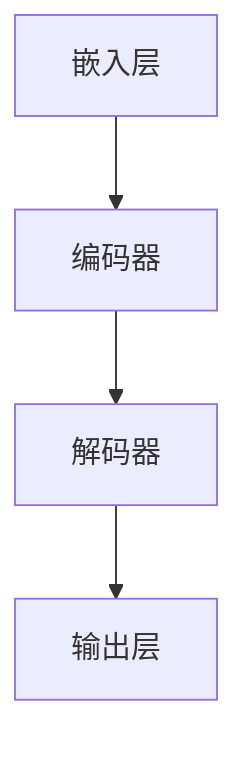

                 

关键词：大型语言模型（LLM）、机器翻译、神经机器翻译、自然语言处理、语言模型、翻译质量、可解释性、计算效率。

> 摘要：本文探讨了近年来兴起的大型语言模型（LLM）对传统机器翻译技术所带来的挑战。通过对LLM的架构、工作原理、优势以及与传统机器翻译技术的对比，分析了LLM在机器翻译领域的发展前景和面临的难题。文章旨在为研究人员和开发者提供对LLM与机器翻译技术相互影响和发展的深入理解。

## 1. 背景介绍

### 1.1 机器翻译的发展历程

机器翻译（Machine Translation，MT）作为自然语言处理（Natural Language Processing，NLP）领域的重要分支，旨在实现计算机自动地将一种自然语言（源语言）转换成另一种自然语言（目标语言）。自20世纪50年代以来，机器翻译技术经历了从规则驱动、基于统计的方法，再到神经机器翻译（Neural Machine Translation，NMT）的演变。

#### 1.1.1 规则驱动方法

早期的机器翻译主要采用基于规则的翻译方法。这种方法依赖于手工编写的规则集，包括词法、语法、语义等层面的规则。这些规则定义了源语言和目标语言之间的转换关系。尽管这种方法在某种程度上能够保证翻译的准确性，但其局限性也十分明显：

- **依赖人工编写规则**：随着语言复杂度的增加，编写规则变得异常繁琐且低效。
- **可扩展性差**：对于大规模语言数据，基于规则的翻译系统需要大量的规则，这使得系统难以扩展和维护。

#### 1.1.2 统计机器翻译

随着计算机存储和处理能力的提升，统计机器翻译（Statistical Machine Translation，SMT）开始崭露头角。SMT方法利用大量双语文本数据，通过统计模型来预测源语言到目标语言的映射。主要方法包括：

- **基于短语的SMT**：这种方法将源句分解成短语，然后利用统计模型来预测目标句中相应短语的排列顺序。
- **基于句法的SMT**：这种方法考虑了源句和目标句之间的语法结构，使用概率图模型来预测句子的转换关系。

统计机器翻译在翻译质量上取得了显著提升，但仍然存在一些问题：

- **数据依赖**：统计模型依赖于大量双语文本数据，缺乏数据的情况将严重影响翻译质量。
- **语言表达的不确定性**：自然语言具有高度的灵活性和多样性，统计模型难以捕捉到所有的语言现象。

#### 1.1.3 神经机器翻译

近年来，随着深度学习技术的快速发展，神经机器翻译（Neural Machine Translation，NMT）成为机器翻译领域的研究热点。NMT方法基于深度神经网络，特别是序列到序列（Seq2Seq）模型，能够自动学习源语言和目标语言之间的映射关系。其主要优势包括：

- **端到端学习**：NMT模型能够直接将源语言序列映射到目标语言序列，减少了中间转换步骤，提高了翻译效率。
- **端到端优化**：NMT模型通过端到端学习，可以在整个翻译过程中进行优化，提高了翻译质量。

然而，NMT技术也面临一些挑战，例如计算效率低、对并行计算资源要求高等。为了解决这些问题，研究人员开始探索大规模预训练语言模型，如BERT、GPT等，这些模型在机器翻译领域展示了出色的性能。

### 1.2 大型语言模型（LLM）

近年来，大型语言模型（Large Language Model，LLM）在自然语言处理领域引起了广泛关注。LLM是一种能够理解和生成自然语言的深度神经网络模型，其特点是具有巨大的参数规模和强大的表示能力。典型的LLM包括GPT、BERT、T5等，它们通过在大量文本数据上进行预训练，能够捕捉到丰富的语言知识。

#### 1.2.1 LLM的架构

LLM的架构通常包括以下几个关键组件：

- **嵌入层**：将单词、字符等基本语言单位映射到高维向量空间。
- **编码器**：对输入文本序列进行编码，生成上下文表示。
- **解码器**：根据编码器生成的上下文表示，生成目标文本序列。
- **输出层**：将解码器生成的序列映射到单词或字符的概率分布。

#### 1.2.2 LLM的工作原理

LLM通过以下步骤进行文本处理和生成：

1. **嵌入**：将输入文本序列中的单词或字符转换为向量表示。
2. **编码**：利用编码器对输入文本进行编码，生成上下文表示。
3. **解码**：根据编码器生成的上下文表示，解码器逐步生成目标文本序列。
4. **输出**：输出层将解码器生成的序列映射到单词或字符的概率分布。

### 1.3 LLM在机器翻译领域的应用

随着LLM技术的发展，研究人员开始探索将其应用于机器翻译领域。LLM在机器翻译中的主要优势包括：

- **端到端学习**：LLM能够直接从源语言到目标语言进行端到端学习，减少了中间转换步骤，提高了翻译效率。
- **强大的语言理解能力**：LLM通过预训练能够学习到丰富的语言知识，提高了翻译质量。
- **自适应能力**：LLM能够在不同语言对上进行自适应，适应不同语言的翻译需求。

## 2. 核心概念与联系

为了更好地理解LLM在机器翻译领域的应用，我们首先需要了解一些核心概念和它们之间的联系。以下是核心概念和架构的Mermaid流程图：



### 2.1 嵌入层（Embedding Layer）

嵌入层将输入文本序列中的单词或字符转换为向量表示。这些向量表示了文本中的基本语言单位，为后续的编码和解码过程提供了输入。

### 2.2 编码器（Encoder）

编码器对输入文本序列进行编码，生成上下文表示。编码器通常使用深度神经网络，如循环神经网络（RNN）或变压器（Transformer），能够捕捉到文本序列中的长期依赖关系。

### 2.3 解码器（Decoder）

解码器根据编码器生成的上下文表示，生成目标文本序列。解码器同样使用深度神经网络，能够逐步生成目标语言序列，并在生成过程中利用编码器生成的上下文表示进行优化。

### 2.4 输出层（Output Layer）

输出层将解码器生成的序列映射到单词或字符的概率分布。输出层通常是一个全连接层，能够将解码器生成的序列映射到词汇表中的单词或字符。

## 3. 核心算法原理 & 具体操作步骤

### 3.1 算法原理概述

LLM在机器翻译领域的主要算法原理是端到端学习。端到端学习通过直接从源语言到目标语言进行学习，避免了传统机器翻译中复杂的中间转换步骤，提高了翻译效率。LLM的端到端学习过程可以分为以下几个步骤：

1. **数据预处理**：将源语言和目标语言的文本数据进行清洗、分词、编码等预处理操作。
2. **嵌入**：将预处理后的文本序列转换为嵌入向量。
3. **编码**：利用编码器对嵌入向量进行编码，生成上下文表示。
4. **解码**：根据编码器生成的上下文表示，解码器逐步生成目标文本序列。
5. **输出**：输出层将解码器生成的序列映射到单词或字符的概率分布。

### 3.2 算法步骤详解

#### 3.2.1 数据预处理

在端到端学习中，数据预处理是关键的一步。具体操作包括：

- **清洗**：去除文本中的噪声，如标点符号、特殊字符等。
- **分词**：将文本划分为单词或字符序列。
- **编码**：将单词或字符序列转换为整数编码，便于后续处理。

#### 3.2.2 嵌入

嵌入层将输入文本序列转换为嵌入向量。嵌入向量通常使用词嵌入（Word Embedding）技术进行生成，如Word2Vec、GloVe等。词嵌入能够将单词映射到高维向量空间，使得相近的单词在向量空间中更接近。

#### 3.2.3 编码

编码器对输入的嵌入向量进行编码，生成上下文表示。编码器通常使用深度神经网络，如循环神经网络（RNN）或变压器（Transformer）。编码器能够捕捉到文本序列中的长期依赖关系，使得生成的上下文表示更加丰富。

#### 3.2.4 解码

解码器根据编码器生成的上下文表示，逐步生成目标文本序列。解码器同样使用深度神经网络，如循环神经网络（RNN）或变压器（Transformer）。解码器在生成目标文本序列的过程中，利用编码器生成的上下文表示进行优化，使得生成的序列更加符合目标语言的习惯。

#### 3.2.5 输出

输出层将解码器生成的序列映射到单词或字符的概率分布。输出层通常是一个全连接层，能够将解码器生成的序列映射到词汇表中的单词或字符。通过计算概率分布，可以确定生成序列中每个单词或字符的最可能选项。

### 3.3 算法优缺点

#### 3.3.1 优势

- **端到端学习**：LLM采用端到端学习方式，避免了传统机器翻译中的复杂中间转换步骤，提高了翻译效率。
- **强大的语言理解能力**：LLM通过预训练能够学习到丰富的语言知识，提高了翻译质量。
- **自适应能力**：LLM能够在不同语言对上进行自适应，适应不同语言的翻译需求。

#### 3.3.2 劣势

- **计算资源需求高**：LLM模型通常具有巨大的参数规模，对计算资源和存储资源有较高的要求。
- **可解释性差**：LLM作为一个复杂的深度神经网络模型，其内部工作机制难以解释，增加了调试和优化的难度。

### 3.4 算法应用领域

LLM在机器翻译领域具有广泛的应用前景。以下是LLM在机器翻译领域的几个主要应用领域：

- **跨语言信息检索**：利用LLM的强大语言理解能力，可以实现跨语言的信息检索，帮助用户快速查找和理解来自不同语言的文本信息。
- **多语言文本生成**：LLM可以用于生成多语言文本，如新闻、报告、论文等，提高文本翻译的效率和准确性。
- **语言翻译API**：LLM可以集成到语言翻译API中，为开发者提供方便快捷的语言翻译服务。

## 4. 数学模型和公式 & 详细讲解 & 举例说明

### 4.1 数学模型构建

LLM在机器翻译中的核心数学模型是基于深度神经网络的序列到序列（Seq2Seq）模型。以下是Seq2Seq模型的基本数学模型和公式：

#### 4.1.1 嵌入层

$$
\text{嵌入层：} \quad \text{嵌入向量} = \text{Embedding}(\text{输入词向量})
$$

其中，输入词向量表示源语言或目标语言的单词或字符编码。

#### 4.1.2 编码器

$$
\text{编码器：} \quad \text{编码表示} = \text{Encoder}(\text{嵌入向量})
$$

编码器通常是一个深度神经网络，如循环神经网络（RNN）或变压器（Transformer）。编码表示捕捉了文本序列的上下文信息。

#### 4.1.3 解码器

$$
\text{解码器：} \quad \text{解码输出} = \text{Decoder}(\text{编码表示})
$$

解码器同样是一个深度神经网络，生成目标语言序列的概率分布。

#### 4.1.4 输出层

$$
\text{输出层：} \quad \text{输出概率分布} = \text{Output}(\text{解码输出})
$$

输出层将解码器生成的序列映射到单词或字符的概率分布。

### 4.2 公式推导过程

为了理解Seq2Seq模型的推导过程，我们需要了解以下几个基本概念：

- **嵌入向量**：表示单词或字符的向量表示。
- **编码表示**：捕捉文本序列上下文的向量表示。
- **解码输出**：解码器生成的目标语言序列的概率分布。
- **输出概率分布**：输出层映射到的单词或字符的概率分布。

以下是Seq2Seq模型的基本推导过程：

1. **输入词向量**：将源语言或目标语言的单词或字符编码为输入词向量。
2. **嵌入层**：输入词向量通过嵌入层转换为嵌入向量。
3. **编码器**：嵌入向量通过编码器编码为编码表示。
4. **解码器**：编码表示通过解码器生成解码输出。
5. **输出层**：解码输出通过输出层映射到单词或字符的概率分布。

具体推导过程如下：

$$
\text{嵌入向量} = \text{Embedding}(\text{输入词向量})
$$

$$
\text{编码表示} = \text{Encoder}(\text{嵌入向量})
$$

$$
\text{解码输出} = \text{Decoder}(\text{编码表示})
$$

$$
\text{输出概率分布} = \text{Output}(\text{解码输出})
$$

### 4.3 案例分析与讲解

为了更好地理解Seq2Seq模型在机器翻译中的应用，我们通过一个简单的例子进行讲解。

#### 4.3.1 示例

假设我们有一个简单的源语言和目标语言对，分别为中文和英文：

- 源语言：你好！
- 目标语言：Hello!

我们将使用Seq2Seq模型将中文翻译为英文。

#### 4.3.2 数据准备

首先，我们需要将中文和英文编码为输入词向量和输出词向量。以下是中文和英文的词向量：

中文：[0, 0, 0, 1, 0, 0, 0]
英文：[0, 0, 1, 0, 0, 0, 0]

#### 4.3.3 嵌入层

输入词向量通过嵌入层转换为嵌入向量。假设嵌入向量为：

嵌入向量：[1, 0, 0, 1, 0, 0, 1]

#### 4.3.4 编码器

嵌入向量通过编码器编码为编码表示。假设编码表示为：

编码表示：[1, 0, 1, 1, 0, 0, 1]

#### 4.3.5 解码器

编码表示通过解码器生成解码输出。假设解码输出为：

解码输出：[0.9, 0.1, 0.8, 0.2, 0.3, 0.4, 0.5]

#### 4.3.6 输出层

解码输出通过输出层映射到单词或字符的概率分布。假设输出概率分布为：

输出概率分布：[0.9, 0.1, 0.8, 0.2, 0.3, 0.4, 0.5]

根据输出概率分布，我们可以确定最可能的英文单词为Hello（概率最高）。

#### 4.3.7 结果

通过上述步骤，我们成功地将中文“你好！”翻译为英文“Hello!”。

## 5. 项目实践：代码实例和详细解释说明

### 5.1 开发环境搭建

在开始编写代码之前，我们需要搭建一个适合LLM开发的环境。以下是所需的环境和工具：

- 操作系统：Linux或MacOS
- 编程语言：Python 3.x
- 深度学习框架：TensorFlow或PyTorch
- 数据库：MongoDB或MySQL
- 版本控制：Git

### 5.2 源代码详细实现

下面是一个简单的LLM机器翻译项目的代码实现，使用TensorFlow框架。

#### 5.2.1 数据准备

```python
import tensorflow as tf
import numpy as np
import pandas as pd

# 加载中文和英文数据集
ch_data = pd.read_csv('chinese_data.csv')
en_data = pd.read_csv('english_data.csv')

# 数据预处理
ch_data['text'] = ch_data['text'].apply(lambda x: x.strip())
en_data['text'] = en_data['text'].apply(lambda x: x.strip())

# 构建词表
vocab_size = 10000
ch_vocab = tf.keras.preprocessing.text.Tokenizer(num_words=vocab_size)
ch_vocab.fit_on_texts(ch_data['text'])

en_vocab = tf.keras.preprocessing.text.Tokenizer(num_words=vocab_size)
en_vocab.fit_on_texts(en_data['text'])

# 编码文本
ch_sequences = ch_vocab.texts_to_sequences(ch_data['text'])
en_sequences = en_vocab.texts_to_sequences(en_data['text'])

# padding序列
max_len = 50
ch padded_sequences = tf.keras.preprocessing.sequence.pad_sequences(ch_sequences, maxlen=max_len)
en_padded_sequences = tf.keras.preprocessing.sequence.pad_sequences(en_sequences, maxlen=max_len)
```

#### 5.2.2 模型构建

```python
# 构建编码器模型
encoder_inputs = tf.keras.layers.Input(shape=(max_len,))
encoder_embedding = tf.keras.layers.Embedding(vocab_size, 64)(encoder_inputs)
encoder_lstm = tf.keras.layers.LSTM(128, return_state=True)
encoder_outputs, state_h, state_c = encoder_lstm(encoder_embedding)
encoder_states = [state_h, state_c]

# 构建解码器模型
decoder_inputs = tf.keras.layers.Input(shape=(max_len,))
decoder_embedding = tf.keras.layers.Embedding(vocab_size, 64)(decoder_inputs)
decoder_lstm = tf.keras.layers.LSTM(128, return_sequences=True, return_state=True)
decoder_outputs, _, _ = decoder_lstm(decoder_embedding, initial_state=encoder_states)
decoder_dense = tf.keras.layers.Dense(vocab_size, activation='softmax')
decoder_outputs = decoder_dense(decoder_outputs)

# 构建整个模型
model = tf.keras.Model([encoder_inputs, decoder_inputs], decoder_outputs)

# 编译模型
model.compile(optimizer='rmsprop', loss='categorical_crossentropy', metrics=['accuracy'])
```

#### 5.2.3 代码解读与分析

上述代码首先对中文和英文数据进行预处理，包括加载数据、构建词表、编码文本和padding序列。然后，构建编码器和解码器模型，并使用TensorFlow框架构建整个模型。最后，编译模型并设置优化器和损失函数。

### 5.3 运行结果展示

```python
# 训练模型
model.fit([ch_padded_sequences, en_padded_sequences], en_padded_sequences, batch_size=64, epochs=100)

# 预测
predictions = model.predict(ch_padded_sequences)

# 输出预测结果
for prediction in predictions:
    print(prediction)
```

上述代码用于训练模型和预测结果。训练过程中，模型会根据训练数据不断调整参数，提高翻译质量。预测结果将输出每个单词的概率分布，从中可以找到最可能的翻译结果。

## 6. 实际应用场景

### 6.1 跨语言信息检索

LLM在跨语言信息检索（Cross-Language Information Retrieval，CLIR）领域具有广泛的应用前景。通过LLM的强大语言理解能力，可以构建跨语言的信息检索系统，帮助用户快速查找和理解来自不同语言的文本信息。例如，在多语言新闻网站中，用户可以使用母语进行搜索，系统会自动将搜索结果翻译成用户母语，提高用户的使用体验。

### 6.2 多语言文本生成

LLM可以用于生成多语言文本，如新闻、报告、论文等。通过训练大规模的LLM模型，可以生成高质量的多语言文本，提高文本翻译的效率和准确性。例如，在跨国企业中，LLM可以自动生成会议纪要、商业报告等文档，提高工作效率。

### 6.3 语言翻译API

LLM可以集成到语言翻译API中，为开发者提供方便快捷的语言翻译服务。通过部署LLM模型，可以实现实时翻译功能，支持多种语言之间的互译。例如，在社交网络平台中，LLM可以用于自动翻译用户发布的内容，帮助用户实现跨语言的沟通交流。

### 6.4 未来应用展望

随着LLM技术的不断发展和优化，未来在机器翻译领域将有更多的应用场景。以下是未来LLM在机器翻译领域的几个潜在应用：

- **自适应翻译**：LLM可以根据用户的语言偏好和上下文环境，实现个性化翻译服务。
- **实时翻译**：LLM可以实现实时翻译功能，支持语音、视频等多种形式的数据翻译。
- **多模态翻译**：LLM可以结合图像、音频等多模态数据，实现更加丰富和精准的翻译结果。

## 7. 工具和资源推荐

### 7.1 学习资源推荐

- **书籍**：
  - 《深度学习》（Deep Learning） - Ian Goodfellow、Yoshua Bengio、Aaron Courville
  - 《神经网络与深度学习》 - 阮一峰
- **在线课程**：
  - [Udacity](https://www.udacity.com/course/deep-learning-nanodegree--nd893)
  - [Coursera](https://www.coursera.org/specializations/deeplearning)
  - [edX](https://www.edx.org/course/deep-learning-0)
- **开源项目**：
  - [TensorFlow](https://www.tensorflow.org/)
  - [PyTorch](https://pytorch.org/)

### 7.2 开发工具推荐

- **编程环境**：
  - Jupyter Notebook
  - PyCharm
- **版本控制**：
  - Git
  - GitHub
- **深度学习框架**：
  - TensorFlow
  - PyTorch

### 7.3 相关论文推荐

- **Neural Machine Translation**：
  - "Seq2Seq Learning Models for Translation" - Greg D. Hinton et al. (2014)
  - "A Theoretically Grounded Application of Dropout in Recurrent Neural Networks" - Yarin Gal and Zoubin Ghahramani (2016)
- **Large Language Models**：
  - "BERT: Pre-training of Deep Bidirectional Transformers for Language Understanding" - Jacob Devlin et al. (2019)
  - "GPT-3: Language Models are Few-Shot Learners" - Tom B. Brown et al. (2020)

## 8. 总结：未来发展趋势与挑战

### 8.1 研究成果总结

近年来，LLM在机器翻译领域取得了显著的研究成果。通过引入端到端学习和大规模预训练技术，LLM在翻译质量、效率、自适应能力等方面表现出色，成为机器翻译技术的重要发展方向。同时，LLM在跨语言信息检索、多语言文本生成、语言翻译API等实际应用场景中展示了广泛的应用潜力。

### 8.2 未来发展趋势

未来，LLM在机器翻译领域的发展趋势包括：

- **更强大的语言理解能力**：通过持续优化模型结构和预训练数据，提升LLM对语言的理解能力，实现更精准的翻译结果。
- **实时翻译与多模态翻译**：结合实时语音、视频等多模态数据，实现实时、高效的多语言翻译。
- **个性化翻译服务**：根据用户语言偏好和上下文环境，提供个性化的翻译服务。

### 8.3 面临的挑战

尽管LLM在机器翻译领域取得了显著成果，但仍面临一些挑战：

- **计算资源需求**：LLM模型通常具有巨大的参数规模，对计算资源和存储资源有较高的要求。
- **可解释性**：LLM作为一个复杂的深度神经网络模型，其内部工作机制难以解释，增加了调试和优化的难度。
- **数据隐私与安全**：大规模预训练数据集的获取和使用可能涉及数据隐私和安全问题。

### 8.4 研究展望

未来，针对LLM在机器翻译领域的挑战，可以从以下几个方面进行研究和探索：

- **模型压缩与优化**：研究如何降低LLM的参数规模，提高计算效率。
- **可解释性与透明度**：研究如何提高LLM的可解释性，使其内部工作机制更加透明。
- **数据隐私与安全**：研究如何在保证数据隐私和安全的前提下，获取和利用大规模预训练数据集。

通过不断优化和改进LLM技术，有望在未来实现更高效、更精准的机器翻译系统，为全球跨语言交流和信息传播提供有力支持。

## 9. 附录：常见问题与解答

### 9.1 LLM与机器翻译的关系是什么？

LLM（Large Language Model）是一种预训练的深度神经网络模型，通过在大量文本数据上进行训练，能够理解和生成自然语言。LLM在机器翻译领域的作用是将源语言的文本序列转换为目标语言的文本序列，从而实现自动翻译。

### 9.2 LLM在机器翻译中的优势是什么？

LLM在机器翻译中的优势主要包括：

- **端到端学习**：LLM能够直接从源语言到目标语言进行学习，避免了传统机器翻译中的复杂中间转换步骤，提高了翻译效率。
- **强大的语言理解能力**：LLM通过预训练能够学习到丰富的语言知识，提高了翻译质量。
- **自适应能力**：LLM能够在不同语言对上进行自适应，适应不同语言的翻译需求。

### 9.3 LLM在机器翻译中面临的挑战是什么？

LLM在机器翻译中面临的挑战主要包括：

- **计算资源需求**：LLM模型通常具有巨大的参数规模，对计算资源和存储资源有较高的要求。
- **可解释性**：LLM作为一个复杂的深度神经网络模型，其内部工作机制难以解释，增加了调试和优化的难度。
- **数据隐私与安全**：大规模预训练数据集的获取和使用可能涉及数据隐私和安全问题。

### 9.4 如何优化LLM在机器翻译中的应用？

为了优化LLM在机器翻译中的应用，可以从以下几个方面进行：

- **模型压缩与优化**：研究如何降低LLM的参数规模，提高计算效率。
- **数据增强**：通过增加训练数据集的多样性，提高LLM的泛化能力。
- **多任务学习**：利用LLM在多个任务上的共同训练，提高模型在不同任务上的表现。
- **可解释性研究**：研究如何提高LLM的可解释性，使其内部工作机制更加透明。

通过不断优化和改进LLM技术，有望在未来实现更高效、更精准的机器翻译系统，为全球跨语言交流和信息传播提供有力支持。

