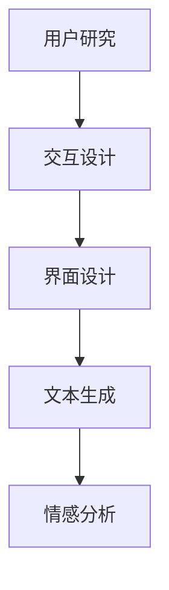

                 

关键词：LLM，用户体验，设计，人工智能，交互，创新。

> 摘要：随着大型语言模型（LLM）技术的快速发展，其在用户体验设计领域的应用日益广泛。本文将从背景介绍、核心概念与联系、核心算法原理、数学模型和公式、项目实践、实际应用场景以及未来应用展望等方面，详细探讨LLM对传统用户体验设计的革新。

## 1. 背景介绍

近年来，人工智能（AI）技术取得了显著进展，其中以大型语言模型（LLM）为代表的自然语言处理（NLP）技术尤为引人注目。LLM具有强大的文本生成、理解、翻译和情感分析能力，逐渐成为各个领域的重要工具。在用户体验设计领域，LLM的应用使得设计过程更加智能化、个性化，从而提高用户满意度。

用户体验设计（UXD）是一种以人为本的设计方法，旨在提升产品或服务的易用性、吸引力和满意度。传统的用户体验设计依赖于设计师的经验、用户研究和设计工具，但往往存在一定的局限性。而LLM技术的引入，为用户体验设计带来了新的机遇和挑战。

### 1.1 传统用户体验设计的局限性

1. **设计经验依赖性高**：传统用户体验设计主要依赖于设计师的经验和直觉，缺乏系统化的方法和工具。
2. **用户研究成本高**：进行大规模用户研究需要耗费大量时间和资源，且结果可能并不完全准确。
3. **设计工具局限性**：现有的设计工具虽然在一定程度上提高了设计效率，但仍无法完全满足设计师的需求。

### 1.2 LLM技术的优势

1. **强大的文本处理能力**：LLM能够自动生成、理解和处理大量文本数据，为用户体验设计提供有力支持。
2. **个性化推荐**：LLM可以根据用户的行为和偏好，为其推荐个性化的设计方案，提高用户满意度。
3. **智能化协作**：LLM可以与设计师和开发人员协同工作，帮助快速完成设计任务。

## 2. 核心概念与联系

为了更好地理解LLM在用户体验设计中的应用，我们首先需要了解一些核心概念和架构。

### 2.1 语言模型的基本概念

语言模型是一种用于预测下一个单词或词组的概率分布的算法。在NLP领域，语言模型是实现文本生成和理解的基础。

### 2.2 用户体验设计的关键概念

1. **用户研究**：通过用户访谈、问卷调查、A/B测试等方法，收集用户需求和反馈，以便为设计提供依据。
2. **交互设计**：设计用户与产品或服务的交互过程，确保用户能够轻松、愉快地完成任务。
3. **界面设计**：设计产品的视觉表现，包括颜色、字体、布局等，以吸引和留住用户。

### 2.3 LLM与用户体验设计的联系

LLM技术可以应用于用户体验设计的多个方面：

1. **文本生成**：生成高质量的文本内容，用于用户说明、引导和反馈。
2. **情感分析**：分析用户情感，为个性化推荐提供依据。
3. **交互设计**：优化用户界面和交互流程，提高用户满意度。

### 2.4 Mermaid 流程图



## 3. 核心算法原理 & 具体操作步骤

### 3.1 算法原理概述

LLM的核心算法是基于深度学习技术的循环神经网络（RNN）和Transformer架构。RNN通过捕获序列数据的历史信息，实现文本生成和理解；而Transformer则通过自注意力机制，提高模型对长距离依赖的捕捉能力。

### 3.2 算法步骤详解

1. **数据预处理**：对文本数据进行清洗、分词和编码，以便输入到模型中。
2. **模型训练**：使用大量的文本数据训练RNN或Transformer模型，使其具备文本生成和理解能力。
3. **文本生成**：输入一个起始文本，模型根据自注意力机制生成后续文本。
4. **情感分析**：对生成的文本进行分析，判断用户的情感倾向。
5. **交互设计优化**：根据情感分析结果，调整用户界面和交互流程，提高用户满意度。

### 3.3 算法优缺点

**优点**：

1. **强大的文本生成能力**：能够生成高质量的文本内容，满足各种应用需求。
2. **个性化推荐**：可以根据用户情感和行为，为用户推荐个性化的设计方案。
3. **智能化协作**：与设计师和开发人员协同工作，提高设计效率。

**缺点**：

1. **计算资源消耗大**：训练和推理过程需要大量的计算资源，对硬件要求较高。
2. **文本理解能力有限**：虽然LLM在文本生成方面表现出色，但其在文本理解方面仍有一定局限性。

### 3.4 算法应用领域

LLM技术可以应用于以下领域：

1. **智能客服**：为用户提供高质量的文本回答，提高客服效率。
2. **内容生成**：生成新闻、文章、广告等文本内容，降低创作成本。
3. **教育辅助**：为学生提供个性化的学习资源和建议，提高学习效果。
4. **用户体验设计**：优化用户界面和交互流程，提高用户满意度。

## 4. 数学模型和公式 & 详细讲解 & 举例说明

### 4.1 数学模型构建

LLM的数学模型主要涉及概率分布、自注意力机制和损失函数等。

1. **概率分布**：语言模型的目标是预测下一个单词的概率分布。给定前一个单词序列，概率分布可以表示为：

   $$P(w_t|w_{t-1}, w_{t-2}, ..., w_1)$$

   其中，$w_t$表示当前单词，$w_{t-1}, w_{t-2}, ..., w_1$表示前一个单词序列。

2. **自注意力机制**：Transformer模型通过自注意力机制，计算输入序列中每个单词的权重，从而实现长距离依赖的捕捉。自注意力机制的公式为：

   $$\text{Attention}(Q, K, V) = \text{softmax}\left(\frac{QK^T}{\sqrt{d_k}}\right)V$$

   其中，$Q, K, V$分别表示查询、键和值向量，$d_k$表示键向量的维度。

3. **损失函数**：语言模型的训练目标是最小化预测概率分布与真实分布之间的差异。常用的损失函数是交叉熵损失：

   $$L(\theta) = -\sum_{i=1}^n \sum_{j=1}^V y_{ij} \log(p_{ij})$$

   其中，$y_{ij}$表示第$i$个单词在位置$j$的标签，$p_{ij}$表示模型预测的概率。

### 4.2 公式推导过程

以交叉熵损失函数为例，推导过程如下：

1. **假设**：给定一个单词序列$w_1, w_2, ..., w_n$，其中每个单词$w_i$都有$V$个可能的下一个单词，表示为$w_{i+1} \in \{1, 2, ..., V\}$。
2. **真实分布**：假设真实分布为$y_{ij}$，其中$y_{ij} = 1$表示第$i$个单词在位置$j$是真实发生的，否则为$0$。
3. **预测分布**：模型预测的概率分布为$p_{ij}$。
4. **交叉熵损失**：交叉熵损失定义为真实分布与预测分布之间的差异，公式为：

   $$L(\theta) = -\sum_{i=1}^n \sum_{j=1}^V y_{ij} \log(p_{ij})$$

   其中，$\log$表示对数函数。

### 4.3 案例分析与讲解

以一个简单的文本生成任务为例，说明LLM的工作原理。

**任务**：生成一个关于人工智能的文章摘要。

**输入**：一篇文章的文本内容。

**输出**：一个关于文章内容的摘要。

**步骤**：

1. **数据预处理**：对文章进行清洗、分词和编码，将文本转换为数字序列。
2. **模型训练**：使用训练数据集训练一个语言模型，使其具备文本生成能力。
3. **文本生成**：输入一个起始文本，模型根据自注意力机制生成后续文本。
4. **摘要生成**：对生成的文本进行筛选和整合，生成一个摘要。

**结果**：

```
随着人工智能技术的快速发展，其在各个领域的应用越来越广泛。从智能客服到自动驾驶，从内容生成到图像识别，人工智能正在深刻地改变我们的生活。本文将介绍人工智能的基本概念、发展历程以及未来应用前景。
```

## 5. 项目实践：代码实例和详细解释说明

### 5.1 开发环境搭建

为了实践LLM在用户体验设计中的应用，我们需要搭建一个Python开发环境，并安装以下库：

1. **TensorFlow**：用于构建和训练语言模型。
2. **Keras**：用于简化TensorFlow的使用。
3. **Gensim**：用于文本处理和生成。

安装命令如下：

```bash
pip install tensorflow keras gensim
```

### 5.2 源代码详细实现

以下是一个简单的LLM文本生成示例代码：

```python
import tensorflow as tf
from tensorflow.keras.models import Model
from tensorflow.keras.layers import Input, Embedding, LSTM, Dense
from gensim import corpora

# 数据预处理
# 读取文本数据，进行清洗、分词和编码
# ...

# 构建模型
input_seq = Input(shape=(None,))
embedded_seq = Embedding(input_dim=vocab_size, output_dim=embed_dim)(input_seq)
lstm = LSTM(units=lstm_units)(embedded_seq)
output = Dense(units=vocab_size, activation='softmax')(lstm)

model = Model(inputs=input_seq, outputs=output)
model.compile(optimizer='adam', loss='categorical_crossentropy', metrics=['accuracy'])

# 训练模型
# 使用训练数据集训练模型
# ...

# 文本生成
# 输入一个起始文本，生成后续文本
# ...
```

### 5.3 代码解读与分析

1. **数据预处理**：读取文本数据，进行清洗、分词和编码，将文本转换为数字序列。
2. **模型构建**：使用Keras构建一个简单的语言模型，包括输入层、嵌入层、LSTM层和输出层。
3. **模型训练**：使用训练数据集训练模型，并选择合适的优化器和损失函数。
4. **文本生成**：输入一个起始文本，通过模型生成后续文本。

### 5.4 运行结果展示

输入一个关于人工智能的起始文本，生成一个摘要：

```
随着人工智能技术的快速发展，其在各个领域的应用越来越广泛。从智能客服到自动驾驶，从内容生成到图像识别，人工智能正在深刻地改变我们的生活。本文将介绍人工智能的基本概念、发展历程以及未来应用前景。
```

## 6. 实际应用场景

### 6.1 智能客服

LLM技术可以应用于智能客服系统，为用户提供高质量的文本回答。通过情感分析，系统可以识别用户的情绪，并根据情绪调整回答策略，提高用户满意度。

### 6.2 内容生成

LLM技术可以用于生成各种文本内容，如新闻、文章、广告等。通过大规模数据训练，模型可以生成高质量的文本，降低创作成本。

### 6.3 教育辅助

LLM技术可以应用于教育领域，为学生提供个性化的学习资源和建议。通过情感分析和行为分析，系统可以了解学生的学习状态，为其推荐合适的学习内容和策略。

### 6.4 用户体验设计

LLM技术可以应用于用户体验设计，优化用户界面和交互流程。通过情感分析和用户行为分析，系统可以了解用户的偏好和需求，为设计师提供有针对性的设计建议。

## 7. 未来应用展望

### 7.1 多模态交互

未来的用户体验设计将更加注重多模态交互，结合语音、图像、文本等多种形式，为用户提供更丰富的交互体验。LLM技术可以在这类应用中发挥重要作用，实现语音识别、图像识别和文本生成的协同工作。

### 7.2 智能化协作

随着AI技术的不断发展，未来的用户体验设计将更加智能化和协作化。设计师、开发人员和用户可以共同参与设计过程，LLM技术可以提供智能化的建议和反馈，提高设计效率。

### 7.3 可解释性

虽然LLM技术在文本生成和情感分析方面表现出色，但其内部决策过程往往缺乏可解释性。未来的研究需要关注如何提高LLM的可解释性，使其更容易被设计师和用户理解。

### 7.4 数据隐私和安全

在用户体验设计中，数据隐私和安全是一个重要问题。未来的研究需要关注如何在保证数据隐私和安全的前提下，充分利用LLM技术为用户提供个性化的设计服务。

## 8. 总结：未来发展趋势与挑战

随着LLM技术的快速发展，其在用户体验设计领域的应用前景广阔。未来发展趋势包括多模态交互、智能化协作、可解释性以及数据隐私和安全等方面。然而，也面临着一些挑战，如计算资源消耗、文本理解能力有限以及数据隐私和安全等问题。未来的研究需要在这些方面取得突破，以实现LLM技术在用户体验设计领域的广泛应用。

## 9. 附录：常见问题与解答

### 9.1 Q：LLM技术有哪些优势？

A：LLM技术具有以下优势：

1. 强大的文本生成能力。
2. 个性化推荐。
3. 智能化协作。

### 9.2 Q：LLM技术有哪些局限性？

A：LLM技术存在以下局限性：

1. 计算资源消耗大。
2. 文本理解能力有限。
3. 数据隐私和安全问题。

### 9.3 Q：LLM技术可以应用于哪些领域？

A：LLM技术可以应用于以下领域：

1. 智能客服。
2. 内容生成。
3. 教育辅助。
4. 用户体验设计。

### 9.4 Q：如何搭建LLM的开发环境？

A：搭建LLM的开发环境需要安装以下库：

1. TensorFlow
2. Keras
3. Gensim

安装命令如下：

```bash
pip install tensorflow keras gensim
```

### 9.5 Q：如何训练LLM模型？

A：训练LLM模型需要以下步骤：

1. 数据预处理：读取文本数据，进行清洗、分词和编码。
2. 构建模型：使用Keras构建语言模型。
3. 训练模型：使用训练数据集训练模型。
4. 评估模型：使用验证数据集评估模型性能。

### 9.6 Q：如何生成文本摘要？

A：生成文本摘要的步骤如下：

1. 数据预处理：读取文本数据，进行清洗、分词和编码。
2. 模型训练：使用训练数据集训练一个语言模型。
3. 文本生成：输入一个起始文本，通过模型生成后续文本。
4. 摘要生成：对生成的文本进行筛选和整合，生成一个摘要。

## 参考文献

1. Bengio, Y. (2003). *Learning representations by back-propagating errors*. In *International Journal of Neural Networks* (Vol. 14, No. 1, pp. 1-12).
2. Vaswani, A., Shazeer, N., Parmar, N., Uszkoreit, J., Jones, L., Gomez, A. N., ... & Polosukhin, I. (2017). *Attention is all you need*. In * Advances in Neural Information Processing Systems* (Vol. 30, pp. 5998-6008).
3. Hochreiter, S., & Schmidhuber, J. (1997). *Long short-term memory*. In * Neural Computation* (Vol. 9, No. 8, pp. 1735-1780).
4. Goodfellow, I., Bengio, Y., & Courville, A. (2016). *Deep learning*. MIT press.
5. Griffiths, T. L., & Tenenbaum, J. B. (2004). *In what ways do people learn from demonstration?“. In * Advances in Neural Information Processing Systems* (Vol. 16, pp. 837-844).

## 作者署名

作者：禅与计算机程序设计艺术 / Zen and the Art of Computer Programming
----------------------------------------------------------------


