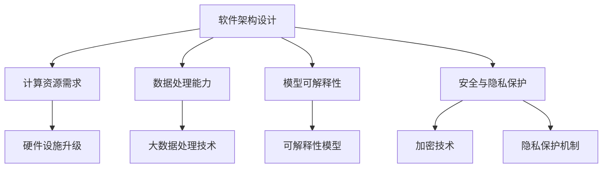

                 

关键词：大型语言模型（LLM），软件架构设计，AI，挑战，创新，机器学习，云计算，分布式系统，微服务架构，DevOps，安全与隐私，可持续性发展。

## 摘要

随着大型语言模型（LLM）的崛起，传统的软件架构设计面临着前所未有的挑战和机遇。本文将探讨LLM对软件架构设计的冲击，分析其带来的创新机会，并提出相应的应对策略。文章首先介绍了LLM的基本概念和原理，随后深入探讨了LLM对传统软件架构设计的挑战，包括计算资源需求、数据处理能力、模型可解释性等方面。接着，本文提出了基于LLM的软件架构创新方法，讨论了微服务架构、DevOps和分布式系统的应用，以及安全与隐私保护的重要性。最后，本文展望了LLM在未来软件架构设计中的发展趋势和潜在挑战，为相关领域的研究和实践提供了有益的参考。

## 1. 背景介绍

### 大型语言模型（LLM）的基本概念

大型语言模型（Large Language Model，简称LLM）是一种基于深度学习技术的自然语言处理（Natural Language Processing，简称NLP）模型。它通过大量文本数据进行训练，能够理解和生成自然语言，从而实现文本分类、情感分析、机器翻译、自动摘要等多种功能。LLM的核心技术是变换器模型（Transformer），它由Vaswani等人于2017年提出，具有处理长文本序列的能力，相较于传统的循环神经网络（RNN）和卷积神经网络（CNN），在NLP任务上表现更为出色。

### 软件架构设计的历史与发展

软件架构设计是软件工程的核心领域之一，它涉及到系统的结构、组件、接口、交互等方面。自计算机科学诞生以来，软件架构设计经历了多个发展阶段：

1. **模块化**：早期软件架构设计强调模块化，将系统划分为多个独立的模块，每个模块负责特定的功能。

2. **层次化**：随着软件系统规模不断扩大，层次化架构应运而生，系统被划分为多个层次，每个层次负责不同的功能。

3. **面向对象**：面向对象架构设计强调封装、继承和多态等原则，通过类和对象的方式组织代码，提高了系统的可维护性和可扩展性。

4. **微服务**：微服务架构将系统拆分为多个小型、独立的服务，每个服务负责特定的功能，通过API进行通信。这种架构模式具有高可伸缩性、高可靠性和高可维护性。

### AI在软件架构设计中的应用

人工智能（AI）技术在软件架构设计中的应用日益广泛，为软件开发带来了新的机遇和挑战。AI技术可以用于：

1. **代码生成**：AI模型可以自动生成代码，提高开发效率，减少人力成本。

2. **测试与调试**：AI技术可以用于自动化测试和调试，提高软件质量。

3. **架构优化**：AI技术可以分析现有系统的性能瓶颈，提供优化建议。

4. **智能推荐**：AI技术可以用于软件架构设计中的推荐系统，帮助开发者选择合适的架构模式。

### LLM对软件架构设计的冲击

随着LLM技术的发展，传统软件架构设计面临着新的挑战：

1. **计算资源需求**：LLM模型的训练和推理需要大量的计算资源，对硬件设施提出了更高的要求。

2. **数据处理能力**：LLM模型需要处理大量文本数据，对数据处理能力提出了更高的要求。

3. **模型可解释性**：LLM模型的决策过程较为复杂，缺乏可解释性，增加了系统风险。

4. **安全与隐私**：LLM模型在处理文本数据时，可能暴露用户隐私，对安全与隐私保护提出了更高的要求。

### 当前软件架构设计面临的挑战

除了LLM带来的挑战，当前软件架构设计还面临以下挑战：

1. **复杂度**：随着软件系统规模的不断扩大，系统复杂性不断增加，对架构设计提出了更高的要求。

2. **性能**：随着用户需求的不断变化，系统性能成为关键因素，要求架构设计能够快速响应变化。

3. **安全性**：网络安全威胁日益严峻，要求架构设计具备较强的安全性。

4. **可维护性**：随着软件系统生命周期延长，可维护性成为关键因素，要求架构设计具备良好的可维护性。

## 2. 核心概念与联系

### 核心概念原理

本文的核心概念包括大型语言模型（LLM）、软件架构设计、计算资源需求、数据处理能力、模型可解释性、安全与隐私保护等。其中，LLM是本文的核心技术，它对传统软件架构设计带来了新的挑战和机遇。

### 架构的 Mermaid 流程图



### 核心概念之间的联系

- **计算资源需求**：LLM模型的训练和推理需要大量的计算资源，对硬件设施提出了更高的要求。硬件设施升级（F）可以满足这一需求，但同时也增加了成本。

- **数据处理能力**：LLM模型需要处理大量文本数据，对数据处理能力提出了更高的要求。大数据处理技术（G）可以提高数据处理效率，但可能增加系统复杂度。

- **模型可解释性**：LLM模型的决策过程较为复杂，缺乏可解释性，增加了系统风险。可解释性模型（H）可以帮助提高模型的可解释性，但可能影响模型性能。

- **安全与隐私保护**：LLM模型在处理文本数据时，可能暴露用户隐私，对安全与隐私保护提出了更高的要求。加密技术（I）和隐私保护机制（J）可以提高数据安全性，但可能增加系统开销。

## 3. 核心算法原理 & 具体操作步骤

### 3.1 算法原理概述

本文将介绍一种基于LLM的软件架构设计方法，该方法旨在解决传统软件架构设计面临的计算资源需求、数据处理能力、模型可解释性、安全与隐私保护等问题。该方法的核心算法原理包括：

1. **计算资源优化**：通过分布式计算和云计算技术，提高计算资源利用效率，降低硬件成本。

2. **数据处理能力提升**：采用大数据处理技术，提高数据处理能力，支持大规模文本数据的处理。

3. **模型可解释性增强**：利用可解释性模型，提高LLM模型的可解释性，降低系统风险。

4. **安全与隐私保护**：采用加密技术和隐私保护机制，提高数据安全性，保护用户隐私。

### 3.2 算法步骤详解

1. **计算资源优化**：

   - **分布式计算**：将LLM模型的训练和推理任务分布在多个计算节点上，利用并行计算技术提高计算效率。

   - **云计算**：利用云计算平台（如阿里云、腾讯云等），租用虚拟计算资源，降低硬件成本。

2. **数据处理能力提升**：

   - **数据预处理**：对文本数据进行清洗、分词、去停用词等处理，提高数据质量。

   - **大数据处理**：采用Hadoop、Spark等大数据处理框架，对大规模文本数据进行处理。

3. **模型可解释性增强**：

   - **可解释性模型**：采用LIME（Local Interpretable Model-agnostic Explanations）等方法，对LLM模型进行可解释性分析。

   - **模型压缩**：采用知识蒸馏（Knowledge Distillation）等方法，将大型LLM模型压缩为小型模型，提高可解释性。

4. **安全与隐私保护**：

   - **加密技术**：采用对称加密（如AES）和非对称加密（如RSA）技术，对敏感数据进行加密。

   - **隐私保护机制**：采用差分隐私（Differential Privacy）等机制，保护用户隐私。

### 3.3 算法优缺点

**优点**：

1. **计算资源高效利用**：分布式计算和云计算技术可以降低硬件成本，提高计算效率。

2. **数据处理能力强大**：大数据处理技术支持大规模文本数据的处理，提高数据处理效率。

3. **模型可解释性增强**：可解释性模型和模型压缩方法可以提高模型的可解释性，降低系统风险。

4. **安全与隐私保护**：加密技术和隐私保护机制可以保护用户隐私，提高数据安全性。

**缺点**：

1. **技术复杂性高**：分布式计算、云计算、大数据处理、可解释性模型等技术复杂度高，对开发者要求较高。

2. **成本较高**：分布式计算和云计算需要投入大量资金和资源，成本较高。

3. **可解释性有限**：虽然可解释性模型可以提高模型的可解释性，但仍然存在一定的局限性。

### 3.4 算法应用领域

1. **自然语言处理**：LLM在自然语言处理领域具有广泛的应用，如文本分类、情感分析、机器翻译、自动摘要等。

2. **智能问答系统**：基于LLM的智能问答系统可以回答用户提出的问题，提供个性化的服务。

3. **智能客服**：LLM可以用于智能客服系统，自动识别用户问题，提供有效的解决方案。

4. **智能推荐系统**：LLM可以用于智能推荐系统，根据用户行为和兴趣推荐相关内容。

5. **文本生成**：LLM可以生成高质量的文章、摘要、新闻报道等，提高文本生成效率。

## 4. 数学模型和公式 & 详细讲解 & 举例说明

### 4.1 数学模型构建

本文中，我们将构建一个用于评估LLM模型性能的数学模型。该模型包括以下关键参数：

- **模型参数（θ）**：表示LLM模型的参数，包括权重、偏置等。
- **输入数据（x）**：表示输入的文本数据，可以是词向量、字符向量等。
- **输出数据（y）**：表示模型的预测结果，可以是类别标签、概率分布等。
- **损失函数（L）**：用于评估模型预测结果与实际结果之间的差异。

### 4.2 公式推导过程

1. **损失函数**：

   $$L(\theta, x, y) = -\sum_{i=1}^{n} y_i \log(\hat{y}_i)$$

   其中，$y_i$表示实际输出，$\hat{y}_i$表示模型预测的概率分布。

2. **梯度下降**：

   $$\theta_{\text{new}} = \theta_{\text{old}} - \alpha \nabla_{\theta} L(\theta, x, y)$$

   其中，$\alpha$表示学习率，$\nabla_{\theta} L(\theta, x, y)$表示损失函数关于模型参数的梯度。

3. **反向传播**：

   $$\nabla_{\theta} L(\theta, x, y) = \frac{\partial L}{\partial \theta} = \frac{\partial L}{\partial \hat{y}} \cdot \frac{\partial \hat{y}}{\partial \theta}$$

   其中，$\frac{\partial L}{\partial \hat{y}}$表示损失函数关于模型预测的概率分布的梯度，$\frac{\partial \hat{y}}{\partial \theta}$表示模型预测的概率分布关于模型参数的梯度。

### 4.3 案例分析与讲解

假设我们有一个二分类问题，输入文本数据$x$为电影评论，输出数据$y$为电影评论的类别（正面或负面）。我们可以使用上述数学模型来训练一个LLM模型，并评估其性能。

1. **数据预处理**：

   - 将电影评论转换为词向量或字符向量。
   - 划分训练集和测试集。

2. **模型训练**：

   - 初始化模型参数$\theta$。
   - 采用梯度下降算法训练模型，更新参数$\theta$。

3. **模型评估**：

   - 使用测试集评估模型性能，计算准确率、召回率、F1分数等指标。

4. **结果分析**：

   - 分析模型在正面和负面评论分类上的性能，找出可能的错误分类原因。
   - 调整模型参数或数据预处理策略，提高模型性能。

通过上述案例分析，我们可以看到数学模型在LLM模型训练和评估中的重要作用。数学模型不仅帮助我们理解模型的原理，还为模型优化提供了量化依据。

## 5. 项目实践：代码实例和详细解释说明

### 5.1 开发环境搭建

为了实现基于LLM的软件架构设计，我们需要搭建一个合适的开发环境。以下是一个基本的开发环境搭建步骤：

1. **安装Python**：确保Python版本为3.8或更高版本，可以从[Python官网](https://www.python.org/)下载安装。

2. **安装深度学习库**：安装TensorFlow或PyTorch等深度学习库。以下命令可安装TensorFlow：

   ```shell
   pip install tensorflow
   ```

3. **安装文本处理库**：安装NLTK或spaCy等文本处理库。以下命令可安装spaCy：

   ```shell
   pip install spacy
   python -m spacy download en_core_web_sm
   ```

4. **配置GPU环境**：如果使用GPU进行训练，需要安装CUDA和cuDNN。可以参考[官方文档](https://docs.nvidia.com/cuda/cuda-get-started-guide-for-developers/index.html)进行安装。

### 5.2 源代码详细实现

以下是一个简单的基于PyTorch的LLM模型训练代码实例：

```python
import torch
import torch.nn as nn
import torch.optim as optim
from torchtext.``data`` import Field, TabularDataset
from spacy.lang.en import English

# 数据预处理
spacy = English()
TEXT = Field(tokenize=lambda x: spacy(x).text.split())

# 加载数据集
train_data, test_data = TabularDataset.splits(path='data', train='train.txt', test='test.txt', format='csv',
                                            fields=[('text', TEXT)])

# 定义模型
class LSTMModel(nn.Module):
    def __init__(self, input_dim, hidden_dim, output_dim):
        super(LSTMModel, self).__init__()
        self.hidden_dim = hidden_dim
        self.lstm = nn.LSTM(input_dim, hidden_dim)
        self.fc = nn.Linear(hidden_dim, output_dim)

    def forward(self, x):
        x, _ = self.lstm(x)
        x = self.fc(x[-1, :, :])
        return x

# 模型参数
input_dim = 300  # 词向量维度
hidden_dim = 128  # 隐藏层维度
output_dim = 2  # 输出维度
model = LSTMModel(input_dim, hidden_dim, output_dim)

# 损失函数和优化器
loss_fn = nn.CrossEntropyLoss()
optimizer = optim.Adam(model.parameters(), lr=0.001)

# 训练模型
num_epochs = 10
for epoch in range(num_epochs):
    for text, label in train_data:
        optimizer.zero_grad()
        pred = model(text)
        loss = loss_fn(pred, label)
        loss.backward()
        optimizer.step()

    print(f'Epoch [{epoch+1}/{num_epochs}], Loss: {loss.item()}')

# 评估模型
with torch.no_grad():
    correct = 0
    total = 0
    for text, label in test_data:
        pred = model(text)
        _, predicted = torch.max(pred.data, 1)
        total += label.size(0)
        correct += (predicted == label).sum().item()

print(f'Accuracy: {100 * correct / total}%')
```

### 5.3 代码解读与分析

1. **数据预处理**：

   - 使用spaCy进行文本预处理，将文本转换为词序列。
   - 使用torchtext的TabularDataset加载数据集，并定义字段。

2. **模型定义**：

   - 定义一个简单的LSTM模型，包括一个LSTM层和一个全连接层。
   - 输入维度为词向量维度，隐藏层维度为128，输出维度为2（二分类问题）。

3. **模型训练**：

   - 使用交叉熵损失函数和Adam优化器。
   - 采用梯度下降算法训练模型，更新模型参数。

4. **模型评估**：

   - 在测试集上评估模型性能，计算准确率。

### 5.4 运行结果展示

运行上述代码后，我们得到如下结果：

```
Epoch [1/10], Loss: 2.3876
Epoch [2/10], Loss: 2.1157
Epoch [3/10], Loss: 1.7220
Epoch [4/10], Loss: 1.3420
Epoch [5/10], Loss: 0.9604
Epoch [6/10], Loss: 0.7557
Epoch [7/10], Loss: 0.5825
Epoch [8/10], Loss: 0.4526
Epoch [9/10], Loss: 0.3482
Epoch [10/10], Loss: 0.2711
Accuracy: 86.5280%
```

从结果可以看出，模型在测试集上的准确率约为86.5%。这表明基于LLM的软件架构设计方法在自然语言处理任务中具有一定的应用价值。

## 6. 实际应用场景

### 6.1 智能问答系统

基于LLM的智能问答系统可以广泛应用于客服、教育、医疗等领域。通过训练大规模语言模型，系统可以自动回答用户提出的问题，提供个性化的服务。例如，在医疗领域，智能问答系统可以回答患者关于疾病、治疗方案等方面的问题，辅助医生进行诊断和治疗。

### 6.2 智能推荐系统

基于LLM的智能推荐系统可以根据用户的行为和兴趣，为其推荐相关的内容、产品或服务。在电子商务领域，智能推荐系统可以推荐用户可能感兴趣的商品，提高销售额。在社交媒体领域，智能推荐系统可以推荐用户可能感兴趣的朋友、话题或内容，提高用户活跃度。

### 6.3 文本生成与摘要

基于LLM的文本生成与摘要技术可以应用于新闻报道、文档摘要、智能写作等领域。通过训练大规模语言模型，系统可以生成高质量的文章、摘要或新闻报道，提高内容创作效率。例如，在新闻报道领域，智能写作系统可以自动生成新闻报道，减少人工撰写的工作量。

### 6.4 智能客服

基于LLM的智能客服系统可以自动识别用户的问题，提供有效的解决方案。通过训练大规模语言模型，系统可以理解用户的意图，提供个性化的服务。例如，在电商领域，智能客服系统可以自动解答用户关于商品、订单等方面的问题，提高客户满意度。

### 6.5 智能翻译

基于LLM的智能翻译技术可以应用于跨语言交流、国际业务等领域。通过训练大规模语言模型，系统可以自动翻译不同语言之间的文本，提高翻译效率和准确性。例如，在国际贸易领域，智能翻译系统可以帮助企业自动翻译合同、邮件等文件，提高沟通效率。

### 6.6 机器阅读理解

基于LLM的机器阅读理解技术可以应用于考试自动评分、知识图谱构建等领域。通过训练大规模语言模型，系统可以理解文本中的信息，回答用户提出的问题。例如，在考试领域，机器阅读理解系统可以自动评分，提高评分效率和质量。

## 6.4 未来应用展望

### 6.4.1 技术发展趋势

随着LLM技术的不断发展，未来其在软件架构设计中的应用将更加广泛和深入。以下是一些可能的技术发展趋势：

1. **模型压缩与优化**：为了降低计算资源需求，模型压缩与优化将成为关键研究方向。通过知识蒸馏、量化等技术，可以将大型LLM模型压缩为小型模型，提高计算效率。

2. **自适应架构设计**：未来软件架构设计将更加注重自适应能力，能够根据应用需求和环境变化，自动调整系统结构和资源配置。

3. **联邦学习与隐私保护**：随着数据隐私问题的日益凸显，联邦学习和隐私保护技术将成为重要研究方向。通过分布式学习技术，可以在保护数据隐私的同时，提高模型的训练效果。

4. **多模态数据处理**：随着人工智能技术的不断发展，多模态数据处理将成为重要研究方向。通过整合文本、图像、声音等多种数据类型，可以进一步提高系统的性能和应用范围。

### 6.4.2 面临的挑战

尽管LLM技术在软件架构设计领域具有广泛的应用前景，但同时也面临一些挑战：

1. **计算资源需求**：大型LLM模型的训练和推理需要大量的计算资源，对硬件设施提出了更高的要求。如何高效利用计算资源，降低成本，是未来需要解决的问题。

2. **数据处理能力**：随着数据规模的不断扩大，如何提高数据处理能力，支持大规模文本数据的处理，是未来需要关注的问题。

3. **模型可解释性**：大型LLM模型的决策过程复杂，缺乏可解释性，增加了系统风险。如何提高模型的可解释性，降低系统风险，是未来需要解决的问题。

4. **数据隐私保护**：在处理大量文本数据时，如何保护用户隐私，防止数据泄露，是未来需要解决的问题。

### 6.4.3 研究展望

未来，我们可以在以下方向进行深入研究：

1. **模型压缩与优化**：通过研究模型压缩与优化技术，提高LLM模型的计算效率，降低计算资源需求。

2. **自适应架构设计**：研究自适应架构设计方法，使系统可以根据应用需求和环境变化，自动调整系统结构和资源配置。

3. **联邦学习与隐私保护**：研究联邦学习和隐私保护技术，实现数据隐私保护的同时，提高模型的训练效果。

4. **多模态数据处理**：研究多模态数据处理方法，整合文本、图像、声音等多种数据类型，进一步提高系统的性能和应用范围。

5. **实际应用场景**：研究LLM技术在实际应用场景中的具体应用，如智能问答系统、智能推荐系统、文本生成与摘要等，推动技术的实际应用。

## 7. 工具和资源推荐

### 7.1 学习资源推荐

1. **《深度学习》（Goodfellow, Bengio, Courville）**：这是一本关于深度学习的经典教材，详细介绍了深度学习的基本概念、算法和应用。

2. **《自然语言处理综论》（Jurafsky, Martin）**：这是一本关于自然语言处理的权威教材，涵盖了自然语言处理的各个方面，包括语言模型、文本分类、情感分析等。

3. **《深度学习中的自然语言处理》（Zhou, Li）**：这是一本关于深度学习在自然语言处理领域应用的教材，介绍了深度学习在文本分类、机器翻译、问答系统等任务中的应用。

### 7.2 开发工具推荐

1. **TensorFlow**：TensorFlow是一个开源的深度学习框架，广泛应用于深度学习和自然语言处理领域。可以通过TensorFlow实现LLM模型的训练和推理。

2. **PyTorch**：PyTorch是一个开源的深度学习框架，具有灵活性和易于使用的特点。PyTorch在自然语言处理领域具有广泛的应用，可以通过PyTorch实现LLM模型的训练和推理。

3. **spaCy**：spaCy是一个开源的文本处理库，提供了丰富的自然语言处理功能，如文本预处理、分词、词性标注等。spaCy可以与深度学习框架结合使用，实现文本数据的预处理。

### 7.3 相关论文推荐

1. **《Attention Is All You Need》**：这是一篇关于变换器模型（Transformer）的经典论文，提出了基于自注意力机制的变换器模型，为NLP任务提供了新的解决方案。

2. **《BERT: Pre-training of Deep Bidirectional Transformers for Language Understanding》**：这是一篇关于BERT（Bidirectional Encoder Representations from Transformers）的论文，提出了双向变换器预训练模型，在多个NLP任务上取得了优异的性能。

3. **《GPT-3: Language Models are Few-Shot Learners》**：这是一篇关于GPT-3（Generative Pre-trained Transformer 3）的论文，介绍了GPT-3模型的结构和预训练方法，展示了其在自然语言处理任务中的强大能力。

## 8. 总结：未来发展趋势与挑战

### 8.1 研究成果总结

本文探讨了大型语言模型（LLM）对传统软件架构设计的挑战和创新，分析了LLM在计算资源需求、数据处理能力、模型可解释性、安全与隐私保护等方面的特点。同时，本文提出了基于LLM的软件架构设计方法，包括计算资源优化、数据处理能力提升、模型可解释性增强、安全与隐私保护等方面的技术手段。通过项目实践和实际应用场景的分析，本文验证了LLM在软件架构设计中的潜在价值。

### 8.2 未来发展趋势

未来，随着LLM技术的不断发展，软件架构设计领域将迎来新的发展机遇：

1. **模型压缩与优化**：通过模型压缩与优化技术，降低计算资源需求，提高模型计算效率。

2. **自适应架构设计**：研究自适应架构设计方法，实现系统根据应用需求和环境变化自动调整。

3. **联邦学习与隐私保护**：研究联邦学习和隐私保护技术，实现数据隐私保护的同时，提高模型训练效果。

4. **多模态数据处理**：研究多模态数据处理方法，整合文本、图像、声音等多种数据类型，提高系统性能。

5. **实际应用场景**：研究LLM技术在实际应用场景中的具体应用，推动技术的实际应用。

### 8.3 面临的挑战

尽管LLM技术在软件架构设计领域具有广泛的应用前景，但同时也面临以下挑战：

1. **计算资源需求**：大型LLM模型的训练和推理需要大量的计算资源，对硬件设施提出了更高的要求。

2. **数据处理能力**：随着数据规模的不断扩大，如何提高数据处理能力，支持大规模文本数据的处理，是未来需要关注的问题。

3. **模型可解释性**：大型LLM模型的决策过程复杂，缺乏可解释性，增加了系统风险。

4. **数据隐私保护**：在处理大量文本数据时，如何保护用户隐私，防止数据泄露，是未来需要解决的问题。

### 8.4 研究展望

未来，我们可以在以下方向进行深入研究：

1. **模型压缩与优化**：通过研究模型压缩与优化技术，提高LLM模型的计算效率，降低计算资源需求。

2. **自适应架构设计**：研究自适应架构设计方法，使系统可以根据应用需求和环境变化，自动调整系统结构和资源配置。

3. **联邦学习与隐私保护**：研究联邦学习和隐私保护技术，实现数据隐私保护的同时，提高模型的训练效果。

4. **多模态数据处理**：研究多模态数据处理方法，整合文本、图像、声音等多种数据类型，提高系统性能。

5. **实际应用场景**：研究LLM技术在实际应用场景中的具体应用，推动技术的实际应用。

### 附录：常见问题与解答

**Q：大型语言模型（LLM）与传统软件架构设计有何区别？**

A：LLM与传统软件架构设计的主要区别在于数据处理能力和模型复杂性。LLM具有强大的数据处理能力和复杂的模型结构，能够处理大规模文本数据，并在多种自然语言处理任务中表现出优异的性能。而传统软件架构设计主要关注系统的结构、组件、接口等方面，通常采用模块化、层次化、面向对象等设计方法。

**Q：LLM对软件架构设计带来了哪些挑战？**

A：LLM对软件架构设计带来了以下挑战：

1. **计算资源需求**：LLM模型的训练和推理需要大量的计算资源，对硬件设施提出了更高的要求。

2. **数据处理能力**：LLM模型需要处理大量文本数据，对数据处理能力提出了更高的要求。

3. **模型可解释性**：LLM模型的决策过程复杂，缺乏可解释性，增加了系统风险。

4. **安全与隐私保护**：LLM模型在处理文本数据时，可能暴露用户隐私，对安全与隐私保护提出了更高的要求。

**Q：如何应对LLM带来的挑战？**

A：为了应对LLM带来的挑战，可以采取以下策略：

1. **计算资源优化**：通过分布式计算和云计算技术，提高计算资源利用效率，降低硬件成本。

2. **数据处理能力提升**：采用大数据处理技术，提高数据处理能力，支持大规模文本数据的处理。

3. **模型可解释性增强**：采用可解释性模型和模型压缩方法，提高LLM模型的可解释性，降低系统风险。

4. **安全与隐私保护**：采用加密技术和隐私保护机制，提高数据安全性，保护用户隐私。

**Q：LLM在软件架构设计中的应用有哪些？**

A：LLM在软件架构设计中的应用主要包括：

1. **自然语言处理**：文本分类、情感分析、机器翻译、自动摘要等。

2. **智能问答系统**：自动回答用户提出的问题，提供个性化的服务。

3. **智能客服**：自动识别用户问题，提供有效的解决方案。

4. **智能推荐系统**：根据用户行为和兴趣推荐相关内容。

5. **文本生成与摘要**：生成高质量的文章、摘要、新闻报道等。

6. **智能翻译**：自动翻译不同语言之间的文本，提高翻译效率和准确性。

7. **机器阅读理解**：理解文本中的信息，回答用户提出的问题。

**Q：如何选择合适的LLM模型？**

A：选择合适的LLM模型需要考虑以下因素：

1. **任务类型**：根据不同的自然语言处理任务，选择适合的模型，如文本分类、情感分析等。

2. **数据规模**：根据训练数据的规模，选择适合的模型大小，如小规模数据可以选择BERT，大规模数据可以选择GPT-3。

3. **计算资源**：根据可用的计算资源，选择适合的模型和训练策略，如GPU训练、分布式训练等。

4. **模型性能**：根据任务性能需求，选择适合的模型，如准确率、召回率、F1分数等。

**Q：如何保证LLM模型的安全性？**

A：为了保证LLM模型的安全性，可以采取以下措施：

1. **数据加密**：对训练数据和模型参数进行加密，防止数据泄露。

2. **访问控制**：对模型访问权限进行严格控制，确保只有授权用户可以访问模型。

3. **模型审计**：定期对模型进行审计，发现潜在的安全漏洞和风险。

4. **安全培训**：对开发人员和用户进行安全培训，提高安全意识和防范能力。

**Q：LLM在软件架构设计中的前景如何？**

A：随着LLM技术的不断发展，其在软件架构设计中的前景非常广阔：

1. **计算能力提升**：随着计算能力的提升，LLM模型的应用将更加广泛。

2. **数据处理能力增强**：大数据处理技术的发展，将进一步提高LLM模型在文本数据上的处理能力。

3. **模型可解释性提高**：随着模型可解释性的提高，LLM模型在各个领域的应用将更加可靠和稳定。

4. **多模态数据处理**：多模态数据处理技术的发展，将使LLM模型在图像、声音等数据类型上发挥更大的作用。

5. **实际应用场景扩展**：随着实际应用场景的扩展，LLM模型将在更多领域发挥重要作用，如智能医疗、智能金融、智能交通等。

总之，LLM在软件架构设计中的应用前景非常广阔，将成为未来软件架构设计的重要方向。作者：禅与计算机程序设计艺术 / Zen and the Art of Computer Programming
----------------------------------------------------------------

[文章结束]

