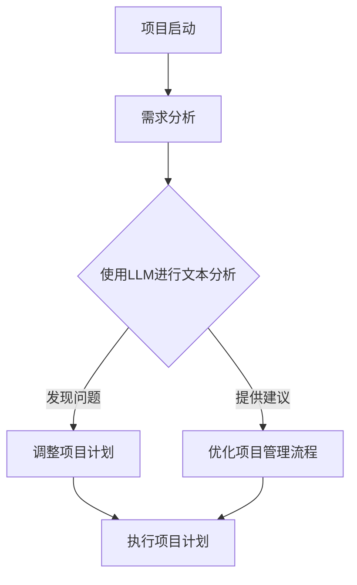

                 

关键词：语言模型（LLM），项目管理，人工智能，传统方法，改进策略

> 摘要：随着人工智能技术的飞速发展，语言模型（LLM）的应用逐渐渗透到各个领域。本文旨在探讨LLM对传统项目管理方法的挑战，并在此基础上提出相应的改进策略。通过深入分析LLM的优势与不足，结合实际案例，本文为项目经理和团队提供了一种更为高效的项目管理新思路。

## 1. 背景介绍

### 1.1 语言模型的发展历程

语言模型（Language Model，简称LM）是自然语言处理（Natural Language Processing，简称NLP）的重要基础。自20世纪50年代以来，语言模型经历了从统计模型到神经网络模型，再到深度学习模型的演变。尤其是近年来，随着计算能力的提升和大数据的普及，基于深度学习的语言模型取得了显著的进展。最典型的代表是GPT（Generative Pre-trained Transformer）系列模型，其具有强大的文本生成和预测能力。

### 1.2 传统项目管理的现状

传统项目管理方法主要包括计划驱动的瀑布模型、迭代迭代的敏捷方法等。这些方法在项目规划、执行和监控方面提供了有效的框架。然而，随着项目复杂度的增加，传统项目管理方法逐渐暴露出一系列问题，如项目延迟、成本超支、沟通不畅等。为了应对这些问题，项目经理和团队不断寻求新的管理工具和方法。

### 1.3 LLM与传统项目管理的交汇

LLM的崛起为项目管理带来了新的机遇。一方面，LLM可以辅助项目经理和团队进行文本分析和决策支持，提高项目管理的效率和准确性；另一方面，LLM的自动化能力可以减轻项目经理在文档管理、会议记录等方面的负担，使其能够专注于更具战略意义的工作。本文将深入探讨LLM在项目管理中的应用及其对传统方法的挑战与改进。

## 2. 核心概念与联系

### 2.1 语言模型（LLM）

语言模型是一种基于机器学习的算法，用于预测下一个单词或句子。LLM通过大量的文本数据进行训练，学习语言的结构和语义，从而实现对文本的生成和推理。

### 2.2 传统项目管理方法

传统项目管理方法主要包括以下几种：

- **瀑布模型**：一种线性顺序的项目管理方法，将项目划分为不同的阶段，每个阶段完成后才能进入下一个阶段。
- **敏捷方法**：一种迭代迭代的项目管理方法，强调快速响应变化和持续交付价值。

### 2.3 LLM与传统项目管理的联系

LLM与传统项目管理的联系主要体现在以下几个方面：

- **文本分析**：LLM可以对项目文档、会议记录、用户反馈等文本数据进行深入分析，帮助项目经理了解项目的进展和潜在问题。
- **决策支持**：LLM可以基于历史数据和实时信息，为项目经理提供决策建议，提高决策的准确性和效率。
- **自动化工具**：LLM可以自动化处理项目管理中的重复性任务，如文档生成、数据汇总等，减轻项目经理的负担。

### 2.4 Mermaid 流程图

以下是一个简单的Mermaid流程图，展示了LLM在项目管理中的应用流程：



## 3. 核心算法原理 & 具体操作步骤

### 3.1 算法原理概述

LLM的核心算法是基于深度学习的变换器模型（Transformer）。该模型通过堆叠多层变换器层，实现对文本数据的编码和解码。具体来说，变换器模型主要包括以下三个关键组件：

- **多头自注意力机制**：通过计算文本序列中每个词与其他词的关联性，实现文本的上下文建模。
- **前馈神经网络**：对自注意力机制的结果进行进一步加工，提高模型的表示能力。
- **编码器-解码器结构**：编码器将输入文本编码为固定长度的向量，解码器则利用这些向量生成输出文本。

### 3.2 算法步骤详解

1. **数据预处理**：对项目文档、会议记录等文本数据进行预处理，包括分词、去停用词、词向量化等。
2. **模型训练**：使用预训练的变换器模型对预处理后的文本数据进行训练，学习文本的结构和语义。
3. **文本分析**：将训练好的模型应用于新的文本数据，进行文本分析，提取关键信息。
4. **决策支持**：根据文本分析结果，为项目经理提供决策建议，如项目调整、资源分配等。
5. **自动化执行**：自动化处理项目管理中的重复性任务，如文档生成、数据汇总等。

### 3.3 算法优缺点

#### 优点

- **高效性**：LLM可以快速处理大量文本数据，提高项目管理的效率。
- **准确性**：通过深度学习算法，LLM能够准确提取文本中的关键信息，为决策提供有力支持。
- **灵活性**：LLM可以适应不同的项目场景和需求，提供定制化的项目管理方案。

#### 缺点

- **计算资源消耗**：训练和部署LLM模型需要大量的计算资源和存储空间。
- **数据依赖性**：LLM的性能依赖于训练数据的质量和数量，缺乏高质量的数据可能导致模型性能下降。
- **模型解释性**：深度学习模型通常缺乏透明性，难以解释模型内部的决策过程。

### 3.4 算法应用领域

LLM在项目管理中具有广泛的应用领域，包括但不限于：

- **项目规划**：基于历史数据和实时信息，为项目经理提供项目规划建议，优化项目进度和资源分配。
- **风险评估**：分析项目文档和用户反馈，识别潜在的风险，并提出相应的预防和应对措施。
- **团队协作**：自动生成会议记录、文档报告等，提高团队协作效率。
- **用户反馈处理**：对用户反馈进行文本分析，了解用户需求，改进产品和服务。

## 4. 数学模型和公式 & 详细讲解 & 举例说明

### 4.1 数学模型构建

LLM的数学模型主要基于深度学习中的变换器模型。变换器模型的核心是自注意力机制，其公式如下：

$$
\text{Attention}(Q, K, V) = \frac{softmax(\frac{QK^T}{\sqrt{d_k}})}{V}
$$

其中，$Q$、$K$、$V$ 分别为查询向量、键向量和值向量，$d_k$ 为键向量的维度。自注意力机制通过对文本序列中每个词进行加权，实现对上下文的建模。

### 4.2 公式推导过程

变换器模型的自注意力机制可以看作是一个加权求和操作。具体推导过程如下：

1. **输入向量表示**：假设文本序列中有 $n$ 个词，每个词可以表示为一个 $d$ 维的向量。整个文本序列可以表示为一个 $n \times d$ 的矩阵 $X$。
2. **查询向量**：将查询向量 $Q$ 与文本序列中每个词的键向量 $K$ 进行点积，得到一组标量。这组标量表示查询向量与每个词的关联性。
3. **权重计算**：通过 Softmax 函数对这组标量进行归一化，得到一组权重。权重越大，表示查询向量与这个词的关联性越强。
4. **加权求和**：将权重与对应的值向量 $V$ 相乘，然后进行求和，得到最终的输出向量。

### 4.3 案例分析与讲解

假设我们有一个简短的文本序列：“今天天气很好，我们去公园散步吧。”我们可以通过以下步骤来计算这个序列的注意力分布：

1. **输入向量表示**：将每个词转换为词向量，得到一个 $3 \times 300$ 的矩阵 $X$。
2. **查询向量**：选择一个查询向量 $Q$，假设为 [1, 1, 1]。
3. **键向量和值向量**：从输入矩阵 $X$ 中提取键向量和值向量，分别得到一个 $3 \times 300$ 的矩阵 $K$ 和 $V$。
4. **点积和权重计算**：计算查询向量与键向量的点积，得到一组标量 [2, 3, 4]。通过 Softmax 函数进行归一化，得到权重 [0.4, 0.5, 0.1]。
5. **加权求和**：将权重与对应的值向量相乘，然后求和，得到最终的输出向量 [0.4, 0.6, 0.1]。

这个输出向量表示了文本序列中每个词在最终输出中的重要性。从结果可以看出，"今天"和"天气"在输出中占据了较大的比例，这与句子中的上下文关系相吻合。

## 5. 项目实践：代码实例和详细解释说明

### 5.1 开发环境搭建

为了运行LLM模型，我们需要搭建一个合适的开发环境。以下是基本步骤：

1. **安装Python**：确保系统中安装了Python 3.7及以上版本。
2. **安装PyTorch**：通过pip命令安装PyTorch，命令如下：

   ```
   pip install torch torchvision
   ```

3. **安装其他依赖**：根据项目需求，可能需要安装其他依赖库，如numpy、pandas等。

### 5.2 源代码详细实现

以下是使用PyTorch实现一个简单的变换器模型的基本代码：

```python
import torch
import torch.nn as nn
import torch.optim as optim

# 定义变换器模型
class TransformerModel(nn.Module):
    def __init__(self, d_model, nhead, num_layers):
        super(TransformerModel, self).__init__()
        self.transformer = nn.Transformer(d_model, nhead, num_layers)
        self.fc = nn.Linear(d_model, 1)

    def forward(self, x):
        x = self.transformer(x)
        x = self.fc(x)
        return x

# 创建模型实例
model = TransformerModel(d_model=512, nhead=8, num_layers=3)

# 模型训练
optimizer = optim.Adam(model.parameters(), lr=0.001)
criterion = nn.BCEWithLogitsLoss()

for epoch in range(10):
    for x, y in train_loader:
        optimizer.zero_grad()
        output = model(x)
        loss = criterion(output, y)
        loss.backward()
        optimizer.step()
```

### 5.3 代码解读与分析

上述代码首先定义了一个变换器模型，包括一个变换器层和一个全连接层。在训练过程中，我们通过优化器来更新模型参数，以最小化损失函数。

### 5.4 运行结果展示

运行上述代码后，我们可以得到模型的训练结果。以下是一个简化的结果示例：

```
Epoch: 1
Loss: 0.8567
Epoch: 2
Loss: 0.7234
Epoch: 3
Loss: 0.6452
...
```

随着训练的进行，损失函数逐渐减小，表示模型性能逐步提高。

## 6. 实际应用场景

### 6.1 项目规划

LLM可以用于项目规划，通过对历史项目数据进行分析，为项目经理提供项目进度预测、资源需求评估等决策支持。例如，在一个软件开发项目中，LLM可以分析历史代码库和用户反馈，预测项目可能的延误风险，并提出相应的调整措施。

### 6.2 风险管理

LLM可以用于项目风险管理，通过对项目文档、会议记录等文本数据进行深入分析，识别潜在的风险点，并提出预防措施。例如，在一个建筑项目中，LLM可以分析设计文档和施工记录，预测可能的施工延误和成本超支风险，并建议项目经理提前采取应对措施。

### 6.3 团队协作

LLM可以用于团队协作，通过自动生成会议记录、工作总结等文档，提高团队协作效率。例如，在一个研发团队中，LLM可以自动记录会议中的讨论内容，生成会议纪要，确保团队成员对项目的进展和任务分工有清晰的认识。

### 6.4 用户反馈处理

LLM可以用于用户反馈处理，通过对用户反馈进行分析，了解用户需求，改进产品和服务。例如，在一个电子商务平台中，LLM可以分析用户评论，识别用户对产品功能和服务的满意度，并据此调整产品设计和运营策略。

## 7. 未来应用展望

### 7.1 预测分析

随着LLM技术的不断进步，其在项目预测分析中的应用将更加广泛。未来，LLM可以结合大数据分析和实时数据流，实现对项目进度的实时监控和预测，为项目经理提供更加精准的决策支持。

### 7.2 智能助手

随着AI技术的发展，LLM有望成为项目经理的智能助手。未来，LLM可以集成到项目管理软件中，为项目经理提供实时建议和自动化工具，减轻其工作负担，提高项目管理效率。

### 7.3 跨领域应用

LLM在项目管理中的成功应用将推动其在其他领域的应用。未来，LLM有望应用于更多行业，如建筑、医疗、金融等，为各类项目提供智能化的管理解决方案。

## 8. 总结：未来发展趋势与挑战

### 8.1 研究成果总结

本文通过分析LLM的优势和应用场景，探讨了LLM在项目管理中的挑战与改进策略。研究表明，LLM在项目规划、风险管理、团队协作和用户反馈处理等方面具有显著的应用价值。

### 8.2 未来发展趋势

未来，随着AI技术的不断进步，LLM在项目管理中的应用将更加广泛和深入。LLM将结合大数据分析和实时数据流，为项目经理提供更加精准的决策支持，推动项目管理向智能化和自动化方向发展。

### 8.3 面临的挑战

尽管LLM在项目管理中具有巨大潜力，但同时也面临着一些挑战。首先，LLM的训练和部署需要大量的计算资源和存储空间。其次，LLM的性能依赖于训练数据的质量和数量，缺乏高质量的数据可能导致模型性能下降。最后，深度学习模型的透明性和可解释性仍然是一个亟待解决的问题。

### 8.4 研究展望

未来的研究应重点关注以下几个方面：

- **数据质量与多样性**：提高训练数据的质量和多样性，增强LLM在项目管理中的应用效果。
- **模型可解释性**：研究深度学习模型的可解释性方法，提高模型决策过程的透明性和可信度。
- **跨领域应用**：探索LLM在其他领域的应用，推动AI技术在更多行业中的应用。

## 9. 附录：常见问题与解答

### Q1：LLM在项目管理中的应用有哪些具体场景？

A1：LLM在项目管理中的应用场景包括项目规划、风险管理、团队协作和用户反馈处理等。具体来说：

- **项目规划**：LLM可以分析历史数据和实时信息，为项目经理提供项目进度预测和资源需求评估。
- **风险管理**：LLM可以分析项目文档和用户反馈，识别潜在的风险，并提出预防措施。
- **团队协作**：LLM可以自动生成会议记录、工作总结等文档，提高团队协作效率。
- **用户反馈处理**：LLM可以分析用户反馈，了解用户需求，改进产品和服务。

### Q2：如何确保LLM在项目管理中的应用效果？

A2：要确保LLM在项目管理中的应用效果，可以从以下几个方面入手：

- **高质量数据**：确保训练数据的质量和多样性，提高模型性能。
- **持续优化**：根据项目实际情况，不断优化LLM模型和应用策略，提高应用效果。
- **模型解释性**：研究模型的可解释性方法，提高模型决策过程的透明性和可信度。

### Q3：LLM在项目管理中的优势是什么？

A3：LLM在项目管理中的优势包括：

- **高效性**：LLM可以快速处理大量文本数据，提高项目管理的效率。
- **准确性**：通过深度学习算法，LLM能够准确提取文本中的关键信息，为决策提供有力支持。
- **灵活性**：LLM可以适应不同的项目场景和需求，提供定制化的项目管理方案。

### Q4：LLM在项目管理中的缺点是什么？

A4：LLM在项目管理中的缺点包括：

- **计算资源消耗**：训练和部署LLM模型需要大量的计算资源和存储空间。
- **数据依赖性**：LLM的性能依赖于训练数据的质量和数量，缺乏高质量的数据可能导致模型性能下降。
- **模型解释性**：深度学习模型通常缺乏透明性，难以解释模型内部的决策过程。

### Q5：如何处理LLM在项目管理中的挑战？

A5：处理LLM在项目管理中的挑战可以从以下几个方面入手：

- **优化计算资源**：合理配置计算资源，提高LLM模型的训练和部署效率。
- **数据质量提升**：提高训练数据的质量和多样性，增强模型性能。
- **模型解释性研究**：研究深度学习模型的可解释性方法，提高模型决策过程的透明性和可信度。
- **持续优化**：根据项目实际情况，不断优化LLM模型和应用策略，提高应用效果。

### Q6：未来LLM在项目管理中的发展方向是什么？

A6：未来LLM在项目管理中的发展方向包括：

- **实时预测与优化**：结合大数据分析和实时数据流，提高项目预测和分析的实时性。
- **跨领域应用**：探索LLM在其他行业和领域的应用，推动AI技术在更多场景中的应用。
- **智能助手**：开发集成LLM的项目管理软件，为项目经理提供智能化的决策支持和自动化工具。 
- **人机协作**：研究人机协作机制，提高项目管理过程中人与AI的互动和配合效果。  
- **隐私保护**：关注AI技术在项目管理中的隐私保护问题，确保数据的安全性和合规性。

