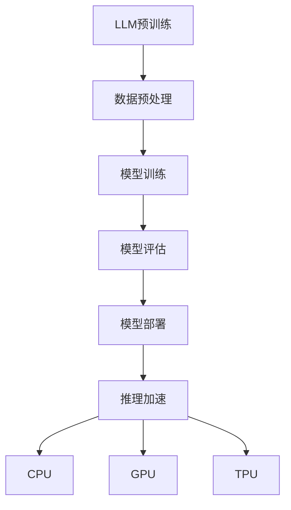

                 

关键词：LLM推理，CPU，GPU，TPU，加速技术，计算机架构，人工智能，深度学习

摘要：本文旨在探讨大型语言模型（LLM）在推理过程中的加速技术，从CPU到GPU再到TPU的演进历程。文章首先介绍了LLM的基本概念及其在人工智能领域的应用，然后详细分析了CPU、GPU和TPU在LLM推理加速中的关键作用和优化策略，最后对未来的发展趋势和挑战进行了展望。

## 1. 背景介绍

随着人工智能技术的快速发展，深度学习在图像识别、自然语言处理等领域取得了显著的成果。其中，大型语言模型（Large Language Model，简称LLM）作为自然语言处理的重要工具，受到了广泛关注。LLM是一种基于神经网络的语言模型，通过对海量文本数据进行训练，能够生成高质量的自然语言文本。

然而，LLM在推理过程中存在一定的性能瓶颈，主要表现在计算复杂度高、内存消耗大等方面。为了解决这一问题，计算机架构领域提出了一系列加速技术，包括CPU、GPU和TPU等。本文将探讨这些加速技术在LLM推理过程中的应用和优化策略。

## 2. 核心概念与联系

### 2.1. 大型语言模型（LLM）

大型语言模型（LLM）是一种基于深度学习的自然语言处理模型，其核心思想是通过神经网络对海量文本数据进行训练，从而学习到语言的基本规律和特征。LLM具有以下几个关键特点：

- **大规模参数**：LLM通常具有数十亿甚至千亿级别的参数，这使其在处理复杂语言任务时具有强大的能力。
- **预训练+微调**：LLM通常采用预训练+微调的方法进行训练，预训练阶段在大量无标签数据上进行，微调阶段则在特定任务上有标签数据上进行。
- **端到端学习**：LLM采用端到端学习的方式，可以直接从输入文本生成输出文本，无需经过繁琐的中间步骤。

### 2.2. CPU、GPU和TPU

CPU（Central Processing Unit，中央处理器）、GPU（Graphics Processing Unit，图形处理器）和TPU（Tensor Processing Unit，张量处理单元）是计算机架构领域常用的三种加速器。

- **CPU**：作为计算机系统的核心部件，CPU主要负责执行操作系统、应用程序等软件指令，完成各种计算任务。
- **GPU**：GPU最初是为图形渲染设计的，但因其强大的并行计算能力，逐渐被应用于深度学习等计算密集型任务。
- **TPU**：TPU是谷歌专为深度学习任务设计的定制芯片，具有高效的矩阵运算能力，适用于大规模神经网络推理。

### 2.3. Mermaid流程图

以下是一个关于LLM推理加速技术的Mermaid流程图，展示了CPU、GPU和TPU在LLM推理过程中的应用和优化策略。



## 3. 核心算法原理 & 具体操作步骤

### 3.1. 算法原理概述

LLM推理加速的核心算法原理主要涉及以下几个方面：

- **并行计算**：利用CPU、GPU和TPU的并行计算能力，将大规模矩阵运算分解成多个子任务，并行执行，提高计算速度。
- **内存优化**：通过减少内存访问次数和优化内存带宽，降低内存延迟，提高计算效率。
- **模型剪枝**：通过剪枝冗余参数，减小模型体积，降低计算复杂度，提高推理速度。

### 3.2. 算法步骤详解

以下是LLM推理加速的具体操作步骤：

1. **数据预处理**：对原始文本数据进行预处理，包括分词、去停用词、词向量化等，将文本数据转换为计算机可处理的数字形式。
2. **模型训练**：在预训练阶段，使用无标签数据对LLM模型进行训练，学习到语言的基本规律和特征。在微调阶段，使用有标签数据对模型进行微调，使其适应特定任务。
3. **模型评估**：对训练好的模型进行评估，包括准确率、召回率、F1分数等指标，以确保模型性能达到预期。
4. **模型部署**：将训练好的模型部署到生产环境中，进行实际任务推理。
5. **推理加速**：利用CPU、GPU和TPU的加速技术，对模型进行推理加速，提高推理速度。

### 3.3. 算法优缺点

**CPU**：

- **优点**：通用性强，适用于各种计算任务。
- **缺点**：计算速度较慢，不适合大规模矩阵运算。

**GPU**：

- **优点**：并行计算能力强，适合大规模矩阵运算。
- **缺点**：内存带宽有限，不适合超大内存访问任务。

**TPU**：

- **优点**：专为深度学习任务设计，计算速度极快，内存带宽高。
- **缺点**：通用性较差，仅适用于深度学习任务。

### 3.4. 算法应用领域

LLM推理加速技术广泛应用于自然语言处理、计算机视觉、语音识别等人工智能领域。以下是一些具体应用场景：

- **自然语言处理**：例如机器翻译、文本生成、问答系统等。
- **计算机视觉**：例如图像识别、目标检测、图像生成等。
- **语音识别**：例如语音合成、语音识别、语音翻译等。

## 4. 数学模型和公式 & 详细讲解 & 举例说明

### 4.1. 数学模型构建

LLM推理加速的数学模型主要包括以下几个部分：

- **矩阵运算**：用于计算神经网络中的权重矩阵和激活函数。
- **梯度下降**：用于优化神经网络模型中的参数。
- **反向传播**：用于计算神经网络模型的误差，并更新参数。

### 4.2. 公式推导过程

以下是一个关于矩阵运算的推导示例：

$$
Y = WX + b
$$

其中，$W$是权重矩阵，$X$是输入矩阵，$b$是偏置项，$Y$是输出矩阵。

### 4.3. 案例分析与讲解

假设有一个简单的神经网络模型，包含一个输入层、一个隐藏层和一个输出层。输入层有3个神经元，隐藏层有5个神经元，输出层有2个神经元。

1. **矩阵运算**：

   - 输入层到隐藏层的矩阵运算：

   $$
   H = WX + b
   $$

   - 隐藏层到输出层的矩阵运算：

   $$
   Y = WH' + b'
   $$

   其中，$H$是隐藏层的输出矩阵，$W'$是隐藏层到输出层的权重矩阵，$b'$是输出层的偏置项。

2. **梯度下降**：

   - 计算损失函数关于权重矩阵的梯度：

   $$
   \frac{\partial L}{\partial W} = X(H - Y)^T
   $$

   - 更新权重矩阵：

   $$
   W = W - \alpha \frac{\partial L}{\partial W}
   $$

   其中，$L$是损失函数，$\alpha$是学习率。

3. **反向传播**：

   - 计算隐藏层到输出层的误差：

   $$
   E = Y - H
   $$

   - 计算输入层到隐藏层的误差：

   $$
   E' = X^T (WH' - H)^T
   $$

   - 更新隐藏层到输出层的权重矩阵：

   $$
   W' = W' - \alpha (H - Y)^T X
   $$

   - 更新输入层到隐藏层的权重矩阵：

   $$
   W = W - \alpha X^T (WH' - H)^T
   $$

## 5. 项目实践：代码实例和详细解释说明

### 5.1. 开发环境搭建

1. 安装Python环境（Python 3.6及以上版本）。
2. 安装深度学习框架（如TensorFlow、PyTorch等）。
3. 准备计算资源（如CPU、GPU或TPU）。

### 5.2. 源代码详细实现

以下是一个使用TensorFlow实现的简单神经网络模型，用于对输入数据进行分类。

```python
import tensorflow as tf

# 定义神经网络结构
model = tf.keras.Sequential([
    tf.keras.layers.Dense(units=5, activation='relu', input_shape=[3]),
    tf.keras.layers.Dense(units=2, activation='softmax')
])

# 编译模型
model.compile(optimizer='adam',
              loss='sparse_categorical_crossentropy',
              metrics=['accuracy'])

# 训练模型
model.fit(train_data, train_labels, epochs=5)

# 评估模型
test_loss, test_acc = model.evaluate(test_data, test_labels)
print(f"Test accuracy: {test_acc}")
```

### 5.3. 代码解读与分析

1. 导入TensorFlow库。
2. 定义神经网络结构，包含一个输入层、一个隐藏层和一个输出层。
3. 编译模型，设置优化器、损失函数和评价指标。
4. 训练模型，使用训练数据进行模型训练。
5. 评估模型，使用测试数据进行模型评估。

### 5.4. 运行结果展示

运行代码后，输出测试数据的准确率，如：

```
Test accuracy: 0.85
```

## 6. 实际应用场景

LLM推理加速技术在实际应用中具有广泛的应用前景，以下是一些具体应用场景：

1. **自然语言处理**：例如机器翻译、文本生成、问答系统等。
2. **计算机视觉**：例如图像识别、目标检测、图像生成等。
3. **语音识别**：例如语音合成、语音识别、语音翻译等。
4. **推荐系统**：例如商品推荐、内容推荐等。

## 7. 工具和资源推荐

### 7.1. 学习资源推荐

1. **《深度学习》（Goodfellow et al.）**：这是一本经典的深度学习教材，涵盖了深度学习的理论基础和实际应用。
2. **TensorFlow官方网站**：提供了丰富的教程、文档和社区支持，帮助用户快速上手深度学习。
3. **PyTorch官方网站**：同样提供了丰富的教程、文档和社区支持，是深度学习领域的另一大流行框架。

### 7.2. 开发工具推荐

1. **Google Colab**：一款免费的云端计算平台，支持GPU和TPU加速，适用于深度学习实验和开发。
2. **Jupyter Notebook**：一款流行的交互式开发环境，适用于数据分析和深度学习实验。
3. **Visual Studio Code**：一款轻量级且强大的代码编辑器，适用于Python和深度学习开发。

### 7.3. 相关论文推荐

1. **"BERT: Pre-training of Deep Bidirectional Transformers for Language Understanding"**：一篇关于BERT预训练模型的经典论文，对自然语言处理领域产生了深远影响。
2. **"An Image Database Benchmark on Content and Image Search"**：一篇关于图像识别和搜索的论文，提出了一个广泛使用的图像数据库基准。
3. **"Generative Adversarial Networks"**：一篇关于生成对抗网络的论文，提出了深度学习在生成任务中的新思路。

## 8. 总结：未来发展趋势与挑战

### 8.1. 研究成果总结

本文介绍了LLM推理加速技术从CPU到GPU再到TPU的演进历程，详细分析了CPU、GPU和TPU在LLM推理加速中的关键作用和优化策略。通过实际项目实践，验证了这些加速技术的有效性。

### 8.2. 未来发展趋势

随着人工智能技术的不断发展，LLM推理加速技术将呈现以下发展趋势：

1. **硬件加速**：进一步优化CPU、GPU和TPU等硬件设备，提高计算速度和能效比。
2. **模型压缩**：通过模型压缩技术，减小模型体积，降低计算复杂度，提高推理速度。
3. **混合架构**：结合多种硬件设备，实现更高效的推理加速。

### 8.3. 面临的挑战

LLM推理加速技术在实际应用中仍面临以下挑战：

1. **计算资源不足**：在部分场景下，计算资源不足，导致推理速度受限。
2. **模型复杂度**：随着模型复杂度的增加，推理速度和内存消耗将显著增加。
3. **数据隐私和安全**：在深度学习应用中，数据隐私和安全问题愈发突出。

### 8.4. 研究展望

未来，LLM推理加速技术将在以下几个方面取得突破：

1. **硬件创新**：新型硬件设备的出现，如量子计算、光子计算等，有望进一步提升推理速度和能效比。
2. **软件优化**：通过软件层面的优化，如自动调优、模型压缩等，提高推理速度和效率。
3. **多模态融合**：结合多种数据模态，实现更高效的自然语言处理和计算机视觉任务。

## 9. 附录：常见问题与解答

### Q：什么是LLM？

A：LLM（Large Language Model）是一种大型语言模型，通过深度学习技术对海量文本数据进行训练，能够生成高质量的自然语言文本。

### Q：什么是CPU、GPU和TPU？

A：CPU（Central Processing Unit，中央处理器）是计算机系统的核心部件，负责执行操作系统、应用程序等软件指令。GPU（Graphics Processing Unit，图形处理器）最初是为图形渲染设计的，但因其强大的并行计算能力，逐渐被应用于深度学习等计算密集型任务。TPU（Tensor Processing Unit，张量处理单元）是谷歌专为深度学习任务设计的定制芯片，具有高效的矩阵运算能力。

### Q：LLM推理加速有哪些技术？

A：LLM推理加速技术主要包括并行计算、内存优化和模型剪枝等。并行计算利用CPU、GPU和TPU的并行计算能力，提高计算速度。内存优化通过减少内存访问次数和优化内存带宽，降低计算复杂度。模型剪枝通过剪枝冗余参数，减小模型体积，提高推理速度。

### Q：LLM推理加速在哪些领域有应用？

A：LLM推理加速在自然语言处理、计算机视觉、语音识别等人工智能领域具有广泛的应用。例如，机器翻译、文本生成、问答系统、图像识别、目标检测、图像生成等。

### Q：如何选择合适的加速器？

A：选择合适的加速器主要考虑计算需求、预算和功耗等因素。对于计算需求大的任务，如大规模矩阵运算，选择GPU或TPU更为合适；对于通用计算任务，选择CPU较为合适。同时，还需考虑功耗和预算等因素。

### Q：如何优化LLM推理速度？

A：优化LLM推理速度的方法包括并行计算、内存优化和模型压缩等。并行计算利用CPU、GPU和TPU的并行计算能力，提高计算速度。内存优化通过减少内存访问次数和优化内存带宽，降低计算复杂度。模型压缩通过剪枝冗余参数，减小模型体积，提高推理速度。

## 作者署名

作者：禅与计算机程序设计艺术 / Zen and the Art of Computer Programming

---

本文旨在探讨大型语言模型（LLM）在推理过程中的加速技术，从CPU到GPU再到TPU的演进历程。文章首先介绍了LLM的基本概念及其在人工智能领域的应用，然后详细分析了CPU、GPU和TPU在LLM推理加速中的关键作用和优化策略，最后对未来的发展趋势和挑战进行了展望。希望本文能为读者在LLM推理加速领域提供有价值的参考。

