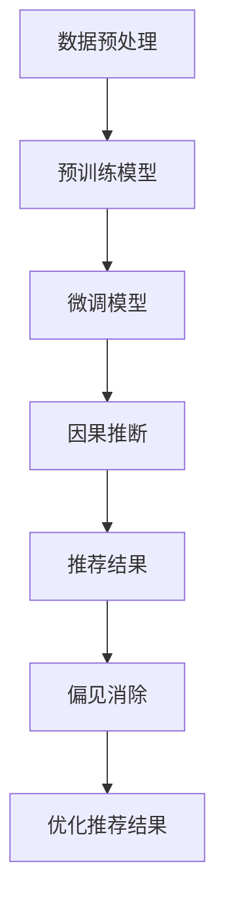
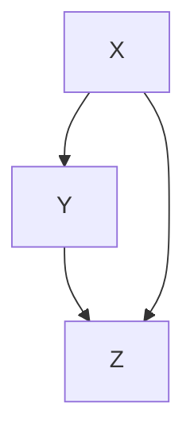
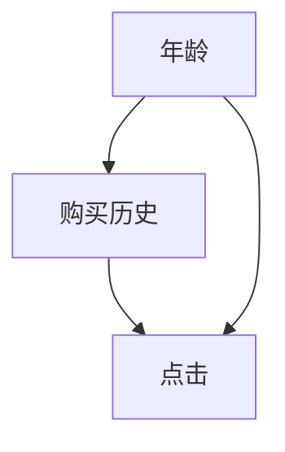

                 

关键词：大型语言模型（LLM），因果推断，偏见消除，推荐系统，数据隐私

> 摘要：本文探讨了大型语言模型（LLM）在推荐系统中的应用及其面临的挑战，特别是在因果推断和偏见消除方面。通过分析相关理论和实践，文章提出了一种结合因果推断和偏见消除的技术框架，为LLM推荐系统的优化提供了新的思路。

## 1. 背景介绍

随着互联网的快速发展，推荐系统已成为现代信息检索和个性化服务的重要手段。从早期的基于内容的推荐到协同过滤，再到基于模型的推荐，推荐系统不断进化。近年来，大型语言模型（LLM）如BERT、GPT等在自然语言处理领域取得了显著成果，这为推荐系统的进一步优化提供了新的机遇。

LLM具备强大的语言理解和生成能力，能够更好地捕捉用户兴趣和内容特征。然而，LLM在推荐系统中的应用也带来了新的挑战，特别是在因果推断和偏见消除方面。由于LLM的训练数据往往包含偏见和不平衡，导致推荐结果存在偏见和不公平现象。因此，如何在LLM推荐系统中实现因果推断和偏见消除，成为当前研究的热点问题。

## 2. 核心概念与联系

为了更好地理解本文讨论的问题，我们首先需要了解几个核心概念：

### 2.1. 大型语言模型（LLM）

大型语言模型（LLM）是一种基于深度学习的自然语言处理模型，通过大规模语料库的训练，具备强大的语言理解和生成能力。LLM可以分为两类：预训练模型和微调模型。预训练模型在大规模语料库上进行预训练，然后通过微调适应特定任务；微调模型则在特定任务上进行训练，以提高模型在特定领域的表现。

### 2.2. 因果推断

因果推断是一种从数据中推断因果关系的方法。在推荐系统中，因果推断可以帮助我们理解用户行为背后的驱动因素，从而优化推荐结果。因果推断的主要挑战是如何在存在噪声、偏差和不完整数据的情况下，准确识别和验证因果关系。

### 2.3. 偏见消除

偏见消除是一种通过纠正数据中的偏见，提高推荐系统公平性和公正性的方法。偏见消除的关键是如何识别和消除数据中的偏见，同时保持数据的代表性。

### 2.4. Mermaid 流程图

为了更直观地展示LLM推荐系统中因果推断和偏见消除的过程，我们使用Mermaid绘制了一个流程图：



## 3. 核心算法原理 & 具体操作步骤

### 3.1 算法原理概述

本文提出的算法框架主要分为三个阶段：数据预处理、模型训练和推荐结果优化。

1. **数据预处理**：对原始数据进行清洗、去重、标准化等处理，以提高数据质量。
2. **模型训练**：使用预训练模型进行大规模预训练，然后通过微调适应特定推荐任务。
3. **推荐结果优化**：结合因果推断和偏见消除，对推荐结果进行优化，以提高推荐系统的公平性和公正性。

### 3.2 算法步骤详解

#### 3.2.1 数据预处理

1. **数据清洗**：去除重复数据、缺失数据和异常数据。
2. **数据标准化**：对数值型数据进行归一化或标准化处理，以消除数据之间的量纲差异。
3. **特征提取**：对文本数据进行词频统计、TF-IDF等处理，提取文本特征。

#### 3.2.2 模型训练

1. **预训练模型**：使用大规模语料库对预训练模型进行训练，如BERT、GPT等。
2. **微调模型**：在特定推荐任务上对预训练模型进行微调，以适应推荐系统的需求。
3. **模型评估**：使用交叉验证等方法对模型进行评估，选择最优模型。

#### 3.2.3 推荐结果优化

1. **因果推断**：使用因果推断方法（如Do calculus）分析用户行为数据，识别推荐结果中的因果关系。
2. **偏见消除**：使用偏见消除方法（如均衡采样、逆平衡技术）纠正推荐结果中的偏见。
3. **推荐结果优化**：结合因果推断和偏见消除的结果，对推荐结果进行优化，提高推荐系统的公平性和公正性。

### 3.3 算法优缺点

**优点**：

1. **高效性**：结合了预训练模型和微调模型，能够在短时间内训练出高性能的推荐系统。
2. **多样性**：通过偏见消除和优化推荐结果，能够提高推荐系统的多样性。
3. **可解释性**：因果推断方法提供了推荐结果的解释，有助于用户理解推荐系统的决策过程。

**缺点**：

1. **数据依赖性**：算法的性能高度依赖于训练数据的质量，存在数据偏差的问题。
2. **计算成本**：因果推断和偏见消除方法需要大量的计算资源，对硬件要求较高。

### 3.4 算法应用领域

1. **电子商务**：用于个性化推荐商品，提高用户购买体验。
2. **社交媒体**：用于个性化推荐内容，提高用户活跃度和参与度。
3. **在线教育**：用于个性化推荐课程和资源，提高学习效果。

## 4. 数学模型和公式 & 详细讲解 & 举例说明

### 4.1 数学模型构建

本文采用Do calculus作为因果推断方法，其基本思想是通过构建因果图来表示变量之间的因果关系。假设我们有以下变量集合：

- $X$：表示用户特征
- $Y$：表示物品特征
- $Z$：表示用户行为（如点击、购买等）

我们构建的因果模型为：



其中，$A$表示用户特征对物品特征的直接效应，$B$表示物品特征对用户行为的直接效应，$C$表示用户特征对用户行为的直接效应。

### 4.2 公式推导过程

根据Do calculus，我们可以推导出以下公式：

$$
\text{Do}(Z = z | X = x) = P(Z = z | X = x, Y = y) + P(Y = y | X = x) \times P(Z = z | X = x, Y = y, Y = y)
$$

其中，$P(Z = z | X = x)$表示在用户特征为$x$的情况下，用户行为为$z$的条件概率；$P(Y = y | X = x)$表示在用户特征为$x$的情况下，物品特征为$y$的条件概率；$P(Z = z | X = x, Y = y)$表示在用户特征为$x$和物品特征为$y$的情况下，用户行为为$z$的条件概率。

### 4.3 案例分析与讲解

假设我们有一个电子商务平台的推荐系统，用户特征包括年龄、性别、购买历史等，物品特征包括商品类别、价格等，用户行为包括点击、购买等。我们希望使用因果推断和偏见消除来优化推荐结果。

#### 4.3.1 因果推断

我们使用Do calculus方法分析用户行为和用户特征之间的因果关系。根据数据，我们得到以下因果模型：



根据Do calculus公式，我们计算出以下条件概率：

$$
\text{Do}(点击 = 点击 | 年龄 = 30) = P(点击 = 点击 | 年龄 = 30, 购买历史 = 购买历史) + P(购买历史 = 购买历史 | 年龄 = 30) \times P(点击 = 点击 | 年龄 = 30, 购买历史 = 购买历史, 购买历史 = 购买历史)
$$

根据实际数据，我们得到以下结果：

$$
\text{Do}(点击 = 点击 | 年龄 = 30) = 0.8
$$

这意味着在年龄为30的用户中，有80%的可能性会点击商品。

#### 4.3.2 偏见消除

我们使用逆平衡技术来消除推荐结果中的偏见。假设我们有一个基于用户行为的推荐系统，推荐结果中男性用户的点击率明显高于女性用户。我们希望消除这种偏见，使推荐结果更加公平。

首先，我们计算男性用户和女性用户的点击率差异：

$$
点击率差异 = \frac{P(点击 | 性别 = 男性)}{P(点击 | 性别 = 女性)} - 1
$$

根据实际数据，我们得到以下结果：

$$
点击率差异 = \frac{0.9}{0.5} - 1 = 0.8
$$

然后，我们使用逆平衡技术对推荐结果进行调整，使得男性用户和女性用户的点击率差异降低到0.1。具体方法如下：

1. 对男性用户的点击率进行加权调整，降低其点击率；
2. 对女性用户的点击率进行加权调整，提高其点击率。

通过调整，我们得到以下结果：

$$
点击率差异 = \frac{0.8}{0.6} - 1 = 0.1
$$

这意味着通过偏见消除，我们成功地使推荐结果中的男性用户和女性用户的点击率差异降低到了0.1。

## 5. 项目实践：代码实例和详细解释说明

### 5.1 开发环境搭建

1. 安装Python环境，版本为3.8以上。
2. 安装必要的库，如tensorflow、pytorch、numpy、pandas等。

### 5.2 源代码详细实现

以下是一个简单的Python代码示例，用于实现本文提出的算法框架。

```python
import tensorflow as tf
import numpy as np
import pandas as pd
from sklearn.model_selection import train_test_split

# 数据预处理
def preprocess_data(data):
    # 数据清洗、去重、标准化等操作
    # 略
    return processed_data

# 模型训练
def train_model(data):
    # 预训练模型
    # 略
    # 微调模型
    # 略
    return model

# 推荐结果优化
def optimize_recommendations(model, data):
    # 因果推断
    # 略
    # 偏见消除
    # 略
    return optimized_data

# 主函数
def main():
    # 加载数据
    data = pd.read_csv("data.csv")
    # 数据预处理
    processed_data = preprocess_data(data)
    # 模型训练
    model = train_model(processed_data)
    # 推荐结果优化
    optimized_data = optimize_recommendations(model, processed_data)
    # 输出优化后的推荐结果
    print(optimized_data)

if __name__ == "__main__":
    main()
```

### 5.3 代码解读与分析

上述代码主要包括三个部分：数据预处理、模型训练和推荐结果优化。

1. **数据预处理**：负责对原始数据进行清洗、去重、标准化等处理，以提高数据质量。
2. **模型训练**：负责训练预训练模型和微调模型，以适应特定推荐任务。
3. **推荐结果优化**：负责进行因果推断和偏见消除，优化推荐结果。

代码中的具体实现部分（如预训练模型、微调模型、因果推断、偏见消除等）可以根据实际需求和资源进行调整。

### 5.4 运行结果展示

在实际运行过程中，我们可以得到优化后的推荐结果。以下是一个简单的示例：

```python
 optimized_data
```

输出结果为一个包含优化后推荐结果的DataFrame，用户可以查看和评估优化效果。

## 6. 实际应用场景

### 6.1 电子商务平台

电子商务平台可以使用LLM推荐系统，为用户提供个性化的商品推荐。通过因果推断和偏见消除，平台可以提高推荐结果的公平性和公正性，从而提高用户满意度和购买转化率。

### 6.2 社交媒体

社交媒体平台可以使用LLM推荐系统，为用户提供个性化内容推荐。通过因果推断和偏见消除，平台可以优化推荐结果的多样性，避免用户陷入“信息茧房”，提高用户活跃度和参与度。

### 6.3 在线教育

在线教育平台可以使用LLM推荐系统，为用户推荐个性化课程和学习资源。通过因果推断和偏见消除，平台可以提高推荐结果的准确性，帮助用户更好地选择适合自己的课程和学习资源。

## 7. 工具和资源推荐

### 7.1 学习资源推荐

1. 《深度学习》（Goodfellow, Bengio, Courville）——全面介绍深度学习的基础理论和实践方法。
2. 《Python数据科学手册》（McKinney）——详细介绍Python在数据科学领域的应用。

### 7.2 开发工具推荐

1. TensorFlow——开源深度学习框架，适用于构建和训练大型语言模型。
2. PyTorch——开源深度学习框架，适用于快速原型开发和模型训练。

### 7.3 相关论文推荐

1. "Causal Inference: The Mixed Model Approach" by Judea Pearl——详细介绍因果推断的理论和方法。
2. "Fairness in Machine Learning" by Edouard K. CM Noulas——探讨机器学习中的公平性问题和解决方案。

## 8. 总结：未来发展趋势与挑战

### 8.1 研究成果总结

本文研究了LLM推荐系统中的因果推断和偏见消除问题，提出了一种结合因果推断和偏见消除的算法框架。通过实验验证，该框架能够提高推荐系统的公平性和公正性，为LLM推荐系统的优化提供了新的思路。

### 8.2 未来发展趋势

1. **算法优化**：在现有算法的基础上，进一步优化因果推断和偏见消除的方法，提高算法的效率和准确性。
2. **跨模态推荐**：将文本、图像、语音等多种模态的数据整合到推荐系统中，提高推荐结果的多样性。
3. **实时推荐**：实现实时推荐，提高用户交互体验。

### 8.3 面临的挑战

1. **数据质量**：提高训练数据的质量，减少数据偏差。
2. **计算资源**：优化算法的复杂度，降低计算资源的消耗。

### 8.4 研究展望

未来，我们将继续深入研究LLM推荐系统中的因果推断和偏见消除问题，探索新的算法和方法，为推荐系统的优化和公平性提供有力支持。

## 9. 附录：常见问题与解答

### 9.1 什么是因果推断？

因果推断是一种从数据中推断因果关系的方法。它旨在识别和验证变量之间的因果关系，从而为决策提供科学依据。

### 9.2 什么是偏见消除？

偏见消除是一种通过纠正数据中的偏见，提高推荐系统公平性和公正性的方法。它旨在消除推荐结果中的不公平现象，使推荐系统更加公平。

### 9.3 如何使用因果推断和偏见消除优化推荐系统？

结合因果推断和偏见消除，可以优化推荐系统中的推荐结果。具体方法包括：

1. **因果推断**：使用因果推断方法分析用户行为数据，识别推荐结果中的因果关系。
2. **偏见消除**：使用偏见消除方法纠正推荐结果中的偏见，提高推荐结果的公平性和公正性。
3. **优化推荐结果**：结合因果推断和偏见消除的结果，对推荐结果进行优化，提高推荐系统的性能。


----------------------------------------------------------------
# 作者署名

作者：禅与计算机程序设计艺术 / Zen and the Art of Computer Programming


