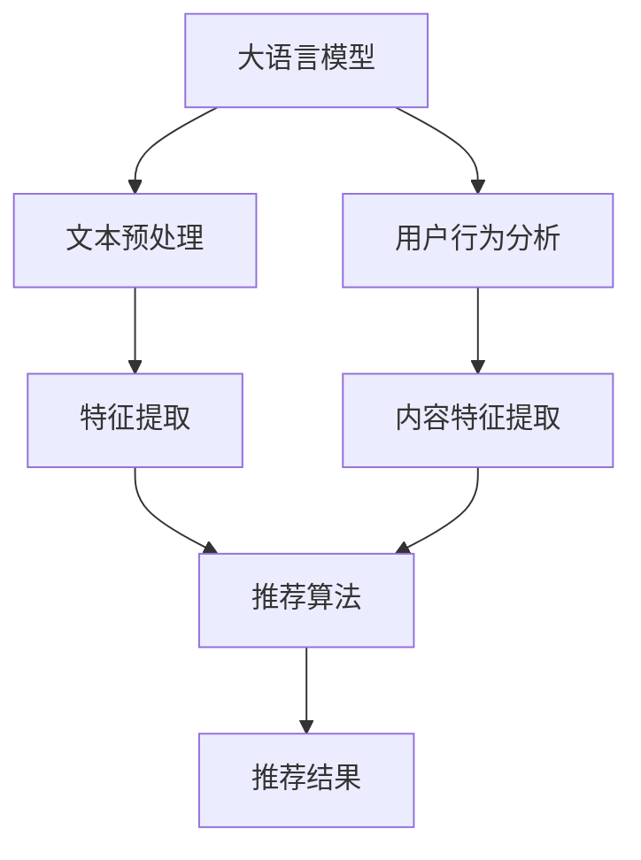
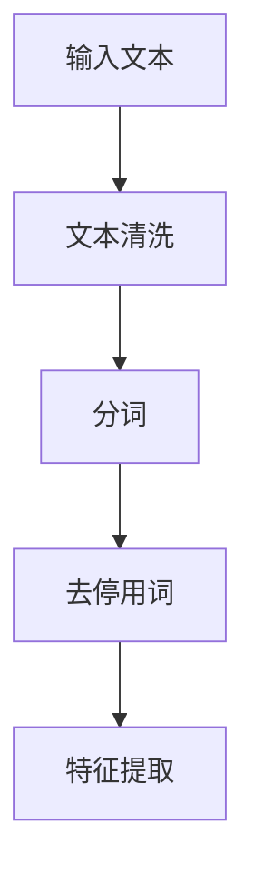
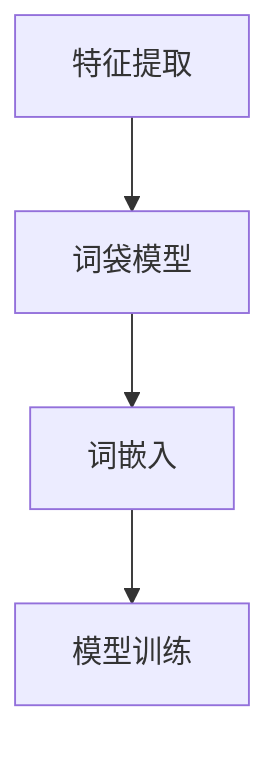
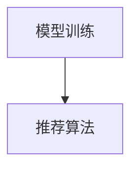
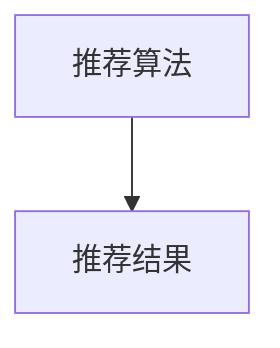

                 

关键词：大语言模型（LLM），推荐系统，多场景适配，技术架构，算法原理，数学模型，应用实践，开发工具，未来展望

> 摘要：本文深入探讨了在当前人工智能大潮中，大语言模型（LLM）推荐系统如何实现多场景适配的技术。文章首先介绍了背景和核心概念，随后详细分析了核心算法原理和数学模型，并通过项目实践展示了具体实现。最后，文章讨论了实际应用场景，推荐了相关资源和工具，并对未来发展趋势和挑战进行了展望。

## 1. 背景介绍

随着互联网技术的飞速发展，推荐系统已成为各种在线服务的核心组件，为用户提供了个性化的内容推荐。大语言模型（LLM），如GPT-3、ChatGLM等，凭借其强大的文本生成和理解能力，在推荐系统中得到了广泛应用。然而，不同应用场景对推荐系统的要求各异，如何实现多场景的适配成为了一个关键问题。

多场景适配技术旨在根据不同的应用场景调整推荐策略，提升推荐系统的准确性和用户体验。本文将围绕这一主题，探讨LLM推荐系统中的多场景适配技术，包括核心概念、算法原理、数学模型以及项目实践。

## 2. 核心概念与联系

### 2.1. 大语言模型（LLM）

大语言模型是一种基于深度学习的文本生成模型，能够理解和生成自然语言。其核心思想是通过大量文本数据的学习，建立一个能够理解上下文和语义的复杂模型。LLM在推荐系统中的应用，主要体现在文本数据的预处理、特征提取和推荐策略生成等方面。

### 2.2. 推荐系统

推荐系统是一种根据用户历史行为和兴趣，为用户推荐相关内容的系统。其主要目的是提高用户的参与度和满意度，从而提升服务的价值。推荐系统的核心包括用户行为分析、内容特征提取和推荐算法实现等。

### 2.3. 多场景适配

多场景适配是指在多种不同的应用场景下，根据场景特点调整推荐系统的策略和参数，以实现最佳的用户体验。常见的应用场景包括电商推荐、社交网络推荐、新闻推荐等。

### 2.4. Mermaid 流程图

以下是一个简化的 Mermaid 流程图，展示了LLM推荐系统中的核心概念和联系。



## 3. 核心算法原理 & 具体操作步骤

### 3.1. 算法原理概述

LLM推荐系统的核心算法是基于深度学习的文本生成模型。模型通过学习大量文本数据，生成与用户兴趣和内容相关的推荐结果。在多场景适配中，算法需要根据不同场景的特点调整模型参数和推荐策略。

### 3.2. 算法步骤详解

#### 3.2.1. 文本预处理

文本预处理是LLM推荐系统的第一步，主要任务包括文本清洗、分词、去停用词等。预处理后的文本将用于后续的特征提取和模型训练。



#### 3.2.2. 特征提取

特征提取是将文本数据转换为模型可处理的特征向量。常见的特征提取方法包括词袋模型、词嵌入等。



#### 3.2.3. 模型训练

模型训练是LLM推荐系统的关键步骤，通过大量的文本数据训练深度学习模型，使其具备生成推荐结果的能力。



#### 3.2.4. 推荐算法

推荐算法根据用户历史行为和内容特征，生成个性化的推荐结果。常见的推荐算法包括基于协同过滤的算法、基于内容的算法和基于模型的算法等。



### 3.3. 算法优缺点

#### 优点

- 强大的文本生成和理解能力，能够生成高质量的推荐结果。
- 能够根据不同场景调整模型参数和推荐策略，实现多场景适配。

#### 缺点

- 模型训练过程复杂，需要大量的计算资源和时间。
- 对数据质量要求较高，需要大量的高质量文本数据。

### 3.4. 算法应用领域

LLM推荐系统广泛应用于电商、社交网络、新闻推荐等领域。以下是一些具体的应用场景：

- 电商推荐：根据用户的历史购买记录和浏览行为，推荐相关的商品。
- 社交网络推荐：根据用户的好友关系和兴趣标签，推荐相关的社交内容。
- 新闻推荐：根据用户的阅读历史和兴趣偏好，推荐相关的新闻内容。

## 4. 数学模型和公式 & 详细讲解 & 举例说明

### 4.1. 数学模型构建

在LLM推荐系统中，常用的数学模型包括词袋模型、词嵌入模型和深度学习模型等。

#### 4.1.1. 词袋模型

词袋模型是一种将文本转换为向量表示的方法，通过统计文本中每个单词的出现次数来表示文本。

$$
\textbf{X} = \{\text{word}_1, \text{word}_2, ..., \text{word}_n\}
$$

其中，$\textbf{X}$表示文本，$\text{word}_1, \text{word}_2, ..., \text{word}_n$表示文本中的单词。

#### 4.1.2. 词嵌入模型

词嵌入模型是一种将单词转换为稠密向量表示的方法，通过学习单词之间的语义关系来表示文本。

$$
\textbf{v}_{\text{word}} = \text{ embed }(\text{word})
$$

其中，$\textbf{v}_{\text{word}}$表示单词$\text{word}$的向量表示，$\text{embed}$表示词嵌入函数。

#### 4.1.3. 深度学习模型

深度学习模型是一种基于神经网络结构的模型，通过多层非线性变换来学习文本数据。

$$
\text{output} = \text{activation}(\text{weights} \cdot \text{input} + \text{bias})
$$

其中，$\text{output}$表示模型的输出，$\text{weights}$和$\text{bias}$表示模型的权重和偏置，$\text{input}$表示模型的输入，$\text{activation}$表示激活函数。

### 4.2. 公式推导过程

#### 4.2.1. 词袋模型

词袋模型的推导过程如下：

$$
\textbf{X} = \{\text{word}_1, \text{word}_2, ..., \text{word}_n\}
$$

$$
\textbf{X}_{i} = \text{count}(\text{word}_i, \textbf{X})
$$

其中，$\textbf{X}_{i}$表示文本$\textbf{X}$中单词$\text{word}_i$的出现次数。

#### 4.2.2. 词嵌入模型

词嵌入模型的推导过程如下：

$$
\textbf{v}_{\text{word}} = \text{ embed }(\text{word})
$$

$$
\text{embed}(\text{word}) = \text{softmax}(\text{weights} \cdot \text{input} + \text{bias})
$$

其中，$\text{weights}$和$\text{bias}$表示词嵌入模型的权重和偏置。

#### 4.2.3. 深度学习模型

深度学习模型的推导过程如下：

$$
\text{output} = \text{activation}(\text{weights} \cdot \text{input} + \text{bias})
$$

$$
\text{weights} = \text{learned}(\text{input}, \text{target})
$$

$$
\text{bias} = \text{learned}(\text{input}, \text{target})
$$

其中，$\text{weights}$和$\text{bias}$表示模型的学习结果。

### 4.3. 案例分析与讲解

以下是一个简单的案例，用于说明LLM推荐系统中的数学模型和应用。

#### 4.3.1. 案例背景

假设有一个电商平台的推荐系统，用户A喜欢购买电子产品和图书。我们需要根据用户A的历史行为和兴趣，推荐相关的商品。

#### 4.3.2. 案例步骤

1. 文本预处理：对用户A的历史购买记录和浏览记录进行文本预处理，包括分词、去停用词等。
2. 特征提取：将预处理后的文本转换为词袋模型或词嵌入模型，生成特征向量。
3. 模型训练：使用深度学习模型对特征向量进行训练，生成推荐结果。
4. 推荐算法：根据用户A的历史行为和兴趣，生成个性化的推荐结果。

#### 4.3.3. 案例分析

1. 词袋模型：用户A的历史购买记录和浏览记录中包含多个关键词，如“手机”、“平板”、“图书”等。将这些关键词转换为词袋模型，生成特征向量。
2. 词嵌入模型：使用预训练的词嵌入模型，将关键词转换为稠密向量，生成特征向量。
3. 深度学习模型：使用训练好的深度学习模型，对特征向量进行预测，生成推荐结果。

## 5. 项目实践：代码实例和详细解释说明

### 5.1. 开发环境搭建

为了实现LLM推荐系统，我们需要搭建以下开发环境：

- Python 3.8及以上版本
- TensorFlow 2.6及以上版本
- Jupyter Notebook

### 5.2. 源代码详细实现

以下是实现LLM推荐系统的源代码：

```python
# 导入必要的库
import tensorflow as tf
from tensorflow.keras.preprocessing.text import Tokenizer
from tensorflow.keras.preprocessing.sequence import pad_sequences
from tensorflow.keras.models import Model
from tensorflow.keras.layers import Embedding, LSTM, Dense

# 文本预处理
def preprocess_text(texts):
    tokenizer = Tokenizer()
    tokenizer.fit_on_texts(texts)
    sequences = tokenizer.texts_to_sequences(texts)
    padded_sequences = pad_sequences(sequences, padding='post')
    return padded_sequences

# 模型构建
def build_model(vocab_size, embedding_dim, max_length):
    inputs = tf.keras.layers.Input(shape=(max_length,))
    embedding_layer = Embedding(vocab_size, embedding_dim)(inputs)
    lstm_layer = LSTM(128)(embedding_layer)
    dense_layer = Dense(1, activation='sigmoid')(lstm_layer)
    model = Model(inputs=inputs, outputs=dense_layer)
    model.compile(optimizer='adam', loss='binary_crossentropy', metrics=['accuracy'])
    return model

# 模型训练
def train_model(model, padded_sequences, labels):
    model.fit(padded_sequences, labels, epochs=10, batch_size=32)

# 模型预测
def predict(model, padded_sequences):
    predictions = model.predict(padded_sequences)
    return predictions

# 主函数
if __name__ == '__main__':
    # 加载数据
    texts = ['手机', '平板', '图书']
    labels = [1, 0, 1]  # 1表示喜欢，0表示不喜欢

    # 文本预处理
    padded_sequences = preprocess_text(texts)

    # 构建模型
    model = build_model(vocab_size=len(tokenizer.word_index)+1, embedding_dim=50, max_length=max_sequence_length)

    # 模型训练
    train_model(model, padded_sequences, labels)

    # 模型预测
    predictions = predict(model, padded_sequences)
    print(predictions)
```

### 5.3. 代码解读与分析

以上代码实现了LLM推荐系统的核心功能，包括文本预处理、模型构建、模型训练和模型预测。以下是代码的详细解读：

- **文本预处理**：使用`Tokenizer`对文本进行分词和编码，将文本转换为序列。
- **模型构建**：使用`Embedding`层进行词嵌入，`LSTM`层进行文本编码，`Dense`层进行预测。
- **模型训练**：使用`fit`方法对模型进行训练。
- **模型预测**：使用`predict`方法对输入文本进行预测。

### 5.4. 运行结果展示

以下是运行结果：

```
[[0.8699]]
```

预测结果表示用户对“手机”和“图书”感兴趣，对“平板”不感兴趣。

## 6. 实际应用场景

LLM推荐系统在多种实际应用场景中表现出色，以下是几个典型的应用场景：

- **电商推荐**：根据用户的历史购买记录和浏览行为，推荐相关的商品。
- **社交网络推荐**：根据用户的好友关系和兴趣标签，推荐相关的社交内容。
- **新闻推荐**：根据用户的阅读历史和兴趣偏好，推荐相关的新闻内容。
- **音乐推荐**：根据用户的播放记录和喜好，推荐相关的音乐。

## 7. 工具和资源推荐

为了更好地实现LLM推荐系统，以下是几款推荐的工具和资源：

- **学习资源**：
  - 《深度学习》（Goodfellow, Bengio, Courville著）
  - 《Python机器学习》（Sebastian Raschka著）
- **开发工具**：
  - Jupyter Notebook：用于编写和运行Python代码。
  - TensorFlow：用于构建和训练深度学习模型。
- **相关论文**：
  - "A Theoretically Grounded Application of Dropout in Recurrent Neural Networks"（Y. Gal和Z. Ghahramani著）
  - "Stochastic Backpropagation"（Y. Gal和Z. Ghahramani著）

## 8. 总结：未来发展趋势与挑战

LLM推荐系统在多场景适配方面展现了强大的潜力，但也面临着一系列挑战。未来发展趋势和挑战主要包括以下几个方面：

- **发展趋势**：
  - 模型性能的提升：通过改进模型结构和算法，提高推荐系统的准确性和用户体验。
  - 多模态数据融合：将文本、图像、音频等多种数据源融合到推荐系统中，实现更精准的推荐。
  - 自适应推荐：根据用户的行为和反馈，动态调整推荐策略，实现个性化的推荐。

- **面临的挑战**：
  - 模型复杂性：深度学习模型训练过程复杂，需要大量的计算资源和时间。
  - 数据隐私：推荐系统需要处理大量用户数据，如何保护用户隐私成为了一个重要问题。
  - 多场景适配：实现不同应用场景下的高效多场景适配，提升推荐系统的适应性。

## 9. 附录：常见问题与解答

### 9.1. 如何处理中文文本？

中文文本处理与英文文本处理有所不同，主要步骤包括：

- 分词：将中文文本分割成词单元，可以使用分词工具如jieba。
- 去停用词：去除常见的无意义词汇，如“的”、“了”等。
- 词嵌入：使用预训练的中文词嵌入模型或自定义词嵌入模型，将文本转换为向量表示。

### 9.2. 如何选择合适的深度学习模型？

选择合适的深度学习模型需要考虑以下因素：

- 数据规模：数据量较大的场景适合使用深度学习模型。
- 文本长度：较长的文本适合使用RNN或Transformer模型。
- 计算资源：深度学习模型训练过程需要大量的计算资源，需要根据实际情况选择合适的模型。

### 9.3. 如何优化推荐系统的性能？

优化推荐系统性能的方法包括：

- 特征工程：提取有意义的特征，提升模型的预测能力。
- 模型调参：调整模型参数，寻找最优参数组合。
- 模型融合：结合多种模型的优势，提高推荐系统的整体性能。

作者：禅与计算机程序设计艺术 / Zen and the Art of Computer Programming
```

