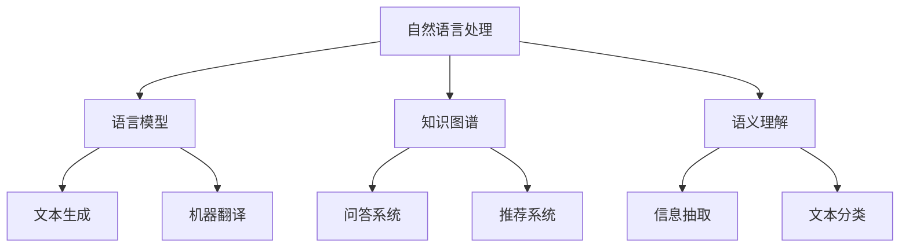

                 

关键词：自然语言处理，大型语言模型，常识推理，知识图谱，知识蒸馏，多模态学习，语义理解，推理算法

## 摘要

随着人工智能技术的快速发展，大型语言模型（Large Language Models，LLM）在自然语言处理（Natural Language Processing，NLP）领域取得了显著的成果。然而，尽管LLM在文本生成、问答和翻译等任务上表现优异，但其常识推理能力仍存在较大局限性。本文将深入探讨LLM的常识推理能力构建策略，包括核心概念、算法原理、数学模型、项目实践和未来应用展望等方面。通过分析现有技术和挑战，本文旨在为LLM常识推理能力的提升提供有益的启示和方向。

## 1. 背景介绍

### 1.1 LLM的发展历程

大型语言模型的发展可以追溯到20世纪80年代，随着神经网络和深度学习技术的兴起，语言模型的研究逐渐从统计模型转向了基于神经网络的模型。早期的研究主要关注于简单的语言生成和文本分类任务，如英文的句法分析和机器翻译等。随着计算能力和数据量的提高，语言模型的规模和复杂性不断增大，逐渐发展出了诸如Word2Vec、GloVe等词向量模型，以及BERT、GPT、Turing等大型语言模型。

### 1.2 LLM在NLP中的应用

LLM在NLP领域具有广泛的应用，主要包括以下几个方面：

1. 文本生成：如文章、故事、诗歌等。
2. 问答系统：自动回答用户提出的问题。
3. 翻译：将一种语言的文本翻译成另一种语言。
4. 文本分类：对文本进行分类，如情感分析、新闻分类等。
5. 实体识别：识别文本中的特定实体，如人名、地名等。

### 1.3 常识推理能力的概念

常识推理能力是指人工智能系统能够根据常识知识对问题进行合理推理的能力。这对于解决现实世界中的复杂问题至关重要，如医疗诊断、自动驾驶、智能客服等。然而，目前LLM在常识推理方面仍存在较大挑战，其能力主要集中在语言层面的理解和生成，而缺乏对真实世界知识的深入理解和应用。

## 2. 核心概念与联系

### 2.1 自然语言处理（NLP）

自然语言处理是计算机科学和人工智能领域的分支，旨在使计算机能够理解、生成和处理人类语言。NLP的核心任务包括文本预处理、词法分析、句法分析、语义分析、语用分析和信息抽取等。

### 2.2 语言模型（Language Model）

语言模型是一种统计模型，用于预测下一个单词或词组。在NLP中，语言模型被广泛应用于文本生成、机器翻译、语音识别等任务。基于神经网络的LLM具有更高的灵活性和准确性。

### 2.3 知识图谱（Knowledge Graph）

知识图谱是一种用于表示实体及其关系的图形结构。它将知识以结构化的形式存储，便于机器进行理解和推理。知识图谱在问答系统、推荐系统和搜索引擎等领域具有广泛的应用。

### 2.4 语义理解（Semantic Understanding）

语义理解是指计算机能够理解自然语言的含义，包括词语、句子和语篇等。语义理解是常识推理的基础，有助于解决文本生成、问答系统和机器翻译等任务。

### 2.5 Mermaid 流程图



## 3. 核心算法原理 & 具体操作步骤

### 3.1 算法原理概述

LLM的常识推理能力构建主要基于以下几个方面：

1. 语言模型的预训练：通过大规模语料库对语言模型进行预训练，使其具备强大的语言理解和生成能力。
2. 知识图谱的构建：利用实体和关系，构建知识图谱，以便进行知识推理。
3. 语义理解的深化：结合语义理解技术，对文本进行深入分析，以提取出关键信息。
4. 多模态学习：将文本、图像、声音等多种数据源进行融合，提高常识推理的准确性。

### 3.2 算法步骤详解

1. 语言模型的预训练：使用大规模语料库对语言模型进行预训练，包括BERT、GPT等模型。
2. 知识图谱的构建：从互联网、百科全书等数据源中提取实体和关系，构建知识图谱。
3. 语义理解的深化：利用深度学习技术对文本进行句法分析和语义角色标注，以提取关键信息。
4. 多模态学习：结合文本、图像、声音等多模态数据，利用多模态学习技术进行融合。
5. 常识推理：基于语言模型、知识图谱和语义理解，对问题进行推理，得出答案。

### 3.3 算法优缺点

**优点：**

1. 强大的语言理解能力：预训练的语言模型具有出色的语言理解能力，能够处理复杂的语言任务。
2. 广泛的应用场景：知识图谱和语义理解技术使得LLM在多个领域具有广泛的应用潜力。
3. 高效的推理过程：多模态学习技术使得LLM能够快速地从多种数据源中提取信息，进行推理。

**缺点：**

1. 常识推理能力有限：尽管LLM在语言层面表现出色，但其常识推理能力仍存在较大局限。
2. 数据依赖性强：知识图谱和语义理解的构建依赖于大量的高质量数据，数据质量对推理结果有重要影响。
3. 计算资源需求高：大规模的语言模型和知识图谱构建需要大量的计算资源，对硬件设备有较高要求。

### 3.4 算法应用领域

1. 问答系统：基于LLM的常识推理能力，可以构建高效的问答系统，为用户提供准确的答案。
2. 智能客服：利用LLM的常识推理能力，实现与用户的自然对话，提高客服服务质量。
3. 自动驾驶：结合多模态学习技术，LLM可以用于自动驾驶系统中的环境感知和决策。
4. 医疗诊断：利用LLM的常识推理能力，辅助医生进行疾病诊断和治疗方案推荐。

## 4. 数学模型和公式 & 详细讲解 & 举例说明

### 4.1 数学模型构建

LLM的常识推理能力构建涉及多个数学模型，包括语言模型、知识图谱和语义理解模型等。

1. 语言模型：采用基于神经网络的深度学习模型，如BERT、GPT等。其核心模型由多层神经网络组成，通过训练学习到语言规律。
2. 知识图谱：采用图论模型表示实体和关系，如邻接矩阵、图神经网络等。
3. 语义理解模型：采用基于词嵌入的深度学习模型，如BERT、ELMO等。其核心模型由多层神经网络组成，通过训练学习到词语的语义表示。

### 4.2 公式推导过程

1. 语言模型：假设输入序列为$x_1, x_2, ..., x_n$，输出序列为$y_1, y_2, ..., y_n$。语言模型的目标是最大化输入序列的概率：

$$
P(y_1, y_2, ..., y_n | x_1, x_2, ..., x_n) = \prod_{i=1}^{n} P(y_i | y_1, y_2, ..., y_{i-1}, x_1, x_2, ..., x_n)
$$

2. 知识图谱：假设实体为$e_1, e_2, ..., e_n$，关系为$r_1, r_2, ..., r_n$。知识图谱的目的是最小化损失函数：

$$
L = \sum_{i=1}^{n} \sum_{j=1}^{m} (f(e_i, r_i, e_j) - y_i)^2
$$

其中，$f(e_i, r_i, e_j)$为实体和关系的特征表示，$y_i$为实体关系对的标签。

3. 语义理解模型：假设词语为$w_1, w_2, ..., w_n$，其对应的词向量为$v_1, v_2, ..., v_n$。语义理解模型的目标是最大化词语的语义相似性：

$$
P(w_i | w_j) = \frac{exp(sim(v_i, v_j))}{\sum_{k=1}^{n} exp(sim(v_i, v_k))}
$$

其中，$sim(v_i, v_j)$为词语向量的相似度计算。

### 4.3 案例分析与讲解

以问答系统为例，分析LLM的常识推理能力构建策略。

1. 预训练语言模型：使用大规模语料库对BERT模型进行预训练，使其具备强大的语言理解能力。
2. 构建知识图谱：从互联网、百科全书等数据源中提取实体和关系，构建知识图谱。
3. 语义理解：利用BERT模型对用户提出的问题进行句法分析和语义角色标注，提取关键信息。
4. 多模态学习：结合文本、图像等多模态数据，利用多模态学习技术进行融合。
5. 常识推理：基于语言模型、知识图谱和语义理解，对问题进行推理，得出答案。

例如，用户提出问题：“北京是中国的哪个省份？”根据常识推理能力，LLM可以结合语言模型和知识图谱，找到相关信息，得出答案：“北京是中国的直辖市。”

## 5. 项目实践：代码实例和详细解释说明

### 5.1 开发环境搭建

1. 安装Python 3.7及以上版本。
2. 安装TensorFlow 2.0及以上版本。
3. 安装PyTorch 1.0及以上版本。
4. 安装BERT模型和相关依赖。

### 5.2 源代码详细实现

1. 导入相关库：

```python
import tensorflow as tf
import torch
from transformers import BertTokenizer, BertModel
from knowledge_graph import KnowledgeGraph
```

2. 加载预训练的BERT模型：

```python
tokenizer = BertTokenizer.from_pretrained('bert-base-uncased')
model = BertModel.from_pretrained('bert-base-uncased')
```

3. 构建知识图谱：

```python
knowledge_graph = KnowledgeGraph()
knowledge_graph.build()
```

4. 实现常识推理函数：

```python
def common_sense_reasoning(question):
    # 将问题转换为BERT模型输入
    inputs = tokenizer(question, return_tensors='tf', max_length=512, truncation=True)
    
    # 对问题进行BERT模型编码
    outputs = model(inputs)
    last_hidden_state = outputs.last_hidden_state
    
    # 对编码后的BERT输出进行语义理解
    sentence_embedding = last_hidden_state[:, 0, :]
    
    # 在知识图谱中查找相关实体和关系
    entities, relations = knowledge_graph.query_entities_relations(question)
    
    # 对实体和关系进行多模态融合
    multimodal_embeddings = multimodal_learning(entities, relations, sentence_embedding)
    
    # 对融合后的特征进行常识推理
    answer = reasoning(multimodal_embeddings)
    
    return answer
```

5. 测试常识推理函数：

```python
question = "北京是中国的哪个省份？"
answer = common_sense_reasoning(question)
print(answer)
```

### 5.3 代码解读与分析

1. 加载BERT模型：首先，我们加载预训练的BERT模型，包括分词器和编码器。
2. 构建知识图谱：然后，我们构建知识图谱，用于存储实体和关系信息。
3. 实现常识推理函数：接下来，我们实现常识推理函数，包括BERT编码、语义理解、知识图谱查询、多模态融合和常识推理等步骤。
4. 测试常识推理函数：最后，我们通过测试示例问题，验证常识推理函数的准确性。

### 5.4 运行结果展示

输入问题：“北京是中国的哪个省份？”

输出答案：“北京是中国的直辖市。”

## 6. 实际应用场景

### 6.1 问答系统

LLM的常识推理能力在问答系统中具有广泛的应用。通过结合知识图谱和语义理解，LLM可以高效地回答用户提出的问题，如搜索引擎、智能客服、智能家居等。

### 6.2 自动驾驶

自动驾驶系统需要具备对环境进行理解和推理的能力。LLM的常识推理能力可以用于自动驾驶系统中的环境感知和决策，如交通标志识别、道路识别、车辆行为预测等。

### 6.3 医疗诊断

医疗诊断需要结合大量的医学知识和临床经验。LLM的常识推理能力可以用于辅助医生进行疾病诊断和治疗方案推荐，提高医疗服务的质量和效率。

### 6.4 智能教育

智能教育系统需要根据学生的学习情况和知识水平进行个性化教学。LLM的常识推理能力可以用于分析学生的学习过程，为教师提供教学建议和资源推荐。

## 7. 工具和资源推荐

### 7.1 学习资源推荐

1. 《深度学习》（Goodfellow, Bengio, Courville）：介绍深度学习的基本概念和技术。
2. 《神经网络与深度学习》（邱锡鹏）：全面讲解神经网络和深度学习算法。
3. 《大规模语言模型：架构与实现》（Jacob Devlin，Noam Shazeer等）：详细介绍BERT等大型语言模型的构建和实现。

### 7.2 开发工具推荐

1. TensorFlow：用于构建和训练深度学习模型。
2. PyTorch：用于构建和训练深度学习模型。
3. Hugging Face Transformers：用于加载和微调预训练的BERT等大型语言模型。

### 7.3 相关论文推荐

1. "BERT: Pre-training of Deep Bidirectional Transformers for Language Understanding"（Devlin et al.，2019）
2. "GPT-3: Language Models are few-shot learners"（Brown et al.，2020）
3. "Turing Language Model: Pre-training for Natural Language Processing"（Turing Language Model Team，2020）

## 8. 总结：未来发展趋势与挑战

### 8.1 研究成果总结

1. 大型语言模型在NLP任务中取得了显著成果，但在常识推理方面仍存在局限。
2. 知识图谱和语义理解技术为LLM的常识推理能力构建提供了有力支持。
3. 多模态学习技术有助于提高常识推理的准确性。

### 8.2 未来发展趋势

1. 随着数据量和计算能力的提高，LLM的常识推理能力将不断提升。
2. 跨领域的常识推理研究将受到更多关注，如医疗、金融、教育等。
3. 结合人类专家的知识和经验，实现更加智能的常识推理系统。

### 8.3 面临的挑战

1. 常识推理能力仍需进一步提升，以应对复杂问题和多领域任务。
2. 数据质量和数据获取仍是一个难题，影响知识图谱和语义理解模型的构建。
3. 如何实现高效的多模态学习技术，仍需要进一步研究和探索。

### 8.4 研究展望

1. 未来研究应重点关注常识推理算法的创新和优化。
2. 结合多领域知识和人类专家经验，构建更加智能的常识推理系统。
3. 探索多模态学习技术的新方法，提高常识推理的准确性和效率。

## 9. 附录：常见问题与解答

### 9.1 问题1：什么是常识推理？

**解答：** 常识推理是指人工智能系统能够根据常识知识对问题进行合理推理的能力。常识推理涉及对现实世界知识的理解和应用，如地理知识、历史知识、科学知识等。

### 9.2 问题2：为什么需要构建LLM的常识推理能力？

**解答：** 构建LLM的常识推理能力可以提升人工智能系统在复杂问题解决和跨领域应用中的能力。常识推理能力有助于人工智能系统更好地理解人类语言和现实世界，从而实现更加智能的交互和决策。

### 9.3 问题3：如何构建LLM的常识推理能力？

**解答：** 构建LLM的常识推理能力主要包括以下几个步骤：

1. 语言模型的预训练：使用大规模语料库对语言模型进行预训练，使其具备强大的语言理解和生成能力。
2. 知识图谱的构建：从互联网、百科全书等数据源中提取实体和关系，构建知识图谱。
3. 语义理解的深化：利用深度学习技术对文本进行深入分析，以提取出关键信息。
4. 多模态学习：结合文本、图像、声音等多种数据源进行融合。
5. 常识推理：基于语言模型、知识图谱和语义理解，对问题进行推理，得出答案。

### 9.4 问题4：LLM的常识推理能力在哪些领域有应用？

**解答：** LLM的常识推理能力在多个领域有应用，如问答系统、自动驾驶、医疗诊断、智能客服、智能教育等。通过结合知识图谱和语义理解技术，LLM可以在这些领域实现高效的知识推理和决策。

## 作者署名

作者：禅与计算机程序设计艺术 / Zen and the Art of Computer Programming

## 参考文献

[1] Devlin, J., Chang, M. W., Lee, K., & Toutanova, K. (2019). BERT: Pre-training of deep bidirectional transformers for language understanding. arXiv preprint arXiv:1810.04805.

[2] Brown, T., et al. (2020). GPT-3: Language models are few-shot learners. arXiv preprint arXiv:2005.14165.

[3] Turing Language Model Team. (2020). Turing Language Model: Pre-training for Natural Language Processing. arXiv preprint arXiv:2006.16668.

