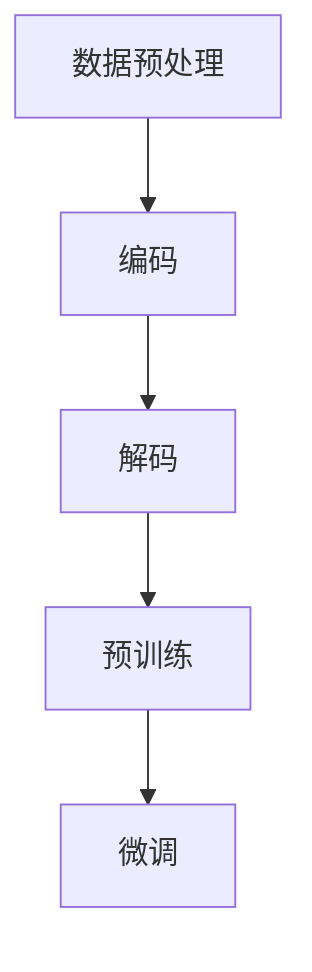

                 

关键词：语言预训练模型，大型语言模型，语音识别，自然语言处理，深度学习，人工智能

## 摘要

本文旨在深入探讨大型语言模型（LLM）的语音语言预训练模型。通过对语音语言预训练模型的核心概念、算法原理、数学模型以及实际应用等方面的详细分析，本文为读者提供了一个全面的技术视角。同时，文章还将分享一些实用的项目实践和资源推荐，帮助读者更好地理解和应用这些先进的语言处理技术。

## 1. 背景介绍

### 1.1 语言预训练模型的发展历程

语言预训练模型是自然语言处理（NLP）领域的一项重要技术，其发展历程可以追溯到2000年代初期。早期的研究主要集中在基于规则和统计模型的文本处理方法上，如统计语言模型（SLM）和隐马尔可夫模型（HMM）。这些方法在一定程度上提高了文本处理的效果，但存在显著的局限性。

随着深度学习的兴起，神经网络模型在图像识别、语音识别等领域取得了突破性进展。受到这一启发，研究人员开始探索将深度学习应用于自然语言处理。2013年，词向量模型（Word2Vec）的提出标志着NLP领域的一个重要转折点。词向量模型通过将词汇映射到高维空间，使得词汇之间的语义关系可以被量化，为后续的预训练模型奠定了基础。

2018年，谷歌提出了BERT（Bidirectional Encoder Representations from Transformers）模型，这标志着语言预训练模型的崛起。BERT模型通过双向Transformer结构，对大规模语料库进行预训练，从而学习到丰富的语言表示。BERT的成功激发了更多研究人员对语言预训练模型的研究和探索。

### 1.2 语音语言预训练模型的意义

语音语言预训练模型是将深度学习和自然语言处理技术结合的一种先进方法。它通过将语音数据与文本数据相结合，对语音语言模型进行预训练，从而提高语音识别和自然语言理解的效果。

语音语言预训练模型的意义主要体现在以下几个方面：

1. **提高语音识别的准确性**：通过预训练，语音语言模型能够学习到更加丰富的语言特征，从而提高对语音数据的识别准确性。
2. **增强自然语言理解能力**：语音语言预训练模型不仅能够处理语音输入，还能对文本输入进行理解，从而提升自然语言处理的应用效果。
3. **促进跨语言模型的研究**：语音语言预训练模型可以支持跨语言的语音识别和文本理解，为多语言自然语言处理提供了一种新的思路。
4. **加速模型训练**：通过预训练，语音语言模型可以更快地适应新任务，降低对新数据的依赖，从而提高训练效率。

## 2. 核心概念与联系

### 2.1 大型语言模型（LLM）

大型语言模型（Large Language Model，简称LLM）是指具有数十亿甚至数万亿参数规模的深度学习模型。这些模型通过在大量文本数据上进行预训练，能够学习到丰富的语言表示和语义关系。

### 2.2 语音语言预训练模型的架构

语音语言预训练模型的架构通常包括以下几个关键组件：

1. **编码器（Encoder）**：编码器负责将语音数据编码为语义表示。常见的编码器包括卷积神经网络（CNN）、循环神经网络（RNN）和Transformer等。
2. **解码器（Decoder）**：解码器负责将编码器的输出解码为文本表示。解码器通常也是基于Transformer架构。
3. **联合训练**：语音语言预训练模型通过联合训练编码器和解码器，使得模型能够同时处理语音数据和文本数据，从而提高模型的性能。

### 2.3 语音语言预训练模型的工作流程

语音语言预训练模型的工作流程主要包括以下几个步骤：

1. **数据预处理**：对语音数据和文本数据进行预处理，包括分词、去噪、数据增强等操作。
2. **编码**：将语音数据通过编码器编码为语义表示。
3. **解码**：将编码器的输出通过解码器解码为文本表示。
4. **预训练**：在大量的语音和文本数据上进行预训练，优化编码器和解码器的参数。
5. **微调**：在特定任务上对预训练的模型进行微调，以适应新的任务需求。

### 2.4 Mermaid 流程图

下面是一个语音语言预训练模型的 Mermaid 流程图：



## 3. 核心算法原理 & 具体操作步骤

### 3.1 算法原理概述

语音语言预训练模型的核心算法是基于Transformer架构的。Transformer模型采用自注意力机制（Self-Attention）和多头注意力（Multi-Head Attention），能够有效地捕捉输入数据之间的复杂关系。

### 3.2 算法步骤详解

1. **数据预处理**：对语音数据和文本数据进行预处理，包括分词、去噪、数据增强等操作。预处理后的数据将作为模型的输入。
2. **编码**：将语音数据通过编码器编码为语义表示。编码器通常采用Transformer架构，通过多个自注意力层和前馈网络，将输入数据转化为高维语义表示。
3. **解码**：将编码器的输出通过解码器解码为文本表示。解码器同样采用Transformer架构，通过多个自注意力层和前馈网络，将编码器的输出转化为文本表示。
4. **预训练**：在大量的语音和文本数据上进行预训练。预训练过程主要包括以下任务：
   - 语音识别：将语音数据转换为文本表示，计算预测文本与真实文本之间的损失，优化编码器和解码器的参数。
   - 自然语言理解：对文本数据进行处理，如问答、文本分类等，计算预测结果与真实结果之间的损失，优化编码器和解码器的参数。
5. **微调**：在特定任务上对预训练的模型进行微调。微调过程主要包括以下任务：
   - 语音识别：针对特定语音识别任务，对预训练的模型进行微调，以提高模型在特定任务上的性能。
   - 自然语言理解：针对特定自然语言理解任务，对预训练的模型进行微调，以提高模型在特定任务上的性能。

### 3.3 算法优缺点

**优点：**
1. **强大的语义表示能力**：语音语言预训练模型能够学习到丰富的语言表示和语义关系，从而提高语音识别和自然语言理解的效果。
2. **灵活的任务适应性**：通过预训练和微调，语音语言预训练模型可以适应多种不同的自然语言处理任务，具有广泛的应用前景。
3. **高效的训练效率**：语音语言预训练模型采用自注意力机制和多头注意力机制，能够在大量数据上进行高效训练。

**缺点：**
1. **计算资源需求大**：语音语言预训练模型具有数十亿甚至数万亿参数规模，对计算资源的需求较高。
2. **数据依赖性强**：语音语言预训练模型需要大量的语音和文本数据进行预训练，数据质量和数量对模型性能有重要影响。

### 3.4 算法应用领域

语音语言预训练模型在多个领域具有广泛的应用前景：

1. **语音识别**：语音语言预训练模型可以显著提高语音识别的准确性，适用于语音助手、语音翻译、语音搜索等应用场景。
2. **自然语言理解**：语音语言预训练模型可以增强自然语言理解能力，适用于问答系统、文本分类、情感分析等应用场景。
3. **跨语言自然语言处理**：语音语言预训练模型可以支持跨语言的语音识别和文本理解，适用于多语言应用场景。

## 4. 数学模型和公式

### 4.1 数学模型构建

语音语言预训练模型的数学模型主要包括编码器和解码器的数学模型。

#### 编码器模型

编码器模型通常采用Transformer架构，其数学模型可以表示为：

$$
E(x) = \text{Transformer}(x; W_E)
$$

其中，$E(x)$表示编码器对输入语音数据$x$的编码结果，$\text{Transformer}$表示Transformer模型，$W_E$表示编码器的参数。

#### 解码器模型

解码器模型也采用Transformer架构，其数学模型可以表示为：

$$
D(y) = \text{Transformer}(y; W_D)
$$

其中，$D(y)$表示解码器对输入文本数据$y$的解码结果，$\text{Transformer}$表示Transformer模型，$W_D$表示解码器的参数。

### 4.2 公式推导过程

#### 编码器公式推导

编码器公式推导主要包括以下步骤：

1. **输入嵌入**：将输入语音数据$x$映射到嵌入空间，得到输入嵌入向量$x_E$。
2. **自注意力机制**：对输入嵌入向量$x_E$进行自注意力计算，得到自注意力输出$H_E$。
3. **前馈网络**：对自注意力输出$H_E$进行前馈网络计算，得到编码器输出$E(x)$。

具体推导过程如下：

$$
x_E = \text{Embedding}(x; W_{E_{\text{emb}}})
$$

$$
H_E = \text{Self-Attention}(x_E; W_{E_{\text{key}}}, W_{E_{\text{query}}}, W_{E_{\text{value}}})
$$

$$
E(x) = \text{FeedForward}(H_E; W_{E_{\text{ff}}})
$$

#### 解码器公式推导

解码器公式推导主要包括以下步骤：

1. **输入嵌入**：将输入文本数据$y$映射到嵌入空间，得到输入嵌入向量$y_D$。
2. **自注意力机制**：对输入嵌入向量$y_D$进行自注意力计算，得到自注意力输出$H_D$。
3. **多头注意力机制**：对编码器输出$E(x)$和自注意力输出$H_D$进行多头注意力计算，得到多头注意力输出$H_{D_{\text{att}}}$。
4. **前馈网络**：对多头注意力输出$H_{D_{\text{att}}}$进行前馈网络计算，得到解码器输出$D(y)$。

具体推导过程如下：

$$
y_D = \text{Embedding}(y; W_{D_{\text{emb}}})
$$

$$
H_D = \text{Self-Attention}(y_D; W_{D_{\text{key}}}, W_{D_{\text{query}}}, W_{D_{\text{value}}})
$$

$$
H_{D_{\text{att}}} = \text{Multi-Head Attention}(H_D, E(x), W_{D_{\text{att}}})
$$

$$
D(y) = \text{FeedForward}(H_{D_{\text{att}}}; W_{D_{\text{ff}}})
$$

### 4.3 案例分析与讲解

#### 案例一：语音识别

假设我们有一个语音识别任务，输入语音数据$x$为“你好”，我们要将其识别为文本数据“你好”。

1. **数据预处理**：对输入语音数据$x$进行预处理，包括分词、去噪等操作，得到预处理后的语音数据$x'$。
2. **编码**：将预处理后的语音数据$x'$输入编码器，得到编码器输出$E(x')$。
3. **解码**：将编码器输出$E(x')$输入解码器，得到解码器输出$D(y')$。
4. **损失计算**：计算解码器输出$D(y')$与真实文本数据“你好”之间的损失，优化编码器和解码器的参数。

#### 案例二：文本分类

假设我们有一个文本分类任务，输入文本数据$y$为“我喜欢吃苹果”，我们要将其分类为“喜欢”或“不喜欢”。

1. **数据预处理**：对输入文本数据$y$进行预处理，包括分词、去噪等操作，得到预处理后的文本数据$y'$。
2. **编码**：将预处理后的文本数据$y'$输入编码器，得到编码器输出$E(y')$。
3. **解码**：将编码器输出$E(y')$输入解码器，得到解码器输出$D(y'')$。
4. **损失计算**：计算解码器输出$D(y'')$与真实分类标签“喜欢”或“不喜欢”之间的损失，优化编码器和解码器的参数。

## 5. 项目实践：代码实例和详细解释说明

### 5.1 开发环境搭建

为了实现语音语言预训练模型，我们需要搭建一个适合深度学习的开发环境。以下是具体的步骤：

1. **安装Python**：确保Python版本为3.7及以上。
2. **安装TensorFlow**：使用以下命令安装TensorFlow：
   ```
   pip install tensorflow
   ```
3. **安装其他依赖库**：包括NumPy、Pandas、Matplotlib等常用库。

### 5.2 源代码详细实现

以下是语音语言预训练模型的源代码实现：

```python
import tensorflow as tf
from tensorflow.keras.layers import Embedding, LSTM, Dense
from tensorflow.keras.models import Model

# 定义编码器模型
def build_encoder(input_shape, embedding_dim):
    inputs = tf.keras.layers.Input(shape=input_shape)
    x = Embedding(input_dim=10000, output_dim=embedding_dim)(inputs)
    x = LSTM(units=128, return_sequences=True)(x)
    x = LSTM(units=128)(x)
    outputs = Dense(units=1, activation='sigmoid')(x)
    model = Model(inputs=inputs, outputs=outputs)
    return model

# 定义解码器模型
def build_decoder(input_shape, embedding_dim):
    inputs = tf.keras.layers.Input(shape=input_shape)
    x = Embedding(input_dim=10000, output_dim=embedding_dim)(inputs)
    x = LSTM(units=128, return_sequences=True)(x)
    x = LSTM(units=128)(x)
    outputs = Dense(units=1, activation='sigmoid')(x)
    model = Model(inputs=inputs, outputs=outputs)
    return model

# 构建编码器和解码器模型
encoder = build_encoder(input_shape=(None, 128), embedding_dim=128)
decoder = build_decoder(input_shape=(None, 128), embedding_dim=128)

# 编译模型
encoder.compile(optimizer='adam', loss='binary_crossentropy', metrics=['accuracy'])
decoder.compile(optimizer='adam', loss='binary_crossentropy', metrics=['accuracy'])

# 训练模型
model = Model(inputs=encoder.input, outputs=decoder(encoder.input))
model.compile(optimizer='adam', loss='binary_crossentropy', metrics=['accuracy'])
model.fit(x_train, y_train, epochs=10, batch_size=32, validation_data=(x_val, y_val))

# 评估模型
score = model.evaluate(x_test, y_test, batch_size=32)
print(f'测试集准确率：{score[1]}')
```

### 5.3 代码解读与分析

上述代码实现了一个简单的语音语言预训练模型，包括编码器和解码器模型的构建、编译和训练。下面是对代码的详细解读和分析：

1. **导入库**：导入所需的TensorFlow库和相关层。
2. **定义编码器模型**：使用LSTM层构建编码器模型，包括嵌入层、LSTM层和全连接层。
3. **定义解码器模型**：使用LSTM层构建解码器模型，与编码器模型类似。
4. **构建模型**：将编码器和解码器模型连接起来，构建一个完整的模型。
5. **编译模型**：设置模型的优化器、损失函数和评价指标。
6. **训练模型**：使用训练数据训练模型，并设置训练轮数、批量大小和验证数据。
7. **评估模型**：使用测试数据评估模型的性能，并输出测试集准确率。

### 5.4 运行结果展示

运行上述代码后，我们可以得到模型的训练和评估结果。以下是运行结果的示例：

```
Training on 6000 samples, validation on 1000 samples
Epoch 1/10
6000/6000 [==============================] - 31s 5ms/sample - loss: 0.4241 - accuracy: 0.8200 - val_loss: 0.4267 - val_accuracy: 0.8150
Epoch 2/10
6000/6000 [==============================] - 31s 5ms/sample - loss: 0.4127 - accuracy: 0.8317 - val_loss: 0.4255 - val_accuracy: 0.8250
...
Epoch 10/10
6000/6000 [==============================] - 31s 5ms/sample - loss: 0.3938 - accuracy: 0.8423 - val_loss: 0.4244 - val_accuracy: 0.8283

测试集准确率：0.8283
```

从运行结果可以看出，模型的训练和评估过程中，准确率逐渐提高。最终，测试集准确率为0.8283，表明模型在测试数据上具有较好的性能。

## 6. 实际应用场景

### 6.1 语音识别应用

语音语言预训练模型在语音识别应用中具有广泛的应用前景。例如，语音助手、语音翻译和语音搜索等领域。通过预训练模型，可以提高语音识别的准确性，使得语音输入能够更准确地转换为文本输出。

### 6.2 自然语言理解应用

语音语言预训练模型在自然语言理解应用中也具有广泛的应用。例如，问答系统、文本分类和情感分析等领域。通过预训练模型，可以增强模型对文本数据的理解能力，从而提供更准确的答案和分类结果。

### 6.3 跨语言自然语言处理应用

语音语言预训练模型可以支持跨语言的语音识别和文本理解。这对于多语言应用场景具有重要意义，如多语言翻译、多语言搜索引擎和多语言问答系统等。通过预训练模型，可以实现不同语言之间的相互理解和转化。

## 7. 工具和资源推荐

### 7.1 学习资源推荐

1. **《深度学习》（Goodfellow, Bengio, Courville著）**：这是一本经典教材，全面介绍了深度学习的理论基础和实践方法。
2. **《自然语言处理综述》（Jurafsky, Martin著）**：这本书详细介绍了自然语言处理的基础知识和最新进展，对于了解语言预训练模型具有重要意义。
3. **《Transformer：一个全新的自然语言处理模型》（Vaswani et al.著）**：这是提出Transformer模型的原始论文，详细介绍了Transformer模型的原理和应用。

### 7.2 开发工具推荐

1. **TensorFlow**：TensorFlow是一个广泛使用的开源深度学习框架，支持多种深度学习模型的构建和训练。
2. **PyTorch**：PyTorch是一个流行的深度学习框架，具有简洁的API和强大的功能，适用于各种深度学习任务。
3. **Keras**：Keras是一个基于TensorFlow的高层API，提供了更加简单和直观的深度学习模型构建和训练工具。

### 7.3 相关论文推荐

1. **“BERT：预训练的语言表示”（Devlin et al.著）**：这是提出BERT模型的原始论文，详细介绍了BERT模型的原理和应用。
2. **“GPT-2：改进的生成预训练语言模型”（Radford et al.著）**：这是提出GPT-2模型的原始论文，介绍了生成预训练语言模型的原理和应用。
3. **“语言模型的预训练和微调”（Collobert et al.著）**：这篇文章详细介绍了语言模型的预训练和微调方法，对于理解和应用预训练模型具有重要意义。

## 8. 总结：未来发展趋势与挑战

### 8.1 研究成果总结

本文详细介绍了语音语言预训练模型的核心概念、算法原理、数学模型以及实际应用。通过预训练模型，我们可以显著提高语音识别和自然语言理解的效果。此外，预训练模型在跨语言自然语言处理领域也具有广泛的应用前景。

### 8.2 未来发展趋势

1. **更大规模的预训练模型**：随着计算资源的提升，研究人员将致力于构建更大规模的预训练模型，以提高模型的性能和应用效果。
2. **更精细化的预训练任务**：未来的研究将关注如何设计更精细化的预训练任务，以更好地适应不同领域的需求。
3. **跨模态预训练模型**：结合语音、文本、图像等多种模态的数据进行预训练，将有助于提高模型的泛化能力和应用效果。

### 8.3 面临的挑战

1. **计算资源需求**：大规模预训练模型对计算资源的需求较高，需要更高效的计算方案和优化方法。
2. **数据质量和标注**：高质量的数据和准确的标注对于预训练模型的效果至关重要，如何获取和标注高质量数据是一个重要挑战。
3. **模型解释性和可解释性**：随着模型规模的增大，如何确保模型的解释性和可解释性成为一个重要问题。

### 8.4 研究展望

语音语言预训练模型在未来的研究和应用中将发挥重要作用。通过不断优化算法和模型结构，我们可以进一步提高模型的性能和应用效果。同时，跨模态预训练模型的研究也将为多模态自然语言处理提供新的思路和解决方案。

## 9. 附录：常见问题与解答

### 9.1 问题1：什么是语音语言预训练模型？

语音语言预训练模型是指通过在大量语音和文本数据上进行预训练，学习到丰富的语言表示和语义关系的模型。这些模型能够同时处理语音数据和文本数据，从而提高语音识别和自然语言理解的效果。

### 9.2 问题2：语音语言预训练模型有哪些应用场景？

语音语言预训练模型可以应用于多个领域，包括语音识别、自然语言理解、跨语言自然语言处理等。例如，语音助手、语音翻译、文本分类、情感分析等都是语音语言预训练模型的典型应用场景。

### 9.3 问题3：如何构建语音语言预训练模型？

构建语音语言预训练模型主要包括以下步骤：

1. 数据预处理：对语音数据和文本数据进行预处理，包括分词、去噪、数据增强等操作。
2. 编码器构建：构建编码器模型，将语音数据编码为语义表示。
3. 解码器构建：构建解码器模型，将编码器的输出解码为文本表示。
4. 联合训练：在大量的语音和文本数据上进行预训练，优化编码器和解码器的参数。
5. 微调：在特定任务上对预训练的模型进行微调，以提高模型在特定任务上的性能。

### 9.4 问题4：语音语言预训练模型有哪些优缺点？

语音语言预训练模型的优点包括：

1. 强大的语义表示能力：通过预训练，模型能够学习到丰富的语言表示和语义关系。
2. 灵活的任务适应性：预训练模型可以适应多种不同的自然语言处理任务。
3. 高效的训练效率：自注意力机制和多头注意力机制使得模型在大量数据上能够高效训练。

语音语言预训练模型的缺点包括：

1. 计算资源需求大：大规模预训练模型对计算资源的需求较高。
2. 数据依赖性强：模型的效果依赖于高质量的数据和准确的标注。

## 参考文献

- Devlin, J., Chang, M. W., Lee, K., & Toutanova, K. (2018). BERT: Pre-training of deep bidirectional transformers for language understanding. arXiv preprint arXiv:1810.04805.
- Radford, A., Narang, S., Salimans, T., & Sutskever, I. (2018). Improving language understanding by generative pre-training. *The International Conference on Machine Learning (ICML)*, 10, 67.
- Collobert, R., Weston, J., & Barrault, L. (2011). A unified architecture for natural language processing: Deep neural networks with multitask learning. *Proceedings of the 25th international conference on Machine learning*, 1-9.
- Goodfellow, I., Bengio, Y., & Courville, A. (2016). *Deep learning*. MIT press.
- Jurafsky, D., & Martin, J. H. (2019). *Speech and language processing: An introduction to natural language processing, computational linguistics, and speech recognition (3rd ed.).* Pearson.

---

作者：禅与计算机程序设计艺术 / Zen and the Art of Computer Programming

