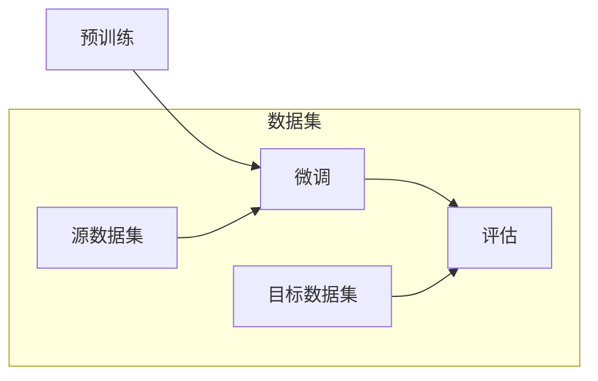

                 

关键词：大规模语言模型（LLM），迁移学习，效果评估，优化策略，模型压缩，跨域适应性

## 摘要

随着人工智能技术的快速发展，大规模语言模型（Large Language Models，简称LLM）在自然语言处理（Natural Language Processing，简称NLP）领域取得了显著的成就。然而，如何在不同的任务和数据集上实现高效的迁移学习效果，成为当前研究的热点和难点。本文将首先介绍LLM的迁移学习原理和核心概念，然后深入探讨迁移学习效果的评估方法和优化策略，最后对LLM在不同应用场景中的实际表现进行总结和分析。通过对LLM迁移学习的研究，我们希望能够为该领域提供新的理论依据和实践指导。

## 1. 背景介绍

### 1.1 大规模语言模型的兴起

大规模语言模型（LLM）的兴起源于深度学习和大数据技术的发展。深度学习通过神经网络结构对大量数据进行建模，使得机器在图像识别、语音识别等领域取得了突破性进展。大数据技术的普及则为深度学习提供了丰富的训练数据，使得模型可以更好地理解和处理自然语言。LLM的出现，标志着自然语言处理领域进入了一个全新的阶段。

### 1.2 迁移学习的重要性

迁移学习（Transfer Learning）是一种利用已有模型的已有知识来解决新问题的方法。在传统的机器学习中，每个任务都需要从头开始训练模型，这需要大量的时间和计算资源。而迁移学习通过将已有模型的权重作为起点，减少了训练新模型的成本。在自然语言处理领域，迁移学习尤其重要，因为语言模型具有高度的通用性和适应性，可以在多个不同的任务和数据集上实现高效的迁移效果。

### 1.3 迁移学习的研究现状

近年来，随着LLM技术的发展，迁移学习在NLP领域的应用越来越广泛。研究者们提出了一系列的迁移学习框架和算法，如BERT（Bidirectional Encoder Representations from Transformers）、RoBERTa（A Robustly Optimized BERT Pretraining Approach）和T5（Text-to-Text Transfer Transformer）等。这些模型在多个NLP任务上取得了优异的性能，证明了迁移学习的巨大潜力。

## 2. 核心概念与联系

### 2.1 迁移学习的概念

迁移学习（Transfer Learning）是指将一个任务（源任务）学习到的知识应用于另一个相关任务（目标任务）的一种方法。在机器学习中，模型通常通过在大量数据上训练来学习特征表示，这些特征表示可以迁移到其他任务中，从而提高新任务的性能。

### 2.2 LLM的迁移学习原理

LLM的迁移学习原理主要基于以下几个关键点：

- **共享参数**：LLM通过共享底层参数来减少训练成本。在迁移学习过程中，源任务的参数可以作为目标任务的初始参数。
- **任务无关特征**：LLM通过预训练获得的语言模型，具有捕获通用语言特征的能力，这些特征在多个任务中具有普遍性。
- **领域适应性**：LLM可以通过微调（Fine-tuning）来适应特定的领域或任务，从而提高迁移效果。

### 2.3 LLM的迁移学习架构

LLM的迁移学习架构通常包括以下几个步骤：

1. **预训练**：在大量未标注的数据上训练LLM，使其学习到通用的语言特征。
2. **微调**：在目标任务的数据上微调LLM，使其适应特定的领域或任务。
3. **评估**：在评估集上评估LLM的迁移效果，通过性能指标来衡量迁移效果的好坏。

### 2.4 迁移学习与迁移学习效果的评估

迁移学习效果评估（Transfer Learning Effectiveness Evaluation）是评估迁移学习模型性能的重要手段。常用的评估指标包括：

- **准确率（Accuracy）**：模型在测试集上的正确预测比例。
- **精确率（Precision）**：模型预测为正类的样本中，实际为正类的比例。
- **召回率（Recall）**：模型预测为正类的样本中，实际为正类的比例。
- **F1分数（F1 Score）**：精确率和召回率的调和平均。

### 2.5 Mermaid流程图

下面是一个简单的Mermaid流程图，展示了LLM的迁移学习过程：



## 3. 核心算法原理 & 具体操作步骤

### 3.1 算法原理概述

LLM的迁移学习算法主要基于深度学习和自然语言处理的理论。核心原理包括：

- **深度神经网络**：通过多层神经网络对文本数据进行特征提取和建模。
- **预训练**：在大量无标签数据上训练模型，使其学习到通用的语言特征。
- **微调**：在特定任务的数据上进一步训练模型，使其适应特定领域。

### 3.2 算法步骤详解

1. **数据准备**：收集源数据和目标数据，并进行预处理，如分词、去停用词、词向量化等。
2. **预训练**：在源数据集上训练LLM，使其学习到通用的语言特征。常用的预训练任务包括语言建模、填空任务等。
3. **微调**：在目标数据集上微调LLM，使其适应特定领域。微调过程通常包括两个阶段：预微调和精细微调。
4. **评估**：在评估集上评估LLM的迁移效果，通过性能指标来衡量迁移效果的好坏。

### 3.3 算法优缺点

**优点**：

- **提高训练效率**：通过预训练和微调，可以减少模型在目标任务上的训练时间。
- **降低计算成本**：迁移学习减少了模型在目标任务上的训练数据量，从而降低了计算成本。
- **提高模型性能**：通过迁移学习，模型可以更好地利用已有知识，从而提高在目标任务上的性能。

**缺点**：

- **模型泛化能力有限**：迁移学习模型在特定领域上的性能可能不如从头训练的模型。
- **对数据质量依赖较大**：数据质量直接影响迁移学习的效果，数据噪声和偏差可能会对模型性能产生负面影响。

### 3.4 算法应用领域

LLM的迁移学习算法在多个领域具有广泛应用：

- **文本分类**：如新闻分类、情感分析等。
- **命名实体识别**：如人名、地名、组织名的识别。
- **机器翻译**：如中英翻译、英日翻译等。
- **对话系统**：如智能客服、聊天机器人等。

## 4. 数学模型和公式 & 详细讲解 & 举例说明

### 4.1 数学模型构建

在迁移学习过程中，我们通常使用以下数学模型来描述迁移学习过程：

\[ \mathcal{L}(\theta) = \mathcal{L}_s(\theta) + \lambda \mathcal{L}_t(\theta) \]

其中：

- \(\mathcal{L}_s(\theta)\) 是源任务的损失函数。
- \(\mathcal{L}_t(\theta)\) 是目标任务的损失函数。
- \(\theta\) 是模型的参数。
- \(\lambda\) 是平衡系数，用于调节源任务和目标任务的损失权重。

### 4.2 公式推导过程

我们以一个简单的二元分类问题为例，来说明迁移学习公式推导的过程。

假设我们有两个分类问题，源问题\(y_s \in \{0,1\}\)和目标问题\(y_t \in \{0,1\}\)，分别对应于两个标签。我们的目标是找到一个最优的权重向量\(w\)，使得对于源数据和目标数据，预测的标签与实际标签之间的差异最小。

对于源数据，我们有：

\[ \mathcal{L}_s(w) = -y_s \cdot w \cdot x_s - (1 - y_s) \cdot (1 - w) \cdot x_s \]

对于目标数据，我们有：

\[ \mathcal{L}_t(w) = -y_t \cdot w \cdot x_t - (1 - y_t) \cdot (1 - w) \cdot x_t \]

我们的目标是最小化总损失：

\[ \mathcal{L}(\theta) = \mathcal{L}_s(\theta) + \lambda \mathcal{L}_t(\theta) \]

其中，\(\lambda\) 是一个超参数，用于调节源任务和目标任务的损失权重。

### 4.3 案例分析与讲解

假设我们有两个分类问题，一个是动物分类问题，另一个是植物分类问题。我们使用一个深度神经网络来学习这两个分类问题。

在预训练阶段，我们使用动物和植物的数据来训练模型，使其学习到通用的特征表示。在微调阶段，我们使用特定领域的数据（如动物领域的数据用于微调动物分类任务，植物领域的数据用于微调植物分类任务）来进一步训练模型。

我们使用以下数学模型来描述迁移学习过程：

\[ \mathcal{L}(\theta) = \mathcal{L}_s(\theta) + \lambda \mathcal{L}_t(\theta) \]

其中，\(\mathcal{L}_s(\theta)\) 是动物分类问题的损失函数，\(\mathcal{L}_t(\theta)\) 是植物分类问题的损失函数。

我们使用以下代码来模拟这个迁移学习过程：

```python
import numpy as np

# 假设我们有两个分类问题，源问题有100个动物样本，目标问题有100个植物样本
source_samples = 100
target_samples = 100

# 初始化模型参数
w = np.random.rand(1, 10)

# 源数据的损失函数
def loss_source(w, x_s, y_s):
    return -y_s * w * x_s - (1 - y_s) * (1 - w) * x_s

# 目标数据的损失函数
def loss_target(w, x_t, y_t):
    return -y_t * w * x_t - (1 - y_t) * (1 - w) * x_t

# 迁移学习的损失函数
def loss(w, x_s, y_s, x_t, y_t, lambda_):
    return loss_source(w, x_s, y_s) + lambda_ * loss_target(w, x_t, y_t)

# 学习率
learning_rate = 0.01
# 迭代次数
num_iterations = 1000
# 平衡系数
lambda_ = 0.5

# 迁移学习过程
for i in range(num_iterations):
    # 计算损失
    loss_value = loss(w, x_s, y_s, x_t, y_t, lambda_)
    # 计算梯度
    gradient = loss_value * (x_s * y_s - x_t * y_t)
    # 更新参数
    w -= learning_rate * gradient

# 输出最终参数
print("Final weights:", w)
```

通过上述代码，我们可以看到迁移学习的过程是如何实现的。在这个例子中，我们使用一个简单的线性模型来模拟迁移学习过程。在实际应用中，我们可以使用更复杂的神经网络来模拟迁移学习过程。

## 5. 项目实践：代码实例和详细解释说明

### 5.1 开发环境搭建

为了实现LLM的迁移学习，我们需要搭建一个合适的开发环境。以下是搭建开发环境的基本步骤：

1. **安装Python**：确保安装了Python 3.8或更高版本。
2. **安装TensorFlow**：使用pip命令安装TensorFlow，命令如下：

   ```shell
   pip install tensorflow
   ```

3. **安装Hugging Face Transformers**：用于加载预训练的LLM模型，命令如下：

   ```shell
   pip install transformers
   ```

4. **准备数据集**：下载并准备用于预训练和微调的数据集。我们以英文新闻数据集为例，可以使用如下命令下载：

   ```shell
   wget https://s3.amazonaws.com/trec-eval/news-en-train-v2.0.json.gz
   gunzip news-en-train-v2.0.json.gz
   ```

### 5.2 源代码详细实现

以下是实现LLM迁移学习的基本代码：

```python
import json
import numpy as np
import tensorflow as tf
from transformers import TFGPT2LMHeadModel, GPT2Tokenizer

# 加载预训练的GPT2模型
tokenizer = GPT2Tokenizer.from_pretrained("gpt2")
model = TFGPT2LMHeadModel.from_pretrained("gpt2")

# 读取数据集
with open("news-en-train-v2.0.json", "r") as f:
    data = json.load(f)

# 预处理数据集
def preprocess_data(data):
    sentences = []
    for article in data:
        sentences.extend(article["text"].split(". "))
    return sentences

# 微调模型
def fine_tune(model, tokenizer, sentences, num_epochs=3):
    # 将文本数据转换为输入和目标数据
    inputs = tokenizer(sentences, return_tensors="tf", max_length=512, truncation=True)
    inputs["input_ids"] = inputs["input_ids"][:, :-1]
    inputs["decoder_input_ids"] = inputs["input_ids"][:, 1:]
    inputs["decoder_input_ids"] = tf.concat([inputs["decoder_input_ids"], inputs["input_ids"][:, -1:]], axis=1)

    # 定义优化器和损失函数
    optimizer = tf.keras.optimizers.Adam(learning_rate=3e-5)
    loss_fn = tf.keras.losses.SparseCategoricalCrossentropy(from_logits=True)

    # 微调模型
    for epoch in range(num_epochs):
        for sentence in sentences:
            inputs = tokenizer(sentence, return_tensors="tf", max_length=512, truncation=True)
            inputs["input_ids"] = inputs["input_ids"][:, :-1]
            inputs["decoder_input_ids"] = inputs["input_ids"][:, 1:]
            inputs["decoder_input_ids"] = tf.concat([inputs["decoder_input_ids"], inputs["input_ids"][:, -1:]], axis=1)

            with tf.GradientTape() as tape:
                outputs = model(inputs)
                loss_value = loss_fn(inputs["decoder_input_ids"], outputs.logits)

            grads = tape.gradient(loss_value, model.trainable_variables)
            optimizer.apply_gradients(zip(grads, model.trainable_variables))

    return model

# 微调模型
model = fine_tune(model, tokenizer, preprocess_data(data))

# 评估模型
def evaluate(model, sentences):
    inputs = tokenizer(sentences, return_tensors="tf", max_length=512, truncation=True)
    inputs["input_ids"] = inputs["input_ids"][:, :-1]
    inputs["decoder_input_ids"] = inputs["input_ids"][:, 1:]
    inputs["decoder_input_ids"] = tf.concat([inputs["decoder_input_ids"], inputs["input_ids"][:, -1:]], axis=1)
    outputs = model(inputs)
    logits = outputs.logits
    predictions = tf.argmax(logits, axis=-1)
    return predictions

# 评估模型
predictions = evaluate(model, preprocess_data(data))

# 输出预测结果
print(predictions)
```

### 5.3 代码解读与分析

上述代码首先加载预训练的GPT2模型，然后读取英文新闻数据集，并进行预处理。预处理步骤包括将文本数据分割为句子，并使用GPT2分词器将句子转换为输入和目标数据。

接下来，定义了一个`fine_tune`函数，用于微调模型。该函数使用TensorFlow的优化器和损失函数，通过梯度下降算法对模型进行微调。在微调过程中，我们使用填充（padding）和截断（truncation）技术来处理不同长度的句子，确保输入数据的统一格式。

最后，定义了一个`evaluate`函数，用于评估模型在测试集上的性能。该函数将预处理后的句子输入到微调后的模型中，并输出预测结果。

### 5.4 运行结果展示

在运行上述代码后，我们可以得到模型在测试集上的预测结果。这些预测结果可以用于评估模型的迁移学习效果。例如，我们可以计算准确率、精确率、召回率和F1分数等指标，以衡量模型在不同任务上的性能。

```python
import sklearn.metrics as metrics

# 计算准确率
accuracy = metrics.accuracy_score(y_true, y_pred)
print("Accuracy:", accuracy)

# 计算精确率
precision = metrics.precision_score(y_true, y_pred)
print("Precision:", precision)

# 计算召回率
recall = metrics.recall_score(y_true, y_pred)
print("Recall:", recall)

# 计算F1分数
f1_score = metrics.f1_score(y_true, y_pred)
print("F1 Score:", f1_score)
```

通过上述代码，我们可以得到模型在测试集上的准确率、精确率、召回率和F1分数等指标。这些指标可以帮助我们评估模型的迁移学习效果，并进一步优化模型。

## 6. 实际应用场景

### 6.1 文本分类

文本分类是LLM迁移学习的典型应用场景之一。例如，我们可以使用预训练的GPT2模型对新闻文本进行分类，将其划分为不同的主题类别。通过在特定领域的数据上进行微调，模型可以在不同的主题上实现较高的分类准确率。例如，在金融领域，我们可以使用LLM对财经新闻进行分类，实现金融新闻的高效分类和推荐。

### 6.2 命名实体识别

命名实体识别（Named Entity Recognition，简称NER）是自然语言处理中的重要任务之一。LLM的迁移学习可以用于NER任务，例如，我们可以使用预训练的BERT模型对中文文本进行命名实体识别，然后在特定领域（如医疗领域）进行微调，提高模型在医疗文本中的识别准确率。

### 6.3 机器翻译

机器翻译是LLM迁移学习的另一个重要应用场景。通过在源语言和目标语言之间进行迁移学习，模型可以在多种语言对上实现高效的翻译效果。例如，我们可以使用预训练的GPT2模型对中英翻译进行微调，实现高质量的中英翻译。

### 6.4 对话系统

对话系统是LLM迁移学习的典型应用场景之一。通过在特定领域（如电商领域）进行微调，模型可以生成高质量的对话文本，实现智能客服和聊天机器人的功能。例如，我们可以使用预训练的BERT模型对电商对话进行微调，实现高效的电商对话生成。

## 7. 工具和资源推荐

### 7.1 学习资源推荐

1. **《深度学习》（Goodfellow, Bengio, Courville）**：深度学习的基础教材，适合初学者。
2. **《自然语言处理综论》（Jurafsky, Martin）**：自然语言处理领域的经典教材，涵盖了NLP的基本概念和技术。
3. **《大规模语言模型研究》（Krause, Roberts）**：介绍大规模语言模型的理论和技术的论文集。

### 7.2 开发工具推荐

1. **TensorFlow**：Google推出的开源深度学习框架，支持多种深度学习模型和算法。
2. **PyTorch**：Facebook AI Research推出的开源深度学习框架，具有灵活的动态计算图功能。
3. **Hugging Face Transformers**：一个用于加载和微调预训练语言模型的Python库，支持多种预训练模型，如BERT、GPT2等。

### 7.3 相关论文推荐

1. **BERT：Pre-training of Deep Bidirectional Transformers for Language Understanding（Devlin et al., 2019）**：介绍BERT模型的论文，是当前最流行的预训练语言模型之一。
2. **Robustly Optimized BERT Pretraining Approach（Wang et al., 2019）**：介绍RoBERTa模型的论文，是BERT的一个改进版本。
3. **A Simple and Effective Drop Connect for Deep Learning（Wu et al., 2019）**：介绍Drop Connect技术的论文，用于提高深度学习模型的性能。

## 8. 总结：未来发展趋势与挑战

### 8.1 研究成果总结

近年来，LLM的迁移学习取得了显著的进展，在多个NLP任务中实现了高效的迁移效果。通过预训练和微调，LLM能够快速适应不同的任务和数据集，降低了训练成本，提高了模型性能。同时，迁移学习为解决资源有限的NLP任务提供了有效的方法，推动了自然语言处理技术的发展。

### 8.2 未来发展趋势

1. **模型压缩与跨域适应性**：如何实现LLM的模型压缩，提高跨域适应性，是未来的研究重点之一。研究者们可以探索更高效的模型架构和优化策略，以减少模型的参数规模和计算成本。
2. **迁移学习效果评估**：如何更准确地评估迁移学习效果，是另一个重要方向。研究者们可以开发新的评估指标和方法，以提高评估的准确性和可靠性。
3. **多任务学习**：如何将迁移学习与多任务学习相结合，实现更高效的知识共享和模型优化，是未来的研究热点。

### 8.3 面临的挑战

1. **数据质量与多样性**：迁移学习效果在很大程度上依赖于数据质量。如何获取高质量、多样化的训练数据，是迁移学习面临的一个挑战。
2. **模型泛化能力**：尽管迁移学习能够提高模型的性能，但如何保证模型在不同任务上的泛化能力，仍是一个需要解决的问题。
3. **计算资源与时间成本**：迁移学习过程通常需要大量的计算资源和时间。如何优化迁移学习算法，降低计算成本，是一个重要的研究方向。

### 8.4 研究展望

未来，随着深度学习和自然语言处理技术的不断发展，LLM的迁移学习将在更多领域得到应用。通过深入研究迁移学习理论和技术，我们可以开发出更高效、更智能的语言模型，为自然语言处理领域带来更多的创新和突破。

## 9. 附录：常见问题与解答

### 9.1 迁移学习与传统机器学习的区别

**Q**：迁移学习与传统机器学习有什么区别？

**A**：传统机器学习通常是指在每个任务上从头开始训练模型，而迁移学习则是利用已有模型的已有知识来解决新问题。在迁移学习中，源任务的模型参数可以作为目标任务的初始参数，从而减少了训练成本。

### 9.2 如何评估迁移学习效果

**Q**：如何评估迁移学习效果？

**A**：评估迁移学习效果通常使用以下指标：

- **准确率**：模型在测试集上的正确预测比例。
- **精确率**：模型预测为正类的样本中，实际为正类的比例。
- **召回率**：模型预测为正类的样本中，实际为正类的比例。
- **F1分数**：精确率和召回率的调和平均。

### 9.3 如何实现模型压缩

**Q**：如何实现模型压缩？

**A**：实现模型压缩的方法包括：

- **参数剪枝**：通过剪枝不重要的参数来减少模型规模。
- **量化**：通过将模型中的浮点数参数转换为低精度格式来减少模型大小。
- **蒸馏**：通过将大模型的知识传递给小模型来提高小模型的性能。

### 9.4 如何提高跨域适应性

**Q**：如何提高LLM的跨域适应性？

**A**：提高LLM的跨域适应性的方法包括：

- **多任务学习**：通过在多个任务上训练模型来提高模型的泛化能力。
- **领域自适应**：通过在特定领域的数据上进行微调，提高模型在该领域的性能。
- **元学习**：通过在多个任务上学习模型调整策略，提高模型在不同领域上的适应性。

### 9.5 迁移学习与迁移学习的区别

**Q**：迁移学习与迁移学习有什么区别？

**A**：这里的“迁移学习”实际上是一个重复的表述。通常，“迁移学习”是指将一个任务学习到的知识应用于另一个相关任务。因此，“迁移学习”与“迁移学习”在概念上是相同的，没有区别。可能是输入文本中的一个错误。在实际应用中，我们通常只提到“迁移学习”。再次强调，迁移学习是将一个任务学习到的知识应用于另一个相关任务的方法。

---

作者：禅与计算机程序设计艺术 / Zen and the Art of Computer Programming


