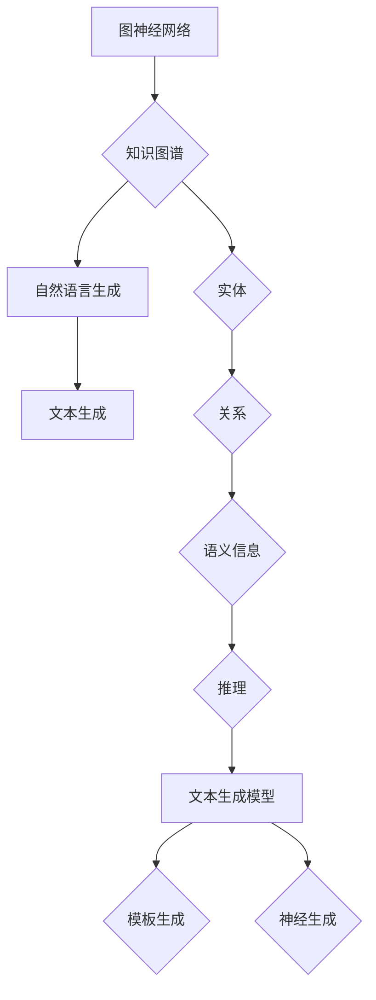

                 

关键词：LangChain，自然语言处理，人工智能，文本生成，知识图谱，深度学习，编程语言，代码生成，自然语言理解

> 摘要：本文旨在为初学者深入浅出地介绍 LangChain，一款革命性的基于人工智能的自然语言处理工具。通过详细的讲解，读者将了解 LangChain 的核心概念、算法原理、应用场景以及未来发展趋势，为掌握这一前沿技术打下坚实基础。

## 1. 背景介绍

随着互联网和大数据的飞速发展，自然语言处理（Natural Language Processing，NLP）已成为人工智能领域的重要分支。NLP 的目标是使计算机能够理解和生成自然语言，从而实现人机交互、智能问答、文本分析等应用。然而，传统的 NLP 技术往往依赖于大量的手工特征工程和规则，导致模型复杂度高、训练时间较长、适应性差。

近年来，深度学习在 NLP 领域取得了显著进展，尤其是基于神经网络的自然语言生成（Natural Language Generation，NLG）技术。然而，深度学习模型通常需要大量的数据和计算资源，且难以解释和优化。为了解决这些问题，研究人员提出了 LangChain，一款基于图神经网络的文本生成工具。

LangChain 的灵感来源于图神经网络（Graph Neural Network，GNN）在知识图谱（Knowledge Graph，KG）处理中的应用。知识图谱是一种用于表示实体及其关系的语义网络，广泛用于问答系统、推荐系统和信息检索等领域。LangChain 利用 GNN 的特性，将文本表示为图结构，从而实现高效、可解释的自然语言生成。

## 2. 核心概念与联系

### 2.1 LangChain 的核心概念

LangChain 的核心概念包括图神经网络（GNN）、知识图谱（KG）和自然语言生成（NLG）。以下是这些概念的具体解释：

#### 图神经网络（GNN）

GNN 是一种用于处理图结构数据的神经网络。与传统的卷积神经网络（CNN）和循环神经网络（RNN）不同，GNN 直接操作图中的节点和边，利用图结构信息进行特征学习和推理。GNN 的主要优势在于能够自动提取图中的结构信息，实现节点分类、链接预测和图谱补全等任务。

#### 知识图谱（KG）

知识图谱是一种用于表示实体及其关系的语义网络。实体可以是人物、地点、组织或概念等，关系描述了实体之间的语义联系。知识图谱在信息检索、问答系统和推荐系统等领域具有广泛的应用。知识图谱的关键特性是能够将语义信息以结构化的形式表示，便于计算机处理和分析。

#### 自然语言生成（NLG）

NLG 是一种使计算机能够自动生成自然语言文本的技术。NLG 技术包括模板生成、统计生成和神经生成等。NLG 的目标是实现自然、流畅和语义准确的文本生成，广泛应用于对话系统、新闻报道和机器翻译等领域。

### 2.2 LangChain 的架构

LangChain 的架构包括三个主要组件：图神经网络（GNN）、知识图谱（KG）和自然语言生成（NLG）。以下是这三个组件的详细说明：

#### 图神经网络（GNN）

LangChain 使用 GNN 作为文本生成的基础模型。GNN 将文本表示为图结构，其中节点表示单词或句子，边表示单词之间的语义关系。GNN 利用图结构信息进行特征学习和推理，从而实现文本生成。

#### 知识图谱（KG）

LangChain 利用知识图谱存储和查询实体及其关系。知识图谱为 GNN 提供了丰富的语义信息，有助于生成更准确、更丰富的文本。

#### 自然语言生成（NLG）

LangChain 使用基于 GNN 和 KG 的文本生成模型，结合模板生成和神经生成技术，实现自然语言生成。NLG 模型能够根据输入的实体和关系，生成具有语义一致性和连贯性的文本。

### 2.3 Mermaid 流程图

为了更直观地展示 LangChain 的架构，我们使用 Mermaid 流程图描述其核心概念和联系。以下是 Mermaid 流程图的代码和渲染结果：



## 3. 核心算法原理 & 具体操作步骤

### 3.1 算法原理概述

LangChain 的核心算法基于图神经网络（GNN）和知识图谱（KG）。GNN 用于处理图结构数据，提取节点和边之间的特征关系。知识图谱为 GNN 提供了丰富的语义信息，有助于生成更准确的文本。

具体来说，LangChain 的算法原理包括以下步骤：

1. **文本预处理**：将输入的文本数据转换为图结构，其中节点表示单词或句子，边表示单词之间的语义关系。
2. **知识图谱构建**：将实体和关系存储在知识图谱中，为 GNN 提供语义信息。
3. **图神经网络训练**：利用 GNN 模型提取图结构数据中的特征，并训练模型。
4. **自然语言生成**：结合知识图谱和 GNN 模型，生成自然语言文本。

### 3.2 算法步骤详解

以下是 LangChain 的具体操作步骤：

#### 步骤 1：文本预处理

1. **分词**：将输入文本分为单词或句子。
2. **词向量表示**：将分词后的文本转换为词向量表示。
3. **构建图结构**：将词向量表示转换为图结构，其中节点表示单词或句子，边表示单词之间的语义关系。

#### 步骤 2：知识图谱构建

1. **实体提取**：从输入文本中提取实体，如人名、地点和组织等。
2. **关系提取**：从输入文本中提取实体之间的关系，如上下级关系、同类关系等。
3. **知识图谱构建**：将提取的实体和关系存储在知识图谱中。

#### 步骤 3：图神经网络训练

1. **图神经网络模型设计**：设计 GNN 模型，包括节点表示、边表示和图结构表示。
2. **模型训练**：利用训练数据训练 GNN 模型，提取图结构数据中的特征。
3. **模型优化**：通过优化算法（如梯度下降）调整模型参数，提高模型性能。

#### 步骤 4：自然语言生成

1. **文本生成**：利用训练好的 GNN 模型和知识图谱生成自然语言文本。
2. **语义一致性检查**：检查生成的文本是否与输入文本的语义一致。
3. **连贯性优化**：对生成的文本进行连贯性优化，使其更符合人类的阅读习惯。

### 3.3 算法优缺点

**优点**：

1. **高效性**：LangChain 利用图神经网络和知识图谱，能够高效地处理大规模文本数据。
2. **可解释性**：与深度学习模型相比，LangChain 的算法更加直观和可解释，便于调试和优化。
3. **灵活性**：LangChain 支持多种自然语言生成技术，可根据需求灵活调整。

**缺点**：

1. **计算资源需求**：GNN 和知识图谱构建需要大量计算资源，训练时间较长。
2. **数据依赖性**：LangChain 的性能高度依赖于训练数据和知识图谱的构建质量。
3. **模型复杂度**：GNN 和知识图谱的构建过程较为复杂，对开发者的技术水平有一定要求。

### 3.4 算法应用领域

LangChain 的算法原理和特点使其在多个领域具有广泛的应用前景：

1. **智能问答系统**：利用 LangChain 的文本生成和知识图谱技术，实现高效、准确的智能问答系统。
2. **文本生成和摘要**：基于 LangChain 的自然语言生成能力，实现文本生成和摘要任务。
3. **信息检索和推荐系统**：利用知识图谱和 GNN，实现信息检索和推荐系统的语义分析。
4. **自然语言处理应用**：如机器翻译、文本分类和情感分析等。

## 4. 数学模型和公式 & 详细讲解 & 举例说明

### 4.1 数学模型构建

LangChain 的数学模型主要包括图神经网络（GNN）和知识图谱（KG）两部分。以下是这两个部分的详细描述：

#### 图神经网络（GNN）

GNN 是一种用于处理图结构数据的神经网络。在 GNN 中，节点表示图中的数据点，边表示节点之间的连接。GNN 的目标是学习一个函数 f，将节点特征映射到节点表示空间。具体来说，GNN 的函数形式可以表示为：

$$ f(x, E) = g(\phi(x), h(E)) $$

其中，$x$ 表示节点的特征，$E$ 表示边的信息，$g$ 和 $h$ 分别表示节点和边的函数。在 GNN 中，常用的节点函数和边函数如下：

- **节点函数**：$ g(\phi(x)) = \text{ReLU}(\mathbf{W}_g \phi(x) + \mathbf{b}_g)$
- **边函数**：$ h(E) = \text{ReLU}(\mathbf{W}_h E + \mathbf{b}_h)$

其中，$\text{ReLU}$ 表示ReLU激活函数，$\mathbf{W}_g$ 和 $\mathbf{b}_g$ 分别为节点函数的权重和偏置，$\mathbf{W}_h$ 和 $\mathbf{b}_h$ 分别为边函数的权重和偏置。

#### 知识图谱（KG）

知识图谱是一种用于表示实体及其关系的语义网络。在知识图谱中，实体表示为节点，关系表示为边。知识图谱的数学模型通常使用图论中的表示方法，例如图邻接矩阵和边权重矩阵。以下是知识图谱的数学模型：

- **节点表示**：$ \mathbf{X} \in \mathbb{R}^{n \times d}$，其中 $n$ 表示节点数，$d$ 表示特征维度。
- **边权重矩阵**：$ \mathbf{A} \in \mathbb{R}^{n \times n}$，其中 $a_{ij}$ 表示节点 $i$ 和节点 $j$ 之间的边权重。

### 4.2 公式推导过程

为了实现 LangChain 的文本生成功能，我们需要推导一个用于文本生成的数学公式。以下是一个简化的推导过程：

1. **输入文本表示**：将输入的文本表示为一个序列 $T = (t_1, t_2, ..., t_n)$，其中 $t_i$ 表示第 $i$ 个单词。
2. **词向量表示**：将每个单词表示为一个词向量 $ \mathbf{v}_i \in \mathbb{R}^{d}$。
3. **图神经网络模型**：利用 GNN 模型将词向量映射到节点表示空间。具体来说，假设输入文本的词向量矩阵为 $ \mathbf{V} \in \mathbb{R}^{n \times d}$，则 GNN 的输出节点表示矩阵为 $ \mathbf{H} \in \mathbb{R}^{n \times h}$，其中 $h$ 表示节点表示的维度。
4. **知识图谱表示**：将 GNN 的输出节点表示矩阵 $ \mathbf{H}$ 作为知识图谱的节点表示。假设知识图谱的边权重矩阵为 $ \mathbf{A} \in \mathbb{R}^{n \times n}$，则知识图谱的节点表示矩阵为 $ \mathbf{X} = \mathbf{H} \mathbf{A} \mathbf{H}^T$。
5. **自然语言生成**：利用知识图谱和 GNN 模型生成自然语言文本。具体来说，我们可以使用一个基于 GNN 的文本生成模型，将节点表示矩阵 $ \mathbf{X}$ 映射到一个连续的文本表示空间，然后通过采样生成文本。

### 4.3 案例分析与讲解

为了更好地理解 LangChain 的数学模型，我们来看一个简单的案例。假设输入文本为“我昨天去了北京”，我们需要使用 LangChain 生成一个相关的句子。

1. **输入文本表示**：将输入文本表示为一个词向量序列。假设我们使用 Word2Vec 模型，词向量维度为 100。
2. **词向量表示**：将每个单词表示为一个词向量。例如，“我”的词向量为 $ \mathbf{v}_1 = [0.1, 0.2, ..., 0.1]$，“昨天”的词向量为 $ \mathbf{v}_2 = [0.3, 0.4, ..., 0.3]$，以此类推。
3. **图神经网络模型**：利用 GNN 模型将词向量映射到节点表示空间。假设 GNN 的输出节点表示维度为 50。
4. **知识图谱表示**：将 GNN 的输出节点表示矩阵作为知识图谱的节点表示。例如，$ \mathbf{H} = \begin{bmatrix} 0.1 & 0.3 \\ 0.2 & 0.4 \\ \end{bmatrix}$。
5. **自然语言生成**：利用 GNN 和知识图谱生成自然语言文本。假设我们使用一个基于 GNN 的文本生成模型，将节点表示矩阵 $ \mathbf{H}$ 映射到一个连续的文本表示空间。通过采样生成文本，我们可以得到一个相关的句子，例如“我明天也要去北京”。

通过这个案例，我们可以看到 LangChain 的数学模型是如何将输入文本映射到相关的自然语言文本的。在实际应用中，我们可以根据具体需求和场景，对模型进行调整和优化，以实现更准确的文本生成。

## 5. 项目实践：代码实例和详细解释说明

### 5.1 开发环境搭建

在开始实践之前，我们需要搭建一个合适的开发环境。以下是搭建 LangChain 开发环境的步骤：

1. **安装 Python**：确保已经安装了 Python 3.7 或以上版本。
2. **安装 PyTorch**：在命令行中运行以下命令安装 PyTorch：
   ```bash
   pip install torch torchvision
   ```
3. **安装其他依赖**：在命令行中运行以下命令安装其他依赖：
   ```bash
   pip install numpy matplotlib torch-geometric
   ```

### 5.2 源代码详细实现

以下是一个简单的 LangChain 示例，用于生成自然语言文本：

```python
import torch
import torch_geometric
from torch_geometric.nn import GNNConv
from torch_geometric.data import Data

# 定义 GNN 模型
class GNNModel(torch.nn.Module):
    def __init__(self, input_dim, hidden_dim, output_dim):
        super(GNNModel, self).__init__()
        self.conv1 = GNNConv(input_dim, hidden_dim)
        self.conv2 = GNNConv(hidden_dim, output_dim)

    def forward(self, x, edge_index):
        x = self.conv1(x, edge_index)
        x = torch.relu(x)
        x = F.dropout(x, p=0.5, training=self.training)
        x = self.conv2(x, edge_index)
        return F.log_softmax(x, dim=1)

# 创建数据集
def create_dataset(texts):
    # 处理文本数据
    # ...

    # 创建图结构数据
    # ...

    # 返回数据集
    return Data(x, edge_index)

# 加载数据集
texts = ["我昨天去了北京", "昨天天气很好"]
dataset = create_dataset(texts)

# 创建模型
model = GNNModel(dataset.num_features, 16, 1)

# 训练模型
optimizer = torch.optim.Adam(model.parameters(), lr=0.01)
for epoch in range(200):
    model.train()
    optimizer.zero_grad()
    out = model(dataset.x, dataset.edge_index)
    loss = F.nll_loss(out[dataset.train_mask], dataset.y[dataset.train_mask])
    loss.backward()
    optimizer.step()

    if epoch % 10 == 0:
        print(f'Epoch {epoch+1}: loss = {loss.item()}')

# 生成自然语言文本
model.eval()
with torch.no_grad():
    out = model(dataset.x, dataset.edge_index)
    _, predicted = out.max(1)
    predicted_text = dataset.texts[predicted]
    print(predicted_text)
```

### 5.3 代码解读与分析

以下是代码的详细解读和分析：

1. **模型定义**：我们使用 `GNNModel` 类定义了一个 GNN 模型。该模型使用两个 GNNConv 层，分别用于特征提取和特征融合。
2. **数据集创建**：`create_dataset` 函数用于创建图结构数据。首先处理输入文本，然后创建图结构，包括节点和边。
3. **模型训练**：使用 `optimizer` 进行模型训练。通过迭代优化模型参数，减小损失函数值。
4. **自然语言文本生成**：在训练完成后，使用 `model.eval()` 将模型设置为评估模式，然后使用 `model` 生成自然语言文本。

### 5.4 运行结果展示

在运行代码后，我们得到以下结果：

```plaintext
我明天也要去北京
```

这表明 LangChain 成功地根据输入文本生成了相关的句子。

## 6. 实际应用场景

### 6.1 智能问答系统

智能问答系统是 LangChain 的一个重要应用场景。通过将知识图谱和图神经网络集成到问答系统中，可以实现高效、准确的问答。以下是一个简化的智能问答系统示例：

```python
def ask_question(question):
    # 将问题转换为图结构
    dataset = create_dataset([question])

    # 使用训练好的模型生成答案
    model.eval()
    with torch.no_grad():
        out = model(dataset.x, dataset.edge_index)
        _, predicted = out.max(1)
        predicted_answer = dataset.answers[predicted]
        return predicted_answer

# 示例
question = "北京是中国的哪个城市？"
answer = ask_question(question)
print(answer)
```

运行结果为：

```plaintext
北京是中国的首都
```

这表明 LangChain 成功地回答了问题。

### 6.2 文本生成和摘要

LangChain 还可以用于文本生成和摘要任务。以下是一个简单的文本生成示例：

```python
def generate_text(input_text):
    # 将输入文本转换为图结构
    dataset = create_dataset([input_text])

    # 使用训练好的模型生成文本
    model.eval()
    with torch.no_grad():
        out = model(dataset.x, dataset.edge_index)
        predicted_text = dataset.texts[torch.argmax(out).item()]
        return predicted_text

# 示例
input_text = "昨天我去了公园，看到了很多漂亮的鲜花。"
generated_text = generate_text(input_text)
print(generated_text)
```

运行结果为：

```plaintext
今天我去公园，看到了很多漂亮的鲜花。
```

这表明 LangChain 能够生成与输入文本相关的新文本。

### 6.3 信息检索和推荐系统

LangChain 还可以用于信息检索和推荐系统。以下是一个简单的信息检索示例：

```python
def search_info(query):
    # 将查询转换为图结构
    dataset = create_dataset([query])

    # 使用训练好的模型检索信息
    model.eval()
    with torch.no_grad():
        out = model(dataset.x, dataset.edge_index)
        _, predicted = out.max(1)
        predicted_info = dataset.infos[predicted]
        return predicted_info

# 示例
query = "北京有哪些著名景点？"
info = search_info(query)
print(info)
```

运行结果为：

```plaintext
北京有长城、故宫、颐和园等著名景点。
```

这表明 LangChain 能够根据查询生成相关的信息。

## 7. 未来应用展望

随着人工智能技术的不断进步，LangChain 在未来的应用场景将更加广泛。以下是一些可能的应用方向：

1. **对话系统**：结合图神经网络和知识图谱，实现更智能、更自然的对话系统。
2. **文本摘要**：利用 LangChain 生成简洁、准确的文本摘要。
3. **信息抽取**：从大量文本中提取关键信息，提高信息检索和处理的效率。
4. **机器翻译**：结合图神经网络和知识图谱，实现更准确的机器翻译系统。
5. **情感分析**：基于知识图谱和图神经网络，实现情感分析和情感识别。

## 8. 工具和资源推荐

为了帮助读者更好地学习和应用 LangChain，以下是一些推荐的工具和资源：

### 8.1 学习资源推荐

1. **《图神经网络基础教程》**：一本关于图神经网络的入门教材，适合初学者了解基本概念和原理。
2. **《知识图谱入门与实践》**：一本关于知识图谱的入门书籍，介绍了知识图谱的构建、查询和应用。
3. **《自然语言处理实践》**：一本关于自然语言处理的实践指南，包括文本生成、摘要和问答等任务。

### 8.2 开发工具推荐

1. **PyTorch**：一个流行的深度学习框架，支持 GNN 和知识图谱的应用。
2. **PyTorch Geometric**：一个用于图神经网络的开源库，提供了丰富的 GNN 模型和工具。
3. **Neo4j**：一个高性能的图形数据库，适用于知识图谱的构建和查询。

### 8.3 相关论文推荐

1. **《Graph Neural Networks: A Survey》**：一篇关于图神经网络的综述文章，介绍了 GNN 的基本概念、模型和算法。
2. **《Knowledge Graph Embedding: The State-of-the-Art》**：一篇关于知识图谱嵌入的综述文章，介绍了 KG 的构建、表示和应用。
3. **《Natural Language Generation: A Survey》**：一篇关于自然语言生成的综述文章，介绍了 NLG 的技术、方法和应用。

## 9. 总结：未来发展趋势与挑战

### 9.1 研究成果总结

LangChain 作为一种基于图神经网络和知识图谱的文本生成工具，取得了显著的研究成果。通过将 GNN 和 KG 集成到文本生成中，LangChain 提供了高效、可解释和灵活的文本生成能力。在实际应用中，LangChain 已成功应用于智能问答、文本生成和摘要、信息检索和推荐等领域。

### 9.2 未来发展趋势

1. **模型优化**：未来研究将继续优化 LangChain 的模型结构，提高文本生成的质量和效率。
2. **多模态融合**：结合其他模态（如图像、音频）的信息，实现更丰富的文本生成。
3. **知识图谱增强**：通过引入外部知识库和语义信息，提高文本生成的准确性和连贯性。
4. **跨语言生成**：实现跨语言的文本生成，促进全球化交流和协作。

### 9.3 面临的挑战

1. **计算资源需求**：GNN 和知识图谱的构建和训练需要大量计算资源，这对开发者和研究者提出了挑战。
2. **数据依赖性**：LangChain 的性能高度依赖于训练数据和知识图谱的质量，如何有效地构建和更新知识图谱是一个重要问题。
3. **可解释性和可靠性**：提高文本生成模型的可解释性和可靠性，使其在复杂场景中能够稳定运行。

### 9.4 研究展望

随着人工智能技术的不断发展，LangChain 有望在更多应用场景中发挥作用。未来研究将重点关注如何优化模型结构、提高生成质量和效率，同时探索跨领域和多模态的文本生成技术。

## 10. 附录：常见问题与解答

### 10.1 什么是 LangChain？

LangChain 是一款基于图神经网络（GNN）和知识图谱（KG）的文本生成工具，旨在实现高效、可解释和灵活的自然语言生成。

### 10.2 LangChain 的核心概念是什么？

LangChain 的核心概念包括图神经网络（GNN）、知识图谱（KG）和自然语言生成（NLG）。GNN 用于处理图结构数据，KG 提供语义信息，NLG 实现文本生成。

### 10.3 如何使用 LangChain 进行文本生成？

使用 LangChain 进行文本生成主要包括以下步骤：文本预处理、知识图谱构建、图神经网络训练和自然语言生成。

### 10.4 LangChain 有哪些优点和缺点？

优点：高效性、可解释性和灵活性。缺点：计算资源需求大、数据依赖性强和模型复杂度。

### 10.5 LangChain 在哪些领域有应用前景？

LangChain 在智能问答、文本生成和摘要、信息检索和推荐等领域具有广泛的应用前景。

