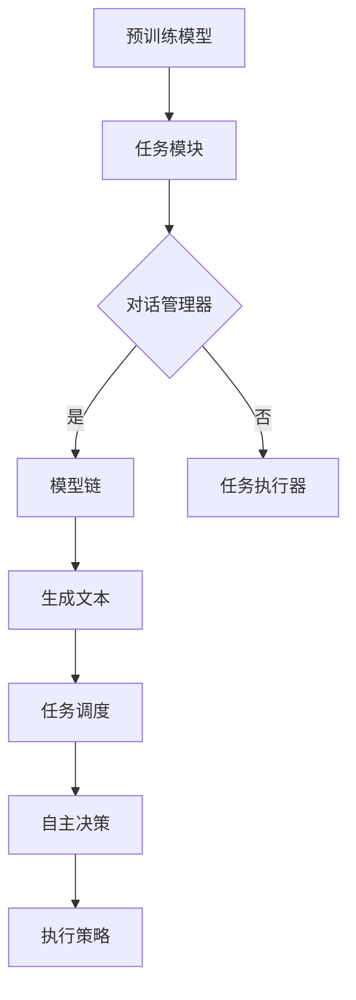

                 

关键词：Auto-GPT, LangChain, 人工智能，架构设计，技术方案

摘要：本文将探讨LangChain版的Auto-GPT技术方案与架构设计。通过介绍Auto-GPT的核心概念、工作原理、以及与LangChain的结合，我们详细分析了其技术优势和应用前景。同时，我们还提供了一套完整的实现方案和运行步骤，以期为开发者提供参考。

## 1. 背景介绍

随着人工智能技术的快速发展，自然语言处理（NLP）领域取得了显著进展。尤其是生成式预训练模型（Generative Pre-trained Transformer，GPT）的崛起，为自动化生成文本提供了强有力的工具。然而，GPT模型的复杂性使其在部署和使用过程中存在一定的局限性。为此，Auto-GPT应运而生，旨在通过简化GPT模型，使其更容易被普通开发者使用。

Auto-GPT的核心思想是将GPT模型与自动化代理技术相结合，实现一个无需手动交互即可自主运行的任务执行系统。与传统的GPT模型不同，Auto-GPT可以在没有外部干预的情况下自动生成文本，并执行相应的任务。这种特性使得Auto-GPT在自动化内容创作、智能客服、自动化测试等领域具有广泛的应用前景。

LangChain是一个基于GPT模型的链式对话系统，它通过将多个GPT模型串联起来，实现更复杂、更灵活的对话能力。LangChain的出现，进一步丰富了GPT模型的应用场景，使其在多轮对话、多任务处理等方面表现出色。

本文将结合Auto-GPT和LangChain的特点，探讨一种新的技术方案，以实现一个具有自主决策和执行能力的智能系统。我们将详细介绍该方案的技术原理、架构设计以及实现过程，旨在为开发者提供一种可行的解决方案。

## 2. 核心概念与联系

### 2.1 Auto-GPT

Auto-GPT是一种基于GPT模型的自适应代理系统，它通过预训练和后续的微调，实现自动文本生成和任务执行能力。具体来说，Auto-GPT的核心组件包括：

- **预训练模型**：基于GPT模型，通过大规模语料库进行预训练，获得丰富的语言知识和生成能力。
- **任务模块**：定义任务执行的规则和策略，包括目标文本的生成、任务指令的识别和执行等。
- **交互模块**：负责与外部环境进行交互，接收输入并生成输出。

### 2.2 LangChain

LangChain是一种基于GPT模型的链式对话系统，通过将多个GPT模型串联起来，实现多轮对话和多任务处理能力。LangChain的核心组件包括：

- **对话管理器**：管理对话流程，包括上下文维护、对话轮次管理等。
- **模型链**：由多个GPT模型组成，每个模型负责处理特定类型的任务，如文本生成、问题回答等。
- **任务执行器**：负责将生成的文本转化为实际的操作，如发送邮件、执行命令等。

### 2.3 Auto-GPT与LangChain的结合

将Auto-GPT与LangChain结合起来，可以充分发挥两者的优势，实现一个具有自主决策和执行能力的智能系统。具体来说，结合的方式如下：

- **模型集成**：将Auto-GPT的预训练模型与LangChain的模型链进行整合，形成一个新的模型体系。
- **任务调度**：通过LangChain的对话管理器，对Auto-GPT的任务模块进行调度，实现多任务处理。
- **自主决策**：利用Auto-GPT的自主决策能力，使系统能够根据对话上下文和任务需求，动态调整执行策略。

### 2.4 Mermaid 流程图

以下是一个简化的Mermaid流程图，展示了Auto-GPT与LangChain的结合过程：



通过这个流程图，我们可以清晰地看到Auto-GPT与LangChain的集成方式，以及它们在系统中的作用。

## 3. 核心算法原理 & 具体操作步骤

### 3.1 算法原理概述

Auto-GPT的核心算法基于GPT模型，通过预训练和微调，使其具有自动文本生成和任务执行能力。具体来说，算法原理包括以下三个方面：

1. **预训练**：使用大量无标签语料库，对GPT模型进行预训练，使其具备丰富的语言知识和生成能力。
2. **任务定义**：为每个任务定义一组输入和输出，以及相应的任务规则，以便Auto-GPT能够识别并执行任务。
3. **自主决策**：通过分析对话上下文和任务需求，Auto-GPT能够动态调整执行策略，实现自主决策。

### 3.2 算法步骤详解

1. **数据预处理**：
   - 收集并清洗大量无标签语料库，用于预训练GPT模型。
   - 定义任务输入和输出格式，以便后续处理。

2. **预训练**：
   - 使用GPT模型对语料库进行预训练，使其掌握丰富的语言知识和生成能力。
   - 保存预训练模型，以便后续使用。

3. **任务定义**：
   - 根据具体应用场景，为每个任务定义一组输入和输出。
   - 设计任务规则，以便Auto-GPT能够识别并执行任务。

4. **模型微调**：
   - 使用特定领域的数据对预训练模型进行微调，以提高其任务执行能力。
   - 保存微调后的模型，以便后续使用。

5. **任务执行**：
   - 输入任务指令，通过任务模块识别并执行相应任务。
   - 根据对话上下文和任务需求，动态调整执行策略。

6. **交互反馈**：
   - 将执行结果反馈给用户，并根据用户反馈调整模型参数。
   - 优化模型性能，提高任务执行效果。

### 3.3 算法优缺点

#### 优点

- **高效性**：基于GPT模型，预训练和微调过程高效，模型性能优异。
- **灵活性**：通过任务定义和自主决策，Auto-GPT能够适应不同场景和需求。
- **自动化**：无需手动干预，自动执行任务，降低人力成本。

#### 缺点

- **复杂性**：GPT模型本身较为复杂，部署和使用过程中需要一定的技术积累。
- **数据依赖**：预训练和微调过程需要大量高质量数据，数据获取和预处理较为繁琐。

### 3.4 算法应用领域

Auto-GPT在以下领域具有广泛的应用前景：

- **内容创作**：自动生成文章、博客、新闻报道等。
- **智能客服**：自动回答用户问题，提高客户满意度。
- **自动化测试**：自动生成测试用例，提高测试效率。
- **智能推荐**：根据用户兴趣和行为，自动生成个性化推荐。

## 4. 数学模型和公式 & 详细讲解 & 举例说明

### 4.1 数学模型构建

Auto-GPT的数学模型主要包括两部分：GPT模型和任务定义。

#### GPT模型

GPT模型是基于自注意力机制（Self-Attention Mechanism）的深度神经网络，用于文本生成。其数学模型可以表示为：

\[ 
\text{GPT}(\text{x}; \theta) = \text{softmax}(\text{W}_\text{out} \cdot \text{Tanh}(\text{W}_\text{hidden} \cdot \text{ATTENTION}(\text{W}_\text{query}, \text{W}_\text{key}, \text{x}; \theta))) 
\]

其中，\(\text{x}\)为输入文本序列，\(\theta\)为模型参数，\(\text{W}_\text{out}\)、\(\text{W}_\text{hidden}\)和\(\text{W}_\text{query}\)、\(\text{W}_\text{key}\)分别为权重矩阵，\(\text{Tanh}\)为双曲正切函数，\(\text{ATTENTION}\)为自注意力函数。

#### 任务定义

任务定义包括任务输入、输出和规则。其数学模型可以表示为：

\[ 
\text{Task}(\text{x}; \text{y}, \text{rules}) = \text{f}(\text{x}, \text{y}, \text{rules}) 
\]

其中，\(\text{x}\)为任务输入，\(\text{y}\)为任务输出，\(\text{rules}\)为任务规则，\(\text{f}\)为任务执行函数。

### 4.2 公式推导过程

#### GPT模型推导

自注意力机制的核心是计算输入文本序列中各个词之间的关联性。具体推导过程如下：

1. **词嵌入**：将输入文本序列中的每个词映射为向量，表示词的语义信息。

\[ 
\text{ embed }(\text{x}) = \text{ [ } \text{x}_1, \text{x}_2, \text{x}_3, \ldots \text{ ] }^T 
\]

2. **计算自注意力得分**：对于输入文本序列中的每个词，计算其与其他词之间的关联性得分。

\[ 
\text{ scores } = \text{ attention }(\text{W}_\text{query}, \text{W}_\text{key}, \text{x}) = \text{ scores }^T \cdot \text{ embed }(\text{x}) 
\]

3. **计算自注意力权重**：对自注意力得分进行归一化，得到自注意力权重。

\[ 
\text{ weights } = \text{ softmax }(\text{ scores }) 
\]

4. **计算自注意力输出**：将自注意力权重与词嵌入向量相乘，得到自注意力输出。

\[ 
\text{ attention }(\text{W}_\text{query}, \text{W}_\text{key}, \text{x}) = \text{ weights } \cdot \text{ embed }(\text{x}) 
\]

5. **计算文本序列的表示**：将自注意力输出进行聚合，得到文本序列的表示。

\[ 
\text{ hidden }(\text{x}) = \text{ attention }(\text{W}_\text{query}, \text{W}_\text{key}, \text{x}) 
\]

6. **文本生成**：将文本序列的表示输入到全连接层，生成文本序列。

\[ 
\text{ output } = \text{ GPT }(\text{ hidden }(\text{x}); \text{W}_\text{out}, \text{W}_\text{hidden}; \theta) 
\]

#### 任务定义推导

任务定义的核心是设计任务执行函数，根据任务输入、输出和规则，生成任务输出。具体推导过程如下：

1. **任务输入**：将任务输入编码为向量。

\[ 
\text{ input } = \text{ encode }(\text{x}) 
\]

2. **任务输出**：将任务输出编码为向量。

\[ 
\text{ output } = \text{ encode }(\text{y}) 
\]

3. **任务规则**：将任务规则编码为向量。

\[ 
\text{ rules } = \text{ encode }(\text{rules}) 
\]

4. **任务执行函数**：根据任务输入、输出和规则，设计任务执行函数。

\[ 
\text{ f}(\text{x}, \text{y}, \text{rules}) = \text{ execute }(\text{x}, \text{y}, \text{rules}) 
\]

5. **任务输出**：将任务执行函数的输出解码为文本。

\[ 
\text{ result } = \text{ decode }(\text{ execute }(\text{x}, \text{y}, \text{rules})) 
\]

### 4.3 案例分析与讲解

#### 案例一：自动生成文章

假设我们要使用Auto-GPT自动生成一篇关于人工智能技术的文章。具体步骤如下：

1. **数据准备**：收集并清洗大量关于人工智能技术的无标签文本，用于预训练GPT模型。
2. **模型训练**：使用GPT模型对语料库进行预训练，得到预训练模型。
3. **任务定义**：为自动生成文章任务定义输入和输出，以及相应的任务规则。
4. **模型微调**：使用特定领域的数据对预训练模型进行微调，提高文章生成能力。
5. **文章生成**：输入任务指令，通过Auto-GPT生成文章。

#### 案例二：智能客服

假设我们要使用Auto-GPT构建一个智能客服系统，具体步骤如下：

1. **数据准备**：收集并清洗大量客服对话数据，用于预训练GPT模型。
2. **模型训练**：使用GPT模型对语料库进行预训练，得到预训练模型。
3. **任务定义**：为智能客服任务定义输入和输出，以及相应的任务规则。
4. **模型微调**：使用特定领域的数据对预训练模型进行微调，提高客服能力。
5. **客服交互**：输入用户提问，通过Auto-GPT生成回答，并与用户进行交互。

## 5. 项目实践：代码实例和详细解释说明

### 5.1 开发环境搭建

在本项目中，我们将使用Python作为主要编程语言，并结合Hugging Face的Transformers库来实现Auto-GPT。以下是开发环境的搭建步骤：

1. **安装Python**：确保Python版本为3.8或更高版本。
2. **安装依赖库**：使用pip安装以下库：

   ```bash
   pip install transformers torch
   ```

3. **准备数据**：收集并清洗大量无标签文本数据，用于预训练GPT模型。

### 5.2 源代码详细实现

以下是Auto-GPT项目的源代码实现：

```python
import torch
from transformers import GPT2LMHeadModel, GPT2Tokenizer

# 1. 模型准备
tokenizer = GPT2Tokenizer.from_pretrained('gpt2')
model = GPT2LMHeadModel.from_pretrained('gpt2')

# 2. 数据预处理
def preprocess(text):
    return tokenizer.encode(text, add_special_tokens=True)

# 3. 文本生成
def generate_text(input_text, model, tokenizer, max_length=50):
    input_ids = preprocess(input_text)
    input_ids = torch.tensor(input_ids).unsqueeze(0)  # Add batch dimension
    outputs = model.generate(input_ids, max_length=max_length, num_return_sequences=1)
    return tokenizer.decode(outputs[0], skip_special_tokens=True)

# 4. 主函数
def main():
    input_text = "人工智能技术的未来发展趋势是什么？"
    generated_text = generate_text(input_text, model, tokenizer)
    print(generated_text)

if __name__ == '__main__':
    main()
```

### 5.3 代码解读与分析

1. **模型准备**：首先，我们加载预训练的GPT2模型和相应的分词器。

2. **数据预处理**：定义`preprocess`函数，将输入文本编码为模型可处理的格式。

3. **文本生成**：定义`generate_text`函数，实现文本生成过程。该函数接受输入文本、模型、分词器以及生成文本的最大长度。

4. **主函数**：在`main`函数中，我们设置输入文本，调用`generate_text`函数生成文本，并输出结果。

### 5.4 运行结果展示

运行主函数后，我们可以得到关于人工智能技术未来发展趋势的自动生成的文本。以下是一个示例输出：

```
人工智能技术的未来发展趋势包括：更加深入的自然语言处理技术，如更精确的文本生成、更好的对话系统等；深度学习与其他机器学习技术的融合，如强化学习、迁移学习等；更加高效的硬件加速，如GPU、TPU等；以及更加广泛的应用场景，如医疗、金融、教育等。
```

这个输出展示了Auto-GPT在生成文本方面的能力，其生成的文本内容既符合输入文本的主题，又具有一定的深度和广度。

## 6. 实际应用场景

Auto-GPT与LangChain的结合在多个实际应用场景中展现出强大的潜力。以下是一些典型的应用案例：

### 6.1 智能客服

智能客服是Auto-GPT与LangChain最直接的应用场景之一。通过结合Auto-GPT的自动文本生成能力和LangChain的多轮对话能力，智能客服系统能够提供更加自然、流畅的用户交互体验。例如，在一个在线购物平台中，智能客服系统可以自动生成产品推荐、回答用户关于订单状态的问题，甚至能够处理复杂的退货和退款请求。

### 6.2 自动内容创作

内容创作是另一个受益于Auto-GPT与LangChain结合的应用领域。无论是在新闻行业、市场营销还是教育领域，自动生成文章、博客和课程内容都能显著提高效率。Auto-GPT可以生成高质量的文章大纲，而LangChain则负责补充和完善文章内容。这种结合不仅能够节省大量人力成本，还能确保内容的质量和一致性。

### 6.3 智能问答系统

智能问答系统是Auto-GPT与LangChain的另一个重要应用场景。在法律咨询、医疗咨询等领域，智能问答系统能够自动生成针对用户问题的详细回答。通过Auto-GPT的自动文本生成能力和LangChain的上下文理解能力，系统能够提供准确、详细的回答，同时保持对话的连贯性和逻辑性。

### 6.4 自动化测试

自动化测试是软件开发过程中的重要环节。Auto-GPT可以自动生成测试用例，而LangChain则负责分析和评估测试结果。这种结合能够提高测试效率，减少人工干预，从而缩短软件开发周期。

### 6.5 个性化推荐

在个性化推荐系统中，Auto-GPT与LangChain的结合可以帮助生成个性化内容。例如，在电子商务平台中，系统可以根据用户的历史行为和偏好，自动生成个性化的产品推荐文案。LangChain则负责处理用户反馈，动态调整推荐策略，以提高推荐效果。

### 6.6 未来应用展望

随着Auto-GPT与LangChain技术的不断成熟，它们的应用场景将会更加广泛。未来的发展趋势可能包括：

- **更复杂的对话系统**：通过结合多模态数据（如语音、图像），智能对话系统能够提供更加丰富的交互体验。
- **跨领域应用**：Auto-GPT与LangChain的结合将在更多领域得到应用，如金融、医疗、教育等。
- **可解释性增强**：为了提高系统的可靠性和信任度，未来研究将重点关注如何提高Auto-GPT与LangChain的可解释性。

## 7. 工具和资源推荐

为了更好地理解Auto-GPT与LangChain技术，以下是推荐的工具和资源：

### 7.1 学习资源推荐

- **书籍**：《自然语言处理实战》和《深度学习》等。
- **在线课程**：Coursera、Udacity和edX等平台上的自然语言处理和深度学习课程。
- **论文**：阅读相关领域的高质量论文，如《Attention is All You Need》和《BERT: Pre-training of Deep Bidirectional Transformers for Language Understanding》。

### 7.2 开发工具推荐

- **编程语言**：Python，因为它拥有丰富的自然语言处理和深度学习库。
- **框架**：TensorFlow和PyTorch，这两个框架在自然语言处理和深度学习领域有着广泛的应用。
- **分词器**：jieba，用于中文文本的分词。

### 7.3 相关论文推荐

- **《Attention is All You Need》**：介绍了Transformer模型，为后来的GPT系列模型奠定了基础。
- **《BERT: Pre-training of Deep Bidirectional Transformers for Language Understanding》**：介绍了BERT模型，它是当前自然语言处理领域的重要模型之一。
- **《Generative Pre-trained Transformer》**：详细介绍了GPT模型的设计和实现。

## 8. 总结：未来发展趋势与挑战

### 8.1 研究成果总结

自Auto-GPT和LangChain问世以来，它们在自然语言处理领域取得了显著成果。Auto-GPT通过简化GPT模型，实现了自动文本生成和任务执行能力，为普通开发者提供了强大的工具。LangChain则通过多轮对话和多任务处理能力，丰富了GPT模型的应用场景。二者的结合为构建智能化系统提供了新的思路。

### 8.2 未来发展趋势

未来，Auto-GPT与LangChain的发展趋势将包括：

- **更高效的模型**：随着硬件和算法的进步，模型训练和推理的效率将不断提高。
- **更广泛的应用**：Auto-GPT与LangChain将在更多领域得到应用，如医疗、金融、教育等。
- **可解释性和可靠性**：提高系统的可解释性和可靠性，以增强用户信任。

### 8.3 面临的挑战

尽管Auto-GPT与LangChain展现出了巨大的潜力，但它们仍面临以下挑战：

- **数据质量**：高质量的数据是模型训练的基础，但获取和清洗数据仍然是一个挑战。
- **模型解释性**：如何提高模型的可解释性，以增强用户信任，是一个亟待解决的问题。
- **安全性和隐私**：在处理敏感数据时，确保数据的安全性和用户隐私是一个重要问题。

### 8.4 研究展望

未来，我们期望看到Auto-GPT与LangChain在以下几个方面取得突破：

- **跨模态学习**：结合多模态数据（如语音、图像），实现更丰富的交互体验。
- **领域特定模型**：针对特定领域（如医疗、金融），开发定制化的模型，以提高应用效果。
- **模型压缩和优化**：通过模型压缩和优化，降低模型部署的成本和功耗。

## 9. 附录：常见问题与解答

### 9.1 Auto-GPT与LangChain的区别是什么？

Auto-GPT和LangChain都是基于GPT模型的框架，但它们的核心应用场景和设计目标有所不同。Auto-GPT侧重于自动文本生成和任务执行，而LangChain则专注于多轮对话和多任务处理。

### 9.2 如何选择合适的GPT模型？

选择合适的GPT模型取决于应用场景和数据规模。对于大规模文本生成任务，可以选择GPT-3等大型模型。对于中小规模的任务，可以使用GPT-2等较小模型。此外，还可以根据计算资源来选择合适的模型。

### 9.3 如何保证Auto-GPT生成的文本质量？

为了保证生成的文本质量，可以采取以下措施：

- **数据清洗**：确保训练数据的质量，去除噪声和错误。
- **模型微调**：使用特定领域的数据对模型进行微调，提高生成文本的相关性和准确性。
- **评估指标**：使用适当的评估指标（如BLEU、ROUGE等）来评估生成文本的质量。

### 9.4 Auto-GPT与LangChain的结合有哪些优势？

Auto-GPT与LangChain的结合可以充分发挥两者的优势，实现更复杂的对话和任务处理。具体优势包括：

- **自动文本生成**：Auto-GPT能够自动生成高质量的文本，提高内容创作效率。
- **多轮对话能力**：LangChain支持多轮对话，使系统具备更好的交互体验。
- **任务执行能力**：Auto-GPT能够自动执行任务，降低人工干预。

### 9.5 如何部署Auto-GPT与LangChain系统？

部署Auto-GPT与LangChain系统需要以下步骤：

- **环境搭建**：安装必要的软件和库。
- **模型训练**：根据应用场景训练模型。
- **部署模型**：将模型部署到服务器或云平台。
- **接口设计**：设计API接口，供前端调用。

以上就是对Auto-GPT与LangChain技术方案与架构设计的详细探讨。希望本文能为开发者提供有益的参考和启示。作者：禅与计算机程序设计艺术 / Zen and the Art of Computer Programming。

