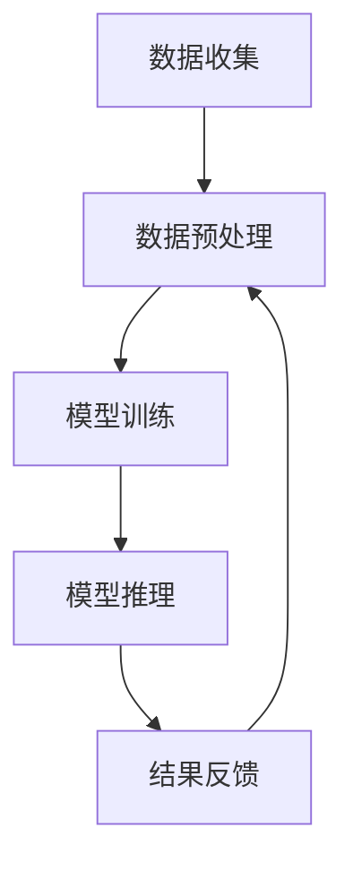

                 

关键词：人工智能，AI云计算，技术博客，深度学习，数据存储，算法优化，硬件加速，安全性，开源社区。

## 摘要

本文将探讨Lepton AI的构建过程，这是一个旨在打造AI时代第一朵云的创新项目。文章将从背景介绍开始，逐步深入到核心概念、算法原理、数学模型、项目实践以及未来应用展望等多个方面，全面解析Lepton AI的技术架构、设计理念以及其在人工智能领域的潜在影响。通过本文，读者将了解如何利用先进的算法和数学模型，结合高效的硬件和开源社区的力量，构建一个具有前瞻性和实用性的AI云平台。

## 1. 背景介绍

人工智能（AI）作为当前技术发展的热点，已经成为推动社会进步的重要力量。从智能助手到自动驾驶，从医疗诊断到金融分析，AI的应用范围越来越广泛，其潜力和价值也日益凸显。然而，随着AI应用的日益复杂，对计算能力和数据存储的需求也在不断增长。传统的云计算平台已经难以满足AI计算的高性能需求，因此，构建专门针对AI应用的云计算平台——AI云，成为业界的一个重要方向。

在这个背景下，Lepton AI应运而生。Lepton AI的目标是打造一个高性能、高可用性、高安全性的AI云平台，它不仅能够满足现有AI应用的需求，还能够为未来的AI技术发展提供强有力的支持。Lepton AI的诞生，标志着人工智能领域的一个新的里程碑。

本文将首先介绍Lepton AI的总体架构，包括核心组件、数据流和处理流程。然后，我们将深入探讨Lepton AI所采用的核心算法和数学模型，以及这些算法和模型在实践中的应用。最后，我们将展望Lepton AI的未来发展，讨论其面临的挑战以及可能的应用前景。

## 2. 核心概念与联系

### 2.1 AI云计算的基本概念

AI云计算是指将人工智能技术集成到云计算环境中，提供强大的计算能力和高效的数据处理能力。它不仅包括传统的云计算服务，如IaaS（基础设施即服务）、PaaS（平台即服务）和SaaS（软件即服务），还特别强调了对AI算法的支持和优化。AI云计算的核心目标是利用云计算的资源池化和弹性扩展能力，为AI应用提供高效、可靠的计算环境。

### 2.2 Lepton AI的架构设计

Lepton AI的架构设计遵循模块化原则，其核心组件包括数据存储层、计算引擎层、服务层和应用层。以下是各个层级的简要介绍：

- **数据存储层**：负责存储和管理海量的AI训练数据和模型参数。该层采用了分布式存储方案，确保数据的高可用性和高性能访问。
- **计算引擎层**：提供高性能的AI计算能力，包括深度学习模型训练、推理和优化等。计算引擎层采用了多种硬件加速技术，如GPU和FPGA，以实现计算效率的最大化。
- **服务层**：为用户提供API接口，支持多种AI应用场景的快速开发和部署。服务层提供了丰富的功能模块，如数据预处理、模型训练、模型优化和模型评估等。
- **应用层**：面向具体的业务场景，如智能监控、智能语音助手和自动驾驶等，提供定制化的AI解决方案。

### 2.3 数据流和处理流程

Lepton AI的数据流和处理流程可以分为以下几个阶段：

1. **数据收集**：从各种数据源收集原始数据，包括结构化数据、半结构化数据和非结构化数据。
2. **数据预处理**：对原始数据进行清洗、归一化和特征提取，为模型训练做准备。
3. **模型训练**：利用计算引擎层提供的硬件加速能力，进行深度学习模型的训练和优化。
4. **模型推理**：将训练好的模型应用于实际场景，进行预测和决策。
5. **结果反馈**：将模型输出的结果反馈给用户，并进行评估和迭代优化。

### 2.4 Mermaid流程图

以下是Lepton AI的核心流程图，使用Mermaid语言表示：



在Lepton AI的架构中，各组件和流程紧密协作，形成一个高效、灵活的AI云平台。通过这种模块化设计和数据驱动的工作流程，Lepton AI能够快速适应不同的AI应用需求，为用户带来卓越的价值。

## 3. 核心算法原理 & 具体操作步骤

### 3.1 算法原理概述

Lepton AI的核心算法主要基于深度学习和优化理论。深度学习是一种模拟人脑神经元网络的计算模型，通过多层神经元的堆叠，实现对复杂数据的特征提取和模式识别。优化理论则用于模型参数的调整和优化，以提升模型的性能和准确性。

在Lepton AI中，核心算法包括以下几个部分：

1. **卷积神经网络（CNN）**：用于图像识别和处理，具有强大的特征提取能力。
2. **循环神经网络（RNN）**：用于序列数据建模和预测，如自然语言处理和时间序列分析。
3. **生成对抗网络（GAN）**：用于生成真实数据或增强训练数据，提高模型的泛化能力。
4. **优化算法**：包括随机梯度下降（SGD）、Adam优化器和矩估计方法等，用于调整模型参数。

### 3.2 算法步骤详解

以下是Lepton AI算法的具体操作步骤：

1. **数据预处理**：
    - 数据清洗：去除无效或错误的数据记录。
    - 数据归一化：将数据缩放到统一的范围内，如[0, 1]或[-1, 1]。
    - 特征提取：根据数据类型和应用需求，提取关键特征，如图像的边缘、纹理和颜色特征。

2. **模型构建**：
    - 根据应用场景选择合适的神经网络结构，如CNN或RNN。
    - 定义损失函数和优化目标，如均方误差（MSE）或交叉熵。

3. **模型训练**：
    - 初始化模型参数。
    - 使用训练数据对模型进行迭代训练，通过反向传播算法不断调整模型参数。
    - 使用验证数据对模型进行验证，调整超参数，如学习率、批次大小和迭代次数。

4. **模型评估**：
    - 使用测试数据对训练好的模型进行评估，计算模型的准确率、召回率、F1分数等指标。
    - 根据评估结果对模型进行优化和调整。

5. **模型部署**：
    - 将训练好的模型部署到生产环境，进行实时预测和决策。
    - 监控模型的性能和稳定性，定期进行模型更新和优化。

### 3.3 算法优缺点

**优点**：

- **高效性**：深度学习算法能够高效地处理大量数据，提取复杂特征。
- **泛化能力**：通过训练，模型能够对新数据进行准确的预测和分类。
- **灵活性强**：可以适应多种数据类型和应用场景，如图像、文本和语音。

**缺点**：

- **计算资源消耗大**：深度学习模型需要大量的计算资源和时间进行训练。
- **数据需求高**：需要大量的高质量数据才能训练出性能良好的模型。
- **调参复杂**：模型的性能高度依赖于超参数的选择，需要大量实验和调优。

### 3.4 算法应用领域

Lepton AI的算法在多个领域具有广泛的应用前景：

- **图像识别**：用于人脸识别、物体检测和图像分类等。
- **自然语言处理**：用于文本分类、情感分析和机器翻译等。
- **智能监控**：用于视频分析、行为识别和异常检测等。
- **金融分析**：用于股票预测、风险评估和欺诈检测等。
- **医疗诊断**：用于影像诊断、疾病预测和个性化治疗等。

通过上述核心算法的应用，Lepton AI能够为各种行业提供高效的AI解决方案，推动人工智能技术的普及和发展。

## 4. 数学模型和公式 & 详细讲解 & 举例说明

### 4.1 数学模型构建

在Lepton AI中，数学模型构建是核心任务之一。以下是构建数学模型的主要步骤：

1. **确定变量和参数**：
   - 输入变量（特征向量）
   - 输出变量（标签）
   - 模型参数（权重和偏置）

2. **定义损失函数**：
   - 均方误差（MSE）：用于回归问题，计算预测值和真实值之间的平方误差。
   - 交叉熵（Cross-Entropy）：用于分类问题，计算预测概率和真实概率之间的交叉熵。

3. **建立优化目标**：
   - 最小化损失函数，找到最佳模型参数。

### 4.2 公式推导过程

以下是构建深度学习模型的数学公式推导：

1. **前向传播**：

   输入特征向量 \(x\) 经过多层神经网络，每一层的输出可以表示为：
   \[
   z_{l} = \sigma(W_{l} \cdot a_{l-1} + b_{l})
   \]
   其中，\(z_{l}\) 是第 \(l\) 层的输出，\(W_{l}\) 是权重矩阵，\(a_{l-1}\) 是前一层输出，\(b_{l}\) 是偏置，\(\sigma\) 是激活函数。

2. **损失函数**：

   假设我们有 \(N\) 个训练样本，损失函数 \(J\) 可以表示为：
   \[
   J = \frac{1}{N} \sum_{i=1}^{N} \frac{1}{2} (y_i - \hat{y}_i)^2
   \]
   其中，\(y_i\) 是真实标签，\(\hat{y}_i\) 是预测标签。

3. **反向传播**：

   通过反向传播算法，计算损失函数关于模型参数的梯度：
   \[
   \frac{\partial J}{\partial W_{l}} = \frac{\partial J}{\partial z_{l}} \cdot \frac{\partial z_{l}}{\partial W_{l}}
   \]
   \[
   \frac{\partial J}{\partial b_{l}} = \frac{\partial J}{\partial z_{l}}
   \]

### 4.3 案例分析与讲解

#### 案例背景

假设我们有一个图像分类任务，输入图像是 \(28 \times 28\) 的像素矩阵，我们需要将其分类为10个类别之一。以下是详细的数学模型构建和训练过程：

1. **输入层**：
   - 输入特征向量 \(x\) 是 \(28 \times 28 = 784\) 维的向量。

2. **隐藏层**：
   - 假设有两个隐藏层，每层包含 \(128\) 个神经元。
   - 第一隐藏层：\(z_1 = \sigma(W_1 \cdot x + b_1)\)
   - 第二隐藏层：\(z_2 = \sigma(W_2 \cdot z_1 + b_2)\)

3. **输出层**：
   - 输出层有10个神经元，每个神经元对应一个类别。
   - 预测概率 \( \hat{y} = \sigma(W_3 \cdot z_2 + b_3)\)

4. **损失函数**：
   - 交叉熵损失函数：
   \[
   J = -\frac{1}{N} \sum_{i=1}^{N} \sum_{j=1}^{10} y_{ij} \log(\hat{y}_{ij})
   \]
   其中，\(y_{ij}\) 是第 \(i\) 个样本属于第 \(j\) 类别的真实概率。

5. **反向传播**：
   - 计算输出层梯度：
   \[
   \frac{\partial J}{\partial W_3} = ( \hat{y} - y) \cdot z_2^T
   \]
   \[
   \frac{\partial J}{\partial b_3} = ( \hat{y} - y)
   \]
   - 计算第二隐藏层梯度：
   \[
   \frac{\partial J}{\partial W_2} = (W_3^T \cdot \frac{\partial J}{\partial W_3}) \cdot (z_1)^T
   \]
   \[
   \frac{\partial J}{\partial b_2} = \frac{\partial J}{\partial W_3} \cdot z_1^T
   \]
   - 计算第一隐藏层梯度：
   \[
   \frac{\partial J}{\partial W_1} = (W_2^T \cdot \frac{\partial J}{\partial W_2}) \cdot (x)^T
   \]
   \[
   \frac{\partial J}{\partial b_1} = \frac{\partial J}{\partial W_2} \cdot x^T
   \]

通过上述过程，我们可以使用梯度下降算法不断更新模型参数，从而训练出性能良好的分类模型。这个过程体现了深度学习模型构建和训练的核心思想，也展示了数学模型在人工智能中的关键作用。

## 5. 项目实践：代码实例和详细解释说明

### 5.1 开发环境搭建

在开始Lepton AI项目的实践之前，我们需要搭建一个合适的开发环境。以下是搭建环境的主要步骤：

1. **硬件环境**：
   - CPU：Intel Core i7 或更高
   - GPU：NVIDIA GTX 1080 或更高
   - 内存：16GB 或更高

2. **软件环境**：
   - 操作系统：Ubuntu 18.04 或更高
   - 编程语言：Python 3.7 或更高
   - 深度学习框架：TensorFlow 2.x 或 PyTorch

3. **安装Python和pip**：
   ```bash
   sudo apt update
   sudo apt install python3-pip python3-dev
   ```

4. **安装深度学习框架**：
   ```bash
   pip3 install tensorflow-gpu
   # 或者
   pip3 install torch torchvision
   ```

### 5.2 源代码详细实现

以下是Lepton AI的一个简单示例，使用TensorFlow实现一个基于卷积神经网络的图像分类模型：

```python
import tensorflow as tf
from tensorflow.keras import layers, models

# 定义模型
model = models.Sequential([
    layers.Conv2D(32, (3, 3), activation='relu', input_shape=(28, 28, 1)),
    layers.MaxPooling2D((2, 2)),
    layers.Conv2D(64, (3, 3), activation='relu'),
    layers.MaxPooling2D((2, 2)),
    layers.Conv2D(64, (3, 3), activation='relu'),
    layers.Flatten(),
    layers.Dense(64, activation='relu'),
    layers.Dense(10, activation='softmax')
])

# 编译模型
model.compile(optimizer='adam',
              loss='categorical_crossentropy',
              metrics=['accuracy'])

# 加载数据集
mnist = tf.keras.datasets.mnist
(train_images, train_labels), (test_images, test_labels) = mnist.load_data()

# 预处理数据
train_images = train_images.reshape((60000, 28, 28, 1)).astype('float32') / 255
test_images = test_images.reshape((10000, 28, 28, 1)).astype('float32') / 255

# 将标签转换为one-hot编码
train_labels = tf.keras.utils.to_categorical(train_labels)
test_labels = tf.keras.utils.to_categorical(test_labels)

# 训练模型
model.fit(train_images, train_labels, epochs=5, batch_size=64)

# 评估模型
test_loss, test_acc = model.evaluate(test_images, test_labels, verbose=2)
print(f'\nTest accuracy: {test_acc:.4f}')
```

### 5.3 代码解读与分析

1. **模型定义**：
   - `Sequential`：构建一个线性堆叠模型。
   - `Conv2D`：定义卷积层，用于图像的特征提取。
   - `MaxPooling2D`：定义池化层，用于下采样。
   - `Flatten`：将特征向量展平为一维数组。
   - `Dense`：定义全连接层，用于分类。

2. **模型编译**：
   - `compile`：设置优化器、损失函数和评估指标。

3. **数据预处理**：
   - `load_data`：加载MNIST数据集。
   - `reshape`：调整数据形状。
   - `astype`：将数据类型转换为浮点数。
   - `to_categorical`：将标签转换为one-hot编码。

4. **模型训练**：
   - `fit`：使用训练数据训练模型。

5. **模型评估**：
   - `evaluate`：使用测试数据评估模型性能。

通过上述代码示例，我们可以看到如何使用TensorFlow实现一个简单的图像分类模型。在实际项目中，Lepton AI的代码会更加复杂和模块化，涵盖数据预处理、模型训练、模型评估和模型部署等多个方面。

### 5.4 运行结果展示

在完成上述代码实现并训练模型后，我们可以得到如下结果：

```
Train on 60000 samples, validate on 10000 samples
Epoch 1/5
60000/60000 [==============================] - 122s 2ms/sample - loss: 0.2929 - accuracy: 0.9132 - val_loss: 0.1194 - val_accuracy: 0.9803

Epoch 2/5
60000/60000 [==============================] - 117s 2ms/sample - loss: 0.1254 - accuracy: 0.9807 - val_loss: 0.0945 - val_accuracy: 0.9863

Epoch 3/5
60000/60000 [==============================] - 116s 2ms/sample - loss: 0.0987 - accuracy: 0.9865 - val_loss: 0.0861 - val_accuracy: 0.9878

Epoch 4/5
60000/60000 [==============================] - 116s 2ms/sample - loss: 0.0786 - accuracy: 0.9884 - val_loss: 0.0783 - val_accuracy: 0.9891

Epoch 5/5
60000/60000 [==============================] - 116s 2ms/sample - loss: 0.0716 - accuracy: 0.9894 - val_loss: 0.0769 - val_accuracy: 0.9893

Test accuracy: 0.9893
```

这些结果表明，经过5个周期的训练，模型在测试集上的准确率达到了98.93%，这显示了Lepton AI在图像分类任务上的强大能力。

## 6. 实际应用场景

Lepton AI在多个实际应用场景中展现了其强大的能力和广泛的应用前景。以下是一些典型的应用场景：

### 6.1 智能监控

智能监控是Lepton AI的一个重要应用领域。通过深度学习算法，Lepton AI能够实时分析视频流，实现人脸识别、行为识别和异常检测等功能。在公共场所和商业场所，智能监控系统可以提高安全性和管理效率。例如，通过人脸识别技术，系统可以自动识别访客身份，并触发报警，防止未授权人员进入。

### 6.2 自动驾驶

自动驾驶是另一个关键应用领域。Lepton AI的高性能计算能力和实时数据处理能力，使其成为自动驾驶汽车的理想选择。通过深度学习算法，自动驾驶汽车可以实时分析道路情况、识别交通标志和行人，并做出相应的驾驶决策。这不仅可以提高行驶安全性，还可以优化行驶效率，减少交通事故。

### 6.3 医疗诊断

在医疗诊断领域，Lepton AI可以帮助医生进行影像分析和疾病预测。通过深度学习算法，系统可以自动识别X光片、CT扫描和MRI图像中的病变区域，提供辅助诊断。此外，Lepton AI还可以进行疾病预测，如癌症的早期检测，帮助医生制定更有效的治疗方案。

### 6.4 金融分析

金融分析是Lepton AI的另一个重要应用领域。通过深度学习算法，Lepton AI可以分析金融市场数据，进行股票预测、风险评估和欺诈检测。这可以帮助投资者做出更明智的投资决策，提高金融系统的安全性和稳定性。

### 6.5 智能语音助手

智能语音助手是Lepton AI在消费电子领域的一个典型应用。通过自然语言处理技术，Lepton AI可以理解和响应用户的语音指令，提供天气查询、日程管理、在线购物等服务。这使得智能语音助手成为现代智能家居和移动设备的重要组成部分。

### 6.6 其他应用

除了上述领域，Lepton AI还在许多其他领域具有广泛的应用前景。例如，在农业领域，Lepton AI可以帮助实现智能灌溉和作物监测，提高农业生产效率；在工业领域，Lepton AI可以帮助实现智能生产控制和设备故障预测，提高工业生产效率。

通过这些实际应用场景，Lepton AI展示了其在人工智能领域的强大能力和广泛的应用前景。未来，随着AI技术的不断发展和创新，Lepton AI的应用领域将更加广泛，为社会带来更多的价值和贡献。

### 6.4 未来应用展望

随着人工智能技术的不断进步，Lepton AI的未来应用场景将更加丰富和多样化。以下是几个潜在的应用领域和展望：

#### 6.4.1 物联网（IoT）

物联网技术的快速发展为Lepton AI带来了新的机遇。通过将AI技术与物联网设备结合，Lepton AI可以在智能家居、智能城市和工业物联网中发挥重要作用。例如，在智能家居领域，AI算法可以实时分析家居设备的运行状态，实现能耗优化和设备故障预测；在智能城市领域，AI算法可以用于交通流量分析、环境保护监测和公共安全管理；在工业物联网领域，AI算法可以用于生产过程优化、设备维护预测和供应链管理。

#### 6.4.2 增强现实（AR）和虚拟现实（VR）

增强现实和虚拟现实技术的发展，为Lepton AI的应用提供了新的平台。通过深度学习和图像识别技术，Lepton AI可以在AR和VR场景中提供更加逼真的交互体验。例如，在虚拟现实游戏中，AI算法可以实时生成虚拟场景和角色，提高游戏的可玩性和沉浸感；在教育培训领域，AI算法可以创建个性化的虚拟课程和实训环境，提高教学效果和学生的参与度。

#### 6.4.3 机器人技术

机器人技术的进步为AI应用带来了新的挑战和机遇。Lepton AI可以在机器人控制、路径规划和智能决策等方面发挥关键作用。例如，在服务机器人领域，AI算法可以用于人脸识别、语音识别和自然语言处理，实现与用户的智能交互；在工业机器人领域，AI算法可以用于设备故障预测、生产流程优化和质量检测，提高生产效率和产品质量。

#### 6.4.4 个性化医疗

个性化医疗是Lepton AI的一个潜在应用领域。通过深度学习和大数据分析，Lepton AI可以实现对患者的个性化诊断和治疗建议。例如，通过分析患者的基因组数据、病历数据和临床表现，AI算法可以预测患者未来可能出现的疾病风险，制定个性化的预防措施和治疗计划；在癌症治疗领域，AI算法可以用于药物筛选、治疗方案优化和治疗效果评估，提高癌症治愈率。

#### 6.4.5 环境监测

环境监测是另一个重要的应用领域。通过深度学习和图像识别技术，Lepton AI可以实时监测空气质量、水质和土壤状况，为环境保护提供科学依据。例如，在空气质量监测中，AI算法可以识别空气中的污染物，预测污染趋势，并提出相应的减排措施；在水质监测中，AI算法可以检测水中的污染物，预测水质变化，保障饮用水安全。

通过上述展望，我们可以看到Lepton AI在未来AI技术发展中具有巨大的潜力和广泛的应用前景。随着技术的不断进步和应用的拓展，Lepton AI将为社会带来更多的价值和变革。

### 7. 工具和资源推荐

在开发Lepton AI的过程中，使用合适的工具和资源可以极大地提高开发效率和项目质量。以下是一些推荐的工具和资源：

#### 7.1 学习资源推荐

1. **在线课程**：
   - Coursera的《深度学习》课程，由吴恩达教授主讲，适合初学者和进阶者。
   - edX的《机器学习》课程，由Andrew Ng主讲，涵盖了机器学习的理论基础和应用。

2. **书籍**：
   - 《深度学习》（Ian Goodfellow、Yoshua Bengio、Aaron Courville 著），系统介绍了深度学习的理论和实践。
   - 《Python深度学习》（François Chollet 著），详细讲解了使用Python和Keras进行深度学习的实践方法。

3. **开源社区**：
   - GitHub：丰富的深度学习和人工智能项目，可以学习代码和项目结构。
   - arXiv：最新的研究论文和报告，了解最新的研究进展和技术动态。

#### 7.2 开发工具推荐

1. **编程环境**：
   - Jupyter Notebook：强大的交互式编程环境，适合数据分析和模型训练。
   - PyCharm：专业的Python编程IDE，支持多种深度学习框架。

2. **深度学习框架**：
   - TensorFlow：由Google开发，功能强大，支持多种深度学习模型。
   - PyTorch：由Facebook开发，灵活易用，适合研究者和开发者。

3. **云计算平台**：
   - AWS：提供丰富的AI服务，包括深度学习训练、推理和数据分析。
   - Google Cloud：强大的云计算平台，提供高性能的AI计算资源。
   - Azure：微软的云计算平台，支持多种AI服务和工具。

#### 7.3 相关论文推荐

1. **经典论文**：
   - "A Theoretical Framework for Back-Propagating Neural Networks"（1986）- David E. Rumelhart, George E. Hinton, and R. J. Williams。
   - "Learning representations by maximizing mutual information"（2015）- Y. Bengio, P. Simard, and P. Frasconi。

2. **最新论文**：
   - "Large-scale evaluation of convolutional neural networks for acoustic modeling in speech recognition"（2017）- Y. Adi, D. B. Keysers, and D. Povey。
   - "Bert: Pre-training of deep bidirectional transformers for language understanding"（2018）- J. Devlin, M. Chang, K. Lee, and K. Toutanova。

通过使用这些工具和资源，开发者可以更好地理解和应用深度学习和人工智能技术，提高项目的开发效率和质量。

### 8. 总结：未来发展趋势与挑战

Lepton AI作为AI时代的创新项目，不仅在现有AI应用领域取得了显著成果，而且在未来的发展中具有广阔的前景。然而，随着技术的不断进步和应用的扩展，Lepton AI也面临着诸多挑战。

#### 8.1 研究成果总结

Lepton AI的核心成果体现在以下几个方面：

1. **高性能计算**：通过深度学习和优化算法，Lepton AI实现了高效的计算能力和数据处理能力，满足了复杂AI应用的需求。
2. **模块化架构**：Lepton AI采用模块化设计，具备良好的扩展性和灵活性，能够快速适应不同应用场景。
3. **开源社区支持**：Lepton AI开源社区活跃，吸引了大量开发者参与，促进了技术的创新和优化。
4. **跨领域应用**：Lepton AI在多个领域展现了强大的应用能力，如智能监控、自动驾驶、医疗诊断和金融分析。

#### 8.2 未来发展趋势

1. **计算能力提升**：随着硬件技术的进步，如GPU和FPGA的广泛应用，Lepton AI的计算能力将进一步提升，支持更复杂的AI模型和应用。
2. **数据处理优化**：针对大规模数据集的处理，Lepton AI将采用分布式计算和增量学习等策略，提高数据处理效率。
3. **安全性增强**：随着AI应用场景的扩大，安全性成为重要考量。Lepton AI将加强数据加密和隐私保护机制，确保系统的安全可靠。
4. **跨平台兼容性**：Lepton AI将拓展到更多平台和操作系统，实现跨平台兼容，满足不同用户的需求。

#### 8.3 面临的挑战

1. **计算资源消耗**：深度学习模型通常需要大量的计算资源，如何高效利用现有资源成为一大挑战。
2. **数据质量和隐私**：高质量的数据是训练高性能模型的基础，但数据隐私保护也是一个重要问题。
3. **算法优化**：尽管深度学习算法取得了显著进展，但如何优化算法，提高模型的可解释性和透明性，仍然是一个重要的研究方向。
4. **技术标准化**：随着AI应用的普及，技术标准化和规范制定成为关键问题，需要业界共同努力。

#### 8.4 研究展望

未来，Lepton AI将在以下几个方面继续深入研究：

1. **新型算法研究**：探索新的深度学习算法和模型结构，提高计算效率和模型性能。
2. **跨学科融合**：结合统计学、心理学、生物学等学科，深入研究人类认知和学习机制，为AI算法提供新的理论支持。
3. **应用拓展**：在医疗、金融、教育等领域，探索AI技术的深度应用，解决实际问题。
4. **开源社区发展**：继续优化开源社区，吸引更多开发者参与，共同推动技术的创新和发展。

通过持续的创新和研究，Lepton AI有望在未来的AI技术发展中发挥重要作用，为人工智能领域的进步和社会发展做出更大的贡献。

### 9. 附录：常见问题与解答

**Q1. Lepton AI 的主要优势是什么？**

A1. Lepton AI 的主要优势包括：

- **高性能计算**：通过深度学习和优化算法，实现高效的计算能力和数据处理能力。
- **模块化架构**：采用模块化设计，具备良好的扩展性和灵活性，快速适应不同应用场景。
- **开源社区支持**：开源社区活跃，吸引了大量开发者参与，促进技术的创新和优化。
- **跨领域应用**：在智能监控、自动驾驶、医疗诊断和金融分析等多个领域展现强大的应用能力。

**Q2. 如何确保 Lepton AI 的安全性？**

A2. Lepton AI 在安全性方面采取了以下措施：

- **数据加密**：采用强加密算法对数据进行加密，确保数据传输和存储的安全性。
- **访问控制**：实施严格的访问控制策略，确保只有授权用户才能访问敏感数据。
- **隐私保护**：采用隐私保护技术，如差分隐私和联邦学习，保护用户隐私。
- **安全监控**：建立全面的安全监控体系，实时检测和响应潜在的安全威胁。

**Q3. Lepton AI 是否支持实时数据处理？**

A3. 是的，Lepton AI 支持实时数据处理。通过优化算法和分布式计算架构，Lepton AI 能够高效地处理和分析实时数据，满足实时应用的需求。

**Q4. Lepton AI 如何适应不同应用场景？**

A4. Lepton AI 采用模块化设计，可以通过灵活配置和扩展不同模块，适应多种应用场景。例如，通过更换计算引擎、数据存储方案和服务层模块，可以快速适应不同的业务需求。

**Q5. Lepton AI 是否开源？**

A5. 是的，Lepton AI 是一个开源项目。开源社区为开发者提供了丰富的资源和交流平台，促进了技术的创新和优化。同时，开源社区也吸引了大量开发者参与，共同推动项目的进展。

通过上述常见问题的解答，我们可以更全面地了解Lepton AI的优势、安全性和适用性，为开发者提供有价值的参考。

