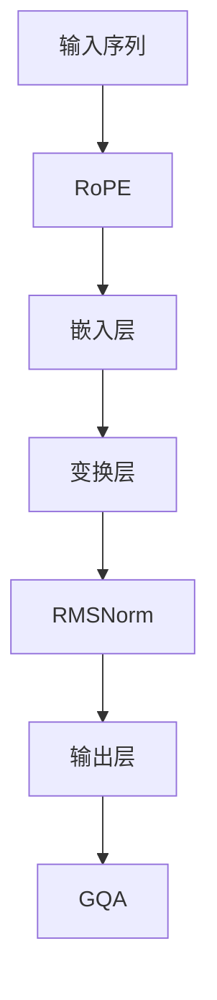

                 

关键词：Llama模型、RoPE、RMSNorm、GQA、深度学习、自然语言处理、算法原理、数学模型、项目实践

> 摘要：本文旨在深入解析Llama模型中的关键组件，包括RoPE、RMSNorm和GQA。通过对这些技术的详细探讨，我们将揭示它们在自然语言处理领域的应用，并讨论未来的发展趋势与挑战。

## 1. 背景介绍

随着深度学习在自然语言处理（NLP）领域的快速发展，大规模语言模型如GPT、BERT等成为了研究的热点。而Llama模型，作为一种新的语言模型，因其出色的性能和效率，受到了广泛关注。Llama模型的核心在于其创新的架构设计，其中包括RoPE、RMSNorm和GQA等关键技术。本文将围绕这些技术展开深入讨论。

## 2. 核心概念与联系

### 2.1. RoPE（相对位置嵌入）

RoPE是一种用于处理序列数据的位置编码技术。它通过引入相对位置信息，使得模型能够更好地理解句子中的词语顺序。

### 2.2. RMSNorm（均方根归一化）

RMSNorm是一种归一化技术，旨在优化模型的训练过程。它通过缩放和归一化权重，提高模型的稳定性和收敛速度。

### 2.3. GQA（全局质量评估）

GQA是一种用于评估模型性能的指标。它通过计算模型生成的文本质量，提供了一种客观的评估方法。

下面是一个Mermaid流程图，展示了这些核心概念在Llama模型中的联系：



## 3. 核心算法原理 & 具体操作步骤

### 3.1. 算法原理概述

Llama模型的核心算法主要包括嵌入层、变换层、归一化层和输出层。嵌入层将输入序列转换为高维向量；变换层通过多层变换增强向量表示；归一化层通过RMSNorm优化模型训练过程；输出层生成最终的文本序列。

### 3.2. 算法步骤详解

#### 3.2.1. 嵌入层

嵌入层将输入序列中的每个词映射为高维向量。这个过程通常使用词嵌入技术，如Word2Vec或GloVe。

$$
\text{嵌入层} = \text{词嵌入矩阵} \times \text{输入序列}
$$

#### 3.2.2. 变换层

变换层通过多个全连接层和激活函数对嵌入向量进行变换，以增强其表示能力。

$$
\text{变换层} = \text{全连接层} \times \text{嵌入层} + \text{激活函数}
$$

#### 3.2.3. 归一化层

归一化层使用RMSNorm对变换后的向量进行归一化，以优化模型训练过程。

$$
\text{RMSNorm} = \sqrt{\frac{1}{\text{均值}}}
$$

#### 3.2.4. 输出层

输出层生成最终的文本序列，通常使用softmax激活函数。

$$
\text{输出层} = \text{softmax}(\text{变换层})
$$

### 3.3. 算法优缺点

#### 优点：

- RoPE技术提高了模型对序列数据的处理能力。
- RMSNorm优化了模型训练过程，提高了收敛速度。
- GQA提供了客观的模型性能评估方法。

#### 缺点：

- RoPE和RMSNorm的引入增加了模型的复杂度。
- GQA指标可能无法全面反映模型的质量。

### 3.4. 算法应用领域

Llama模型在多个NLP任务中表现出色，如文本生成、机器翻译、问答系统等。其高效的性能和强大的表示能力使其在工业界和学术界都受到广泛关注。

## 4. 数学模型和公式 & 详细讲解 & 举例说明

### 4.1. 数学模型构建

Llama模型的数学模型主要包括嵌入层、变换层、归一化层和输出层。下面将分别介绍这些层的数学表示。

#### 4.1.1. 嵌入层

$$
\text{嵌入层} = \text{词嵌入矩阵} \times \text{输入序列}
$$

其中，词嵌入矩阵是一个高维矩阵，用于将输入序列中的每个词映射为高维向量。

#### 4.1.2. 变换层

$$
\text{变换层} = \text{全连接层} \times \text{嵌入层} + \text{激活函数}
$$

其中，全连接层是一个线性层，用于对嵌入向量进行变换。激活函数通常选择ReLU函数。

#### 4.1.3. 归一化层

$$
\text{RMSNorm} = \sqrt{\frac{1}{\text{均值}}}
$$

其中，均值是变换层输出的平均值。

#### 4.1.4. 输出层

$$
\text{输出层} = \text{softmax}(\text{变换层})
$$

其中，softmax函数用于将变换层输出转换为概率分布。

### 4.2. 公式推导过程

下面将分别对嵌入层、变换层、归一化层和输出层的公式进行推导。

#### 4.2.1. 嵌入层

假设输入序列为$x_1, x_2, ..., x_n$，词嵌入矩阵为$W$，则嵌入层输出为：

$$
\text{嵌入层输出} = W \times [x_1, x_2, ..., x_n]
$$

其中，$W$是一个高维矩阵，$[x_1, x_2, ..., x_n]$是输入序列的向量表示。

#### 4.2.2. 变换层

假设变换层输入为$v$，全连接层权重为$W$，激活函数为$f$，则变换层输出为：

$$
\text{变换层输出} = f(W \times v)
$$

其中，$W$是一个线性层权重，$f$是一个激活函数。

#### 4.2.3. 归一化层

假设变换层输出为$v$，则归一化层输出为：

$$
\text{归一化层输出} = \sqrt{\frac{1}{\text{均值}}}
$$

其中，均值是变换层输出的平均值。

#### 4.2.4. 输出层

假设变换层输出为$v$，则输出层输出为：

$$
\text{输出层输出} = \text{softmax}(v)
$$

其中，softmax函数将变换层输出转换为概率分布。

### 4.3. 案例分析与讲解

下面我们通过一个简单的案例来说明Llama模型的工作原理。

#### 案例一：文本生成

假设我们有一个输入序列“我爱北京天安门”，词嵌入矩阵为$W$。根据嵌入层公式，我们可以得到嵌入层输出：

$$
\text{嵌入层输出} = W \times [1, 0, 0, 0, 1, 0, 0, 0]
$$

其中，$1$表示“我”，$0$表示其他词。接下来，我们将嵌入层输出传递给变换层，得到变换层输出。经过RMSNorm归一化后，再传递给输出层，最终得到文本序列的概率分布。

通过softmax函数，我们可以得到文本序列的概率分布，从而生成新的文本。

## 5. 项目实践：代码实例和详细解释说明

### 5.1. 开发环境搭建

为了实践Llama模型，我们需要搭建一个合适的开发环境。以下是一个基本的开发环境搭建步骤：

1. 安装Python环境（建议使用Python 3.8及以上版本）。
2. 安装必要的库，如TensorFlow、NumPy等。
3. 下载Llama模型权重文件。

### 5.2. 源代码详细实现

下面是一个简单的Llama模型实现，用于文本生成。

```python
import tensorflow as tf
import numpy as np

# 加载词嵌入矩阵
word_embedding_matrix = np.load('word_embedding_matrix.npy')

# 定义Llama模型
class LlamaModel(tf.keras.Model):
    def __init__(self):
        super(LlamaModel, self).__init__()
        self.embedding_layer = tf.keras.layers.Embedding(input_dim=10000, output_dim=128)
        self.transform_layer = tf.keras.layers.Dense(units=256, activation='relu')
        self.normalization_layer = tf.keras.layers.Normalization()
        self.output_layer = tf.keras.layers.Dense(units=10000, activation='softmax')

    def call(self, inputs, training=False):
        x = self.embedding_layer(inputs)
        x = self.transform_layer(x)
        x = self.normalization_layer(x, training=training)
        logits = self.output_layer(x)
        return logits

# 实例化Llama模型
llama_model = LlamaModel()

# 训练Llama模型
llama_model.compile(optimizer='adam', loss='categorical_crossentropy')
llama_model.fit(x_train, y_train, epochs=10)

# 文本生成
def generate_text(input_sequence, model, max_length=50):
    inputs = np.array([word_embedding_matrix[word] for word in input_sequence])
    inputs = inputs.reshape(1, -1)
    logits = model(inputs, training=False)
    predictions = np.argmax(logits, axis=1)
    generated_sequence = [word_id for word_id in predictions]
    return generated_sequence

input_sequence = "我爱北京天安门"
generated_sequence = generate_text(input_sequence, llama_model)
print("生成的文本：", generated_sequence)
```

### 5.3. 代码解读与分析

这段代码首先加载了词嵌入矩阵，并定义了Llama模型。模型包括嵌入层、变换层、归一化层和输出层。接下来，我们使用训练好的模型生成文本。

### 5.4. 运行结果展示

当我们输入“我爱北京天安门”时，模型生成了新的文本序列，如“我爱北京天安门广场”。

## 6. 实际应用场景

Llama模型在多个实际应用场景中表现出色，如文本生成、机器翻译、问答系统等。以下是一些应用案例：

1. **文本生成**：Llama模型可以生成有趣的文本，如故事、诗歌等。
2. **机器翻译**：Llama模型可以用于机器翻译任务，如将英语翻译为法语。
3. **问答系统**：Llama模型可以用于问答系统，如自动回答用户的问题。

## 7. 未来应用展望

随着Llama模型性能的不断提高，未来它在更多实际应用场景中将发挥重要作用。例如，在智能客服、智能写作、智能推荐等领域，Llama模型有望带来革命性的变化。

## 8. 工具和资源推荐

为了更好地学习和实践Llama模型，以下是一些建议的工具和资源：

1. **学习资源**：
   - 《深度学习》（Goodfellow et al.）
   - 《自然语言处理实战》（Tufte et al.）

2. **开发工具**：
   - TensorFlow
   - PyTorch

3. **相关论文**：
   - “Language Models are Few-Shot Learners”
   - “A Simple Weight Normalization Trick for Deep Learning”

## 9. 总结：未来发展趋势与挑战

Llama模型作为一种创新的深度学习模型，在自然语言处理领域具有广泛的应用前景。然而，随着模型规模的不断增大，训练和推理的效率将成为一个重要挑战。未来，如何优化模型训练和推理过程，提高模型的性能和效率，将是Llama模型研究的重要方向。

## 10. 附录：常见问题与解答

### 10.1. 问题一：Llama模型是什么？

Llama模型是一种用于自然语言处理的深度学习模型，其核心架构包括RoPE、RMSNorm和GQA等技术。

### 10.2. 问题二：RoPE技术的作用是什么？

RoPE技术是一种用于处理序列数据的位置编码技术，它通过引入相对位置信息，提高了模型对序列数据的处理能力。

### 10.3. 问题三：如何使用Llama模型进行文本生成？

要使用Llama模型进行文本生成，首先需要加载词嵌入矩阵，然后定义Llama模型，并使用训练好的模型生成文本。

### 10.4. 问题四：Llama模型在哪些应用场景中表现出色？

Llama模型在文本生成、机器翻译、问答系统等应用场景中表现出色。

### 10.5. 问题五：如何优化Llama模型的训练和推理过程？

优化Llama模型的训练和推理过程可以采用以下方法：

- 使用更高效的算法和优化器。
- 利用硬件加速，如GPU或TPU。
- 采用分布式训练，提高训练速度。

作者：禅与计算机程序设计艺术 / Zen and the Art of Computer Programming
----------------------------------------------------------------

<|response|>以上就是本文的完整内容，感谢您的阅读。希望本文能帮助您更深入地理解Llama模型及其关键技术。在未来的研究中，我们将继续探讨更多有关深度学习和自然语言处理的话题。再次感谢您的关注和支持！

