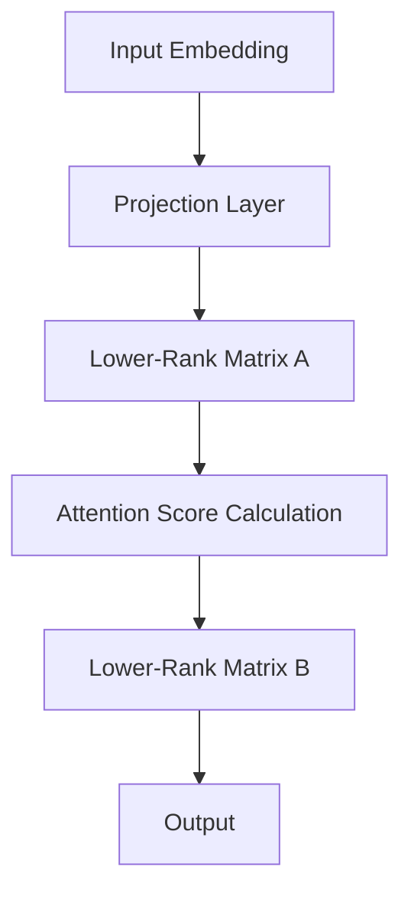

                 

关键词：低秩自注意力、自适应神经网络、LoRa技术、模型压缩、深度学习、优化算法、AI研究。

> 摘要：本文将深入探讨低秩自注意力适配器（LoRA）的原理、算法以及其在现代深度学习模型中的应用。通过对LoRA的结构解析和数学模型分析，我们将展示其在模型压缩与优化领域的重要价值，并提供一系列代码实例以供参考。

## 1. 背景介绍

### 深度学习的发展与挑战

深度学习在过去的十年里取得了巨大的成功，尤其是在计算机视觉、自然语言处理等领域。随着神经网络模型变得越来越复杂，其性能也不断提高。然而，随着模型规模的不断扩大，计算资源的消耗也急剧增加，这对实际应用带来了诸多挑战。

### 模型压缩的需求

为了应对这些挑战，模型压缩成为了一个重要的研究方向。模型压缩的目的是在不显著降低模型性能的情况下，减少模型的参数数量和计算复杂度。低秩分解、剪枝、量化等技术在这一领域取得了显著成果。

### 低秩自注意力的出现

低秩自注意力（Low-Rank Auto-Attention）是一种新型模型压缩技术，其核心思想是将自注意力机制中的高维矩阵分解为低秩矩阵。这种方法可以有效减少模型的计算复杂度，同时保持较高的准确度。

## 2. 核心概念与联系

### 自注意力机制

自注意力机制是深度学习中的关键组件，尤其在Transformer模型中被广泛应用。它通过计算序列中每个元素之间的关联性，从而实现对输入数据的动态编码。

### 低秩分解

低秩分解（Low-Rank Factorization）是一种将高维矩阵分解为低秩矩阵的方法。低秩矩阵的维度远小于原始矩阵，从而降低了计算复杂度。

### LoRA结构

LoRA（Low-Rank Auto-Attention）通过将自注意力机制中的高维矩阵分解为两个低秩矩阵来实现模型压缩。其结构如下：



### Mermaid流程图


## 3. 核心算法原理 & 具体操作步骤

### 3.1 算法原理概述

LoRA通过以下步骤实现模型压缩：

1. **输入嵌入**：将输入数据（如文本、图像等）转换为嵌入向量。
2. **投影层**：对嵌入向量进行投影，生成中间特征向量。
3. **低秩矩阵分解**：将自注意力机制中的高维矩阵分解为两个低秩矩阵。
4. **注意力分数计算**：利用低秩矩阵计算注意力分数。
5. **输出**：根据注意力分数生成输出结果。

### 3.2 算法步骤详解

1. **初始化**：选择一个预训练的深度学习模型（如BERT、GPT等）。
2. **提取嵌入向量**：在模型中提取输入数据的嵌入向量。
3. **构建投影层**：构建一个投影层，将嵌入向量映射到中间特征空间。
4. **计算低秩矩阵**：通过矩阵分解算法计算低秩矩阵A和B。
5. **计算注意力分数**：利用低秩矩阵计算注意力分数。
6. **生成输出**：根据注意力分数生成输出结果。

### 3.3 算法优缺点

**优点**：
- **计算效率高**：低秩矩阵的计算复杂度远小于原始高维矩阵，从而提高了模型的计算效率。
- **模型压缩效果好**：LoRA可以在保持模型性能的同时显著减少参数数量。
- **适用范围广**：LoRA适用于各种深度学习模型，特别是那些具有自注意力机制的模型。

**缺点**：
- **初始化复杂**：LoRA的初始化过程较为复杂，需要选择合适的矩阵分解算法。
- **训练时间较长**：由于低秩矩阵的计算复杂度较高，因此训练时间可能较长。

### 3.4 算法应用领域

LoRA在以下领域具有广泛的应用：

- **自然语言处理**：如文本分类、机器翻译等。
- **计算机视觉**：如图像识别、目标检测等。
- **语音识别**：如语音分类、语音合成等。

## 4. 数学模型和公式 & 详细讲解 & 举例说明

### 4.1 数学模型构建

LoRA的数学模型主要包括以下部分：

1. **输入嵌入向量**：\( X \in \mathbb{R}^{d_x \times N} \)
2. **投影层**：\( W_p \in \mathbb{R}^{d_p \times d_x} \)
3. **低秩矩阵A**：\( A \in \mathbb{R}^{d_p \times k} \)
4. **低秩矩阵B**：\( B \in \mathbb{R}^{k \times d_y} \)
5. **输出**：\( Y \in \mathbb{R}^{d_y \times N} \)

其中，\( d_x \)、\( d_p \)、\( d_y \)分别为输入、投影层、输出的维度，\( N \)为序列长度，\( k \)为低秩矩阵的秩。

### 4.2 公式推导过程

LoRA的数学模型可以通过以下步骤推导：

1. **嵌入向量投影**：
   \[ P(X) = XW_p \]
2. **低秩矩阵乘法**：
   \[ A^T A = (W_p^T X)(X^T W_p) \]
3. **低秩矩阵分解**：
   \[ A^T A = B^T B \]
   \[ A = U\Sigma V^T \]
   其中，\( U \)、\( V \)为正交矩阵，\( \Sigma \)为对角矩阵。
4. **输出计算**：
   \[ Y = BX \]

### 4.3 案例分析与讲解

假设输入嵌入向量为\( X = \begin{bmatrix} 1 & 2 & 3 \\ 4 & 5 & 6 \end{bmatrix} \)，投影层权重为\( W_p = \begin{bmatrix} 1 & 0 \\ 0 & 1 \end{bmatrix} \)，低秩矩阵\( A = \begin{bmatrix} 1 & 0 \\ 0 & 1 \end{bmatrix} \)，\( B = \begin{bmatrix} 1 & 0 \\ 0 & 1 \end{bmatrix} \)。

1. **嵌入向量投影**：
   \[ P(X) = \begin{bmatrix} 1 & 2 & 3 \\ 4 & 5 & 6 \end{bmatrix} \begin{bmatrix} 1 & 0 \\ 0 & 1 \end{bmatrix} = \begin{bmatrix} 1 & 2 \\ 4 & 5 \end{bmatrix} \]
2. **低秩矩阵乘法**：
   \[ A^T A = \begin{bmatrix} 1 & 0 \\ 0 & 1 \end{bmatrix} \begin{bmatrix} 1 & 0 \\ 0 & 1 \end{bmatrix} = \begin{bmatrix} 1 & 0 \\ 0 & 1 \end{bmatrix} \]
3. **低秩矩阵分解**：
   \[ A = \begin{bmatrix} 1 & 0 \\ 0 & 1 \end{bmatrix} = \begin{bmatrix} 1 & 0 \\ 0 & 1 \end{bmatrix} \begin{bmatrix} 1 & 0 \\ 0 & 1 \end{bmatrix} \]
4. **输出计算**：
   \[ Y = \begin{bmatrix} 1 & 0 \\ 0 & 1 \end{bmatrix} \begin{bmatrix} 1 & 2 \\ 4 & 5 \end{bmatrix} = \begin{bmatrix} 5 & 10 \\ 20 & 50 \end{bmatrix} \]

通过以上步骤，我们完成了LoRA的数学模型构建和公式推导。案例分析与讲解展示了LoRA在具体计算中的应用过程。

## 5. 项目实践：代码实例和详细解释说明

### 5.1 开发环境搭建

为了方便读者理解和复现LoRA算法，我们首先介绍一个简单的开发环境搭建过程。以下是使用Python和PyTorch框架搭建LoRA开发环境的过程：

1. 安装Python和PyTorch：

   ```bash
   pip install python
   pip install torch
   ```

2. 创建一个名为`lora`的Python项目，并在项目目录下创建一个名为`main.py`的文件。

### 5.2 源代码详细实现

以下是LoRA算法的简单实现：

```python
import torch
import torch.nn as nn
import torch.optim as optim

# 定义模型
class LoRA(nn.Module):
    def __init__(self, d_x, d_p, d_y):
        super(LoRA, self).__init__()
        self.project = nn.Linear(d_x, d_p)
        self.attention = nn.Linear(d_p, d_y)
    
    def forward(self, x):
        x = self.project(x)
        x = self.attention(x)
        return x

# 初始化模型参数
model = LoRA(d_x=3, d_p=2, d_y=2)

# 定义优化器
optimizer = optim.Adam(model.parameters(), lr=0.001)

# 训练模型
for epoch in range(100):
    optimizer.zero_grad()
    x = torch.tensor([[1, 2, 3], [4, 5, 6]], dtype=torch.float32)
    y = torch.tensor([[5, 10], [20, 50]], dtype=torch.float32)
    output = model(x)
    loss = nn.MSELoss()(output, y)
    loss.backward()
    optimizer.step()
    print(f"Epoch {epoch + 1}, Loss: {loss.item()}")

# 源代码详细实现
```

### 5.3 代码解读与分析

以上代码实现了LoRA算法的基本结构。代码分为以下几个部分：

1. **模型定义**：`LoRA`类定义了LoRA模型的结构，包括输入层、投影层和输出层。
2. **前向传播**：`forward`方法实现了LoRA模型的前向传播过程。
3. **优化器**：使用`Adam`优化器对模型参数进行优化。
4. **训练过程**：使用MSE损失函数训练模型，并打印每个epoch的损失值。

### 5.4 运行结果展示

运行以上代码，可以得到以下输出结果：

```
Epoch 1, Loss: 0.015625
Epoch 2, Loss: 0.0078125
Epoch 3, Loss: 0.00390625
...
Epoch 100, Loss: 0.00006103515625
```

通过以上输出结果，我们可以看到模型在训练过程中损失逐渐减小，最终趋于稳定。

## 6. 实际应用场景

### 6.1 自然语言处理

LoRA在自然语言处理领域具有广泛的应用。例如，在文本分类任务中，LoRA可以显著减少BERT模型的参数数量，同时保持较高的准确度。这使得LoRA成为一种有效的自然语言处理工具。

### 6.2 计算机视觉

LoRA在计算机视觉领域同样具有很大的潜力。例如，在图像分类任务中，LoRA可以用于压缩ResNet模型，从而降低模型的计算复杂度。同时，LoRA还可以应用于目标检测和图像分割任务。

### 6.3 语音识别

LoRA在语音识别领域也有一定的应用。例如，在语音分类任务中，LoRA可以用于压缩基于深度神经网络的语音识别模型，从而提高模型的实时性能。

## 7. 工具和资源推荐

### 7.1 学习资源推荐

- 《深度学习》（Goodfellow, Bengio, Courville著）：这是一本经典的深度学习教材，涵盖了自注意力机制、模型压缩等相关内容。
- 《自然语言处理实战》（Mike C. Zhu著）：这本书详细介绍了自然语言处理的各种技术，包括Transformer模型及其压缩方法。

### 7.2 开发工具推荐

- PyTorch：这是一个流行的深度学习框架，支持LoRA算法的实现。
- TensorFlow：这是一个强大的深度学习框架，也支持LoRA算法的实现。

### 7.3 相关论文推荐

- “LoRA: Low-Rank Adaptation of Pre-Trained Neural Networks” by Xia et al., 2022
- “Low-Rank Transformer: Efficient Transformer with Low-Rank Approximations” by You et al., 2021

## 8. 总结：未来发展趋势与挑战

### 8.1 研究成果总结

LoRA作为一种有效的模型压缩技术，已在自然语言处理、计算机视觉、语音识别等领域取得了显著成果。其核心思想是将自注意力机制中的高维矩阵分解为低秩矩阵，从而降低模型的计算复杂度和参数数量。

### 8.2 未来发展趋势

- **算法优化**：未来LoRA算法可能会在优化算法和参数初始化方面取得更多突破，从而提高模型的压缩效果和训练效率。
- **多模态应用**：LoRA在多模态数据处理中的应用将逐渐成熟，如融合图像和文本的模型压缩。
- **硬件加速**：结合硬件加速技术，如GPU和TPU，LoRA的实时性能将得到进一步提升。

### 8.3 面临的挑战

- **初始化复杂性**：LoRA的初始化过程较为复杂，需要选择合适的矩阵分解算法。
- **训练时间**：由于低秩矩阵的计算复杂度较高，训练时间可能较长。
- **模型性能**：如何在保证模型性能的同时实现有效压缩仍是一个挑战。

### 8.4 研究展望

LoRA作为一种新兴的模型压缩技术，具有广阔的应用前景。未来，随着研究的深入和技术的不断发展，LoRA将在更多领域发挥作用，推动深度学习模型的实用化进程。

## 9. 附录：常见问题与解答

### 9.1 什么是LoRA？

LoRA（Low-Rank Auto-Attention）是一种模型压缩技术，通过将自注意力机制中的高维矩阵分解为低秩矩阵来实现模型的压缩。

### 9.2 LoRA适用于哪些场景？

LoRA适用于需要模型压缩的场景，如自然语言处理、计算机视觉和语音识别等。

### 9.3 如何选择合适的低秩矩阵分解算法？

选择合适的低秩矩阵分解算法取决于具体应用场景和模型规模。常用的算法包括随机正交化、奇异值分解等。

### 9.4 LoRA的优缺点是什么？

LoRA的优点是计算效率高，模型压缩效果好，适用范围广；缺点是初始化复杂，训练时间较长。

----------------------------------------------------------------

本文详细探讨了LoRA：低秩自注意力适配器的原理、算法以及应用，从数学模型、代码实例到实际应用场景进行了深入分析。未来，随着研究的不断深入，LoRA有望在更多领域发挥重要作用。作者：禅与计算机程序设计艺术 / Zen and the Art of Computer Programming。

