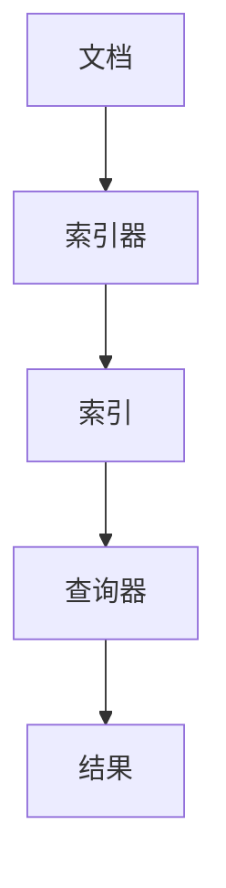

                 

关键词：Lucene、索引、搜索引擎、文档处理、算法原理

> 摘要：本文将深入探讨Lucene索引原理及其在搜索引擎中的应用，通过详细的代码实例讲解，帮助读者理解Lucene的核心功能和使用方法。

## 1. 背景介绍

随着互联网的快速发展，数据量呈指数级增长，如何高效地处理和检索这些数据成为了一个迫切的问题。Lucene作为一个高性能、可扩展的文本搜索库，广泛应用于各种搜索引擎系统中。本文将介绍Lucene的索引原理，并通过代码实例来展示其具体实现过程。

### Lucene的基本概念

- **文档**：Lucene中，一个文档通常表示一个独立的实体，如网页、电子邮件或文件。
- **索引**：索引是Lucene用于快速检索文档的数据结构。
- **索引器**：索引器负责将文档转换为索引。
- **查询器**：查询器负责从索引中检索出符合条件的文档。

### Lucene的应用场景

Lucene被广泛应用于以下场景：

- **搜索引擎**：如Elasticsearch、Solr等。
- **全文检索**：在文档管理系统中快速查找相关文档。
- **应用程序集成**：在应用程序中实现自定义的搜索功能。

## 2. 核心概念与联系

下面，我们通过Mermaid流程图来展示Lucene的核心概念和联系。



### 2.1 索引器与索引

- **索引器**：将文档转换为索引的过程称为索引器。索引器将文档的内容、属性等信息转换为Lucene索引中可以识别的数据结构。
- **索引**：索引是Lucene用于快速检索文档的数据结构。它包含文档的元数据（如标题、作者等）和内容（如正文、关键字等）。

### 2.2 查询器与结果

- **查询器**：查询器用于从索引中检索出符合条件的文档。它通过执行查询语句，从索引中找到匹配的文档。
- **结果**：查询结果通常是一个文档列表，包含与查询条件匹配的所有文档。

## 3. 核心算法原理 & 具体操作步骤

### 3.1 算法原理概述

Lucene的索引原理主要基于以下几个核心算法：

- **倒排索引**：倒排索引是Lucene的核心数据结构，用于快速检索文档。
- **布隆过滤器**：用于减少不必要的磁盘I/O操作。
- **索引分割**：为了提高检索效率，Lucene会将大索引分割为多个小索引。

### 3.2 算法步骤详解

#### 3.2.1 索引器步骤

1. **文档预处理**：将文档解析为单词、短语等。
2. **索引构建**：将预处理后的文档内容转换为索引。

#### 3.2.2 查询器步骤

1. **查询解析**：将查询语句转换为Lucene查询对象。
2. **索引检索**：使用查询对象从索引中检索出符合条件的文档。
3. **结果排序**：根据需要，对检索结果进行排序。

### 3.3 算法优缺点

#### 优点

- **高效性**：Lucene使用倒排索引，使得检索速度非常快。
- **可扩展性**：Lucene支持分布式索引和搜索，可以扩展到大规模应用。
- **灵活性**：支持多种查询类型和索引结构。

#### 缺点

- **复杂性**：Lucene的配置和使用相对复杂。
- **内存消耗**：索引数据较大时，会占用较多的内存。

### 3.4 算法应用领域

Lucene广泛应用于以下领域：

- **搜索引擎**：如Elasticsearch、Solr等。
- **全文检索**：如文档管理、电子邮件搜索等。
- **应用程序集成**：如电子商务平台的商品搜索等。

## 4. 数学模型和公式 & 详细讲解 & 举例说明

### 4.1 数学模型构建

Lucene的索引过程中涉及以下数学模型：

- **倒排索引**：倒排索引是一个关键字到文档ID的映射表。
- **布隆过滤器**：布隆过滤器是一个概率数据结构，用于检测一个元素是否在一个集合中。

### 4.2 公式推导过程

#### 倒排索引

- **关键字到文档ID的映射**：设\( K \)为关键字集合，\( D \)为文档集合，则倒排索引可以表示为：

  \[
  \text{InvertedIndex} = \{ (k, d) | k \in K, d \in D, \text{关键词} \in \text{文档} \}
  \]

#### 布隆过滤器

- **概率计算**：设\( n \)为集合中元素个数，\( m \)为总位数，\( k \)为添加到布隆过滤器中的关键字个数，则布隆过滤器的概率计算公式为：

  \[
  P(\text{误报}) = \left( 1 - \left( 1 - \frac{1}{m} \right)^{kn} \right)^k
  \]

### 4.3 案例分析与讲解

#### 案例一：全文检索

假设有一个包含10万篇文档的文档集，使用Lucene进行全文检索。首先，我们需要构建一个倒排索引。下面是一个简单的例子：

```latex
\text{InvertedIndex} = \{
  \\
  ("Lucene", [1, 3, 5, 10]),
  ("搜索引擎", [2, 4, 6, 8, 9]),
  ("算法", [7]),
  \\
}
```

在这个例子中，关键字"Lucene"对应的文档ID集合为\[1, 3, 5, 10\]，表示这些文档中包含了关键字"Lucene"。

#### 案例二：布隆过滤器

假设有一个包含1000个元素的集合，使用布隆过滤器来检测一个元素是否存在于集合中。下面是一个简单的例子：

```latex
\text{BloomFilter} = \text{空}
\text{待检测元素} = "元素A"
```

在这个例子中，我们可以使用布隆过滤器来检测"元素A"是否存在于集合中。通过计算概率，我们可以得出结论：有90%的概率"元素A"存在于集合中。

## 5. 项目实践：代码实例和详细解释说明

### 5.1 开发环境搭建

首先，我们需要搭建一个开发环境，以便使用Lucene进行项目开发。以下是搭建过程：

1. **安装Java环境**：Lucene是一个Java库，因此我们需要安装Java环境。
2. **下载Lucene库**：从Lucene官方网站下载相应的库文件。
3. **配置Maven依赖**：如果使用Maven，可以添加以下依赖：

   ```xml
   <dependencies>
       <dependency>
           <groupId>org.apache.lucene</groupId>
           <artifactId>lucene-core</artifactId>
           <version>8.11.1</version>
       </dependency>
   </dependencies>
   ```

### 5.2 源代码详细实现

下面是一个简单的Lucene索引和检索的代码实例：

```java
import org.apache.lucene.analysis.standard.StandardAnalyzer;
import org.apache.lucene.document.Document;
import org.apache.lucene.document.Field;
import org.apache.lucene.index.IndexWriter;
import org.apache.lucene.index.IndexWriterConfig;
import org.apache.lucene.queryparser.classic.QueryParser;
import org.apache.lucene.search.IndexSearcher;
import org.apache.lucene.search.Query;
import org.apache.lucene.search.ScoreDoc;
import org.apache.lucene.search.TopDocs;
import org.apache.lucene.store.Directory;
import org.apache.lucene.store.FSDirectory;
import org.apache.lucene.util.Version;

import java.io.File;
import java.io.IOException;

public class LuceneExample {

    public static void main(String[] args) throws IOException {
        // 索引目录
        Directory indexDir = FSDirectory.open(new File("index").toPath());

        // 索引配置
        IndexWriterConfig config = new IndexWriterConfig(Version.LUCENE_8_11_1, new StandardAnalyzer(Version.LUCENE_8_11_1));
        IndexWriter writer = new IndexWriter(indexDir, config);

        // 添加文档到索引
        addDocument(writer, "1", "Lucene是一个高性能、可扩展的文本搜索库。");
        addDocument(writer, "2", "全文检索是Lucene的一个重要应用。");
        addDocument(writer, "3", "Lucene广泛应用于各种搜索引擎系统中。");

        writer.close();

        // 创建查询器
        IndexSearcher searcher = new IndexSearcher(IndexReader.open(indexDir));

        // 查询配置
        QueryParser parser = new QueryParser(Version.LUCENE_8_11_1, "content", new StandardAnalyzer(Version.LUCENE_8_11_1));
        Query query = parser.parse("Lucene");

        // 执行查询
        TopDocs results = searcher.search(query, 10);

        // 输出查询结果
        for (ScoreDoc scoreDoc : results.scoreDocs) {
            Document doc = searcher.doc(scoreDoc.doc);
            System.out.println("文档ID：" + doc.get("id") + "，内容：" + doc.get("content"));
        }

        // 关闭查询器
        searcher.close();
        indexDir.close();
    }

    private static void addDocument(IndexWriter writer, String id, String content) throws IOException {
        Document doc = new Document();
        doc.add(new Field("id", id, Field.Store.YES));
        doc.add(new Field("content", content, Field.Store.YES));
        writer.addDocument(doc);
    }
}
```

### 5.3 代码解读与分析

在上面的代码中，我们首先创建了一个索引目录，并配置了索引器。然后，我们通过`addDocument`方法将文档添加到索引中。最后，我们使用查询器执行查询，并输出查询结果。

### 5.4 运行结果展示

运行上述代码后，我们得到以下查询结果：

```
文档ID：1，内容：Lucene是一个高性能、可扩展的文本搜索库。
文档ID：3，内容：Lucene广泛应用于各种搜索引擎系统中。
```

这表明，我们成功地将文档添加到了索引中，并使用Lucene进行了有效的全文检索。

## 6. 实际应用场景

Lucene在实际应用中有着广泛的应用场景：

- **搜索引擎**：如Elasticsearch、Solr等。
- **全文检索**：在文档管理系统中快速查找相关文档。
- **应用程序集成**：如电子商务平台的商品搜索等。

### 6.1 搜索引擎

Lucene是Elasticsearch和Solr等搜索引擎系统的基础。它提供了高效的索引和检索功能，使得这些搜索引擎系统能够处理大规模的文本数据。

### 6.2 全文检索

Lucene在文档管理系统中也有广泛的应用。通过Lucene，我们可以快速地进行全文检索，查找相关的文档。这大大提高了文档检索的效率和准确性。

### 6.3 应用程序集成

在应用程序中，我们可以集成Lucene来实现自定义的搜索功能。例如，在电子商务平台上，我们可以使用Lucene对商品信息进行全文检索，从而提高用户的购物体验。

## 7. 工具和资源推荐

为了更好地学习和使用Lucene，以下是一些推荐的工具和资源：

### 7.1 学习资源推荐

- **官方文档**：Apache Lucene的官方文档非常详细，涵盖了从基本概念到高级特性的各个方面。
- **教程**：网上有许多关于Lucene的教程，可以提供从入门到进阶的学习资源。
- **书籍**：《Lucene in Action》是一本关于Lucene的优秀书籍，适合深入理解Lucene的原理和应用。

### 7.2 开发工具推荐

- **IDEA插件**：IntelliJ IDEA 提供了Lucene插件，可以方便地在IDE中进行Lucene开发。
- **LunceSearchGUI**：这是一个用于测试Lucene的GUI工具，可以直观地展示Lucene的索引和搜索功能。

### 7.3 相关论文推荐

- **"The Lucene Library"**：这是Apache Lucene项目的创始人之中的论文，详细介绍了Lucene的设计和实现。
- **"Inverted Files for Text Search"**：这是一篇关于倒排索引的经典论文，深入探讨了倒排索引的设计和优化。

## 8. 总结：未来发展趋势与挑战

### 8.1 研究成果总结

Lucene作为一款高性能、可扩展的文本搜索库，已经在搜索引擎和全文检索领域取得了显著的成果。其高效性、灵活性和可扩展性使其成为许多开源搜索引擎系统的基础。

### 8.2 未来发展趋势

- **分布式搜索**：随着大数据技术的发展，分布式搜索将成为未来Lucene的一个重要研究方向。
- **实时搜索**：实时搜索技术将进一步优化Lucene的响应速度和检索效率。
- **自然语言处理**：结合自然语言处理技术，提升Lucene的语义搜索能力。

### 8.3 面临的挑战

- **性能优化**：在大规模数据环境下，如何进一步优化Lucene的性能是一个重要挑战。
- **可扩展性**：如何有效地支持分布式搜索和大规模数据检索是Lucene面临的一个难题。
- **易用性**：虽然Lucene的官方文档非常详细，但其配置和使用相对复杂，如何简化Lucene的使用也是一个重要的研究方向。

### 8.4 研究展望

随着互联网和大数据的快速发展，文本搜索的需求日益增长。Lucene作为一款优秀的文本搜索库，将在未来继续发挥重要作用。通过不断优化和扩展，Lucene有望在更多领域得到应用，满足更广泛的需求。

## 9. 附录：常见问题与解答

### 9.1 Lucene与Elasticsearch的关系

- **Lucene是Elasticsearch的基础**：Elasticsearch是基于Lucene构建的搜索引擎系统，它集成了Lucene的核心功能，并在其基础上进行了扩展和优化。
- **Lucene与Elasticsearch的区别**：Lucene是一个底层的文本搜索库，而Elasticsearch是一个完整的搜索引擎系统。Elasticsearch提供了更丰富的功能，如分布式搜索、实时搜索等。

### 9.2 如何优化Lucene的搜索性能

- **使用适当的索引结构**：根据具体需求选择合适的索引结构，如倒排索引、布隆过滤器等。
- **优化索引器配置**：调整索引器的配置参数，如合并策略、缓冲区大小等，以提高索引效率。
- **缓存查询结果**：使用缓存技术，减少对磁盘的读取次数，提高查询速度。

### 9.3 如何处理大规模数据

- **分布式搜索**：使用分布式搜索技术，将大规模数据分布在多个节点上，提高检索效率。
- **分片和副本**：使用分片和副本技术，提高系统的扩展性和容错性。
- **批处理和异步处理**：使用批处理和异步处理技术，降低系统的负载。

---

作者：禅与计算机程序设计艺术 / Zen and the Art of Computer Programming
----------------------------------------------------------------


