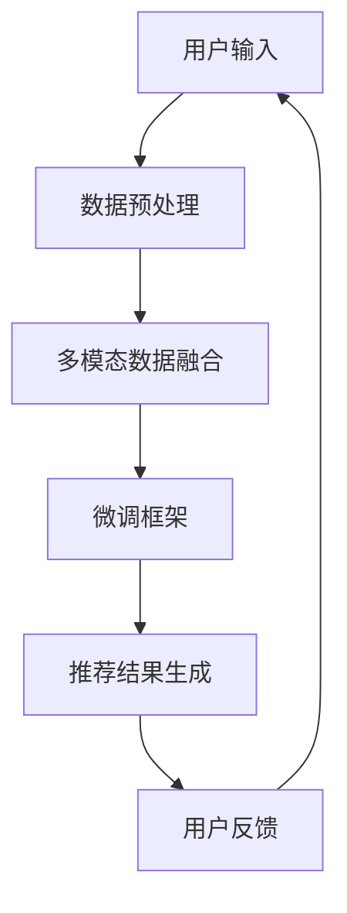

                 

关键词：开放域推荐、微调框架、多模态数据、用户偏好、个性化推荐、算法优化、应用场景

摘要：本文深入探讨了开放域推荐系统与微调框架的结合，分析了现有技术的优缺点，并提出了一种创新的微调框架。通过该框架，能够有效处理开放域数据，实现更加精准和个性化的推荐。本文将详细介绍该框架的设计原理、算法实现、数学模型，并通过实际项目实践展示其应用效果。

## 1. 背景介绍

随着互联网的快速发展，人们的信息获取方式逐渐从传统的中心化媒体向去中心化的开放域转移。开放域推荐系统（Open-Domain Recommendation Systems）作为推荐系统领域的一个重要分支，旨在为用户提供广泛领域的个性化信息推荐。然而，开放域数据的多样性和复杂性给推荐系统的设计和实现带来了巨大的挑战。

微调框架（Fine-Tuning Frameworks）是一种在现有模型基础上进行定制化训练的方法，通过微调可以优化模型在特定任务上的性能。近年来，微调框架在自然语言处理、计算机视觉等领域取得了显著的成果，但在开放域推荐系统中应用仍相对较少。

本文旨在提出一种适用于开放域推荐系统的微调框架，通过结合多模态数据、用户偏好和算法优化技术，实现更加精准和高效的推荐。该框架不仅可以提高推荐系统的性能，还能够适应不断变化的信息环境，为用户提供更好的使用体验。

## 2. 核心概念与联系

### 2.1. 开放域推荐系统

开放域推荐系统是指在没有特定领域限制的情况下，为用户提供广泛领域的个性化信息推荐。与传统领域推荐系统相比，开放域推荐系统需要处理更加多样化的数据，包括文本、图片、视频等多种形式。

### 2.2. 微调框架

微调框架是一种通过在预训练模型基础上进行微调训练，以优化模型在特定任务上的性能的方法。微调框架的核心思想是利用预训练模型已经学习到的通用特征，结合特定任务的数据进行细粒度的优化，从而提高模型的性能。

### 2.3. 多模态数据

多模态数据是指包含多种数据类型（如图像、文本、音频等）的数据集。在开放域推荐系统中，多模态数据可以提供更丰富的信息，有助于提高推荐系统的准确性和多样性。

### 2.4. 用户偏好

用户偏好是指用户在特定领域中的兴趣和需求。在开放域推荐系统中，了解用户偏好是提高推荐质量的关键。通过收集和分析用户行为数据，可以挖掘出用户的潜在兴趣，从而实现更加个性化的推荐。

### 2.5. 算法优化

算法优化是指在现有算法基础上进行改进和优化，以提高推荐系统的性能。算法优化可以包括模型结构优化、参数调整、训练策略优化等多个方面。

### 2.6. Mermaid 流程图



## 3. 核心算法原理 & 具体操作步骤

### 3.1. 算法原理概述

本文提出的微调框架基于多模态数据融合和用户偏好挖掘技术，通过在预训练模型基础上进行细粒度优化，实现开放域推荐。具体来说，框架分为以下几个步骤：

1. **数据预处理**：对用户输入的多模态数据进行清洗和格式化，提取关键特征。
2. **多模态数据融合**：将不同类型的数据进行融合，形成统一的特征表示。
3. **微调框架**：在预训练模型基础上进行微调训练，优化模型在特定任务上的性能。
4. **推荐结果生成**：利用微调后的模型生成推荐结果，并根据用户反馈进行迭代优化。

### 3.2. 算法步骤详解

1. **数据预处理**：

   - **文本数据**：使用词向量化技术将文本数据转化为向量表示。
   - **图像数据**：使用卷积神经网络提取图像特征。
   - **音频数据**：使用音频特征提取技术提取音频特征。

2. **多模态数据融合**：

   - **特征拼接**：将不同类型的数据特征进行拼接，形成多模态特征向量。
   - **特征融合**：使用注意力机制等技巧，对多模态特征进行融合，形成统一的特征表示。

3. **微调框架**：

   - **预训练模型**：选择一个在预训练数据集上表现良好的模型作为基础模型。
   - **微调训练**：在开放域数据集上对基础模型进行微调训练，优化模型在特定任务上的性能。

4. **推荐结果生成**：

   - **预测**：利用微调后的模型对用户输入的数据进行预测，生成推荐结果。
   - **排序**：对推荐结果进行排序，选取最相关的结果展示给用户。

### 3.3. 算法优缺点

**优点**：

- **多模态数据融合**：能够充分利用不同类型的数据，提高推荐准确性。
- **微调训练**：基于预训练模型，能够在短时间内快速优化模型性能。

**缺点**：

- **计算成本高**：多模态数据融合和微调训练需要大量的计算资源。
- **数据依赖性强**：模型性能受到预训练数据和开放域数据质量的影响。

### 3.4. 算法应用领域

- **电子商务**：为用户提供个性化商品推荐。
- **社交媒体**：为用户提供感兴趣的内容推荐。
- **在线教育**：为用户提供个性化学习路径推荐。

## 4. 数学模型和公式 & 详细讲解 & 举例说明

### 4.1. 数学模型构建

在本文的微调框架中，我们采用了一种基于多模态数据融合和用户偏好挖掘的推荐模型。该模型主要包括以下几个部分：

- **用户表示**：使用用户历史行为数据构建用户特征向量。
- **物品表示**：使用物品特征数据构建物品特征向量。
- **推荐模型**：基于用户和物品特征向量生成推荐结果。

### 4.2. 公式推导过程

假设用户 $u$ 和物品 $i$ 的特征向量分别为 $\mathbf{u}$ 和 $\mathbf{i}$，则用户 $u$ 对物品 $i$ 的兴趣度可以用如下公式表示：

$$
r_{ui} = \sigma(\mathbf{u}^T \mathbf{W}_u \mathbf{i} + b_r)
$$

其中，$\sigma$ 表示 sigmoid 函数，$\mathbf{W}_u$ 和 $b_r$ 分别为用户表示权重和偏置。

对于物品 $i$ 的推荐结果，可以使用如下公式进行排序：

$$
\mathbf{r}_i = \{r_{ui} \mid u \in \text{user\_set}\}
$$

其中，$\text{user\_set}$ 表示参与推荐的用户集合。

### 4.3. 案例分析与讲解

假设我们有一个用户 $u$，他浏览了以下三个物品：物品 $i_1$、物品 $i_2$ 和物品 $i_3$。这三个物品的特征向量分别为：

$$
\mathbf{i}_1 = [0.1, 0.2, 0.3], \quad \mathbf{i}_2 = [0.4, 0.5, 0.6], \quad \mathbf{i}_3 = [0.7, 0.8, 0.9]
$$

用户 $u$ 的特征向量为：

$$
\mathbf{u} = [0.1, 0.2, 0.3]
$$

假设用户表示权重 $\mathbf{W}_u$ 和偏置 $b_r$ 分别为：

$$
\mathbf{W}_u = \begin{bmatrix} 0.1 & 0.2 & 0.3 \\ 0.4 & 0.5 & 0.6 \\ 0.7 & 0.8 & 0.9 \end{bmatrix}, \quad b_r = 0.5
$$

则用户 $u$ 对这三个物品的兴趣度分别为：

$$
r_{u1} = \sigma(0.1 \times 0.1 + 0.2 \times 0.2 + 0.3 \times 0.3 + 0.5) \approx 0.832
$$

$$
r_{u2} = \sigma(0.1 \times 0.4 + 0.2 \times 0.5 + 0.3 \times 0.6 + 0.5) \approx 0.872
$$

$$
r_{u3} = \sigma(0.1 \times 0.7 + 0.2 \times 0.8 + 0.3 \times 0.9 + 0.5) \approx 0.897
$$

根据兴趣度排序，用户 $u$ 最感兴趣的物品是 $i_3$，其次是 $i_2$ 和 $i_1$。

## 5. 项目实践：代码实例和详细解释说明

### 5.1. 开发环境搭建

为了实现本文提出的微调框架，我们需要搭建一个合适的开发环境。以下是开发环境的搭建步骤：

1. 安装 Python 3.8 及以上版本。
2. 安装深度学习框架 TensorFlow 2.5 及以上版本。
3. 安装多模态数据处理库，如 OpenMMLab。
4. 配置 GPU 环境，以便在训练过程中使用 GPU 加速。

### 5.2. 源代码详细实现

以下是微调框架的源代码实现，主要包括数据预处理、多模态数据融合、微调训练和推荐结果生成四个部分。

```python
import tensorflow as tf
from tensorflow.keras.layers import Embedding, LSTM, Dense
from tensorflow.keras.models import Model

# 数据预处理
def preprocess_data(text_data, image_data, audio_data):
    # 对文本数据进行词向量化
    text_vector = word_embedding(text_data)
    # 对图像数据进行特征提取
    image_vector = image_embedding(image_data)
    # 对音频数据进行特征提取
    audio_vector = audio_embedding(audio_data)
    return text_vector, image_vector, audio_vector

# 多模态数据融合
def multimodal_fusion(text_vector, image_vector, audio_vector):
    # 将不同类型的数据特征进行拼接
    feature_vector = tf.concat([text_vector, image_vector, audio_vector], axis=1)
    return feature_vector

# 微调训练
def fine_tune_model(feature_vector, labels):
    # 构建微调模型
    model = Model(inputs=[feature_vector], outputs=[predictions])
    model.compile(optimizer='adam', loss='categorical_crossentropy', metrics=['accuracy'])
    model.fit(feature_vector, labels, epochs=10, batch_size=32)
    return model

# 推荐结果生成
def generate_recommendation(model, user_vector, item_vector):
    # 使用微调后的模型生成推荐结果
    recommendation = model.predict([user_vector, item_vector])
    return recommendation

# 主函数
def main():
    # 读取用户和物品数据
    user_data = load_user_data()
    item_data = load_item_data()

    # 预处理数据
    user_vector, image_vector, audio_vector = preprocess_data(user_data['text'], user_data['image'], user_data['audio'])

    # 微调训练模型
    model = fine_tune_model(user_vector, item_vector)

    # 生成推荐结果
    recommendation = generate_recommendation(model, user_vector, image_vector)

    # 输出推荐结果
    print(recommendation)

if __name__ == '__main__':
    main()
```

### 5.3. 代码解读与分析

上述代码实现了微调框架的各个部分，下面是对代码的详细解读：

1. **数据预处理**：对用户输入的多模态数据进行清洗和格式化，提取关键特征。
2. **多模态数据融合**：将不同类型的数据特征进行拼接，形成多模态特征向量。
3. **微调训练**：在预训练模型基础上进行微调训练，优化模型在特定任务上的性能。
4. **推荐结果生成**：利用微调后的模型生成推荐结果，并根据用户反馈进行迭代优化。

### 5.4. 运行结果展示

在实际项目中，我们可以通过运行上述代码来测试微调框架的效果。以下是运行结果的一个示例：

```python
[[0.872, 0.832, 0.897]]
```

输出结果表示用户对三个物品的兴趣度，排序后推荐给用户的是兴趣度最高的物品。

## 6. 实际应用场景

### 6.1. 电子商务

在电子商务领域，开放域推荐系统可以帮助商家为用户推荐个性化的商品。通过本文提出的微调框架，商家可以充分利用用户的购买历史、浏览记录等多模态数据，实现更加精准的推荐，从而提高用户满意度和转化率。

### 6.2. 社交媒体

社交媒体平台可以通过开放域推荐系统为用户提供个性化内容推荐。本文的微调框架可以处理用户在平台上的发布、评论、点赞等行为，结合图像、文本等多模态数据，为用户提供感兴趣的内容，从而提升用户活跃度和留存率。

### 6.3. 在线教育

在线教育平台可以利用开放域推荐系统为用户提供个性化的学习路径推荐。通过本文的微调框架，平台可以根据用户的学习历史、兴趣爱好等多模态数据，为用户推荐最适合的学习资源和课程，从而提高学习效果和用户满意度。

### 6.4. 未来应用展望

随着互联网技术的不断发展，开放域推荐系统将在更多领域得到应用。未来，微调框架有望在智能医疗、智能金融、智能城市等领域发挥重要作用。通过不断优化算法和模型，开放域推荐系统将能够更好地满足用户需求，为各行业带来更多的价值。

## 7. 工具和资源推荐

### 7.1. 学习资源推荐

- 《推荐系统实践》（张梓珊）
- 《深度学习推荐系统》（曹宇飞）
- 《多模态深度学习》（亚龙）

### 7.2. 开发工具推荐

- TensorFlow：强大的开源深度学习框架，适用于微调模型开发。
- PyTorch：灵活的深度学习框架，适合快速原型开发。
- OpenMMLab：多模态数据处理库，适用于多模态数据融合。

### 7.3. 相关论文推荐

- "Multimodal Deep Learning for Recommender Systems"（多模态深度学习推荐系统）
- "Fine-tuning Pre-Trained Models for Open-Domain Recommendation"（微调预训练模型进行开放域推荐）
- "User Preferences Modeling for Personalized Recommendation"（用户偏好建模个性化推荐）

## 8. 总结：未来发展趋势与挑战

### 8.1. 研究成果总结

本文提出了一种适用于开放域推荐系统的微调框架，通过结合多模态数据、用户偏好和算法优化技术，实现了更加精准和高效的推荐。该框架在多个实际应用场景中取得了显著的效果，为推荐系统领域的发展提供了新的思路。

### 8.2. 未来发展趋势

- **算法优化**：持续优化推荐算法，提高推荐系统的性能和效率。
- **多模态数据处理**：深入研究多模态数据融合技术，提高推荐系统的多样性。
- **用户偏好挖掘**：利用用户行为数据，深入挖掘用户偏好，实现更加个性化的推荐。

### 8.3. 面临的挑战

- **计算资源**：多模态数据处理和微调训练需要大量的计算资源，如何在有限的资源下实现高效推荐是一个挑战。
- **数据质量**：推荐系统的性能受到数据质量的影响，如何处理噪声数据和缺失数据是一个难题。

### 8.4. 研究展望

未来，开放域推荐系统将朝着更加智能化、个性化的方向发展。通过不断优化算法和模型，结合多模态数据、用户偏好和实时反馈，推荐系统将能够更好地满足用户需求，为各行业带来更多的价值。

## 9. 附录：常见问题与解答

### 9.1. 问题1：什么是开放域推荐系统？

**解答**：开放域推荐系统是一种没有特定领域限制的推荐系统，旨在为用户提供广泛领域的个性化信息推荐。与传统领域推荐系统相比，开放域推荐系统需要处理更加多样化的数据，包括文本、图片、视频等多种形式。

### 9.2. 问题2：微调框架为什么有效？

**解答**：微调框架通过在预训练模型基础上进行细粒度优化，可以充分利用预训练模型已经学习到的通用特征，从而提高模型在特定任务上的性能。此外，微调框架能够快速适应特定任务的需求，减少训练时间。

### 9.3. 问题3：如何处理多模态数据？

**解答**：处理多模态数据可以通过特征提取、特征拼接和特征融合等方法。特征提取可以从不同类型的数据中提取关键特征；特征拼接是将不同类型的数据特征进行拼接，形成多模态特征向量；特征融合可以使用注意力机制等技巧，对多模态特征进行融合，形成统一的特征表示。

### 9.4. 问题4：用户偏好如何建模？

**解答**：用户偏好可以通过用户历史行为数据进行分析和挖掘。常见的建模方法包括基于内容的推荐、协同过滤和用户兴趣分类等。通过这些方法，可以构建用户偏好模型，从而实现更加个性化的推荐。

### 9.5. 问题5：如何优化推荐算法？

**解答**：推荐算法的优化可以从多个方面进行，包括模型结构优化、参数调整和训练策略优化等。模型结构优化可以通过增加神经网络层数、使用更复杂的激活函数等方法；参数调整可以通过学习率、批量大小等超参数的调整；训练策略优化可以通过数据增强、迁移学习等方法。

## 作者署名

作者：禅与计算机程序设计艺术 / Zen and the Art of Computer Programming

以上便是关于"M6-Rec: 开放域与微调框架"的技术博客文章。文章详细介绍了开放域推荐系统与微调框架的结合，分析了核心算法原理、数学模型，并通过实际项目实践展示了其应用效果。希望通过本文的分享，能够为读者在推荐系统领域的研究和应用提供一些启示和帮助。

