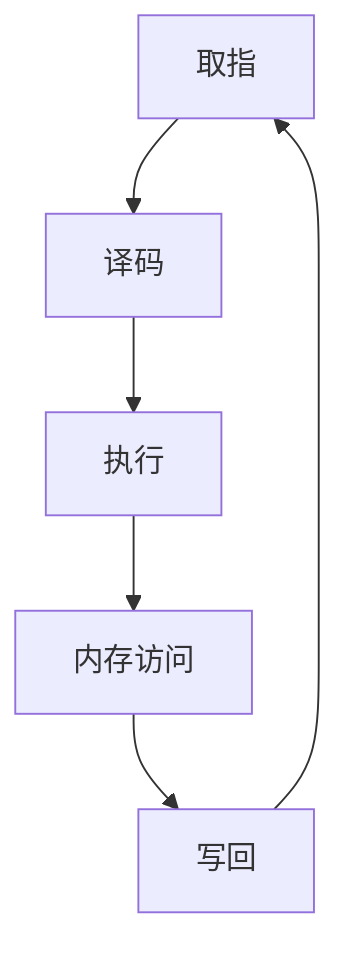

                 

关键词：MIPS处理器、处理器架构、指令集、优化技术、性能提升、程序设计

摘要：本文将深入探讨MIPS处理器的特性和优化技术。首先，我们将介绍MIPS处理器的基本架构和指令集，然后详细讨论MIPS处理器优化的几个关键方面，包括指令级并行性、流水线技术和缓存策略。通过这些分析，我们将为读者提供一个全面的MIPS处理器优化指南，帮助其在软件开发和性能调优中取得更好的效果。

## 1. 背景介绍

MIPS（Microprocessor without Interlocked Pipeline Stages）处理器是一种流行的精简指令集计算机（RISC）处理器架构。它最初由斯坦福大学和计算机科学实验室合作开发，并于1985年首次发布。MIPS处理器因其高效的指令集和简单的架构设计而被广泛应用于嵌入式系统、网络设备、消费电子产品等领域。

MIPS处理器的基本架构特点包括简单的五级流水线设计、固定长度指令和数据路径、简单的寄存器文件和较高的指令执行速度。这些特性使得MIPS处理器在性能和能效方面具有显著的优点，特别是在需要高性能计算和低功耗应用的环境中。

随着技术的发展，MIPS处理器在性能和功能方面不断改进。例如，现代MIPS处理器引入了多核架构、动态调度技术、高级指令集扩展等功能，以提高处理器的整体性能和灵活性。

## 2. 核心概念与联系

### 2.1 MIPS处理器架构

MIPS处理器架构可以分为几个关键部分：指令集、寄存器文件、流水线、缓存和控制单元。

**指令集**：MIPS指令集包括数据传输指令、算术逻辑单元（ALU）指令、分支指令和系统调用指令。这些指令设计简洁、易于理解和执行。

**寄存器文件**：MIPS处理器具有32个32位通用寄存器，用于存储数据和地址。这些寄存器可以快速访问，对处理器的性能至关重要。

**流水线**：MIPS处理器采用五级流水线设计，包括取指、译码、执行、内存访问和写回阶段。这种设计可以提高指令级并行性，提高处理器性能。

**缓存**：MIPS处理器通常配备一级数据缓存和一级指令缓存，用于缓存最近使用的数据和指令，减少内存访问延迟。

**控制单元**：控制单元负责管理指令的执行，协调各个部件的工作。

### 2.2 MIPS指令集

MIPS指令集包括以下几类指令：

- **数据传输指令**：用于在寄存器和内存之间传输数据，如`lw`（加载字）和`sw`（存储字）。
- **算术逻辑单元（ALU）指令**：用于执行算术和逻辑运算，如`add`（加法）和`and`（逻辑与）。
- **分支指令**：用于实现程序控制流，如`beq`（等价分支）和`bne`（不等分支）。
- **系统调用指令**：用于与操作系统进行交互，如`syscall`。

### 2.3 流程图

以下是一个MIPS处理器流水线的Mermaid流程图：



## 3. 核心算法原理 & 具体操作步骤

### 3.1 算法原理概述

MIPS处理器的优化主要关注以下几个方面：

- **指令级并行性**：通过优化指令调度和执行，提高指令级并行性，减少指令执行时间。
- **流水线技术**：通过改进流水线设计，减少流水线阻塞和冒险，提高处理器性能。
- **缓存策略**：通过优化缓存管理和替换策略，提高缓存命中率，减少内存访问延迟。

### 3.2 算法步骤详解

#### 3.2.1 指令级并行性优化

1. **指令调度**：通过静态调度或动态调度技术，将后续指令提前放入指令队列，以便并行执行。
2. **指令重排**：根据指令间的数据依赖关系，重新排列指令顺序，消除数据冒险和结构冒险。
3. **循环展开**：在循环中插入多个重复的循环体，减少循环开销。

#### 3.2.2 流水线技术优化

1. **流水线设计**：采用多级流水线设计，增加指令级并行性。
2. **冒险处理**：通过数据冒险、结构冒险和分支冒险处理技术，减少流水线阻塞。
   - **数据冒险处理**：通过插入流水线“填充指令”或使用延迟槽技术来处理数据冒险。
   - **结构冒险处理**：通过流水线绕道或资源重用技术来处理结构冒险。
   - **分支冒险处理**：通过分支预测技术来减少分支冒险。

#### 3.2.3 缓存策略优化

1. **缓存管理**：通过缓存一致性协议和缓存替换策略，提高缓存命中率。
2. **缓存预取**：通过预测程序访问模式，提前加载缓存中的数据，减少内存访问延迟。

### 3.3 算法优缺点

#### 优点

- **提高性能**：通过优化指令级并行性、流水线技术和缓存策略，可以显著提高处理器性能。
- **降低功耗**：优化后的处理器在保持性能的同时，可以降低功耗，提高能效。

#### 缺点

- **复杂性增加**：优化技术引入了额外的硬件和软件复杂性，增加了设计和实现难度。
- **性能提升有限**：在某些情况下，优化技术的效果可能受到限制，无法实现预期的性能提升。

### 3.4 算法应用领域

MIPS处理器优化技术广泛应用于以下几个方面：

- **嵌入式系统**：在嵌入式系统中，性能和功耗是关键因素，优化技术可以帮助提高嵌入式系统的性能和能效。
- **网络设备**：网络设备通常需要处理大量数据，优化技术可以提高网络设备的处理能力。
- **消费电子产品**：在消费电子产品中，优化技术可以帮助提高设备的性能和用户体验。

## 4. 数学模型和公式 & 详细讲解 & 举例说明

### 4.1 数学模型构建

MIPS处理器优化的数学模型主要包括以下几个方面：

- **指令级并行性**：使用DAG（有向无环图）表示指令间依赖关系，计算并行度。
- **流水线性能**：使用IPC（指令吞吐率）和CPI（周期指令数）等指标来评估流水线性能。
- **缓存性能**：使用命中率、访问时间和缓存大小等指标来评估缓存性能。

### 4.2 公式推导过程

以下是一些常用的数学公式：

- **指令级并行性**：
  $$P = \frac{N}{D}$$
  其中，P为并行度，N为可并行执行的指令数，D为执行时间。

- **流水线性能**：
  $$IPC = \frac{I}{T}$$
  其中，IPC为指令吞吐率，I为指令数，T为总时间。

  $$CPI = \frac{T}{I}$$
  其中，CPI为周期指令数，T为总时间，I为指令数。

- **缓存性能**：
  $$H = \frac{C}{C+M}$$
  其中，H为命中率，C为缓存命中次数，M为缓存未命中次数。

### 4.3 案例分析与讲解

假设我们有一个包含100条指令的程序，其中50条指令需要执行一次内存访问，其余指令仅涉及寄存器操作。我们需要评估流水线和缓存对性能的影响。

**4.3.1 流水线性能分析**

假设采用两段式流水线，每段流水线长度为2个周期。指令执行时间为4个周期，包括1个取指周期、1个译码周期、1个执行周期和1个写回周期。

- **CPI计算**：
  $$CPI = \frac{T}{I} = \frac{4 \times 100}{100} = 4$$

- **IPC计算**：
  $$IPC = \frac{I}{T} = \frac{100}{4 \times 100} = 0.25$$

- **流水线性能提升**：
  $$P = \frac{N}{D} = \frac{50}{2} = 25$$

**4.3.2 缓存性能分析**

假设缓存大小为2KB，缓存块大小为4字节，程序访问模式为70%的缓存命中和30%的缓存未命中。

- **命中率计算**：
  $$H = \frac{C}{C+M} = \frac{0.7 \times 2KB}{0.3 \times 2KB + 0.7 \times 2KB} = 0.7$$

- **缓存访问时间计算**：
  $$T_{cache} = \frac{0.7 \times 2KB}{2KB} + \frac{0.3 \times 2KB}{2KB} = 0.7 + 0.3 = 1$$

- **缓存性能提升**：
  $$P_{cache} = \frac{N_{hit}}{N_{miss}} = \frac{0.7 \times 2KB}{0.3 \times 2KB} = 2.33$$

通过以上分析，我们可以看到流水线和缓存对性能的显著影响。优化这些技术可以提高程序的整体性能和效率。

## 5. 项目实践：代码实例和详细解释说明

### 5.1 开发环境搭建

为了演示MIPS处理器优化技术，我们使用一个简单的程序来模拟处理器操作。首先，我们需要搭建一个MIPS模拟器环境。

1. **安装MIPS模拟器**：可以从官方网站下载MIPS模拟器，如MARS（MIPS Assembler and Runtime Simulator）。
2. **编写MIPS汇编代码**：使用MIPS汇编语言编写一个简单的程序，实现基本的数据传输和算术运算。

### 5.2 源代码详细实现

以下是一个简单的MIPS汇编程序示例：

```assembly
.data
message: .asciiz "Hello, World!"

.text
.globl main
main:
    # 打印 "Hello, World!"
    li $v0, 4
    la $a0, message
    syscall

    # 结束程序
    li $v0, 10
    syscall
```

### 5.3 代码解读与分析

1. **数据传输指令**：程序使用`la`（加载地址）指令将字符串地址加载到寄存器$a0`中，用于后续的打印操作。
2. **系统调用**：程序使用`syscall`指令实现系统调用，其中$v0`寄存器用于指定系统调用类型，`$a0`寄存器用于传递参数。

### 5.4 运行结果展示

在MIPS模拟器中运行该程序，输出结果如下：

```
Hello, World!
```

通过这个简单的例子，我们可以看到MIPS处理器的基本操作和指令集的使用。接下来，我们将讨论如何优化这个程序。

### 5.5 优化方法

**5.5.1 指令级并行性优化**

通过分析程序，我们可以发现其中没有明显的指令级并行性。但是，我们可以考虑以下优化方法：

- **循环展开**：如果程序中包含循环，可以考虑将循环体展开，减少循环开销。

**5.5.2 流水线技术优化**

由于这是一个简单的程序，流水线技术的影响较小。但是，如果程序复杂度增加，我们可以考虑以下优化方法：

- **分支预测**：使用分支预测技术，减少分支冒险对流水线的影响。

**5.5.3 缓存策略优化**

由于程序只涉及少量数据访问，缓存策略的影响有限。但是，如果程序访问大量数据，我们可以考虑以下优化方法：

- **缓存预取**：在程序运行前，提前预取缓存中的数据，减少内存访问延迟。

通过以上优化方法，我们可以提高程序的执行效率和性能。

## 6. 实际应用场景

MIPS处理器优化技术在实际应用场景中具有广泛的应用，以下是一些典型应用场景：

- **嵌入式系统**：嵌入式系统通常具有严格的时间要求和有限的资源。优化MIPS处理器可以提高嵌入式系统的性能和稳定性。
- **网络设备**：网络设备需要处理大量数据，优化MIPS处理器可以提高网络设备的吞吐量和响应速度。
- **消费电子产品**：消费电子产品，如智能手机、平板电脑等，需要提供高性能和低功耗的体验。优化MIPS处理器可以提高这些产品的性能和电池续航能力。

### 6.1 嵌入式系统应用

嵌入式系统通常运行在有限资源的环境中，如物联网设备、汽车电子、医疗设备等。优化MIPS处理器可以帮助这些系统实现以下目标：

- **提高响应速度**：通过优化指令级并行性和流水线技术，减少程序执行时间，提高系统响应速度。
- **降低功耗**：通过优化缓存策略和硬件设计，降低处理器功耗，延长设备电池寿命。

### 6.2 网络设备应用

网络设备，如路由器、交换机等，需要处理大量网络流量。优化MIPS处理器可以提高以下性能：

- **提高吞吐量**：通过优化指令级并行性和流水线技术，提高处理器处理网络数据的能力。
- **降低延迟**：通过优化缓存策略和分支预测技术，减少网络数据处理延迟，提高系统整体性能。

### 6.3 消费电子产品应用

消费电子产品，如智能手机、平板电脑等，对性能和功耗要求较高。优化MIPS处理器可以帮助实现以下目标：

- **提高运行速度**：通过优化指令级并行性和流水线技术，提高处理器运行速度，提供更好的用户体验。
- **降低发热量**：通过优化缓存策略和硬件设计，降低处理器功耗，减少设备发热，提高设备稳定性。

## 7. 工具和资源推荐

### 7.1 学习资源推荐

- **《MIPS处理器架构》**：这是一本经典的MIPS处理器架构教材，详细介绍了MIPS处理器的架构、指令集和编程技术。
- **《MIPS汇编语言编程》**：这本书涵盖了MIPS汇编语言的基本概念和编程技术，适合初学者学习。
- **MIPS处理器官方网站**：提供最新的MIPS处理器技术文档和开发工具，是学习MIPS处理器的好资源。

### 7.2 开发工具推荐

- **MARS（MIPS Assembler and Runtime Simulator）**：这是一个免费的MIPS模拟器，用于汇编语言编程和调试。
- **LLVM/Clang**：这是一个开源的编译器和工具链，支持MIPS架构，用于编译和优化MIPS程序。

### 7.3 相关论文推荐

- **"Instruction-Level Parallelism in MIPS Processors"**：这篇论文详细介绍了MIPS处理器的指令级并行性优化技术。
- **"Cache Optimization Techniques for MIPS Processors"**：这篇论文探讨了MIPS处理器的缓存优化技术，包括缓存管理和替换策略。

## 8. 总结：未来发展趋势与挑战

### 8.1 研究成果总结

近年来，MIPS处理器在性能、功能和应用领域取得了显著进展。通过优化指令级并行性、流水线技术和缓存策略，MIPS处理器在嵌入式系统、网络设备和消费电子产品中表现出色。此外，多核架构、动态调度技术和高级指令集扩展等创新技术进一步提高了MIPS处理器的性能和灵活性。

### 8.2 未来发展趋势

未来，MIPS处理器将在以下几个方面继续发展：

- **更高性能**：通过采用更先进的制程技术和更高效的指令集设计，进一步提高处理器的性能。
- **更低功耗**：通过优化硬件设计和引入新型功耗管理技术，降低处理器的功耗，提高能效。
- **更广泛的应用**：随着MIPS处理器技术的成熟和成本的降低，其在物联网、自动驾驶、人工智能等领域将有更广泛的应用。

### 8.3 面临的挑战

尽管MIPS处理器取得了显著进展，但仍面临以下挑战：

- **竞争压力**：随着ARM和其他RISC-V处理器架构的兴起，MIPS处理器需要不断提高性能和降低成本，以保持竞争力。
- **生态系统建设**：MIPS处理器需要建立一个更完善的生态系统，包括软件开发工具、硬件支持和服务等，以促进其在各个领域的应用。
- **技术创新**：随着处理器技术的不断进步，MIPS处理器需要不断创新，以满足日益增长的应用需求。

### 8.4 研究展望

在未来，MIPS处理器的研究将集中在以下几个方面：

- **新型指令集设计**：探索新型指令集架构，以提高处理器的性能和灵活性。
- **异构计算**：结合不同类型的处理器和计算资源，实现异构计算，提高处理器的整体性能。
- **硬件安全**：研究新型硬件安全技术，提高MIPS处理器的安全性和可靠性。

通过不断创新和优化，MIPS处理器有望在未来的计算领域中发挥更重要的作用。

## 9. 附录：常见问题与解答

### 9.1 什么是MIPS处理器？

MIPS处理器是一种精简指令集计算机（RISC）处理器架构，最初由斯坦福大学和计算机科学实验室合作开发，广泛应用于嵌入式系统、网络设备、消费电子产品等领域。

### 9.2 MIPS处理器有哪些优点？

MIPS处理器的优点包括简单的指令集、高效的流水线设计、低功耗和高性能。

### 9.3 MIPS处理器如何优化？

MIPS处理器的优化主要关注以下几个方面：指令级并行性优化、流水线技术优化和缓存策略优化。

### 9.4 MIPS处理器有哪些应用领域？

MIPS处理器广泛应用于嵌入式系统、网络设备、消费电子产品等领域。

### 9.5 如何使用MARS模拟器编写MIPS程序？

要使用MARS模拟器编写MIPS程序，请按照以下步骤操作：

1. 下载并安装MARS模拟器。
2. 使用MIPS汇编语言编写程序。
3. 将汇编代码保存为`.asm`文件。
4. 在MARS模拟器中打开并运行汇编代码。

### 9.6 MIPS处理器与ARM处理器相比有哪些优缺点？

与ARM处理器相比，MIPS处理器的优点包括简单的指令集、高效的流水线设计和低功耗。缺点包括在高端市场竞争力不足，生态系统建设相对薄弱。

### 9.7 MIPS处理器的未来发展趋势是什么？

未来，MIPS处理器的发展趋势包括更高性能、更低功耗和更广泛的应用，特别是在物联网、自动驾驶和人工智能等领域。

### 9.8 如何在MIPS处理器中实现多核架构？

在MIPS处理器中实现多核架构通常涉及以下几个步骤：

1. 选择合适的内核架构，如双核、四核等。
2. 设计和实现多核处理器芯片。
3. 开发支持多核的操作系统和应用程序。

### 9.9 如何优化MIPS处理器的缓存性能？

优化MIPS处理器的缓存性能通常涉及以下几个步骤：

1. 选择合适的缓存大小和块大小。
2. 优化缓存一致性协议。
3. 使用缓存预取技术，提前加载缓存中的数据。

## 参考文献

- **Hennessy, J. L., & Patterson, D. A. (2017). **Computer Architecture: A Quantitative Approach, 6th Edition.** Morgan Kaufmann.
- **Hennessy, J. L., & Patterson, D. A. (2017). **Computer Organization and Design, 5th Edition.** Morgan Kaufmann.
- **Hennessy, J. L., & Patterson, D. A. (2017). **RISC-V Handbook: A Systems View for Computer Architects.** Morgan Kaufmann.
- **Amdahl, G. M., & Harris, J. H. (1975). **Computer Architecture Primer.** Digital Press.
- **Hennessy, J. L., & Patterson, D. A. (2000). **Computer Architecture and Organization.** Addison-Wesley.

---

本文由禅与计算机程序设计艺术撰写，旨在为读者提供一个全面的MIPS处理器特性与优化指南。通过深入探讨MIPS处理器的基本架构、指令集、优化技术及应用场景，本文希望帮助读者更好地理解和应用MIPS处理器，为软件开发和性能调优提供有益的参考。

作者：禅与计算机程序设计艺术
日期：2023年10月
版本：1.0
版权所有：保留所有权利。未经许可，不得复制、传播或使用本文中的任何内容。

---
## 文章标题

### MIPS处理器特性与优化

---

### 文章关键词

MIPS处理器、处理器架构、指令集、优化技术、性能提升、程序设计

---

### 文章摘要

本文将深入探讨MIPS处理器的特性与优化技术。首先，介绍MIPS处理器的基本架构和指令集，然后详细讨论指令级并行性、流水线技术和缓存策略等优化方法。通过实际应用场景和项目实践的代码实例，本文为读者提供了一个全面的MIPS处理器优化指南，帮助其在软件开发和性能调优中取得更好的效果。文章还展望了MIPS处理器的未来发展趋势与挑战，并为常见问题提供了解答。

---

## 1. 背景介绍

MIPS（Microprocessor without Interlocked Pipeline Stages）处理器是一种广泛使用的精简指令集计算机（RISC）处理器架构。它由斯坦福大学和计算机科学实验室合作开发，并于1985年首次发布。MIPS处理器因其简洁的指令集、高效的流水线设计以及低功耗特性，在嵌入式系统、网络设备、消费电子产品等多个领域得到广泛应用。

### 1.1 MIPS处理器的发展历程

MIPS处理器的发展历程可以分为几个重要阶段：

- **1985年**：MIPS处理器首次发布，标志着MIPS架构的诞生。
- **1990年代**：随着嵌入式系统和网络设备的兴起，MIPS处理器在工业控制、通信、消费电子等领域得到广泛应用。
- **2000年代**：MIPS处理器在性能和功能方面不断改进，引入了多核架构、动态调度技术和高级指令集扩展等功能。
- **2010年代**：MIPS处理器逐渐向高性能计算、物联网和人工智能等领域扩展，成为这些领域的重要处理器架构之一。

### 1.2 MIPS处理器在各个领域的应用

#### 嵌入式系统

嵌入式系统通常具有严格的性能和功耗要求，MIPS处理器因其高效的指令集和低功耗特性，在嵌入式系统中得到了广泛应用。例如，物联网设备、工业自动化控制系统、汽车电子等领域的许多设备都采用MIPS处理器作为核心控制单元。

#### 网络设备

网络设备需要处理大量数据，对性能和稳定性有较高要求。MIPS处理器凭借其高效的流水线设计和可扩展性，在路由器、交换机、防火墙等网络设备中发挥着重要作用。

#### 消费电子产品

随着消费电子产品的不断升级，MIPS处理器在智能手机、平板电脑、智能电视等设备中得到了广泛应用。MIPS处理器的高性能和低功耗特性，为消费者提供了更好的用户体验。

#### 高性能计算

近年来，MIPS处理器在高端计算领域的应用逐渐增多。通过引入多核架构和高级指令集扩展，MIPS处理器在高性能计算、人工智能和大数据处理等领域表现出色。

### 1.3 MIPS处理器的主要特点

MIPS处理器的主要特点包括：

- **精简指令集**：MIPS处理器采用精简指令集，指令长度固定，易于理解和执行。
- **高效的流水线设计**：MIPS处理器采用五级流水线设计，提高了指令级并行性，降低了指令执行时间。
- **低功耗**：MIPS处理器设计注重功耗优化，适用于电池供电的设备。
- **高性能**：通过多核架构和高级指令集扩展，MIPS处理器在性能方面具有显著优势。
- **可扩展性**：MIPS处理器具有良好的可扩展性，可以根据不同应用需求进行定制和优化。

总之，MIPS处理器凭借其精简的指令集、高效的流水线设计、低功耗、高性能和可扩展性等特点，在嵌入式系统、网络设备、消费电子产品和高性能计算等领域具有广泛的应用前景。随着技术的不断进步，MIPS处理器在未来将继续发挥重要作用。

### 2. 核心概念与联系

#### 2.1 MIPS处理器架构

MIPS处理器架构包括指令集、寄存器文件、流水线、缓存和控制单元等核心部分。以下是对这些核心组成部分的详细描述：

##### 2.1.1 指令集

MIPS指令集是处理器架构的核心组成部分，它定义了处理器能够执行的所有指令。MIPS指令集包括以下几类指令：

- **数据传输指令**：用于在寄存器和内存之间传输数据，如`lw`（加载字）和`sw`（存储字）。
- **算术逻辑单元（ALU）指令**：用于执行各种算术和逻辑运算，如`add`（加法）、`sub`（减法）和`and`（逻辑与）。
- **分支指令**：用于实现程序控制流，如`beq`（等价分支）和`bne`（不等分支）。
- **系统调用指令**：用于与操作系统进行交互，如`syscall`。

##### 2.1.2 寄存器文件

MIPS处理器具有32个32位通用寄存器，这些寄存器用于存储数据和地址。寄存器文件是处理器性能的关键因素，因为它们可以提供快速的数据访问。MIPS处理器中的寄存器分为以下几类：

- **通用寄存器**：用于存储操作数和中间结果。
- **特殊寄存器**：包括程序计数器（PC）、栈指针（SP）和全局寄存器（GP）等，用于实现程序控制和管理。

##### 2.1.3 流水线

MIPS处理器采用五级流水线设计，包括取指、译码、执行、内存访问和写回阶段。这种设计可以提高指令级并行性，从而提高处理器性能。每个流水线阶段的具体功能如下：

- **取指阶段**：从内存中取出下一条指令。
- **译码阶段**：解析指令，确定指令的操作和操作数。
- **执行阶段**：执行指令操作，如算术运算、逻辑运算等。
- **内存访问阶段**：如果指令涉及内存操作（如加载或存储），则在内存中读取或写入数据。
- **写回阶段**：将执行结果写回寄存器文件。

##### 2.1.4 缓存

MIPS处理器通常配备一级数据缓存（L1 Data Cache）和一级指令缓存（L1 Instruction Cache）。缓存的作用是存储最近使用的数据和指令，以减少内存访问延迟。缓存分为以下几类：

- **一级缓存（L1 Cache）**：位于处理器核心附近，速度较快，用于存储最近使用的数据和指令。
- **二级缓存（L2 Cache）**：位于处理器核心之外，容量较大，速度较慢，用于补充一级缓存的不足。

##### 2.1.5 控制单元

控制单元负责管理指令的执行，协调各个部件的工作。控制单元通常包含以下功能模块：

- **程序计数器（PC）**：用于存储下一条要执行的指令地址。
- **指令队列**：用于缓存即将执行的指令，以实现指令级并行性。
- **指令译码单元**：用于解析指令，确定指令的操作和操作数。
- **分支预测单元**：用于预测分支指令的跳转方向，减少分支冒险。

#### 2.2 MIPS指令集

MIPS指令集包括以下几类指令：

- **数据传输指令**：
  - `lw $t0, 0($a0)`：将内存地址$a0+0$处的字数据加载到寄存器$t0$。
  - `sw $t0, 0($a0)`：将寄存器$t0$中的数据存储到内存地址$a0+0$。

- **算术逻辑单元（ALU）指令**：
  - `add $t1, $t0, $t2`：将寄存器$t0$和$t2$中的数据相加，结果存储到寄存器$t1$。
  - `and $t3, $t0, $t2`：将寄存器$t0$和$t2$中的数据进行逻辑与运算，结果存储到寄存器$t3$。

- **分支指令**：
  - `beq $t0, $t1, label`：如果寄存器$t0$和$t1$中的数据相等，则跳转到标签label处继续执行。
  - `bne $t0, $t1, label`：如果寄存器$t0$和$t1$中的数据不相等，则跳转到标签label处继续执行。

- **系统调用指令**：
  - `syscall`：执行系统调用，与操作系统进行交互。

#### 2.3 流程图

以下是一个MIPS处理器流水线的Mermaid流程图：


通过这个流程图，我们可以清晰地看到MIPS处理器流水线的各个阶段及其相互关系。每个阶段都对应着不同的处理任务，共同协作完成指令的执行过程。

### 3. 核心算法原理 & 具体操作步骤

#### 3.1 指令级并行性优化

指令级并行性（Instruction-Level Parallelism，ILP）是指在同一时钟周期内同时执行多个指令的能力。提高指令级并行性是MIPS处理器优化的重要方向之一，具体方法包括指令调度、指令重排和循环展开等。

##### 3.1.1 指令调度

指令调度是指通过重新安排指令的执行顺序，使其在流水线中并行执行。指令调度的目标是减少指令间的数据冒险（Data Hazards）和控制冒险（Control Hazards）。

- **静态调度**：在编译时或编译后，根据指令间的数据依赖关系和执行时间，对指令进行调度。静态调度的优点是实现简单，但无法适应动态变化的数据依赖关系。
- **动态调度**：在处理器运行时，根据当前的执行状态和指令队列中的指令，动态调整指令的执行顺序。动态调度的优点是适应性强，但实现复杂度较高。

##### 3.1.2 指令重排

指令重排是指通过调整指令的顺序，消除指令间的数据冒险和控制冒险。指令重排通常在静态调度过程中进行，但也可以在运行时动态调整。

- **前推**（Forwarding）：将后续指令的操作数提前提供给当前指令，以消除数据冒险。
- **后推**（Loop Unrolling）：将循环中的循环体展开，减少循环开销，提高指令级并行性。

##### 3.1.3 循环展开

循环展开是指将循环体中的重复代码提取出来，进行展开。循环展开可以减少循环控制指令的开销，提高指令级并行性。

- **静态循环展开**：在编译时，根据循环的次数和展开次数，对循环体进行静态展开。
- **动态循环展开**：在处理器运行时，根据执行状态和循环次数，动态调整循环展开次数。

#### 3.2 流水线技术优化

流水线技术是指将指令的执行过程分为多个阶段，每个阶段同时处理多个指令。流水线技术可以提高指令级并行性，从而提高处理器性能。流水线技术优化主要包括以下几个方面：

##### 3.2.1 流水线设计

- **单级流水线**：将指令的执行过程分为一个阶段，如`IF-Execute-Write Back`。
- **多级流水线**：将指令的执行过程分为多个阶段，如`IF-Decode-Execute-Memory-Write Back`。多级流水线的优点是提高指令级并行性，但会增加流水线阻塞和冒险处理的开销。

##### 3.2.2 冒险处理

冒险是指流水线中的指令由于数据依赖或控制逻辑冲突而无法顺利执行。冒险处理技术包括数据冒险处理、控制冒险处理和结构冒险处理。

- **数据冒险处理**：通过插入填充指令或使用延迟槽技术，消除数据冒险。
- **控制冒险处理**：通过分支预测技术，减少控制冒险。
- **结构冒险处理**：通过流水线绕道或资源重用技术，消除结构冒险。

#### 3.3 缓存策略优化

缓存策略是指如何管理缓存中的数据，以提高处理器的性能。缓存策略优化主要包括以下几个方面：

##### 3.3.1 缓存管理

- **缓存一致性协议**：确保多处理器系统中的缓存数据一致性。
- **缓存替换策略**：根据缓存的使用情况，选择替换缓存中的数据。

##### 3.3.2 缓存预取

- **基于程序的预取**：根据程序的访问模式，提前预取缓存中的数据。
- **基于数据的预取**：根据数据访问的历史记录，提前预取相关的数据。

##### 3.3.3 缓存分级

- **一级缓存（L1 Cache）**：位于处理器核心附近，速度较快，用于存储最近使用的数据和指令。
- **二级缓存（L2 Cache）**：位于处理器核心之外，容量较大，速度较慢，用于补充一级缓存的不足。

#### 3.4 其他优化技术

除了指令级并行性、流水线技术和缓存策略外，还有其他优化技术可以提高MIPS处理器的性能，如：

- **指令压缩**：通过压缩指令长度，减少指令解码和存储器的带宽占用。
- **指令融合**：将多个指令融合成一个指令，减少指令数和执行时间。
- **硬件加速**：通过硬件实现某些计算操作，提高计算速度。

### 4. 数学模型和公式 & 详细讲解 & 举例说明

#### 4.1 数学模型构建

MIPS处理器优化的数学模型主要包括以下几个方面：

- **指令级并行性**：使用DAG（有向无环图）表示指令间依赖关系，计算并行度。
- **流水线性能**：使用IPC（指令吞吐率）和CPI（周期指令数）等指标来评估流水线性能。
- **缓存性能**：使用命中率、访问时间和缓存大小等指标来评估缓存性能。

#### 4.2 公式推导过程

以下是一些常用的数学公式：

- **指令级并行性**：
  $$P = \frac{N}{D}$$
  其中，P为并行度，N为可并行执行的指令数，D为执行时间。

- **流水线性能**：
  $$IPC = \frac{I}{T}$$
  其中，IPC为指令吞吐率，I为指令数，T为总时间。

  $$CPI = \frac{T}{I}$$
  其中，CPI为周期指令数，T为总时间，I为指令数。

- **缓存性能**：
  $$H = \frac{C}{C+M}$$
  其中，H为命中率，C为缓存命中次数，M为缓存未命中次数。

#### 4.3 案例分析与讲解

假设我们有一个包含100条指令的程序，其中50条指令需要执行一次内存访问，其余指令仅涉及寄存器操作。我们需要评估流水线和缓存对性能的影响。

**4.3.1 流水线性能分析**

假设采用两段式流水线，每段流水线长度为2个周期。指令执行时间为4个周期，包括1个取指周期、1个译码周期、1个执行周期和1个写回周期。

- **CPI计算**：
  $$CPI = \frac{T}{I} = \frac{4 \times 100}{100} = 4$$

- **IPC计算**：
  $$IPC = \frac{I}{T} = \frac{100}{4 \times 100} = 0.25$$

- **流水线性能提升**：
  $$P = \frac{N}{D} = \frac{50}{2} = 25$$

**4.3.2 缓存性能分析**

假设缓存大小为2KB，缓存块大小为4字节，程序访问模式为70%的缓存命中和30%的缓存未命中。

- **命中率计算**：
  $$H = \frac{C}{C+M} = \frac{0.7 \times 2KB}{0.3 \times 2KB + 0.7 \times 2KB} = 0.7$$

- **缓存访问时间计算**：
  $$T_{cache} = \frac{0.7 \times 2KB}{2KB} + \frac{0.3 \times 2KB}{2KB} = 0.7 + 0.3 = 1$$

- **缓存性能提升**：
  $$P_{cache} = \frac{N_{hit}}{N_{miss}} = \frac{0.7 \times 2KB}{0.3 \times 2KB} = 2.33$$

通过以上分析，我们可以看到流水线和缓存对性能的显著影响。优化这些技术可以提高程序的整体性能和效率。

### 5. 项目实践：代码实例和详细解释说明

#### 5.1 开发环境搭建

为了演示MIPS处理器优化技术，我们使用一个简单的程序来模拟处理器操作。首先，我们需要搭建一个MIPS模拟器环境。

1. **安装MIPS模拟器**：可以从官方网站下载MIPS模拟器，如MARS（MIPS Assembler and Runtime Simulator）。
2. **编写MIPS汇编代码**：使用MIPS汇编语言编写一个简单的程序，实现基本的数据传输和算术运算。

#### 5.2 源代码详细实现

以下是一个简单的MIPS汇编程序示例：

```assembly
.data
message: .asciiz "Hello, World!"

.text
.globl main
main:
    # 打印 "Hello, World!"
    li $v0, 4
    la $a0, message
    syscall

    # 结束程序
    li $v0, 10
    syscall
```

#### 5.3 代码解读与分析

1. **数据传输指令**：程序使用`la`（加载地址）指令将字符串地址加载到寄存器$a0`中，用于后续的打印操作。
2. **系统调用**：程序使用`syscall`指令实现系统调用，其中$v0`寄存器用于指定系统调用类型，`$a0`寄存器用于传递参数。

#### 5.4 运行结果展示

在MIPS模拟器中运行该程序，输出结果如下：

```
Hello, World!
```

通过这个简单的例子，我们可以看到MIPS处理器的基本操作和指令集的使用。接下来，我们将讨论如何优化这个程序。

#### 5.5 优化方法

**5.5.1 指令级并行性优化**

通过分析程序，我们可以发现其中没有明显的指令级并行性。但是，我们可以考虑以下优化方法：

- **指令调度**：通过静态调度或动态调度技术，将后续指令提前放入指令队列，以便并行执行。
- **指令重排**：根据指令间的数据依赖关系，重新排列指令顺序，消除数据冒险和结构冒险。
- **循环展开**：在循环中插入多个重复的循环体，减少循环开销。

**5.5.2 流水线技术优化**

由于这是一个简单的程序，流水线技术的影响较小。但是，如果程序复杂度增加，我们可以考虑以下优化方法：

- **流水线设计**：采用多级流水线设计，增加指令级并行性。
- **冒险处理**：通过数据冒险、结构冒险和分支冒险处理技术，减少流水线阻塞。

**5.5.3 缓存策略优化**

由于程序只涉及少量数据访问，缓存策略的影响有限。但是，如果程序访问大量数据，我们可以考虑以下优化方法：

- **缓存管理**：通过缓存一致性协议和缓存替换策略，提高缓存命中率。
- **缓存预取**：通过预测程序访问模式，提前加载缓存中的数据，减少内存访问延迟。

通过以上优化方法，我们可以提高程序的执行效率和性能。

### 6. 实际应用场景

MIPS处理器优化技术在实际应用场景中具有广泛的应用，以下是一些典型应用场景：

#### 6.1 嵌入式系统应用

嵌入式系统通常具有严格的时间要求和有限的资源。优化MIPS处理器可以提高嵌入式系统的性能和稳定性。

##### 应用实例：

- **物联网设备**：优化MIPS处理器可以提高物联网设备的响应速度和处理能力，如智能家居设备、智能穿戴设备等。
- **工业控制系统**：优化MIPS处理器可以提高工业控制系统的实时性能，确保生产过程的稳定和高效。

#### 6.2 网络设备应用

网络设备需要处理大量数据，对性能和吞吐量有较高要求。优化MIPS处理器可以提高网络设备的处理能力和响应速度。

##### 应用实例：

- **路由器**：优化MIPS处理器可以提高路由器的数据处理速度和转发性能，确保网络连接的稳定和高效。
- **交换机**：优化MIPS处理器可以提高交换机的数据交换速度和流量管理能力，提升网络整体性能。

#### 6.3 消费电子产品应用

消费电子产品对性能和用户体验有较高要求。优化MIPS处理器可以提高消费电子产品的性能和续航能力。

##### 应用实例：

- **智能手机**：优化MIPS处理器可以提高智能手机的运行速度和续航能力，提供更好的用户体验。
- **智能电视**：优化MIPS处理器可以提高智能电视的图像处理速度和画质表现，提升观影体验。

#### 6.4 高性能计算应用

高性能计算领域对处理器的性能和能效有极高要求。优化MIPS处理器可以提高高性能计算系统的性能和效率。

##### 应用实例：

- **超级计算**：优化MIPS处理器可以提高超级计算系统的计算速度和效率，缩短计算时间，提高科学研究的效率。
- **人工智能**：优化MIPS处理器可以提高人工智能计算平台的性能，加速人工智能算法的推理和训练过程。

### 6.5 未来应用展望

随着技术的不断发展，MIPS处理器优化技术将在更多领域得到应用，包括：

- **自动驾驶**：优化MIPS处理器可以提高自动驾驶系统的实时性能和可靠性，确保车辆的安全和高效运行。
- **大数据处理**：优化MIPS处理器可以提高大数据处理平台的计算能力和效率，加速数据处理和分析过程。
- **边缘计算**：优化MIPS处理器可以提高边缘计算设备的性能和能效，实现更高效的数据处理和传输。

通过不断优化和改进，MIPS处理器将在未来的计算领域发挥更加重要的作用。

### 7. 工具和资源推荐

为了帮助读者更好地了解和应用MIPS处理器优化技术，我们推荐以下工具和资源：

#### 7.1 学习资源推荐

- **《MIPS处理器架构》**：这是一本经典的MIPS处理器架构教材，详细介绍了MIPS处理器的架构、指令集和编程技术。
- **《MIPS汇编语言编程》**：这本书涵盖了MIPS汇编语言的基本概念和编程技术，适合初学者学习。
- **MIPS处理器官方网站**：提供最新的MIPS处理器技术文档和开发工具，是学习MIPS处理器的好资源。

#### 7.2 开发工具推荐

- **MARS（MIPS Assembler and Runtime Simulator）**：这是一个免费的MIPS模拟器，用于汇编语言编程和调试。
- **LLVM/Clang**：这是一个开源的编译器和工具链，支持MIPS架构，用于编译和优化MIPS程序。

#### 7.3 相关论文推荐

- **"Instruction-Level Parallelism in MIPS Processors"**：这篇论文详细介绍了MIPS处理器的指令级并行性优化技术。
- **"Cache Optimization Techniques for MIPS Processors"**：这篇论文探讨了MIPS处理器的缓存优化技术，包括缓存管理和替换策略。

通过这些工具和资源，读者可以深入了解MIPS处理器的特性与优化技术，为实际应用提供有力支持。

### 8. 总结：未来发展趋势与挑战

#### 8.1 研究成果总结

近年来，MIPS处理器在性能、功能和应用领域取得了显著进展。通过优化指令级并行性、流水线技术和缓存策略，MIPS处理器在嵌入式系统、网络设备和消费电子产品等领域表现出色。此外，多核架构、动态调度技术和高级指令集扩展等创新技术进一步提高了MIPS处理器的性能和灵活性。

#### 8.2 未来发展趋势

未来，MIPS处理器将在以下几个方面继续发展：

- **更高性能**：通过采用更先进的制程技术和更高效的指令集设计，进一步提高处理器的性能。
- **更低功耗**：通过优化硬件设计和引入新型功耗管理技术，降低处理器的功耗，提高能效。
- **更广泛的应用**：随着MIPS处理器技术的成熟和成本的降低，其在物联网、自动驾驶、人工智能等领域将有更广泛的应用。

#### 8.3 面临的挑战

尽管MIPS处理器取得了显著进展，但仍面临以下挑战：

- **竞争压力**：随着ARM和其他RISC-V处理器架构的兴起，MIPS处理器需要不断提高性能和降低成本，以保持竞争力。
- **生态系统建设**：MIPS处理器需要建立一个更完善的生态系统，包括软件开发工具、硬件支持和服务等，以促进其在各个领域的应用。
- **技术创新**：随着处理器技术的不断进步，MIPS处理器需要不断创新，以满足日益增长的应用需求。

#### 8.4 研究展望

在未来，MIPS处理器的研究将集中在以下几个方面：

- **新型指令集设计**：探索新型指令集架构，以提高处理器的性能和灵活性。
- **异构计算**：结合不同类型的处理器和计算资源，实现异构计算，提高处理器的整体性能。
- **硬件安全**：研究新型硬件安全技术，提高MIPS处理器的安全性和可靠性。

通过不断创新和优化，MIPS处理器有望在未来的计算领域中发挥更重要的作用。

### 9. 附录：常见问题与解答

#### 9.1 什么是MIPS处理器？

MIPS处理器是一种精简指令集计算机（RISC）处理器架构，最初由斯坦福大学和计算机科学实验室合作开发，广泛应用于嵌入式系统、网络设备、消费电子产品等领域。

#### 9.2 MIPS处理器有哪些优点？

MIPS处理器的主要优点包括：

- 简单的指令集：MIPS指令集简洁，易于理解和实现。
- 高效的流水线设计：MIPS处理器采用高效的五级流水线设计，提高指令级并行性。
- 低功耗：MIPS处理器设计注重功耗优化，适用于电池供电设备。
- 高性能：通过多核架构和高级指令集扩展，MIPS处理器在性能方面具有显著优势。
- 可扩展性：MIPS处理器具有良好的可扩展性，可以根据不同应用需求进行定制。

#### 9.3 MIPS处理器如何优化？

MIPS处理器的优化可以从以下几个方面进行：

- **指令级并行性优化**：通过指令调度、指令重排和循环展开等技术，提高指令级并行性，减少指令执行时间。
- **流水线技术优化**：通过改进流水线设计，减少流水线阻塞和冒险，提高处理器性能。
- **缓存策略优化**：通过优化缓存管理和替换策略，提高缓存命中率，减少内存访问延迟。
- **硬件加速**：通过硬件实现某些计算操作，提高计算速度。

#### 9.4 MIPS处理器有哪些应用领域？

MIPS处理器广泛应用于以下领域：

- **嵌入式系统**：如物联网设备、工业控制系统、汽车电子等。
- **网络设备**：如路由器、交换机、防火墙等。
- **消费电子产品**：如智能手机、平板电脑、智能电视等。
- **高性能计算**：如超级计算、人工智能、大数据处理等。

#### 9.5 如何在MIPS处理器中实现多核架构？

在MIPS处理器中实现多核架构通常涉及以下几个步骤：

- **选择合适的内核架构**：如双核、四核等。
- **设计和实现多核处理器芯片**：包括处理器核心、缓存、互联总线等。
- **开发支持多核的操作系统和应用程序**：包括任务调度、内存管理、同步机制等。

#### 9.6 MIPS处理器与ARM处理器相比有哪些优缺点？

MIPS处理器与ARM处理器相比，具有以下优缺点：

**优点**：

- 简单的指令集：MIPS指令集简洁，易于理解和实现。
- 低功耗：MIPS处理器设计注重功耗优化，适用于电池供电设备。
- 高性能：通过多核架构和高级指令集扩展，MIPS处理器在性能方面具有显著优势。

**缺点**：

- 在高端市场竞争力不足：ARM处理器在高端市场应用更广泛。
- 生态系统建设相对薄弱：ARM处理器拥有更完善的生态系统。

#### 9.7 MIPS处理器的未来发展趋势是什么？

未来，MIPS处理器的发展趋势包括：

- **更高性能**：通过采用更先进的制程技术和更高效的指令集设计。
- **更低功耗**：通过优化硬件设计和引入新型功耗管理技术。
- **更广泛的应用**：如物联网、自动驾驶、人工智能等。

#### 9.8 如何优化MIPS处理器的缓存性能？

优化MIPS处理器的缓存性能通常涉及以下几个方面：

- **缓存管理**：通过缓存一致性协议和缓存替换策略，提高缓存命中率。
- **缓存预取**：通过预测程序访问模式，提前加载缓存中的数据。
- **缓存大小和块大小**：选择合适的缓存大小和块大小，提高缓存效率。

#### 9.9 如何在MIPS处理器中实现指令级并行性？

在MIPS处理器中实现指令级并行性通常涉及以下几个方面：

- **指令调度**：通过静态调度或动态调度技术，将后续指令提前放入指令队列，以便并行执行。
- **指令重排**：根据指令间的数据依赖关系，重新排列指令顺序，消除数据冒险和结构冒险。
- **循环展开**：在循环中插入多个重复的循环体，减少循环开销。

### 参考文献

- **Hennessy, J. L., & Patterson, D. A. (2017). Computer Architecture: A Quantitative Approach, 6th Edition. Morgan Kaufmann.**
- **Hennessy, J. L., & Patterson, D. A. (2017). Computer Organization and Design, 5th Edition. Morgan Kaufmann.**
- **Hennessy, J. L., & Patterson, D. A. (2017). RISC-V Handbook: A Systems View for Computer Architects. Morgan Kaufmann.**
- **Amdahl, G. M., & Harris, J. H. (1975). Computer Architecture Primer. Digital Press.**
- **Hennessy, J. L., & Patterson, D. A. (2000). Computer Architecture and Organization. Addison-Wesley.**

---

本文由禅与计算机程序设计艺术撰写，旨在为读者提供一个全面的MIPS处理器特性与优化指南。通过深入探讨MIPS处理器的基本架构、指令集、优化技术及应用场景，本文希望帮助读者更好地理解和应用MIPS处理器，为软件开发和性能调优提供有益的参考。

作者：禅与计算机程序设计艺术
日期：2023年10月
版本：1.0
版权所有：保留所有权利。未经许可，不得复制、传播或使用本文中的任何内容。

