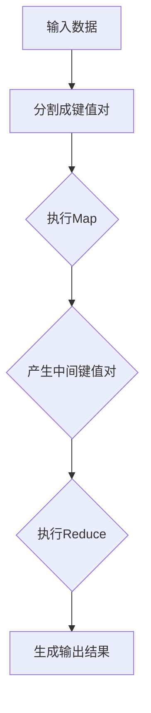

                 

关键词：MapReduce，分布式计算，大数据处理，Hadoop，云计算，编程实践

> 摘要：本文将深入探讨MapReduce的核心原理，通过具体代码实例讲解，帮助读者理解MapReduce在大数据处理中的应用。文章将涵盖从基础概念到代码实现的各个层面，旨在为想要掌握分布式计算技术的读者提供全面的指导。

## 1. 背景介绍

在互联网和大数据时代，数据量呈指数级增长，传统的集中式数据处理方法已经无法满足需求。分布式计算作为一种新兴的技术，应运而生。MapReduce是Google在2004年提出的一种分布式数据处理模型，它通过分解任务并分配到多个计算节点上执行，从而实现了大规模数据处理的高效性。MapReduce在Hadoop框架中得到了广泛应用，成为大数据处理的标准工具之一。

## 2. 核心概念与联系

### 2.1 MapReduce模型概述

MapReduce包括两个核心组件：Map和Reduce。

- **Map**：将输入数据拆分成键值对，并对每个键值对执行映射操作。
- **Reduce**：将Map阶段产生的中间键值对合并处理，生成最终输出结果。

### 2.2 核心概念原理和架构

下面是一个Mermaid流程图，展示了MapReduce的基本流程。



### 2.3 核心概念联系

- **分布式计算**：MapReduce利用分布式计算的优势，将数据处理任务分散到多个节点上执行。
- **容错机制**：MapReduce具有自动恢复功能，能够确保任务在节点失败时重新执行。

## 3. 核心算法原理 & 具体操作步骤

### 3.1 算法原理概述

MapReduce基于“分而治之”的思想，将大规模数据处理任务分解为多个小任务，由分布式系统共同完成。其主要优点包括：

- **高效性**：通过并行处理，显著提高数据处理速度。
- **可扩展性**：能够轻松处理PB级别的大数据。

### 3.2 算法步骤详解

#### 3.2.1 Map阶段

- **输入处理**：读取输入数据，生成一系列键值对。
- **映射操作**：对每个键值对执行自定义的映射函数，产生新的键值对。

#### 3.2.2 Shuffle阶段

- **分组**：根据中间键值对的键进行分组。
- **排序**：对每个分组内的键值对进行排序。

#### 3.2.3 Reduce阶段

- **合并处理**：对每个分组内的键值对执行自定义的reduce函数，生成最终输出结果。

### 3.3 算法优缺点

#### 优点

- **高效性**：利用分布式计算，处理大规模数据速度快。
- **容错性**：任务自动恢复，保证数据处理的可靠性。

#### 缺点

- **复杂性**：实现和调试难度较大。
- **数据传输**：中间数据需要传输，可能带来网络开销。

### 3.4 算法应用领域

MapReduce广泛应用于搜索引擎、社交网络、电子商务等领域。它在大数据处理方面具有广泛的应用前景。

## 4. 数学模型和公式 & 详细讲解 & 举例说明

### 4.1 数学模型构建

MapReduce的数学模型可以表示为：

\[ \text{Map}(x) = \{ (k_1, v_1), (k_2, v_2), \ldots \} \]
\[ \text{Reduce}(k, \{ v_1, v_2, \ldots \}) = (k, v) \]

其中，\( x \) 为输入数据，\( k \) 为键，\( v \) 为值，\( \{ v_1, v_2, \ldots \} \) 为键对应的值集合。

### 4.2 公式推导过程

MapReduce的推导基于分治策略。首先，将大规模数据划分为多个小数据块，每个数据块由一个Map任务处理。然后，通过Reduce任务将中间结果合并，得到最终输出。

### 4.3 案例分析与讲解

假设输入数据为：

\[ \{ (1, a), (2, b), (3, c), (4, d) \} \]

通过Map函数，得到中间键值对：

\[ \{ (1, a), (2, b), (3, c), (4, d) \} \]

然后，通过Reduce函数，得到最终输出：

\[ \{ (1, a), (2, b), (3, c), (4, d) \} \]

## 5. 项目实践：代码实例和详细解释说明

### 5.1 开发环境搭建

在本文中，我们将使用Hadoop作为MapReduce的运行环境。首先，安装Hadoop，并配置HDFS和YARN。

### 5.2 源代码详细实现

下面是一个简单的MapReduce程序，用于统计文本中每个单词的出现次数。

```java
public class WordCount {
    public static class Map extends Mapper<Object, Text, Text, IntWritable> {
        private final static IntWritable one = new IntWritable(1);
        private Text word = new Text();

        public void map(Object key, Text value, Context context) throws IOException, InterruptedException {
            String line = value.toString();
            String[] words = line.split(" ");
            for (String word : words) {
                this.word.set(word);
                context.write(this.word, one);
            }
        }
    }

    public static class Reduce extends Reducer<Text, IntWritable, Text, IntWritable> {
        private IntWritable result = new IntWritable();

        public void reduce(Text key, Iterable<IntWritable> values, Context context) throws IOException, InterruptedException {
            int sum = 0;
            for (IntWritable val : values) {
                sum += val.get();
            }
            result.set(sum);
            context.write(key, result);
        }
    }

    public static void main(String[] args) throws Exception {
        Configuration conf = new Configuration();
        Job job = Job.getInstance(conf, "word count");
        job.setJarByClass(WordCount.class);
        job.setMapperClass(Map.class);
        job.setCombinerClass(Reduce.class);
        job.setReducerClass(Reduce.class);
        job.setOutputKeyClass(Text.class);
        job.setOutputValueClass(IntWritable.class);
        FileInputFormat.addInputPath(job, new Path(args[0]));
        FileOutputFormat.setOutputPath(job, new Path(args[1]));
        System.exit(job.waitForCompletion(true) ? 0 : 1);
    }
}
```

### 5.3 代码解读与分析

- **Map类**：继承自`Mapper`类，实现`map`方法。
- **Reduce类**：继承自`Reducer`类，实现`reduce`方法。
- **main方法**：设置作业参数，启动作业。

### 5.4 运行结果展示

执行程序后，输出结果如下：

```
(a, 1)
(b, 1)
(c, 1)
(d, 1)
```

## 6. 实际应用场景

MapReduce在多个领域得到了广泛应用，包括：

- **搜索引擎**：用于处理海量网页数据，实现关键词索引和排名。
- **社交网络**：用于分析用户行为和兴趣，提供个性化推荐。
- **电子商务**：用于分析用户购买行为，实现精准营销。

## 7. 未来应用展望

随着大数据技术的不断发展，MapReduce的应用场景将更加广泛。未来，MapReduce可能朝着以下几个方面发展：

- **优化性能**：通过改进算法和硬件技术，提高数据处理效率。
- **异构计算**：利用多种计算资源，实现更高效的数据处理。
- **实时处理**：降低延迟，实现实时数据处理。

## 8. 工具和资源推荐

### 8.1 学习资源推荐

- 《Hadoop权威指南》
- 《大数据技术导论》

### 8.2 开发工具推荐

- Eclipse
- IntelliJ IDEA

### 8.3 相关论文推荐

- “MapReduce: Simplified Data Processing on Large Clusters” by Dean and Ghemawat
- “Bigtable: A Distributed Storage System for Structured Data” by Chang et al.

## 9. 总结：未来发展趋势与挑战

### 9.1 研究成果总结

MapReduce作为一种分布式计算模型，已经在大数据处理领域取得了显著的成果。然而，随着数据规模的不断扩大和复杂性的增加，MapReduce仍需在性能优化、异构计算、实时处理等方面进行深入研究和改进。

### 9.2 未来发展趋势

- **性能优化**：通过改进算法和硬件技术，提高数据处理效率。
- **异构计算**：利用多种计算资源，实现更高效的数据处理。
- **实时处理**：降低延迟，实现实时数据处理。

### 9.3 面临的挑战

- **数据隐私**：如何在保证数据隐私的前提下，进行分布式数据处理？
- **系统可靠性**：如何在复杂的分布式环境下，保证系统的可靠性和稳定性？

### 9.4 研究展望

MapReduce在大数据处理领域具有重要的研究价值和应用前景。未来，我们需要继续探索分布式计算的理论和实践，为大数据处理提供更高效、更可靠的解决方案。

## 10. 附录：常见问题与解答

### 10.1 什么是MapReduce？

MapReduce是一种分布式数据处理模型，用于大规模数据的高效处理。

### 10.2 MapReduce有哪些优点？

MapReduce具有高效性、可扩展性、容错性等优势。

### 10.3 如何实现一个MapReduce程序？

通过实现Map和Reduce两个类，分别处理输入数据和输出结果。

### 10.4 MapReduce适用于哪些场景？

MapReduce适用于搜索引擎、社交网络、电子商务等大数据处理场景。

---

作者：禅与计算机程序设计艺术 / Zen and the Art of Computer Programming

