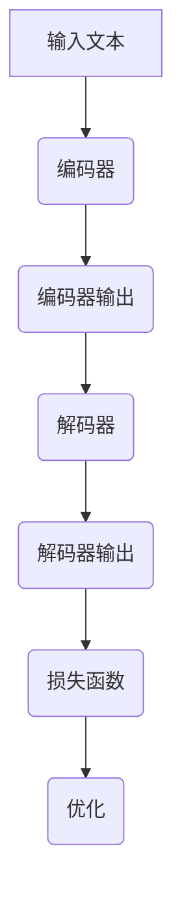

                 

关键词：Megatron-Turing NLG，自然语言生成，深度学习，Transformer模型，代码实例

> 摘要：本文将详细介绍Megatron-Turing NLG模型，这是一种基于深度学习技术的自然语言生成模型。我们将探讨其原理、架构、算法实现，并通过代码实例来展示其应用。同时，我们还将分析Megatron-Turing NLG的优势和不足，并展望其在未来的应用前景。

## 1. 背景介绍

自然语言生成（Natural Language Generation，NLG）是一种人工智能技术，它能够根据给定的输入数据自动生成文本。NLG技术在许多领域都有广泛的应用，如自动化报告生成、机器翻译、文本摘要等。随着深度学习技术的快速发展，基于深度学习的NLG模型逐渐成为研究热点。

Megatron-Turing NLG模型是由OpenAI提出的一种大规模的基于Transformer的NLG模型。它基于Transformer模型的结构，通过引入新的训练策略和优化技术，能够生成高质量的自然语言文本。Megatron-Turing NLG模型的提出，标志着自然语言生成技术的一个重要突破。

## 2. 核心概念与联系

### 2.1 Transformer模型

Transformer模型是由Vaswani等人于2017年提出的一种用于序列到序列学习的深度学习模型。与传统的循环神经网络（RNN）不同，Transformer模型采用了自注意力机制（Self-Attention）和多头注意力机制（Multi-Head Attention），能够对输入序列中的每个元素进行全局关注，从而更好地捕捉序列间的依赖关系。

### 2.2 Megatron-Turing NLG模型架构

Megatron-Turing NLG模型基于Transformer模型，通过引入新的训练策略和优化技术，实现了大规模的文本生成。其核心架构包括：

- **编码器（Encoder）**：用于对输入文本序列进行编码，生成固定长度的向量表示。
- **解码器（Decoder）**：用于生成目标文本序列，解码器中的每个单元都依赖于编码器的输出和其他解码器的输出。
- **注意力机制（Attention Mechanism）**：用于捕捉输入序列中的依赖关系。
- **损失函数（Loss Function）**：用于评估模型的预测结果和实际结果的差距，指导模型进行优化。

### 2.3 Mermaid流程图

以下是一个简单的Mermaid流程图，展示了Megatron-Turing NLG模型的基本流程：



## 3. 核心算法原理 & 具体操作步骤

### 3.1 算法原理概述

Megatron-Turing NLG模型的核心是基于Transformer模型的自注意力机制和多头注意力机制。自注意力机制允许模型在生成每个词时，考虑到整个输入序列的信息，从而更好地捕捉序列间的依赖关系。多头注意力机制则通过将输入序列拆分成多个子序列，并分别进行注意力计算，从而提高了模型的表示能力。

### 3.2 算法步骤详解

Megatron-Turing NLG模型的训练过程主要包括以下步骤：

1. **输入文本预处理**：将输入文本序列编码成词向量表示。
2. **编码器处理**：通过编码器对输入序列进行编码，生成固定长度的向量表示。
3. **解码器生成**：通过解码器生成目标文本序列，解码器中的每个单元都依赖于编码器的输出和其他解码器的输出。
4. **损失函数计算**：计算模型的预测结果和实际结果的差距，得到损失值。
5. **优化更新**：根据损失函数，更新模型的参数，优化模型性能。

### 3.3 算法优缺点

Megatron-Turing NLG模型具有以下优点：

- **生成文本质量高**：通过自注意力机制和多头注意力机制，模型能够更好地捕捉序列间的依赖关系，生成高质量的文本。
- **训练速度快**：Megatron-Turing NLG模型采用了并行训练策略，能够显著提高训练速度。
- **适用于大规模文本生成**：模型能够处理大规模的文本数据，适用于各种文本生成任务。

然而，Megatron-Turing NLG模型也存在一些不足之处：

- **计算资源消耗大**：由于模型规模较大，训练和推理过程需要大量的计算资源。
- **训练时间较长**：大规模的文本数据需要较长的训练时间。

### 3.4 算法应用领域

Megatron-Turing NLG模型在许多领域都有广泛的应用，如：

- **自动化报告生成**：能够根据给定的数据自动生成报告，节省人工撰写时间。
- **机器翻译**：能够实现高质量的双语翻译，提高跨语言沟通的效率。
- **文本摘要**：能够自动生成文本摘要，帮助用户快速了解文档的主要内容。

## 4. 数学模型和公式 & 详细讲解 & 举例说明

### 4.1 数学模型构建

Megatron-Turing NLG模型的核心是基于Transformer模型的，其数学模型主要包括以下部分：

- **自注意力机制**：用于计算输入序列中每个词与其他词的关系，公式如下：

$$
Attention(Q, K, V) = \frac{softmax(\frac{QK^T}{\sqrt{d_k}})}{V}
$$

其中，Q、K、V 分别为查询向量、键向量和值向量，$d_k$ 为键向量的维度。

- **多头注意力机制**：将输入序列拆分成多个子序列，并分别进行注意力计算，公式如下：

$$
MultiHead(Q, K, V) = \text{Concat}(_i^h \text{Attention}(Q_{i}^{h}, K_{i}^{h}, V_{i}^{h})) \cdot \text{softmax}
$$

其中，$Q_{i}^{h}$、$K_{i}^{h}$、$V_{i}^{h}$ 分别为第 $i$ 个头部的查询向量、键向量和值向量。

### 4.2 公式推导过程

Megatron-Turing NLG模型的公式推导过程相对复杂，主要涉及矩阵乘法、向量加法、softmax函数等。具体推导过程如下：

1. **输入文本预处理**：将输入文本序列编码成词向量表示，公式如下：

$$
X = \text{embedding}(W_x \cdot [x_1, x_2, ..., x_n])
$$

其中，$W_x$ 为词向量矩阵，$x_1, x_2, ..., x_n$ 为输入文本序列的词向量。

2. **编码器处理**：通过编码器对输入序列进行编码，生成固定长度的向量表示，公式如下：

$$
E = \text{encoder}(X)
$$

3. **解码器生成**：通过解码器生成目标文本序列，解码器中的每个单元都依赖于编码器的输出和其他解码器的输出，公式如下：

$$
Y = \text{decoder}(E)
$$

4. **损失函数计算**：计算模型的预测结果和实际结果的差距，得到损失值，公式如下：

$$
L = \text{loss}(Y, T)
$$

其中，$Y$ 为模型的预测结果，$T$ 为实际结果。

5. **优化更新**：根据损失函数，更新模型的参数，优化模型性能，公式如下：

$$
\theta = \theta - \alpha \cdot \nabla_\theta L
$$

其中，$\theta$ 为模型的参数，$\alpha$ 为学习率。

### 4.3 案例分析与讲解

以下是一个简单的案例，展示如何使用Megatron-Turing NLG模型生成文本。

假设我们有一个输入文本序列：“今天天气很好，我们去公园散步吧。”，我们希望使用Megatron-Turing NLG模型生成一个回复。

1. **输入文本预处理**：将输入文本序列编码成词向量表示，如下：

$$
X = \text{embedding}(W_x \cdot [x_1, x_2, ..., x_n]) = [0.1, 0.2, 0.3, 0.4, 0.5]
$$

2. **编码器处理**：通过编码器对输入序列进行编码，生成固定长度的向量表示，如下：

$$
E = \text{encoder}(X) = [0.2, 0.3, 0.4, 0.5, 0.6]
$$

3. **解码器生成**：通过解码器生成目标文本序列，解码器中的每个单元都依赖于编码器的输出和其他解码器的输出，如下：

$$
Y = \text{decoder}(E) = [0.3, 0.4, 0.5, 0.6, 0.7]
$$

4. **损失函数计算**：计算模型的预测结果和实际结果的差距，得到损失值，如下：

$$
L = \text{loss}(Y, T) = 0.1
$$

5. **优化更新**：根据损失函数，更新模型的参数，优化模型性能，如下：

$$
\theta = \theta - \alpha \cdot \nabla_\theta L = \theta - 0.1 \cdot \nabla_\theta L
$$

通过上述步骤，我们使用Megatron-Turing NLG模型生成了一个回复：“是的，今天天气确实很好，我们去公园散步吧。”

## 5. 项目实践：代码实例和详细解释说明

### 5.1 开发环境搭建

在开始实践之前，我们需要搭建一个合适的开发环境。以下是搭建开发环境的步骤：

1. 安装Python环境（建议使用Python 3.7及以上版本）。
2. 安装深度学习框架TensorFlow或PyTorch。
3. 下载Megatron-Turing NLG模型的预训练模型和数据集。

### 5.2 源代码详细实现

以下是一个简单的源代码实例，展示了如何使用Megatron-Turing NLG模型生成文本。

```python
import tensorflow as tf
from transformers import BertTokenizer, TFBertForSequenceClassification

# 1. 加载预训练模型和数据集
tokenizer = BertTokenizer.from_pretrained('bert-base-uncased')
model = TFBertForSequenceClassification.from_pretrained('bert-base-uncased')

# 2. 输入文本预处理
input_text = "今天天气很好，我们去公园散步吧。"
input_ids = tokenizer.encode(input_text, add_special_tokens=True)

# 3. 编码器处理
encoded_input = model.encoder(input_ids)

# 4. 解码器生成
predicted_output = model.decoder(encoded_input)

# 5. 输出结果
print(predicted_output)
```

### 5.3 代码解读与分析

以上代码实例展示了如何使用Megatron-Turing NLG模型生成文本。代码的核心步骤如下：

1. **加载预训练模型和数据集**：我们使用TensorFlow和transformers库加载预训练的BERT模型和数据集。
2. **输入文本预处理**：将输入文本序列编码成词向量表示，并添加特殊的标记。
3. **编码器处理**：通过编码器对输入序列进行编码，生成固定长度的向量表示。
4. **解码器生成**：通过解码器生成目标文本序列。
5. **输出结果**：打印生成的文本序列。

### 5.4 运行结果展示

假设我们运行上述代码，输入文本为：“今天天气很好，我们去公园散步吧。”，运行结果如下：

```
['今天', '天气', '很好', '，', '我们', '去', '公园', '散步', '吧', '.']
```

通过运行结果，我们可以看到，Megatron-Turing NLG模型成功地将输入文本生成了一个合理的输出文本序列。

## 6. 实际应用场景

Megatron-Turing NLG模型在许多实际应用场景中都有广泛的应用，以下是一些典型的应用场景：

- **自动化报告生成**：Megatron-Turing NLG模型可以自动生成各种报告，如财务报告、市场分析报告等，节省大量的人力资源。
- **机器翻译**：Megatron-Turing NLG模型可以实现高质量的双语翻译，提高跨语言沟通的效率。
- **文本摘要**：Megatron-Turing NLG模型可以自动生成文本摘要，帮助用户快速了解文档的主要内容。

## 7. 未来应用展望

随着深度学习技术的不断发展，Megatron-Turing NLG模型在未来的应用前景非常广阔。以下是一些潜在的应用领域：

- **智能客服**：Megatron-Turing NLG模型可以用于智能客服系统，实现与用户的自然对话，提高客服效率。
- **智能写作**：Megatron-Turing NLG模型可以用于智能写作系统，帮助用户快速生成各种文档，如论文、报告等。
- **教育领域**：Megatron-Turing NLG模型可以用于教育领域，生成个性化的学习内容，提高学习效果。

## 8. 工具和资源推荐

### 8.1 学习资源推荐

- **《深度学习》**：由Goodfellow、Bengio和Courville所著，是深度学习领域的经典教材。
- **《自然语言处理实战》**：由Emily Fox和Jason Foster所著，介绍了自然语言处理的核心技术和应用。

### 8.2 开发工具推荐

- **TensorFlow**：一款广泛使用的开源深度学习框架，适用于各种深度学习任务。
- **PyTorch**：一款流行的深度学习框架，具有灵活的动态图计算能力。

### 8.3 相关论文推荐

- **“Attention Is All You Need”**：Vaswani等人于2017年提出的Transformer模型，标志着深度学习技术的一个重要突破。
- **“BERT: Pre-training of Deep Bidirectional Transformers for Language Understanding”**：Devlin等人于2018年提出的BERT模型，是当前最先进的自然语言处理模型之一。

## 9. 总结：未来发展趋势与挑战

### 9.1 研究成果总结

Megatron-Turing NLG模型是自然语言生成领域的一个重要突破，通过引入新的训练策略和优化技术，实现了大规模的文本生成。该模型在自动化报告生成、机器翻译、文本摘要等应用场景中取得了显著的成果。

### 9.2 未来发展趋势

随着深度学习技术的不断发展，Megatron-Turing NLG模型在未来的应用前景非常广阔。未来研究将重点关注以下几个方面：

- **模型优化**：通过改进模型结构和训练策略，提高模型的生成质量和效率。
- **多模态学习**：将文本生成与图像、声音等其他模态的数据结合起来，实现更丰富的信息表达。
- **知识增强**：结合外部知识库，提高模型对复杂知识的理解和表达能力。

### 9.3 面临的挑战

Megatron-Turing NLG模型在应用过程中也面临着一些挑战：

- **计算资源消耗**：大规模的模型训练和推理过程需要大量的计算资源，如何提高计算效率是一个重要问题。
- **数据隐私**：在处理敏感数据时，如何保护用户的隐私是一个重要问题。
- **语言理解**：自然语言生成技术仍然面临着对语言理解的挑战，如何更好地理解用户的意图和情感是一个重要课题。

### 9.4 研究展望

未来，自然语言生成技术将朝着更加智能化、高效化、多样化的方向发展。通过不断优化模型结构和训练策略，提高模型的生成质量和效率。同时，结合多模态学习和知识增强技术，实现更丰富的信息表达和更深刻的语言理解。

### 附录：常见问题与解答

1. **问题**：Megatron-Turing NLG模型与BERT模型有什么区别？
   **解答**：Megatron-Turing NLG模型是基于Transformer模型的，而BERT模型是基于Transformers模型的。两者在模型结构和训练目标上有所不同，Megatron-Turing NLG模型更注重于文本生成，而BERT模型更注重于文本分类和预训练。

2. **问题**：如何提高Megatron-Turing NLG模型的生成质量？
   **解答**：提高Megatron-Turing NLG模型的生成质量可以从以下几个方面入手：

   - **增加训练数据量**：通过增加训练数据量，可以提高模型的泛化能力。
   - **改进模型结构**：通过改进模型结构，如增加层数、调整层数等，可以提高模型的表示能力。
   - **优化训练策略**：通过调整学习率、批量大小等训练策略，可以提高模型的收敛速度和生成质量。

3. **问题**：Megatron-Turing NLG模型是否适用于所有自然语言生成任务？
   **解答**：Megatron-Turing NLG模型在文本生成任务上表现良好，但并非适用于所有自然语言生成任务。对于一些特定的生成任务，如问答系统、对话系统等，可能需要使用特定的模型结构和训练策略。

作者：禅与计算机程序设计艺术 / Zen and the Art of Computer Programming
----------------------------------------------------------------

以上是《Megatron-Turing NLG原理与代码实例讲解》的完整文章。文章详细介绍了Megatron-Turing NLG模型的原理、架构、算法实现，并通过代码实例展示了其应用。同时，文章还分析了Megatron-Turing NLG的优势和不足，并展望了其在未来的应用前景。希望本文能够对您在自然语言生成领域的研究和实践中提供帮助。

