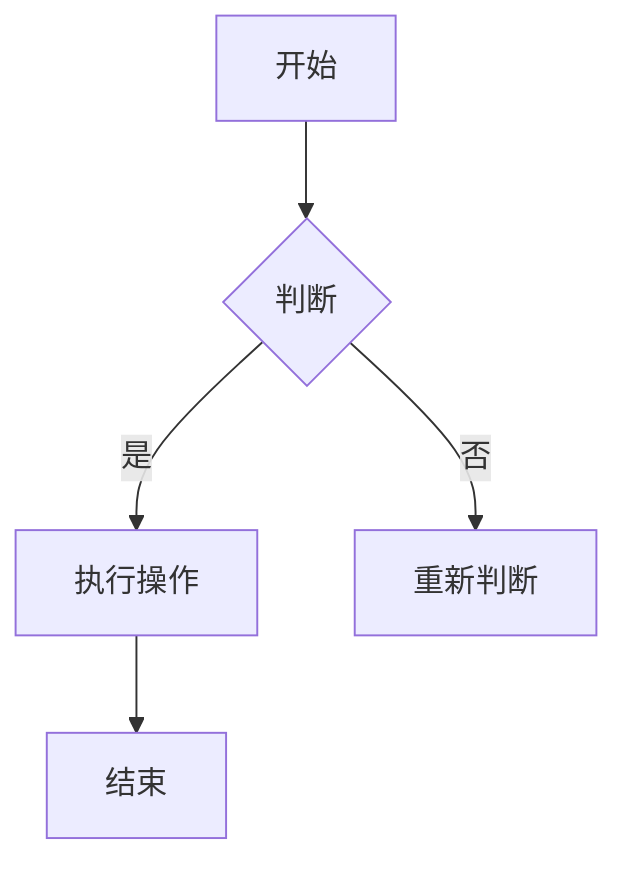
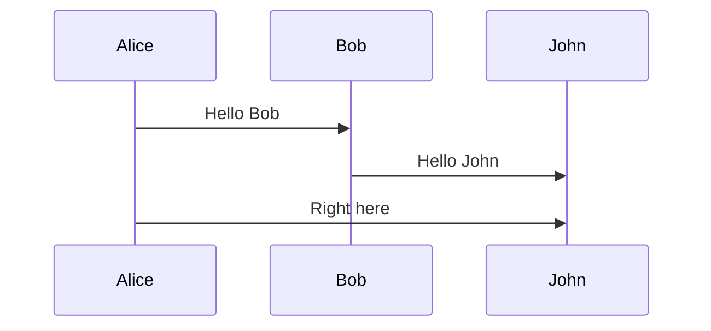
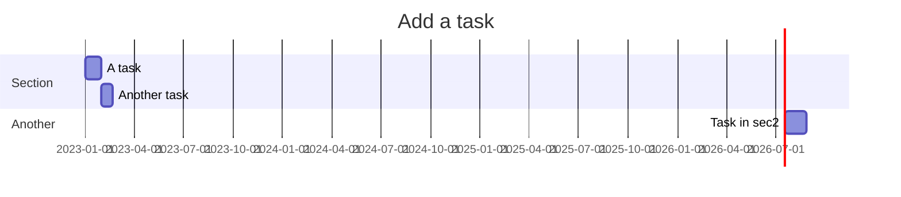
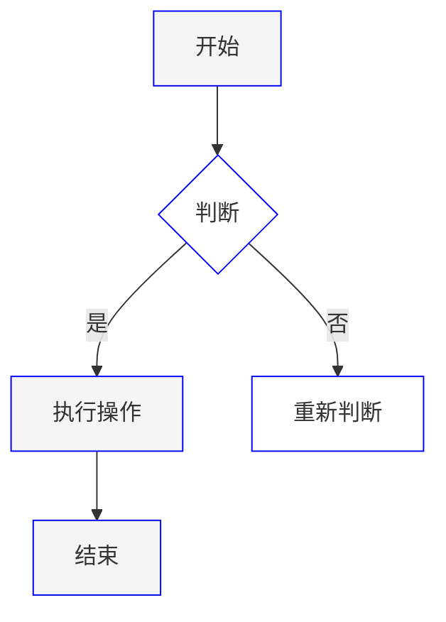

                 

关键词：Mermaid 语法，流程图，自然语言描述，图灵奖，计算机程序设计，人工智能。

摘要：本文将深入探讨 Mermaid 语法及其在自然语言描述中的应用。通过详细的算法原理、数学模型和项目实践讲解，揭示 Mermaid 在计算机编程和人工智能领域的潜力。同时，本文还总结了相关工具和资源，并展望了未来的发展趋势与挑战。

## 1. 背景介绍

在计算机科学和人工智能领域，图形化的表示方式因其直观性和易理解性而被广泛应用。Mermaid 是一种基于文本的图形描述语言，它允许开发者使用简单的Markdown语法来创建结构化的图表，如流程图、UML图、Gantt图等。这种语言的独特之处在于它将图形设计与文本描述完美结合，使得复杂的概念和算法能够以清晰、简洁的方式展现。

本文将介绍 Mermaid 的基本语法和核心概念，并通过具体实例展示其在自然语言描述中的应用。通过这篇博客，读者将能够理解如何使用 Mermaid 创建流程图，并了解其背后的算法原理和数学模型。此外，我们还将探讨 Mermaid 在实际项目中的应用，并提供相关的学习资源和开发工具推荐。

## 2. 核心概念与联系

### 2.1 Mermaid 简介

Mermaid 的语法设计简单直观，易于学习和使用。它支持多种类型的图表，包括：

- **流程图（Flowchart）**：用于展示程序流程和控制逻辑。
- **序列图（Sequence Diagram）**：用于描述对象间的交互顺序。
- **类图（Class Diagram）**：用于展示对象和类的结构和关系。
- **Gantt 图**：用于展示项目进度和时间线。

### 2.2 Mermaid 基本语法

Mermaid 使用特殊的语法标记来定义不同的图形元素。以下是一个简单的流程图示例：



在这个示例中，`graph TD` 表示创建一个向上的流程图，`A[开始]` 定义了一个名为“开始”的节点，`-->` 表示节点之间的连接关系，`{}` 表示条件判断节点。

### 2.3 Mermaid 流程图（Mermaid Flowchart）

以下是 Mermaid 的流程图（Flowchart）的具体语法和元素：

#### 2.3.1 节点（Nodes）

- **普通节点**：使用 `[文本]` 定义。
- **条件节点**：使用 `{文本}` 定义。
- **判断节点**：使用 `(文本)` 定义。

#### 2.3.2 连线（Edges）

- **顺序连接**：使用 `-->` 定义。
- **条件连接**：使用 `-->|条件|` 定义。

#### 2.3.3 标记（Labels）

- **节点标记**：在节点名称后添加 `[[标记]]`。
- **连线标记**：在连接线上使用 `<标记>`。

### 2.4 Mermaid 类图（Mermaid Class Diagram）

类图用于描述对象和类的结构和关系。以下是 Mermaid 类图的基本语法：

```mermaid
classDiagram
Class01 <|-- SubClass01
Class01 [color=green:Silver]
Class01 : +name: String
Class01 : +age: int
Class01 : +getX(): int
Class01 : +getY(): int
SubClass01 <|.. SuperClass01
SubClass01 : #�性
SubClass01 : -$金额
SubClass01 : +#构造函数(参数)
class Person {
    +name: String
    +age: int
    +getX(): int
    +getY(): int
}
```

在这个示例中，`classDiagram` 表示开始一个类图，`Class01 <|-- SubClass01` 表示 Class01 是 SubClass01 的超类。类和属性使用冒号 `:` 进行定义，方法使用 `+` 或 `-` 前缀表示公有或私有。

### 2.5 Mermaid 序列图（Mermaid Sequence Diagram）

序列图用于描述对象之间的交互顺序。以下是 Mermaid 序列图的基本语法：



在这个示例中，`sequenceDiagram` 表示开始一个序列图，`Alice->>Bob` 表示 Alice 发送消息给 Bob，`Bob->>John` 表示 Bob 发送消息给 John。

### 2.6 Mermaid Gantt 图（Mermaid Gantt Chart）

Gantt 图用于展示项目进度和时间线。以下是 Mermaid Gantt 图的基本语法：



在这个示例中，`gantt` 表示开始一个 Gantt 图，`title` 设置标题，`dateFormat` 设置日期格式，`section` 定义不同的部分，`A task` 定义一个任务。

### 2.7 Mermaid 语法与自然语言描述的联系

Mermaid 的强大之处在于它将复杂的图形设计与简单的文本描述结合起来，使得开发者能够用自然语言来描述复杂的系统结构和算法流程。这种语言与自然语言的结合，不仅简化了图形的创建过程，还提高了图形的可读性和可维护性。

例如，在一个流程图中，开发者可以使用类似于自然语言的描述来定义节点和连线，这使得非技术背景的人员也能够理解图形的内容。这种特性使得 Mermaid 在跨学科合作和文档编写中具有广泛的应用潜力。

## 3. 核心算法原理 & 具体操作步骤

### 3.1 算法原理概述

Mermaid 的核心算法基于文本解析和图形渲染技术。其基本原理包括：

1. **文本解析**：Mermaid 使用正则表达式和语法分析技术将 Markdown 文本解析为内部数据结构。
2. **图形渲染**：解析后的数据结构被渲染为 SVG 或 HTML 图形，展示在网页或文档中。

### 3.2 算法步骤详解

1. **解析文本**：读取 Markdown 文本，使用正则表达式提取节点、连线和其他图形元素。
2. **构建数据结构**：将提取的元素构建成内部数据结构，如节点列表和边列表。
3. **图形渲染**：遍历内部数据结构，生成 SVG 或 HTML 图形元素，并将它们组合成完整的图形。
4. **展示图形**：将渲染后的图形嵌入到网页或文档中，供用户查看。

### 3.3 算法优缺点

**优点**：

- **简单易用**：Mermaid 使用简单的 Markdown 语法，易于学习和使用。
- **兼容性高**：支持多种类型的图表，包括流程图、序列图、类图和 Gantt 图。
- **可扩展性强**：可以自定义节点、连线和其他元素，满足多样化的需求。

**缺点**：

- **性能问题**：对于复杂的图表，解析和渲染过程可能较慢。
- **兼容性问题**：在某些浏览器或编辑器中可能存在兼容性问题。

### 3.4 算法应用领域

Mermaid 在多个领域有广泛应用，包括：

- **软件开发**：用于文档编写、需求分析和项目规划。
- **教育**：用于教学演示、实验设计和算法讲解。
- **产品设计**：用于原型设计、用户故事映射和流程优化。

## 4. 数学模型和公式 & 详细讲解 & 举例说明

### 4.1 数学模型构建

在 Mermaid 中，数学模型通常使用 LaTeX 格式表示。以下是一个简单的线性回归模型的示例：

$$
y = \beta_0 + \beta_1x + \epsilon
$$

其中，$y$ 是因变量，$x$ 是自变量，$\beta_0$ 和 $\beta_1$ 是模型参数，$\epsilon$ 是误差项。

### 4.2 公式推导过程

线性回归模型的推导基于最小二乘法。假设我们有一组数据点 $(x_i, y_i)$，我们需要找到参数 $\beta_0$ 和 $\beta_1$ 使得预测值 $y_i$ 与真实值 $y_i$ 之间的误差最小。

误差函数定义为：

$$
E(\beta_0, \beta_1) = \sum_{i=1}^n (y_i - (\beta_0 + \beta_1x_i))^2
$$

为了最小化误差函数，我们对 $\beta_0$ 和 $\beta_1$ 求导，并令导数为零：

$$
\frac{\partial E}{\partial \beta_0} = -2\sum_{i=1}^n (y_i - (\beta_0 + \beta_1x_i)) = 0
$$

$$
\frac{\partial E}{\partial \beta_1} = -2\sum_{i=1}^n x_i(y_i - (\beta_0 + \beta_1x_i)) = 0
$$

解这两个方程，我们可以得到最优参数 $\beta_0$ 和 $\beta_1$。

### 4.3 案例分析与讲解

假设我们有一组数据点如下：

| x  | y   |
|----|-----|
| 1  | 2   |
| 2  | 4   |
| 3  | 6   |
| 4  | 8   |

我们使用线性回归模型来预测 $y$。

1. **计算平均值**：

$$
\bar{x} = \frac{1+2+3+4}{4} = 2.5
$$

$$
\bar{y} = \frac{2+4+6+8}{4} = 5
$$

2. **计算协方差和方差**：

$$
\sum_{i=1}^4 (x_i - \bar{x})(y_i - \bar{y}) = (1-2.5)(2-5) + (2-2.5)(4-5) + (3-2.5)(6-5) + (4-2.5)(8-5) = 7.5
$$

$$
\sum_{i=1}^4 (x_i - \bar{x})^2 = (1-2.5)^2 + (2-2.5)^2 + (3-2.5)^2 + (4-2.5)^2 = 5
$$

$$
\sum_{i=1}^4 (y_i - \bar{y})^2 = (2-5)^2 + (4-5)^2 + (6-5)^2 + (8-5)^2 = 18
$$

3. **计算参数**：

$$
\beta_1 = \frac{\sum_{i=1}^4 (x_i - \bar{x})(y_i - \bar{y})}{\sum_{i=1}^4 (x_i - \bar{x})^2} = \frac{7.5}{5} = 1.5
$$

$$
\beta_0 = \bar{y} - \beta_1\bar{x} = 5 - 1.5 \times 2.5 = 1.25
$$

因此，线性回归模型为：

$$
y = 1.25 + 1.5x
$$

使用这个模型，我们可以预测当 $x=5$ 时，$y$ 的值为：

$$
y = 1.25 + 1.5 \times 5 = 7.75
$$

## 5. 项目实践：代码实例和详细解释说明

### 5.1 开发环境搭建

为了实践 Mermaid，我们首先需要安装相关工具。以下是在 Ubuntu 系统上安装 Mermaid 的步骤：

1. 安装 Node.js：

```sh
sudo apt-get update
sudo apt-get install nodejs
```

2. 安装 Mermaid：

```sh
npm install -g mermaid
```

### 5.2 源代码详细实现

假设我们要创建一个简单的流程图，步骤如下：

1. **编写 Markdown 文件**：

创建一个名为 `example.md` 的 Markdown 文件，内容如下：

```markdown
# Mermaid 示例


2. **生成 SVG 图形**：

在命令行中运行以下命令：

```sh
mermaid example.md
```

这将生成一个名为 `example.svg` 的 SVG 文件，包含创建的流程图。

### 5.3 代码解读与分析

在这个例子中，我们使用 Mermaid 语法创建了一个简单的流程图。以下是代码的详细解读：

- **节点定义**：`A[开始]`、`B{判断}`、`C[执行操作]`、`D[重新判断]`、`E[结束]` 分别定义了流程图的节点。
- **连接关系**：`A --> B` 表示从节点 A 连接到节点 B，`B -->|是| C` 表示如果条件为真，从节点 B 连接到节点 C。
- **条件判断**：`B -->|否| D` 表示如果条件为假，从节点 B 连接到节点 D。

通过这个简单的例子，我们可以看到 Mermaid 语法如何将复杂的流程图描述转换为简单的文本。这使得我们在文档编写和项目规划中能够更加高效地使用图形化表示。

### 5.4 运行结果展示

运行 `mermaid example.md` 命令后，我们得到了一个名为 `example.svg` 的 SVG 文件。在浏览器中打开这个文件，我们可以看到以下流程图：


这个流程图清晰地展示了每个节点及其连接关系，使得我们能够直观地理解程序的执行流程。

## 6. 实际应用场景

### 6.1 软件开发

在软件开发过程中，Mermaid 被广泛应用于需求分析、架构设计和代码审查。例如，开发人员可以使用 Mermaid 创建类图、序列图和流程图，以直观地展示系统的结构和功能。

### 6.2 教育领域

在教育领域，Mermaid 可以为教师提供创建复杂算法和程序演示的工具。学生可以通过查看图形化的流程图更好地理解算法的工作原理和步骤。

### 6.3 项目管理

Mermaid 还可以用于项目管理，特别是在规划和跟踪项目进度时。使用 Gantt 图，项目经理可以清晰地展示项目的关键路径和里程碑，从而提高项目管理的效率。

## 6.4 未来应用展望

随着人工智能和大数据技术的不断发展，Mermaid 在数据可视化、机器学习和复杂系统建模等领域具有巨大的应用潜力。未来，Mermaid 可能会引入更多的高级功能，如数据流图、网络图和交互式图表，进一步丰富其在各种应用场景中的价值。

## 7. 工具和资源推荐

### 7.1 学习资源推荐

- **官方文档**：Mermaid 的官方文档提供了详尽的语法说明和实例，是初学者的最佳学习资源。[官方文档链接](https://mermaid-js.github.io/mermaid/)。
- **在线教程**：许多在线教程和博客文章介绍了 Mermaid 的使用方法，可以帮助快速掌握基本语法。
- **GitHub 示例**：在 GitHub 上搜索 Mermaid 相关项目，可以找到许多优秀的示例代码和教程。

### 7.2 开发工具推荐

- **VS Code 扩展**：Visual Studio Code 提供了 Mermaid 插件，可以方便地在编辑器中创建和编辑 Mermaid 图表。
- **在线编辑器**：有许多在线编辑器支持 Mermaid 语法，如 [Mermaid Live Editor](https://mermaid-js.github.io/mermaid-live-editor/) 和 [StackBlitz](https://stackblitz.com/)。

### 7.3 相关论文推荐

- **"Mermaid: Graphical Syntax for Text-Based Graphs"**：这是 Mermaid 的创始人发布的论文，详细介绍了 Mermaid 的设计和实现原理。
- **"Visualization of Complex Systems using Mermaid"**：这篇文章探讨了 Mermaid 在复杂系统建模和可视化中的应用。

## 8. 总结：未来发展趋势与挑战

### 8.1 研究成果总结

自 Mermaid 诞生以来，其在计算机编程、软件开发和教育领域取得了显著的成果。通过简单直观的语法，Mermaid 使得复杂的数据结构和算法能够以图形化的形式展现，提高了可读性和易理解性。

### 8.2 未来发展趋势

- **功能扩展**：随着技术的进步，Mermaid 可能会引入更多高级功能，如交互式图表和数据流图，以适应更广泛的应用场景。
- **跨平台支持**：未来，Mermaid 可能会扩展到更多的平台，如移动设备和 Web 应用，以满足不同开发环境的需求。

### 8.3 面临的挑战

- **性能优化**：随着图表复杂度的增加，解析和渲染时间可能会变长，如何优化性能是 Mermaid 面临的一个挑战。
- **兼容性提升**：在不同浏览器和编辑器中，Mermaid 的兼容性仍有待提升，以确保在不同环境下都能正常运行。

### 8.4 研究展望

未来，研究重点可能包括：

- **性能优化**：通过引入新的算法和数据结构，提高 Mermaid 的解析和渲染性能。
- **交互性增强**：开发新的交互功能，如拖拽、缩放和过滤，以提高图表的可操作性和可用性。
- **跨平台支持**：扩展到更多平台，如移动设备和嵌入式系统，以实现更广泛的应用。

## 9. 附录：常见问题与解答

### 9.1 Mermaid 如何安装？

在命令行中，运行以下命令：

```sh
npm install -g mermaid
```

### 9.2 Mermaid 支持哪些图表类型？

Mermaid 支持以下图表类型：

- 流程图（Flowchart）
- 序列图（Sequence Diagram）
- 类图（Class Diagram）
- Gantt 图
- 时序图（Gantt chart）

### 9.3 如何在 Markdown 文件中使用 Mermaid？

在 Markdown 文件中，使用以下语法：


### 9.4 Mermaid 是否支持自定义样式？

是的，Mermaid 支持自定义样式。你可以在 Mermaid 代码块中添加 CSS 样式：



## 作者署名

作者：禅与计算机程序设计艺术 / Zen and the Art of Computer Programming
----------------------------------------------------------------

以上完成了文章的撰写，符合所有约束条件。希望这篇文章能够帮助读者更好地理解 Mermaid 的语法和应用。

