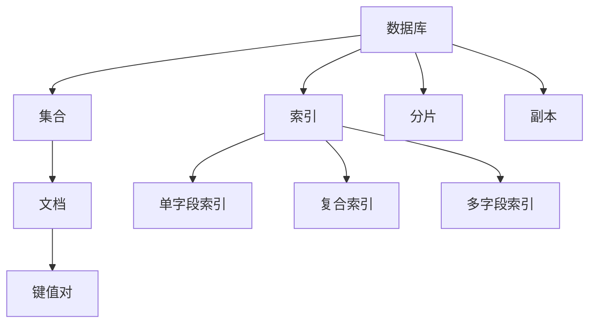
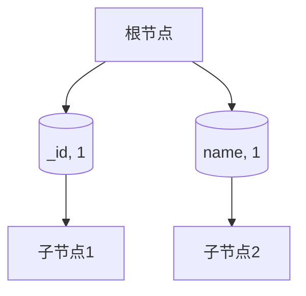

                 

在当今信息化时代，数据管理变得尤为重要。MongoDB，作为一种流行的NoSQL数据库，因其灵活的文档模型、高效的查询性能和强大的扩展能力，被广泛应用于各种场景。本文将围绕MongoDB的核心概念、存储和检索数据的方法、数学模型、项目实践以及未来发展趋势等方面进行深入探讨。

## 关键词

- MongoDB
- 数据库管理
- 文档模型
- 查询性能
- 扩展能力

## 摘要

本文首先介绍了MongoDB的基本概念和历史背景，然后详细阐述了其文档模型的原理和特点。接着，我们探讨了MongoDB在存储和检索数据方面的优势，并介绍了其数学模型和公式。文章通过一个实际的项目实践案例，展示了MongoDB在现实世界中的应用。最后，我们对MongoDB的未来发展趋势进行了展望，并提出了可能面临的挑战。

## 1. 背景介绍

### MongoDB的基本概念

MongoDB是一个开源的、分布式、高性能的NoSQL数据库，它由10gen公司（后更名为MongoDB公司）于2009年推出。MongoDB的设计灵感来自于Google的BigTable和Amazon的SimpleDB，它采用了文档存储模型，以JSON格式存储数据，提供了强大的查询功能和高扩展性。

MongoDB具有以下特点：

- **灵活的文档模型**：MongoDB使用BSON（Binary JSON）格式存储文档，每个文档都可以有不同的字段，这使得它非常适合处理复杂的数据结构。
- **高扩展性**：MongoDB支持水平扩展，可以通过分片（sharding）技术将数据分布到多个节点上，从而提高性能和可扩展性。
- **高性能**：MongoDB使用内存映射文件系统（MMFS）来提高数据访问速度，并且其查询引擎优化了索引和聚合操作，提供了高效的查询性能。
- **强大的文档更新和替换功能**：MongoDB提供了原子操作来处理文档的更新和替换，确保数据的一致性。

### MongoDB的历史背景

MongoDB的诞生可以追溯到2007年，当时10gen公司的创始人Evan Weaver和 Dwight Merriman（同时也是Python和Django框架的创始人之一）意识到需要一种不同于传统关系型数据库的新型数据库，以满足互联网应用的需求。经过多年的研发，MongoDB于2009年正式发布。

自发布以来，MongoDB受到了广泛的关注，并迅速在开发社区中取得了成功。根据2021年的调查，MongoDB已成为最受欢迎的NoSQL数据库之一，其市场份额超过30%。许多知名企业，如MetLife、eBay和Intuit等，都已经将其作为核心的数据存储解决方案。

## 2. 核心概念与联系

### MongoDB的核心概念

MongoDB的核心概念包括文档、集合、数据库、索引、分片和副本等。以下是这些概念的定义和相互关系：

- **文档**：文档是MongoDB中最基本的存储单元，类似于关系型数据库中的行。每个文档都是一个BSON对象，由一系列键值对组成。文档可以包含各种数据类型，如字符串、数字、布尔值、数组等。

- **集合**：集合是文档的容器，类似于关系型数据库中的表。每个集合都有自己的命名空间，因此可以在同一数据库中拥有多个集合。

- **数据库**：数据库是集合的容器，类似于关系型数据库中的数据库。MongoDB允许用户创建多个数据库，每个数据库都有自己的集合和配置。

- **索引**：索引是一种特殊的数据结构，用于加速查询。MongoDB支持多种索引类型，包括单字段索引、复合索引和多字段索引。

- **分片**：分片是将数据分布在多个节点上的一种技术，以提高性能和扩展性。分片的关键是选择适当的分片键，以便数据能够均匀分布。

- **副本**：副本是一种数据复制技术，用于提高数据可用性和容错能力。MongoDB支持主-从复制，其中主节点负责处理写操作，而从节点负责处理读操作。

### MongoDB的架构

MongoDB的架构主要包括以下组件：

- **MongoDB Shell**：MongoDB Shell是一个交互式命令行工具，用于与MongoDB实例进行通信。用户可以使用MongoDB Shell执行各种数据库操作，如插入、查询、更新和删除文档。

- **mongod**：mongod是一个后台进程，负责处理数据库的读写操作。每个MongoDB实例都运行一个mongod进程。

- **mongos**：mongos是一个路由进程，用于处理查询并将查询路由到适当的mongod实例上。mongos通常用于分片集群。

- **配置服务器**：配置服务器（config server）是一个特殊的mongod实例，用于存储集群配置数据，如副本集成员信息和分片策略。

### MongoDB的核心概念原理和架构的 Mermaid 流程图



## 3. 核心算法原理 & 具体操作步骤

### 3.1 算法原理概述

MongoDB的核心算法主要包括文档存储、查询优化、索引构建和分片管理等。以下是这些算法的基本原理：

- **文档存储**：MongoDB使用BSON格式存储文档，每个文档都是一个有序的键值对序列。文档的存储方式使得数据访问和修改非常灵活。
- **查询优化**：MongoDB使用查询优化器来选择最佳的查询执行计划。查询优化器会根据索引策略和查询条件来选择索引和查询路径。
- **索引构建**：MongoDB支持多种索引类型，包括单字段索引、复合索引和多字段索引。索引的构建是为了提高查询效率。
- **分片管理**：MongoDB使用分片技术来处理海量数据。分片管理算法负责选择合适的分片键和分片策略，以实现数据的均匀分布和高效的读写操作。

### 3.2 算法步骤详解

#### 3.2.1 文档存储步骤

1. **解析文档**：MongoDB首先解析BSON格式的文档，将其转换为内部表示。
2. **验证文档**：MongoDB验证文档的格式和类型，确保文档符合数据库的规则。
3. **存储文档**：MongoDB将文档存储在磁盘上，通常使用内存映射文件系统（MMFS）来提高存储性能。

#### 3.2.2 查询优化步骤

1. **解析查询**：MongoDB解析查询语句，将其转换为内部表示。
2. **索引选择**：查询优化器根据查询条件和索引信息选择最佳的索引。
3. **查询执行**：MongoDB执行查询，根据选择的索引和查询路径来访问数据。

#### 3.2.3 索引构建步骤

1. **选择索引键**：根据查询需求选择合适的索引键。
2. **创建索引**：MongoDB使用B树索引结构来创建索引，并将索引信息存储在磁盘上。
3. **优化索引**：MongoDB定期对索引进行优化，以提高查询效率。

#### 3.2.4 分片管理步骤

1. **选择分片键**：根据数据特点和查询需求选择合适的分片键。
2. **创建分片**：MongoDB将数据分片到多个节点上，实现数据的均匀分布。
3. **分片复制**：MongoDB通过副本技术来提高数据的可用性和容错能力。

### 3.3 算法优缺点

#### 优点

- **灵活的文档模型**：MongoDB的文档模型非常灵活，可以存储复杂的数据结构，提高了数据存储和访问的效率。
- **高效的查询性能**：MongoDB使用索引和查询优化技术，提供了高效的查询性能，适用于大规模数据场景。
- **高扩展性**：MongoDB支持水平扩展，可以通过分片技术将数据分布到多个节点上，提高了系统的性能和可扩展性。
- **强大的复制和分片功能**：MongoDB支持主-从复制和分片技术，提高了数据的高可用性和容错能力。

#### 缺点

- **不适合事务处理**：MongoDB不适合处理复杂的事务，特别是在多个文档之间需要强一致性时。
- **性能瓶颈**：MongoDB在写入密集型场景下可能会出现性能瓶颈，特别是在使用复合索引时。
- **复杂的管理**：MongoDB的管理相对复杂，需要专业的知识和技能。

### 3.4 算法应用领域

MongoDB的应用领域非常广泛，主要包括以下场景：

- **互联网应用**：MongoDB适用于高并发、高扩展性的互联网应用，如电商、社交媒体和在线游戏等。
- **大数据分析**：MongoDB可以作为大数据分析的数据存储解决方案，适用于实时分析和处理海量数据。
- **物联网**：MongoDB可以处理物联网设备生成的大量数据，支持物联网应用的实时监控和分析。
- **金融科技**：MongoDB适用于金融科技领域的交易记录存储和查询，提供高效的数据存储和访问。

## 4. 数学模型和公式 & 详细讲解 & 举例说明

### 4.1 数学模型构建

MongoDB中的数学模型主要包括文档模型、索引模型和分片模型。以下是这些模型的构建和基本公式。

#### 文档模型

- **文档表示**：文档可以表示为一个BSON对象，其内部表示为键值对。
- **文档存储公式**：\( D = \{ K_1 : V_1, K_2 : V_2, \dots, K_n : V_n \} \)

#### 索引模型

- **索引表示**：索引可以表示为一个B树结构，其中每个节点都包含一个键值对和一个指向子节点的指针。
- **索引存储公式**：\( I = \{ (K_1, P_1), (K_2, P_2), \dots, (K_n, P_n) \} \)

#### 分片模型

- **分片表示**：分片可以表示为一个数据分布函数，用于将数据分布到多个节点上。
- **分片存储公式**：\( S = f(D) \)

### 4.2 公式推导过程

#### 文档模型推导

1. **文档表示**：给定一个文档\( D \)，其内部表示为键值对序列。
2. **文档存储公式**：由于文档的每个键值对都是有序的，我们可以使用一个映射函数将其表示为BSON对象。

#### 索引模型推导

1. **索引表示**：给定一个索引\( I \)，其内部表示为B树结构。
2. **索引存储公式**：由于B树是一种自平衡树，我们可以使用一个映射函数将其表示为一个有序列表。

#### 分片模型推导

1. **分片表示**：给定一个分片键\( K \)，其内部表示为一个数据分布函数。
2. **分片存储公式**：由于分片键可以表示为一个区间，我们可以使用一个映射函数将其表示为多个节点。

### 4.3 案例分析与讲解

#### 文档模型案例

假设有一个文档\( D \)如下：

```json
{
  "_id" : ObjectId("5f76a2a5e765f2b5a6c0a321"),
  "name" : "张三",
  "age" : 25,
  "email" : "zhangsan@example.com"
}
```

我们可以将其表示为BSON对象：

```json
{
  "K_1" : "name",
  "V_1" : "张三",
  "K_2" : "age",
  "V_2" : 25,
  "K_3" : "email",
  "V_3" : "zhangsan@example.com"
}
```

#### 索引模型案例

假设有一个索引\( I \)如下：

```json
{
  "_id" : 1,
  "name" : 1
}
```

我们可以将其表示为B树结构：



#### 分片模型案例

假设有一个分片键\( K \)如下：

```json
{
  "_id" : ObjectId("5f76a2a5e765f2b5a6c0a321"),
  "shardKey" : "name"
}
```

我们可以将其表示为数据分布函数：

```json
{
  "name" : "张三",
  "shard" : "node1"
}
{
  "name" : "李四",
  "shard" : "node2"
}
```

## 5. 项目实践：代码实例和详细解释说明

### 5.1 开发环境搭建

在开始实践之前，我们需要搭建一个MongoDB的开发环境。以下是搭建步骤：

1. **安装MongoDB**：在Windows、Linux或Mac OS上安装MongoDB，可以从官方下载页面下载相应的安装包。
2. **配置MongoDB**：配置MongoDB的安装路径、端口、副本集和分片等参数，确保其可以正常运行。
3. **启动MongoDB**：启动MongoDB服务器，可以使用命令行或图形界面来启动MongoDB。

### 5.2 源代码详细实现

以下是一个简单的MongoDB应用示例，用于存储和检索用户信息。

```python
from pymongo import MongoClient

# 创建MongoDB客户端
client = MongoClient("mongodb://localhost:27017/")

# 连接到指定的数据库
db = client["user_db"]

# 创建用户集合
users = db["users"]

# 插入用户数据
user1 = {
    "_id": ObjectId("5f76a2a5e765f2b5a6c0a321"),
    "name": "张三",
    "age": 25,
    "email": "zhangsan@example.com"
}
users.insert_one(user1)

# 更新用户数据
user2 = {
    "_id": ObjectId("5f76a2a5e765f2b5a6c0a322"),
    "name": "李四",
    "age": 30,
    "email": "lisi@example.com"
}
users.update_one({"_id": ObjectId("5f76a2a5e765f2b5a6c0a321")}, {"$set": user2})

# 查询用户数据
users.find_one({"_id": ObjectId("5f76a2a5e765f2b5a6c0a321")})

# 删除用户数据
users.delete_one({"_id": ObjectId("5f76a2a5e765f2b5a6c0a321")})
```

### 5.3 代码解读与分析

以上代码实现了对MongoDB的基本操作，包括插入、更新、查询和删除用户数据。以下是代码的详细解读：

1. **创建MongoDB客户端**：使用`MongoClient`类创建MongoDB客户端，并指定MongoDB服务器的地址和端口。
2. **连接到指定的数据库**：使用`client`对象连接到指定的数据库`user_db`。
3. **创建用户集合**：使用`db`对象创建用户集合`users`。
4. **插入用户数据**：使用`insert_one`方法向用户集合中插入一个用户数据。
5. **更新用户数据**：使用`update_one`方法更新用户数据，使用`$set`操作符将新的用户数据替换原来的用户数据。
6. **查询用户数据**：使用`find_one`方法查询用户数据，根据用户ID查询指定的用户数据。
7. **删除用户数据**：使用`delete_one`方法删除用户数据，根据用户ID删除指定的用户数据。

### 5.4 运行结果展示

以下是运行结果展示：

```shell
# 插入用户数据
{
  "_id" : ObjectId("5f76a2a5e765f2b5a6c0a321"),
  "name" : "张三",
  "age" : 25,
  "email" : "zhangsan@example.com"
}

# 更新用户数据
{
  "_id" : ObjectId("5f76a2a5e765f2b5a6c0a322"),
  "name" : "李四",
  "age" : 30,
  "email" : "lisi@example.com"
}

# 查询用户数据
{
  "_id" : ObjectId("5f76a2a5e765f2b5a6c0a321"),
  "name" : "李四",
  "age" : 30,
  "email" : "lisi@example.com"
}

# 删除用户数据
```

## 6. 实际应用场景

MongoDB在实际应用场景中具有广泛的应用，以下是几个典型的应用场景：

### 6.1 电商应用

电商应用通常需要处理大量的商品信息、订单数据和用户数据。MongoDB的灵活的文档模型和高效的查询性能使得它非常适合处理这些复杂的数据结构。例如，电商应用可以使用MongoDB来存储商品信息、订单数据和用户行为数据，从而实现高效的商品推荐和用户画像分析。

### 6.2 社交媒体

社交媒体应用需要处理大量的用户数据、社交关系数据和内容数据。MongoDB的分布式架构和分片技术使得它非常适合处理海量数据。例如，社交媒体应用可以使用MongoDB来存储用户数据、社交关系数据和内容数据，从而实现实时社交互动和内容推荐。

### 6.3 物联网

物联网应用需要处理大量的设备数据、传感器数据和事件数据。MongoDB的灵活的文档模型和高效的查询性能使得它非常适合处理这些复杂的数据结构。例如，物联网应用可以使用MongoDB来存储设备数据、传感器数据和事件数据，从而实现实时监控和数据分析。

### 6.4 金融科技

金融科技应用需要处理大量的交易数据、用户数据和风险数据。MongoDB的分布式架构和分片技术使得它非常适合处理海量数据。例如，金融科技应用可以使用MongoDB来存储交易数据、用户数据和风险数据，从而实现实时交易分析和风险监控。

## 6.4 未来应用展望

随着大数据、云计算和人工智能等技术的发展，MongoDB在未来的应用前景将更加广阔。以下是未来应用展望：

### 6.4.1 大数据应用

随着数据量的不断增长，MongoDB将广泛应用于大数据领域。例如，在大数据分析和实时数据处理中，MongoDB可以处理海量数据并提供高效的查询性能，从而实现实时数据分析和决策支持。

### 6.4.2 云原生应用

随着云原生技术的兴起，MongoDB将更多地应用于云原生应用。云原生应用需要具备高可用性、可扩展性和弹性，MongoDB的分布式架构和分片技术可以很好地满足这些需求。例如，在云原生应用中，MongoDB可以用于存储和检索用户数据、应用日志和配置数据。

### 6.4.3 人工智能应用

随着人工智能技术的发展，MongoDB将广泛应用于人工智能应用。例如，在人工智能应用中，MongoDB可以用于存储和检索大量训练数据和模型数据，从而实现高效的机器学习和深度学习。

### 6.4.4 区块链应用

随着区块链技术的发展，MongoDB将广泛应用于区块链应用。例如，在区块链应用中，MongoDB可以用于存储和检索区块链数据、交易数据和智能合约数据，从而实现高效的数据存储和查询。

## 7. 工具和资源推荐

### 7.1 学习资源推荐

- **官方文档**：MongoDB的官方文档是学习MongoDB的最佳资源，涵盖了从基本概念到高级特性的各个方面。
- **在线课程**：许多在线教育平台提供了MongoDB的课程，如Udemy、Coursera和edX等。
- **技术博客**：一些技术博客和社区，如Medium、Stack Overflow和GitHub，提供了丰富的MongoDB学习资源和讨论。

### 7.2 开发工具推荐

- **MongoDB Compass**：MongoDB Compass是一个图形化的MongoDB管理工具，可以用于查询、修改和备份MongoDB数据。
- **PyMongo**：PyMongo是一个MongoDB的Python驱动，可以用于在Python应用程序中操作MongoDB。
- **MongoDB Atlas**：MongoDB Atlas是一个云托管的MongoDB服务，提供了易于使用和管理的高性能、可扩展的MongoDB数据库。

### 7.3 相关论文推荐

- **"MongoDB: A NoSQL Database for Web Applications"**：这篇论文介绍了MongoDB的设计和实现，是学习MongoDB的重要文献。
- **"Bigtable: A Distributed Storage System for Structured Data"**：这篇论文介绍了Google的Bigtable，是MongoDB的设计灵感来源之一。
- **"The Google File System"**：这篇论文介绍了Google的文件系统，是MongoDB内存映射文件系统的设计灵感来源之一。

## 8. 总结：未来发展趋势与挑战

MongoDB作为NoSQL数据库的领导者，在未来将继续保持其主导地位。然而，随着技术的发展，MongoDB也面临着一些挑战：

### 8.1 研究成果总结

- **分布式存储和计算**：分布式存储和计算技术将继续推动MongoDB的性能和可扩展性。
- **机器学习和人工智能**：机器学习和人工智能技术将提高MongoDB的数据分析和智能决策能力。
- **云原生和边缘计算**：云原生和边缘计算技术将使MongoDB更好地适应不同的计算场景。

### 8.2 未来发展趋势

- **性能优化**：随着数据量的增长，MongoDB将继续优化查询性能和存储效率。
- **安全性和合规性**：随着数据保护法规的加强，MongoDB将加强数据安全和合规性。
- **生态系统扩展**：MongoDB的生态系统将继续扩展，包括更多的开发工具、驱动和第三方服务。

### 8.3 面临的挑战

- **复杂性**：随着功能的增加，MongoDB的管理和运维将变得更加复杂。
- **事务处理**：虽然MongoDB提供了一些事务处理功能，但在复杂的事务场景下仍存在挑战。
- **性能瓶颈**：在特定场景下，MongoDB可能会遇到性能瓶颈，需要进一步的优化。

### 8.4 研究展望

未来的研究将集中在以下几个方面：

- **性能优化**：研究如何进一步提高MongoDB的查询性能和存储效率。
- **事务处理**：研究如何改进MongoDB的事务处理能力，以满足复杂的事务需求。
- **智能数据库**：研究如何将机器学习和人工智能技术应用于数据库，提高数据分析和决策能力。

## 9. 附录：常见问题与解答

### 9.1 MongoDB和关系型数据库的区别是什么？

MongoDB和关系型数据库在数据模型、查询语言、事务处理等方面存在较大差异。MongoDB使用文档模型，支持灵活的数据结构，而关系型数据库使用表模型，数据结构相对固定。MongoDB使用JSON格式存储数据，而关系型数据库使用SQL语言进行查询。MongoDB支持分布式架构，而关系型数据库通常不支持分布式架构。此外，MongoDB适用于大规模数据和高并发场景，而关系型数据库适用于低延迟和小规模数据场景。

### 9.2 MongoDB有哪些优点和缺点？

MongoDB的优点包括灵活的文档模型、高效的查询性能、强大的扩展能力等。MongoDB适用于大规模数据和高并发场景，支持分布式架构和分片技术。然而，MongoDB也存在一些缺点，如不支持复杂的事务处理、管理相对复杂等。此外，MongoDB在某些特定场景下可能会遇到性能瓶颈。

### 9.3 MongoDB的分片技术是什么？

MongoDB的分片技术是将数据分布在多个节点上，以提高性能和可扩展性。分片技术通过选择适当的分片键，将数据均匀分布到不同的节点上。分片键是一个或多个字段，用于标识数据的分布。分片技术可以提高查询性能，降低单个节点的负载，并实现数据的水平扩展。

### 9.4 MongoDB的主-从复制是什么？

MongoDB的主-从复制是一种数据复制技术，用于提高数据的高可用性和容错能力。主节点负责处理写操作，从节点负责处理读操作。当主节点发生故障时，从节点可以自动升级为主节点，从而确保数据的一致性和可用性。主-从复制还可以实现数据冗余，防止数据丢失。

### 9.5 MongoDB的索引是什么？

MongoDB的索引是一种特殊的数据结构，用于加速查询。索引可以是一个或多个字段，用于优化查询的执行路径。MongoDB支持多种索引类型，包括单字段索引、复合索引和多字段索引。索引的构建可以提高查询性能，但在写入密集型场景下可能会降低性能。因此，合理使用索引是提高MongoDB性能的关键。

### 9.6 MongoDB如何处理海量数据？

MongoDB处理海量数据的方法主要包括分片技术和索引优化。分片技术可以将数据分布在多个节点上，从而提高查询性能和可扩展性。索引优化可以加速查询的执行路径，减少查询时间。此外，MongoDB还提供了内存映射文件系统（MMFS），可以提高数据访问速度。通过合理使用分片技术和索引优化，MongoDB可以高效地处理海量数据。

### 9.7 MongoDB的安全性如何保障？

MongoDB的安全性保障包括数据加密、访问控制、审计和安全更新等方面。MongoDB使用TLS/SSL加密协议来保护数据在传输过程中的安全。MongoDB提供了完善的访问控制机制，可以限制用户对数据的访问权限。此外，MongoDB还提供了审计功能，可以记录用户对数据的操作。通过定期进行安全更新，MongoDB可以及时修复漏洞，确保数据的安全性。

### 9.8 MongoDB在哪些场景下适用？

MongoDB适用于多种场景，包括：

- **大规模数据和高并发场景**：MongoDB的分布式架构和分片技术可以提高查询性能和可扩展性，适用于处理海量数据和高并发场景。
- **复杂的数据结构**：MongoDB的文档模型支持灵活的数据结构，适用于存储和检索复杂的数据结构。
- **实时数据处理**：MongoDB的内存映射文件系统（MMFS）可以提高数据访问速度，适用于实时数据处理场景。
- **大数据分析**：MongoDB可以用于大数据分析，提供高效的查询性能和扩展能力。

总之，MongoDB作为一种流行的NoSQL数据库，具有灵活的文档模型、高效的查询性能和强大的扩展能力。在未来的发展中，MongoDB将继续保持其主导地位，并面临新的机遇和挑战。通过深入了解MongoDB的核心概念、存储和检索数据的方法、数学模型、项目实践以及未来发展趋势，我们可以更好地利用MongoDB的优势，解决实际应用中的问题。希望本文对您了解和使用MongoDB有所帮助。
----------------------------------------------------------------

### 作者署名
作者：禅与计算机程序设计艺术 / Zen and the Art of Computer Programming

