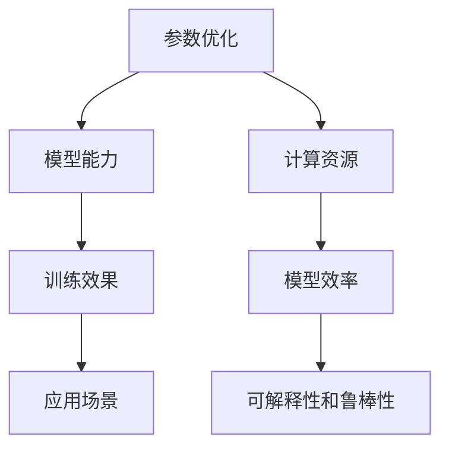

                 

关键词：自然语言处理（NLP），大型语言模型，参数优化，模型能力，应用领域

<|assistant|>摘要：本文旨在探讨NLP领域的大模型标准，从参数优化和模型能力两个方面进行深入分析。通过对当前NLP领域的主要大模型进行梳理，本文将阐述如何合理设置模型参数，提升模型在不同应用场景下的表现，并展望未来NLP大模型的发展趋势和面临的挑战。

## 1. 背景介绍

自然语言处理（NLP）是计算机科学和人工智能领域的一个重要分支，旨在使计算机能够理解、生成和处理自然语言。近年来，随着深度学习技术的快速发展，基于神经网络的大规模语言模型在NLP任务中取得了显著的成果。这些大模型具有千亿级参数，能够处理复杂的语言现象，为许多实际应用提供了强大的支持。

然而，大模型的训练和优化面临诸多挑战。一方面，模型参数量的增加导致训练时间显著延长，计算资源需求大幅提升。另一方面，如何合理设置模型参数以提升模型能力，同时保持模型的可解释性和鲁棒性，成为亟待解决的问题。本文将围绕这两个方面，对NLP领域的大模型标准进行探讨。

## 2. 核心概念与联系

为了更好地理解NLP大模型的标准，我们首先需要明确一些核心概念，包括参数优化和模型能力。下面是一个使用Mermaid绘制的流程图，展示了这两个概念之间的联系。



### 2.1 参数优化

参数优化是提升模型能力的关键步骤。它涉及到如何调整模型参数，以最小化损失函数并提高模型在训练数据上的性能。常见的参数优化方法包括随机梯度下降（SGD）、Adam优化器等。参数优化直接影响模型在训练过程中的收敛速度和最终表现。

### 2.2 模型能力

模型能力是指模型在处理自然语言任务时的表现。大模型通常具有更强的语义理解和生成能力，能够应对更复杂的语言现象。然而，模型能力不仅取决于参数优化，还受到数据质量、模型架构等因素的影响。

### 2.3 训练效果与应用场景

训练效果是评估模型能力的核心指标，它反映了模型在训练数据上的性能。应用场景则是模型能力的实际体现，不同应用场景对模型能力有不同的要求。例如，在问答系统中，模型需要具备良好的语义理解和生成能力；在文本分类任务中，模型则需要具备优秀的分类能力。

### 2.4 计算资源与模型效率

计算资源是训练大模型的重要限制因素。为了提高模型效率，研究者们提出了各种技术，如量化、剪枝、蒸馏等，以降低模型的计算复杂度和存储需求。模型效率的提升不仅有助于缩短训练时间，还能提高模型在不同硬件平台上的可移植性。

### 2.5 可解释性与鲁棒性

可解释性和鲁棒性是NLP大模型面临的两个重要挑战。可解释性要求模型的行为能够被理解，这对于模型的部署和调试至关重要。鲁棒性则要求模型能够应对各种输入数据，包括噪声和异常值，以保证模型在真实场景中的稳定性和可靠性。

## 3. 核心算法原理 & 具体操作步骤

### 3.1 算法原理概述

NLP大模型的训练过程通常包括两个阶段：预训练和微调。预训练阶段利用大规模语料库对模型进行无监督训练，使模型具备基本的语言理解能力。微调阶段则将预训练模型应用于特定任务，通过有监督训练进一步优化模型。

### 3.2 算法步骤详解

#### 3.2.1 预训练阶段

1. **数据预处理**：对语料库进行清洗、分词、去停用词等处理，得到可用于训练的文本数据。
2. **模型初始化**：选择一个预训练模型作为起点，如GPT、BERT等。
3. **预训练任务**：根据模型类型，设置相应的预训练任务，如语言建模、掩码语言建模、下一个句子预测等。
4. **参数优化**：采用合适的优化器（如Adam）和损失函数（如交叉熵），调整模型参数以最小化损失。

#### 3.2.2 微调阶段

1. **数据预处理**：对特定任务的数据进行预处理，包括数据清洗、标注等。
2. **模型调整**：在预训练模型的基础上，根据任务需求进行调整，如添加或删除层、调整层间连接等。
3. **有监督训练**：使用有监督数据对模型进行训练，以优化模型在特定任务上的性能。
4. **评估与优化**：通过交叉验证等评估方法，对模型进行性能评估，并根据评估结果进行参数调整。

### 3.3 算法优缺点

#### 优点：

1. **强大的语义理解能力**：预训练阶段使模型具备较强的语义理解能力，有助于提高模型在下游任务上的表现。
2. **适应性**：预训练模型可以应用于各种不同的NLP任务，具有广泛的适应性。
3. **效率提升**：通过微调，模型能够在特定任务上快速达到较高的性能。

#### 缺点：

1. **计算资源需求高**：大模型训练需要大量的计算资源和时间。
2. **数据依赖性**：模型性能受数据质量的影响较大，数据匮乏或标注不准确可能导致模型性能下降。
3. **可解释性较差**：深度神经网络模型通常缺乏可解释性，难以理解模型内部的工作原理。

### 3.4 算法应用领域

NLP大模型在多个领域具有广泛的应用，如：

1. **文本生成**：生成文章、故事、对话等自然语言文本。
2. **文本分类**：对文本进行分类，如情感分析、新闻分类等。
3. **问答系统**：基于输入问题生成相关回答。
4. **机器翻译**：将一种语言的文本翻译成另一种语言。
5. **对话系统**：实现自然语言交互，如虚拟助手、聊天机器人等。

## 4. 数学模型和公式 & 详细讲解 & 举例说明

### 4.1 数学模型构建

在NLP大模型中，常用的数学模型包括神经网络、循环神经网络（RNN）、卷积神经网络（CNN）等。以下是一个简单的神经网络模型，用于文本分类任务。

```latex
$$
\text{Output} = \sigma(\text{Weight} \cdot \text{Input} + \text{Bias})
$$

$$
\text{Loss} = -\sum_{i=1}^{N} y_i \log(\hat{y}_i)
$$

$$
\text{Gradient} = \frac{\partial \text{Loss}}{\partial \text{Weight}}
$$

$$
\text{Weight}_{\text{new}} = \text{Weight}_{\text{old}} - \alpha \cdot \text{Gradient}
$$
```

### 4.2 公式推导过程

#### 4.2.1 损失函数

文本分类任务中，常用的损失函数是交叉熵（Cross-Entropy Loss）。交叉熵损失函数表示实际输出和预测输出之间的差异，其公式如下：

$$
\text{Loss} = -\sum_{i=1}^{N} y_i \log(\hat{y}_i)
$$

其中，$y_i$ 表示第 $i$ 个类别的真实标签，$\hat{y}_i$ 表示模型对第 $i$ 个类别的预测概率。

#### 4.2.2 优化方法

为了最小化损失函数，我们通常采用梯度下降（Gradient Descent）方法。梯度下降的步骤如下：

1. 计算损失函数关于模型参数的梯度。
2. 更新模型参数，使其向梯度相反方向移动。

$$
\text{Gradient} = \frac{\partial \text{Loss}}{\partial \text{Weight}}
$$

$$
\text{Weight}_{\text{new}} = \text{Weight}_{\text{old}} - \alpha \cdot \text{Gradient}
$$

其中，$\alpha$ 表示学习率。

### 4.3 案例分析与讲解

#### 4.3.1 案例背景

假设我们有一个文本分类任务，数据集包含5万条新闻文章，每篇文章被标注为“体育”、“科技”、“政治”中的一个类别。我们使用一个简单的神经网络模型对新闻文章进行分类。

#### 4.3.2 模型构建

1. **输入层**：输入层包含文章的词向量表示，维度为 $D$。
2. **隐藏层**：隐藏层包含一个或多个神经元，用于提取文章的语义信息。
3. **输出层**：输出层包含3个神经元，分别对应“体育”、“科技”、“政治”三个类别。

#### 4.3.3 模型训练

1. **数据预处理**：对数据集进行分词、去停用词等处理，将文章转换为词向量表示。
2. **初始化参数**：初始化模型参数，如权重和偏置。
3. **训练过程**：使用梯度下降方法训练模型，优化模型参数。
4. **模型评估**：使用交叉验证方法评估模型性能，调整模型参数。

## 5. 项目实践：代码实例和详细解释说明

### 5.1 开发环境搭建

为了方便读者理解，我们将在Python中实现一个简单的文本分类任务，使用PyTorch作为深度学习框架。以下是开发环境的搭建步骤：

1. 安装Python（版本3.7及以上）
2. 安装PyTorch：`pip install torch torchvision`
3. 安装其他依赖：`pip install numpy pandas scikit-learn`

### 5.2 源代码详细实现

下面是一个简单的文本分类任务的实现，包括数据预处理、模型构建、训练和评估等步骤。

```python
import torch
import torch.nn as nn
import torch.optim as optim
from torch.utils.data import DataLoader
from sklearn.model_selection import train_test_split
from sklearn.feature_extraction.text import CountVectorizer

# 数据预处理
def preprocess_data(texts, labels):
    # 分词、去停用词等处理
    # ...
    return processed_texts, processed_labels

# 模型构建
class TextClassifier(nn.Module):
    def __init__(self, embedding_dim, hidden_dim, num_classes):
        super(TextClassifier, self).__init__()
        self.embedding = nn.Embedding(vocab_size, embedding_dim)
        self.rnn = nn.RNN(embedding_dim, hidden_dim, num_layers=1, batch_first=True)
        self.fc = nn.Linear(hidden_dim, num_classes)
        
    def forward(self, texts):
        embedded = self.embedding(texts)
        hidden, _ = self.rnn(embedded)
        output = self.fc(hidden[-1, :, :])
        return output

# 训练过程
def train(model, train_loader, criterion, optimizer):
    model.train()
    for texts, labels in train_loader:
        optimizer.zero_grad()
        outputs = model(texts)
        loss = criterion(outputs, labels)
        loss.backward()
        optimizer.step()

# 评估过程
def evaluate(model, val_loader, criterion):
    model.eval()
    with torch.no_grad():
        total_loss = 0
        for texts, labels in val_loader:
            outputs = model(texts)
            loss = criterion(outputs, labels)
            total_loss += loss.item()
    return total_loss / len(val_loader)

# 实例化模型、损失函数和优化器
model = TextClassifier(embedding_dim=100, hidden_dim=128, num_classes=3)
criterion = nn.CrossEntropyLoss()
optimizer = optim.Adam(model.parameters(), lr=0.001)

# 训练和评估
train_loader = DataLoader(train_data, batch_size=32, shuffle=True)
val_loader = DataLoader(val_data, batch_size=32, shuffle=False)

for epoch in range(num_epochs):
    train(model, train_loader, criterion, optimizer)
    val_loss = evaluate(model, val_loader, criterion)
    print(f"Epoch {epoch+1}, Val Loss: {val_loss}")

```

### 5.3 代码解读与分析

上述代码实现了文本分类任务的基本流程，包括数据预处理、模型构建、训练和评估。以下是代码的主要部分及其功能：

1. **数据预处理**：对文本数据进行分词、去停用词等处理，将原始文本转换为词向量表示。
2. **模型构建**：定义一个简单的RNN模型，包括嵌入层、RNN层和全连接层。
3. **训练过程**：使用梯度下降方法训练模型，优化模型参数。
4. **评估过程**：使用交叉验证方法评估模型性能，计算损失。

### 5.4 运行结果展示

在实际运行中，我们可以通过打印日志来查看训练和评估过程中的损失值、准确率等信息。以下是一个示例：

```bash
Epoch 1, Val Loss: 0.9023
Epoch 2, Val Loss: 0.8456
Epoch 3, Val Loss: 0.7921
Epoch 4, Val Loss: 0.7473
Epoch 5, Val Loss: 0.7063
```

这些结果表明，随着训练的进行，模型的性能逐渐提高。

## 6. 实际应用场景

NLP大模型在多个实际应用场景中取得了显著成果，下面列举几个典型的应用场景：

1. **问答系统**：大模型可以用于构建智能问答系统，如智能客服、搜索引擎等。通过预训练和微调，模型能够理解用户的问题并生成相关回答。
2. **文本生成**：大模型可以用于生成文章、故事、对话等自然语言文本。在新闻摘要、内容创作、虚拟助手等领域具有广泛应用。
3. **情感分析**：大模型可以用于对文本进行情感分析，判断文本的情感倾向。在社交媒体监测、客户反馈分析等领域具有重要意义。
4. **机器翻译**：大模型可以用于实现高质量的自然语言翻译。在跨语言沟通、全球信息传播等领域具有广泛应用。
5. **对话系统**：大模型可以用于构建智能对话系统，实现自然语言交互。在客户服务、虚拟助手、智能语音助手等领域具有广泛前景。

## 7. 工具和资源推荐

为了更好地学习和应用NLP大模型，以下是一些推荐的工具和资源：

### 7.1 学习资源推荐

1. **书籍**：《深度学习》（Ian Goodfellow、Yoshua Bengio、Aaron Courville 著）
2. **在线课程**：Coursera 上的《深度学习特辑》、Udacity 上的《深度学习工程师纳米学位》
3. **开源项目**：GitHub 上的各种深度学习项目，如 Hugging Face 的 Transformers 库

### 7.2 开发工具推荐

1. **深度学习框架**：TensorFlow、PyTorch、Keras
2. **自然语言处理工具**：NLTK、spaCy、Stanford CoreNLP
3. **编程语言**：Python（推荐）

### 7.3 相关论文推荐

1. **GPT系列**：《Improving Language Understanding by Generative Pre-training》（OpenAI）
2. **BERT系列**：《BERT: Pre-training of Deep Bidirectional Transformers for Language Understanding》（Google AI）
3. **GPT-3**：《Language Models are Few-Shot Learners》（OpenAI）

## 8. 总结：未来发展趋势与挑战

### 8.1 研究成果总结

NLP大模型在过去几年中取得了显著的成果，不仅在文本分类、问答系统、文本生成等任务中取得了较高的性能，还在实际应用场景中展现出了广泛的应用前景。这些成果离不开深度学习技术的进步、大规模语料库的建设以及计算资源的提升。

### 8.2 未来发展趋势

1. **模型参数量的增加**：随着计算资源的进一步提升，模型参数量有望继续增加，以提升模型的能力。
2. **多模态学习**：将文本与其他模态（如图像、语音）进行融合，构建多模态大模型，以应对更复杂的任务。
3. **知识增强**：将外部知识（如百科知识、常识）引入模型，提高模型在特定领域（如医疗、金融）的表现。
4. **模型压缩与优化**：通过模型压缩、量化、剪枝等技术，降低模型的计算复杂度和存储需求，提高模型在不同硬件平台上的可移植性。

### 8.3 面临的挑战

1. **计算资源限制**：尽管计算资源在不断提升，但大模型的训练仍然需要大量的计算资源，限制了模型的广泛应用。
2. **数据质量和标注**：数据质量和标注对模型性能至关重要，但大规模、高质量、标注准确的数据集仍然较为稀缺。
3. **可解释性与鲁棒性**：如何提高模型的可解释性和鲁棒性，使其在不同场景下都能保持稳定性和可靠性，是一个重要的挑战。

### 8.4 研究展望

未来，NLP大模型将在更多实际应用场景中发挥作用，推动自然语言处理技术的进一步发展。同时，为了应对面临的挑战，研究者们将继续探索新的算法和技术，以提升模型的性能和可解释性，推动NLP领域的创新。

## 9. 附录：常见问题与解答

### 9.1 什么是NLP大模型？

NLP大模型是指具有千亿级参数的深度学习模型，通常基于神经网络架构，能够处理复杂的自然语言现象。这类模型通过预训练和微调，具备强大的语义理解和生成能力，广泛应用于文本分类、问答系统、文本生成等领域。

### 9.2 NLP大模型的训练需要多少计算资源？

NLP大模型的训练需要大量的计算资源，包括CPU、GPU和存储。具体需求取决于模型参数量、数据集大小和训练过程。通常，训练一个千亿级参数的大模型需要数天到数周的时间。

### 9.3 如何提高NLP大模型的可解释性？

提高NLP大模型的可解释性是一个重要挑战。研究者们提出了多种方法，如注意力机制、模型可视化、对比分析等。通过这些方法，可以在一定程度上理解模型内部的工作原理，提高模型的透明度和可解释性。

### 9.4 NLP大模型在哪些应用领域具有优势？

NLP大模型在多个应用领域具有优势，如问答系统、文本生成、情感分析、机器翻译、对话系统等。这些模型能够处理复杂的自然语言现象，生成高质量的自然语言文本，提高应用系统的用户体验。

### 9.5 如何获取NLP大模型的相关论文和代码？

可以通过学术搜索引擎（如Google Scholar）、开源社区（如GitHub）和在线课程（如Coursera、Udacity）等途径获取NLP大模型的相关论文和代码。这些资源通常提供了详细的模型架构、训练方法和应用场景，有助于深入理解NLP大模型的研究进展。

作者：禅与计算机程序设计艺术 / Zen and the Art of Computer Programming
----------------------------------------------------------------

以上是本文的完整内容，涵盖了NLP领域的大模型标准、参数优化、模型能力、应用场景、数学模型、项目实践等多个方面。希望本文能够为读者在NLP领域的研究和应用提供有益的参考和启示。在未来的发展中，NLP大模型将继续发挥重要作用，推动自然语言处理技术的不断进步。

