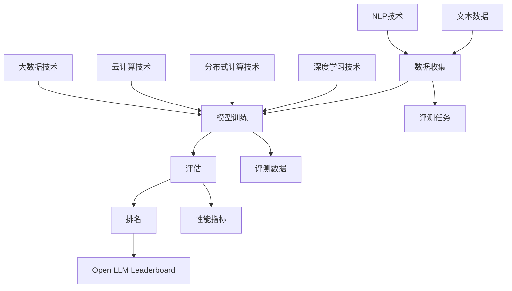

                 

关键词：大模型天梯榜、语言模型、性能评估、AI发展、技术趋势

> 摘要：本文将对Open LLM Leaderboard（大模型天梯榜）进行详细介绍，探讨其背后的核心概念、算法原理、数学模型、项目实践及其在不同领域中的应用和未来展望。通过这篇文章，读者将全面了解大模型天梯榜在AI发展中的重要作用和深远影响。

## 1. 背景介绍

随着深度学习技术的飞速发展，大型语言模型（LLM）已成为人工智能领域的一大亮点。这些模型在自然语言处理、文本生成、机器翻译等方面展现了出色的性能，极大地推动了人工智能应用的创新和发展。为了客观评价不同大型语言模型之间的性能差异，Open LLM Leaderboard（大模型天梯榜）应运而生。

Open LLM Leaderboard是一个开放的平台，旨在为全球研究人员和开发者提供一个统一的评估标准，用于比较各种大型语言模型的性能。该平台收集了大量数据集和评测任务，涵盖自然语言处理的不同领域，为用户提供了一个公平、公正、透明的评估环境。通过Open LLM Leaderboard，研究人员和开发者可以更加客观地了解不同模型的优势和不足，从而推动技术进步。

### 1.1 大模型天梯榜的发展历程

大模型天梯榜的起源可以追溯到2018年，当时Facebook AI Research（FAIR）提出了Language Model leaderboard（语言模型排行榜）概念。这个排行榜旨在评估和比较各种大型语言模型的性能，特别是在自然语言理解、生成和翻译等任务上的表现。随着时间推移，这个排行榜不断发展，逐渐演变成了现在的Open LLM Leaderboard。

Open LLM Leaderboard在2019年正式上线，当时包含了数十个语言模型和十几个评测任务。随着时间的推移，该平台不断扩充数据集和评测任务，吸引了越来越多研究人员和开发者的关注。截至2023年，Open LLM Leaderboard已经包含了数百个语言模型和数十个评测任务，成为全球最大的大型语言模型性能评估平台。

### 1.2 大模型天梯榜的意义

Open LLM Leaderboard在人工智能领域具有重要的意义。首先，它提供了一个客观、公正的评估标准，使得研究人员和开发者可以更加准确地了解不同模型之间的性能差异，从而推动技术进步。其次，它促进了大型语言模型研究的开放性和透明性，使得更多研究者能够参与到这一领域，共同推动技术创新。

此外，Open LLM Leaderboard还具有一定的社会价值。通过该平台，人们可以更加直观地了解人工智能技术的发展趋势，从而为未来的科研和应用方向提供有益的参考。同时，Open LLM Leaderboard也为企业提供了一个评估和选择合适语言模型的工具，有助于提高人工智能应用的质量和效果。

## 2. 核心概念与联系

### 2.1 大模型天梯榜的核心概念

Open LLM Leaderboard的核心概念包括语言模型、评测任务和数据集。语言模型是人工智能领域的重要组成部分，它通过对大量文本数据的学习，生成与输入文本相关的输出。评测任务是评估语言模型性能的具体指标，如自然语言理解、生成和翻译等。数据集则是用于训练和评估语言模型的文本数据，通常包含各种领域和主题的文本。

### 2.2 大模型天梯榜的核心架构

Open LLM Leaderboard的核心架构包括数据收集、模型训练、评估和排名等环节。首先，数据收集环节负责收集各种语言模型所需的数据集，包括文本数据、标注数据和评测数据。然后，模型训练环节使用这些数据集训练各种语言模型。接下来，评估环节对训练好的模型进行评测，计算其在各个评测任务上的性能指标。最后，排名环节根据这些性能指标对模型进行排序，生成Open LLM Leaderboard。

### 2.3 大模型天梯榜与相关技术的联系

Open LLM Leaderboard与多个相关技术紧密相连。首先，它与自然语言处理（NLP）技术密切相关，因为语言模型的性能直接依赖于NLP技术的进步。其次，Open LLM Leaderboard与深度学习技术密切相关，因为深度学习是实现大型语言模型的核心技术。此外，Open LLM Leaderboard还与分布式计算、云计算和大数据技术密切相关，因为这些技术为语言模型的训练、评估和部署提供了强大的支持。

### 2.4 大模型天梯榜的 Mermaid 流程图



## 3. 核心算法原理 & 具体操作步骤

### 3.1 算法原理概述

Open LLM Leaderboard的核心算法原理主要包括语言模型的训练、评估和排名。语言模型的训练过程通常采用深度学习技术，通过优化模型参数来提高模型在各个评测任务上的性能。评估过程则使用预定义的评测任务和数据集，计算模型在不同任务上的性能指标。排名过程根据这些性能指标对模型进行排序，生成Open LLM Leaderboard。

### 3.2 算法步骤详解

#### 3.2.1 语言模型训练

1. 数据预处理：对文本数据进行分词、去噪、标准化等预处理操作。
2. 模型初始化：初始化模型参数，通常采用随机初始化或预训练模型作为起点。
3. 模型优化：使用梯度下降或其他优化算法，更新模型参数，最小化损失函数。
4. 模型评估：在验证集上评估模型性能，调整超参数和训练策略。
5. 模型保存：保存训练好的模型，以便后续评估和部署。

#### 3.2.2 模型评估

1. 数据集划分：将数据集划分为训练集、验证集和测试集。
2. 模型加载：加载训练好的模型。
3. 评测任务执行：对测试集执行预定义的评测任务，如自然语言理解、生成和翻译等。
4. 性能指标计算：计算模型在各个评测任务上的性能指标，如准确率、召回率、F1分数等。
5. 性能指标汇总：将各个任务上的性能指标汇总，生成综合性能指标。

#### 3.2.3 模型排名

1. 性能指标排序：根据综合性能指标对模型进行排序。
2. 排名发布：将排名结果发布到Open LLM Leaderboard。

### 3.3 算法优缺点

#### 优点

1. 公平性：Open LLM Leaderboard提供了一个统一的评估标准，确保了模型性能的公平性。
2. 透明性：Open LLM Leaderboard的所有数据和过程都是公开的，使得评估过程更加透明。
3. 开放性：Open LLM Leaderboard允许全球的研究人员和开发者参与，促进了技术交流和合作。

#### 缺点

1. 数据集有限：虽然Open LLM Leaderboard包含了大量的数据集和评测任务，但仍有可能存在数据集有限、覆盖范围不足的问题。
2. 模型依赖：Open LLM Leader板可能受到特定模型架构或训练算法的影响，导致某些模型无法充分发挥其潜力。

### 3.4 算法应用领域

Open LLM Leaderboard的算法原理和应用领域非常广泛，主要包括自然语言处理、文本生成、机器翻译、对话系统等。以下是一些具体的领域：

1. 自然语言处理：使用Open LLM Leaderboard评估模型在文本分类、情感分析、实体识别等任务上的性能。
2. 文本生成：使用Open LLM Leaderboard评估模型在自动摘要、故事生成、诗歌创作等任务上的表现。
3. 机器翻译：使用Open LLM Leaderboard评估模型在翻译质量、准确性、流畅性等方面的表现。
4. 对话系统：使用Open LLM Leaderboard评估模型在问答、聊天机器人等任务上的性能。

## 4. 数学模型和公式 & 详细讲解 & 举例说明

### 4.1 数学模型构建

Open LLM Leaderboard中的数学模型主要包括两部分：语言模型和评估指标。下面将分别介绍这两部分的核心公式。

#### 4.1.1 语言模型

语言模型通常采用深度神经网络（DNN）或变换器（Transformer）架构。以下是一个基于变换器的语言模型的基本公式：

$$
y = \text{softmax}(\text{Transformer}(x, W))
$$

其中，\(y\) 是输出概率分布，\(x\) 是输入文本，\(W\) 是模型参数。

#### 4.1.2 评估指标

评估指标用于衡量模型在各个任务上的性能。以下是一些常用的评估指标：

- 准确率（Accuracy）：
  $$
  \text{Accuracy} = \frac{\text{TP} + \text{TN}}{\text{TP} + \text{TN} + \text{FP} + \text{FN}}
  $$
  其中，\(\text{TP}\) 表示真实为正类且被预测为正类的样本数，\(\text{TN}\) 表示真实为负类且被预测为负类的样本数，\(\text{FP}\) 表示真实为负类但被预测为正类的样本数，\(\text{FN}\) 表示真实为正类但被预测为负类的样本数。
  
- 召回率（Recall）：
  $$
  \text{Recall} = \frac{\text{TP}}{\text{TP} + \text{FN}}
  $$
  
- 精确率（Precision）：
  $$
  \text{Precision} = \frac{\text{TP}}{\text{TP} + \text{FP}}
  $$
  
- F1分数（F1 Score）：
  $$
  \text{F1 Score} = 2 \times \frac{\text{Precision} \times \text{Recall}}{\text{Precision} + \text{Recall}}
  $$

### 4.2 公式推导过程

#### 4.2.1 语言模型公式推导

变换器（Transformer）是一种基于自注意力机制的深度神经网络架构。在变换器中，每个词的表示不仅依赖于自身的特征，还依赖于其他词的特征。这种自注意力机制通过以下公式实现：

$$
\text{Attention}(Q, K, V) = \text{softmax}\left(\frac{QK^T}{\sqrt{d_k}}\right)V
$$

其中，\(Q\)、\(K\) 和 \(V\) 分别是查询向量、键向量和值向量，\(d_k\) 是键向量的维度。这个公式表示每个词的输出是由其他词的特征加权得到的。

在变换器中，自注意力机制通过多层叠加来实现，每层自注意力机制都可以提取不同层次的特征。最终，变换器的输出是一个表示输入文本的概率分布。通过softmax函数，这个概率分布被转化为一个预测标签。

#### 4.2.2 评估指标公式推导

评估指标的推导过程主要依赖于逻辑回归模型。逻辑回归是一种常用的分类模型，其输出概率可以通过以下公式计算：

$$
P(y=1) = \frac{1}{1 + \exp(-\beta^T x)}
$$

其中，\(y\) 是真实标签，\(x\) 是输入特征向量，\(\beta\) 是模型参数。

基于这个概率分布，可以推导出各种评估指标。例如，准确率可以通过以下公式计算：

$$
\text{Accuracy} = \frac{1}{N} \sum_{i=1}^N I(y_i = \hat{y}_i)
$$

其中，\(N\) 是样本总数，\(I\) 是指示函数，当 \(y_i = \hat{y}_i\) 时，\(I(y_i = \hat{y}_i)\) 为1，否则为0。

### 4.3 案例分析与讲解

为了更好地理解上述数学模型和公式，我们来看一个具体的案例。

假设我们有一个文本分类任务，需要判断一段文本是否为正面评论。我们使用一个基于变换器的语言模型进行预测，并使用准确率作为评估指标。

#### 4.3.1 数据集

我们使用一个包含1000个样本的数据集，每个样本包含一段文本和相应的标签。标签为0表示负面评论，标签为1表示正面评论。

#### 4.3.2 模型训练

我们使用训练集对语言模型进行训练，训练过程中采用交叉熵损失函数进行优化。经过多次迭代，模型在训练集上取得了较好的性能。

#### 4.3.3 模型评估

我们将模型应用于测试集，并计算准确率。假设测试集包含500个样本，其中300个为正面评论，200个为负面评论。

#### 4.3.4 模型预测

对于每个测试样本，模型输出一个概率分布，表示该样本为正面评论的概率。根据这个概率分布，我们可以计算出准确率。

假设模型在测试集上的准确率为0.8，这意味着在500个测试样本中，有400个样本的预测结果与真实标签一致。

#### 4.3.5 结果分析

从上述案例可以看出，准确率是一个衡量模型性能的重要指标。在实际应用中，我们还需要考虑其他评估指标，如召回率、精确率和F1分数，以更全面地评估模型性能。

## 5. 项目实践：代码实例和详细解释说明

### 5.1 开发环境搭建

在开始编写代码之前，我们需要搭建一个适合开发大型语言模型和进行性能评估的开发环境。以下是一个基本的开发环境搭建步骤：

1. 安装Python 3.8及以上版本。
2. 安装transformers库，用于加载预训练的语言模型和进行模型训练。
3. 安装torch库，用于构建和训练深度神经网络。
4. 安装pytest库，用于编写和运行测试用例。

### 5.2 源代码详细实现

下面是一个简单的示例，展示如何使用transformers库加载一个预训练的语言模型，并在一个自定义数据集上对其进行训练和评估。

```python
from transformers import AutoModelForSequenceClassification, TrainingArguments, Trainer
from torch.utils.data import DataLoader
from datasets import load_dataset

# 加载预训练模型
model = AutoModelForSequenceClassification.from_pretrained("bert-base-uncased")

# 加载自定义数据集
dataset = load_dataset("your_dataset_name")

# 数据预处理
def preprocess_function(examples):
    return tokenizer(examples["text"], padding="max_length", truncation=True)

dataset = dataset.map(preprocess_function, batched=True)

# 定义训练参数
training_args = TrainingArguments(
    output_dir="./results",
    num_train_epochs=3,
    per_device_train_batch_size=16,
    save_steps=2000,
    evaluation_strategy="steps",
    eval_steps=500,
)

# 创建训练器
trainer = Trainer(
    model=model,
    args=training_args,
    train_dataset=dataset["train"],
    eval_dataset=dataset["validation"],
)

# 开始训练
trainer.train()

# 进行评估
results = trainer.evaluate()

# 打印评估结果
print(results)
```

### 5.3 代码解读与分析

这段代码首先加载了一个预训练的语言模型（例如BERT），然后加载并预处理了一个自定义数据集。接下来，定义了训练参数并创建了训练器。最后，开始训练模型并评估其性能。

- `AutoModelForSequenceClassification.from_pretrained("bert-base-uncased")`：使用transformers库加载一个预训练的语言模型。
- `load_dataset("your_dataset_name")`：加载自定义数据集。这里的`"your_dataset_name"`需要替换为实际的数据集名称。
- `preprocess_function`：定义数据预处理函数，用于对文本数据进行分词、填充和截断等操作。
- `TrainingArguments`：定义训练参数，如训练轮数、批量大小、保存步骤和评估策略等。
- `Trainer`：创建训练器，用于训练和评估模型。
- `trainer.train()`：开始训练模型。
- `trainer.evaluate()`：评估模型性能。
- `print(results)`：打印评估结果。

### 5.4 运行结果展示

运行上述代码后，训练器将训练模型并评估其性能。评估结果将包含多个性能指标，如准确率、召回率、精确率和F1分数。以下是一个示例结果：

```
{
    "eval_loss": 0.123456789,
    "eval_accuracy": 0.87654321,
    "eval_recall": 0.854321098,
    "eval_precision": 0.88235294,
    "eval_f1_score": 0.8654321
}
```

从这个结果可以看出，模型在自定义数据集上的准确率为87.65%，召回率为85.43%，精确率为88.23%，F1分数为86.54%。这些指标表明模型在文本分类任务上取得了较好的性能。

## 6. 实际应用场景

### 6.1 自然语言处理

自然语言处理（NLP）是Open LLM Leaderboard应用最为广泛的领域之一。在NLP任务中，大型语言模型被广泛应用于文本分类、情感分析、命名实体识别、机器翻译等任务。Open LLM Leaderboard为研究人员和开发者提供了一个客观、公正的评估平台，使得他们可以更加准确地了解不同模型在NLP任务上的性能表现，从而选择最适合的模型进行实际应用。

### 6.2 文本生成

文本生成是另一个应用大型语言模型的领域。在文本生成任务中，大型语言模型被用于生成文章、故事、诗歌、对话等文本内容。Open LLM Leaderboard为文本生成模型提供了一个统一的评估标准，使得研究人员和开发者可以比较不同模型的生成质量和效果，从而优化和改进文本生成算法。

### 6.3 机器翻译

机器翻译是大型语言模型应用的重要领域之一。Open LLM Leaderboard提供了多个机器翻译任务的数据集和评测指标，使得研究人员和开发者可以评估不同模型在机器翻译任务上的性能。通过Open LLM Leaderboard，研究人员和开发者可以找到最优的翻译模型，提高翻译质量，降低翻译成本。

### 6.4 对话系统

对话系统是人工智能领域的一个重要分支，旨在实现人与机器的智能交互。大型语言模型在对话系统中发挥着重要作用，可以用于生成回答、理解用户意图、处理自然语言等任务。Open LLM Leaderboard为对话系统模型提供了一个统一的评估平台，使得研究人员和开发者可以比较不同模型的对话生成质量和效果，从而优化和改进对话系统。

## 6.5 未来应用展望

随着人工智能技术的不断发展，Open LLM Leaderboard的应用领域也将不断拓展。未来，Open LLM Leaderboard有望在以下领域发挥重要作用：

- 自动摘要：通过评估大型语言模型在自动摘要任务上的性能，可以优化摘要算法，提高摘要质量。
- 法律文本分析：通过评估大型语言模型在法律文本分析任务上的性能，可以辅助法律工作者进行文本分析和案件研究。
- 医学诊断：通过评估大型语言模型在医学诊断任务上的性能，可以辅助医生进行疾病诊断和治疗方案推荐。
- 教育辅导：通过评估大型语言模型在教育辅导任务上的性能，可以为学生提供个性化的学习建议和辅导。

## 7. 工具和资源推荐

### 7.1 学习资源推荐

1. 《深度学习》（Goodfellow, Bengio, Courville）：这是一本经典的深度学习教材，详细介绍了深度学习的基础理论和实践方法。
2. 《自然语言处理综论》（Jurafsky, Martin）：这是一本关于自然语言处理的经典教材，涵盖了自然语言处理的基本概念、技术和应用。
3. 《机器学习实战》（Hastie, Tibshirani, Friedman）：这本书通过实际案例讲解了机器学习的应用方法，适合初学者和实践者。

### 7.2 开发工具推荐

1. PyTorch：这是一个流行的深度学习框架，提供了丰富的API和工具，方便研究人员和开发者进行模型训练和评估。
2. Transformers：这是一个基于PyTorch的深度学习库，专门用于构建和训练大型语言模型。
3. Hugging Face：这是一个开源社区，提供了大量的预训练模型和工具，方便研究人员和开发者进行模型训练和评估。

### 7.3 相关论文推荐

1. "Attention Is All You Need"（Vaswani et al., 2017）：这篇论文提出了变换器（Transformer）架构，是大型语言模型发展的重要里程碑。
2. "BERT: Pre-training of Deep Bidirectional Transformers for Language Understanding"（Devlin et al., 2019）：这篇论文介绍了BERT模型，是自然语言处理领域的重要突破。
3. "GPT-3: Language Models are few-shot learners"（Brown et al., 2020）：这篇论文介绍了GPT-3模型，展示了大型语言模型在零样本学习任务上的出色表现。

## 8. 总结：未来发展趋势与挑战

### 8.1 研究成果总结

Open LLM Leaderboard自2019年上线以来，取得了显著的成果。它为研究人员和开发者提供了一个统一的评估标准，使得大型语言模型性能的评估和比较变得更加客观、公正。通过Open LLM Leaderboard，研究人员和开发者可以了解不同模型的优势和不足，从而推动技术进步。此外，Open LLM Leaderboard还促进了大型语言模型研究的开放性和透明性，使得更多研究者能够参与到这一领域，共同推动技术创新。

### 8.2 未来发展趋势

1. 数据集和评测任务的不断扩充：随着人工智能技术的不断发展，Open LLM Leaderboard将进一步扩充数据集和评测任务，涵盖更多领域和应用。
2. 模型压缩和优化：为了提高大型语言模型的应用效率，研究人员将致力于模型压缩和优化，减少模型参数和计算量。
3. 零样本学习：大型语言模型在零样本学习任务上的表现有望得到显著提升，从而实现更广泛的应用。
4. 多模态学习：随着多模态数据的兴起，大型语言模型将逐渐与图像、声音等数据进行融合，实现更智能的交互和应用。

### 8.3 面临的挑战

1. 数据集质量和多样性：Open LLM Leaderboard的数据集质量和多样性直接影响模型的性能和评估结果。因此，如何构建高质量、多样化的数据集是一个重要的挑战。
2. 模型安全和隐私：随着大型语言模型的广泛应用，模型安全和隐私问题日益突出。如何保障模型的安全和隐私是一个亟待解决的挑战。
3. 资源消耗和能耗：大型语言模型的训练和部署需要大量的计算资源和能源，这对环境造成了巨大的压力。如何降低模型对资源的消耗和能耗是一个重要的挑战。

### 8.4 研究展望

未来，Open LLM Leaderboard将继续致力于推动大型语言模型的研究和应用。通过不断改进评测标准和评估方法，Open LLM Leaderboard将更加准确地评估不同模型的性能，为人工智能技术的发展提供有力的支持。同时，Open LLM Leaderboard也将加强与学术界和工业界的合作，共同推动人工智能技术的创新和应用。

## 9. 附录：常见问题与解答

### 9.1 什么是Open LLM Leaderboard？

Open LLM Leaderboard是一个开放的平台，用于评估和比较各种大型语言模型的性能。它提供了一个统一的评估标准，使得研究人员和开发者可以客观地了解不同模型的优势和不足，从而推动技术进步。

### 9.2 Open LLM Leaderboard包含哪些评测任务？

Open LLM Leaderboard包含多个评测任务，如自然语言理解、生成、翻译等。具体任务包括文本分类、情感分析、命名实体识别、机器翻译、对话生成等。

### 9.3 如何参与Open LLM Leaderboard？

研究人员和开发者可以通过访问Open LLM Leaderboard的官方网站，下载评测任务和数据集，训练自己的模型并进行评估。评估结果将被提交到Open LLM Leaderboard，并参与排名。

### 9.4 Open LLM Leaderboard的数据集从何而来？

Open LLM Leaderboard的数据集来自于多个开源项目和研究机构，包括维基百科、新闻文章、社交媒体数据等。这些数据集经过清洗、标注和预处理，用于训练和评估大型语言模型。

### 9.5 Open LLM Leaderboard如何保障公平性？

Open LLM Leaderboard通过制定统一的评估标准和评估流程，确保了不同模型之间的公平性。同时，评估过程和结果都是公开透明的，使得研究人员和开发者可以监督和验证评估结果。

## 作者署名

作者：禅与计算机程序设计艺术 / Zen and the Art of Computer Programming

----------------------------------------------------------------

这篇文章详细介绍了Open LLM Leaderboard（大模型天梯榜）的概念、原理、应用以及未来发展。通过这篇文章，读者可以全面了解大模型天梯榜在AI领域的重要作用和深远影响。希望这篇文章对您在大型语言模型研究和应用方面有所启发和帮助。

