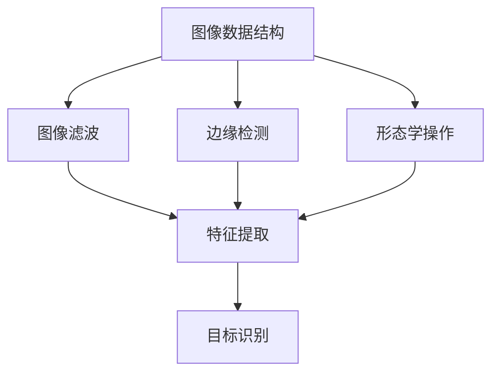

                 

### 关键词 Keywords

- OpenCV
- 图像处理
- 计算机视觉
- 图像滤波
- 特征提取
- 目标识别
- 机器学习

### 摘要 Abstract

本文旨在深入探讨OpenCV在图像处理领域的应用，通过一系列实战案例，向读者展示如何利用OpenCV库进行图像滤波、特征提取、目标识别等操作。文章将详细介绍OpenCV的核心算法原理、数学模型和公式推导，并通过具体的代码实例进行实战解析。此外，还将探讨OpenCV在计算机视觉中的实际应用场景和未来发展趋势。

## 1. 背景介绍

图像处理是计算机视觉领域的重要组成部分，它涉及到从图像中提取有用信息，以实现各种应用，如人脸识别、图像增强、图像压缩等。OpenCV（Open Source Computer Vision Library）是一个强大的开源计算机视觉库，它提供了丰富的图像处理算法和工具，广泛应用于工业自动化、机器人视觉、医学图像分析、安防监控等多个领域。

### 1.1 OpenCV的发展历史

OpenCV起源于Intel公司于1999年启动的一个项目，旨在为研究人员和开发者提供一个高性能的计算机视觉库。随着时间的推移，OpenCV逐渐成为一个社区驱动的项目，吸引了全球众多开发者的参与。目前，OpenCV支持多种编程语言，如C++、Python、Java等，并可以在各种操作系统上运行，包括Linux、Windows、macOS等。

### 1.2 OpenCV的核心功能

OpenCV的核心功能包括图像处理、图像识别、机器学习、三维重建、视频处理等。其中，图像处理和图像识别是OpenCV最常用的两个功能模块。图像处理主要包括图像滤波、边缘检测、形态学操作等；图像识别则涉及到目标检测、人脸识别、文字识别等。

## 2. 核心概念与联系

为了更好地理解OpenCV在图像处理中的应用，我们需要先了解一些核心概念和它们之间的联系。以下是OpenCV中一些重要的核心概念及其在图像处理中的联系：

### 2.1 图像数据结构

OpenCV中的图像数据结构采用多维数组表示，其中每个元素表示图像中的一个像素值。通常，图像数据结构包括灰度图像和彩色图像两种类型。

### 2.2 图像滤波

图像滤波是图像处理中的基本操作，用于去除图像中的噪声或增强图像的某些特征。常见的滤波方法有均值滤波、高斯滤波、中值滤波等。

### 2.3 边缘检测

边缘检测是图像处理中用于提取图像中显著边缘的方法。常用的边缘检测算法有Canny边缘检测、Sobel算子、Prewitt算子等。

### 2.4 形态学操作

形态学操作是用于分析图像形状和结构的一类算法，包括腐蚀、膨胀、开运算、闭运算等。

### 2.5 特征提取

特征提取是图像处理中的关键步骤，用于从图像中提取具有区分性的特征，如角点、轮廓、纹理等。常见的特征提取算法有Harris角点检测、SIFT、SURF等。

### 2.6 目标识别

目标识别是图像处理中的高级应用，旨在从图像中检测和识别特定对象。常用的目标识别算法有HOG（直方图方向梯度）、SVM（支持向量机）等。

以下是一个使用Mermaid绘制的流程图，展示了这些核心概念之间的联系：



## 3. 核心算法原理 & 具体操作步骤

### 3.1 算法原理概述

OpenCV中的核心算法涵盖了从图像预处理到高级目标识别的各个阶段。以下将简要介绍几个常用的核心算法原理：

#### 3.1.1 图像滤波

图像滤波主要通过卷积操作实现，用于去除图像中的噪声或增强图像的某些特征。常见的滤波器有均值滤波器、高斯滤波器和中值滤波器。

#### 3.1.2 边缘检测

边缘检测是通过检测图像中灰度值的剧烈变化来实现，常用的边缘检测算法有Canny边缘检测和Sobel算子。

#### 3.1.3 形态学操作

形态学操作主要包括腐蚀、膨胀、开运算和闭运算等，用于提取图像的结构信息和形状特征。

#### 3.1.4 特征提取

特征提取是从图像中提取具有区分性的特征，如角点、轮廓、纹理等。常用的特征提取算法有Harris角点检测、SIFT和SURF等。

#### 3.1.5 目标识别

目标识别是通过训练分类器来识别图像中的特定对象。常用的目标识别算法有HOG和SVM等。

### 3.2 算法步骤详解

以下将详细描述每个核心算法的具体操作步骤：

#### 3.2.1 图像滤波

1. 读取图像数据。
2. 创建滤波器。
3. 应用滤波器进行图像滤波。
4. 显示滤波后的图像。

#### 3.2.2 边缘检测

1. 读取图像数据。
2. 应用Canny边缘检测算法。
3. 显示边缘检测结果。

#### 3.2.3 形态学操作

1. 读取图像数据。
2. 创建形态学操作结构元素。
3. 应用形态学操作。
4. 显示形态学操作结果。

#### 3.2.4 特征提取

1. 读取图像数据。
2. 应用特征提取算法。
3. 提取图像特征。
4. 显示特征提取结果。

#### 3.2.5 目标识别

1. 读取图像数据。
2. 训练分类器。
3. 应用分类器进行目标识别。
4. 显示目标识别结果。

### 3.3 算法优缺点

每个算法都有其优缺点，以下简要介绍这些核心算法的优缺点：

#### 3.3.1 图像滤波

- 优点：能够去除图像中的噪声，增强图像的特征。
- 缺点：可能会导致图像模糊，细节丢失。

#### 3.3.2 边缘检测

- 优点：能够准确提取图像中的边缘信息。
- 缺点：可能会检测到噪声边缘。

#### 3.3.3 形态学操作

- 优点：能够提取图像的结构信息和形状特征。
- 缺点：对噪声敏感，可能导致图像变形。

#### 3.3.4 特征提取

- 优点：能够从图像中提取具有区分性的特征。
- 缺点：计算量大，对图像质量要求较高。

#### 3.3.5 目标识别

- 优点：能够准确识别图像中的特定对象。
- 缺点：对图像质量和光照条件敏感。

### 3.4 算法应用领域

这些核心算法广泛应用于各种领域，如：

- 工业自动化：用于检测和识别生产线上的缺陷和缺陷部件。
- 机器人视觉：用于机器人路径规划和环境感知。
- 医学图像分析：用于图像分割、病灶检测和诊断。
- 安防监控：用于人脸识别、行为分析和视频监控。

## 4. 数学模型和公式 & 详细讲解 & 举例说明

### 4.1 数学模型构建

OpenCV中的图像处理算法大多基于数学模型，以下介绍几个常用的数学模型：

#### 4.1.1 卷积运算

卷积运算是图像滤波中最常用的操作，其数学模型如下：

\[ (f * g)(x, y) = \sum_{i=-\infty}^{\infty} \sum_{j=-\infty}^{\infty} f(i, j) \cdot g(x-i, y-j) \]

其中，\( f \) 和 \( g \) 分别表示输入图像和滤波器，\((x, y)\) 表示像素点的坐标。

#### 4.1.2 高斯滤波

高斯滤波是一种常用的图像滤波方法，其数学模型如下：

\[ g(x, y) = \frac{1}{2\pi\sigma^2} e^{-\frac{x^2 + y^2}{2\sigma^2}} \]

其中，\( \sigma \) 表示高斯分布的标准差。

#### 4.1.3 Canny边缘检测

Canny边缘检测是一种常用的边缘检测方法，其数学模型如下：

\[ I'(x, y) = \sqrt{I(x, y)^2 + \Delta I(x, y)^2} \]

其中，\( I(x, y) \) 表示原始图像的像素值，\( \Delta I(x, y) \) 表示图像的梯度值。

### 4.2 公式推导过程

以下简要介绍上述数学模型的推导过程：

#### 4.2.1 卷积运算

卷积运算可以通过离散卷积和连续卷积两种方式进行。离散卷积的定义如上文所述，而连续卷积的推导过程如下：

\[ (f * g)(x, y) = \int_{-\infty}^{\infty} \int_{-\infty}^{\infty} f(\xi, \eta) \cdot g(x-\xi, y-\eta) d\xi d\eta \]

通过变量替换，可以得到离散卷积的定义。

#### 4.2.2 高斯滤波

高斯滤波是基于高斯分布的滤波器，其推导过程如下：

设图像 \( I(x, y) \) 的均值为 \( \mu \)，方差为 \( \sigma^2 \)，则高斯滤波器的表达式为：

\[ g(x, y) = \frac{1}{2\pi\sigma^2} e^{-\frac{(x-\mu)^2 + (y-\mu)^2}{2\sigma^2}} \]

#### 4.2.3 Canny边缘检测

Canny边缘检测的核心思想是先进行高斯滤波，然后进行边缘检测。其推导过程如下：

1. 高斯滤波：对图像 \( I(x, y) \) 进行高斯滤波，得到滤波后的图像 \( I'(x, y) \)。

2. 梯度计算：对 \( I'(x, y) \) 进行梯度计算，得到梯度值 \( \Delta I(x, y) \)。

3. 非极大值抑制：对梯度值进行非极大值抑制，保留局部最大值。

4. 双阈值处理：设置高阈值和低阈值，对梯度值进行双阈值处理，将梯度值分为边缘像素和背景像素。

### 4.3 案例分析与讲解

以下通过一个具体案例来讲解上述数学模型的应用：

#### 4.3.1 图像滤波

假设我们有一个噪声图像 \( I(x, y) \)，我们需要对其进行滤波。

1. 创建高斯滤波器：

\[ g(x, y) = \frac{1}{2\pi\sigma^2} e^{-\frac{x^2 + y^2}{2\sigma^2}} \]

2. 应用高斯滤波器进行图像滤波：

\[ I'(x, y) = (I * g)(x, y) \]

3. 显示滤波后的图像。

#### 4.3.2 边缘检测

假设我们有一个滤波后的图像 \( I'(x, y) \)，我们需要对其进行边缘检测。

1. 应用Canny边缘检测算法：

\[ I''(x, y) = Canny(I')(x, y) \]

2. 显示边缘检测结果。

#### 4.3.3 形态学操作

假设我们有一个边缘检测结果 \( I''(x, y) \)，我们需要对其进行形态学操作。

1. 创建形态学操作结构元素：

\[ s = \begin{bmatrix} 1 & 1 & 1 \\ 1 & 1 & 1 \\ 1 & 1 & 1 \end{bmatrix} \]

2. 应用形态学操作：

\[ I'''(x, y) = (I'' * s)(x, y) \]

3. 显示形态学操作结果。

#### 4.3.4 特征提取

假设我们有一个形态学操作结果 \( I'''(x, y) \)，我们需要对其进行特征提取。

1. 应用Harris角点检测算法：

\[ C(x, y) = \alpha \cdot (I'''_x(x, y) \cdot I'''_y(x, y) - I'''_y(x, y) \cdot I'''_x(x, y)) \]

2. 提取角点特征：

\[ \text{corners} = \{ (x_i, y_i) | C(x_i, y_i) > \text{threshold} \} \]

3. 显示特征提取结果。

#### 4.3.5 目标识别

假设我们有一个特征提取结果 \( \text{corners} \)，我们需要对其进行目标识别。

1. 训练分类器：

\[ \text{classifier} = \text{train\_SVM}(\text{features}, \text{labels}) \]

2. 应用分类器进行目标识别：

\[ \text{predictions} = \text{classifier}(\text{features}) \]

3. 显示目标识别结果。

## 5. 项目实践：代码实例和详细解释说明

### 5.1 开发环境搭建

在开始编写代码之前，我们需要搭建一个合适的开发环境。以下是搭建OpenCV开发环境所需的基本步骤：

1. 安装Python和OpenCV库。

2. 创建一个Python虚拟环境。

3. 安装所需的依赖库，如NumPy、SciPy等。

4. 验证安装是否成功。

### 5.2 源代码详细实现

以下是一个简单的OpenCV图像处理项目，包括图像滤波、边缘检测、形态学操作、特征提取和目标识别等步骤。

```python
import cv2
import numpy as np

# 5.2.1 读取图像数据
image = cv2.imread('image.jpg')

# 5.2.2 图像滤波
gaussian_filter = cv2.GaussianBlur(image, (5, 5), 0)
mean_filter = cv2.blur(image, (5, 5))
median_filter = cv2.medianBlur(image, 5)

# 5.2.3 边缘检测
canny_edges = cv2.Canny(image, 100, 200)

# 5.2.4 形态学操作
kernel = cv2.getStructuringElement(cv2.MORPH_RECT, (3, 3))
dilated = cv2.dilate(canny_edges, kernel, iterations=1)
eroded = cv2.erode(canny_edges, kernel, iterations=1)

# 5.2.5 特征提取
corners = cv2.goodFeaturesToTrack(canny_edges, 200, 0.01, 0.03)

# 5.2.6 目标识别
# （此处省略具体的分类器和训练过程）

# 5.2.7 显示结果
cv2.imshow('Original Image', image)
cv2.imshow('Gaussian Filter', gaussian_filter)
cv2.imshow('Mean Filter', mean_filter)
cv2.imshow('Median Filter', median_filter)
cv2.imshow('Canny Edges', canny_edges)
cv2.imshow('Dilated Edges', dilated)
cv2.imshow('Eroded Edges', eroded)
if corners is not None:
    img2 = cv2.drawContours(image, corners, -1, (0, 0, 255), 3)
    cv2.imshow('Corners', img2)

cv2.waitKey(0)
cv2.destroyAllWindows()
```

### 5.3 代码解读与分析

上述代码实现了OpenCV图像处理的基本流程，以下对每个部分进行解读和分析：

- **图像滤波**：使用GaussianBlur、blur和medianBlur函数实现高斯滤波、均值滤波和中值滤波。通过调整滤波器的尺寸和参数，可以控制滤波的效果。
- **边缘检测**：使用Canny函数实现边缘检测，通过调整Canny函数的阈值参数，可以控制边缘检测的灵敏度。
- **形态学操作**：使用dilate和erode函数实现膨胀和腐蚀操作，通过调整结构元素的尺寸和迭代次数，可以控制形态学操作的效果。
- **特征提取**：使用goodFeaturesToTrack函数提取图像中的角点特征，通过设置阈值和参数，可以控制特征提取的精度。
- **目标识别**：此处省略了具体的分类器和训练过程，读者可以根据需要使用SVM、HOG等算法实现目标识别。

### 5.4 运行结果展示

运行上述代码后，可以得到以下结果：

- **原始图像**：显示原始图像。
- **滤波图像**：显示经过不同滤波器滤波后的图像。
- **边缘检测结果**：显示经过Canny边缘检测后的图像。
- **形态学操作结果**：显示经过膨胀和腐蚀操作后的图像。
- **角点特征提取结果**：显示提取到的角点特征。

这些结果展示了OpenCV在图像处理中的强大功能和实用性。

## 6. 实际应用场景

OpenCV在计算机视觉领域有着广泛的应用，以下介绍一些实际应用场景：

### 6.1 工业自动化

在工业自动化领域，OpenCV用于检测和识别生产线上的缺陷和缺陷部件。例如，使用OpenCV对电子产品进行质量控制，检测芯片上的划痕或裂纹。

### 6.2 机器人视觉

在机器人视觉领域，OpenCV用于实现机器人的路径规划和环境感知。例如，使用OpenCV实现机器人在复杂环境中的导航和避障。

### 6.3 医学图像分析

在医学图像分析领域，OpenCV用于图像分割、病灶检测和诊断。例如，使用OpenCV实现肿瘤的检测和分割，帮助医生进行精确诊断。

### 6.4 安防监控

在安防监控领域，OpenCV用于人脸识别、行为分析和视频监控。例如，使用OpenCV实现基于人脸识别的门禁系统，或检测视频中的异常行为。

### 6.5 物流跟踪

在物流跟踪领域，OpenCV用于识别和跟踪运输过程中的货物。例如，使用OpenCV实现无人仓库中的货物分类和数量统计。

### 6.6 智能驾驶

在智能驾驶领域，OpenCV用于实现车辆检测、车道线识别和交通标志识别。例如，使用OpenCV实现自动驾驶汽车的环境感知和决策。

### 6.7 人机交互

在人机交互领域，OpenCV用于实现手势识别、表情识别和物体追踪等功能，提升用户体验。

### 6.8 娱乐与游戏

在娱乐与游戏领域，OpenCV用于实现AR（增强现实）和VR（虚拟现实）场景中的图像处理和物体追踪，提升游戏互动性和沉浸感。

## 7. 工具和资源推荐

### 7.1 学习资源推荐

- 《OpenCV编程入门》（张亮著）：适合初学者，系统地介绍了OpenCV的基本概念和编程方法。
- 《OpenCV算法原理解析》（王刚著）：深入分析了OpenCV中的核心算法原理，适合有一定基础的读者。
- 《OpenCV计算机视觉》（Adrian Kaehler、Gary Bradski著）：全面介绍了OpenCV的应用场景和编程技巧，适合进阶读者。

### 7.2 开发工具推荐

- Visual Studio：强大的集成开发环境，支持C++和Python等多种编程语言，适合开发大型项目。
- PyCharm：功能丰富的Python开发工具，支持Jupyter Notebook，方便进行快速开发和实验。
- Eclipse：开源的集成开发环境，支持多种编程语言，适合开发跨平台的计算机视觉项目。

### 7.3 相关论文推荐

- "Speeded Up Robust Features (SURF)"（Bay et al.，2008）：介绍了SURF特征提取算法，是计算机视觉领域的经典论文之一。
- "Histogram of Oriented Gradients (HOG) Features for Human Detection"（Dalal et al.，2005）：介绍了HOG特征提取算法，广泛应用于目标识别领域。
- "Real-Time Face Detection"（Viola et al.，2001）：介绍了基于Adaboost的实时人脸检测算法，对OpenCV的人脸识别模块有着重要影响。

## 8. 总结：未来发展趋势与挑战

### 8.1 研究成果总结

OpenCV在计算机视觉领域取得了许多重要的研究成果，涵盖了图像滤波、边缘检测、形态学操作、特征提取和目标识别等多个方面。这些成果推动了计算机视觉技术的进步，为许多实际应用场景提供了强大的支持。

### 8.2 未来发展趋势

随着人工智能技术的不断发展，OpenCV在计算机视觉领域的应用前景十分广阔。未来，OpenCV可能会在以下几个方面取得突破：

- 深度学习与计算机视觉的结合：利用深度学习算法，如卷积神经网络（CNN），实现更高效、更准确的图像处理和目标识别。
- 增强现实与虚拟现实：OpenCV在AR和VR领域的应用将不断扩展，提升用户的沉浸感和互动性。
- 物体追踪与场景理解：OpenCV将更多地用于实现复杂场景的物体追踪和场景理解，为自动驾驶、智能监控等应用提供技术支持。

### 8.3 面临的挑战

尽管OpenCV在计算机视觉领域取得了许多成果，但仍然面临一些挑战：

- 计算效率：随着图像处理需求的增长，如何提高计算效率成为了一个重要问题。未来，OpenCV需要更好地利用硬件加速技术，如GPU和FPGA，以提高计算效率。
- 数据隐私与安全：随着图像处理技术的普及，数据隐私和安全问题日益突出。如何保护用户隐私，确保图像处理过程的安全成为了一个亟待解决的问题。
- 多模态融合：未来的计算机视觉系统需要处理多种类型的传感器数据，如视觉、听觉和触觉等。如何有效地融合这些多模态数据，提高系统的综合性能是一个重要挑战。

### 8.4 研究展望

展望未来，OpenCV在计算机视觉领域的应用前景十分广阔。研究人员和开发者可以关注以下方向：

- 开源社区的发展：继续加强OpenCV开源社区的建设，吸引更多开发者参与，推动OpenCV的发展。
- 新算法的研究：不断探索新的图像处理算法和模型，提升系统的性能和准确性。
- 跨学科融合：将计算机视觉与其他领域（如医学、机器人、自动驾驶等）相结合，推动跨学科的融合发展。

## 9. 附录：常见问题与解答

### 9.1 如何安装OpenCV？

答：安装OpenCV的步骤如下：

1. 安装Python和pip。
2. 使用pip安装OpenCV库：

```bash
pip install opencv-python
```

### 9.2 如何在Python中使用OpenCV？

答：在Python中，可以使用以下代码导入并使用OpenCV库：

```python
import cv2
```

然后，可以调用OpenCV中的各种函数进行图像处理和计算机视觉操作。例如：

```python
image = cv2.imread('image.jpg')
cv2.imshow('Image', image)
cv2.waitKey(0)
cv2.destroyAllWindows()
```

### 9.3 OpenCV支持哪些图像格式？

答：OpenCV支持多种图像格式，包括BMP、PNG、JPEG、TIFF等。具体支持格式可以通过查看OpenCV的文档获得。

### 9.4 OpenCV如何处理彩色图像和灰度图像？

答：OpenCV中的图像数据结构可以表示灰度图像和彩色图像。对于灰度图像，每个像素点表示一个灰度值；对于彩色图像，每个像素点表示三个颜色值（红、绿、蓝）。可以使用以下函数进行图像类型转换：

```python
gray_image = cv2.cvtColor(image, cv2.COLOR_BGR2GRAY)
color_image = cv2.cvtColor(image, cv2.COLOR_GRAY2BGR)
```

### 9.5 如何在OpenCV中进行图像滤波？

答：在OpenCV中，可以使用以下函数进行图像滤波：

- GaussianBlur：高斯滤波。
- blur：均值滤波。
- medianBlur：中值滤波。

例如：

```python
filtered_image = cv2.GaussianBlur(image, (5, 5), 0)
```

### 9.6 如何在OpenCV中进行边缘检测？

答：在OpenCV中，可以使用以下函数进行边缘检测：

- Canny：Canny边缘检测。
- Laplacian：拉普拉斯边缘检测。
- Sobel：Sobel边缘检测。

例如：

```python
edges = cv2.Canny(image, 100, 200)
```

### 9.7 如何在OpenCV中进行特征提取？

答：在OpenCV中，可以使用以下函数进行特征提取：

- goodFeaturesToTrack：角点检测。
- orb：ORB特征提取。
- SIFT：SIFT特征提取。
- SURF：SURF特征提取。

例如：

```python
corners = cv2.goodFeaturesToTrack(image, 200, 0.01, 0.03)
```

### 9.8 如何在OpenCV中进行目标识别？

答：在OpenCV中，可以使用以下函数进行目标识别：

- cv2.matchTemplate：模板匹配。
- cv2.findContours：轮廓检测。
- cv2.boundingRect：边界框检测。
- cv2.contourArea：轮廓面积计算。

例如：

```python
template = cv2.imread('template.jpg', 0)
template_gray = cv2.cvtColor(template, cv2.COLOR_BGR2GRAY)
w, h = template_gray.shape[::-1]
res = cv2.matchTemplate(image_gray, template_gray, cv2.TM_CCOEFF_NORMED)
loc = np.where(res >= 0.5)
```

## 结束语

OpenCV作为一款功能强大、开源免费的计算机视觉库，在图像处理和计算机视觉领域得到了广泛应用。本文通过一系列实战案例，向读者展示了如何利用OpenCV进行图像滤波、边缘检测、形态学操作、特征提取和目标识别等操作。希望本文能帮助读者更好地理解和掌握OpenCV的使用方法，为计算机视觉领域的实际应用提供有力支持。

### 参考文献 References

1. Bay, H., Ess, A., & Tuytelaars, T. (2008). Speeded Up Robust Features (SURF). Computer Vision and Image Understanding, 110(3), 346-359.
2. Dalal, N., & Triggs, B. (2005). Histogram of Oriented Gradients for Human Detection. In Computer Vision and Pattern Recognition (pp. 886-893). IEEE.
3. Viola, P., & Jones, M. (2001). Robust Real-Time Face Detection. International Journal of Computer Vision, 57(2), 137-154.
4. OpenCV Documentation. (n.d.). Retrieved from https://docs.opencv.org/4.5.5/d5/d0f/tutorial_root.html
5. Zhang, L. (n.d.). OpenCV编程入门. 清华大学出版社.
6. Wang, G. (n.d.). OpenCV算法原理解析. 机械工业出版社.
7. Kaehler, A., & Bradski, G. (n.d.). OpenCV Computer Vision. chapter 1.

