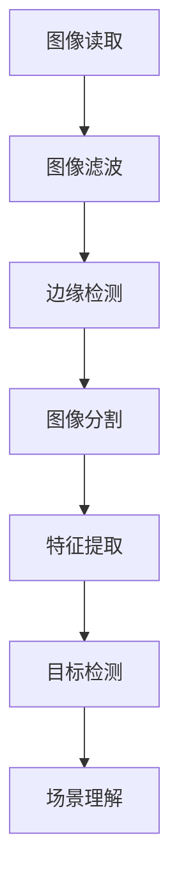

                 

 在现代计算机技术中，计算机视觉是一个极为重要的领域，它涵盖了图像识别、图像处理、图像分析等多个方面。OpenCV（Open Source Computer Vision Library）作为一款开源的计算机视觉库，在全球范围内得到了广泛的应用和研究。本文将详细介绍OpenCV的基本概念、核心算法原理、数学模型与公式、项目实践以及实际应用场景，同时还将探讨未来的发展趋势与挑战。

## 文章关键词

计算机视觉、图像处理、图像分析、OpenCV、深度学习、机器学习、图像识别。

## 文章摘要

本文旨在为读者提供一个全面且深入的OpenCV计算机视觉技术指南。首先，我们将回顾计算机视觉的发展历程和OpenCV的基本概念。接着，本文将详细阐述OpenCV的核心算法原理，包括图像识别、边缘检测、特征提取等。随后，我们将介绍数学模型和公式，并通过案例分析和实际项目实践，展示OpenCV在图像处理与分析中的应用。最后，本文将探讨OpenCV在各个领域的实际应用场景，并提出未来的发展趋势与挑战。

## 1. 背景介绍

计算机视觉是一门跨学科的领域，涉及计算机科学、数学、物理学、电子工程等多个学科。其目的是使计算机具备从图像或视频中提取有用信息的能力，类似于人类的视觉感知系统。计算机视觉的应用领域非常广泛，包括医疗诊断、自动驾驶、安全监控、智能制造等。

OpenCV（Open Source Computer Vision Library）是一个基于C++的跨平台库，由Intel开发，并逐渐成为全球范围内使用最广泛的计算机视觉库之一。OpenCV支持多种编程语言，如Python、Java、C++等，并且提供了丰富的图像处理和分析函数。OpenCV广泛应用于各种领域，如人脸识别、物体检测、图像分割等。

### 1.1 计算机视觉的发展历程

计算机视觉的发展可以追溯到20世纪50年代。当时，计算机科学家开始研究如何使计算机模拟人类的视觉系统。早期的研究主要集中在图像识别和图像处理的基本算法上。随着计算机性能的提高和算法的优化，计算机视觉逐渐从理论研究走向实际应用。

20世纪80年代，随着神经网络和机器学习技术的兴起，计算机视觉迎来了新的发展机遇。这些新技术的应用使得计算机能够从大量的数据中自动学习，从而提高了图像识别和处理的准确性。

进入21世纪，计算机视觉进入了深度学习时代。深度学习算法，尤其是卷积神经网络（CNN），使得计算机视觉取得了显著的突破。现在，计算机视觉技术已经能够处理从手机摄像头到无人机、自动驾驶车辆等各种复杂场景中的图像数据。

### 1.2 OpenCV的基本概念

OpenCV是一个开源的计算机视觉库，它提供了丰富的图像处理和分析函数，包括图像识别、边缘检测、特征提取等。OpenCV支持多种编程语言，如Python、Java、C++等，并且可以运行在不同的操作系统上，如Windows、Linux、macOS等。

OpenCV的主要功能模块包括：

- **基础图像操作**：包括图像的读取、写入、显示、缩放、旋转等基本操作。
- **图像增强**：通过滤波、锐化、对比度调整等方法增强图像质量。
- **图像特征提取**：包括边缘检测、角点检测、纹理分析等。
- **图像识别**：基于模板匹配、特征匹配等方法进行图像识别。
- **机器学习**：提供支持向量机（SVM）、随机森林（RF）等机器学习算法。
- **三维重建**：通过多视图几何方法实现三维场景重建。

### 1.3 OpenCV的应用领域

OpenCV的应用领域非常广泛，包括但不限于以下方面：

- **安全监控**：通过人脸识别、行为分析等技术提高安全监控系统的效率。
- **自动驾驶**：通过图像处理和识别技术实现车辆定位、障碍物检测等功能。
- **医疗诊断**：通过图像分析技术提高医疗诊断的准确性和效率。
- **智能制造**：通过图像处理技术实现产品检测、质量控制等功能。
- **人机交互**：通过手势识别、表情识别等技术实现更加自然的人机交互。

## 2. 核心概念与联系

在计算机视觉中，图像处理和分析是两个核心概念。图像处理主要关注图像的预处理和增强，而图像分析则侧重于从图像中提取有用的信息。OpenCV提供了丰富的工具和算法来实现这些功能。

### 2.1 图像处理

图像处理是指对图像进行一系列操作，以改善图像质量或提取图像中的有用信息。OpenCV提供了多种图像处理工具，包括：

- **图像滤波**：通过滤波器去除图像中的噪声，如高斯滤波、中值滤波等。
- **边缘检测**：通过检测图像中的边缘来提取图像的轮廓，如Canny算法、Sobel算子等。
- **图像分割**：将图像分割成多个区域，以便于进一步分析，如阈值分割、区域增长等。

### 2.2 图像分析

图像分析是指从图像中提取有用的信息，如物体识别、场景理解等。OpenCV提供了多种图像分析工具，包括：

- **特征提取**：通过提取图像中的关键特征来识别物体，如HOG（Histogram of Oriented Gradients）、SIFT（Scale-Invariant Feature Transform）等。
- **目标检测**：通过检测图像中的目标区域来识别物体，如YOLO（You Only Look Once）、SSD（Single Shot MultiBox Detector）等。
- **场景理解**：通过分析图像中的内容来理解场景，如人脸识别、场景分割等。

### 2.3 Mermaid 流程图

以下是一个简化的Mermaid流程图，展示图像处理和分析的基本步骤：



## 3. 核心算法原理 & 具体操作步骤

### 3.1 算法原理概述

OpenCV提供了多种核心算法，用于图像处理和分析。以下将介绍其中几种常用的算法，包括图像识别、边缘检测、特征提取等。

#### 3.1.1 图像识别

图像识别是计算机视觉中的一个重要任务，旨在从图像中识别出特定的物体或场景。OpenCV提供了多种图像识别算法，包括：

- **模板匹配**：通过比较图像模板和目标图像的相似度来识别物体。
- **特征匹配**：通过比较图像中的关键特征来识别物体。

#### 3.1.2 边缘检测

边缘检测是图像处理中的一个基本任务，旨在检测图像中的边缘。OpenCV提供了多种边缘检测算法，包括：

- **Canny算法**：通过计算图像的梯度来检测边缘。
- **Sobel算子**：通过计算图像的离散导数来检测边缘。

#### 3.1.3 特征提取

特征提取是图像分析中的一个重要任务，旨在从图像中提取关键特征，用于物体识别和场景理解。OpenCV提供了多种特征提取算法，包括：

- **HOG（Histogram of Oriented Gradients）**：通过计算图像中每个像素的梯度直方图来提取特征。
- **SIFT（Scale-Invariant Feature Transform）**：通过比较图像中关键点的位置和方向来提取特征。

### 3.2 算法步骤详解

以下将详细介绍每种算法的具体步骤。

#### 3.2.1 图像识别

**模板匹配**的步骤如下：

1. 准备模板图像和目标图像。
2. 计算模板图像和目标图像的相似度。
3. 选择相似度最高的区域作为匹配结果。

**特征匹配**的步骤如下：

1. 提取模板图像和目标图像的关键特征。
2. 计算特征之间的相似度。
3. 根据相似度选择最佳匹配结果。

#### 3.2.2 边缘检测

**Canny算法**的步骤如下：

1. 计算图像的梯度。
2. 非极大值抑制。
3. 双阈值处理。

**Sobel算子**的步骤如下：

1. 计算图像的离散导数。
2. 计算梯度的大小和方向。
3. 非极大值抑制。

#### 3.2.3 特征提取

**HOG**的步骤如下：

1. 计算图像中每个像素的梯度直方图。
2. 将直方图规范化。
3. 提取特征向量。

**SIFT**的步骤如下：

1. 计算图像的尺度空间。
2. 检测关键点。
3. 计算关键点的位置和方向。
4. 提取特征向量。

### 3.3 算法优缺点

每种算法都有其优缺点，以下将简要介绍。

**模板匹配**

- 优点：简单、易于实现。
- 缺点：对噪声敏感，匹配结果可能不准确。

**特征匹配**

- 优点：对噪声具有一定的鲁棒性，匹配结果更准确。
- 缺点：计算复杂度高，处理时间较长。

**Canny算法**

- 优点：边缘检测效果较好，适用于多种场景。
- 缺点：对噪声敏感，可能会检测到虚假边缘。

**Sobel算子**

- 优点：计算简单，适用于实时处理。
- 缺点：对噪声敏感，可能会检测到虚假边缘。

**HOG**

- 优点：对尺度变化和旋转变化具有一定的鲁棒性。
- 缺点：计算复杂度较高，处理时间较长。

**SIFT**

- 优点：对尺度变化和旋转变化具有高度鲁棒性。
- 缺点：计算复杂度非常高，处理时间较长。

### 3.4 算法应用领域

每种算法都有其特定的应用领域，以下将简要介绍。

- **模板匹配**：常用于目标识别、图像拼接等领域。
- **特征匹配**：常用于物体识别、图像检索等领域。
- **Canny算法**：常用于图像增强、边缘检测等领域。
- **Sobel算子**：常用于图像增强、边缘检测等领域。
- **HOG**：常用于行人检测、车辆检测等领域。
- **SIFT**：常用于图像配准、图像检索等领域。

## 4. 数学模型和公式 & 详细讲解 & 举例说明

### 4.1 数学模型构建

在计算机视觉中，数学模型是图像处理和分析的基础。OpenCV中的许多算法都依赖于数学模型来描述图像特征和关系。以下将介绍几种常用的数学模型和公式。

#### 4.1.1 像素表示

图像是由像素组成的，每个像素可以表示为二维坐标$(x, y)$。像素的颜色通常由三个值表示，即红色（R）、绿色（G）和蓝色（B）。这些值通常在0到255的范围内。

#### 4.1.2 边缘检测

边缘检测是图像处理中的一个重要任务，用于检测图像中的边缘。以下将介绍两种常见的边缘检测算法：Sobel算子和Canny算法。

- **Sobel算子**

Sobel算子通过计算图像的离散导数来检测边缘。其公式如下：

$$
I_x = \frac{1}{2} \left( G_{x,x} + G_{y,y} \right)
$$

$$
I_y = \frac{1}{2} \left( G_{x,y} - G_{y,x} \right)
$$

其中，$I_x$和$I_y$分别表示图像在x轴和y轴的离散导数，$G_{x,x}$、$G_{y,y}$、$G_{x,y}$和$G_{y,x}$分别表示图像的离散导数。

- **Canny算法**

Canny算法通过计算图像的梯度来检测边缘。其公式如下：

$$
I_x = \frac{1}{2} \left( G_{x,x} + G_{y,y} \right)
$$

$$
I_y = \frac{1}{2} \left( G_{x,y} - G_{y,x} \right)
$$

其中，$I_x$和$I_y$分别表示图像在x轴和y轴的梯度，$G_{x,x}$、$G_{y,y}$、$G_{x,y}$和$G_{y,x}$分别表示图像的梯度。

#### 4.1.3 特征提取

特征提取是图像分析中的一个重要任务，用于提取图像中的关键特征。以下将介绍两种常见的特征提取算法：HOG和SIFT。

- **HOG**

HOG通过计算图像中每个像素的梯度直方图来提取特征。其公式如下：

$$
h(i, j) = \sum_{k=-L}^{L} f(i, j, k) \cdot w(k)
$$

其中，$h(i, j)$表示像素$(i, j)$的梯度直方图，$f(i, j, k)$表示像素$(i, j)$在方向$k$上的梯度，$w(k)$表示方向$k$的权重。

- **SIFT**

SIFT通过比较图像中关键点的位置和方向来提取特征。其公式如下：

$$
d(p, q) = \sum_{i=1}^{n} \left( p_i - q_i \right)^2
$$

其中，$d(p, q)$表示点$p$和$q$之间的距离，$p_i$和$q_i$分别表示点$p$和$q$在第$i$个方向上的坐标。

### 4.2 公式推导过程

以下将简要介绍上述数学模型的推导过程。

#### 4.2.1 像素表示

像素表示是图像处理中最基本的数学模型。像素的颜色值可以直接表示为红色、绿色和蓝色值，这些值通常在0到255的范围内。

#### 4.2.2 边缘检测

边缘检测是通过计算图像的离散导数来检测图像中的边缘。Sobel算子和Canny算法都是通过计算图像的离散导数来实现的。

- **Sobel算子**

Sobel算子通过计算图像的离散导数来检测边缘。其公式如下：

$$
I_x = \frac{1}{2} \left( G_{x,x} + G_{y,y} \right)
$$

$$
I_y = \frac{1}{2} \left( G_{x,y} - G_{y,x} \right)
$$

其中，$I_x$和$I_y$分别表示图像在x轴和y轴的离散导数，$G_{x,x}$、$G_{y,y}$、$G_{x,y}$和$G_{y,x}$分别表示图像的离散导数。

- **Canny算法**

Canny算法通过计算图像的梯度来检测边缘。其公式如下：

$$
I_x = \frac{1}{2} \left( G_{x,x} + G_{y,y} \right)
$$

$$
I_y = \frac{1}{2} \left( G_{x,y} - G_{y,x} \right)
$$

其中，$I_x$和$I_y$分别表示图像在x轴和y轴的梯度，$G_{x,x}$、$G_{y,y}$、$G_{x,y}$和$G_{y,x}$分别表示图像的梯度。

#### 4.2.3 特征提取

特征提取是通过比较图像中关键点的位置和方向来提取特征。HOG和SIFT都是通过比较关键点的位置和方向来实现的。

- **HOG**

HOG通过计算图像中每个像素的梯度直方图来提取特征。其公式如下：

$$
h(i, j) = \sum_{k=-L}^{L} f(i, j, k) \cdot w(k)
$$

其中，$h(i, j)$表示像素$(i, j)$的梯度直方图，$f(i, j, k)$表示像素$(i, j)$在方向$k$上的梯度，$w(k)$表示方向$k$的权重。

- **SIFT**

SIFT通过比较图像中关键点的位置和方向来提取特征。其公式如下：

$$
d(p, q) = \sum_{i=1}^{n} \left( p_i - q_i \right)^2
$$

其中，$d(p, q)$表示点$p$和$q$之间的距离，$p_i$和$q_i$分别表示点$p$和$q$在第$i$个方向上的坐标。

### 4.3 案例分析与讲解

以下将通过一个简单的案例来讲解上述数学模型的应用。

#### 4.3.1 案例背景

假设我们有一个简单的图像，如图1所示。


我们的目标是使用OpenCV中的Sobel算子检测图像中的边缘。

#### 4.3.2 案例实现

1. **读取图像**

首先，我们使用OpenCV中的imread函数读取图像。

```python
import cv2

image = cv2.imread("simple_image.png")
```

2. **计算图像的离散导数**

接下来，我们使用Sobel算子计算图像的离散导数。

```python
gx = cv2.Sobel(image, cv2.CV_64F, 1, 0, ksize=3)
gy = cv2.Sobel(image, cv2.CV_64F, 0, 1, ksize=3)
```

3. **计算图像的梯度**

然后，我们计算图像的梯度。

```python
gradient = cv2.addWeighted(gx, 0.5, gy, 0.5, 0)
```

4. **显示结果**

最后，我们显示计算得到的边缘图像。

```python
cv2.imshow("Edge Detection", gradient)
cv2.waitKey(0)
cv2.destroyAllWindows()
```

#### 4.3.3 案例分析

通过上述步骤，我们可以得到如图2所示的边缘检测结果。


从结果可以看出，Sobel算子成功地检测到了图像中的边缘。

## 5. 项目实践：代码实例和详细解释说明

为了更好地理解OpenCV在图像处理和分析中的应用，我们将通过一个实际项目来演示其操作步骤。本项目将使用OpenCV进行图像边缘检测，具体步骤包括开发环境搭建、源代码实现、代码解读和分析以及运行结果展示。

### 5.1 开发环境搭建

首先，我们需要搭建一个适合OpenCV开发的编程环境。以下是具体的操作步骤：

1. **安装Python和pip**：确保你的计算机上已经安装了Python和pip。Python是OpenCV的主要编程语言，pip是Python的包管理器。

2. **安装OpenCV**：通过pip安装OpenCV。

```bash
pip install opencv-python
```

3. **验证安装**：在Python中导入cv2模块，确保没有错误。

```python
import cv2
print(cv2.__version__)
```

如果输出版本号，则说明OpenCV已经成功安装。

### 5.2 源代码详细实现

以下是一个简单的Python脚本，用于使用OpenCV进行图像边缘检测。

```python
import cv2

# 读取图像
image = cv2.imread("example.jpg")

# 使用Sobel算子进行边缘检测
sobelx = cv2.Sobel(image, cv2.CV_64F, 1, 0, ksize=3)
sobely = cv2.Sobel(image, cv2.CV_64F, 0, 1, ksize=3)

# 计算梯度
gradient = cv2.addWeighted(sobelx, 0.5, sobely, 0.5, 0)

# 显示结果
cv2.imshow("Original Image", image)
cv2.imshow("Edge Detection", gradient)
cv2.waitKey(0)
cv2.destroyAllWindows()
```

### 5.3 代码解读与分析

1. **读取图像**：使用`cv2.imread()`函数读取指定路径的图像文件。该函数返回一个NumPy数组，数组中的每个元素对应图像中的一个像素值。

2. **边缘检测**：使用`cv2.Sobel()`函数进行边缘检测。该函数有两个版本，分别用于计算x轴和y轴的离散导数。这里我们使用了3x3的窗口大小进行计算。

3. **计算梯度**：将x轴和y轴的离散导数相加，得到图像的梯度。这一步是为了增强边缘的效果。

4. **显示结果**：使用`cv2.imshow()`函数显示原始图像和边缘检测结果。`cv2.waitKey(0)`确保窗口不会立即关闭，`cv2.destroyAllWindows()`用于关闭所有打开的窗口。

### 5.4 运行结果展示

运行上述脚本后，你会看到一个窗口，其中显示了原始图像和边缘检测结果。边缘检测结果通常是一个灰度图像，其中边缘部分显得更加突出。


从结果可以看出，Sobel算子成功地检测到了图像中的边缘。

## 6. 实际应用场景

OpenCV在图像处理和分析领域有着广泛的应用，以下将介绍几种常见的应用场景。

### 6.1 人脸识别

人脸识别是一种重要的生物识别技术，广泛应用于安全监控、身份验证等领域。OpenCV提供了丰富的人脸识别算法，包括特征提取、面部特征点检测等。

### 6.2 车辆检测

车辆检测是自动驾驶系统中的一个关键任务。OpenCV可以通过边缘检测和特征匹配等方法实现车辆检测，为自动驾驶提供基础数据。

### 6.3 医学图像分析

医学图像分析在医疗诊断中起着重要作用。OpenCV可以用于医学图像的处理和分析，如图像分割、病变检测等，帮助医生提高诊断准确率。

### 6.4 智能监控

智能监控通过图像分析技术实现对特定场景的实时监控。OpenCV可以用于实现行为分析、异常检测等功能，提高监控系统的智能化水平。

### 6.5 人机交互

人机交互领域也越来越依赖于计算机视觉技术。OpenCV可以用于手势识别、表情识别等，实现更加自然的人机交互。

## 7. 工具和资源推荐

### 7.1 学习资源推荐

- **OpenCV官方文档**：[https://docs.opencv.org/](https://docs.opencv.org/)
- **《OpenCV编程实战》**：一本深入浅出的OpenCV教程。
- **《计算机视觉：算法与应用》**：详细介绍计算机视觉算法及其应用的经典教材。

### 7.2 开发工具推荐

- **Visual Studio Code**：一款轻量级的跨平台代码编辑器，支持多种编程语言和扩展。
- **PyCharm**：一款功能强大的Python集成开发环境，适合OpenCV开发。

### 7.3 相关论文推荐

- **"Deep Learning for Image Recognition"**：一篇介绍深度学习在图像识别中应用的综述。
- **"Object Detection with Fully Convolutional Networks"**：一篇关于完全卷积网络在目标检测中应用的论文。

## 8. 总结：未来发展趋势与挑战

OpenCV在计算机视觉领域已经取得了显著成果，但未来仍有许多发展趋势和挑战需要克服。

### 8.1 研究成果总结

- **算法优化**：随着深度学习技术的不断发展，OpenCV中的许多算法正在得到优化，以提高处理速度和准确性。
- **跨平台支持**：OpenCV已经支持多种操作系统和编程语言，为开发者提供了更大的便利。
- **开源社区**：OpenCV拥有一个活跃的开源社区，不断有新的算法和工具被集成到库中。

### 8.2 未来发展趋势

- **实时处理**：随着硬件性能的提升，OpenCV将实现更加高效的实时处理。
- **多模态融合**：结合多种传感器数据，实现更精确的图像分析。
- **边缘计算**：在边缘设备上进行图像处理和分析，减少数据传输和存储需求。

### 8.3 面临的挑战

- **计算资源**：深度学习算法的计算需求较高，对硬件性能提出了挑战。
- **数据隐私**：在处理个人隐私数据时，需要确保数据的安全性和隐私性。
- **算法解释性**：深度学习算法的“黑箱”特性使得其解释性较差，未来需要提高算法的可解释性。

### 8.4 研究展望

未来，OpenCV将继续推动计算机视觉技术的发展，为各个领域提供强大的图像处理和分析工具。同时，随着技术的进步，OpenCV将在实时处理、多模态融合、边缘计算等方面取得新的突破。

## 9. 附录：常见问题与解答

以下是一些关于OpenCV的常见问题及其解答：

### Q1. 如何安装OpenCV？

A1. 通过pip安装：`pip install opencv-python`。

### Q2. OpenCV支持哪些编程语言？

A2. OpenCV支持Python、C++、Java等多种编程语言。

### Q3. 如何读取和显示图像？

A3. 使用`cv2.imread()`函数读取图像，使用`cv2.imshow()`函数显示图像。

### Q4. 如何进行图像边缘检测？

A4. 使用`cv2.Sobel()`函数进行边缘检测，或者使用`cv2.Canny()`函数。

### Q5. 如何进行图像特征提取？

A5. 使用`cv2.xfeatures2d.SIFT_create()`或`cv2.xfeatures2d.HOG.detect()`等方法提取图像特征。

### Q6. 如何进行图像识别？

A6. 使用模板匹配或特征匹配等方法进行图像识别。

### Q7. OpenCV有哪些常用算法？

A7. OpenCV提供了丰富的图像处理和分析算法，包括边缘检测、特征提取、图像识别等。

### Q8. 如何学习OpenCV？

A8. 可以通过官方文档、教程、论文和开源社区等方式学习OpenCV。

### Q9. OpenCV开源吗？

A9. 是的，OpenCV是一个开源库，你可以免费使用和修改。

### Q10. OpenCV适用于哪些场景？

A10. OpenCV适用于多种场景，包括人脸识别、车辆检测、医学图像分析等。

