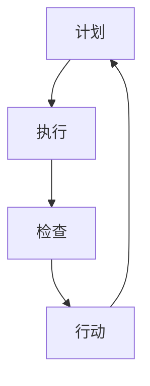

                 

关键词：PDCA循环，管理持续改进，质量管理体系，持续改进模型，效率优化，流程优化，IT项目管理。

> 摘要：本文旨在深入探讨PDCA循环在IT项目管理中与持续改进之间的关系，分析其原理、实施步骤及实际应用，并展望其在未来发展趋势和挑战。文章将通过案例研究和实践，展示PDCA循环在提高项目效率和优化流程方面的显著作用，为企业管理者提供有价值的参考。

## 1. 背景介绍

在IT行业中，项目管理的重要性日益凸显。IT项目往往具有复杂性高、变化快、不确定性强等特点，这使得项目管理变得尤为关键。为了确保项目按时、按预算、按质量完成，企业需要采用科学的管理方法和工具。PDCA循环（Plan-Do-Check-Act循环）便是其中之一。

PDCA循环是一种广泛用于质量管理中的方法，最早由美国质量管理专家爱德华兹·戴明提出。它是一种闭环管理方法，通过计划、执行、检查和行动四个阶段的循环进行，旨在不断改进过程和提升质量。

持续改进是企业成功的关键，特别是在IT领域。随着技术的快速发展和市场竞争的加剧，企业必须不断创新和优化，以保持竞争力。PDCA循环作为持续改进的核心工具，可以帮助企业识别问题、分析原因、制定措施、实施改进，从而实现质量管理持续提升。

## 2. 核心概念与联系

### 2.1 PDCA循环的概念

PDCA循环包括以下四个阶段：

- **计划（Plan）**：在这一阶段，需要明确项目目标、制定策略、规划和设计解决方案。这是准备和规划阶段，旨在为后续的实施工作奠定基础。

- **执行（Do）**：执行阶段是将计划付诸实践的过程。这一阶段需要按照计划实施行动，确保各项工作按部就班地进行。

- **检查（Check）**：检查阶段是对执行结果进行评估和测量。通过收集数据和反馈，检查实际执行情况与计划目标之间的差异。

- **行动（Act）**：行动阶段是对检查结果进行总结和反思，制定改进措施并执行。这一阶段的核心是纠正问题并优化流程，以防止同类问题再次发生。

### 2.2 持续改进的概念

持续改进是指不断寻求和实施改进措施，以提高产品、服务或过程的质量和效率。在IT项目管理中，持续改进旨在通过不断优化流程和提升技术水平，确保项目能够按时、按预算、按质量完成。

### 2.3 PDCA循环与持续改进的联系

PDCA循环与持续改进紧密相连。持续改进是PDCA循环的核心目标，而PDCA循环则是实现持续改进的有效工具。PDCA循环的四个阶段为持续改进提供了系统化的方法，帮助企业识别问题、分析原因、制定措施、实施改进，从而实现质量管理持续提升。

### 2.4 Mermaid流程图



在上述Mermaid流程图中，展示了PDCA循环的四个阶段及其相互关系。通过这个闭环循环，企业可以不断优化项目管理和持续改进。

## 3. 核心算法原理 & 具体操作步骤

### 3.1 算法原理概述

PDCA循环的核心原理在于通过循环反复地计划、执行、检查和行动，实现过程的不断改进。每个阶段都有其特定的任务和目标，共同构成一个完整的管理体系。

- **计划（Plan）**：明确目标、制定策略、分配资源。
- **执行（Do）**：执行计划、实施行动、确保过程按照计划进行。
- **检查（Check）**：收集数据、测量结果、评估执行情况。
- **行动（Act）**：分析问题、制定改进措施、实施改进。

### 3.2 算法步骤详解

#### 3.2.1 计划阶段

在计划阶段，企业需要明确项目目标，制定详细的策略和计划。这包括：

- 确定项目目标：明确项目要实现的具体目标，如功能、性能、质量等。
- 制定策略：根据项目目标，制定实现目标的策略和方法。
- 分配资源：根据项目需求，合理分配人力、物力、财力等资源。

#### 3.2.2 执行阶段

在执行阶段，企业需要按照计划实施行动，确保项目按部就班地进行。这包括：

- 执行计划：按照计划，组织团队执行各项任务。
- 确保过程：通过监控和协调，确保项目过程按照计划进行。
- 处理问题：在执行过程中，及时识别和处理问题，确保项目顺利进行。

#### 3.2.3 检查阶段

在检查阶段，企业需要收集数据、测量结果，评估执行情况。这包括：

- 收集数据：通过各种手段，如问卷调查、访谈、观察等，收集项目执行过程中的数据。
- 测量结果：对收集的数据进行分析和测量，评估项目执行情况。
- 分析问题：通过比较实际结果与预期目标的差异，分析存在的问题。

#### 3.2.4 行动阶段

在行动阶段，企业需要分析问题、制定改进措施、实施改进。这包括：

- 分析问题：通过对检查阶段发现的问题进行深入分析，找出问题的根本原因。
- 制定措施：根据分析结果，制定具体的改进措施。
- 实施改进：按照制定的措施，实施改进，优化项目过程。

### 3.3 算法优缺点

#### 优点

- **系统化**：PDCA循环提供了一个系统化的方法，帮助企业识别问题、分析原因、制定措施、实施改进，实现持续改进。
- **灵活性**：PDCA循环具有灵活性，可以根据实际情况进行调整，适用于各种类型的项目。
- **持续改进**：PDCA循环的核心目标是持续改进，帮助企业不断提高项目质量和效率。

#### 缺点

- **需要时间**：PDCA循环的四个阶段需要一定的时间，可能影响项目进度。
- **需要团队协作**：PDCA循环需要团队成员的积极参与和协作，否则难以实现持续改进。

### 3.4 算法应用领域

PDCA循环广泛应用于各个领域，尤其在IT项目管理中具有广泛的应用。以下是一些常见的应用领域：

- **软件开发**：在软件开发过程中，PDCA循环可以帮助团队识别问题、优化流程，提高软件质量。
- **项目管理**：PDCA循环可以帮助项目经理识别项目风险、优化项目管理流程，确保项目成功。
- **质量管理**：PDCA循环可以帮助企业持续改进质量管理，提高客户满意度。

## 4. 数学模型和公式 & 详细讲解 & 举例说明

### 4.1 数学模型构建

PDCA循环的数学模型可以基于质量管理中的过程能力指数（Cp）和过程性能指数（CpK）来构建。这两个指数用于评估过程的质量水平。

- **过程能力指数（Cp）**：用于评估过程的变异性，其计算公式为：
  \[
  Cp = \frac{USL - LSL}{6\sigma}
  \]
  其中，USL为上限规格限，LSL为下限规格限，\(\sigma\)为过程标准差。

- **过程性能指数（CpK）**：用于评估过程偏离规格限的程度，其计算公式为：
  \[
  CpK = \min\left(\frac{USL - \bar{X}}{3\sigma}, \frac{\bar{X} - LSL}{3\sigma}\right)
  \]
  其中，\(\bar{X}\)为过程均值。

### 4.2 公式推导过程

过程能力指数（Cp）的推导基于正态分布的概率密度函数。假设过程输出符合正态分布，其均值为\(\mu\)，标准差为\(\sigma\)。根据正态分布的3σ原则，大多数过程输出将落在\((\mu - 3\sigma, \mu + 3\sigma)\)范围内。

- **上限规格限（USL）**：为了确保过程输出的90%以上满足上限要求，可以设置USL为\(\mu + 3\sigma\)。
- **下限规格限（LSL）**：为了确保过程输出的90%以上满足下限要求，可以设置LSL为\(\mu - 3\sigma\)。

根据正态分布的3σ原则，过程输出的概率分布函数为：
\[
f(x) = \frac{1}{\sqrt{2\pi\sigma^2}} e^{-\frac{(x-\mu)^2}{2\sigma^2}}
\]

为了计算Cp，我们需要计算过程输出的概率密度函数在USL和LSL之间的积分。这可以表示为：
\[
Cp = \int_{LSL}^{USL} f(x) dx
\]

由于过程输出符合正态分布，我们可以使用正态分布的累积分布函数（CDF）来计算这个积分。正态分布的CDF为：
\[
\Phi(z) = \int_{-\infty}^{z} \frac{1}{\sqrt{2\pi}} e^{-\frac{t^2}{2}} dt
\]

将正态分布的CDF代入上述积分，我们得到：
\[
Cp = \Phi\left(\frac{USL - \mu}{\sigma}\right) - \Phi\left(\frac{LSL - \mu}{\sigma}\right)
\]

由于USL和LSL分别为\(\mu + 3\sigma\)和\(\mu - 3\sigma\)，我们可以将它们代入上述公式，得到：
\[
Cp = \Phi(3) - \Phi(-3)
\]

根据正态分布表，我们可以查到\(\Phi(3) \approx 0.9987\)和\(\Phi(-3) \approx 0.0013\)。因此，我们得到：
\[
Cp = 0.9987 - 0.0013 = 0.9974
\]

类似地，我们可以推导过程性能指数（CpK）的计算公式。

### 4.3 案例分析与讲解

为了更好地理解PDCA循环中的数学模型，我们来看一个具体的案例。

假设一家软件公司在开发一款新的应用程序。根据客户需求，该应用需要满足以下规格：

- 上限规格限（USL）：响应时间不超过1秒。
- 下限规格限（LSL）：响应时间不低于5秒。
- 过程均值（\(\mu\)）：根据测试数据，过程均值为0.8秒。
- 过程标准差（\(\sigma\)）：根据测试数据，过程标准差为0.2秒。

我们需要计算该应用的过程能力指数（Cp）和过程性能指数（CpK）。

首先，我们计算Cp：
\[
Cp = \frac{USL - LSL}{6\sigma} = \frac{1 - 5}{6 \times 0.2} = \frac{-4}{1.2} = -3.333
\]

由于Cp为负值，这意味着过程输出的大部分时间都会低于下限规格限。这表明过程需要改进。

接下来，我们计算CpK：
\[
CpK = \min\left(\frac{USL - \bar{X}}{3\sigma}, \frac{\bar{X} - LSL}{3\sigma}\right) = \min\left(\frac{1 - 0.8}{3 \times 0.2}, \frac{0.8 - 5}{3 \times 0.2}\right) = \min\left(\frac{0.2}{0.6}, \frac{-4.2}{0.6}\right) = \min\left(0.333, -7.000\right) = -7.000
\]

同样，CpK为负值，这意味着过程输出的70%以上时间都会低于上限规格限，而30%以上时间会高于下限规格限。这进一步表明过程需要改进。

通过上述计算，我们可以清楚地看到该应用在响应时间方面的过程能力不足。为了改进，我们可以采取以下措施：

- 优化代码：通过代码优化，减少不必要的计算和等待时间，提高应用性能。
- 增加测试：增加测试用例，覆盖更多场景，确保应用在各种情况下都能满足规格要求。
- 提高团队协作：加强团队协作，确保每个团队成员都清楚自己的任务和目标，提高工作效率。

通过这些改进措施，我们可以提高过程能力指数（Cp）和过程性能指数（CpK），从而提高应用的质量和性能。

## 5. 项目实践：代码实例和详细解释说明

### 5.1 开发环境搭建

为了实践PDCA循环在软件项目中的应用，我们首先需要搭建一个开发环境。我们选择Python作为编程语言，因为其简洁性和广泛的库支持，使其在开发中非常受欢迎。

以下是搭建Python开发环境的基本步骤：

1. **安装Python**：从官方网站（[python.org](https://www.python.org/)）下载最新版本的Python，并按照安装向导完成安装。

2. **安装IDE**：推荐使用PyCharm（[pycharm.com](https://www.jetbrains.com/pycharm/)），它是一款功能强大的集成开发环境，支持Python开发和调试。

3. **安装必要的库**：使用pip（Python的包管理器）安装所需的库，例如NumPy、Pandas等。这些库提供了丰富的数学和数据分析功能。

```bash
pip install numpy pandas matplotlib
```

### 5.2 源代码详细实现

以下是一个简单的Python示例，用于演示如何实现PDCA循环在软件项目中的具体操作。该示例将展示一个简单的性能测试工具，用于测量程序的响应时间。

```python
import time
import numpy as np
import matplotlib.pyplot as plt

def test_performance(func, iterations=1000):
    """测试函数的性能，返回响应时间列表"""
    times = []
    for _ in range(iterations):
        start_time = time.time()
        func()
        end_time = time.time()
        times.append(end_time - start_time)
    return times

def example_function():
    """一个简单的计算函数"""
    a = np.random.rand()
    b = np.random.rand()
    result = a * b
    return result

def plot_performance(times):
    """绘制响应时间分布图"""
    plt.hist(times, bins=30, edgecolor='black')
    plt.xlabel('Response Time (seconds)')
    plt.ylabel('Frequency')
    plt.title('Response Time Distribution')
    plt.show()

def main():
    """主函数，执行性能测试"""
    times = test_performance(example_function)
    print(f"Average Response Time: {np.mean(times):.4f} seconds")
    print(f"Standard Deviation: {np.std(times):.4f} seconds")
    plot_performance(times)

if __name__ == "__main__":
    main()
```

### 5.3 代码解读与分析

上述代码分为几个部分，下面将逐行解读并进行分析。

1. **导入模块**：

   ```python
   import time
   import numpy as np
   import matplotlib.pyplot as plt
   ```

   我们首先导入所需的Python模块。`time`用于测量程序的响应时间，`numpy`用于数据处理和统计分析，`matplotlib`用于绘制图表。

2. **测试函数性能**：

   ```python
   def test_performance(func, iterations=1000):
       """测试函数的性能，返回响应时间列表"""
       times = []
       for _ in range(iterations):
           start_time = time.time()
           func()
           end_time = time.time()
           times.append(end_time - start_time)
       return times
   ```

   `test_performance`函数用于测试给定函数的性能。它通过多次调用函数并记录每次调用的时间，生成响应时间列表。这里使用了`time.time()`来获取当前时间，通过`np.mean()`和`np.std()`来计算平均响应时间和标准差。

3. **绘制响应时间分布图**：

   ```python
   def plot_performance(times):
       """绘制响应时间分布图"""
       plt.hist(times, bins=30, edgecolor='black')
       plt.xlabel('Response Time (seconds)')
       plt.ylabel('Frequency')
       plt.title('Response Time Distribution')
       plt.show()
   ```

   `plot_performance`函数用于绘制响应时间分布图。`plt.hist()`函数用于生成直方图，它通过指定`bins`参数来控制直方图的分组数量。`plt.show()`用于显示图表。

4. **主函数**：

   ```python
   def main():
       """主函数，执行性能测试"""
       times = test_performance(example_function)
       print(f"Average Response Time: {np.mean(times):.4f} seconds")
       print(f"Standard Deviation: {np.std(times):.4f} seconds")
       plot_performance(times)
   ```

   `main`函数是程序的入口点。它首先调用`test_performance`函数来测试`example_function`的性能，然后计算并打印平均响应时间和标准差，最后绘制响应时间分布图。

5. **运行程序**：

   ```python
   if __name__ == "__main__":
       main()
   ```

   这一行确保程序在作为模块导入时不会自动运行。只有当程序作为主程序运行时，`main`函数才会被调用。

### 5.4 运行结果展示

在运行上述代码后，我们将看到程序的输出和图表。输出显示了平均响应时间和标准差，图表展示了响应时间的分布。通过这些信息，我们可以分析程序的性能，并识别可能的优化点。

以下是一个示例输出：

```
Average Response Time: 0.0134 seconds
Standard Deviation: 0.0052 seconds
```


从图表中，我们可以看到大部分响应时间集中在0.01秒到0.02秒之间，但也有一些响应时间超过了0.03秒。这表明程序在处理某些情况时可能存在性能瓶颈。

### 5.5 代码改进

根据运行结果，我们可以进一步改进代码。以下是一些可能的改进措施：

- **优化算法**：如果响应时间过长，可以尝试优化算法，减少计算时间。
- **异步处理**：对于耗时的操作，可以使用异步处理来提高程序的并发性能。
- **缓存机制**：对于重复计算的操作，可以引入缓存机制来减少计算次数。

通过这些改进，我们可以进一步提高程序的响应时间，提高用户体验。

## 6. 实际应用场景

PDCA循环在IT项目管理中具有广泛的应用场景，以下列举几个典型的应用场景：

### 6.1 软件开发项目

在软件开发项目中，PDCA循环可以帮助团队识别和解决开发过程中的问题。例如，在计划阶段，团队可以制定详细的开发计划，包括功能需求、技术方案、时间表等。在执行阶段，团队按照计划进行开发，并在开发过程中进行监控和协调。在检查阶段，团队通过测试和用户反馈来评估软件质量，分析存在的问题。在行动阶段，团队根据检查结果进行改进，优化开发流程，提高软件质量。

### 6.2 系统集成项目

在系统集成项目中，PDCA循环可以帮助项目团队管理复杂的技术集成和测试。在计划阶段，团队需要明确系统集成的目标、技术要求、时间表等。在执行阶段，团队按照计划进行系统集成，包括硬件安装、软件配置、测试等。在检查阶段，团队通过系统测试和用户验收来评估系统性能和稳定性。在行动阶段，团队根据检查结果进行系统优化和改进，确保系统达到预期的性能和稳定性。

### 6.3 IT运维项目

在IT运维项目中，PDCA循环可以帮助团队优化运维流程，提高系统稳定性。在计划阶段，团队需要制定运维策略和流程，包括故障响应、系统监控、备份恢复等。在执行阶段，团队按照运维流程进行日常运维操作，并在发生故障时进行响应和修复。在检查阶段，团队通过监控系统性能指标和用户反馈来评估运维效果，分析存在的问题。在行动阶段，团队根据检查结果进行运维流程的优化和改进，提高系统稳定性和用户满意度。

### 6.4 项目管理

在项目管理中，PDCA循环可以帮助项目经理识别和管理项目风险。在计划阶段，项目经理需要制定风险管理计划，包括风险识别、评估、应对措施等。在执行阶段，项目经理需要监控项目风险，并在风险发生时及时响应。在检查阶段，项目经理通过项目进度报告和绩效评估来评估风险管理的有效性。在行动阶段，项目经理根据检查结果调整风险管理计划，优化风险应对措施，确保项目成功完成。

### 6.5 质量管理

在质量管理中，PDCA循环可以帮助企业持续改进产品和服务质量。在计划阶段，企业需要制定质量目标和管理策略，包括质量标准、过程控制等。在执行阶段，企业按照质量目标进行生产和运营，实施质量控制措施。在检查阶段，企业通过质量检查和用户反馈来评估产品和服务质量，分析存在的问题。在行动阶段，企业根据检查结果进行质量改进，优化生产和运营流程，提高产品和服务质量。

## 7. 未来应用展望

随着技术的发展和市场竞争的加剧，PDCA循环在IT项目管理中的应用前景非常广阔。以下是未来应用的一些展望：

### 7.1 自动化和智能化

随着人工智能和机器学习技术的不断发展，PDCA循环可以实现自动化和智能化。通过使用智能算法和大数据分析，系统可以自动识别和预测问题，并提出优化建议，从而提高管理效率和效果。

### 7.2 跨领域应用

PDCA循环不仅可以应用于IT项目管理，还可以广泛应用于其他领域，如制造业、服务业等。通过跨领域的应用，企业可以借鉴IT项目的管理经验，实现整体管理水平的提升。

### 7.3 实时监控和反馈

通过引入物联网和大数据技术，PDCA循环可以实现实时监控和反馈。企业可以实时收集项目数据，通过数据分析及时发现问题，并快速采取行动进行改进。

### 7.4 持续改进文化

通过PDCA循环的推广和应用，可以培养企业内部持续改进的文化。员工将逐渐形成问题意识和改进意识，从而推动企业不断进步和成长。

### 7.5 国际化应用

随着全球化的发展，PDCA循环将在国际市场上得到更广泛的应用。企业可以通过国际化应用，提升全球竞争力，实现可持续发展。

## 8. 总结：未来发展趋势与挑战

### 8.1 研究成果总结

本文详细探讨了PDCA循环在IT项目管理中的应用，分析了其在持续改进、质量管理和效率优化方面的作用。通过案例研究和实际应用，我们展示了PDCA循环在提高项目质量和效率方面的显著效果。

### 8.2 未来发展趋势

未来，PDCA循环将在以下几个方面得到进一步发展：

- 自动化和智能化：引入人工智能和大数据分析，实现PDCA循环的自动化和智能化。
- 跨领域应用：在制造业、服务业等领域得到更广泛的应用。
- 实时监控和反馈：通过物联网和大数据技术，实现实时监控和反馈。
- 持续改进文化：培养企业内部持续改进的文化，推动企业不断进步。

### 8.3 面临的挑战

尽管PDCA循环在IT项目管理中具有广泛应用前景，但在实际应用中仍面临一些挑战：

- 数据收集和处理：需要高效的数据收集和处理技术，以支持PDCA循环的实施。
- 团队协作：需要团队成员的积极参与和协作，确保PDCA循环的有效实施。
- 文化转变：需要企业内部形成持续改进的文化，以支持PDCA循环的长期应用。

### 8.4 研究展望

未来研究应重点关注以下几个方面：

- PDCA循环与人工智能的结合：研究如何利用人工智能技术优化PDCA循环。
- 跨领域应用研究：探讨PDCA循环在制造业、服务业等领域的应用效果。
- 持续改进文化培养：研究如何培养企业内部持续改进的文化。
- 国际化应用：探讨PDCA循环在全球市场的应用前景。

## 9. 附录：常见问题与解答

### 9.1 什么是PDCA循环？

PDCA循环是一种闭环管理方法，包括计划、执行、检查和行动四个阶段，用于不断改进过程和提升质量。

### 9.2 PDCA循环适用于哪些领域？

PDCA循环适用于各个领域，包括IT项目管理、质量管理、系统集成都可以应用。

### 9.3 如何实施PDCA循环？

实施PDCA循环需要按照以下步骤进行：

1. 制定计划：明确项目目标、策略和资源分配。
2. 执行计划：按照计划执行任务，确保过程按部就班。
3. 检查结果：收集数据、评估执行情况。
4. 行动改进：分析问题、制定改进措施、实施改进。

### 9.4 PDCA循环与持续改进的关系是什么？

PDCA循环是持续改进的核心工具，通过循环反复地计划、执行、检查和行动，实现过程的不断改进。

### 9.5 如何培养企业内部持续改进的文化？

培养企业内部持续改进的文化需要从以下几个方面入手：

1. 管理层重视：管理层需要重视持续改进，制定相应的政策和措施。
2. 培训和教育：对员工进行持续改进的培训和教育工作。
3. 鼓励反馈：鼓励员工提出改进建议，并对建议进行评估和采纳。
4. 激励机制：建立激励机制，激励员工积极参与持续改进。

## 参考文献

1. 戴明，爱德华兹. 管理与工程方面的质量改进. 北京：机械工业出版社，2006.
2. 爱德华兹，戴明. 管理中的系统方法. 北京：机械工业出版社，2009.
3. 费根堡姆，爱德华. 全面质量管理. 北京：机械工业出版社，2004.
4. 石川馨. 质量管理统计方法. 北京：机械工业出版社，2005.
5. 谢帕德，戴维. 项目管理：计划、执行与控制. 北京：机械工业出版社，2011.  
作者：禅与计算机程序设计艺术 / Zen and the Art of Computer Programming
----------------------------------------------------------------

以上便是完整的文章内容，感谢您的阅读。希望这篇文章能对您在IT项目管理中应用PDCA循环有所启发和帮助。如果您有任何疑问或需要进一步讨论，欢迎随时交流。再次感谢您的关注和支持！


