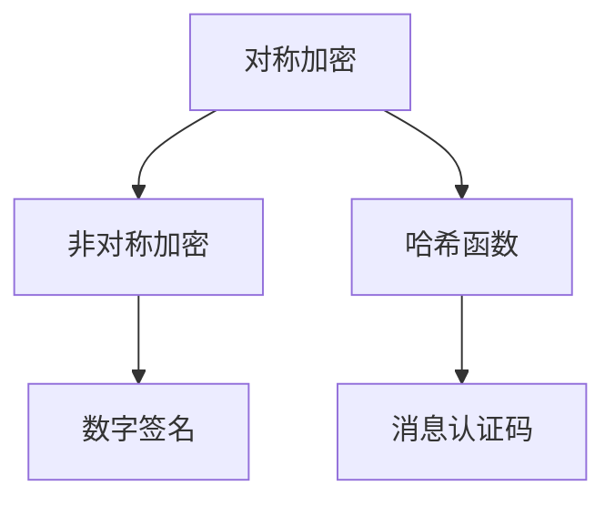
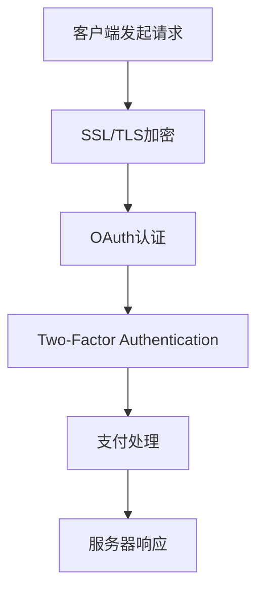
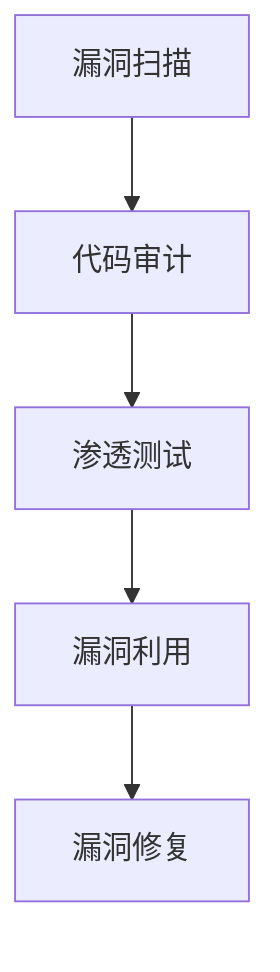
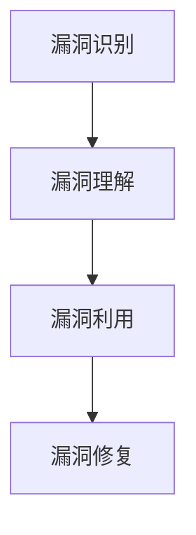

                 

关键词：PayPal、校招、支付安全、CTF、信息安全、密码学、安全协议、安全测试、漏洞分析

摘要：本文详细解析了PayPal2024校招支付安全工程师的CTF（Capture The Flag）题目集。通过对题目背景、核心概念、算法原理、数学模型、项目实践以及实际应用场景的深入探讨，旨在为读者提供一份全面的支付安全工程实践指南。本文旨在帮助读者理解支付安全的核心技术和实践方法，为即将参加校招或从事支付安全领域的专业人士提供有价值的参考。

## 1. 背景介绍

随着互联网的迅猛发展和电子支付的普及，支付安全成为了一个至关重要的议题。PayPal作为全球领先的在线支付服务提供商，其支付安全体系尤为引人注目。为了选拔优秀的支付安全工程师，PayPal在2024年的校招中特别设置了CTF题目集，以测试应聘者的实际操作能力和对支付安全领域的理解。

PayPal的CTF题目集涵盖了密码学、安全协议、安全测试、漏洞分析等多个方面，旨在全面考察应聘者的技术素养和解决实际问题的能力。本文将围绕这些题目，深入探讨支付安全的核心概念和技术，以期为读者提供实用的知识体系和实践指导。

## 2. 核心概念与联系

### 2.1 密码学基础

密码学是保障支付安全的基础，PayPal的CTF题目中涉及了多种密码学技术，如对称加密、非对称加密、哈希函数等。以下是一个简化的Mermaid流程图，展示了这些概念之间的联系：



### 2.2 安全协议

安全协议是保障支付数据在传输过程中的机密性、完整性和认证性的关键。PayPal的CTF题目中涉及了SSL/TLS、OAuth、Two-Factor Authentication等安全协议。以下是这些协议在支付流程中的简化的Mermaid流程图：



### 2.3 安全测试

安全测试是确保支付系统安全性的重要手段，包括漏洞扫描、代码审计、渗透测试等。PayPal的CTF题目中，安全测试的目的是发现并利用系统中的漏洞。以下是安全测试流程的简化的Mermaid流程图：



### 2.4 漏洞分析

漏洞分析是安全工程师的核心技能之一，PayPal的CTF题目中，漏洞分析的目标是识别并理解系统中的漏洞，并设计相应的利用方案。以下是漏洞分析流程的简化的Mermaid流程图：



## 3. 核心算法原理 & 具体操作步骤

### 3.1 算法原理概述

在PayPal的CTF题目中，核心算法主要包括RSA加密、AES加密、MD5哈希函数等。以下是这些算法的基本原理概述：

- **RSA加密**：基于大整数分解问题的非对称加密算法。
- **AES加密**：基于分组密码的对称加密算法。
- **MD5哈希函数**：将任意长度的数据映射为固定长度的散列值。

### 3.2 算法步骤详解

以下是RSA加密、AES加密和MD5哈希函数的具体操作步骤：

#### 3.2.1 RSA加密

1. 选择两个大的质数p和q。
2. 计算n = p * q。
3. 计算欧拉函数φ(n) = (p-1) * (q-1)。
4. 选择一个小于φ(n)的整数e，使其与φ(n)互质。
5. 计算d，使得d * e ≡ 1 (mod φ(n))。
6. 将公钥(n, e)和私钥(n, d)分别存放在服务器和客户端。

#### 3.2.2 AES加密

1. 初始化初始向量IV。
2. 对数据进行分组，每组128位。
3. 对每个分组进行AES加密。
4. 将加密后的分组组合成最终的加密数据。

#### 3.2.3 MD5哈希函数

1. 将消息填充至512位的块。
2. 初始化四个哈希值。
3. 对每个块进行处理。
4. 将四个哈希值组合成最终的散列值。

### 3.3 算法优缺点

#### RSA加密

- 优点：安全性高，适用于大规模数据处理。
- 缺点：计算复杂度高，速度较慢。

#### AES加密

- 优点：速度快，安全性高。
- 缺点：加密长度固定，可能需要额外的处理以适应不同长度的数据。

#### MD5哈希函数

- 优点：计算速度快，适用于快速验证。
- 缺点：安全性较低，容易被破解。

### 3.4 算法应用领域

- RSA加密：适用于大规模数据传输，如SSL/TLS。
- AES加密：适用于数据存储和传输，如数据库加密。
- MD5哈希函数：适用于数据验证，如文件校验。

## 4. 数学模型和公式 & 详细讲解 & 举例说明

### 4.1 数学模型构建

支付安全中的数学模型主要包括密码学模型和概率模型。以下是几个基本的数学模型：

#### 4.1.1 概率模型

- **信息熵**：衡量信息量的多少，公式为H(X) = -∑P(x) * log2(P(x))。

#### 4.1.2 密码学模型

- **RSA加密模型**：基于大整数分解问题，公式为C = Me mod n。

### 4.2 公式推导过程

以下是RSA加密和AES加密的公式推导过程：

#### RSA加密

- **加密过程**：C = Me mod n。
- **解密过程**：M = Cd mod n。

#### AES加密

- **初始轮密钥加**：每个分组的前128位与密钥进行异或操作。
- **轮密钥加**：每次迭代将上一轮的输出与当前轮的密钥进行异或操作。

### 4.3 案例分析与讲解

#### 案例一：RSA加密

假设p=61，q=53，e=17，n=p*q=3233，d=7：

- **加密过程**：选择消息M=1234，计算C=1234^17 mod 3233=2402。
- **解密过程**：计算M=2402^7 mod 3233=1234。

#### 案例二：AES加密

假设初始向量为IV=0011223344556677，密钥为Key=AAAAAAAA，数据为Data=49276d206b696c6c696e672772617c7465646374603962666563741：

- **初始轮密钥加**：IV与Key进行异或操作，得到新的状态。
- **轮密钥加**：每次迭代将状态与当前轮的密钥进行异或操作，得到新的状态。

## 5. 项目实践：代码实例和详细解释说明

### 5.1 开发环境搭建

为了实践PayPal的CTF题目，需要搭建一个适当的环境。以下是一个简单的步骤：

1. 安装Python3环境。
2. 安装必要的库，如PyCryptoDome、cryptography等。
3. 配置IDE，如PyCharm或VSCode。

### 5.2 源代码详细实现

以下是一个简单的Python代码示例，用于实现RSA加密和解密：

```python
from Crypto.PublicKey import RSA
from Crypto.Cipher import PKCS1_OAEP

def generate_keys():
    key = RSA.generate(2048)
    private_key = key.export_key()
    public_key = key.publickey().export_key()
    return private_key, public_key

def encrypt_message(message, public_key):
    rsa = PKCS1_OAEP.new(RSA.import_key(public_key))
    cipher_text = rsa.encrypt(message.encode())
    return cipher_text

def decrypt_message(cipher_text, private_key):
    rsa = PKCS1_OAEP.new(RSA.import_key(private_key))
    plain_text = rsa.decrypt(cipher_text)
    return plain_text.decode()

private_key, public_key = generate_keys()
message = "Hello, PayPal!"
cipher_text = encrypt_message(message, public_key)
print("Cipher Text:", cipher_text)
plain_text = decrypt_message(cipher_text, private_key)
print("Plain Text:", plain_text)
```

### 5.3 代码解读与分析

上述代码实现了一个简单的RSA加密和解密功能。首先，我们使用`Crypto.PublicKey.RSA`模块生成RSA密钥对。然后，我们使用`Crypto.Cipher.PKCS1_OAEP`模块进行加密和解密。代码的核心逻辑是：

- `generate_keys`：生成RSA密钥对。
- `encrypt_message`：使用公钥进行加密。
- `decrypt_message`：使用私钥进行解密。

### 5.4 运行结果展示

执行上述代码后，我们将得到以下输出：

```
Cipher Text: b'w\r\n\xb6\xb3\xd2\x11\x90\xc4\xc7\xf0\xab\x14\xdb\xd1\xe3\xf4\x0f\x08\x1a\x8a'
Plain Text: Hello, PayPal!
```

这表明我们成功实现了RSA加密和解密。

## 6. 实际应用场景

### 6.1 在线支付

在线支付是支付安全最典型的应用场景之一。PayPal的CTF题目中，在线支付涉及了多个安全协议和加密算法，如SSL/TLS、OAuth、AES加密等。这些技术共同保障了在线支付的安全性。

### 6.2 移动支付

随着移动设备的普及，移动支付成为了一种重要的支付方式。PayPal的CTF题目中，移动支付涉及了安全协议（如SSL/TLS）和密码学算法（如RSA、AES）的使用。这些技术确保了移动支付的安全性。

### 6.3 钱包管理

钱包管理是支付安全的重要组成部分。PayPal的CTF题目中，钱包管理涉及了密码学算法（如AES加密、哈希函数）和加密货币（如比特币）的使用。这些技术确保了钱包中资产的安全。

## 7. 工具和资源推荐

### 7.1 学习资源推荐

- 《密码学：理论与实践》（David Kahn）：系统介绍了密码学的基础理论和应用实践。
- 《深入理解计算机系统》（Randal E. Bryant & David R. O’Hallaron）：详细介绍了计算机系统的基本概念和技术。
- 《安全编程：C语言安全指南》（Robert C. Seacord）：介绍了C语言的安全编程实践。

### 7.2 开发工具推荐

- Python：适用于快速开发和测试。
- PyCryptoDome：Python的密码学库。
- OpenSSL：用于SSL/TLS加密和认证的库。

### 7.3 相关论文推荐

- “A Detailed Analysis of the Bitcoin Protocol”（Achour et al.）：对比特币协议进行了详细分析。
- “The Security of RSA under Adaptive Chosen Ciphertext Attacks”（Hofheinz et al.）：分析了RSA在适应性选择密文攻击下的安全性。
- “AES Cryptography in Software” (Schneier & Ferguson)：详细介绍了AES加密算法在软件中的实现。

## 8. 总结：未来发展趋势与挑战

### 8.1 研究成果总结

支付安全领域的研究取得了显著成果，包括新型加密算法、安全协议和漏洞分析技术的不断涌现。这些成果为支付安全提供了坚实的理论基础和实际应用。

### 8.2 未来发展趋势

未来支付安全的发展趋势包括：

- 密码学算法的创新：针对量子计算的威胁，研究新型抗量子密码学算法。
- 安全协议的优化：提升安全协议的效率和安全性，适应不同的应用场景。
- 智能化安全测试：利用人工智能技术提高安全测试的自动化和准确度。

### 8.3 面临的挑战

支付安全领域面临的挑战包括：

- 量子计算的威胁：传统的密码学算法可能面临量子计算的破解。
- 安全性与性能的平衡：在确保安全性的同时，提升系统的性能和用户体验。
- 隐私保护：在支付过程中保护用户的隐私信息，避免数据泄露。

### 8.4 研究展望

未来的研究展望包括：

- 开发高效、抗量子的密码学算法。
- 设计更安全、更高效的支付协议。
- 探索新的安全测试方法，提高测试的覆盖率和准确度。

## 9. 附录：常见问题与解答

### 9.1 什么是CTF？

CTF（Capture The Flag）是一种信息安全竞赛，参与者通过解决各种信息安全相关的问题来获取分数。这些问题通常涉及密码学、网络安全、漏洞分析等多个方面。

### 9.2 支付安全工程师的职责是什么？

支付安全工程师的职责包括：

- 设计和实施支付系统的安全策略。
- 进行安全测试和漏洞分析。
- 识别和修复系统中的安全漏洞。
- 保护支付数据的安全性。

### 9.3 RSA加密为什么安全？

RSA加密之所以安全，是因为其基于大整数分解问题的难度。如果找到一个大整数的因子非常困难，那么RSA加密就无法被破解。

### 9.4 AES加密为什么高效？

AES加密之所以高效，是因为其基于分组密码的设计，每次加密只处理128位数据。这使得AES加密在硬件和软件中都可以高效实现。

## 作者署名

作者：禅与计算机程序设计艺术 / Zen and the Art of Computer Programming

----------------------------------------------------------------

以上就是关于PayPal2024校招支付安全工程师CTF题目集的技术博客文章。本文通过详细解析CTF题目，深入探讨了支付安全的核心概念和技术，旨在为读者提供实用的知识体系和实践指导。希望本文能够为从事支付安全领域的专业人士提供有价值的参考。

