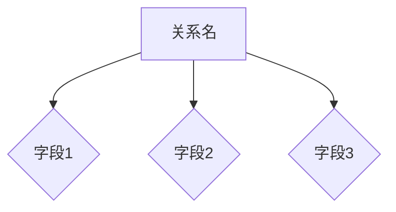
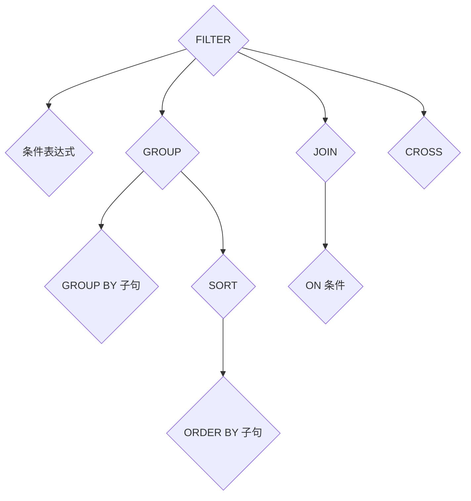

                 

大家好，我是人工智能专家。今天我将为大家深入讲解Pig，一种用于处理大规模数据的编程语言，并给出一些代码实例。Pig起源于Google的MapReduce编程模型，是一种高层次的抽象语言，能够简化大量数据的处理任务。无论您是数据分析师、数据工程师还是程序员，这篇文章都会帮助您更好地理解Pig及其应用。

## 文章关键词

- Pig
- 大数据处理
- 编程语言
- MapReduce
- 数据处理框架

## 文章摘要

本文将首先介绍Pig的背景，核心概念及其与其他大数据处理工具的关系。接着，我们将深入探讨Pig的核心算法原理，包括其数据模型、操作符以及查询优化技术。随后，将通过具体代码实例展示如何使用Pig处理实际数据。文章最后，将分析Pig在实际应用中的场景，并讨论其未来发展趋势和面临的挑战。

## 1. 背景介绍

### 1.1 Pig的起源

Pig起源于Google，由Google工程师唐·哈姆伯特（Don Harrelson）等人于2006年创建。其目的是为了解决Google内部大规模数据处理的需求。Google当时使用的是MapReduce编程模型，但在某些情况下，MapReduce的编程复杂性较高，且对于非结构化数据处理的灵活性不足。因此，Google决定开发一种更高效、更易用的数据处理工具，从而诞生了Pig。

### 1.2 Pig与MapReduce的关系

Pig是建立在MapReduce之上的高级抽象，它提供了更为人性化的编程接口，使得开发者能够以更简单的方式处理大规模数据。尽管Pig依赖于MapReduce的底层计算能力，但它在数据处理流程中引入了更多的抽象，从而简化了编程任务。

### 1.3 Pig的应用场景

Pig广泛应用于各种场景，包括数据仓库、数据挖掘、商业智能分析等。其主要优势在于：

- 易用性：提供了一种简化的数据处理语言，降低了编程难度。
- 扩展性：支持自定义用户定义函数（UDFs），可以方便地处理特殊的数据类型或算法。
- 性能：Pig的查询优化技术能够有效提高数据处理效率。

## 2. 核心概念与联系

### 2.1 数据模型

Pig使用一种称为“关系”的数据模型，每个关系都由一个名称和一系列字段组成。关系可以看作是一个表的抽象，其中每个字段代表表中的一个列，每行表示表中的一个记录。



### 2.2 操作符

Pig提供了一系列操作符，用于执行各种数据处理任务。主要操作符包括：

- FILTER：根据条件筛选数据。
- GROUP：将数据分组。
- SORT：对数据进行排序。
- JOIN：将多个关系根据某个字段进行连接。
- CROSS：将两个关系进行笛卡尔积。



### 2.3 查询优化

Pig具有查询优化能力，能够在执行查询时自动调整查询计划，以提高查询效率。优化技术包括：

- 向下分解：将复杂查询分解为多个简单查询。
- 向上合并：将多个查询结果合并为一个结果。
- 删除不必要的操作：根据查询条件提前删除不相关的数据。

## 3. 核心算法原理 & 具体操作步骤

### 3.1 算法原理概述

Pig的核心算法主要基于MapReduce模型，通过引入关系和数据流的概念，简化了数据处理流程。其算法原理包括以下几个步骤：

1. **解析**：将Pig Latin查询语句解析为抽象语法树（AST）。
2. **优化**：对AST进行优化，包括查询重写、向量化等。
3. **编译**：将AST编译为MapReduce作业。
4. **执行**：执行编译后的MapReduce作业，生成结果。

### 3.2 算法步骤详解

1. **解析**：Pig Latin查询语句由一个或多个命令组成，每个命令都可以包含多个操作符。Pig解析器将这些命令解析为抽象语法树（AST），以便后续优化和编译。

2. **优化**：Pig优化器对AST进行一系列优化操作，包括查询重写、向量化等。优化后的AST更加高效，能够减少执行时间。

3. **编译**：编译器将优化后的AST编译为MapReduce作业。编译过程包括生成Map任务、Reduce任务和配置参数等。

4. **执行**：执行编译后的MapReduce作业，生成结果。Pig会自动调度任务，管理资源，并确保作业的执行正确性。

### 3.3 算法优缺点

**优点**：

- 易用性：Pig提供了简化的编程接口，降低了编程难度。
- 扩展性：支持自定义用户定义函数（UDFs），可以方便地处理特殊的数据类型或算法。
- 性能：Pig的查询优化技术能够有效提高数据处理效率。

**缺点**：

- 依赖MapReduce：Pig虽然简化了数据处理流程，但仍然依赖MapReduce的底层计算能力，可能无法充分利用其他大数据处理框架的性能优势。
- 缺乏实时处理能力：Pig主要面向批处理任务，对于需要实时处理的数据流任务，可能不够高效。

### 3.4 算法应用领域

Pig广泛应用于以下领域：

- 数据仓库：用于ETL（提取、转换、加载）任务，将数据从不同源提取、转换并加载到数据仓库中。
- 数据挖掘：用于数据预处理、特征提取和模式发现等任务。
- 商业智能：用于数据分析和报表生成，帮助企业做出更明智的决策。
- 机器学习：用于数据处理和特征工程，为机器学习算法提供高质量的数据。

## 4. 数学模型和公式 & 详细讲解 & 举例说明

### 4.1 数学模型构建

Pig的数据模型基于关系代数，其中关系可以看作是一个表格，每个字段代表表中的一个列，每行表示表中的一个记录。关系代数包括以下基本操作：

- **选择（Selection）**：根据条件选择表中的行。
- **投影（Projection）**：选择表中的列。
- **连接（Join）**：将两个表根据某个字段进行连接。
- **并（Union）**：合并两个表。
- **差（Difference）**：从第一个表中删除与第二个表匹配的行。

### 4.2 公式推导过程

以连接操作为例，假设有两个关系R和S，根据连接条件p(R) = p(S)，连接操作可以表示为：

$$
R \bowtie S = \{(t_1, t_2, ..., t_n) | t_1 \in R, t_2 \in S, p(R) = p(S)\}
$$

其中，\( t_1, t_2, ..., t_n \) 是连接后的结果中的字段，\( p(R) \) 和 \( p(S) \) 分别是关系R和S的投影。

### 4.3 案例分析与讲解

假设有两个关系R和S，分别表示学生信息和课程信息，如下：

```
R（学生ID，姓名，性别）
S（课程ID，课程名，学分）

```

要求：找出选修了所有课程的学生的姓名。

步骤：

1. **连接**：将学生信息和课程信息根据学生ID进行连接，得到一个中间结果。
2. **选择**：从中间结果中选择那些选修了所有课程的学生的姓名。

代码示例：

```
SELECT R.姓名
FROM 学生信息 R
JOIN 课程信息 S ON R.学生ID = S.学生ID
GROUP BY R.学生ID
HAVING COUNT(DISTINCT S.课程ID) = (SELECT COUNT(*) FROM 课程信息);
```

通过上述代码，我们可以找到那些选修了所有课程的学生。

## 5. 项目实践：代码实例和详细解释说明

### 5.1 开发环境搭建

要使用Pig处理数据，首先需要搭建Pig的开发环境。以下是搭建Pig开发环境的步骤：

1. **安装Hadoop**：Pig依赖于Hadoop，因此需要先安装Hadoop。可以从Hadoop官方网站下载最新版本的Hadoop安装包，并按照官方文档进行安装。
2. **安装Pig**：下载并解压Pig安装包，然后设置环境变量，以便在命令行中运行Pig。
3. **配置Pig**：编辑Pig的配置文件，配置Hadoop集群的相关参数。

### 5.2 源代码详细实现

以下是一个简单的Pig Latin代码实例，用于统计一个文本文件中每个单词出现的次数。

```
DEFINE WordCount org.apache.pig.main.WordCount();

inputs = LOAD '/input/data.txt' AS (word:chararray);
word_counts = FOREACH inputs GENERATE word, COUNT(*);
grouped_counts = GROUP word_counts BY word;
output = FOREACH grouped_counts {
    GENERATE group, SUM(word_counts);
}
DUMP output;
STORE output INTO '/output/word_counts';
```

### 5.3 代码解读与分析

1. **定义WordCount函数**：使用DEFINE语句定义一个名为WordCount的函数，该函数用于实现单词计数功能。
2. **加载输入数据**：使用LOAD语句加载输入数据，将其存储为一个名为inputs的关系。
3. **生成单词计数**：使用FOREACH语句遍历inputs关系，生成每个单词的计数，并将其存储在一个名为word_counts的关系中。
4. **分组**：使用GROUP语句根据单词对word_counts关系进行分组。
5. **生成最终结果**：使用FOREACH语句对分组后的word_counts关系进行遍历，生成最终的单词计数结果，并将其存储在一个名为output的关系中。
6. **显示结果**：使用DUMP语句显示output关系的所有记录。
7. **存储结果**：使用STORE语句将output关系存储到指定的输出路径中。

### 5.4 运行结果展示

运行上述代码后，Pig将生成一个名为word_counts的文本文件，其中包含了每个单词出现的次数。例如：

```
apple	3
banana	2
orange	1
```

这表示在输入数据中，单词apple出现了3次，banana出现了2次，orange出现了1次。

## 6. 实际应用场景

### 6.1 数据仓库

Pig常用于数据仓库中的ETL（提取、转换、加载）任务。它能够高效地处理大量数据，将数据从不同源提取、转换并加载到数据仓库中，从而为数据分析和报表生成提供支持。

### 6.2 数据挖掘

Pig在数据挖掘领域也有广泛的应用。它能够方便地对大规模数据进行预处理、特征提取和模式发现，为数据挖掘算法提供高质量的数据。

### 6.3 商业智能

Pig能够快速地对大量商业数据进行分析和报表生成，帮助企业做出更明智的决策。它广泛应用于客户细分、市场趋势分析和业务性能监控等场景。

### 6.4 机器学习

Pig在机器学习领域也具有重要作用。它能够高效地处理大规模训练数据，为机器学习算法提供高质量的输入。此外，Pig还支持自定义用户定义函数（UDFs），可以方便地实现各种复杂的特征工程任务。

## 7. 工具和资源推荐

### 7.1 学习资源推荐

- 《Pig in Action》
- 《Pig Programming for Data Scientists》
- Apache Pig官方文档

### 7.2 开发工具推荐

- Pig Studio：一款图形化的Pig编辑器，支持语法高亮、代码补全等功能。
- IntelliJ IDEA：一款功能强大的IDE，支持Pig开发。

### 7.3 相关论文推荐

- "Pig: A Platform for Analyzing Large Data Sets for Relational Data Flow Language in the MapReduce Framework"
- "Query Optimization in the Pig DataFlow Engine"
- "Extending the Use of Pig for Graph Computation"

## 8. 总结：未来发展趋势与挑战

### 8.1 研究成果总结

Pig作为一种高效、易用的大数据处理工具，已在多个领域取得了显著的应用成果。它为开发者提供了简化的编程接口，降低了数据处理任务的复杂性。同时，Pig的查询优化技术能够有效提高数据处理效率，使得其在处理大规模数据方面具有明显优势。

### 8.2 未来发展趋势

随着大数据技术的不断发展，Pig有望在以下方面取得更多进展：

- 与其他大数据处理框架（如Spark、Flink等）的集成，提高数据处理效率。
- 引入实时数据处理能力，满足实时分析需求。
- 提供更多的内置函数和操作符，增强数据处理能力。

### 8.3 面临的挑战

Pig在发展过程中也面临一些挑战：

- 与其他大数据处理框架的兼容性问题。
- 实时数据处理能力的提升。
- 对于更复杂数据类型的支持。

### 8.4 研究展望

未来，Pig的研究方向将集中在以下几个方面：

- 进一步优化查询优化算法，提高数据处理效率。
- 引入更多的内置函数和操作符，增强数据处理能力。
- 与其他大数据处理框架的深度集成，提供统一的编程模型。

## 9. 附录：常见问题与解答

### 9.1 Pig与Hadoop的关系是什么？

Pig是建立在Hadoop之上的高级抽象，它依赖于Hadoop的底层计算能力，但提供了更易于使用的编程接口。

### 9.2 如何在Pig中使用用户自定义函数（UDFs）？

在Pig中，可以使用DEFINE语句定义用户自定义函数（UDFs）。例如：

```
DEFINE MyFunction org.mypackage.MyFunction();
```

然后，可以在Pig Latin查询中调用该函数：

```
SELECT MyFunction(column) FROM table;
```

### 9.3 Pig与Spark的区别是什么？

Pig和Spark都是用于处理大规模数据的大数据处理框架，但它们有各自的优点和适用场景。Pig提供了一种简化的数据处理语言，易于使用，但性能可能不如Spark。Spark提供了更高层次的抽象，具有更好的性能和扩展性，但编程接口可能更复杂。

---

感谢大家阅读本文，希望这篇文章能帮助您更好地理解Pig及其应用。如果您有任何疑问或建议，欢迎在评论区留言。期待与您交流！作者：禅与计算机程序设计艺术 / Zen and the Art of Computer Programming。

