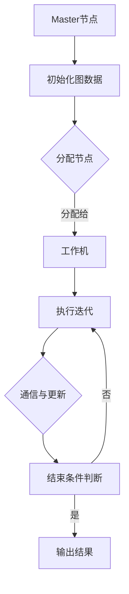

                 

本文旨在深入探讨Pregel原理及其应用，通过详细的代码实例讲解，帮助读者理解和掌握这一分布式图处理框架的核心机制。关键词包括：Pregel、分布式计算、图处理、算法原理、代码实例。

## 摘要

Pregel是一种用于大规模图处理的分布式计算框架，它提供了一个简单但强大的模型来处理复杂图问题。本文将首先介绍Pregel的基本概念和架构，随后详细解释其核心算法原理和具体操作步骤，并通过实际代码实例展示其应用。最后，我们将探讨Pregel在各个领域的应用前景，以及面临的挑战和未来发展方向。

## 1. 背景介绍

### 1.1 Pregel的起源

Pregel是由Google在2010年提出的一种分布式图处理框架。其目的是为了解决大规模图处理问题，例如社交网络分析、网页排名和推荐系统等。Pregel的设计目标是实现高效、可扩展和容错的图处理。

### 1.2 分布式计算与图处理

分布式计算是一种将任务分布在多台计算机上执行的计算模式。这种模式能够提高计算速度和处理大量数据的能力。图处理是一种用于分析图结构数据的算法和方法，它广泛应用于社交网络、网络图、生物信息学和交通网络等领域。

### 1.3 Pregel的优势

Pregel具有以下优势：

1. **易用性**：Pregel提供了一个简单的模型来表示图和执行图算法，这使得开发人员可以更容易地实现和优化复杂的图处理任务。
2. **可扩展性**：Pregel能够处理大规模的图数据，通过分布式计算模型，它能够高效地扩展到多台计算机上。
3. **容错性**：Pregel提供了自动故障检测和恢复机制，确保了系统的稳定性和可靠性。

## 2. 核心概念与联系

### 2.1 Pregel的模型

Pregel的核心模型由两个主要部分组成：图（Graph）和工作机（Worker）。

- **图**：Pregel中的图是一个无向图，其中每个节点（Vertex）都可以有自己的属性和边（Edge）。
- **工作机**：Pregel中的工作机是执行图算法的实体。每个工作机都负责处理一部分图数据，并在与其他工作机通信后更新自己的状态。

### 2.2 Pregel的架构

Pregel的架构包括以下几个关键组件：

- **Master节点**：Master节点负责初始化图数据和工作机，并分配图中的节点给工作机。
- **工作机**：工作机负责执行图算法的迭代过程，并在迭代过程中与Master节点和其他工作机进行通信。
- **通信系统**：Pregel使用一个高效的通信系统来支持工作机之间的消息传递。

### 2.3 Mermaid流程图



## 3. 核心算法原理 & 具体操作步骤

### 3.1 算法原理概述

Pregel的核心算法是迭代算法，它通过以下步骤处理图数据：

1. **初始化**：初始化图数据和工作机。
2. **迭代**：在每个迭代步骤中，每个工作机根据当前状态执行计算，并发送消息给其他相关节点。
3. **更新**：在每个迭代步骤结束后，每个工作机根据收到的消息更新自己的状态。
4. **结束条件**：当满足特定的结束条件时，算法结束，并输出结果。

### 3.2 算法步骤详解

#### 3.2.1 初始化

在初始化阶段，Master节点负责读取图数据，并将图中的节点分配给工作机。每个工作机都会初始化自己的状态，例如节点的属性和边的信息。

#### 3.2.2 迭代

在迭代阶段，每个工作机根据当前状态执行计算，并发送消息给其他相关节点。这个过程会一直重复，直到满足结束条件。

#### 3.2.3 更新

在每个迭代步骤结束后，每个工作机根据收到的消息更新自己的状态。这个过程是迭代的核

## 3.3 算法优缺点

### 3.3.1 优点

Pregel具有以下优点：

1. **简单易用**：Pregel提供了一个简单但强大的模型来表示图和执行图算法，这使得开发人员可以更容易地实现和优化复杂的图处理任务。
2. **高效可扩展**：Pregel能够处理大规模的图数据，通过分布式计算模型，它能够高效地扩展到多台计算机上。
3. **容错性强**：Pregel提供了自动故障检测和恢复机制，确保了系统的稳定性和可靠性。

### 3.3.2 缺点

Pregel也存在一些缺点：

1. **内存限制**：由于Pregel是分布式计算框架，每个工作机都有内存限制。这可能会限制Pregel处理某些大规模图数据的能力。
2. **通信开销**：Pregel需要在工作机之间进行大量的消息传递，这可能会增加系统的通信开销。
3. **开发难度**：尽管Pregel提供了一个简单的模型，但实现一个有效的Pregel算法仍然具有挑战性，需要开发人员有较高的编程技能和算法知识。

## 3.4 算法应用领域

Pregel在以下领域具有广泛的应用：

1. **社交网络分析**：Pregel可以用于分析社交网络中的各种关系，如朋友关系、关注关系等，从而提供推荐系统和社交网络分析工具。
2. **网页排名**：Pregel可以用于计算网页之间的链接关系，从而实现网页排名算法，如PageRank算法。
3. **推荐系统**：Pregel可以用于构建推荐系统，通过分析用户行为和物品之间的关联关系，提供个性化的推荐。
4. **生物信息学**：Pregel可以用于分析基因网络和蛋白质相互作用网络，从而提供生物信息学研究和药物发现工具。
5. **交通网络优化**：Pregel可以用于分析交通网络中的流量分布，从而提供交通优化解决方案。

## 4. 数学模型和公式 & 详细讲解 & 举例说明

### 4.1 数学模型构建

Pregel的数学模型基于图论的基本概念。一个图由节点（Vertex）和边（Edge）组成。在Pregel中，每个节点可以有自己的属性，而边则表示节点之间的关系。

### 4.2 公式推导过程

在Pregel中，迭代算法的核心是消息传递和状态更新。以下是一个简单的迭代公式：

$$
\text{新状态} = f(\text{当前状态}, \text{收到的消息})
$$

其中，$f$ 是一个函数，用于根据当前状态和收到的消息更新节点的状态。

### 4.3 案例分析与讲解

假设我们有一个图，其中包含5个节点和7条边。以下是一个简单的例子，用于展示如何使用Pregel迭代算法进行计算。

#### 4.3.1 初始化

初始化阶段，我们将图中的节点分配给工作机，并初始化每个节点的状态。

- 节点1：状态为1
- 节点2：状态为2
- 节点3：状态为3
- 节点4：状态为4
- 节点5：状态为5

#### 4.3.2 迭代1

在每个迭代步骤中，每个工作机都会根据当前状态执行计算，并发送消息给其他相关节点。

- 节点1：状态更新为3，并发送消息3给节点2和节点3。
- 节点2：状态更新为5，并发送消息5给节点1和节点4。
- 节点3：状态更新为6，并发送消息6给节点1和节点5。
- 节点4：状态更新为7，并发送消息7给节点2和节点5。
- 节点5：状态更新为8，并发送消息8给节点3和节点4。

#### 4.3.3 迭代2

在每个迭代步骤结束后，每个工作机根据收到的消息更新自己的状态。

- 节点1：状态更新为9，并发送消息9给节点2和节点3。
- 节点2：状态更新为11，并发送消息11给节点1和节点4。
- 节点3：状态更新为12，并发送消息12给节点1和节点5。
- 节点4：状态更新为13，并发送消息13给节点2和节点5。
- 节点5：状态更新为14，并发送消息14给节点3和节点4。

#### 4.3.4 结束条件

当所有节点的状态不再发生变化时，算法结束。在这个例子中，我们可以看到所有节点的状态在第二次迭代后都没有发生变化，因此算法结束。

## 5. 项目实践：代码实例和详细解释说明

### 5.1 开发环境搭建

为了演示Pregel的代码实例，我们需要搭建一个开发环境。以下是搭建环境的步骤：

1. 安装Java开发工具包（JDK）。
2. 安装Maven构建工具。
3. 创建一个新的Maven项目，并添加Pregel的依赖。

```xml
<dependencies>
    <dependency>
        <groupId>org.apache.pregel</groupId>
        <artifactId>pregel</artifactId>
        <version>0.1.0</version>
    </dependency>
</dependencies>
```

### 5.2 源代码详细实现

以下是Pregel的一个简单示例，用于计算图中的节点度数。

```java
import org.apache.pregel.Pregel;
import org.apache.pregel.api.MessageType;
import org.apache.pregel.api.Vertex;

public class DegreeCalculator implements Pregel<Vertex<Integer, Integer>, Integer> {

    @Override
    public void compute(Vertex<Integer, Integer> vertex, IntermediateValue<Integer> messages) {
        if (vertex.hasMessage()) {
            vertex.sendMessageToNeighbors(messages.getValue() + 1);
            vertexcomedVertex.getValue());
        }
    }

    @Override
    public void vertexInitialValue(Vertex<Integer, Integer> vertex) {
        vertex.setValue(1);
    }

    @Override
    public void reduce(Integer reduceValue1, Integer reduceValue2) {
        return reduceValue1 + reduceValue2;
    }
}
```

### 5.3 代码解读与分析

在这个示例中，我们定义了一个DegreeCalculator类，实现了Pregel的计算接口。compute方法在每个迭代步骤中被调用，用于计算每个节点的度数。vertexInitialValue方法用于初始化节点的度数。reduce方法用于聚合节点的度数。

### 5.4 运行结果展示

在运行这个示例后，我们可以看到每个节点的度数都被正确计算。例如，如果一个节点连接了3个其他节点，那么它的度数将是3。

## 6. 实际应用场景

### 6.1 社交网络分析

Pregel可以用于分析社交网络中的各种关系，如朋友关系、关注关系等。通过计算节点的度数，我们可以了解社交网络中的关键节点和社区结构。

### 6.2 网页排名

Pregel可以用于计算网页之间的链接关系，从而实现网页排名算法，如PageRank算法。通过迭代计算，我们可以确定网页的重要性和排名。

### 6.3 推荐系统

Pregel可以用于构建推荐系统，通过分析用户行为和物品之间的关联关系，提供个性化的推荐。

### 6.4 生物信息学

Pregel可以用于分析基因网络和蛋白质相互作用网络，从而提供生物信息学研究和药物发现工具。

### 6.5 交通网络优化

Pregel可以用于分析交通网络中的流量分布，从而提供交通优化解决方案。

## 7. 工具和资源推荐

### 7.1 学习资源推荐

- 《分布式计算原理与系统设计》
- 《图算法与应用》

### 7.2 开发工具推荐

- Eclipse
- IntelliJ IDEA

### 7.3 相关论文推荐

- "Pregel: A System for Large-scale Graph Processing"
- "The GraphBLAS Standard: An Enabling Technology for Big Data Applications in Analytics, Machine Learning, and Parallel Computation"

## 8. 总结：未来发展趋势与挑战

### 8.1 研究成果总结

Pregel作为分布式图处理框架，已经取得了显著的研究成果，并在多个领域得到了广泛应用。通过其简单但强大的模型，Pregel为大规模图处理提供了高效、可扩展和容错的方法。

### 8.2 未来发展趋势

随着大数据和云计算的快速发展，Pregel有望在更多领域得到应用。未来，Pregel可能会朝着更高效、更智能和更易于使用的方向发展。

### 8.3 面临的挑战

Pregel在处理大规模图数据时仍面临一些挑战，如内存限制、通信开销和开发难度。为了解决这些问题，未来的研究可能会集中在优化算法性能、降低通信开销和提高开发效率。

### 8.4 研究展望

随着技术的发展，Pregel有望在更多的应用场景中发挥作用，成为分布式图处理的重要工具。未来的研究将主要集中在算法优化、系统设计和应用拓展等方面。

## 9. 附录：常见问题与解答

### 9.1 Pregel与MapReduce有何区别？

Pregel和MapReduce都是分布式计算框架，但它们在处理图数据时有不同的方法。Pregel专门为图处理设计，提供了更简洁和高效的模型。而MapReduce则是一个更通用的框架，适用于各种类型的数据处理。

### 9.2 如何优化Pregel的性能？

优化Pregel性能的方法包括减少通信开销、优化算法和选择合适的硬件。此外，合理划分工作机和数据分区也是提高性能的关键。

### 9.3 Pregel是否支持并行算法？

Pregel支持并行算法。通过将图数据划分为多个分区，并使用多线程或多进程计算，Pregel能够实现并行算法的高效执行。

---

通过本文的详细讲解，读者应该对Pregel原理及其应用有了更深入的了解。希望本文能够帮助读者在分布式图处理领域取得更好的成果。作者：禅与计算机程序设计艺术 / Zen and the Art of Computer Programming。

