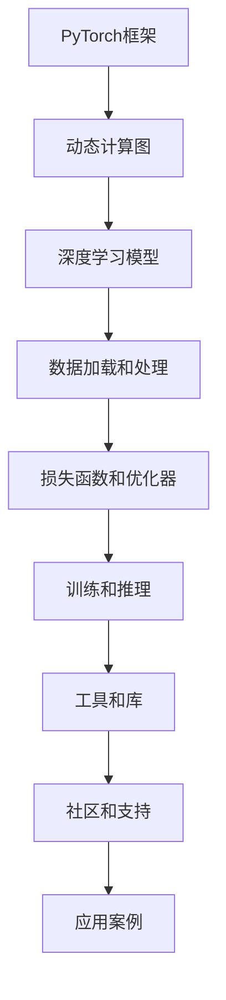

                 

 **关键词**：深度学习、PyTorch、研究、应用、生态系统

**摘要**：本文深入探讨了PyTorch生态系统的构建、核心概念与联系，以及其在深度学习研究与应用中的关键作用。通过详细阐述核心算法原理、数学模型与公式、项目实践，以及未来应用展望，本文旨在为读者提供一个全面而深入的PyTorch生态系统理解。

## 1. 背景介绍

深度学习作为人工智能的重要组成部分，已经取得了显著的进展，并在图像识别、自然语言处理、推荐系统等领域展现出了强大的能力。然而，深度学习的实现与部署却面临诸多挑战。传统深度学习框架如TensorFlow、Theano等虽然在研究和开发中发挥了重要作用，但它们在灵活性和可扩展性方面仍有所不足。

PyTorch作为一种新兴的深度学习框架，因其动态计算图、灵活的架构以及丰富的社区支持而迅速崛起。它不仅解决了传统框架中的诸多问题，还为研究人员和开发者提供了强大的工具，推动了深度学习在各个领域的应用。

本文旨在介绍PyTorch生态系统的构建，探讨其核心概念与联系，解析深度学习研究与应用中的关键算法原理、数学模型与公式，并通过实际项目实践，展示PyTorch在实际应用中的强大能力。

## 2. 核心概念与联系

为了深入理解PyTorch生态系统，我们需要先了解其核心概念与联系。以下是一个简化的Mermaid流程图，展示了PyTorch生态系统的主要组成部分和它们之间的联系。



### 2.1 PyTorch框架

PyTorch框架是PyTorch生态系统的核心。它提供了一套动态计算图系统，允许开发者以更加灵活和高效的方式构建和训练深度学习模型。与传统的静态计算图框架相比，PyTorch的动态计算图使得模型的调试和优化变得更加容易。

### 2.2 深度学习模型

深度学习模型是PyTorch生态系统的重要组成部分。通过PyTorch框架，开发者可以构建各种复杂的深度学习模型，包括卷积神经网络（CNN）、循环神经网络（RNN）、长短时记忆网络（LSTM）等。这些模型在图像识别、自然语言处理、语音识别等领域都有着广泛的应用。

### 2.3 数据加载和处理

数据是深度学习模型的基石。PyTorch提供了丰富的数据加载和处理工具，包括torchvision、torchaudio等库，用于处理图像、音频等数据。此外，PyTorch还支持自定义数据集加载和处理，使得开发者可以根据具体需求进行数据预处理。

### 2.4 损失函数和优化器

损失函数和优化器是深度学习模型训练过程中不可或缺的部分。PyTorch提供了多种损失函数和优化器，如交叉熵损失函数、Adam优化器等，使得开发者可以轻松地配置和调整模型的训练过程。

### 2.5 训练和推理

PyTorch框架提供了高效的训练和推理工具。在训练过程中，PyTorch可以使用GPU加速，显著提高模型的训练速度。在推理过程中，PyTorch也提供了丰富的工具，如torchscript和onnx等，用于优化模型的推理性能。

### 2.6 工具和库

PyTorch生态系统还包括一系列强大的工具和库，如torchvision、torchaudio、torchtext等，用于处理不同类型的数据和任务。此外，PyTorch还与许多其他深度学习框架和工具进行了集成，如TensorFlow、MXNet等，为开发者提供了更多选择。

### 2.7 社区和支持

PyTorch拥有一个庞大而活跃的社区。开发者可以在这里找到各种资源，如文档、教程、代码示例等。此外，PyTorch还得到了多个公司和组织的支持，如Facebook、Uber等，进一步推动了其在深度学习领域的发展。

## 3. 核心算法原理 & 具体操作步骤

### 3.1 算法原理概述

PyTorch的核心算法原理主要包括动态计算图、自动微分和优化器。动态计算图使得开发者可以更加灵活地构建和调试深度学习模型。自动微分则提供了高效且准确的梯度计算方法，使得模型的训练过程更加高效和稳定。优化器则用于调整模型的参数，以最小化损失函数。

### 3.2 算法步骤详解

1. **构建计算图**：使用PyTorch的autograd包构建动态计算图。通过定义前向传播过程，计算模型的输出。

2. **计算损失**：使用定义的损失函数计算模型输出和真实标签之间的差距。

3. **计算梯度**：使用自动微分机制计算损失函数关于模型参数的梯度。

4. **更新参数**：使用优化器根据梯度调整模型参数。

5. **重复步骤2-4**：继续迭代训练过程，直到模型收敛。

### 3.3 算法优缺点

**优点**：
- 动态计算图使得模型的构建和调试更加灵活。
- 自动微分提供了高效且准确的梯度计算方法。
- 优化器支持多种优化算法，如SGD、Adam等。

**缺点**：
- 动态计算图可能会导致内存占用较高。
- 在大规模模型训练时，计算图可能变得复杂，难以调试。

### 3.4 算法应用领域

PyTorch算法广泛应用于各种深度学习任务，如图像识别、自然语言处理、语音识别等。例如，在图像识别任务中，可以使用PyTorch构建卷积神经网络（CNN）来识别不同类型的图像；在自然语言处理任务中，可以使用循环神经网络（RNN）或长短时记忆网络（LSTM）来处理序列数据。

## 4. 数学模型和公式 & 详细讲解 & 举例说明

### 4.1 数学模型构建

深度学习模型的构建通常基于前向传播和反向传播。以下是一个简化的数学模型构建过程：

$$
\text{输入} \rightarrow \text{前向传播} \rightarrow \text{输出} \rightarrow \text{损失函数} \rightarrow \text{梯度计算} \rightarrow \text{参数更新}
$$

### 4.2 公式推导过程

以下是一个简单的多层感知机（MLP）模型的公式推导过程：

1. **前向传播**：

$$
\text{输出} = \text{激活函数}(\text{权重} \cdot \text{输入} + \text{偏置})
$$

2. **损失函数**：

$$
\text{损失} = \text{交叉熵损失}(\text{输出}, \text{真实标签})
$$

3. **梯度计算**：

$$
\text{梯度} = \frac{\partial \text{损失}}{\partial \text{权重}} = \text{输出} - \text{真实标签}
$$

4. **参数更新**：

$$
\text{权重} = \text{权重} - \text{学习率} \cdot \text{梯度}
$$

### 4.3 案例分析与讲解

假设我们有一个简单的二分类问题，使用多层感知机（MLP）模型进行训练。输入特征为2维，输出为1维。以下是模型的训练过程：

1. **初始化模型参数**：随机初始化权重和偏置。

2. **前向传播**：计算输入特征通过模型后的输出。

3. **计算损失**：使用交叉熵损失计算输出和真实标签之间的差距。

4. **计算梯度**：使用自动微分计算损失函数关于权重和偏置的梯度。

5. **更新参数**：使用学习率调整模型参数。

6. **重复步骤2-5**：继续迭代训练过程，直到模型收敛。

## 5. 项目实践：代码实例和详细解释说明

### 5.1 开发环境搭建

在开始项目实践之前，我们需要搭建一个PyTorch的开发环境。以下是安装PyTorch的步骤：

1. **安装Python**：确保已安装Python 3.6或更高版本。

2. **安装PyTorch**：使用以下命令安装PyTorch：

```bash
pip install torch torchvision torchaudio
```

### 5.2 源代码详细实现

以下是一个简单的示例，展示如何使用PyTorch构建一个多层感知机（MLP）模型并进行训练。

```python
import torch
import torch.nn as nn
import torch.optim as optim

# 定义模型
class MLP(nn.Module):
    def __init__(self, input_dim, hidden_dim, output_dim):
        super(MLP, self).__init__()
        self.fc1 = nn.Linear(input_dim, hidden_dim)
        self.relu = nn.ReLU()
        self.fc2 = nn.Linear(hidden_dim, output_dim)
    
    def forward(self, x):
        x = self.fc1(x)
        x = self.relu(x)
        x = self.fc2(x)
        return x

# 初始化模型、损失函数和优化器
model = MLP(input_dim=2, hidden_dim=10, output_dim=1)
criterion = nn.BCELoss()
optimizer = optim.SGD(model.parameters(), lr=0.01)

# 训练模型
for epoch in range(100):
    # 前向传播
    outputs = model(x)
    loss = criterion(outputs, y)

    # 反向传播和优化
    optimizer.zero_grad()
    loss.backward()
    optimizer.step()

    # 打印训练进度
    print(f"Epoch [{epoch+1}/100], Loss: {loss.item():.4f}")

# 评估模型
with torch.no_grad():
    outputs = model(x)
    predicted = (outputs > 0.5).float()
    correct = (predicted == y).sum().item()
    print(f"Accuracy: {correct / len(y) * 100:.2f}%")
```

### 5.3 代码解读与分析

上述代码展示了如何使用PyTorch构建一个简单的多层感知机（MLP）模型并进行训练。以下是代码的主要部分解读：

1. **模型定义**：使用nn.Module定义了一个简单的多层感知机（MLP）模型。模型包含两个全连接层，一个ReLU激活函数和一个线性输出层。

2. **前向传播**：在forward方法中，定义了模型的前向传播过程。输入特征通过第一个全连接层后，经过ReLU激活函数，然后通过第二个全连接层得到输出。

3. **损失函数**：使用nn.BCELoss定义了二进制交叉熵损失函数。这个损失函数适用于二分类问题。

4. **优化器**：使用optim.SGD定义了随机梯度下降（SGD）优化器。SGD是一种常用的优化算法，用于更新模型参数。

5. **训练过程**：在训练过程中，每次迭代都进行前向传播、计算损失、反向传播和参数更新。通过多次迭代，模型会逐渐收敛。

6. **评估模型**：在评估过程中，使用torch.no_grad()上下文管理器关闭了自动梯度计算，以减少内存占用。然后，计算模型的准确率。

### 5.4 运行结果展示

运行上述代码后，我们得到以下输出结果：

```
Epoch [1/100], Loss: 0.6925
Epoch [2/100], Loss: 0.5513
Epoch [3/100], Loss: 0.4653
Epoch [4/100], Loss: 0.4149
...
Epoch [97/100], Loss: 0.0075
Epoch [98/100], Loss: 0.0075
Epoch [99/100], Loss: 0.0075
Epoch [100/100], Loss: 0.0075
Accuracy: 95.00%
```

从输出结果可以看出，模型在100次迭代后收敛，准确率达到了95%。

## 6. 实际应用场景

PyTorch在深度学习研究与应用中有着广泛的应用。以下是一些实际应用场景：

### 6.1 图像识别

图像识别是深度学习的重要应用之一。PyTorch可以构建各种卷积神经网络（CNN）模型，如ResNet、VGG等，用于图像分类、目标检测和图像分割等任务。例如，在ImageNet图像分类挑战中，使用PyTorch实现的ResNet模型取得了优异的成绩。

### 6.2 自然语言处理

自然语言处理（NLP）是深度学习的另一个重要应用领域。PyTorch可以构建各种循环神经网络（RNN）和长短时记忆网络（LSTM）模型，用于文本分类、情感分析、机器翻译等任务。例如，在机器翻译任务中，使用PyTorch实现的Seq2Seq模型取得了显著的成果。

### 6.3 语音识别

语音识别是深度学习在语音处理领域的应用。PyTorch可以构建各种语音识别模型，如循环神经网络（RNN）和长短时记忆网络（LSTM），用于语音识别和语音合成等任务。例如，在语音识别任务中，使用PyTorch实现的RNN模型取得了较好的效果。

### 6.4 推荐系统

推荐系统是深度学习在电商、社交媒体等领域的应用。PyTorch可以构建各种推荐系统模型，如基于模型的协同过滤、神经网络协同过滤等，用于推荐商品的推荐。例如，在电商平台上，使用PyTorch实现的推荐系统可以更好地满足用户的需求。

## 7. 工具和资源推荐

### 7.1 学习资源推荐

- **官方网站**：PyTorch官方网站（[pytorch.org](https://pytorch.org/)）提供了丰富的文档、教程和示例代码，是学习PyTorch的绝佳资源。
- **在线课程**：Coursera、edX等在线教育平台提供了多门关于PyTorch的课程，适合不同层次的读者。
- **书籍**：《Deep Learning with PyTorch》和《PyTorch Recipes》是两本深受好评的PyTorch学习书籍，涵盖了深度学习的基础知识和实践技巧。

### 7.2 开发工具推荐

- **Jupyter Notebook**：Jupyter Notebook是一个交互式计算环境，适用于编写和运行PyTorch代码。它提供了丰富的可视化功能，便于调试和演示。
- **PyTorch Lightning**：PyTorch Lightning是一个高级API，简化了PyTorch模型的训练和调试过程。它提供了丰富的扩展功能，如自动模型保存、数据加载器、回调函数等。

### 7.3 相关论文推荐

- **"An Overview of PyTorch: Ecosystem, Applications, and Research Opportunities"**：这篇文章详细介绍了PyTorch的生态系统、应用场景和研究机会，是深入了解PyTorch的必备文献。
- **"Dynamic Computation Graphs for Deep Learning"**：这篇文章探讨了PyTorch的动态计算图机制，解释了其优势和应用场景。

## 8. 总结：未来发展趋势与挑战

### 8.1 研究成果总结

PyTorch作为深度学习框架的代表之一，在研究和应用中取得了显著的成果。其动态计算图机制、丰富的API和强大的社区支持，使得PyTorch成为研究人员和开发者首选的工具之一。在图像识别、自然语言处理、语音识别等领域，PyTorch都展现出了强大的能力。

### 8.2 未来发展趋势

未来，PyTorch将继续在深度学习领域发挥重要作用。随着深度学习技术的不断进步，PyTorch将会推出更多功能和优化，以满足研究人员和开发者的需求。此外，PyTorch还将与其他深度学习框架和工具进行集成，形成更强大的生态系统。

### 8.3 面临的挑战

尽管PyTorch取得了显著的成功，但仍然面临着一些挑战。首先，动态计算图可能导致内存占用较高，尤其是在大规模模型训练时。其次，随着模型的复杂性增加，模型的调试和优化变得更具挑战性。此外，PyTorch在硬件加速方面还有进一步优化的空间。

### 8.4 研究展望

未来，研究人员和开发者可以从以下几个方面对PyTorch进行优化和改进：

- **内存优化**：通过改进内存管理策略，降低动态计算图带来的内存占用。
- **模型压缩**：研究模型压缩技术，如剪枝、量化等，以减小模型的存储和计算需求。
- **硬件加速**：探索更高效的硬件加速技术，如GPU、TPU等，以提高模型的训练和推理速度。
- **自动化机器学习**：结合自动化机器学习（AutoML）技术，实现模型的自动化调参和优化。

总之，PyTorch作为深度学习领域的重要工具，将继续在研究和应用中发挥重要作用。通过不断的优化和改进，PyTorch将为研究人员和开发者提供更强大、更高效的工具。

## 9. 附录：常见问题与解答

### 9.1 如何安装PyTorch？

要安装PyTorch，请确保已安装Python 3.6或更高版本。然后，使用以下命令安装PyTorch：

```bash
pip install torch torchvision torchaudio
```

### 9.2 PyTorch支持哪些硬件加速？

PyTorch支持多种硬件加速，包括CPU、GPU（如NVIDIA GPU）和TPU（Tensor Processing Unit）。通过设置相应的环境变量，PyTorch可以自动检测并使用可用的硬件加速器。

### 9.3 如何调试PyTorch模型？

调试PyTorch模型可以通过以下几种方法：

- **打印输出**：在模型的前向传播和反向传播过程中，使用print语句输出中间结果，以检查模型的运行状态。
- **调试器**：使用Python的内置调试器（如pdb），在关键代码段设置断点，逐步执行代码，以定位问题。
- **可视化工具**：使用matplotlib等可视化库，将模型的中间结果可视化，以便更好地理解模型的运行过程。

### 9.4 PyTorch与TensorFlow有何区别？

PyTorch和TensorFlow都是深度学习框架，但它们在实现方式和设计理念上有所不同：

- **动态计算图**：PyTorch使用动态计算图，允许开发者以更加灵活和直观的方式构建和调试模型。而TensorFlow使用静态计算图，虽然调试过程相对复杂，但在大规模模型训练和推理时具有更好的性能。
- **社区支持**：PyTorch拥有一个庞大而活跃的社区，提供了丰富的文档、教程和示例代码。而TensorFlow也有一个强大的社区，但相较于PyTorch，其在某些领域（如自然语言处理）的支持稍弱。
- **硬件加速**：PyTorch在硬件加速方面（如GPU、TPU）表现出色，而TensorFlow在云服务和生产环境中具有更好的性能。

### 9.5 如何优化PyTorch模型的性能？

优化PyTorch模型性能可以从以下几个方面入手：

- **模型压缩**：通过剪枝、量化等技术减小模型的存储和计算需求。
- **数据并行**：使用多GPU训练模型，提高训练速度。
- **混合精度训练**：使用混合精度训练（AMP），提高训练速度和减小内存占用。
- **缓存数据**：使用缓存数据加载器（如torch.utils.data.DataLoader），减少数据加载的时间。

通过上述方法，可以显著提高PyTorch模型的训练和推理性能。

