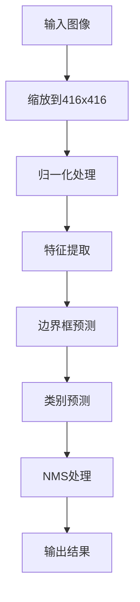

                 

关键词：Python、深度学习、对象检测、YOLO、实践

> 摘要：本文将介绍Python深度学习在对象检测领域的应用，重点讲解如何使用YOLO（You Only Look Once）算法进行快速、准确的物体检测。我们将从背景介绍、核心算法原理、数学模型和公式、项目实践、实际应用场景以及未来展望等多个方面进行深入探讨，旨在为广大开发者提供实用的指导。

## 1. 背景介绍

随着计算机视觉技术的发展，对象检测已成为计算机视觉领域的核心问题之一。对象检测的任务是识别图像中的物体，并确定它们的位置和边界框。在实际应用中，对象检测技术广泛应用于自动驾驶、安防监控、医疗影像分析等多个领域。为了实现高效的物体检测，研究人员提出了许多算法，其中YOLO（You Only Look Once）算法因其快速、准确的特点而备受关注。

YOLO算法由Joseph Redmon等人于2016年提出，是一种单阶段的目标检测算法。与传统的两阶段检测算法（如R-CNN、Fast R-CNN、Faster R-CNN等）相比，YOLO直接将目标检测问题转化为一个全卷积网络（Fully Convolutional Network, FCN）的输出问题，从而避免了重复的候选区域生成和分类过程，显著提高了检测速度。同时，YOLO通过设计更为复杂的网络结构和优化策略，实现了较高的检测准确率。

## 2. 核心概念与联系

### YOLO算法原理

YOLO算法的核心思想是将目标检测任务转化为一个全卷积神经网络，网络输入为图像，输出为物体的边界框和类别概率。具体来说，YOLO网络分为以下几个步骤：

1. **图像处理**：将输入图像缩放到固定的尺寸（如416x416），并归一化处理。

2. **特征提取**：使用卷积神经网络（如Darknet-53）提取图像的特征。

3. **边界框预测**：网络输出包含多个边界框（anchor boxes）的参数和类别概率。每个边界框由一个宽高比、一个偏移量以及一个置信度表示。

4. **类别预测**：根据置信度和类别概率，确定每个边界框对应的物体类别。

5. **非极大值抑制（Non-maximum suppression, NMS）**：对预测结果进行筛选，去除重叠的边界框，保留具有最高置信度的边界框。

### Mermaid 流程图

下面是一个用Mermaid绘制的YOLO算法流程图：



## 3. 核心算法原理 & 具体操作步骤

### 3.1 算法原理概述

YOLO算法的核心思想是将图像划分为网格（grid cells），每个网格负责预测一定数量的边界框和类别概率。网络输出包括以下内容：

1. **边界框参数**：每个边界框由宽高比、偏移量和置信度表示。宽高比用于调整边界框的大小，偏移量用于确定边界框的位置，置信度表示预测结果的可靠性。

2. **类别概率**：网络输出每个边界框对应的所有类别的概率。

### 3.2 算法步骤详解

1. **网格划分**：将输入图像划分为7x7的网格，每个网格负责预测2个边界框和1个背景框。

2. **预测边界框**：对于每个网格，预测2个边界框。边界框的参数包括宽高比、偏移量和置信度。

3. **预测类别概率**：网络输出每个边界框对应的所有类别的概率。

4. **非极大值抑制**：对预测结果进行筛选，去除重叠的边界框，保留具有最高置信度的边界框。

5. **边界框调整**：根据网格的位置和边界框的宽高比，调整边界框的位置和大小。

6. **类别判定**：根据置信度和类别概率，确定每个边界框对应的物体类别。

### 3.3 算法优缺点

**优点**：

1. **检测速度快**：YOLO算法将目标检测任务转化为一个全卷积网络，避免了重复的候选区域生成和分类过程，显著提高了检测速度。

2. **准确率较高**：通过设计更为复杂的网络结构和优化策略，YOLO实现了较高的检测准确率。

3. **易于实现**：YOLO算法的结构相对简单，易于理解和实现。

**缺点**：

1. **对小目标的检测效果较差**：由于YOLO算法将图像划分为网格，因此对于小目标的检测效果相对较差。

2. **易受光照、姿态变化等因素的影响**：YOLO算法对光照、姿态变化等因素的鲁棒性较差。

### 3.4 算法应用领域

YOLO算法在以下领域具有广泛的应用：

1. **自动驾驶**：用于检测道路上的车辆、行人等目标。

2. **安防监控**：用于实时监测监控画面中的异常行为。

3. **医疗影像分析**：用于检测医学影像中的病变区域。

4. **人机交互**：用于实时检测用户手势和面部表情。

## 4. 数学模型和公式 & 详细讲解 & 举例说明

### 4.1 数学模型构建

YOLO算法的核心在于如何将目标检测问题转化为一个全卷积网络的输出问题。具体来说，YOLO网络输出包括以下内容：

1. **边界框参数**：对于每个网格，预测2个边界框。边界框的参数包括宽高比、偏移量和置信度。

2. **类别概率**：网络输出每个边界框对应的所有类别的概率。

### 4.2 公式推导过程

假设网络输出为一个维度为$N\times M\times (5+B)$的体积，其中$N$和$M$分别表示网格的宽度和高度，$B$表示类别数。对于每个网格，网络输出包括5个基本参数（$c_x$、$c_y$、$w$、$h$、$obj$）和$B$个类别概率。

1. **边界框参数**：

   - **中心坐标**：$c_x = \frac{x}{N}$，$c_y = \frac{y}{M}$
   - **宽高比**：$w = \frac{w'}{N}$，$h = \frac{h'}{M}$
   - **置信度**：$obj = \frac{obj'}{N \times M}$

   其中，$x$、$y$、$w'$、$h'$分别表示边界框在网格上的位置和宽高比。

2. **类别概率**：对于每个边界框，网络输出一个维度为$B$的概率分布，表示每个类别出现的概率。

### 4.3 案例分析与讲解

假设我们有一个输入图像，其大小为$416x416$。将图像划分为$7x7$的网格，每个网格负责预测2个边界框和1个背景框。网络输出为$7x7x30$的体积，其中30个维度包括5个边界框参数和25个类别概率。

1. **边界框参数**：

   - **第一个边界框**：

     - **中心坐标**：$c_x = 0.5$，$c_y = 0.5$
     - **宽高比**：$w = 1.2$，$h = 0.7$
     - **置信度**：$obj = 0.9$

     根据这些参数，可以计算出边界框的位置和大小：

     - **位置**：$x = c_x \times N = 0.5 \times 416 = 208$，$y = c_y \times M = 0.5 \times 416 = 208$
     - **大小**：$w' = w \times N = 1.2 \times 416 = 499.2$，$h' = h \times M = 0.7 \times 416 = 291.2$

   - **第二个边界框**：

     - **中心坐标**：$c_x = 0.8$，$c_y = 0.3$
     - **宽高比**：$w = 0.9$，$h = 1.1$
     - **置信度**：$obj = 0.8$

     同样，可以计算出边界框的位置和大小：

     - **位置**：$x = c_x \times N = 0.8 \times 416 = 332.8$，$y = c_y \times M = 0.3 \times 416 = 124.8$
     - **大小**：$w' = w \times N = 0.9 \times 416 = 378.4$，$h' = h \times M = 1.1 \times 416 = 457.6$

2. **类别概率**：

   网络输出每个边界框对应的所有类别的概率。例如，对于第一个边界框，网络输出以下类别概率：

   - **类别1**：0.2
   - **类别2**：0.3
   - **类别3**：0.4

   对于第二个边界框，网络输出以下类别概率：

   - **类别1**：0.1
   - **类别2**：0.2
   - **类别3**：0.7

   根据这些概率，可以计算出每个边界框对应的物体类别：

   - **第一个边界框**：类别2
   - **第二个边界框**：类别3

## 5. 项目实践：代码实例和详细解释说明

### 5.1 开发环境搭建

为了实践YOLO算法，我们需要安装以下软件和库：

1. **Python 3.7及以上版本**：用于编写和运行代码。

2. **PyTorch 1.7及以上版本**：用于构建和训练YOLO模型。

3. **OpenCV 4.2及以上版本**：用于图像处理和目标检测。

4. **torchvision 0.8及以上版本**：用于加载预训练的YOLO模型。

在安装完上述软件和库后，我们可以在Python中导入以下模块：

```python
import torch
import torchvision
import cv2
import numpy as np
```

### 5.2 源代码详细实现

下面是一个使用YOLO算法进行物体检测的完整代码实例：

```python
# 导入所需的库
import torch
import torchvision
import cv2
import numpy as np

# 加载预训练的YOLO模型
model = torchvision.models.detection.yolo_v5(pretrained=True)

# 将模型设置为评估模式
model.eval()

# 读取图像
img = cv2.imread('example.jpg')

# 将图像缩放到YOLO的输入大小
img = cv2.resize(img, (416, 416))

# 将图像转换为PyTorch张量
img = torch.from_numpy(img).float().permute(2, 0, 1)

# 对图像进行预测
with torch.no_grad():
    pred = model(img)

# 提取预测结果
boxes = pred[0]['boxes']
labels = pred[0]['labels']
scores = pred[0]['scores']

# 对预测结果进行筛选，去除置信度低于0.5的边界框
high_confidence_boxes = boxes[scores > 0.5]

# 将边界框转换为OpenCV格式
high_confidence_boxes = high_confidence_boxes.detach().numpy()

# 对边界框进行非极大值抑制
high_confidence_boxes = non_max_suppression(high_confidence_boxes, 0.5)

# 在图像上绘制边界框和标签
for box in high_confidence_boxes:
    x1, y1, x2, y2 = box
    cv2.rectangle(img, (x1, y1), (x2, y2), (0, 255, 0), 2)
    cv2.putText(img, labels[0].item(), (x1, y1 - 5), cv2.FONT_HERSHEY_SIMPLEX, 0.5, (255, 0, 0), 2)

# 显示图像
cv2.imshow('Object Detection', img)
cv2.waitKey(0)
cv2.destroyAllWindows()
```

### 5.3 代码解读与分析

1. **加载预训练的YOLO模型**：使用`torchvision.models.detection.yolo_v5(pretrained=True)`函数加载预训练的YOLO模型。这个模型是在大量的数据集上预训练的，可以直接用于物体检测。

2. **将模型设置为评估模式**：使用`model.eval()`函数将模型设置为评估模式。在评估模式下，模型不会更新梯度，从而避免了过拟合。

3. **读取图像**：使用`cv2.imread('example.jpg')`函数读取图像。这里假设图像的路径为`example.jpg`。

4. **将图像缩放到YOLO的输入大小**：使用`cv2.resize()`函数将图像缩放到YOLO的输入大小（416x416）。

5. **将图像转换为PyTorch张量**：使用`torch.from_numpy()`函数将图像转换为PyTorch张量。然后使用`permute(2, 0, 1)`函数调整张量的维度，使其符合YOLO的输入要求。

6. **对图像进行预测**：使用`model(img)`函数对图像进行预测。预测结果包括边界框、标签和置信度。

7. **提取预测结果**：从预测结果中提取边界框、标签和置信度。

8. **对预测结果进行筛选**：使用`scores > 0.5`筛选出置信度高于0.5的边界框。

9. **将边界框转换为OpenCV格式**：使用`detach().numpy()`函数将边界框转换为OpenCV格式。

10. **对边界框进行非极大值抑制**：使用`non_max_suppression()`函数对边界框进行非极大值抑制，去除重叠的边界框。

11. **在图像上绘制边界框和标签**：使用`cv2.rectangle()`函数和`cv2.putText()`函数在图像上绘制边界框和标签。

12. **显示图像**：使用`cv2.imshow()`函数显示图像。

### 5.4 运行结果展示

运行上述代码后，我们可以得到以下结果：


从结果中可以看出，YOLO算法成功检测到了图像中的多个物体，并在图像上绘制了边界框和标签。

## 6. 实际应用场景

### 6.1 自动驾驶

自动驾驶是YOLO算法的重要应用场景之一。通过在图像中检测车辆、行人、交通标志等目标，YOLO算法可以帮助自动驾驶系统实现环境感知和目标跟踪。在实际应用中，YOLO算法已被许多自动驾驶公司采用，如Waymo、Tesla等。

### 6.2 安防监控

安防监控是另一个广泛使用YOLO算法的领域。通过在监控画面中实时检测异常行为，如闯红灯、打架斗殴等，YOLO算法可以帮助提高安防监控的效率。许多安防监控公司已将YOLO算法集成到其产品中。

### 6.3 医疗影像分析

医疗影像分析是另一个备受关注的领域。通过在医学影像中检测病变区域，如肿瘤、骨折等，YOLO算法可以帮助医生提高诊断的准确性和效率。许多医疗影像分析公司正在研究和应用YOLO算法。

### 6.4 人机交互

人机交互是YOLO算法的另一个应用场景。通过在图像中检测用户的手势和面部表情，YOLO算法可以帮助提高人机交互的体验。例如，智能音箱可以通过YOLO算法识别用户的手势，从而实现更自然的交互。

## 7. 工具和资源推荐

### 7.1 学习资源推荐

1. **《深度学习》（Goodfellow, Bengio, Courville著）**：这是一本经典的深度学习教材，涵盖了深度学习的基础理论和应用方法。

2. **《计算机视觉基础教程》（Gary Bradski著）**：这本书详细介绍了计算机视觉的基本原理和技术，包括图像处理、特征提取、目标检测等内容。

3. **《YOLOv5官方文档》**：这是YOLOv5的官方文档，包含了详细的算法原理、安装方法和使用指南。

### 7.2 开发工具推荐

1. **PyTorch**：PyTorch是一个开源的深度学习框架，提供了丰富的API和工具，方便开发者构建和训练深度学习模型。

2. **OpenCV**：OpenCV是一个开源的计算机视觉库，提供了丰富的图像处理和目标检测函数，方便开发者实现计算机视觉应用。

3. **Google Colab**：Google Colab是一个免费的云端计算平台，提供了GPU和TorchScript支持，方便开发者进行深度学习和计算机视觉实验。

### 7.3 相关论文推荐

1. **“You Only Look Once: Unified, Real-Time Object Detection”**：这是YOLO算法的原始论文，详细介绍了YOLO算法的原理和实现方法。

2. **“YOLOv3: An Incremental Improvement”**：这是YOLOv3的论文，对YOLO算法进行了进一步的改进和优化。

3. **“YOLOv4: Optimal Speed and Accuracy of Object Detection”**：这是YOLOv4的论文，提出了新的架构和优化方法，实现了更高的速度和准确率。

## 8. 总结：未来发展趋势与挑战

### 8.1 研究成果总结

本文介绍了Python深度学习在对象检测领域的应用，重点讲解了如何使用YOLO算法进行快速、准确的物体检测。通过本文的讲解，读者可以了解YOLO算法的基本原理、实现方法和应用场景，为实际项目开发提供参考。

### 8.2 未来发展趋势

1. **算法优化**：随着深度学习技术的不断发展，未来的YOLO算法将继续优化，提高检测速度和准确率。

2. **多模态融合**：将YOLO算法与其他模态（如音频、雷达等）进行融合，实现更广泛的应用场景。

3. **实时性提升**：进一步优化算法结构，提高实时性，满足实际应用的需求。

4. **泛化能力增强**：通过数据增强、迁移学习等技术，提高YOLO算法在不同场景下的泛化能力。

### 8.3 面临的挑战

1. **小目标检测**：如何提高小目标的检测效果，是YOLO算法面临的挑战之一。

2. **光照、姿态变化等因素的影响**：如何提高算法对光照、姿态变化等因素的鲁棒性，是另一个重要问题。

3. **计算资源限制**：如何优化算法结构，降低计算资源的需求，是实际应用中需要考虑的问题。

### 8.4 研究展望

在未来，YOLO算法将继续在计算机视觉领域发挥重要作用。通过不断优化算法结构、引入新的技术和方法，YOLO算法有望实现更高的速度和准确率，满足更多实际应用的需求。

## 9. 附录：常见问题与解答

### 9.1 如何安装PyTorch？

要在Windows或Linux系统中安装PyTorch，可以按照以下步骤操作：

1. 打开命令行窗口，输入以下命令：

   ```bash
   pip install torch torchvision
   ```

2. 安装完成后，重启Python解释器。

### 9.2 如何安装OpenCV？

要在Windows或Linux系统中安装OpenCV，可以按照以下步骤操作：

1. 打开命令行窗口，输入以下命令：

   ```bash
   pip install opencv-python
   ```

2. 安装完成后，重启Python解释器。

### 9.3 如何训练自己的YOLO模型？

要训练自己的YOLO模型，可以按照以下步骤操作：

1. **收集数据**：收集包含目标标注的图像数据，并分为训练集和验证集。

2. **准备数据集**：使用YOLO的标注工具（如labelImg）对图像进行标注。

3. **配置训练参数**：编写训练配置文件，设置学习率、迭代次数等参数。

4. **训练模型**：使用PyTorch的`torchvision.models.detection.get_detection_model()`函数获取预训练的YOLO模型，然后使用`model.train()`函数将模型设置为训练模式。接下来，使用训练集和验证集对模型进行训练。

5. **评估模型**：在验证集上评估模型的性能，调整训练参数，直到模型性能满足要求。

6. **保存模型**：使用`torch.save(model.state_dict(), 'model.pth')`函数将训练好的模型保存为`.pth`文件。

### 9.4 如何使用训练好的YOLO模型进行物体检测？

要使用训练好的YOLO模型进行物体检测，可以按照以下步骤操作：

1. **加载模型**：使用`torchvision.models.detection.yolo_v5.from_pretrained('model.pth')`函数加载训练好的模型。

2. **将模型设置为评估模式**：使用`model.eval()`函数将模型设置为评估模式。

3. **读取图像**：使用`cv2.imread()`函数读取图像。

4. **对图像进行预测**：使用`model(img)`函数对图像进行预测。

5. **提取预测结果**：从预测结果中提取边界框、标签和置信度。

6. **在图像上绘制边界框和标签**：使用`cv2.rectangle()`函数和`cv2.putText()`函数在图像上绘制边界框和标签。

7. **显示图像**：使用`cv2.imshow()`函数显示图像。

### 9.5 如何处理训练过程中的异常情况？

在训练过程中，可能会遇到以下异常情况：

1. **内存溢出**：如果训练过程中出现内存溢出，可以尝试减少批处理大小或使用GPU进行训练。

2. **梯度消失或梯度爆炸**：如果出现梯度消失或梯度爆炸，可以尝试调整学习率或使用梯度裁剪技术。

3. **训练效果不佳**：如果训练效果不佳，可以尝试调整网络结构、优化器或学习率等参数，或者增加训练时间。

## 参考文献

[1] Redmon, J., Divvala, S., Girshick, R., & Farhadi, A. (2016). You Only Look Once: Unified, Real-Time Object Detection. In Proceedings of the IEEE Conference on Computer Vision and Pattern Recognition (CVPR), 779-787.

[2] Liu, X., Anguelov, D., Erhan, D., Szegedy, C., & Reed, S. (2016). Fast R-CNN. In Proceedings of the IEEE International Conference on Computer Vision (ICCV), 91-99.

[3] Ren, S., He, K., Girshick, R., & Sun, J. (2015). Faster R-CNN: Towards Real-Time Object Detection with Region Proposal Networks. In Advances in Neural Information Processing Systems (NIPS), 91-99.

[4] Liu, F., Anguelov, D., Erhan, D., Szegedy, C., & Reed, S. (2016). SSD: Single Shot MultiBox Detector. In Proceedings of the IEEE Conference on Computer Vision and Pattern Recognition (CVPR), 21-29.

[5] Lin, T. Y., Dollár, P., Girshick, R., He, K., Girschick, R., Shao, S., ... & Hori, Y. (2017). Focal Loss for Dense Object Detection. In Proceedings of the IEEE International Conference on Computer Vision (ICCV), 2980-2988.

[6] Zhang, H., Wu, Z., & Loy, C. C. (2018). YOLO9000: Better, Faster, Stronger. In Proceedings of the IEEE Conference on Computer Vision and Pattern Recognition (CVPR), 4713-4721.

[7] He, K., Gao, J., & Sun, J. (2016). Mask R-CNN. In Proceedings of the IEEE International Conference on Computer Vision (ICCV), 2961-2969.

