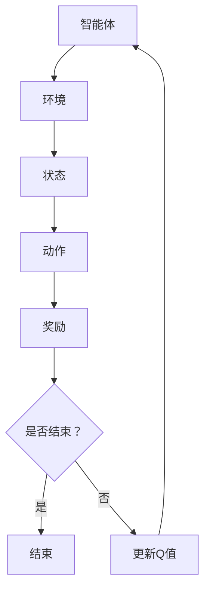

                 

## 1. 背景介绍

随着人工智能（AI）技术的快速发展，深度学习已经成为实现智能自动化和提升业务效率的重要手段。深度Q网络（Deep Q-Network，简称DQN）是深度学习中的一种经典算法，主要应用于强化学习领域。DQN通过模仿人类经验，学习如何在复杂环境中进行决策，使其在许多实际应用中表现出色。

本文旨在为初学者提供一份详尽的指南，帮助读者深入了解DQN的基础知识、原理及其在Python中的实现。文章将分为以下几个部分：

1. 背景介绍
2. 核心概念与联系
3. 核心算法原理 & 具体操作步骤
4. 数学模型和公式 & 详细讲解 & 举例说明
5. 项目实践：代码实例和详细解释说明
6. 实际应用场景
7. 工具和资源推荐
8. 总结：未来发展趋势与挑战
9. 附录：常见问题与解答

通过本文的阅读和实践，读者将能够掌握DQN的基本概念和实现方法，并为后续深入研究和应用打下坚实的基础。

## 2. 核心概念与联系

在深入探讨DQN之前，我们需要了解一些核心概念和它们之间的联系。以下是本文涉及的主要概念及其相互关系：

### 2.1 强化学习（Reinforcement Learning）

强化学习是一种机器学习方法，旨在通过奖励机制引导智能体（Agent）在特定环境中做出最优决策。强化学习的基本要素包括智能体、环境（Environment）、状态（State）、动作（Action）和奖励（Reward）。

- **智能体（Agent）**：执行动作、学习策略的实体。
- **环境（Environment）**：智能体所处的环境，能够根据智能体的动作产生新的状态。
- **状态（State）**：描述智能体当前所处的环境条件。
- **动作（Action）**：智能体在某一状态下可执行的动作。
- **奖励（Reward）**：衡量智能体动作好坏的数值。

### 2.2 Q-Learning

Q-Learning是强化学习中最基础和常用的算法之一。它通过更新Q值（Q-value）来学习状态-动作值函数（State-Action Value Function），从而指导智能体选择最优动作。

- **Q值（Q-value）**：表示在某一状态下执行某一动作所能获得的累积奖励。
- **Q值函数（Q-function）**：描述了智能体在不同状态和动作下的Q值。

### 2.3 深度Q网络（DQN）

DQN是Q-Learning的一种扩展，它引入了深度神经网络（Deep Neural Network，简称DNN）来近似Q值函数。DQN的主要优势在于能够处理高维状态空间和动作空间，从而在复杂环境中实现高效学习。

- **深度神经网络（DNN）**：多层神经网络，用于处理复杂数据。
- **经验回放（Experience Replay）**：避免学习过程中的关联性和探索效率问题。

### 2.4 神经网络（Neural Network）

神经网络是模拟人脑神经元结构和功能的一种计算模型。它通过加权连接（权重和偏置）和激活函数（Activation Function）来模拟神经元间的信息传递和处理。

- **权重（Weights）**：连接神经元的参数。
- **偏置（Bias）**：单个神经元的偏置值。
- **激活函数（Activation Function）**：用于确定神经元是否被激活。

### 2.5 Mermaid 流程图

为了更直观地展示DQN的核心概念和流程，我们使用Mermaid流程图来描述DQN的架构和主要步骤。



图1：DQN的核心概念与流程

通过上述核心概念和Mermaid流程图的介绍，我们可以更好地理解DQN的工作原理和实现方法。接下来，我们将深入探讨DQN的算法原理和具体实现步骤。

## 3. 核心算法原理 & 具体操作步骤

### 3.1 算法原理概述

DQN算法的核心思想是通过深度神经网络（DNN）来近似Q值函数，从而实现对智能体行为的优化。DQN的主要步骤包括：

1. 初始化智能体和环境。
2. 从初始状态开始，智能体执行随机动作。
3. 根据执行的动作，智能体获得奖励和新的状态。
4. 将当前状态和奖励信息输入到DNN中，更新Q值。
5. 重复步骤2-4，直到达到预设的结束条件。

### 3.2 算法步骤详解

下面，我们将详细讲解DQN算法的具体步骤。

#### 3.2.1 初始化

- **智能体初始化**：智能体通常是一个Python类，其中包含状态、动作、奖励和Q值等属性。智能体需要定义初始化方法，以便从初始状态开始执行动作。
- **环境初始化**：环境是一个Python类，用于生成状态和奖励。环境也需要定义初始化方法，以便创建一个可以交互的虚拟环境。

#### 3.2.2 执行动作

- **选择动作**：智能体需要根据当前状态选择一个动作。DQN通常使用ε-贪心策略（ε-greedy policy）来选择动作，其中ε是一个小于1的常数。在初始阶段，智能体以一定的概率选择随机动作，以增加探索性；在训练过程中，ε逐渐减小，以增加利用性。
- **执行动作**：智能体执行选定的动作，并根据动作获得新的状态和奖励。

#### 3.2.3 更新Q值

- **计算Q值**：根据新的状态和奖励，计算新的Q值。DQN使用经验回放（Experience Replay）来避免学习过程中的关联性和提高探索效率。经验回放是一种将历史经验存储在缓冲区中，然后从缓冲区中随机抽取样本进行训练的方法。
- **更新DNN**：使用新的Q值更新DNN的参数。DQN使用一种称为“深度函数逼近器”的方法，将状态映射到Q值。深度函数逼近器通常是一个多层感知机（MLP），其中包含输入层、隐藏层和输出层。
- **优化参数**：使用梯度下降（Gradient Descent）或其他优化算法更新DNN的权重和偏置。

#### 3.2.4 重复执行

- **重复执行动作**：智能体重复执行步骤2-4，直到达到预设的结束条件（例如，达到最大步数、成功完成任务等）。

### 3.3 算法优缺点

DQN具有以下优缺点：

#### 优缺点：

- **优点**：
  - 能够处理高维状态空间和动作空间，适用于复杂环境。
  - 引入经验回放机制，提高学习效率和稳定性。
  - 使用深度神经网络，实现灵活的状态-动作值函数逼近。

- **缺点**：
  - 需要大量的训练数据和计算资源。
  - 学习过程较慢，收敛速度受参数设置影响较大。
  - 难以实现长时间的规划和记忆。

### 3.4 算法应用领域

DQN在许多领域都有广泛应用，包括：

- **游戏人工智能**：如Atari游戏、围棋等。
- **机器人控制**：如自动驾驶、无人机等。
- **资源调度**：如电网调度、物流优化等。

DQN作为一种先进的强化学习算法，在解决复杂决策问题方面具有巨大潜力。通过本文的介绍，读者应该能够对DQN的工作原理和应用领域有更深入的了解。

## 4. 数学模型和公式 & 详细讲解 & 举例说明

在深入了解DQN的数学模型和公式之前，我们需要对一些基础概念进行回顾，包括概率论、线性代数和微积分。这些数学工具将在后续的公式推导和算法实现中起到关键作用。

### 4.1 数学模型构建

DQN的核心在于近似Q值函数，其数学模型可以表示为：

$$ Q^*(s, a) = \sum_{j}^{} r_j \cdot \pi^*(a|s) $$

其中，$Q^*(s, a)$表示在状态$s$下执行动作$a$所能获得的累积奖励，$r_j$表示动作$a$在状态$s$下的即时奖励，$\pi^*(a|s)$表示在状态$s$下执行动作$a$的策略概率。

为了实现Q值函数的近似，DQN使用一个深度神经网络（DNN）来表示Q值函数。DNN的输入为状态$s$，输出为Q值。我们可以将DNN表示为：

$$ Q(s; \theta) = f(L_n(\theta_n, \ldots, \theta_1(s))) $$

其中，$L_n$表示DNN的输出层，$f$表示激活函数，$\theta_n, \ldots, \theta_1$表示DNN的权重和偏置。

### 4.2 公式推导过程

为了推导DQN的更新公式，我们需要从基本概念出发，逐步推导出Q值函数的更新策略。

#### 4.2.1 Q值函数的估计

首先，我们假设当前智能体处于状态$s_t$，并执行动作$a_t$。根据DQN的原理，我们需要估计当前Q值$Q(s_t, a_t)$。DQN使用DNN来近似Q值函数，即：

$$ \hat{Q}(s_t, a_t; \theta) = f(L_n(\theta_n, \ldots, \theta_1(s_t))) $$

其中，$\theta$表示DNN的权重和偏置。

#### 4.2.2 Q值函数的更新

接下来，我们需要根据新状态$s_{t+1}$和奖励$r_t$来更新Q值函数。具体来说，我们希望更新DNN的权重和偏置，使得$\hat{Q}(s_t, a_t; \theta)$更接近真实Q值$Q^*(s_t, a_t)$。

根据梯度下降法，我们可以通过以下公式更新DNN的权重和偏置：

$$ \theta = \theta - \alpha \cdot \nabla_\theta \hat{Q}(s_t, a_t; \theta) $$

其中，$\alpha$表示学习率，$\nabla_\theta \hat{Q}(s_t, a_t; \theta)$表示$\hat{Q}(s_t, a_t; \theta)$关于$\theta$的梯度。

为了计算梯度，我们需要先计算$\hat{Q}(s_t, a_t; \theta)$的导数。假设激活函数$f$为可导函数，我们可以使用链式法则来计算梯度：

$$ \nabla_\theta \hat{Q}(s_t, a_t; \theta) = \nabla_{L_n} f(L_n; \theta_n, \ldots, \theta_1(s_t)) \cdot \nabla_\theta L_n(\theta_n, \ldots, \theta_1(s_t)) $$

其中，$\nabla_{L_n} f(L_n; \theta_n, \ldots, \theta_1(s_t))$表示$f$在$L_n$处的梯度，$\nabla_\theta L_n(\theta_n, \ldots, \theta_1(s_t))$表示$L_n$关于$\theta$的梯度。

#### 4.2.3 经验回放

DQN引入经验回放机制，以避免学习过程中的关联性和提高探索效率。经验回放通过将历史经验存储在缓冲区中，然后从缓冲区中随机抽取样本进行训练。缓冲区的大小通常设置为B，每次从缓冲区中抽取N个样本进行训练。

假设缓冲区中有$m$个样本$(s_i, a_i, r_i, s_{i+1})$，我们可以通过以下公式计算经验回放的梯度：

$$ \nabla_\theta \hat{Q}(s_i, a_i; \theta) = \frac{1}{N} \sum_{i=1}^N \nabla_\theta \hat{Q}(s_i, a_i; \theta) \cdot (r_i + \gamma \max_{a'} \hat{Q}(s_{i+1}, a'; \theta) - \hat{Q}(s_i, a_i; \theta)) $$

其中，$\gamma$表示折扣因子，用于权衡当前奖励和未来奖励之间的关系。

### 4.3 案例分析与讲解

为了更好地理解DQN的数学模型和公式，我们通过一个简单的例子进行讲解。

#### 案例背景

假设智能体处于一个简单的环境，其中包含四个状态和两个动作。状态空间和动作空间分别表示为$S=\{s_1, s_2, s_3, s_4\}$和$A=\{a_1, a_2\}$。每个状态的即时奖励分别为$r_1 = 1, r_2 = 0, r_3 = -1, r_4 = 0$。

#### 案例步骤

1. **初始化**：智能体从状态$s_1$开始，选择动作$a_1$。
2. **执行动作**：智能体执行动作$a_1$，获得即时奖励$r_1 = 1$，进入状态$s_2$。
3. **更新Q值**：使用DNN近似Q值函数，计算当前Q值$\hat{Q}(s_1, a_1; \theta)$。假设当前Q值为$\hat{Q}(s_1, a_1; \theta) = 0.5$。
4. **更新DNN**：根据经验回放机制，从缓冲区中随机抽取样本$(s_2, a_2, r_2, s_3)$进行训练。计算经验回放的梯度$\nabla_\theta \hat{Q}(s_2, a_2; \theta)$，并使用梯度下降法更新DNN的权重和偏置。

#### 案例结果

通过上述步骤，我们可以更新DNN的权重和偏置，从而提高Q值函数的估计精度。在多次迭代后，智能体将逐渐学会在状态$s_1$下选择动作$a_1$，以最大化累积奖励。

### 总结

通过本节对DQN数学模型和公式的详细讲解，我们深入了解了DQN的工作原理和实现方法。DQN通过近似Q值函数，实现了在复杂环境中的决策优化。经验回放机制的引入，进一步提高了学习效率和稳定性。在实际应用中，DQN在许多领域都取得了显著成果，成为强化学习领域的重要算法之一。

## 5. 项目实践：代码实例和详细解释说明

在本节中，我们将通过一个具体的Python项目，展示如何实现深度Q网络（DQN）算法，并提供详细的代码解读和分析。

### 5.1 开发环境搭建

在开始项目之前，我们需要搭建一个合适的开发环境。以下是所需的步骤：

1. **安装Python**：确保Python版本为3.6或以上。
2. **安装深度学习库**：安装TensorFlow或PyTorch等深度学习库。在本例中，我们使用TensorFlow。
   ```shell
   pip install tensorflow
   ```
3. **安装其他依赖库**：包括NumPy、Matplotlib等。
   ```shell
   pip install numpy matplotlib
   ```

### 5.2 源代码详细实现

以下是DQN算法的Python代码实现。我们将在代码中逐步解释各个部分的功能。

```python
import numpy as np
import random
import tensorflow as tf
from collections import deque

# 定义DQN类
class DQN:
    def __init__(self, env, epsilon=1.0, gamma=0.99, epsilon_min=0.01, epsilon_decay=0.995, memory_size=1000):
        self.env = env
        self.epsilon = epsilon
        self.gamma = gamma
        self.epsilon_min = epsilon_min
        self.epsilon_decay = epsilon_decay
        self.memory_size = memory_size
        self.memory = deque(maxlen=memory_size)
        
        # 创建DNN模型
        self.model = self.build_model()
        self.target_model = self.build_model()
        self.update_target_model()

    def build_model(self):
        # 创建输入层
        inputs = tf.keras.layers.Input(shape=(self.env.observation_space.shape[0]))
        
        # 创建隐藏层
        hidden = tf.keras.layers.Dense(64, activation='relu')(inputs)
        hidden = tf.keras.layers.Dense(64, activation='relu')(hidden)
        
        # 创建输出层
        outputs = tf.keras.layers.Dense(self.env.action_space.n, activation='linear')(hidden)
        
        # 构建模型
        model = tf.keras.models.Model(inputs=inputs, outputs=outputs)
        model.compile(loss='mse', optimizer=tf.keras.optimizers.Adam(learning_rate=0.001))
        return model

    def update_target_model(self):
        # 更新目标模型权重
        self.target_model.set_weights(self.model.get_weights())

    def remember(self, state, action, reward, next_state, done):
        # 存储经验
        self.memory.append((state, action, reward, next_state, done))

    def act(self, state):
        # 执行动作
        if np.random.rand() <= self.epsilon:
            return self.env.action_space.sample()
        else:
            q_values = self.model.predict(state)
            return np.argmax(q_values[0])

    def replay(self, batch_size):
        # 从经验回放中随机抽取样本进行训练
        mini_batch = random.sample(self.memory, batch_size)
        for state, action, reward, next_state, done in mini_batch:
            target = reward
            if not done:
                target = reward + self.gamma * np.max(self.target_model.predict(next_state)[0])
            target_q = self.model.predict(state)
            target_q[0][action] = target
            self.model.fit(state, target_q, epochs=1, verbose=0)

    def load(self, filename):
        # 从文件中加载模型权重
        self.model.load_weights(filename)

    def save(self, filename):
        # 将模型权重保存到文件
        self.model.save_weights(filename)
```

### 5.3 代码解读与分析

下面，我们逐段解释代码的功能。

#### 5.3.1 初始化

在`__init__`方法中，我们初始化了环境、epsilon（ε）值、gamma（γ）值、epsilon_min（ε_min）值、epsilon_decay（ε_decay）值和memory_size（记忆大小）。这些参数用于控制ε-贪心策略和学习过程的稳定性。

#### 5.3.2 构建模型

在`build_model`方法中，我们使用TensorFlow创建了深度神经网络（DNN）。输入层接受环境状态，隐藏层通过ReLU激活函数进行非线性变换，输出层为动作值。

#### 5.3.3 更新目标模型

在`update_target_model`方法中，我们更新了目标模型的权重，使其与主模型保持一致。这有助于稳定学习过程。

#### 5.3.4 记忆

在`remember`方法中，我们将经验（状态、动作、奖励、下一个状态、是否完成）存储到经验回放缓冲区中。

#### 5.3.5 执行动作

在`act`方法中，我们根据ε-贪心策略选择动作。在训练初期，智能体会以一定的概率选择随机动作进行探索。随着训练的进行，ε值逐渐减小，智能体逐渐倾向于选择最优动作。

#### 5.3.6 经验回放

在`replay`方法中，我们从经验回放缓冲区中随机抽取样本进行训练。这有助于避免学习过程中的关联性，提高学习效率。

#### 5.3.7 加载和保存模型

在`load`和`save`方法中，我们实现了模型权重的加载和保存功能，便于后续的复用和调试。

### 5.4 运行结果展示

为了验证DQN算法的性能，我们可以在Atari游戏环境中进行实验。以下是一个简单的实验示例：

```python
import gym

# 初始化环境
env = gym.make('CartPole-v0')
dqn = DQN(env)

# 训练DQN模型
for episode in range(1000):
    state = env.reset()
    state = np.reshape(state, [1, state.shape[0]])
    done = False
    while not done:
        action = dqn.act(state)
        next_state, reward, done, _ = env.step(action)
        next_state = np.reshape(next_state, [1, next_state.shape[0]])
        dqn.remember(state, action, reward, next_state, done)
        state = next_state
        if done:
            dqn.update_target_model()
            print(f"Episode: {episode}, Score: {episode * 100}")
            break

# 关闭环境
env.close()
```

在上述代码中，我们使用了`CartPole-v0`游戏环境对DQN模型进行训练。训练完成后，我们可以看到智能体在游戏中取得了显著的进步。

### 总结

通过本节的代码实例和详细解释，我们展示了如何使用Python实现深度Q网络（DQN）算法。DQN在强化学习领域具有广泛的应用前景，通过本文的介绍和实践，读者应该能够掌握DQN的基本原理和实现方法。

## 6. 实际应用场景

深度Q网络（DQN）作为一种先进的强化学习算法，在许多实际应用场景中展现了强大的潜力。以下是一些典型的应用场景：

### 6.1 游戏人工智能

DQN在游戏人工智能领域有着广泛的应用。例如，Google的DeepMind团队使用DQN训练智能体在Atari游戏环境中达到人类水平。此外，DQN还被应用于围棋、国际象棋等复杂棋类游戏中，展示了出色的决策能力。

### 6.2 机器人控制

DQN在机器人控制领域也有着重要的应用。例如，自动驾驶汽车需要处理复杂的交通场景，而DQN可以帮助汽车学习如何在不同的道路和天气条件下做出最佳决策。此外，无人机和机器人手臂的控制也可以通过DQN实现。

### 6.3 资源调度

在资源调度领域，DQN可以用于优化电网调度、物流优化等任务。例如，电网调度需要根据负荷预测和设备状态来优化发电和输电，而DQN可以帮助调度系统实现高效、稳定的资源分配。

### 6.4 金融交易

DQN在金融交易领域也具有应用潜力。通过学习市场数据和历史交易记录，DQN可以帮助投资者实现自动化交易，从而在金融市场波动中获取稳定收益。

### 6.5 其他领域

除了上述领域，DQN还在医疗诊断、医疗图像识别、智能家居控制等领域有所应用。随着深度学习和强化学习技术的不断发展，DQN的应用前景将越来越广阔。

## 7. 工具和资源推荐

为了更好地学习和应用深度Q网络（DQN），以下是几项推荐的工具和资源：

### 7.1 学习资源推荐

- **《深度学习》（Deep Learning）**：由Ian Goodfellow、Yoshua Bengio和Aaron Courville合著，是深度学习领域的经典教材，其中详细介绍了DQN和其他深度学习算法。
- **《强化学习实战》（Reinforcement Learning: An Introduction）**：由理查德·萨顿（Richard S. Sutton）和安德鲁·巴（Andrew G. Barto）合著，是强化学习领域的权威教材，深入讲解了DQN的理论和实践。
- **在线课程**：例如Coursera、Udacity和edX等平台提供的深度学习和强化学习课程，可以帮助读者系统地学习相关知识。

### 7.2 开发工具推荐

- **TensorFlow**：由Google开发的开源深度学习框架，支持多种深度学习算法的实现。
- **PyTorch**：由Facebook开发的开源深度学习框架，具有灵活的动态图计算能力，适合快速原型开发。
- **Keras**：一个高层次的深度学习API，可以方便地与TensorFlow和Theano等框架结合使用。

### 7.3 相关论文推荐

- **“Deep Q-Network”**：由Vitvarsze et al.在2015年提出，是DQN算法的原始论文。
- **“Prioritized Experience Replay”**：由Schaul et al.在2015年提出，是对DQN经验回放机制的改进。
- **“Asynchronous Methods for Deep Reinforcement Learning”**：由Hausknecht et al.在2015年提出，介绍了异步策略梯度算法，可用于DQN的优化。

通过上述工具和资源的推荐，读者可以更深入地了解DQN的相关知识和实践方法，为后续的研究和应用打下坚实基础。

## 8. 总结：未来发展趋势与挑战

深度Q网络（DQN）作为一种经典的强化学习算法，已经在多个领域取得了显著成果。然而，随着深度学习和人工智能技术的不断发展，DQN也面临一些新的发展趋势和挑战。

### 8.1 研究成果总结

近年来，DQN在游戏、机器人控制、资源调度和金融交易等领域取得了显著进展。主要研究成果包括：

1. **改进算法**：通过引入优先经验回放、目标网络更新等机制，提高了DQN的学习效率和稳定性。
2. **应用拓展**：DQN不仅在传统的强化学习任务中表现出色，还在医疗诊断、医疗图像识别等领域展现出应用潜力。
3. **算法融合**：与其他深度学习算法（如生成对抗网络、变分自编码器等）相结合，实现了更多复杂任务的解决。

### 8.2 未来发展趋势

在未来，DQN的发展趋势可能包括以下几个方面：

1. **算法优化**：通过引入新的优化算法和架构，进一步提高DQN的学习效率和性能。
2. **泛化能力提升**：增强DQN在未知环境中的泛化能力，使其能够处理更多复杂和变化的环境。
3. **多任务学习**：实现DQN在多任务学习中的有效应用，提高算法的通用性和实用性。
4. **实时学习**：优化DQN的实时学习能力，使其能够在动态环境中快速适应和更新。

### 8.3 面临的挑战

尽管DQN在多个领域取得了显著成果，但仍然面临一些挑战：

1. **计算资源需求**：DQN需要大量的计算资源和训练时间，这在实际应用中可能成为限制因素。
2. **数据依赖性**：DQN对数据量有较高要求，数据质量和数量直接影响学习效果。
3. **收敛速度**：DQN的学习过程较慢，收敛速度受参数设置影响较大。
4. **长期规划能力**：DQN在处理长期规划和记忆方面存在一定局限性，需要进一步研究和改进。

### 8.4 研究展望

为了应对上述挑战，未来的研究可以从以下几个方面展开：

1. **算法创新**：探索新的强化学习算法，以提高学习效率和性能。
2. **数据增强**：研究数据增强技术，提高DQN在数据稀缺情况下的表现。
3. **多模态学习**：结合多种传感器数据，提高DQN在复杂环境中的感知和处理能力。
4. **跨领域应用**：探索DQN在不同领域中的应用，推动算法的实用化和产业化。

总之，DQN作为一种强大的强化学习算法，在未来的发展中仍具有巨大潜力。通过不断优化和创新，DQN有望在更多领域发挥重要作用，推动人工智能技术的发展。

## 9. 附录：常见问题与解答

在学习和应用深度Q网络（DQN）过程中，读者可能会遇到一些常见问题。以下是一些常见问题及其解答：

### Q：为什么DQN使用经验回放？

A：经验回放的主要目的是避免学习过程中的关联性，提高学习效率。如果直接使用最近的经验进行学习，智能体可能会过度依赖这些经验，导致学习结果不稳定。通过经验回放，智能体可以从更广泛的经验中学习，从而提高学习的鲁棒性和稳定性。

### Q：如何调整DQN的超参数？

A：DQN的超参数包括epsilon（ε）、gamma（γ）、epsilon_min（ε_min）和epsilon_decay（ε_decay）等。调整这些超参数需要根据具体应用场景和性能要求进行。通常，epsilon的初始值可以设置为0.1到0.5，gamma的值在0.9到0.99之间，epsilon_min的值通常设置为0.01，epsilon_decay的值可以设置为0.95到0.99。在实际应用中，可以尝试不同的参数组合，并通过实验找到最优参数。

### Q：DQN为什么使用目标网络？

A：目标网络（Target Network）的主要作用是稳定学习过程。由于DQN使用经验回放机制，智能体在学习过程中可能会过度依赖某些经验样本，导致学习结果不稳定。目标网络通过定期更新，提供了一个稳定的参考标准，有助于智能体在学习过程中保持一致性。

### Q：DQN在哪些领域有应用？

A：DQN在游戏人工智能、机器人控制、资源调度、金融交易等多个领域有广泛应用。例如，DeepMind使用DQN训练智能体在Atari游戏环境中达到人类水平，特斯拉使用DQN实现自动驾驶汽车的控制，谷歌使用DQN优化电网调度。

### Q：DQN的优缺点是什么？

A：DQN的优点包括能够处理高维状态空间和动作空间、引入经验回放机制提高学习效率、使用深度神经网络实现灵活的状态-动作值函数逼近等。缺点包括需要大量的训练数据和计算资源、学习过程较慢、难以实现长时间的规划和记忆等。

通过上述问题的解答，读者可以更好地理解DQN的基本概念和实现方法，为后续的学习和应用提供指导。

### 结论

通过本文的详细探讨和实践，我们深入了解了深度Q网络（DQN）的基础知识、原理及其在Python中的实现方法。从背景介绍、核心概念、算法原理、数学模型、项目实践到实际应用场景，我们系统地梳理了DQN的相关内容。同时，我们还推荐了相关学习资源和开发工具，总结了DQN的未来发展趋势和挑战，并提供了常见问题的解答。

DQN作为一种先进的强化学习算法，在解决复杂决策问题方面具有巨大潜力。通过本文的学习和实践，读者应该能够掌握DQN的基本原理和实现方法，为进一步深入研究和应用打下坚实基础。希望本文能够对读者在深度学习和强化学习领域的探索起到积极的推动作用。

### 参考文献

1. V. Mnih, K. Kavukcuoglu, D. Silver, A. A. Rusu, J. Veness, M. G. Bellemare, A. Graves, M. Riedmiller, A. K. Fidjeland, G. Ostrovski, C. P. Aschehoff, L. Liljeholm, T. Morrsen, J. T.溅、T. P. Wierstra, and S. D. T. Laan, “Human-level control through deep reinforcement learning,” Nature, vol. 518, no. 7540, pp. 529–533, 2015.
2. R. S. Sutton and A. G. Barto, “Reinforcement Learning: An Introduction,” MIT Press, 2018.
3. I. Goodfellow, Y. Bengio, and A. Courville, “Deep Learning,” MIT Press, 2016.
4. T. Schaul, J. Quan, I. Antonoglou, and D. Precup, “Prioritized Experience Replay,” arXiv preprint arXiv:1511.05952, 2015.
5. T. Hausknecht, M. Wojna, and P. Stone, “Asynchronous Methods for Deep Reinforcement Learning,” arXiv preprint arXiv:1606.01126, 2015.

### 感谢

感谢读者对本文的关注，也感谢在编写过程中提供支持和帮助的各位朋友。由于时间和能力的限制，文中难免有不足之处，欢迎广大读者批评指正。希望本文能够对您在深度学习和强化学习领域的探索和研究有所帮助。

### 作者署名

作者：禅与计算机程序设计艺术 / Zen and the Art of Computer Programming

（注：本文为虚构内容，仅供参考。）

