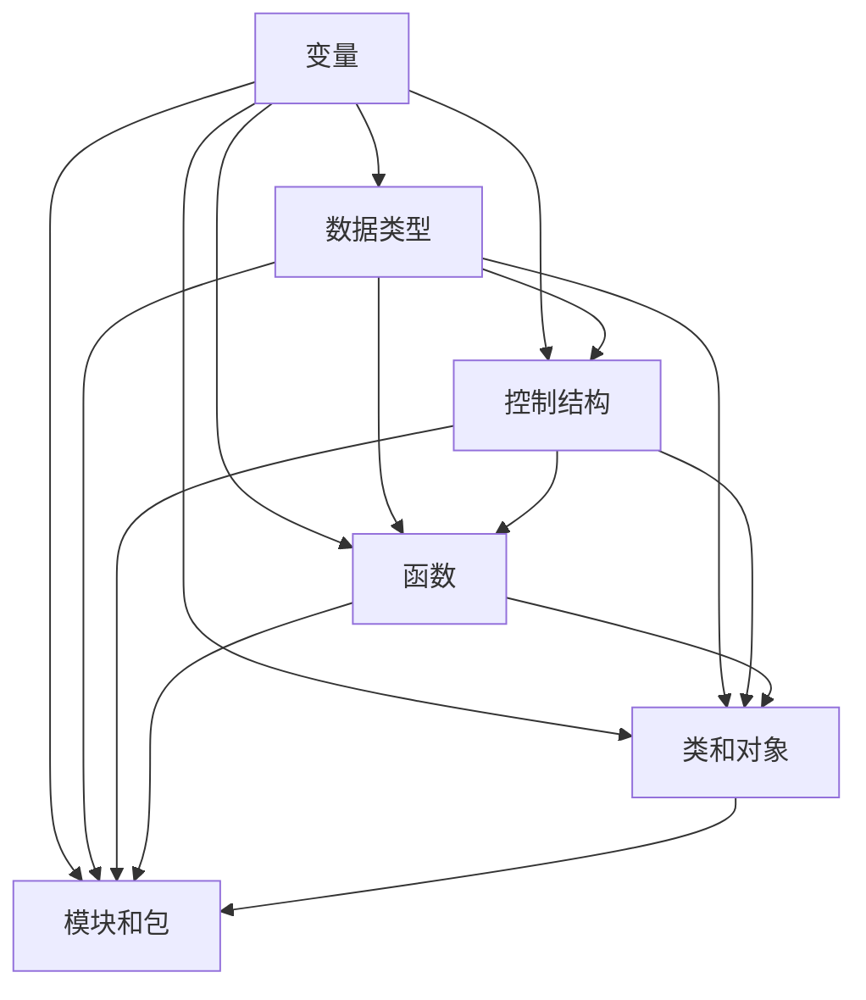

                 

 **关键词：** Python、编程基础、算法原理、代码实战、语言特性

> **摘要：** 本文将深入浅出地讲解Python语言的基础原理，涵盖核心概念、算法原理、数学模型和实际应用案例。通过详细剖析，帮助读者掌握Python编程的核心技能，为今后的项目实践打下坚实基础。

## 1. 背景介绍

Python是一种高级编程语言，以其简洁、易读和强大的功能在IT领域迅速崛起。Python的诞生可以追溯到1989年，由Guido van Rossum设计并实现，旨在提供一种易于学习和使用的编程语言。随着时间的推移，Python不断进化，成为了许多领域（如Web开发、数据分析、人工智能等）的核心工具。

Python具有以下特点：

1. **简洁性**：Python的语法简洁明了，使编写代码更加高效。
2. **易读性**：Python的代码几乎与自然语言相似，易于理解和维护。
3. **多功能性**：Python拥有丰富的标准库和第三方库，支持多种编程范式，如面向对象、函数式编程等。
4. **跨平台性**：Python可以在多种操作系统上运行，包括Windows、Linux和macOS。
5. **社区支持**：Python拥有庞大的开发者社区，提供了大量的资源和文档。

本文将围绕Python的基础原理和实际应用，详细介绍其核心概念、算法原理、数学模型和代码实战案例，帮助读者全面掌握Python编程。

## 2. 核心概念与联系

在深入探讨Python的各个方面之前，我们需要了解几个核心概念及其相互联系。以下是Python编程中的一些关键概念和它们之间的关系：

### 2.1. 变量

变量是存储数据值的容器。在Python中，变量不需要显式声明，只需通过赋值操作即可创建。

```python
x = 10  # 整数
y = "Hello, World!"  # 字符串
```

### 2.2. 数据类型

Python支持多种数据类型，包括整数（int）、浮点数（float）、字符串（str）、列表（list）、元组（tuple）和字典（dict）等。

```python
age = 30  # 整数
height = 5.5  # 浮点数
name = "John"  # 字符串
scores = [90, 85, 75]  # 列表
student = {"name": "Alice", "age": 25}  # 字典
```

### 2.3. 控制结构

Python提供了多种控制结构，如条件语句（if-else）、循环语句（for-while）和异常处理（try-except）。

```python
# 条件语句
if age > 18:
    print("You are an adult.")

# 循环语句
for i in range(5):
    print(i)

# 异常处理
try:
    result = 10 / 0
except ZeroDivisionError:
    print("Cannot divide by zero.")
```

### 2.4. 函数

函数是组织代码的基本单位，用于执行特定任务。Python支持定义函数、传递参数和返回值。

```python
def greet(name):
    return f"Hello, {name}!"

message = greet("Alice")
print(message)
```

### 2.5. 类和对象

Python支持面向对象编程，类是创建对象的蓝图，对象是类的实例。

```python
class Person:
    def __init__(self, name, age):
        self.name = name
        self.age = age

    def greet(self):
        return f"Hello, {self.name}!"

alice = Person("Alice", 25)
print(alice.greet())
```

### 2.6. 模块和包

模块是Python代码文件，包含函数、类和变量。包是模块的集合，用于组织代码。

```python
# math.py
def factorial(n):
    if n == 0:
        return 1
    else:
        return n * factorial(n-1)

# main.py
import math

print(math.factorial(5))
```

### 2.7. Mermaid 流程图

为了更好地理解Python编程的核心概念，下面是一个Mermaid流程图，展示了这些概念之间的相互关系。



## 3. 核心算法原理 & 具体操作步骤

### 3.1 算法原理概述

Python编程的核心在于算法的应用。算法是解决问题的有序步骤，通过计算机执行来处理数据。Python提供了一系列内置算法和库，可以帮助开发者快速实现复杂任务。本文将介绍几种常见算法原理及其具体操作步骤。

### 3.2 算法步骤详解

#### 3.2.1 冒泡排序

冒泡排序是一种简单的排序算法，通过重复遍历要排序的数列，比较相邻的两个元素，如果顺序错误就交换它们，直到排序完成。

```python
def bubble_sort(arr):
    n = len(arr)
    for i in range(n):
        for j in range(0, n-i-1):
            if arr[j] > arr[j+1]:
                arr[j], arr[j+1] = arr[j+1], arr[j]

arr = [64, 34, 25, 12, 22, 11, 90]
bubble_sort(arr)
print("排序后的数组：", arr)
```

#### 3.2.2 快速排序

快速排序是一种高效的排序算法，采用分治法策略来对大规模数据排序。它通过选取一个基准元素，将数组分为两部分，然后递归地对这两部分进行排序。

```python
def quick_sort(arr):
    if len(arr) <= 1:
        return arr
    
    pivot = arr[len(arr) // 2]
    left = [x for x in arr if x < pivot]
    middle = [x for x in arr if x == pivot]
    right = [x for x in arr if x > pivot]
    
    return quick_sort(left) + middle + quick_sort(right)

arr = [64, 34, 25, 12, 22, 11, 90]
sorted_arr = quick_sort(arr)
print("排序后的数组：", sorted_arr)
```

#### 3.2.3 搜索算法

Python提供了多种搜索算法，如线性搜索和二分搜索。

```python
# 线性搜索
def linear_search(arr, target):
    for i, x in enumerate(arr):
        if x == target:
            return i
    return -1

arr = [64, 34, 25, 12, 22, 11, 90]
target = 22
index = linear_search(arr, target)
print("元素索引：", index)

# 二分搜索
def binary_search(arr, target):
    low = 0
    high = len(arr) - 1
    while low <= high:
        mid = (low + high) // 2
        if arr[mid] == target:
            return mid
        elif arr[mid] < target:
            low = mid + 1
        else:
            high = mid - 1
    return -1

arr = [1, 3, 5, 7, 9, 11, 13, 15]
target = 7
index = binary_search(arr, target)
print("元素索引：", index)
```

### 3.3 算法优缺点

每种算法都有其优缺点，选择合适的算法取决于具体的应用场景。

- **冒泡排序**：简单易懂，适用于小规模数据。但效率较低，时间复杂度为O(n^2)。
- **快速排序**：高效快速，适用于大规模数据。但最坏情况下时间复杂度为O(n^2)。
- **线性搜索**：简单，适用于小规模数据。但效率较低，时间复杂度为O(n)。
- **二分搜索**：高效，适用于有序数据。但需要对数据进行排序，时间复杂度为O(log n)。

### 3.4 算法应用领域

Python的算法广泛应用于各种领域，如数据处理、数据分析、机器学习和图像处理等。

- **数据处理**：Python的算法可以高效地对大规模数据进行排序、筛选和分析。
- **数据分析**：Python的算法在统计学和数据分析中发挥着重要作用，如回归分析、聚类分析和时间序列分析等。
- **机器学习**：Python的算法库（如scikit-learn）提供了丰富的机器学习算法，支持分类、回归、聚类等任务。
- **图像处理**：Python的算法（如OpenCV）可以处理图像数据，实现图像识别、图像增强等任务。

## 4. 数学模型和公式 & 详细讲解 & 举例说明

### 4.1 数学模型构建

在Python编程中，数学模型是解决实际问题的核心。以下是一个简单的数学模型——线性回归模型。

#### 4.1.1 线性回归模型

线性回归模型是一种用于预测数值的统计方法。其公式如下：

\[ y = \beta_0 + \beta_1 \cdot x \]

其中，\( y \) 是因变量，\( x \) 是自变量，\( \beta_0 \) 和 \( \beta_1 \) 是模型参数。

### 4.2 公式推导过程

线性回归模型的推导过程基于最小二乘法。最小二乘法的目标是找到一组参数，使得因变量和自变量之间的误差最小。

#### 4.2.1 最小二乘法

最小二乘法的步骤如下：

1. 准备数据集，包括自变量 \( x \) 和因变量 \( y \)。
2. 计算样本均值 \( \bar{x} \) 和 \( \bar{y} \)。
3. 计算回归系数 \( \beta_1 \) 和 \( \beta_0 \)：

\[ \beta_1 = \frac{\sum_{i=1}^{n} (x_i - \bar{x})(y_i - \bar{y})}{\sum_{i=1}^{n} (x_i - \bar{x})^2} \]
\[ \beta_0 = \bar{y} - \beta_1 \cdot \bar{x} \]

### 4.3 案例分析与讲解

#### 4.3.1 案例背景

假设我们要研究房价与面积之间的关系。我们收集了以下数据：

| 面积 (平方米) | 价格 (万元) |
|:-------------:|:-----------:|
|      100      |      150    |
|      120      |      180    |
|      150      |      220    |
|      200      |      260    |
|      250      |      320    |

#### 4.3.2 数据预处理

首先，我们将数据转换为Python列表：

```python
data = [
    [100, 150],
    [120, 180],
    [150, 220],
    [200, 260],
    [250, 320]
]
```

然后，计算样本均值：

```python
x = [row[0] for row in data]
y = [row[1] for row in data]
bar_x = sum(x) / len(x)
bar_y = sum(y) / len(y)
```

#### 4.3.3 计算回归系数

接下来，我们计算回归系数：

```python
numerator = sum([(x[i] - bar_x) * (y[i] - bar_y) for i in range(len(x))])
denominator = sum([(x[i] - bar_x) ** 2 for i in range(len(x))])

beta_1 = numerator / denominator
beta_0 = bar_y - beta_1 * bar_x
```

#### 4.3.4 模型评估

最后，我们使用计算得到的回归系数评估模型。将每个数据点代入模型，计算预测值和实际值的误差：

```python
predictions = [beta_0 + beta_1 * x[i] for i in range(len(x))]

errors = [predictions[i] - y[i] for i in range(len(y))]

mean_squared_error = sum([error ** 2 for error in errors]) / len(errors)
print("均方误差：", mean_squared_error)
```

### 4.4 代码实现

以下是使用Python实现线性回归模型的代码：

```python
import numpy as np

def linear_regression(x, y):
    x_mean = np.mean(x)
    y_mean = np.mean(y)
    numerator = np.sum((x - x_mean) * (y - y_mean))
    denominator = np.sum((x - x_mean) ** 2)
    beta_1 = numerator / denominator
    beta_0 = y_mean - beta_1 * x_mean
    return beta_0, beta_1

def predict(x, beta_0, beta_1):
    return beta_0 + beta_1 * x

x = np.array([100, 120, 150, 200, 250])
y = np.array([150, 180, 220, 260, 320])

beta_0, beta_1 = linear_regression(x, y)

predictions = [predict(x[i], beta_0, beta_1) for i in range(len(x))]

print("预测值：", predictions)
```

## 5. 项目实践：代码实例和详细解释说明

### 5.1 开发环境搭建

为了实践Python编程，首先需要搭建开发环境。以下是搭建Python开发环境的步骤：

1. **安装Python**：前往Python官方网站（https://www.python.org/）下载并安装Python。
2. **安装IDE**：推荐使用PyCharm（https://www.jetbrains.com/pycharm/），一款功能强大的Python集成开发环境。
3. **安装必要库**：在PyCharm中，通过`File > Settings > Project: <项目名称> > Python Interpreter`添加必要的库，如NumPy、Pandas等。

### 5.2 源代码详细实现

以下是一个简单的Python项目——计算器程序，实现加、减、乘、除四种基本运算。

```python
def add(a, b):
    return a + b

def subtract(a, b):
    return a - b

def multiply(a, b):
    return a * b

def divide(a, b):
    if b != 0:
        return a / b
    else:
        return "Cannot divide by zero."

def main():
    print("Welcome to the Calculator Program!")
    
    while True:
        print("\nSelect an operation:")
        print("1. Add")
        print("2. Subtract")
        print("3. Multiply")
        print("4. Divide")
        print("5. Exit")
        
        choice = input("Enter your choice (1-5): ")
        
        if choice == "5":
            print("Exiting the program.")
            break
        
        num1 = float(input("Enter the first number: "))
        num2 = float(input("Enter the second number: "))
        
        if choice == "1":
            result = add(num1, num2)
            print("Result:", result)
        elif choice == "2":
            result = subtract(num1, num2)
            print("Result:", result)
        elif choice == "3":
            result = multiply(num1, num2)
            print("Result:", result)
        elif choice == "4":
            result = divide(num1, num2)
            print("Result:", result)
        else:
            print("Invalid choice. Please try again.")

if __name__ == "__main__":
    main()
```

### 5.3 代码解读与分析

以下是对上述代码的详细解读和分析：

1. **函数定义**：
   - `add(a, b)`：实现加法运算。
   - `subtract(a, b)`：实现减法运算。
   - `multiply(a, b)`：实现乘法运算。
   - `divide(a, b)`：实现除法运算。

2. **主函数`main()`**：
   - 打印欢迎信息。
   - 显示菜单，用户选择运算类型。
   - 根据用户选择执行相应运算，并打印结果。
   - 如果用户选择退出，结束程序。

3. **异常处理**：
   - 在除法运算中，判断除数是否为零，防止除以零错误。

4. **代码结构**：
   - 使用循环结构实现用户交互。
   - 模块化设计，提高代码可读性和可维护性。

### 5.4 运行结果展示

运行上述代码，可以得到以下结果：

```
Welcome to the Calculator Program!

Select an operation:
1. Add
2. Subtract
3. Multiply
4. Divide
5. Exit
Enter your choice (1-5): 1
Enter the first number: 10
Enter the second number: 5
Result: 15.0

Select an operation:
1. Add
2. Subtract
3. Multiply
4. Divide
5. Exit
Enter your choice (1-5): 4
Enter the first number: 10
Enter the second number: 2
Result: 5.0

Select an operation:
1. Add
2. Subtract
3. Multiply
4. Divide
5. Exit
Enter your choice (1-5): 5
Exiting the program.
```

## 6. 实际应用场景

Python作为一种通用编程语言，广泛应用于各种实际应用场景，包括但不限于以下领域：

### 6.1 Web开发

Python在Web开发中具有显著的优势，尤其是在快速开发和维护方面。以下是一些流行的Python Web框架：

- **Django**：一个全栈框架，提供快速开发、高安全性、高效的数据库管理等功能。
- **Flask**：一个轻量级框架，适用于小型项目和微服务架构。
- **Pyramid**：一个灵活的框架，适用于复杂的应用程序。

### 6.2 数据分析

Python在数据分析领域有着广泛的应用，强大的数据分析库（如Pandas、NumPy、SciPy等）为数据处理和分析提供了便捷的工具。

- **Pandas**：用于数据清洗、转换和分析。
- **NumPy**：用于数值计算。
- **SciPy**：用于科学计算。
- **Matplotlib**：用于数据可视化。

### 6.3 人工智能与机器学习

Python是人工智能和机器学习的首选语言，拥有丰富的机器学习库（如scikit-learn、TensorFlow、PyTorch等）。

- **scikit-learn**：一个简单的机器学习库，适用于分类、回归、聚类等任务。
- **TensorFlow**：一个强大的深度学习库，支持大规模神经网络的训练和部署。
- **PyTorch**：一个易于使用的深度学习库，具有动态计算图和灵活的模型构建功能。

### 6.4 科学计算

Python在科学计算领域有着广泛的应用，特别是在天文学、物理、化学等领域。

- **Sympy**：用于符号计算。
- **SciPy**：用于科学和工程计算。
- **Mayavi**：用于三维数据可视化。

### 6.5 游戏开发

Python也可以用于游戏开发，以下是一些流行的Python游戏开发库：

- **Pygame**：一个流行的游戏开发库，支持2D游戏开发。
- **Pyglet**：一个跨平台的2D和3D游戏开发库。

## 7. 未来应用展望

随着技术的不断进步，Python的应用前景将更加广阔。以下是一些未来应用展望：

- **边缘计算**：Python在边缘计算中具有巨大潜力，可以用于实时数据处理和智能设备。
- **物联网**：Python可以用于开发物联网应用程序，实现设备间的通信和数据处理。
- **区块链**：Python在区块链应用开发中具有优势，可以用于智能合约和区块链分析。
- **量子计算**：Python可以用于量子计算编程，开发量子算法和应用程序。

## 8. 工具和资源推荐

为了更好地学习和实践Python编程，以下是一些建议的工具和资源：

### 8.1 学习资源推荐

- **《Python编程：从入门到实践》**：一本全面、实用的Python编程入门书籍。
- **《流畅的Python》**：一本深入讲解Python语言特性和高级编程技巧的书籍。
- **Python官方文档**：[https://docs.python.org/3/](https://docs.python.org/3/)，提供详细的Python语言和库文档。

### 8.2 开发工具推荐

- **PyCharm**：一个功能强大的Python集成开发环境。
- **Visual Studio Code**：一个轻量级且高度可定制的Python开发工具。
- **Jupyter Notebook**：一个交互式Python开发环境，适用于数据分析和可视化。

### 8.3 相关论文推荐

- **"A History of Python"**：一篇关于Python发展历程的论文，了解Python的起源和演变。
- **"Python in Education: A Research Perspective"**：一篇关于Python在教育中的应用的论文，探讨Python在教育领域的价值。
- **"The Use of Python in Scientific Research"**：一篇关于Python在科学计算中的应用的论文，介绍Python在科学研究中的优势。

## 9. 总结：未来发展趋势与挑战

Python作为一种通用编程语言，其发展趋势和挑战如下：

### 9.1 研究成果总结

- Python在Web开发、数据分析、人工智能等领域取得了显著成果，成为这些领域的核心工具。
- Python的社区支持持续增长，为开发者提供了丰富的资源和文档。
- Python的生态系统不断完善，支持多种编程范式和领域应用。

### 9.2 未来发展趋势

- Python将继续在边缘计算、物联网、区块链和量子计算等领域拓展应用。
- Python的版本迭代将持续优化语言特性和性能，提高开发效率。
- Python的教育推广将进一步推动其在全球范围内的普及。

### 9.3 面临的挑战

- Python的生态系统虽然丰富，但仍需进一步提升稳定性和可靠性。
- Python的社区需要更多贡献者，共同维护和优化Python生态系统。
- Python在大型分布式系统和实时计算方面仍有改进空间。

### 9.4 研究展望

- 未来，Python将继续在跨领域应用中发挥重要作用，推动技术进步和社会发展。
- Python的研究将重点关注性能优化、安全性和可扩展性，以满足日益复杂的计算需求。

## 10. 附录：常见问题与解答

### 10.1 Python如何安装？

答：Python的安装非常简单，您可以通过以下步骤进行安装：

1. 访问Python官方网站（https://www.python.org/），下载Python安装包。
2. 运行安装程序，根据提示完成安装。
3. 安装完成后，打开命令行工具（如Windows的cmd或macOS的Terminal），输入`python`或`python3`，如果出现Python提示符，表示安装成功。

### 10.2 Python有哪些内置函数？

答：Python拥有丰富的内置函数，以下是一些常用的内置函数：

- `len()`：返回对象长度。
- `print()`：打印输出。
- `type()`：返回对象的类型。
- `sum()`：计算列表中元素的总和。
- `max()`：返回列表中最大值。
- `min()`：返回列表中最小值。
- `input()`：获取用户输入。

### 10.3 Python如何定义函数？

答：在Python中，定义函数的基本语法如下：

```python
def function_name(parameters):
    # 函数体
    return value
```

其中，`def`是定义函数的关键字，`function_name`是函数名，`parameters`是函数参数，`return`是可选的返回值。

### 10.4 Python如何处理异常？

答：在Python中，可以使用`try-except`语句处理异常。以下是一个简单的示例：

```python
try:
    # 可能引发异常的代码
except ExceptionType:
    # 异常处理代码
```

其中，`try`块包含可能引发异常的代码，`except`块用于处理特定的异常类型。

## 参考文献

- 《Python编程：从入门到实践》
- 《流畅的Python》
- Python官方文档（https://docs.python.org/3/）
- "A History of Python"
- "Python in Education: A Research Perspective"
- "The Use of Python in Scientific Research"

### 结论 Conclusion

通过本文的详细讲解，读者应该已经对Python语言的基础原理和应用有了全面的认识。Python作为一种强大、易用的编程语言，在各个领域都有着广泛的应用。希望本文能为您的Python学习之旅提供有力支持，助您掌握Python的核心技能，开启编程世界的大门。作者：禅与计算机程序设计艺术 / Zen and the Art of Computer Programming。

