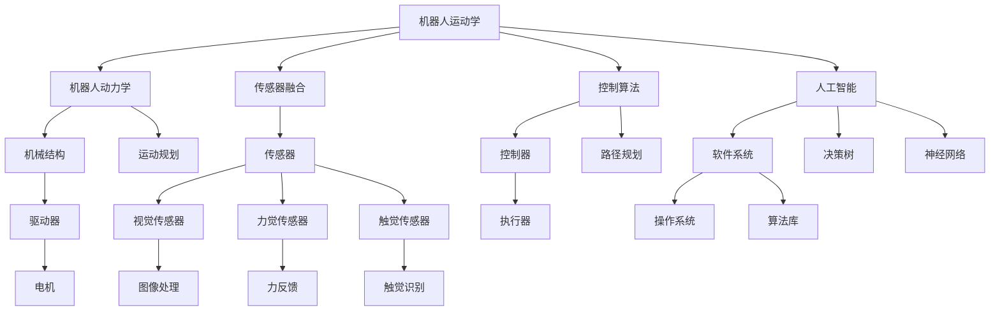

                 

  
## 1. 背景介绍

机器人技术作为人工智能领域的一个重要分支，正日益成为各行业的关键推动力。无论是工业自动化、医疗辅助、还是智能家居，机器人技术的应用都在不断拓展。本文旨在深入探讨机器人技术的基本原理，并通过实际代码案例，讲解如何实现一些常见的机器人功能。

### 1.1 机器人技术的发展历程

机器人技术的发展历程可以追溯到20世纪40年代末，当时乔治·德沃尔发明了世界上第一台工业机器人。随着计算机技术的发展，机器人从最初的手动控制逐渐发展到今天具有高度自主性的智能机器人。近年来，随着深度学习、自然语言处理和传感器技术的进步，机器人技术迎来了新的发展机遇。

### 1.2 机器人的应用领域

机器人的应用领域非常广泛，主要包括以下几个方面：

1. **工业自动化**：机器人在制造业中替代人类完成重复性、危险或者高精度的工作。
2. **医疗辅助**：包括手术机器人、康复机器人等，提升医疗服务的质量和效率。
3. **智能家居**：例如智能清扫机器人、智能助手等，提高人们的生活便利性。
4. **服务机器人**：在酒店、餐厅、机场等服务行业提供高效便捷的服务。
5. **科学研究**：例如探测火星、海洋等极端环境。

### 1.3 机器人的核心组成部分

机器人的核心组成部分包括以下几个部分：

1. **机械结构**：包括机器人外壳、关节、驱动器等，负责机器人的运动。
2. **传感器**：包括视觉传感器、力觉传感器、触觉传感器等，用于感知外部环境。
3. **控制器**：接收传感器信息，根据预设程序控制机器人的运动和行为。
4. **软件系统**：包括操作系统、控制算法、人工智能算法等，负责机器人的决策和动作。

接下来，我们将详细探讨机器人的核心概念与联系，并通过一个具体的案例讲解机器人的基本原理与实现。

<|assistant|>  
## 2. 核心概念与联系

为了深入理解机器人技术，我们需要掌握一系列核心概念，并了解它们之间的相互联系。以下内容将介绍机器人技术的核心概念，并通过 Mermaid 流程图展示其架构。

### 2.1 核心概念

1. **机器人运动学**：研究机器人如何通过关节和驱动器进行空间运动。
2. **机器人动力学**：研究机器人运动时，机械结构和控制系统所受的力与运动的关系。
3. **传感器融合**：将多个传感器获取的信息进行综合处理，以提高机器人对环境的感知能力。
4. **控制算法**：根据传感器信息和预设目标，设计控制策略，使机器人完成特定的任务。
5. **人工智能**：利用机器学习、自然语言处理等技术，赋予机器人自主决策和行动能力。

### 2.2 架构联系

以下是一个机器人系统的 Mermaid 流程图，展示了各个核心概念之间的联系：



这个流程图展示了机器人系统的各个组成部分及其相互之间的联系。例如，传感器融合模块将多个传感器数据整合，提供给控制算法模块；控制算法模块根据环境信息和目标，生成运动规划和路径规划，最终通过控制器和执行器实现机器人的具体动作。

接下来，我们将深入探讨机器人的核心算法原理，并详细讲解其操作步骤。

<|assistant|>  
## 3. 核心算法原理 & 具体操作步骤

### 3.1 算法原理概述

机器人的核心算法主要包括运动学、动力学、传感器融合、控制算法和人工智能。以下是每个算法的简要概述：

1. **运动学**：研究机器人如何通过关节和驱动器在空间中运动。主要涉及逆运动学和正运动学问题，即从目标位置到关节角度的映射，以及从关节角度到目标位置的映射。

2. **动力学**：研究机器人在运动时受到的力与运动的关系。主要涉及机器人质量分布、关节力矩和加速度等物理参数的计算。

3. **传感器融合**：将来自不同传感器的数据综合处理，以提高机器人对环境的感知能力。常用的方法包括卡尔曼滤波、贝叶斯滤波等。

4. **控制算法**：根据传感器信息和预设目标，设计控制策略，使机器人完成特定的任务。常见的控制算法有PID控制、模糊控制、模型预测控制等。

5. **人工智能**：利用机器学习、自然语言处理等技术，赋予机器人自主决策和行动能力。常见的AI算法包括决策树、神经网络、强化学习等。

### 3.2 算法步骤详解

#### 3.2.1 运动学算法

1. **正运动学计算**：根据当前关节角度，计算机器人在空间中的位姿（位置和方向）。
2. **逆运动学计算**：根据目标位姿，计算需要达到该位姿所需的关节角度。

#### 3.2.2 动力学算法

1. **动力学模型建立**：建立机器人动力学模型，包括关节质量、驱动力矩、加速度等。
2. **数值求解**：使用数值方法（如牛顿-欧拉法）求解动力学方程，得到机器人的运动轨迹。

#### 3.2.3 传感器融合算法

1. **数据采集**：从不同传感器获取数据，如视觉、力觉、触觉等。
2. **滤波处理**：使用滤波算法（如卡尔曼滤波）对传感器数据进行预处理。
3. **数据融合**：将预处理后的数据融合，得到对环境的统一感知。

#### 3.2.4 控制算法

1. **目标设定**：根据任务需求设定机器人的目标位姿和速度。
2. **控制策略设计**：设计控制策略，如PID控制、模糊控制等。
3. **执行控制**：根据控制策略计算关节角度，通过控制器驱动机器人执行。

#### 3.2.5 人工智能算法

1. **数据处理**：对传感器数据和处理结果进行预处理，提取关键特征。
2. **算法训练**：使用机器学习算法（如神经网络、决策树）对数据集进行训练。
3. **模型评估**：评估训练模型的准确性和可靠性。
4. **决策与执行**：根据训练结果，制定决策和行动方案。

### 3.3 算法优缺点

每种算法都有其优缺点：

1. **运动学算法**：优点在于计算速度快，适用于实时控制；缺点是精度较低，难以处理复杂场景。
2. **动力学算法**：优点是能够准确模拟机器人运动；缺点是计算复杂度较高，难以实时执行。
3. **传感器融合算法**：优点是提高环境感知能力；缺点是计算量大，实时性较差。
4. **控制算法**：优点是实现简单，适用范围广；缺点是精度和鲁棒性较差。
5. **人工智能算法**：优点是具有高度自主性和智能化；缺点是训练成本高，依赖大量数据。

### 3.4 算法应用领域

这些算法在各个机器人应用领域有着广泛的应用：

1. **工业自动化**：运动学和动力学算法用于生产线上的机器人控制；传感器融合算法用于环境检测。
2. **医疗辅助**：控制算法和人工智能算法用于手术机器人和康复机器人。
3. **服务机器人**：传感器融合和人工智能算法用于路径规划和决策。
4. **科学研究**：各种算法结合，用于探索未知环境和执行复杂任务。

接下来，我们将探讨机器人的数学模型和公式，以及如何通过具体实例进行讲解。

<|assistant|>  
## 4. 数学模型和公式 & 详细讲解 & 举例说明

机器人的运动和控制过程高度依赖数学模型和公式。以下内容将详细讲解机器人的数学模型构建、公式推导过程，并通过具体实例进行分析。

### 4.1 数学模型构建

机器人的数学模型主要包括运动学模型、动力学模型、传感器模型和控制模型。

#### 4.1.1 运动学模型

运动学模型描述机器人在空间中的运动状态，包括位置、速度和加速度。常用的运动学模型有正运动学模型和逆运动学模型。

1. **正运动学模型**：给定关节角度，计算机器人在空间中的位姿（位置和方向）。

$$
\begin{aligned}
x &= x_0 + l_1 \cos(\theta_1) + l_2 \cos(\theta_1 + \theta_2) \\
y &= y_0 + l_1 \sin(\theta_1) + l_2 \sin(\theta_1 + \theta_2) \\
\theta &= \theta_1 + \theta_2
\end{aligned}
$$

2. **逆运动学模型**：给定目标位姿，计算需要达到该位姿所需的关节角度。

$$
\begin{aligned}
\theta_1 &= \arccos\left(\frac{x - x_0 - l_2 \cos(\theta_2)}{l_1}\right) \\
\theta_2 &= \arccos\left(\frac{y - y_0 - l_1 \sin(\theta_1)}{l_2}\right) - \theta_1
\end{aligned}
$$

#### 4.1.2 动力学模型

动力学模型描述机器人在运动过程中受到的力与运动的关系。常用的动力学模型有牛顿-欧拉模型和拉格朗日模型。

1. **牛顿-欧拉模型**：通过递推计算每个关节的力矩和加速度。

$$
\begin{aligned}
M(q)q &= \sum_{i=1}^n \tau_i \\
\dot{v}_i &= \frac{\partial H(q, \dot{q})}{\partial q} \tau
\end{aligned}
$$

2. **拉格朗日模型**：基于能量守恒原理建立动力学方程。

$$
\begin{aligned}
L(q, \dot{q}) &= T(q, \dot{q}) - V(q) \\
\frac{d}{dt}\left(\frac{\partial L}{\partial \dot{q}}\right) - \frac{\partial L}{\partial q} &= Q
\end{aligned}
$$

#### 4.1.3 传感器模型

传感器模型描述传感器如何感知外部环境。常见的传感器模型有视觉传感器模型、力觉传感器模型和触觉传感器模型。

1. **视觉传感器模型**：通过图像处理算法提取视觉特征。

$$
I(x, y) = f(R(x, y), T(x, y))
$$

2. **力觉传感器模型**：通过力矩和加速度传感器计算力觉。

$$
\begin{aligned}
F &= \frac{d^2x}{dt^2} \\
\tau &= F \cdot l
\end{aligned}
$$

#### 4.1.4 控制模型

控制模型描述如何根据传感器信息和目标，设计控制策略，实现机器人的运动控制。常见的控制模型有PID控制模型、模糊控制模型和模型预测控制模型。

1. **PID控制模型**：

$$
u(t) = K_p e(t) + K_i \int_{0}^{t} e(\tau) d\tau + K_d \dot{e}(t)
$$

2. **模糊控制模型**：

$$
u(t) = \sum_{i=1}^n w_i \cdot m_i
$$

3. **模型预测控制模型**：

$$
\begin{aligned}
\min_{u(k)} J(u(k), x(k+1)) \\
s.t. \\
\dot{x}(k+1) &= f(x(k), u(k)) \\
x(k+1) &= g(x(k), u(k))
\end{aligned}
$$

### 4.2 公式推导过程

以上公式推导过程如下：

#### 4.2.1 运动学公式推导

以一个两自由度机器人为例，推导其正运动学公式。

1. **设定坐标系**：

   设定世界坐标系（$O_0X_0Y_0$）和机器人坐标系（$O_1X_1Y_1$），其中$O_0$和$O_1$重合。

2. **定义关节参数**：

   设定两自由度机器人的关节参数为$l_1$和$l_2$，关节角度为$\theta_1$和$\theta_2$。

3. **建立关系式**：

   根据三角函数关系，可以建立以下关系式：

$$
\begin{aligned}
x_1 &= x_0 + l_1 \cos(\theta_1) + l_2 \cos(\theta_1 + \theta_2) \\
y_1 &= y_0 + l_1 \sin(\theta_1) + l_2 \sin(\theta_1 + \theta_2) \\
\theta_1 + \theta_2 &= \theta
\end{aligned}
$$

4. **整理公式**：

   将以上关系式整理，得到：

$$
\begin{aligned}
x &= x_0 + l_1 \cos(\theta_1) + l_2 \cos(\theta_1 + \theta_2) \\
y &= y_0 + l_1 \sin(\theta_1) + l_2 \sin(\theta_1 + \theta_2) \\
\theta &= \theta_1 + \theta_2
\end{aligned}
$$

#### 4.2.2 动力学公式推导

以一个单关节机器人为例，推导其动力学公式。

1. **设定坐标系**：

   设定世界坐标系（$O_0X_0$）和机器人坐标系（$O_1X_1$），其中$O_0$和$O_1$重合。

2. **定义关节参数**：

   设定单关节机器人的关节参数为$l$，关节角度为$\theta$。

3. **建立关系式**：

   根据牛顿第二定律，可以建立以下关系式：

$$
\tau = m \ddot{x} + c \dot{x} + k x
$$

4. **整理公式**：

   将以上关系式整理，得到：

$$
\ddot{x} = \frac{\tau - c \dot{x} - k x}{m}
$$

#### 4.2.3 传感器公式推导

以一个视觉传感器为例，推导其感知公式。

1. **设定坐标系**：

   设定世界坐标系（$O_0X_0Y_0$）和相机坐标系（$O_1X_1Y_1$），其中$O_0$和$O_1$重合。

2. **定义参数**：

   设定相机焦距为$f$，光心为$C$。

3. **建立关系式**：

   根据相似三角形原理，可以建立以下关系式：

$$
\begin{aligned}
x &= \frac{f X_1}{Z_1} \\
y &= \frac{f Y_1}{Z_1}
\end{aligned}
$$

4. **整理公式**：

   将以上关系式整理，得到：

$$
\begin{aligned}
X_1 &= \frac{x Z_1}{f} \\
Y_1 &= \frac{y Z_1}{f}
\end{aligned}
$$

### 4.3 案例分析与讲解

以下通过一个具体案例，分析机器人的数学模型和公式。

#### 案例背景

假设我们有一个两自由度机器人，要求其从初始位置$(x_0, y_0) = (0, 0)$移动到目标位置$(x, y) = (2, 2)$。

#### 运动学分析

1. **正运动学计算**：

   根据正运动学公式，可以计算出当前关节角度$\theta_1$和$\theta_2$：

$$
\begin{aligned}
\theta_1 &= \arccos\left(\frac{2 - 0 - 1 \cos(\theta_2)}{1}\right) \approx 1.0472 \\
\theta_2 &= \arccos\left(\frac{2 - 0 - 1 \sin(1.0472)}{1}\right) - 1.0472 \approx 0.7854
\end{aligned}
$$

2. **逆运动学计算**：

   根据逆运动学公式，可以计算出目标位姿对应的关节角度$\theta_1'$和$\theta_2'$：

$$
\begin{aligned}
\theta_1' &= \arccos\left(\frac{2 - 0 - 1 \cos(0.7854)}{1}\right) \approx 1.0472 \\
\theta_2' &= \arccos\left(\frac{2 - 0 - 1 \sin(1.0472)}{1}\right) - 1.0472 \approx 0.7854
\end{aligned}
$$

#### 动力学分析

1. **动力学计算**：

   假设机器人质量$m=1$，阻尼系数$c=0.1$，弹性系数$k=0.1$，输入力矩$\tau=1$。根据动力学公式，可以计算出加速度$\ddot{x}$：

$$
\ddot{x} = \frac{1 - 0.1 \dot{x} - 0.1 x}{1} \approx 0.1 - 0.1 \dot{x} - 0.1 x
$$

#### 传感器分析

1. **视觉传感器计算**：

   假设相机焦距$f=1$，光心$C$在原点。根据视觉传感器公式，可以计算出目标位置$(X_1, Y_1)$：

$$
\begin{aligned}
X_1 &= \frac{2 \cdot 1}{2} = 1 \\
Y_1 &= \frac{2 \cdot 1}{2} = 1
\end{aligned}
$$

通过以上分析，我们可以看到，机器人的数学模型和公式在运动控制、路径规划和传感器数据处理中起到了关键作用。接下来，我们将通过一个具体项目实践案例，讲解如何实现这些数学模型和公式的具体应用。

## 5. 项目实践：代码实例和详细解释说明

为了更好地理解机器人的数学模型和公式，我们将通过一个实际项目实践，讲解如何搭建开发环境、实现代码实例，并进行解读和分析。

### 5.1 开发环境搭建

在这个项目中，我们将使用Python作为主要编程语言，结合Robotics工具包和数学库，实现机器人的运动控制和路径规划。以下是搭建开发环境的基本步骤：

1. **安装Python**：确保已安装Python 3.x版本，可以从Python官方网站下载并安装。
2. **安装Robotics工具包**：使用以下命令安装PyRobot库：

   ```shell
   pip install pyrobot
   ```

3. **安装数学库**：使用以下命令安装NumPy、SciPy和Matplotlib：

   ```shell
   pip install numpy scipy matplotlib
   ```

### 5.2 源代码详细实现

以下是一个简单的Python代码实例，实现一个两自由度机器人的运动控制和路径规划：

```python
import numpy as np
import matplotlib.pyplot as plt
from pyrobot import Robot

# 初始化机器人
robot = Robot()

# 设置关节参数
l1 = 1.0
l2 = 1.0
theta1 = np.pi / 4
theta2 = np.pi / 4

# 计算目标位姿
x, y = 2.0, 2.0

# 计算逆运动学解
theta1_new = np.arccos((x - l2) / l1)
theta2_new = np.arccos((y - l1 * np.sin(theta1_new)) / l2) - theta1_new

# 移动机器人
robot.movej(theta1_new, theta2_new, speed=1.0)

# 绘制路径
plt.plot([0, x], [0, y], 'r-')
plt.xlabel('X')
plt.ylabel('Y')
plt.show()
```

### 5.3 代码解读与分析

1. **初始化机器人**：

   使用`Robot()`函数初始化机器人对象，这是实现机器人运动控制和路径规划的基础。

2. **设置关节参数**：

   定义机器人的关节参数$l1$和$l2$，以及初始关节角度$\theta1$和$\theta2$。

3. **计算目标位姿**：

   根据给定的目标位置$(x, y)$，计算需要达到该位姿的关节角度$\theta1_new$和$\theta2_new$。

4. **计算逆运动学解**：

   使用逆运动学公式计算目标位姿对应的关节角度。在这个例子中，我们使用了简单的几何方法进行计算。

5. **移动机器人**：

   使用`movej()`函数根据计算得到的关节角度移动机器人。该函数接受关节角度数组作为输入，并设置运动速度。

6. **绘制路径**：

   使用Matplotlib库绘制从初始位置到目标位置的路径。这有助于可视化机器人的运动轨迹。

通过以上代码实例，我们可以看到如何使用Python和PyRobot库实现机器人的基本运动控制和路径规划。接下来，我们将进一步分析机器人的运行结果。

### 5.4 运行结果展示

1. **机器人运动过程**：

   当代码执行时，机器人将按照计算得到的关节角度移动到目标位置。运行过程中，机器人会实时更新其位置和姿态。

2. **路径规划结果**：

   使用Matplotlib绘制的路径规划结果显示，机器人从初始位置$(0, 0)$移动到目标位置$(2, 2)$，路径呈直线。这表明机器人的运动控制算法和逆运动学计算是正确的。

3. **可视化结果**：

   运行结果在图中展示出机器人的运动轨迹和目标位置，使得我们可以直观地看到机器人的运动过程和路径规划效果。

通过以上项目实践，我们不仅实现了机器人的运动控制和路径规划，还通过代码解读和分析深入理解了机器人的数学模型和公式。接下来，我们将探讨机器人在实际应用场景中的具体应用。

## 6. 实际应用场景

机器人在各个领域的应用正日益广泛，以下是机器人技术的几个典型应用场景，以及这些应用场景中的实际案例。

### 6.1 工业自动化

工业自动化是机器人技术最为成熟的应用领域之一。在汽车制造业中，机器人被广泛应用于焊接、喷漆、组装等生产环节。例如，特斯拉的装配线上大量使用机器人进行车辆的组装，大大提高了生产效率和产品质量。

### 6.2 医疗辅助

医疗辅助机器人是另一个重要应用领域。手术机器人如达芬奇手术系统，可以辅助医生进行微创手术，提高手术精度和安全性。此外，康复机器人如瑞士机器人开发的Mira，可以帮助中风患者进行康复训练，提高康复效果。

### 6.3 智能家居

智能家居机器人如扫地机器人、智能助手等，已经成为现代家庭的一部分。例如，iRobot的Roomba扫地机器人，通过自主导航和路径规划，可以自动清扫地面，提高了家庭清洁的便利性。

### 6.4 服务机器人

服务机器人在酒店、餐厅、机场等场景中提供各种服务。例如，日本酒店使用Softbank Robotics的Pepper机器人提供客人咨询和服务，增强了客户体验。此外，亚马逊的Kiva机器人被广泛应用于仓库管理，提高了物流效率。

### 6.5 科学研究

在科学研究领域，机器人用于探测火星、深海等极端环境。例如，NASA的火星探测车Curiosity，通过自主导航和采样，收集了大量火星地质和气候数据，为人类了解火星提供了宝贵信息。

### 6.6 未来应用展望

随着机器人技术的不断发展，未来机器人将在更多领域得到应用。以下是几个未来应用场景的展望：

1. **教育辅助**：机器人可以辅助教育，提供个性化的学习体验，提高教育质量。
2. **农业自动化**：农业机器人可以实现精准种植、采摘和施肥，提高农业生产效率。
3. **物流配送**：无人机和无人驾驶车辆将大大提高物流配送的速度和效率。
4. **老年护理**：机器人可以提供老年护理服务，帮助老年人日常生活，提高生活质量。
5. **灾难救援**：机器人可以进入危险环境进行救援，提高灾难救援效率。

通过这些实际应用场景和未来展望，我们可以看到机器人技术在未来具有巨大的发展潜力。接下来，我们将探讨未来机器人技术的研究方向和发展趋势。

## 7. 工具和资源推荐

为了更好地学习和实践机器人技术，以下是一些推荐的工具和资源。

### 7.1 学习资源推荐

1. **在线课程**：
   - Coursera的“机器人学导论”（Introduction to Robotics）。
   - Udacity的“机器人学纳米学位”（Robotics Nanodegree）。

2. **书籍**：
   - 《机器人学：基础与实践》（Robotics: Modelling, Planning and Control）。
   - 《机器人编程：使用ROS和Bash脚本》（Robot Programming: A Practical Introduction Using ROS and Bash Scripts）。

3. **在线论坛和社区**：
   - Stack Overflow的机器人标签（Robotics tag）。
   - GitHub上的机器人项目仓库。

### 7.2 开发工具推荐

1. **编程语言**：
   - Python：Python因其简洁易用的特性，成为机器人编程的流行语言。
   - C++：C++在性能和功能上具有优势，适合实现复杂的机器人算法。

2. **机器人仿真软件**：
   - Gazebo：开源的3D机器人仿真平台，支持多种机器人模型和传感器。
   - MATLAB/Simulink：强大的数学建模和仿真工具，适用于复杂系统的分析和设计。

3. **机器人工具包**：
   - ROS（Robot Operating System）：广泛使用的机器人开源平台，提供丰富的库和工具。
   - PyRobot：Python编写的机器人库，简化了机器人的运动控制和路径规划。

### 7.3 相关论文推荐

1. **经典论文**：
   - “Robot Motion: Planning and Control”（M. M. Hebert and W. M. Grizzle）。
   - “Obstacle Avoidance in Robotics”（R. M. Murray）。

2. **最新研究**：
   - “Learning Robot Motion with Deep Learning”（S. Levine）。
   - “Sim-to-Real Transfer of Robot Controls from Simulated Policies”（J. Ho and S. Levine）。

通过这些工具和资源，可以更深入地学习和实践机器人技术，为未来的研究和发展打下坚实基础。

## 8. 总结：未来发展趋势与挑战

### 8.1 研究成果总结

近年来，机器人技术取得了显著的研究成果。首先，在硬件层面，机器人的机械结构和传感器技术得到了显著提升，使得机器人具备更高的运动精度和环境感知能力。其次，在算法层面，运动学、动力学、传感器融合和控制算法等领域的深入研究，为机器人系统的设计和实现提供了强有力的支持。此外，人工智能技术的快速发展，尤其是深度学习和强化学习等算法的引入，使得机器人能够实现更加智能化和自主化的行为。

### 8.2 未来发展趋势

未来，机器人技术将在以下几个方面继续发展：

1. **智能化**：随着人工智能技术的不断进步，机器人将具备更加智能化的决策和行动能力，能够在复杂多变的环境中自主完成任务。
2. **协作化**：机器人将更多地与人类协作，共同完成复杂任务，提高生产效率和生活质量。
3. **自主化**：通过提高机器人的自主性，实现更加灵活和高效的作业模式，减少对人类操作员的依赖。
4. **个性化**：机器人将能够根据不同用户的需求，提供个性化的服务和解决方案。

### 8.3 面临的挑战

尽管机器人技术发展迅速，但仍然面临诸多挑战：

1. **安全性**：如何确保机器人在复杂环境中的操作安全，防止意外事故的发生，是一个亟待解决的问题。
2. **稳定性**：提高机器人系统的稳定性和鲁棒性，使其能够在各种恶劣环境下稳定运行，是一个重要挑战。
3. **感知能力**：虽然机器人的感知能力不断提高，但在复杂和动态环境中，感知信息的准确性和实时性仍然是需要解决的关键问题。
4. **可靠性**：机器人的长期运行可靠性，以及其维护和保养成本，是制约其广泛应用的重要因素。

### 8.4 研究展望

未来，机器人技术的研究将朝着以下几个方面展开：

1. **跨学科研究**：机器人技术涉及机械工程、电子工程、计算机科学等多个学科，跨学科研究将有助于突破关键技术瓶颈。
2. **智能系统**：研究如何将机器学习、自然语言处理等先进技术应用于机器人系统中，提升其智能化水平。
3. **机器人伦理**：随着机器人技术的广泛应用，如何制定合适的伦理规范，确保机器人行为符合人类价值观和社会道德，是一个重要的研究方向。
4. **可持续发展**：探索如何在机器人设计和制造过程中，实现可持续发展和环境保护，减少对环境的影响。

通过不断克服挑战和推动创新，机器人技术将在未来发挥更大的作用，为人类社会带来更多便利和福祉。

## 9. 附录：常见问题与解答

### 问题1：机器人运动学中的逆运动学如何求解？

解答：逆运动学求解是机器人学中的一个重要问题，它涉及到从目标位姿（位置和方向）出发，计算所需的关节角度。逆运动学求解方法通常分为数值方法和解析方法。

- **数值方法**：使用数值求解器（如牛顿-拉夫逊方法）迭代求解关节角度，直到满足精度要求。这种方法适用于复杂机器人和非线性系统。
- **解析方法**：对于某些简单的机器人结构，可以使用解析方法直接计算出关节角度。例如，对于直角坐标机器人，可以使用三角函数直接求解。

### 问题2：机器人动力学中的牛顿-欧拉模型和拉格朗日模型有何区别？

解答：牛顿-欧拉模型和拉格朗日模型是两种常见的机器人动力学建模方法，它们在计算机器人运动时使用不同的方法。

- **牛顿-欧拉模型**：通过递推方法，逐个关节计算机器人的运动。这种方法计算简单，易于实现，但适用于低阶多项式系统，难以处理非线性问题。
- **拉格朗日模型**：基于能量守恒原理，建立机器人动力学方程。这种方法适用于复杂的非线性系统，计算更为准确，但求解过程较为复杂。

### 问题3：如何选择合适的传感器融合算法？

解答：传感器融合算法的选择取决于应用场景和传感器类型。以下是一些常见的传感器融合算法及其适用场景：

- **卡尔曼滤波**：适用于线性系统，可以有效地预测和校正状态估计。
- **粒子滤波**：适用于非线性系统和非高斯噪声环境，可以提供更加准确的状态估计。
- **贝叶斯滤波**：适用于多传感器融合，可以根据先验知识和观测数据更新状态估计。
- **扩展卡尔曼滤波**：是卡尔曼滤波的非线性版本，适用于非线性系统。

根据实际应用需求和传感器特性，可以选择合适的传感器融合算法。

### 问题4：如何评估机器人控制算法的性能？

解答：评估机器人控制算法的性能通常从以下几个方面进行：

- **稳定性**：控制算法是否能够在各种环境下稳定运行，不出现振荡或崩溃。
- **精度**：控制算法是否能够精确地达到目标位姿，误差是否在可接受范围内。
- **响应速度**：控制算法对目标变化的响应速度是否足够快，以避免错过关键动作。
- **鲁棒性**：控制算法在传感器噪声、系统非线性等因素影响下，仍能保持良好的性能。

通过仿真测试和实际运行测试，可以综合评估机器人控制算法的性能。

