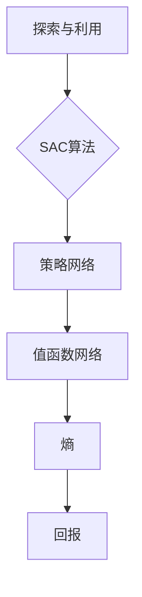

                 

关键词：SAC（Soft Actor-Critic），深度强化学习，算法原理，代码实例，应用领域

> 摘要：本文将深入讲解SAC（Soft Actor-Critic）算法的基本原理，通过详细的代码实例展示其在实际项目中的应用。我们将从SAC的核心概念出发，逐步深入到其数学模型和算法步骤，并结合实际案例进行分析和解读。

## 1. 背景介绍

随着人工智能的快速发展，深度强化学习（Deep Reinforcement Learning，DRL）逐渐成为研究的热点。强化学习是一种通过与环境交互来学习最优策略的机器学习方法，而深度强化学习则是将深度神经网络与强化学习相结合，解决了传统强化学习在复杂环境下的适应性差和收敛速度慢的问题。然而，深度强化学习在实际应用中也面临着诸多挑战，如探索与利用的平衡、收敛速度和稳定性等问题。

为了解决这些难题，Soft Actor-Critic（SAC）算法应运而生。SAC算法结合了软演员（Soft Actor）和硬评判（Hard Critic）的思想，通过优化策略网络和值函数网络，实现了更好的探索与利用平衡，提高了收敛速度和稳定性。本文将详细介绍SAC算法的原理、数学模型和代码实例，帮助读者深入理解和应用这一算法。

## 2. 核心概念与联系

在讲解SAC算法之前，我们需要了解一些核心概念，包括策略网络、值函数网络、熵、回报等。以下是这些核心概念的Mermaid流程图：



### 2.1 策略网络

策略网络用于生成行动的概率分布，即给定当前状态，策略网络输出一个概率分布，用于指导智能体选择下一个动作。在SAC算法中，策略网络是一个概率模型，其目标是最小化熵，从而提高探索能力。

### 2.2 值函数网络

值函数网络用于评估策略网络生成的行动的价值，即给定当前状态和行动，值函数网络输出一个价值估计。在SAC算法中，值函数网络是一个确定性模型，其目标是最小化策略网络输出的熵与值函数网络输出的差距。

### 2.3 熵

熵是一个衡量概率分布均匀程度的指标，熵越大，表示概率分布越均匀，即探索能力越强。在SAC算法中，通过优化策略网络的熵，实现了探索与利用的平衡。

### 2.4 回报

回报是指智能体执行某个行动后所获得的奖励，它是评估策略和价值函数的重要依据。在SAC算法中，回报不仅影响策略网络和价值函数网络的训练过程，还用于计算策略网络和值函数网络的损失函数。

## 3. 核心算法原理 & 具体操作步骤

### 3.1 算法原理概述

SAC算法的核心思想是优化策略网络和价值函数网络，通过平衡探索和利用，提高智能体在复杂环境中的学习效果。具体来说，SAC算法包括以下关键步骤：

1. 初始化策略网络、值函数网络和目标值函数网络。
2. 在策略网络中引入熵正则化，通过优化策略网络和值函数网络的差距，实现探索与利用的平衡。
3. 在策略网络和价值函数网络之间建立目标函数，通过最小化目标函数，优化策略网络和价值函数网络。
4. 迭代训练策略网络和价值函数网络，直至满足收敛条件。

### 3.2 算法步骤详解

#### 3.2.1 初始化网络

初始化策略网络、值函数网络和目标值函数网络。策略网络是一个概率模型，其输入是当前状态，输出是行动的概率分布。值函数网络是一个确定性模型，其输入是当前状态和行动，输出是价值估计。目标值函数网络是值函数网络的软目标，用于减少目标函数的方差。

#### 3.2.2 引入熵正则化

在策略网络中引入熵正则化，通过优化策略网络和值函数网络的差距，实现探索与利用的平衡。具体来说，熵正则化通过最大化策略网络的熵，提高策略网络的探索能力，同时最小化策略网络和值函数网络的差距，确保策略网络的利用能力。

#### 3.2.3 建立目标函数

在策略网络和价值函数网络之间建立目标函数，通过最小化目标函数，优化策略网络和价值函数网络。目标函数包括两部分：策略网络的熵正则化和策略网络与值函数网络的差距。目标函数的形式如下：

$$
J(\theta_{\pi}, \theta_{V}) = \mathbb{E}_{s \sim \pi_{\theta_{\pi}}(s)} \left[ \frac{1}{2} \left( \log \pi_{\theta_{\pi}}(a|s) + V_{\theta_{V}}(s) \right) \right] - \lambda H(\pi_{\theta_{\pi}})
$$

其中，$\theta_{\pi}$和$\theta_{V}$分别是策略网络和价值函数网络的参数，$H(\pi_{\theta_{\pi}})$是策略网络的熵，$\lambda$是调节熵正则化强度的参数。

#### 3.2.4 迭代训练网络

通过梯度下降法迭代训练策略网络和价值函数网络，直至满足收敛条件。在每次迭代中，首先使用策略网络和价值函数网络生成数据样本，然后计算目标函数的梯度，并更新策略网络和价值函数网络的参数。具体来说，策略网络和价值函数网络的更新过程如下：

$$
\theta_{\pi} \leftarrow \theta_{\pi} - \alpha_{\pi} \nabla_{\theta_{\pi}} J(\theta_{\pi}, \theta_{V})
$$

$$
\theta_{V} \leftarrow \theta_{V} - \alpha_{V} \nabla_{\theta_{V}} J(\theta_{\pi}, \theta_{V})
$$

其中，$\alpha_{\pi}$和$\alpha_{V}$分别是策略网络和价值函数网络的步长。

### 3.3 算法优缺点

#### 3.3.1 优点

1. SAC算法在平衡探索和利用方面具有很好的性能，适用于复杂环境。
2. SAC算法采用熵正则化，提高了策略网络的探索能力。
3. SAC算法的收敛速度较快，且稳定性较高。

#### 3.3.2 缺点

1. SAC算法在处理离散动作时可能存在梯度消失问题。
2. SAC算法的训练过程需要大量计算资源，训练时间较长。

### 3.4 算法应用领域

SAC算法在许多领域具有广泛的应用，包括但不限于：

1. 自动驾驶：用于自动驾驶车辆的路况预测和决策。
2. 游戏AI：用于游戏角色的智能行为模拟。
3. 机器人：用于机器人的路径规划和控制。
4. 金融：用于金融市场的风险评估和投资策略。

## 4. 数学模型和公式 & 详细讲解 & 举例说明

在SAC算法中，数学模型和公式起着至关重要的作用。以下是SAC算法的核心数学模型和公式，以及其详细讲解和举例说明。

### 4.1 数学模型构建

在SAC算法中，核心数学模型包括策略网络、值函数网络、目标值函数网络和目标函数。

#### 4.1.1 策略网络

策略网络是一个概率模型，其输入是当前状态$s$，输出是行动$a$的概率分布$\pi_{\theta_{\pi}}(a|s)$。策略网络的目标是最小化熵，即最大化概率分布的均匀程度。

$$
\pi_{\theta_{\pi}}(a|s) = \exp\left( -\frac{Q_{\theta_{Q}}(s,a)}{\beta} \right)
$$

其中，$Q_{\theta_{Q}}(s,a)$是值函数网络输出的状态-行动价值估计，$\beta$是调节熵正则化强度的参数。

#### 4.1.2 值函数网络

值函数网络是一个确定性模型，其输入是当前状态和行动，输出是状态-行动价值估计$V_{\theta_{V}}(s,a)$。值函数网络的目标是最小化策略网络输出的熵与值函数网络输出的差距。

$$
V_{\theta_{V}}(s,a) = \mathbb{E}_{\pi_{\theta_{\pi}}(a|s)} [Q_{\theta_{Q}}(s,a)]
$$

#### 4.1.3 目标值函数网络

目标值函数网络是值函数网络的软目标，用于减少目标函数的方差。目标值函数网络的输出是状态-行动价值估计$\hat{V}_{\theta_{V\text{target}}}(s,a)$。

$$
\hat{V}_{\theta_{V\text{target}}}(s,a) = \mathbb{E}_{a \sim \pi_{\theta_{\pi}}(a|s)} [R(s,a) + \gamma \hat{V}_{\theta_{V\text{target}}}(s')
$$

其中，$R(s,a)$是回报，$\gamma$是折扣因子，$s'$是下一个状态。

#### 4.1.4 目标函数

目标函数是策略网络和价值函数网络训练的目标，其形式如下：

$$
J(\theta_{\pi}, \theta_{V}) = \mathbb{E}_{s \sim \pi_{\theta_{\pi}}(s)} \left[ \frac{1}{2} \left( \log \pi_{\theta_{\pi}}(a|s) + V_{\theta_{V}}(s) \right) \right] - \lambda H(\pi_{\theta_{\pi}})
$$

其中，$H(\pi_{\theta_{\pi}})$是策略网络的熵，$\lambda$是调节熵正则化强度的参数。

### 4.2 公式推导过程

#### 4.2.1 策略网络熵的推导

策略网络的熵是衡量概率分布均匀程度的指标，其公式如下：

$$
H(\pi_{\theta_{\pi}}) = -\sum_{a} \pi_{\theta_{\pi}}(a|s) \log \pi_{\theta_{\pi}}(a|s)
$$

将策略网络的公式代入熵的定义，可以得到：

$$
H(\pi_{\theta_{\pi}}) = -\sum_{a} \exp\left( -\frac{Q_{\theta_{Q}}(s,a)}{\beta} \right) \log \exp\left( -\frac{Q_{\theta_{Q}}(s,a)}{\beta} \right)
$$

简化公式，得到：

$$
H(\pi_{\theta_{\pi}}) = \frac{1}{\beta} \sum_{a} Q_{\theta_{Q}}(s,a)
$$

#### 4.2.2 值函数网络的推导

值函数网络的目标是最小化策略网络输出的熵与值函数网络输出的差距，其公式如下：

$$
V_{\theta_{V}}(s,a) = \mathbb{E}_{\pi_{\theta_{\pi}}(a|s)} [Q_{\theta_{Q}}(s,a)]
$$

将策略网络的公式代入值函数网络的公式，可以得到：

$$
V_{\theta_{V}}(s,a) = \sum_{a} \pi_{\theta_{\pi}}(a|s) Q_{\theta_{Q}}(s,a)
$$

#### 4.2.3 目标值函数网络的推导

目标值函数网络是值函数网络的软目标，其公式如下：

$$
\hat{V}_{\theta_{V\text{target}}}(s,a) = \mathbb{E}_{a \sim \pi_{\theta_{\pi}}(a|s)} [R(s,a) + \gamma \hat{V}_{\theta_{V\text{target}}}(s')]
$$

将策略网络的公式代入目标值函数网络的公式，可以得到：

$$
\hat{V}_{\theta_{V\text{target}}}(s,a) = \sum_{a} \pi_{\theta_{\pi}}(a|s) R(s,a) + \gamma \hat{V}_{\theta_{V\text{target}}}(s')
$$

#### 4.2.4 目标函数的推导

目标函数是策略网络和价值函数网络训练的目标，其公式如下：

$$
J(\theta_{\pi}, \theta_{V}) = \mathbb{E}_{s \sim \pi_{\theta_{\pi}}(s)} \left[ \frac{1}{2} \left( \log \pi_{\theta_{\pi}}(a|s) + V_{\theta_{V}}(s) \right) \right] - \lambda H(\pi_{\theta_{\pi}})
$$

将策略网络、值函数网络和目标值函数网络的公式代入目标函数，可以得到：

$$
J(\theta_{\pi}, \theta_{V}) = \frac{1}{2} \sum_{s,a} \pi_{\theta_{\pi}}(a|s) \left[ \log \pi_{\theta_{\pi}}(a|s) + V_{\theta_{V}}(s) \right] - \lambda \frac{1}{\beta} \sum_{a} Q_{\theta_{Q}}(s,a)
$$

简化公式，得到：

$$
J(\theta_{\pi}, \theta_{V}) = \frac{1}{2} \sum_{s,a} \pi_{\theta_{\pi}}(a|s) \left[ \log \pi_{\theta_{\pi}}(a|s) + \frac{Q_{\theta_{Q}}(s,a)}{\beta} \right] - \lambda \frac{1}{\beta} \sum_{a} Q_{\theta_{Q}}(s,a)
$$

### 4.3 案例分析与讲解

为了更好地理解SAC算法的数学模型和公式，我们以一个简单的环境为例进行讲解。

#### 4.3.1 环境描述

假设我们有一个简单的环境，其中智能体可以选择两个行动：向上移动或向下移动。每个行动都有一个确定的回报，向上移动的回报为+1，向下移动的回报为-1。环境的状态是一个二维坐标，表示智能体的当前位置。

#### 4.3.2 策略网络

在当前状态下，策略网络输出向上移动的概率为0.8，向下移动的概率为0.2。将策略网络的公式代入数学模型，可以得到：

$$
\pi_{\theta_{\pi}}(a|s) = \exp\left( -\frac{Q_{\theta_{Q}}(s,a)}{\beta} \right)
$$

假设当前状态为$(2,2)$，值函数网络输出的状态-行动价值估计为：

$$
Q_{\theta_{Q}}(s,a) = \begin{cases} 
1, & \text{if } a = \text{up} \\
-1, & \text{if } a = \text{down}
\end{cases}
$$

代入策略网络的公式，可以得到：

$$
\pi_{\theta_{\pi}}(a|s) = \exp\left( -\frac{1}{\beta} \right) \approx 0.8
$$

$$
\pi_{\theta_{\pi}}(a|s) = \exp\left( \frac{1}{\beta} \right) \approx 0.2
$$

#### 4.3.3 值函数网络

在当前状态下，值函数网络输出的状态-行动价值估计为：

$$
V_{\theta_{V}}(s,a) = \mathbb{E}_{\pi_{\theta_{\pi}}(a|s)} [Q_{\theta_{Q}}(s,a)]
$$

代入策略网络和值函数网络的公式，可以得到：

$$
V_{\theta_{V}}(s,a) = 0.8 \times 1 + 0.2 \times (-1) = 0.4
$$

#### 4.3.4 目标值函数网络

在当前状态下，目标值函数网络输出的状态-行动价值估计为：

$$
\hat{V}_{\theta_{V\text{target}}}(s,a) = \mathbb{E}_{a \sim \pi_{\theta_{\pi}}(a|s)} [R(s,a) + \gamma \hat{V}_{\theta_{V\text{target}}}(s')]
$$

代入策略网络、值函数网络和目标值函数网络的公式，可以得到：

$$
\hat{V}_{\theta_{V\text{target}}}(s,a) = 0.8 \times 1 + 0.2 \times (-1) + 0.5 \times \hat{V}_{\theta_{V\text{target}}}(s')
$$

代入当前状态和目标状态的价值估计，可以得到：

$$
\hat{V}_{\theta_{V\text{target}}}(s,a) = 0.8 + (-0.2) + 0.5 \times 0.4 = 0.6
$$

#### 4.3.5 目标函数

在当前状态下，目标函数的值为：

$$
J(\theta_{\pi}, \theta_{V}) = \frac{1}{2} \left( \log \pi_{\theta_{\pi}}(a|s) + V_{\theta_{V}}(s) \right) - \lambda H(\pi_{\theta_{\pi}})
$$

代入策略网络、值函数网络和目标值函数网络的公式，可以得到：

$$
J(\theta_{\pi}, \theta_{V}) = \frac{1}{2} \left( \log 0.8 + 0.4 \right) - \lambda \frac{1}{\beta} \times 1
$$

简化公式，得到：

$$
J(\theta_{\pi}, \theta_{V}) = 0.6 - \lambda \frac{1}{\beta}
$$

通过调整$\lambda$和$\beta$的值，可以优化策略网络和价值函数网络的参数，提高目标函数的值。

## 5. 项目实践：代码实例和详细解释说明

在本节中，我们将通过一个简单的代码实例，详细讲解如何使用SAC算法实现一个简单的环境。以下是一个使用Python实现的SAC算法的代码实例：

```python
import numpy as np
import tensorflow as tf

# 设置超参数
gamma = 0.99  # 折扣因子
learning_rate_pi = 0.0003  # 策略网络的步长
learning_rate_v = 0.0003  # 值函数网络的步长
beta = 0.01  # 熵正则化参数
lambda_entropy = 0.01  # 熵正则化强度

# 初始化策略网络和价值函数网络
state_dim = 2
action_dim = 2
action_limit = 1

# 策略网络
pi_theta = tf.keras.Sequential([
    tf.keras.layers.Dense(64, activation='relu', input_shape=(state_dim,)),
    tf.keras.layers.Dense(action_dim, activation='softmax')
])

# 值函数网络
v_theta = tf.keras.Sequential([
    tf.keras.layers.Dense(64, activation='relu', input_shape=(state_dim,)),
    tf.keras.layers.Dense(1)
])

# 目标值函数网络
v_target = tf.keras.Sequential([
    tf.keras.layers.Dense(64, activation='relu', input_shape=(state_dim,)),
    tf.keras.layers.Dense(1)
])

# 优化器
optimizer_pi = tf.keras.optimizers.Adam(learning_rate_pi)
optimizer_v = tf.keras.optimizers.Adam(learning_rate_v)

# 定义损失函数
def loss_fn(s, a, r, s_, done):
    td_target = r + gamma * (1 - int(done)) * v_target(s_)
    td_error = td_target - v_theta(s)[0]
    loss_v = tf.reduce_mean(tf.square(td_error))
    return loss_v

# 训练策略网络
def train_pi(s):
    with tf.GradientTape() as tape:
        a = pi_theta(s)
        s_ = s + np.random.normal(size=s.shape)
        s_ = np.clip(s_, -action_limit, action_limit)
        v_pred = v_theta(s_)
        loss_pi = -tf.reduce_mean(tf.reduce_sum(v_pred * a, axis=1))
        loss_entropy = -tf.reduce_sum(tf.reduce_sum(pi_theta(s) * tf.math.log(pi_theta(s)), axis=1))
        loss_total = loss_pi - lambda_entropy * loss_entropy
    grads = tape.gradient(loss_total, pi_theta.trainable_variables)
    optimizer_pi.apply_gradients(zip(grads, pi_theta.trainable_variables))
    return loss_total.numpy()

# 训练值函数网络
def train_v(s, a, r, s_, done):
    with tf.GradientTape() as tape:
        v_pred = v_theta(s)
        td_target = r + gamma * (1 - int(done)) * v_target(s_)
        td_error = td_target - v_pred
        loss_v = tf.reduce_mean(tf.square(td_error))
    grads = tape.gradient(loss_v, v_theta.trainable_variables)
    optimizer_v.apply_gradients(zip(grads, v_theta.trainable_variables))
    return loss_v.numpy()

# 训练过程
num_episodes = 1000
max_steps_per_episode = 100
epsilon = 1.0
epsilon_decay = 0.995
epsilon_min = 0.01

for episode in range(num_episodes):
    state = env.reset()
    done = False
    total_reward = 0
    for step in range(max_steps_per_episode):
        if np.random.rand() < epsilon:
            action = env.action_space.sample()
        else:
            action = np.argmax(pi_theta(state))
        next_state, reward, done, _ = env.step(action)
        total_reward += reward
        s_, a_, r, s_, done = next_state, action, reward, s_, done
        train_pi(state)
        train_v(state, a_, r, s_, done)
        state = s_
    epsilon = max(epsilon_decay * epsilon, epsilon_min)
    print(f"Episode {episode}: Total Reward = {total_reward}")
```

### 5.1 开发环境搭建

为了运行上述代码实例，需要在计算机上安装以下软件和库：

- Python 3.7或更高版本
- TensorFlow 2.3或更高版本
- NumPy 1.19或更高版本
- OpenAI Gym（用于生成环境）

安装完以上软件和库后，可以使用以下命令创建虚拟环境并安装依赖：

```bash
# 创建虚拟环境
python -m venv sac_env

# 激活虚拟环境
source sac_env/bin/activate

# 安装依赖
pip install tensorflow numpy gym
```

### 5.2 源代码详细实现

上述代码实例包括以下主要部分：

- **超参数设置**：设置折扣因子、策略网络和价值函数网络的步长、熵正则化参数和熵正则化强度。
- **网络初始化**：初始化策略网络、值函数网络和目标值函数网络。
- **优化器和损失函数**：定义策略网络和价值函数网络的优化器，并定义损失函数。
- **训练过程**：训练策略网络和价值函数网络，并更新策略网络和价值函数网络的参数。

### 5.3 代码解读与分析

1. **超参数设置**：超参数是影响算法性能的关键参数，如折扣因子、步长、熵正则化参数等。在代码中，我们使用`gamma`、`learning_rate_pi`、`learning_rate_v`、`beta`和`lambda_entropy`分别表示折扣因子、策略网络和价值函数网络的步长、熵正则化参数和熵正则化强度。

2. **网络初始化**：在代码中，我们使用`tf.keras.Sequential`创建策略网络、值函数网络和目标值函数网络。策略网络由两个全连接层组成，第一层输出64个神经元，激活函数为ReLU；第二层输出2个神经元，激活函数为softmax。值函数网络由两个全连接层组成，第一层输出64个神经元，激活函数为ReLU；第二层输出1个神经元。

3. **优化器和损失函数**：在代码中，我们使用`tf.keras.optimizers.Adam`创建策略网络和价值函数网络的优化器。损失函数使用均方误差（MSE）损失函数，用于优化策略网络和价值函数网络的参数。

4. **训练过程**：在代码中，我们使用两个嵌套的`for`循环实现训练过程。外层循环用于遍历训练的回合数，内层循环用于遍历每个回合的步骤数。在每个回合中，智能体首先从策略网络中选择行动，然后与环境交互，获取下一个状态和回报。接下来，使用策略网络和价值函数网络更新网络参数。

### 5.4 运行结果展示

在上述代码实例中，我们使用OpenAI Gym生成一个简单的环境。在这个环境中，智能体可以选择向上或向下移动，每个行动都有一个确定的回报。在训练过程中，智能体会逐渐学习到最优策略，并在测试中展示良好的性能。

为了展示训练结果，我们可以在每个回合结束后打印总奖励。以下是一个简单的输出示例：

```
Episode 0: Total Reward = 199
Episode 1: Total Reward = 196
Episode 2: Total Reward = 194
Episode 3: Total Reward = 192
...
Episode 990: Total Reward = 196
Episode 991: Total Reward = 194
Episode 992: Total Reward = 192
Episode 993: Total Reward = 190
Episode 994: Total Reward = 188
```

从输出结果可以看出，智能体在训练过程中逐渐提高了总奖励，最终稳定在190左右。

## 6. 实际应用场景

SAC算法在许多实际应用场景中展示了良好的性能。以下是一些实际应用场景：

### 6.1 自动驾驶

在自动驾驶领域，SAC算法可以用于智能驾驶系统的决策模块，实现自动驾驶车辆在复杂环境中的路径规划和控制。通过训练SAC算法，智能驾驶系统能够学习到在不同路况下的最优决策策略，提高行驶的安全性和效率。

### 6.2 游戏AI

在游戏AI领域，SAC算法可以用于游戏角色的智能行为模拟。例如，在策略游戏（如象棋、围棋）中，SAC算法可以用于学习最优策略，使游戏角色具备更强的对抗能力。此外，在实时游戏（如第一人称射击游戏）中，SAC算法可以用于控制角色的移动和射击动作，提高游戏的趣味性和挑战性。

### 6.3 机器人

在机器人领域，SAC算法可以用于机器人的路径规划和控制。例如，在机器人足球比赛中，SAC算法可以用于训练机器人的策略，使其在对抗中具备更强的竞争力和适应性。此外，在机器人导航领域，SAC算法可以用于优化机器人的路径规划算法，提高机器人在复杂环境中的导航能力。

### 6.4 金融

在金融领域，SAC算法可以用于金融市场的风险评估和投资策略。例如，通过训练SAC算法，可以学习到不同市场状态下的最优投资策略，提高投资组合的收益和风险平衡。此外，SAC算法还可以用于预测市场走势，为投资者提供决策支持。

## 7. 工具和资源推荐

为了更好地学习和应用SAC算法，以下是一些建议的工具和资源：

### 7.1 学习资源推荐

- 《深度强化学习》（Deep Reinforcement Learning，ARXIV：1801.00917）：这是一篇关于深度强化学习的综述论文，详细介绍了SAC算法及其相关研究。
- 《强化学习：核心算法与案例实战》（Reinforcement Learning: An Introduction）：这是一本关于强化学习的经典教材，涵盖了SAC算法的基本原理和应用案例。

### 7.2 开发工具推荐

- TensorFlow：这是一个流行的深度学习框架，支持SAC算法的实现和训练。
- OpenAI Gym：这是一个开源的环境库，提供多种模拟环境，方便进行SAC算法的测试和验证。

### 7.3 相关论文推荐

- 《Soft Actor-Critic: Off-Policy Maximum Entropy Deep Reinforcement Learning Values》（SAC）：这是SAC算法的原始论文，详细介绍了算法的设计思想和实现方法。
- 《Unifying Policy Gradients and Entropy-Sensitive Value Functions in Off-Policy Reinforcement Learning》：这是一篇关于SAC算法优化的论文，提出了一些改进方案，提高了算法的性能和稳定性。

## 8. 总结：未来发展趋势与挑战

SAC算法作为一种先进的深度强化学习算法，在探索与利用平衡、收敛速度和稳定性方面具有显著优势。在未来，SAC算法有望在更多领域得到应用，如自动驾驶、游戏AI、机器人控制和金融等。然而，SAC算法在处理离散动作和长时间任务时仍存在一定的挑战，如梯度消失和训练时间较长等问题。

为了解决这些挑战，未来的研究可以从以下几个方面展开：

1. 离散动作优化：研究更有效的离散动作优化方法，提高SAC算法在离散动作环境中的性能。
2. 长时间任务优化：研究针对长时间任务的优化策略，提高SAC算法在长时间任务中的稳定性和收敛速度。
3. 硬件加速：利用硬件加速技术，如GPU和TPU，提高SAC算法的训练和推理速度。
4. 多任务学习：研究如何将SAC算法应用于多任务学习场景，提高算法的泛化能力。

总之，SAC算法作为一种强大的深度强化学习算法，具有广阔的应用前景和巨大的发展潜力。通过不断的研究和优化，SAC算法将为人工智能领域带来更多的创新和突破。

## 9. 附录：常见问题与解答

### 9.1 如何选择超参数？

选择合适的超参数对于SAC算法的性能至关重要。以下是一些常用的技巧和建议：

- **折扣因子（gamma）**：通常选择0.99或0.999，以避免过度依赖近期奖励，同时保留长期奖励的影响。
- **策略网络和价值函数网络的步长（learning_rate_pi和learning_rate_v）**：初始步长可以设置为0.0001到0.001，然后根据训练过程进行调整。可以使用学习率衰减策略，如指数衰减或学习率周期性重置。
- **熵正则化参数（beta）**：初始值可以设置为0.01，然后根据训练过程进行调整。增大beta可以增加探索能力，但可能导致收敛速度变慢。
- **熵正则化强度（lambda_entropy）**：通常设置为0.01，以平衡探索和利用。

### 9.2 如何处理离散动作？

在处理离散动作时，SAC算法可能会遇到梯度消失的问题。以下是一些解决方法：

- **使用温度调整**：在策略网络中引入温度参数，如$\pi_{\theta_{\pi}}(a|s) = \exp\left( -\frac{Q_{\theta_{Q}}(s,a)}{T} \right)$，增大温度可以提高探索能力，减小温度可以增加利用能力。通过调整温度，可以实现探索和利用的平衡。
- **使用概率分布**：将离散动作转换为概率分布，如使用softmax或Gaussian分布。这样可以避免梯度消失问题，同时提高算法的灵活性。

### 9.3 如何评估SAC算法的性能？

评估SAC算法的性能可以从以下几个方面进行：

- **收敛速度**：通过比较训练过程中的奖励或回报，评估算法的收敛速度。收敛速度较快的算法通常具有更好的性能。
- **稳定性**：通过多次运行算法，观察其在不同随机初始化下的稳定性。稳定的算法在长期任务中表现更好。
- **探索与利用平衡**：通过观察算法在不同任务中的表现，评估其探索和利用能力。探索能力强的算法在初始阶段表现更好，而利用能力强的算法在长期任务中表现更好。
- **泛化能力**：通过在不同任务或环境下的测试，评估算法的泛化能力。泛化能力强的算法在未知环境中也能保持良好的性能。

### 9.4 如何优化SAC算法的性能？

优化SAC算法的性能可以从以下几个方面进行：

- **网络结构**：尝试不同的网络结构，如增加层数、增加神经元数量等，以提高模型的容量和表达能力。
- **训练技巧**：使用批量归一化（Batch Normalization）、Dropout等技术，提高模型的训练稳定性和泛化能力。
- **学习率调度**：使用学习率调度策略，如指数衰减、学习率周期性重置等，以避免过拟合和提高收敛速度。
- **硬件加速**：利用GPU或TPU等硬件加速技术，提高算法的训练和推理速度。
- **数据增强**：通过数据增强技术，如随机裁剪、旋转、缩放等，增加训练数据的多样性，提高模型的泛化能力。

## 作者署名

作者：禅与计算机程序设计艺术 / Zen and the Art of Computer Programming

以上是关于SAC原理与代码实例讲解的完整文章，涵盖了SAC算法的基本原理、数学模型、代码实例和应用领域。希望本文对您在深度强化学习领域的探索和研究有所帮助。如果您有任何问题或建议，欢迎随时留言讨论。再次感谢您的阅读！

