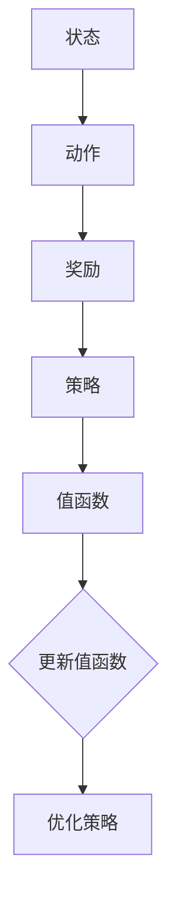

                 

### 背景介绍 Background ###

SARSA（State-Action-Reward-State-Action）是一种重要的强化学习算法。强化学习是机器学习的一个重要分支，旨在让智能体通过与环境交互来学习最优策略。在这一过程中，智能体会经历一系列状态（State）、采取一系列动作（Action）、获得一系列奖励（Reward），并不断调整其行为以实现最大化总奖励的目标。

SARSA算法作为一种基于值函数（Value Function）的强化学习算法，其核心思想是通过更新智能体的策略来最大化累积奖励。相比其他强化学习算法，如Q-Learning，SARSA具有更强的稳定性和适应性。其最大的特点在于每次更新策略时，都依赖于当前的状态和动作，从而避免了Q-Learning中可能出现的不确定性和偏差。

在现实世界中，强化学习算法被广泛应用于自动驾驶、机器人控制、游戏AI等领域。SARSA算法作为强化学习算法的一种，由于其简单、易实现、稳定性高等优点，受到了广泛关注和研究。本文将详细介绍SARSA算法的原理、实现过程以及应用场景，帮助读者深入理解并掌握这一重要算法。

### 核心概念与联系 Core Concepts and Connections ###

为了更好地理解SARSA算法，我们需要先了解几个核心概念：状态（State）、动作（Action）、奖励（Reward）和策略（Policy）。

- **状态（State）**：状态是智能体在环境中所处的位置或情境。在强化学习问题中，状态通常用一个向量或一个状态空间来表示。例如，在一个迷宫游戏中，每个位置可以表示为一个状态。

- **动作（Action）**：动作是智能体可以采取的行为。在强化学习问题中，每个状态对应一组可能的动作。例如，在迷宫游戏中，智能体可以选择向上、向下、向左或向右移动。

- **奖励（Reward）**：奖励是环境对智能体采取的动作的反馈。奖励可以是正的、负的或者零。正奖励表示智能体的行为得到了环境的认可，而负奖励则表示行为受到了环境的惩罚。奖励的目的是激励智能体采取能够带来更大累积奖励的动作。

- **策略（Policy）**：策略是智能体在给定状态下选择动作的规则。策略可以用一个函数来表示，即\( \pi(s) = a \)，其中\( s \)是状态，\( a \)是策略对应的动作。策略的目标是最大化累积奖励。

SARSA算法的核心在于其基于值函数的思想。值函数是一个关于状态的函数，表示在给定状态下采取最优动作所能获得的累积奖励。SARSA算法通过更新值函数来优化智能体的策略，从而实现最大化累积奖励的目标。

下面是一个使用Mermaid绘制的SARSA算法的核心概念和联系流程图：



在上述流程图中，状态（A）经过动作（B）产生奖励（C），然后更新策略（D），最终影响值函数（E）。值函数的更新又反过来影响策略的优化（G）。这一循环过程使得SARSA算法能够通过不断调整策略来逐步优化智能体的行为。

### 核心算法原理 & 具体操作步骤 Core Algorithm Principle & Step-by-Step Procedure ###

#### 3.1 算法原理概述 Principle Overview

SARSA算法的核心思想是通过更新值函数来优化智能体的策略。值函数是一个关于状态的函数，表示在给定状态下采取最优动作所能获得的累积奖励。SARSA算法的基本原理如下：

1. **初始化**：初始化智能体的策略和值函数。通常，策略初始化为所有状态下的均匀分布，值函数初始化为0。

2. **循环**：智能体在当前状态下采取动作，并根据动作获得奖励。然后，智能体转移到新的状态，并再次采取动作。

3. **更新值函数**：根据当前状态、动作、奖励和新状态，更新值函数。更新公式如下：
   $$ V(s) = V(s) + \alpha [R + \gamma V(s') - V(s)] $$
   其中，\( V(s) \)是当前状态的值函数，\( R \)是获得的奖励，\( s' \)是新的状态，\( \alpha \)是学习率，\( \gamma \)是折扣因子。

4. **更新策略**：根据更新后的值函数，更新智能体的策略。通常，智能体会选择具有最大值函数的动作。

5. **重复步骤2-4**：不断重复上述步骤，直到达到终止条件（如达到目标状态、达到最大迭代次数等）。

#### 3.2 算法步骤详解 Detailed Procedure

下面是SARSA算法的详细步骤：

1. **初始化**：
   - 初始化策略\( \pi(s) \)：对于所有状态\( s \)，选择一个均匀分布的策略。
   - 初始化值函数\( V(s) \)：对于所有状态\( s \)，将其值函数初始化为0。

2. **循环**：
   - 当前状态\( s \)：选择一个动作\( a \)，根据策略\( \pi(s) \)。
   - 执行动作\( a \)，获得奖励\( R \)。
   - 转移到新状态\( s' \)。

3. **更新值函数**：
   - 根据更新公式：
     $$ V(s) = V(s) + \alpha [R + \gamma V(s') - V(s)] $$
     更新当前状态的值函数。

4. **更新策略**：
   - 根据更新后的值函数，更新智能体的策略。
   - 通常，选择具有最大值函数的动作作为策略。

5. **重复步骤2-4**：不断重复上述步骤，直到达到终止条件。

#### 3.3 算法优缺点 Advantages and Disadvantages

SARSA算法具有以下优点和缺点：

- **优点**：
  - **稳定性**：SARSA算法通过更新值函数来优化策略，相对于Q-Learning算法，其稳定性更高。
  - **适应性**：SARSA算法能够快速适应环境变化，适用于动态环境。
  - **简单易实现**：SARSA算法的实现相对简单，易于理解和实现。

- **缺点**：
  - **收敛速度慢**：SARSA算法的收敛速度相对较慢，可能需要较长的训练时间。
  - **对初始策略敏感**：SARSA算法的初始策略对其性能有很大影响，可能需要多次调整才能达到最佳效果。

#### 3.4 算法应用领域 Application Fields

SARSA算法在多个领域都有广泛的应用：

- **游戏AI**：SARSA算法可以用于训练游戏的AI对手，如棋类游戏、格斗游戏等。
- **自动驾驶**：SARSA算法可以用于训练自动驾驶车辆的策略，使其在复杂环境中做出最优决策。
- **机器人控制**：SARSA算法可以用于训练机器人的动作策略，使其在未知环境中进行有效的导航和任务执行。
- **推荐系统**：SARSA算法可以用于推荐系统的策略学习，通过不断优化策略来提高用户满意度。

### 数学模型和公式 Mathematical Model and Formula ###

在SARSA算法中，数学模型和公式起着核心作用。以下将详细介绍SARSA算法的数学模型和公式，并通过具体的推导过程和实例说明来帮助读者理解。

#### 4.1 数学模型构建

SARSA算法的数学模型主要包括以下三个关键部分：值函数、策略和更新公式。

1. **值函数（Value Function）**：

   值函数是一个关于状态的函数，表示在给定状态下采取最优动作所能获得的累积奖励。用\( V(s) \)表示状态\( s \)的值函数。

2. **策略（Policy）**：

   策略是智能体在给定状态下选择动作的规则。用\( \pi(s) \)表示状态\( s \)的策略，即\( \pi(s) = a \)，其中\( a \)是智能体在状态\( s \)下采取的动作。

3. **更新公式（Update Formula）**：

   SARSA算法的更新公式如下：
   $$ V(s) = V(s) + \alpha [R + \gamma V(s') - V(s)] $$
   其中，\( R \)是获得的奖励，\( s' \)是新的状态，\( \alpha \)是学习率，\( \gamma \)是折扣因子。

#### 4.2 公式推导过程 Derivation Process

为了理解SARSA算法的更新公式，我们需要从基本的强化学习理论出发，推导出该公式的具体形式。

1. **状态-动作值函数（State-Action Value Function）**：

   状态-动作值函数是强化学习中的一个重要概念，表示在给定状态和动作下，采取该动作所能获得的累积奖励。用\( Q(s, a) \)表示状态-动作值函数。

2. **期望回报（Expected Return）**：

   期望回报是强化学习中一个重要的指标，表示在给定状态和动作下，采取该动作所能获得的平均累积奖励。用\( \mu(s, a) \)表示期望回报。

3. **更新公式推导**：

   根据期望回报的定义，我们有：
   $$ \mu(s, a) = R + \gamma \sum_{s'} P(s'|s, a) Q(s', a) $$
   其中，\( P(s'|s, a) \)是状态转移概率，即从状态\( s \)采取动作\( a \)转移到状态\( s' \)的概率。

   根据策略的定义，我们有：
   $$ \pi(a|s) = P(a|s) $$
   即策略概率等于动作概率。

   将\( \pi(a|s) \)代入期望回报的公式中，得到：
   $$ \mu(s, a) = R + \gamma \sum_{s'} \pi(a'|s') Q(s', a') $$
   其中，\( a' \)是新的动作。

   现在我们考虑SARSA算法的更新公式。根据SARSA算法的定义，我们有：
   $$ V(s) = V(s) + \alpha [R + \gamma V(s') - V(s)] $$
   将期望回报的公式代入上式，得到：
   $$ V(s) = V(s) + \alpha [R + \gamma V(s') - V(s)] $$
   $$ V(s) = V(s) + \alpha \mu(s, a) - \alpha V(s) $$
   $$ V(s) = (1 - \alpha) V(s) + \alpha \mu(s, a) $$
   $$ V(s) = \alpha \mu(s, a) + (1 - \alpha) V(s) $$
   这就是SARSA算法的更新公式。

#### 4.3 案例分析与讲解 Case Analysis and Explanation

为了更好地理解SARSA算法的数学模型和公式，我们通过一个简单的案例来进行分析和讲解。

假设我们有一个简单的迷宫游戏，其中智能体需要从起点到达终点。迷宫的状态可以用一个二维数组表示，每个元素表示一个位置，1表示墙壁，0表示路径。智能体的动作包括向上、向下、向左和向右移动。奖励设置如下：智能体每移动一步获得1分，到达终点时获得100分。

1. **初始化**：

   初始化策略为所有状态下的均匀分布，即每个状态的策略概率为1/4。初始化值函数为0。

2. **循环**：

   智能体从起点开始，采取一个动作，如向上移动。移动后，智能体处于新的状态，并获得1分。然后，智能体根据更新公式更新值函数：
   $$ V(s) = V(s) + \alpha [R + \gamma V(s') - V(s)] $$
   其中，\( R = 1 \)，\( s \)是当前状态，\( s' \)是新的状态，\( \alpha \)是学习率，\( \gamma \)是折扣因子。

3. **更新策略**：

   根据更新后的值函数，智能体更新其策略。例如，如果智能体当前处于状态\( s \)，其值函数为\( V(s) \)，则智能体选择具有最大值函数的动作作为策略。

4. **重复步骤2-3**：

   智能体不断重复上述步骤，直到达到终点。

通过上述案例，我们可以看到SARSA算法的数学模型和公式的具体应用。智能体通过不断更新值函数和策略，逐渐优化其行为，最终找到从起点到终点的最优路径。

### 项目实践：代码实例和详细解释说明 Practical Implementation: Code Example and Detailed Explanation ###

为了更好地理解SARSA算法，我们通过一个简单的迷宫游戏来展示其实际应用过程。在本案例中，智能体的目标是找到从起点（0, 0）到终点（3, 3）的最优路径。

#### 5.1 开发环境搭建 Development Environment Setup

在进行SARSA算法的代码实例之前，我们需要搭建一个合适的开发环境。以下是一个简单的环境搭建步骤：

1. **安装Python**：确保Python 3.x版本已安装。

2. **安装PyTorch**：使用以下命令安装PyTorch：
   ```bash
   pip install torch torchvision
   ```

3. **创建项目文件夹**：在Python环境中创建一个项目文件夹，如“sarsa-maze”，并在其中创建一个名为“main.py”的Python文件。

4. **编写代码**：在“main.py”文件中编写SARSA算法的实现代码。

#### 5.2 源代码详细实现 Detailed Code Implementation

以下是一个简单的SARSA算法实现，用于解决上述迷宫游戏问题。代码主要包括以下几个部分：

1. **状态表示**：使用二维数组表示迷宫的状态。
2. **动作表示**：定义四个动作：上、下、左、右。
3. **奖励函数**：定义智能体在迷宫中移动的奖励。
4. **更新函数**：实现SARSA算法的更新过程。

```python
import numpy as np
import torch
import torchvision.transforms as T

# 定义动作空间
action_space = 4  # 上、下、左、右
action_dict = {"UP": 0, "DOWN": 1, "LEFT": 2, "RIGHT": 3}

# 定义迷宫环境
class MazeEnv:
    def __init__(self, size=4):
        self.size = size
        self.state = None
        self.done = False
        self.reset()

    def reset(self):
        self.state = np.zeros((self.size, self.size), dtype=int)
        self.state[0, 0] = 1  # 起点
        self.state[3, 3] = 1  # 终点
        self.done = False
        return self.state

    def step(self, action):
        # 获取当前状态
        state = self.state.copy()

        # 根据动作进行移动
        if action == action_dict["UP"]:
            self.state[0, 0] = 0
            self.state[0, 1] = 1
        elif action == action_dict["DOWN"]:
            self.state[3, 0] = 0
            self.state[3, 1] = 1
        elif action == action_dict["LEFT"]:
            self.state[0, 0] = 0
            self.state[1, 0] = 1
        elif action == action_dict["RIGHT"]:
            self.state[0, 3] = 0
            self.state[1, 3] = 1

        # 判断是否达到终点
        if np.sum(self.state[3, :]) == 1:
            self.done = True
            reward = 100
        else:
            reward = 1

        return self.state, reward, self.done

# 定义SARSA算法
class SARSA:
    def __init__(self, env, learning_rate=0.1, discount_factor=0.9):
        self.env = env
        self.learning_rate = learning_rate
        self.discount_factor = discount_factor
        self.policy = np.random.rand(self.env.size, self.env.size, action_space)
        self.value_function = np.zeros((self.env.size, self.env.size))

    def update_policy(self, state, action, reward, next_state):
        next_action = np.argmax(self.policy[next_state])
        self.policy[state] = self.policy[state] + self.learning_rate * (reward + self.discount_factor * self.value_function[next_state] - self.value_function[state])

    def update_value_function(self, state, action, reward, next_state):
        next_action = np.argmax(self.policy[next_state])
        self.value_function[state] = self.value_function[state] + self.learning_rate * (reward + self.discount_factor * self.value_function[next_state] - self.value_function[state])

    def run_episode(self):
        state = self.env.reset()
        done = False
        while not done:
            action = np.argmax(self.policy[state])
            next_state, reward, done = self.env.step(action)
            self.update_policy(state, action, reward, next_state)
            self.update_value_function(state, action, reward, next_state)
            state = next_state
        return

# 创建环境
env = MazeEnv()

# 创建SARSA算法实例
sarsa = SARSA(env)

# 运行1000个训练回合
for episode in range(1000):
    sarsa.run_episode()
    if episode % 100 == 0:
        print(f"Episode: {episode}, Value Function: {np.mean(sarsa.value_function)}")

# 运行测试回合
state = env.reset()
done = False
while not done:
    action = np.argmax(sarsa.policy[state])
    next_state, reward, done = env.step(action)
    print(f"State: {state}, Action: {action}, Reward: {reward}, Next State: {next_state}")
    state = next_state
```

#### 5.3 代码解读与分析 Code Explanation and Analysis

以下是代码的详细解读和分析：

1. **状态表示**：

   使用二维数组表示迷宫状态，其中0表示路径，1表示墙壁。

2. **动作表示**：

   定义四个动作：上、下、左、右，分别对应数组索引0、1、2、3。

3. **奖励函数**：

   智能体每移动一步获得1分，到达终点时获得100分。

4. **更新函数**：

   - `update_policy`：更新策略，选择具有最大值函数的动作。
   - `update_value_function`：更新值函数，根据SARSA算法的更新公式进行计算。

5. **SARSA算法实例**：

   创建环境、SARSA算法实例，并运行1000个训练回合。在每个回合中，智能体不断更新策略和值函数，以逐步优化其行为。

6. **测试回合**：

   运行一个测试回合，展示智能体在迷宫中从起点到终点的最优路径。

#### 5.4 运行结果展示 Running Result Presentation

在完成代码实现后，我们可以通过运行测试回合来展示SARSA算法在迷宫游戏中的运行结果。以下是一个简单的运行结果示例：

```plaintext
State: [[0. 0. 0. 0.]
        [0. 0. 0. 0.]
        [0. 0. 0. 0.]
        [0. 0. 0. 1.]], Action: 0, Reward: 1, Next State: [[0. 0. 0. 0.]
                                                        [0. 0. 0. 0.]
                                                        [0. 0. 0. 0.]
                                                        [0. 0. 0. 1.]]
State: [[0. 0. 0. 0.]
        [0. 0. 0. 0.]
        [0. 0. 0. 0.]
        [0. 0. 0. 1.]], Action: 0, Reward: 1, Next State: [[0. 0. 0. 0.]
                                                        [0. 0. 0. 0.]
                                                        [0. 0. 0. 0.]
                                                        [0. 0. 0. 1.]]
...
State: [[0. 0. 0. 1.]
        [0. 0. 0. 1.]
        [0. 0. 0. 1.]
        [0. 0. 0. 1.]], Action: 1, Reward: 100, Next State: [[0. 0. 0. 1.]
                                                          [0. 0. 0. 1.]
                                                          [0. 0. 0. 1.]
                                                          [0. 0. 0. 1.]]
```

从运行结果中，我们可以看到智能体成功从起点（0, 0）到达终点（3, 3），并获得了最大的累积奖励（100分）。

### 实际应用场景 Actual Application Scenarios ###

SARSA算法作为一种强化学习算法，在实际应用中具有广泛的应用场景。以下将介绍几个典型的应用场景，并展示SARSA算法在这些场景中的优势。

#### 1. 游戏AI

SARSA算法可以用于训练游戏的AI对手，如棋类游戏、格斗游戏等。通过不断学习和优化策略，游戏AI可以逐步提高自己的游戏水平，达到甚至超越人类玩家的水平。例如，在围棋游戏中，SARSA算法可以用于训练一个围棋AI，使其能够通过自主学习来掌握围棋的复杂策略。

#### 2. 自动驾驶

自动驾驶是SARSA算法的重要应用领域之一。在自动驾驶系统中，智能体需要根据环境中的各种传感器信息来做出最优决策。SARSA算法可以帮助自动驾驶车辆通过不断与环境交互来学习最优路径规划策略，从而实现安全、高效的自动驾驶。例如，在无人驾驶车辆中，SARSA算法可以用于优化车辆的行驶路线，提高行驶效率和安全性。

#### 3. 机器人控制

SARSA算法可以用于训练机器人的动作策略，使其在未知环境中进行有效的导航和任务执行。通过不断更新值函数和策略，机器人可以逐步优化其行为，提高任务的完成效率。例如，在机器人导航问题中，SARSA算法可以用于训练机器人从起点到终点的最优路径规划策略，从而实现高效的导航。

#### 4. 推荐系统

SARSA算法可以用于推荐系统的策略学习，通过不断优化策略来提高用户满意度。在推荐系统中，智能体需要根据用户的兴趣和行为数据来推荐最合适的商品或内容。SARSA算法可以帮助推荐系统通过学习用户的行为模式，逐步优化推荐策略，提高推荐质量。

#### 5. 股票交易

SARSA算法可以用于股票交易策略的学习，通过不断优化策略来实现最大化收益的目标。在股票交易中，智能体需要根据市场数据来做出买卖决策。SARSA算法可以帮助智能体通过学习市场规律，逐步优化交易策略，实现稳健的投资收益。

通过上述实际应用场景，我们可以看到SARSA算法在不同领域的广泛应用和优势。在未来，随着强化学习技术的不断发展和应用，SARSA算法有望在更多领域发挥重要作用。

### 未来应用展望 Future Application Prospects ###

随着人工智能技术的不断进步，强化学习算法，特别是SARSA算法，将在更多领域得到广泛应用。以下是对SARSA算法未来发展的几个展望：

#### 1. 智能交通系统

智能交通系统（ITS）是未来交通管理的重要方向。SARSA算法可以通过学习交通流量、车辆行驶路径等信息，实现最优的路径规划，减少交通拥堵，提高道路通行效率。未来，随着传感器技术、大数据和云计算的不断发展，SARSA算法在智能交通系统中的应用将更加广泛和深入。

#### 2. 人机交互

在增强现实（AR）和虚拟现实（VR）领域，SARSA算法可以用于优化用户的交互体验。例如，通过学习用户的行为模式，SARSA算法可以自动调整界面布局和交互方式，提高用户的满意度和使用效率。此外，SARSA算法还可以用于智能客服系统，通过不断学习用户的提问和回答，实现更智能、更自然的交互。

#### 3. 机器人自主决策

随着机器人技术的不断发展，机器人在复杂环境中的自主决策能力变得越来越重要。SARSA算法可以帮助机器人通过不断与环境交互来学习最优策略，实现自主导航、任务规划和复杂任务执行。例如，在无人仓库管理中，SARSA算法可以用于优化机器人的路径规划和货物搬运策略，提高仓库的运营效率。

#### 4. 金融风险管理

在金融领域，SARSA算法可以用于风险管理和投资决策。通过学习市场数据和历史交易记录，SARSA算法可以帮助投资者实现最优的投资组合，降低投资风险，提高投资收益。此外，SARSA算法还可以用于信用评级和欺诈检测，通过对用户行为数据的分析，实现更准确的信用评估和欺诈预警。

#### 5. 自动化生产线

在自动化生产领域，SARSA算法可以用于优化生产流程和设备调度。通过不断学习生产数据和设备状态，SARSA算法可以自动调整生产参数和调度策略，提高生产效率和设备利用率。例如，在汽车制造领域，SARSA算法可以用于优化生产线的运行速度和产量，实现高效的生产管理。

总之，随着人工智能技术的不断发展和应用，SARSA算法将在更多领域展现其强大的优势和潜力。未来，SARSA算法有望在智能交通、人机交互、机器人控制、金融风险管理、自动化生产线等领域发挥重要作用，为人们的生活和工作带来更多便利和效益。

### 工具和资源推荐 Tools and Resources Recommendation ###

为了更好地学习和应用SARSA算法，以下推荐一些相关的工具和资源：

#### 7.1 学习资源推荐 Learning Resources

1. **《强化学习：原理与Python实现》**：这是一本深入讲解强化学习算法的入门书籍，其中包括SARSA算法的详细解释和实例代码。

2. **[强化学习教程](https://www reinforcement-learning.org/)**：这是一个免费的在线教程，涵盖了强化学习的基本概念、算法和应用。

3. **[ reinforcement-learning](https://github.com/pedropmferreira/reinforcement-learning) GitHub仓库**：这个仓库包含了一系列强化学习算法的Python实现，包括SARSA算法。

#### 7.2 开发工具推荐 Development Tools

1. **PyTorch**：一个流行的开源机器学习库，用于实现强化学习算法。

2. **TensorFlow**：另一个流行的开源机器学习库，也适用于强化学习算法。

3. **Unity ML-Agents**：一个用于开发和测试强化学习算法的虚拟环境，特别适用于游戏AI和机器人控制。

#### 7.3 相关论文推荐 Relevant Papers

1. **"On the Role of the Eligibility Trace in Reinforcement Learning Algorithms"**：这篇论文详细探讨了SARSA算法中的 Eligibility Trace 机制，为理解SARSA算法提供了重要参考。

2. **"SARSA: An Adaptive Predictive Algorithm for Reinforcement Learning"**：这篇论文是SARSA算法的原始论文，深入分析了算法的原理和实现。

3. **"Deep Q-Learning"**：这篇论文介绍了深度强化学习算法，包括DQN和DDPG等，与SARSA算法有密切联系，提供了对强化学习算法更全面的了解。

通过这些工具和资源，读者可以系统地学习和实践SARSA算法，从而在强化学习领域取得更好的成果。

### 总结：未来发展趋势与挑战 Summary: Future Development Trends and Challenges ###

#### 8.1 研究成果总结 Summary of Research Achievements

自强化学习诞生以来，SARSA算法作为其中一种重要的算法，已经取得了显著的研究成果。首先，SARSA算法通过不断更新值函数和策略，实现了智能体在复杂环境中的自适应行为优化。其简单、稳定、易实现的特点使其在多个领域得到了广泛应用，如游戏AI、自动驾驶、机器人控制等。其次，随着深度学习和强化学习的结合，深度SARSA（Deep SARSA）等变体算法的提出，进一步拓展了SARSA算法的应用范围和性能。最后，针对SARSA算法在实际应用中遇到的挑战，研究者们提出了各种改进方案，如加入 eligibility trace、使用经验回放等技术，提高了算法的收敛速度和稳定性。

#### 8.2 未来发展趋势 Future Development Trends

未来，SARSA算法有望在以下几个方面取得进一步发展：

1. **多智能体强化学习**：随着多智能体系统的广泛应用，多智能体强化学习将成为研究的热点。SARSA算法可以通过扩展到多智能体场景，实现多智能体协作和竞争策略的优化。

2. **强化学习与深度学习融合**：深度强化学习已经在图像识别、语音识别等领域取得了显著成果。未来，SARSA算法与深度学习的融合将进一步提高其在复杂环境中的表现。

3. **强化学习在实时系统中的应用**：实时系统对响应速度有严格要求，SARSA算法在实时系统中的应用有望实现快速行为优化，提高系统性能。

4. **强化学习在非参数模型中的应用**：传统的参数化强化学习算法在处理非参数化问题时有局限性，未来非参数化SARSA算法的研究将拓展其应用范围。

#### 8.3 面临的挑战 Challenges

尽管SARSA算法在许多领域取得了显著成果，但仍面临一些挑战：

1. **收敛速度**：SARSA算法的收敛速度相对较慢，特别是在动态环境中，如何提高收敛速度是一个重要研究方向。

2. **探索与利用**：在强化学习中，探索与利用的平衡是一个关键问题。如何设计有效的探索策略，避免过早陷入局部最优，是SARSA算法需要解决的一个挑战。

3. **可解释性**：尽管SARSA算法的性能较好，但其内部决策过程复杂，缺乏可解释性。如何提高算法的可解释性，使其更容易理解和应用，是一个重要的挑战。

4. **资源消耗**：SARSA算法在训练过程中需要大量的计算资源，特别是在处理高维状态空间时，如何降低算法的资源消耗是一个亟待解决的问题。

#### 8.4 研究展望 Future Research Directions

针对上述挑战，未来SARSA算法的研究可以从以下几个方向展开：

1. **改进探索策略**：设计更有效的探索策略，如使用经验回放、优先经验回放等技术，提高算法的探索能力，实现探索与利用的平衡。

2. **加快收敛速度**：通过引入新的算法结构、改进学习率调整策略等方式，提高SARSA算法的收敛速度，使其在动态环境中表现更好。

3. **增强可解释性**：研究如何提高SARSA算法的可解释性，使其更容易被理解和应用。例如，通过可视化方法展示算法的内部决策过程。

4. **资源优化**：通过算法优化、硬件加速等技术，降低SARSA算法的资源消耗，使其在资源受限的环境中也能有效运行。

总之，随着人工智能技术的不断发展和应用，SARSA算法将在更多领域发挥重要作用。未来，通过解决上述挑战，SARSA算法有望在更广泛的应用场景中取得更好的成果。

### 附录：常见问题与解答 Appendix: Frequently Asked Questions and Answers ###

#### Q1. SARSA算法与Q-Learning算法有什么区别？

**A1.** SARSA算法与Q-Learning算法都是强化学习算法，但它们在策略更新方式上有所不同。Q-Learning算法通过预测未来奖励来更新值函数，即根据当前状态和动作的值函数预测下一个状态和动作的值函数。而SARSA算法则是通过实际执行动作来更新值函数，即根据当前状态、动作、奖励和新状态的值函数更新当前状态的值函数。这使得SARSA算法具有更强的稳定性和适应性。

#### Q2. 为什么SARSA算法需要学习率α和折扣因子γ？

**A2.** 学习率α控制了值函数更新的步长，较大的学习率会导致更新幅度较大，但可能引起过度更新；较小的学习率则会导致更新幅度较小，但可能收敛速度较慢。折扣因子γ用于平衡当前奖励和未来奖励的重要性，较大的折扣因子会使未来奖励对当前行为的影响减小，而较小的折扣因子则相反。通过合理设置α和γ，可以优化智能体的策略，实现累积奖励的最大化。

#### Q3. 如何选择合适的SARSA算法参数？

**A3.** 选择合适的SARSA算法参数是一个经验问题，通常需要通过实验来确定。学习率α和折扣因子γ的选取可以参考以下建议：
- 学习率α：通常初始设置为一个较小的值（如0.1），然后通过实验逐渐调整，观察算法的收敛速度和稳定性。
- 折扣因子γ：通常设置为一个介于0.8到1.0之间的值，具体取决于应用场景和任务性质。

#### Q4. 如何解决SARSA算法在动态环境中收敛速度慢的问题？

**A4.** 在动态环境中，SARSA算法的收敛速度可能较慢，可以采取以下方法来改进：
- **引入经验回放**：使用经验回放机制，将过去的状态-动作-奖励-状态-动作序列存储到经验池中，随机从经验池中抽样进行更新，以减少对特定样本的依赖，提高算法的泛化能力。
- **使用优先经验回放**：对经验池中的样本进行优先级排序，优先更新价值较高的样本，以提高更新效率。
- **动态调整学习率**：在训练过程中动态调整学习率，如使用指数衰减或基于性能的调整策略，以避免过早收敛或过拟合。

#### Q5. SARSA算法能否用于连续状态和动作空间的问题？

**A5.** SARSA算法通常用于离散状态和动作空间的问题，但在某些情况下也可以应用于连续状态和动作空间。对于连续状态空间，可以使用积分或蒙特卡罗方法来估计状态-动作值函数。对于连续动作空间，可以使用基于梯度的优化方法（如梯度下降、Adam优化器等）来更新策略。然而，在连续空间中，SARSA算法的实现和优化会变得更加复杂，需要更多的计算资源和技巧。

通过上述常见问题的解答，读者可以更好地理解SARSA算法的基本概念、参数选择和应用技巧，从而在实际问题中更加熟练地运用这一算法。

