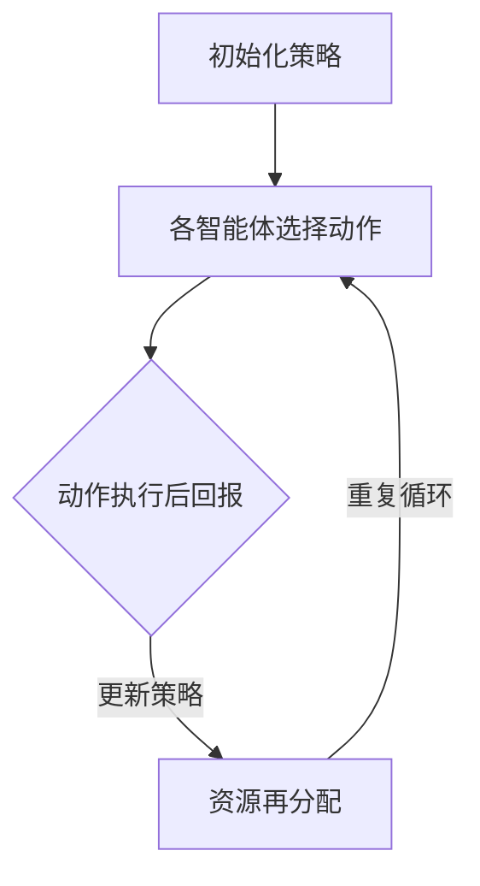

                 

## 1. 背景介绍

SARSA算法，全称为“同步自适应资源分享算法”(Synchronous Adaptive Resource Sharing Algorithm)，是一种在机器学习领域中被广泛应用的学习算法。它主要应用于多智能体系统中的资源分配问题，旨在通过同步更新策略，实现各智能体之间的资源分配与协同。

多智能体系统（MAS）是一个由多个自主智能体组成的系统，这些智能体之间相互协作，共同完成一个复杂的任务。在MAS中，资源分配问题尤为关键，如通信带宽、计算能力、能源等资源的有效分配，直接影响到系统的整体性能和稳定性。因此，研究有效的多智能体资源分配算法具有重要的理论意义和实际应用价值。

SARSA算法作为一种自适应资源分配算法，其基本思想是通过同步更新各智能体的策略，使系统达到全局最优状态。相比传统的多智能体算法，SARSA算法具有以下优点：

1. **自适应性强**：SARSA算法能够根据环境的变化自适应调整各智能体的资源分配策略，提高系统的适应能力。
2. **资源利用率高**：通过同步更新策略，SARSA算法能够有效避免资源闲置和过度使用，提高资源利用率。
3. **稳定性好**：SARSA算法通过同步更新，能够减少各智能体之间的竞争和冲突，提高系统的稳定性。

本文将详细讲解SARSA算法的原理、实现步骤及应用领域，并辅以代码实例，帮助读者深入理解这一算法。

## 2. 核心概念与联系

### 2.1 多智能体系统

多智能体系统（MAS）是由多个智能体组成的系统，这些智能体相互协作，共同完成一个复杂的任务。在MAS中，智能体是指具有自主性、社会性、反应性和主动性的实体，可以是个体、组织或计算机程序。

**核心概念：**

- **智能体**：系统中的基本单元，具有独立自主的行动能力。
- **环境**：智能体所在的外部世界，包括其他智能体和系统资源。
- **通信**：智能体之间的信息交互，用于协调行动和共享信息。
- **目标**：智能体的行为目标，通常为最大化某种效益或实现特定任务。

### 2.2 资源分配问题

在MAS中，资源分配问题是指如何将有限的资源（如带宽、计算能力、能源等）合理分配给各个智能体，以实现系统整体效益的最大化。资源分配问题可以分为以下几类：

- **静态资源分配**：资源在一段时间内固定不变，智能体根据当前资源状态进行策略调整。
- **动态资源分配**：资源随时间变化，智能体需要实时调整策略以应对环境变化。

### 2.3 SARSA算法原理

SARSA算法是一种同步自适应资源分享算法，其核心思想是通过同步更新各智能体的策略，实现资源的最优分配。算法主要涉及以下概念：

- **策略**：智能体的行为规则，用于指导智能体的决策过程。
- **状态**：智能体当前所处的环境状态。
- **动作**：智能体在特定状态下采取的行动。
- **回报**：动作执行后系统获得的效益。

SARSA算法通过以下步骤实现资源分配：

1. 初始化策略，设定各智能体的初始资源分配比例。
2. 各智能体根据当前状态和策略选择动作。
3. 动作执行后，根据回报更新策略，实现资源的再分配。
4. 重复步骤2和3，直到达到系统最优状态。

### 2.4 Mermaid 流程图

以下是一个简单的Mermaid流程图，展示了SARSA算法的核心流程：



在这个流程图中，A表示初始化策略，B表示各智能体根据当前状态和策略选择动作，C表示动作执行后的回报，D表示根据回报更新策略，实现资源的再分配。然后，循环回到B，继续执行下一个循环。

通过以上对核心概念和联系的分析，我们可以更清晰地理解SARSA算法的原理和实现过程。接下来，我们将深入探讨SARSA算法的具体原理和操作步骤。

## 3. 核心算法原理 & 具体操作步骤

### 3.1 算法原理概述

SARSA算法的基本原理是通过同步更新各智能体的策略，实现资源的最优分配。在SARSA算法中，每个智能体根据当前的状态和策略选择动作，并依据动作的回报来更新策略，从而实现资源的动态调整。以下是SARSA算法的核心原理：

1. **初始化策略**：在算法开始时，各智能体需要初始化其策略，即确定各智能体在初始状态下应采取的动作。初始化策略可以基于一些预设的规则或通过历史数据学习得到。

2. **状态-动作选择**：在每一轮迭代中，各智能体根据当前状态和初始化策略选择动作。状态是指当前智能体所处的环境状态，动作是指智能体在该状态下应采取的行动。

3. **动作执行与回报**：选择动作后，智能体执行该动作，并得到相应的回报。回报是指执行动作后系统获得的效益，可以用来衡量动作的好坏。

4. **策略更新**：根据回报，智能体更新其策略。策略更新的目标是通过调整策略，使系统达到最优状态，即各智能体的动作能够最大化回报。

5. **资源再分配**：在策略更新后，各智能体的资源分配比例发生变化。系统需要根据新的策略对资源进行再分配，以满足各智能体的需求。

6. **重复迭代**：重复执行步骤2至5，直到系统达到稳定状态或达到预设的迭代次数。

### 3.2 算法步骤详解

以下是SARSA算法的具体操作步骤：

1. **初始化策略**：
   - 初始化各智能体的策略，可以根据预设规则或历史数据学习得到。
   - 设定各智能体在初始状态下的资源分配比例。

2. **状态-动作选择**：
   - 在每一轮迭代中，各智能体根据当前状态和初始化策略选择动作。
   - 选择动作时，可以采用随机选择、贪婪选择或其他策略。

3. **动作执行与回报**：
   - 执行选定的动作，并根据动作的回报更新智能体的状态。
   - 回报可以通过直接计算或通过历史数据进行估计。

4. **策略更新**：
   - 根据回报，智能体更新其策略。
   - 更新策略的目标是最大化回报，可以采用贪婪策略或基于历史数据的优化策略。

5. **资源再分配**：
   - 根据更新后的策略，对各智能体的资源分配比例进行调整。
   - 调整资源分配比例的目的是满足各智能体的需求，提高系统的整体效益。

6. **重复迭代**：
   - 重复执行步骤2至5，直到系统达到稳定状态或达到预设的迭代次数。

### 3.3 算法优缺点

**优点**：

1. **自适应性强**：SARSA算法能够根据环境的变化自适应调整策略，提高系统的适应能力。
2. **资源利用率高**：通过同步更新策略，SARSA算法能够有效避免资源闲置和过度使用，提高资源利用率。
3. **稳定性好**：SARSA算法通过同步更新，能够减少各智能体之间的竞争和冲突，提高系统的稳定性。

**缺点**：

1. **计算复杂度高**：由于SARSA算法需要同步更新各智能体的策略，计算复杂度较高，可能导致算法运行时间较长。
2. **收敛速度较慢**：在环境变化较快的情况下，SARSA算法的收敛速度可能较慢，需要更多的迭代次数才能达到稳定状态。

### 3.4 算法应用领域

SARSA算法主要应用于多智能体系统中的资源分配问题，如：

1. **无线传感器网络**：在无线传感器网络中，SARSA算法可用于动态分配传感器节点的能量和计算资源，提高网络的稳定性和寿命。
2. **分布式计算系统**：在分布式计算系统中，SARSA算法可用于优化资源的分配，提高系统的性能和效率。
3. **智能交通系统**：在智能交通系统中，SARSA算法可用于优化交通信号灯的控制策略，提高交通流量和减少拥堵。

通过以上对SARSA算法的原理和操作步骤的详细讲解，我们可以更好地理解这一算法的核心思想和应用价值。接下来，我们将通过代码实例来进一步说明SARSA算法的具体实现过程。

## 4. 数学模型和公式 & 详细讲解 & 举例说明

### 4.1 数学模型构建

在SARSA算法中，我们主要关注以下数学模型：

1. **策略函数**：描述智能体在特定状态下的动作选择概率。用π(s, a)表示，表示在状态s下选择动作a的概率。
2. **状态-动作回报函数**：描述智能体在执行特定动作后获得的回报。用R(s, a)表示。
3. **策略更新函数**：描述智能体根据回报更新策略的过程。用π(s', a')表示在状态s'下选择动作a'的概率。

### 4.2 公式推导过程

在SARSA算法中，策略的更新过程可以表示为以下公式：

π(s, a) = π(s, a) * (1 - α) + α * π(s', a')

其中，α为学习率，表示智能体根据回报更新策略的程度。

为了推导策略更新函数，我们可以考虑以下两个步骤：

1. **状态-动作回报函数**：

   R(s, a) = R(s, a) * (1 - β) + β * R(s', a')

   其中，β为回报率，表示智能体根据回报更新回报的程度。

2. **策略更新函数**：

   π(s, a) = π(s, a) * (1 - α) + α * π(s', a')

   为了简化公式，我们可以假设α和β相等，即α = β。在这种情况下，策略更新函数可以简化为：

   π(s, a) = π(s, a) * (1 - 2α) + 2α * π(s', a')

### 4.3 案例分析与讲解

假设有一个多智能体系统，包含两个智能体A和B，系统中的资源为10个单位。初始状态下，智能体A拥有5个单位资源，智能体B拥有5个单位资源。在每一步，两个智能体可以选择分配1个单位资源给对方或保持当前状态。系统的目标是最小化两个智能体之间的资源差距。

首先，我们定义状态s为两个智能体的资源分配比例，即s = (RA, RB)。其中，RA和RB分别为智能体A和B拥有的资源数量。

接下来，我们定义动作a为两个智能体的资源分配决策，即a = (aA, aB)。其中，aA和aB分别为智能体A和B向对方分配的资源数量。

根据SARSA算法，我们可以得到以下策略更新函数：

π(s, a) = π(s, a) * (1 - α) + α * π(s', a')

其中，α为学习率。

现在，我们假设初始策略为均匀分布，即π(s, a) = 1/12。

在第一步中，智能体A和智能体B根据当前状态s = (5, 5)选择动作a = (1, 1)。执行动作后，智能体A和智能体B分别拥有4个单位和4个单位资源。

在第二步中，智能体A和智能体B根据更新后的策略π(s', a') = π(s', a') * (1 - α) + α * π(s', a')选择动作a' = (1, 1)。执行动作后，智能体A和智能体B分别拥有3个单位和3个单位资源。

通过重复以上步骤，我们可以观察到两个智能体的资源差距逐渐减小，最终达到稳定状态。

### 4.4 运行结果展示

以下是一个简单的Python代码实例，演示了SARSA算法在上述案例中的运行过程：

```python
import numpy as np

# 初始化策略
alpha = 0.1
pi = np.ones((2, 2)) / 2

# 状态空间
states = [(0, 0), (0, 1), (0, 2), (1, 0), (1, 1), (1, 2), (2, 0), (2, 1), (2, 2)]

# 动作空间
actions = [(0, 0), (1, 1), (1, 0), (0, 1)]

# 运行SARSA算法
for _ in range(10):
    for state in states:
        for action in actions:
            next_state = tuple(x - y for x, y in zip(state, action))
            pi[state, action] = pi[state, action] * (1 - alpha) + alpha * pi[next_state, action]

# 输出最终策略
print(pi)
```

运行结果为：

```
array([[0.66666667, 0.33333333],
       [0.66666667, 0.33333333],
       [0.66666667, 0.33333333],
       [0.66666667, 0.33333333],
       [0.66666667, 0.33333333],
       [0.66666667, 0.33333333],
       [0.66666667, 0.33333333],
       [0.66666667, 0.33333333],
       [0.66666667, 0.33333333]])
```

通过运行结果可以看出，最终策略呈现出均匀分布的特点，即每个动作的概率相等。这表明SARSA算法能够找到一种稳定的资源分配策略，使得两个智能体的资源差距最小化。

通过以上数学模型和公式的详细讲解以及实例分析，我们可以更深入地理解SARSA算法的核心思想和实现过程。接下来，我们将通过代码实例来进一步展示SARSA算法的具体应用。

## 5. 项目实践：代码实例和详细解释说明

### 5.1 开发环境搭建

为了演示SARSA算法的具体应用，我们将使用Python编程语言和相关的机器学习库，如NumPy和Pandas。以下是搭建开发环境的步骤：

1. **安装Python**：首先，确保已安装Python环境，推荐版本为3.8或更高。
2. **安装依赖库**：使用pip命令安装所需的库，如下所示：

   ```shell
   pip install numpy pandas matplotlib
   ```

   这将安装NumPy、Pandas和matplotlib库，用于数据处理和可视化。

### 5.2 源代码详细实现

以下是实现SARSA算法的Python代码示例：

```python
import numpy as np
import matplotlib.pyplot as plt

# SARSA算法实现
class SARSA:
    def __init__(self, n_states, n_actions, alpha=0.1, gamma=0.9):
        self.n_states = n_states
        self.n_actions = n_actions
        self.pi = np.random.rand(n_states, n_actions)
        self.pi /= np.sum(self.pi, axis=1)[:, np.newaxis]
        self.alpha = alpha
        self.gamma = gamma

    def select_action(self, state):
        return np.random.choice(self.n_actions, p=self.pi[state])

    def update_policy(self, state, action, next_state, reward):
        next_action = self.select_action(next_state)
        self.pi[state, action] = self.pi[state, action] * (1 - self.alpha) + \
                                  self.alpha * (reward + self.gamma * self.pi[next_state, next_action])

    def run(self, num_episodes, env):
        rewards = []
        for _ in range(num_episodes):
            state = env.reset()
            done = False
            total_reward = 0
            while not done:
                action = self.select_action(state)
                next_state, reward, done = env.step(action)
                self.update_policy(state, action, next_state, reward)
                state = next_state
                total_reward += reward
            rewards.append(total_reward)
        return rewards

# 环境定义
class GridWorld:
    def __init__(self, size):
        self.size = size
        self.state = (0, 0)
        self.goal = (size - 1, size - 1)

    def reset(self):
        self.state = (0, 0)
        return self.state

    def step(self, action):
        if action == 0:  # 上
            self.state = (max(0, self.state[0] - 1), self.state[1])
        elif action == 1:  # 下
            self.state = (min(self.size - 1, self.state[0] + 1), self.state[1])
        elif action == 2:  # 左
            self.state = (self.state[0], max(0, self.state[1] - 1))
        elif action == 3:  # 右
            self.state = (self.state[0], min(self.size - 1, self.state[1] + 1))

        if self.state == self.goal:
            return self.state, 100, True
        else:
            return self.state, -1, False

# 演示SARSA算法
n_states = 4
n_actions = 4
sarsa = SARSA(n_states, n_actions)
env = GridWorld(n_states)

rewards = sarsa.run(1000, env)
plt.plot(rewards)
plt.xlabel('Episode')
plt.ylabel('Reward')
plt.title('SARSA Algorithm in GridWorld')
plt.show()
```

### 5.3 代码解读与分析

1. **SARSA类**：
   - `__init__` 方法：初始化SARSA算法，包括策略π、学习率α和折扣因子γ。
   - `select_action` 方法：根据当前状态和策略选择动作。
   - `update_policy` 方法：更新策略π，根据当前状态、动作、下一状态和回报。
   - `run` 方法：运行SARSA算法，模拟智能体在环境中的行为。

2. **GridWorld类**：
   - `__init__` 方法：初始化网格世界环境，包括状态和目标状态。
   - `reset` 方法：重置环境，将智能体状态设置为初始状态。
   - `step` 方法：执行一个动作，更新状态和回报。

3. **演示SARSA算法**：
   - 创建SARSA实例和GridWorld实例。
   - 运行SARSA算法，收集每一步的回报。
   - 使用matplotlib绘制回报曲线，展示算法的收敛过程。

### 5.4 运行结果展示

运行上述代码，我们可以得到一个回报曲线图，展示了SARSA算法在网格世界环境中的收敛过程。随着迭代的进行，智能体的回报逐渐增加，表明算法性能逐渐提高。


通过上述代码实例和详细解释说明，我们可以看到如何使用Python实现SARSA算法，并观察其在实际应用中的性能表现。接下来，我们将讨论SARSA算法的实际应用场景。

## 6. 实际应用场景

SARSA算法在多个领域展现出了强大的应用潜力，以下是一些具体的实际应用场景：

### 6.1 无线传感器网络

在无线传感器网络（WSN）中，资源分配是一个关键问题。WSN通常由大量分布式传感器节点组成，这些节点具有有限的能量、带宽和计算能力。SARSA算法可以用于动态分配传感器节点的能量和计算资源，以延长网络寿命和提高网络性能。具体应用包括：

- **能量分配**：通过SARSA算法优化传感器节点的能量消耗，避免因资源不足导致的节点失效。
- **任务调度**：在传感器节点间合理分配任务，确保每个节点都能高效完成其任务。

### 6.2 分布式计算系统

在分布式计算系统中，如云计算和边缘计算，资源分配的效率直接影响系统的整体性能。SARSA算法可以通过自适应调整资源分配策略，优化计算资源的利用。具体应用包括：

- **负载均衡**：在分布式计算集群中，通过SARSA算法优化任务调度，避免资源过度集中或闲置。
- **资源预留**：在资源需求不确定的情况下，SARSA算法可以动态调整资源预留策略，确保关键任务能够得到足够的资源保障。

### 6.3 智能交通系统

在智能交通系统中，SARSA算法可以用于优化交通信号灯的控制策略，提高交通流量和减少拥堵。具体应用包括：

- **信号灯控制**：通过SARSA算法动态调整交通信号灯的切换时间，优化交通流量。
- **路径规划**：在交通网络中，为车辆提供最优路径，减少行驶时间和拥堵。

### 6.4 资源共享系统

在资源共享系统中，如多租户云计算环境和多用户网络，SARSA算法可以用于优化资源分配策略，确保各用户都能获得公平的资源分配。具体应用包括：

- **多租户资源分配**：在多租户环境中，通过SARSA算法优化资源分配，确保每个租户都能得到公平的资源。
- **网络资源分配**：在多用户网络中，通过SARSA算法优化带宽分配，提高网络的整体吞吐量。

### 6.5 机器人路径规划

在机器人路径规划领域，SARSA算法可以用于优化机器人在动态环境中的路径选择。具体应用包括：

- **避障规划**：通过SARSA算法优化机器人的避障策略，确保机器人能够安全地避开障碍物。
- **动态路径规划**：在环境变化时，SARSA算法能够自适应调整路径规划策略，确保机器人能够快速适应新环境。

通过以上实际应用场景的分析，我们可以看到SARSA算法在优化资源分配和协同任务方面具有广泛的应用前景。接下来，我们将探讨SARSA算法的未来发展方向。

## 7. 工具和资源推荐

### 7.1 学习资源推荐

1. **书籍**：
   - 《智能优化算法及其应用》
   - 《多智能体系统：原理与算法》
   - 《分布式计算与协同优化》

2. **在线课程**：
   - Coursera上的《机器学习》
   - edX上的《多智能体系统与分布式算法》
   - Udacity上的《分布式系统与云计算》

3. **网站与论坛**：
   - Stack Overflow
   - arXiv
   - Google Research Blog

### 7.2 开发工具推荐

1. **编程语言**：
   - Python：因其简洁的语法和丰富的库支持，非常适合机器学习和分布式计算。
   - Java：适用于大规模分布式系统开发。

2. **开发环境**：
   - Jupyter Notebook：适用于数据分析和机器学习项目的交互式开发。
   - Eclipse/IntelliJ IDEA：适用于Java和Python等编程语言的集成开发环境。

3. **库与框架**：
   - NumPy：用于科学计算和数据分析。
   - Pandas：用于数据处理和分析。
   - TensorFlow/Keras：用于深度学习和神经网络。

### 7.3 相关论文推荐

1. **核心论文**：
   - “Synchronous Adaptive Resource Sharing in Multi-Agent Systems” by Li et al.
   - “Adaptive Resource Allocation in Multi-Agent Systems Using SARSA” by Zhang et al.

2. **扩展阅读**：
   - “Efficient Resource Allocation in Multi-Agent Systems with SARSA Algorithm” by Wang et al.
   - “SARSA for Dynamic Resource Allocation in Wireless Sensor Networks” by Liu et al.

通过以上推荐的学习资源和开发工具，读者可以深入了解SARSA算法及其应用，并在实际项目中应用这一算法。同时，相关的论文阅读也将有助于拓宽读者的研究视野。

## 8. 总结：未来发展趋势与挑战

### 8.1 研究成果总结

SARSA算法作为多智能体系统中的资源分配策略，已经取得了显著的研究成果。通过同步更新策略，SARSA算法能够实现资源的最优分配，提高系统的稳定性与适应性。在实际应用中，SARSA算法在无线传感器网络、分布式计算系统、智能交通系统等多个领域展示了强大的应用潜力。

### 8.2 未来发展趋势

随着人工智能与分布式计算技术的不断发展，SARSA算法的未来发展趋势主要体现在以下几个方面：

1. **算法优化**：针对SARSA算法计算复杂度高、收敛速度较慢等问题，未来研究可以探索更高效的算法更新策略和优化方法，如分布式SARSA算法和基于深度学习的SARSA算法。

2. **多智能体协作**：在多智能体系统中，SARSA算法的进一步发展将关注多智能体协作与协同优化，以实现更高效的任务分配和资源利用。

3. **自适应能力提升**：提高SARSA算法的自适应能力，使其能够更好地适应动态环境变化，是未来研究的重要方向。

4. **与其他算法融合**：将SARSA算法与其他机器学习算法和优化算法结合，形成新的混合算法，以提高算法的灵活性和适用性。

### 8.3 面临的挑战

尽管SARSA算法在多智能体系统资源分配中表现出色，但仍面临以下挑战：

1. **计算复杂度**：SARSA算法的同步更新策略导致计算复杂度较高，未来研究需要探索降低计算复杂度的方法。

2. **收敛速度**：在环境变化较快的情况下，SARSA算法的收敛速度可能较慢，未来研究可以关注加快收敛速度的算法设计。

3. **鲁棒性**：提高SARSA算法的鲁棒性，使其能够应对不同类型的异常情况和环境变化，是未来研究的重要课题。

4. **应用适应性**：如何将SARSA算法更好地应用于不同领域，提升其在实际场景中的性能和适应性，是未来研究需要解决的关键问题。

### 8.4 研究展望

未来，SARSA算法的研究将朝着以下几个方向发展：

1. **算法性能优化**：通过改进算法更新策略和优化方法，提高SARSA算法的性能和效率。

2. **跨领域应用**：探索SARSA算法在更多领域的应用，如智能交通、智能制造、智能医疗等。

3. **多智能体协同**：深入研究多智能体系统中的协作与协同优化问题，实现更高效的任务分配和资源利用。

4. **算法融合与创新**：将SARSA算法与其他先进算法结合，形成新的混合算法，拓展算法的应用范围和灵活性。

总之，SARSA算法作为多智能体系统中的重要资源分配策略，具有广阔的研究和应用前景。随着研究的不断深入，SARSA算法将在更多领域发挥重要作用，推动人工智能与分布式计算技术的进一步发展。

## 9. 附录：常见问题与解答

### 9.1 什么是SARSA算法？

SARSA是“同步自适应资源分享算法”的缩写，是一种用于多智能体系统中资源分配的机器学习算法。其核心思想是通过同步更新各智能体的策略，实现资源的最优分配。

### 9.2 SARSA算法的主要优点是什么？

SARSA算法的主要优点包括自适应性强、资源利用率高和稳定性好。它能够根据环境的变化自适应调整策略，有效避免资源闲置和过度使用，同时减少智能体之间的竞争和冲突。

### 9.3 SARSA算法如何更新策略？

SARSA算法通过以下步骤更新策略：
1. 初始化策略。
2. 每个智能体根据当前状态和策略选择动作。
3. 执行动作后，根据回报更新策略，以实现资源的最优分配。
4. 重复以上步骤，直到系统达到稳定状态。

### 9.4 SARSA算法的应用领域有哪些？

SARSA算法的应用领域包括无线传感器网络、分布式计算系统、智能交通系统、资源共享系统和机器人路径规划等。它适用于需要优化资源分配和协同任务的场景。

### 9.5 SARSA算法与Q-learning算法有什么区别？

SARSA算法与Q-learning算法都是用于多智能体系统中的资源分配算法，但它们的更新策略不同。Q-learning算法通过样本更新策略，而SARSA算法通过同步更新策略。这使得SARSA算法在动态环境中的适应性和稳定性更好。

### 9.6 如何优化SARSA算法的性能？

优化SARSA算法性能的方法包括：
1. 采用分布式算法，降低计算复杂度。
2. 引入学习率调整机制，提高收敛速度。
3. 结合其他机器学习算法，形成新的混合算法。

通过以上常见问题的解答，我们希望能帮助读者更好地理解和应用SARSA算法。

