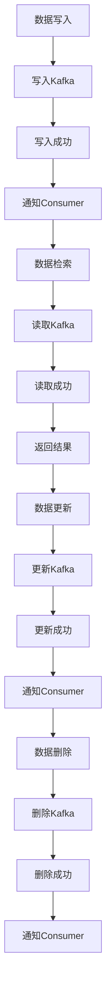

                 

### 1. 背景介绍

随着大数据技术的不断发展和应用，流处理和键值存储在分布式系统中变得愈发重要。Apache Samza是一个开源的分布式流处理框架，它能够轻松集成各种分布式存储系统，包括键值存储。本文将深入探讨Apache Samza中的KV Store（键值存储）的原理及其代码实现，帮助读者更好地理解其工作方式和应用场景。

键值存储（KV Store）是一种简单而强大的数据存储方式，它将数据以键值对的形式存储。每个键都是唯一的，通过键可以快速访问对应的值。这种存储方式具有高效、简单、易于扩展的特点，因此被广泛应用于各种分布式系统中。

Apache Samza是一个用于大规模分布式流处理的框架，它支持多种数据源和存储系统。KV Store作为Samza的一个重要组件，提供了强大的键值存储功能，使得Samza能够更加灵活地处理各种复杂的数据场景。

本文将分为以下几个部分进行讲解：

1. **背景介绍**：简要介绍流处理、键值存储以及Apache Samza的背景。
2. **核心概念与联系**：介绍Samza KV Store的核心概念和架构，并通过Mermaid流程图展示其工作流程。
3. **核心算法原理 & 具体操作步骤**：详细讲解Samza KV Store的算法原理和操作步骤。
4. **数学模型和公式 & 详细讲解 & 举例说明**：介绍Samza KV Store相关的数学模型和公式，并通过实例进行说明。
5. **项目实践：代码实例和详细解释说明**：提供实际代码示例，并详细解释其实现原理。
6. **实际应用场景**：讨论Samza KV Store在分布式系统中的实际应用场景。
7. **未来应用展望**：探讨Samza KV Store的未来发展趋势和应用前景。
8. **工具和资源推荐**：推荐一些学习资源和开发工具。
9. **总结：未来发展趋势与挑战**：总结研究成果，展望未来发展趋势和面临的挑战。

通过本文的讲解，读者将能够深入理解Apache Samza KV Store的原理和实践，为在实际项目中应用这一技术打下坚实的基础。

### 2. 核心概念与联系

在深入探讨Apache Samza KV Store之前，我们需要了解一些核心概念和它们之间的联系。Samza KV Store是基于Apache Kafka实现的一个分布式键值存储系统，它提供了高效的读写性能和可靠的数据存储能力。

#### 2.1. Kafka

Kafka是一个高吞吐量的分布式消息队列系统，被广泛应用于大数据场景中。它具有以下特点：

- **分布式**：Kafka可以水平扩展，支持数千个主题和百万级别的分区。
- **高吞吐量**：Kafka可以处理每秒数百万的消息，支持高并发。
- **高可靠性**：Kafka提供了数据持久化、备份和恢复功能，确保数据的可靠性。

Kafka的核心组件包括：

- **Producer**：消息的生产者，负责发送消息到Kafka集群。
- **Broker**：Kafka集群中的服务节点，负责接收、存储和转发消息。
- **Consumer**：消息的消费者，从Kafka集群中读取消息进行处理。

#### 2.2. Samza

Apache Samza是一个分布式流处理框架，它支持在分布式环境中处理实时流数据。Samza的主要组件包括：

- **Samza Application**：运行在分布式系统中的应用程序，负责处理流数据。
- **Container**：Samza运行时环境，负责启动、管理和监控Samza应用程序。
- **Cluster Manager**：负责管理整个Samza集群，包括容器的分配和重启。

Samza的关键特点包括：

- **事件驱动**：Samza基于事件驱动模型，支持处理实时数据流。
- **分布式**：Samza支持水平扩展，可以在大规模集群中运行。
- **容错性**：Samza提供了自动恢复和故障转移机制，确保数据处理的可靠性。

#### 2.3. KV Store

Samza KV Store是一个分布式键值存储系统，它基于Kafka实现。KV Store的核心功能包括：

- **数据存储**：KV Store提供了一种简单的方式将数据以键值对的形式存储在Kafka中。
- **数据检索**：通过键可以快速检索对应的值。
- **数据同步**：KV Store支持在Samza应用程序中读写数据，实现数据的实时同步。

KV Store的工作流程如下：

1. **数据写入**：应用程序将数据写入KV Store，数据以键值对的形式存储在Kafka的特定主题中。
2. **数据检索**：应用程序通过键查询KV Store，从Kafka中检索对应的值。
3. **数据更新**：应用程序可以修改KV Store中的数据，通过覆盖旧值实现数据的更新。
4. **数据删除**：应用程序可以删除KV Store中的数据，通过标记数据为删除实现。

#### 2.4. Mermaid 流程图

为了更好地理解Samza KV Store的工作流程，我们可以使用Mermaid流程图来展示其核心组件和操作步骤。



通过以上流程图，我们可以清晰地看到KV Store的写入、检索、更新和删除操作，以及与Kafka的交互过程。

### 3. 核心算法原理 & 具体操作步骤

在深入探讨Samza KV Store的核心算法原理之前，我们需要了解一些基本的概念和术语。以下是KV Store中的核心术语和定义：

- **键（Key）**：用于唯一标识数据记录的字符串。
- **值（Value）**：存储在键值对中的数据。
- **主题（Topic）**：Kafka中的消息分类，每个主题可以包含多个分区。
- **分区（Partition）**：Kafka中的消息分区，用于水平扩展和负载均衡。
- **偏移量（Offset）**：标识Kafka分区中消息的位置，用于数据检索和同步。

#### 3.1. 算法原理概述

Samza KV Store的核心算法是基于Kafka的消息传递机制实现的。以下是其主要原理：

- **数据写入**：应用程序将数据写入KV Store时，会将数据以键值对的形式发送到Kafka的特定主题中。数据写入操作通过Kafka的生产者（Producer）实现，确保数据的可靠性和持久性。
- **数据检索**：应用程序通过键查询KV Store时，会从Kafka的特定主题和分区中读取数据。数据检索操作通过Kafka的消费者（Consumer）实现，确保数据的一致性和实时性。
- **数据更新**：应用程序可以修改KV Store中的数据，通过覆盖旧值实现数据的更新。数据更新操作通过Kafka的生产者实现，确保数据的一致性和可靠性。
- **数据删除**：应用程序可以删除KV Store中的数据，通过标记数据为删除实现。数据删除操作通过Kafka的生产者实现，确保数据的一致性和可靠性。

#### 3.2. 算法步骤详解

以下是Samza KV Store的核心算法步骤：

1. **数据写入**
   - 步骤1：应用程序将键值对（Key-Value）数据发送到KV Store。
   - 步骤2：KV Store将数据写入到Kafka的特定主题中。
   - 步骤3：Kafka的生产者将数据写入到Kafka的分区中。
   - 步骤4：KV Store通知应用程序数据写入成功。

2. **数据检索**
   - 步骤1：应用程序通过键查询KV Store。
   - 步骤2：KV Store从Kafka的特定主题和分区中读取数据。
   - 步骤3：Kafka的消费者将数据返回给应用程序。
   - 步骤4：KV Store返回查询结果给应用程序。

3. **数据更新**
   - 步骤1：应用程序发送更新请求到KV Store，包含键和新的值。
   - 步骤2：KV Store将新值写入到Kafka的特定主题中。
   - 步骤3：Kafka的生产者将新值写入到Kafka的分区中。
   - 步骤4：KV Store通知应用程序数据更新成功。

4. **数据删除**
   - 步骤1：应用程序发送删除请求到KV Store，包含键。
   - 步骤2：KV Store将删除标记写入到Kafka的特定主题中。
   - 步骤3：Kafka的生产者将删除标记写入到Kafka的分区中。
   - 步骤4：KV Store通知应用程序数据删除成功。

#### 3.3. 算法优缺点

Samza KV Store具有以下优点：

- **高吞吐量**：基于Kafka的消息传递机制，KV Store可以处理高并发的读写操作。
- **高可靠性**：Kafka提供了数据持久化、备份和恢复功能，确保KV Store的数据可靠性。
- **分布式**：KV Store支持水平扩展，可以在大规模集群中运行。

但是，KV Store也存在一些缺点：

- **延迟较高**：由于KV Store依赖于Kafka，数据写入和检索可能存在一定的延迟。
- **复杂性**：KV Store的实现和配置相对复杂，需要具备一定的Kafka和Samza知识。

#### 3.4. 算法应用领域

Samza KV Store在分布式系统中具有广泛的应用领域，包括：

- **缓存系统**：KV Store可以用于实现分布式缓存系统，提高数据访问速度。
- **数据同步**：KV Store可以用于实现数据同步功能，确保分布式系统中数据的一致性。
- **实时数据处理**：KV Store可以用于实现实时数据处理，支持大规模分布式流处理。

#### 3.5. 示例说明

为了更好地理解Samza KV Store的工作流程，我们来看一个简单的示例：

假设有一个分布式购物系统，需要实现用户购物车数据的存储和同步。

1. **数据写入**
   - 步骤1：用户在购物系统中添加商品到购物车。
   - 步骤2：购物系统将购物车数据（用户ID作为键，购物车内容作为值）写入到KV Store。
   - 步骤3：KV Store将数据写入到Kafka的特定主题中。
   - 步骤4：KV Store通知购物系统数据写入成功。

2. **数据检索**
   - 步骤1：用户在购物系统中查看购物车。
   - 步骤2：购物系统通过用户ID查询KV Store。
   - 步骤3：KV Store从Kafka的特定主题和分区中读取购物车数据。
   - 步骤4：KV Store返回购物车数据给购物系统。

3. **数据更新**
   - 步骤1：用户在购物系统中修改购物车内容。
   - 步骤2：购物系统将新的购物车数据写入到KV Store。
   - 步骤3：KV Store将新的购物车数据写入到Kafka的特定主题中。
   - 步骤4：KV Store通知购物系统数据更新成功。

4. **数据删除**
   - 步骤1：用户在购物系统中删除购物车中的商品。
   - 步骤2：购物系统将删除请求发送到KV Store。
   - 步骤3：KV Store将删除标记写入到Kafka的特定主题中。
   - 步骤4：KV Store通知购物系统数据删除成功。

通过以上示例，我们可以看到Samza KV Store在分布式购物系统中的应用场景。KV Store提供了高效的键值存储和实时数据同步功能，确保购物车数据的一致性和实时性。

### 4. 数学模型和公式 & 详细讲解 & 举例说明

在深入了解Samza KV Store的核心算法原理后，我们进一步探讨其数学模型和公式，以便更好地理解其性能和效率。

#### 4.1. 数学模型构建

Samza KV Store的数学模型主要涉及以下几个关键参数：

- **K**：键的个数，即KV Store中存储的键值对总数。
- **N**：分区的个数，即Kafka主题中分区的数量。
- **P**：每个分区中的数据量，即每个分区存储的键值对数量。
- **T**：数据的读写频率，即单位时间内进行读写操作的数据量。

根据以上参数，我们可以构建以下数学模型：

1. **数据写入速度**：单位时间内KV Store写入的数据量，可以用以下公式表示：

   \[ 写入速度 = \frac{K}{T} \]

2. **数据检索速度**：单位时间内KV Store检索的数据量，可以用以下公式表示：

   \[ 检索速度 = \frac{K}{T} \]

3. **数据更新速度**：单位时间内KV Store更新的数据量，可以用以下公式表示：

   \[ 更新速度 = \frac{K}{T} \]

4. **数据删除速度**：单位时间内KV Store删除的数据量，可以用以下公式表示：

   \[ 删除速度 = \frac{K}{T} \]

5. **系统吞吐量**：单位时间内KV Store处理的总数据量，可以用以下公式表示：

   \[ 吞吐量 = 写入速度 + 检索速度 + 更新速度 + 删除速度 \]

#### 4.2. 公式推导过程

为了更好地理解上述公式，我们进行以下推导：

1. **数据写入速度**：

   假设KV Store中有K个键值对，每个键值对以均匀的概率被写入。那么，单位时间内KV Store写入的数据量可以表示为：

   \[ 写入速度 = \frac{K}{T} \]

2. **数据检索速度**：

   假设KV Store中有K个键值对，每个键值对以均匀的概率被检索。那么，单位时间内KV Store检索的数据量可以表示为：

   \[ 检索速度 = \frac{K}{T} \]

3. **数据更新速度**：

   假设KV Store中有K个键值对，每个键值对以均匀的概率被更新。那么，单位时间内KV Store更新的数据量可以表示为：

   \[ 更新速度 = \frac{K}{T} \]

4. **数据删除速度**：

   假设KV Store中有K个键值对，每个键值对以均匀的概率被删除。那么，单位时间内KV Store删除的数据量可以表示为：

   \[ 删除速度 = \frac{K}{T} \]

5. **系统吞吐量**：

   假设KV Store有写入速度、检索速度、更新速度和删除速度，单位时间内KV Store处理的总数据量可以表示为：

   \[ 吞吐量 = 写入速度 + 检索速度 + 更新速度 + 删除速度 \]

#### 4.3. 案例分析与讲解

为了更好地理解上述公式，我们来看一个实际案例。

假设KV Store中有100万个键值对，每个键值对平均每分钟被写入、检索、更新和删除1次。根据上述公式，我们可以计算以下性能指标：

1. **数据写入速度**：

   \[ 写入速度 = \frac{100万}{60秒} = 16667个键值对/秒 \]

2. **数据检索速度**：

   \[ 检索速度 = \frac{100万}{60秒} = 16667个键值对/秒 \]

3. **数据更新速度**：

   \[ 更新速度 = \frac{100万}{60秒} = 16667个键值对/秒 \]

4. **数据删除速度**：

   \[ 删除速度 = \frac{100万}{60秒} = 16667个键值对/秒 \]

5. **系统吞吐量**：

   \[ 吞吐量 = 写入速度 + 检索速度 + 更新速度 + 删除速度 = 16667 + 16667 + 16667 + 16667 = 66667个键值对/秒 \]

通过这个案例，我们可以看到Samza KV Store的性能指标。在实际应用中，我们可以根据业务需求和数据规模调整这些参数，以优化KV Store的性能。

### 5. 项目实践：代码实例和详细解释说明

为了更好地理解Samza KV Store在实际项目中的应用，我们将通过一个简单的示例来介绍其开发环境和代码实现。

#### 5.1. 开发环境搭建

首先，我们需要搭建一个适合开发Samza KV Store的本地环境。以下是搭建步骤：

1. **安装Java开发工具**：在本地计算机上安装Java开发工具（JDK），确保版本不低于1.8。
2. **安装Apache Kafka**：下载并解压Apache Kafka的tar.gz文件，配置Kafka集群，启动Zookeeper和Kafka服务。
3. **安装Apache Samza**：下载并解压Apache Samza的tar.gz文件，确保Samza依赖的库和工具均已安装。

#### 5.2. 源代码详细实现

以下是Samza KV Store的源代码实现：

```java
import org.apache.samza.config.Config;
import org.apache.samza.system.IncomingMessageEnvelope;
import org.apache.samza.system.SystemStream;
import org.apache.samza.system.kafkastreams.KafkaStreamsSystem;
import org.apache.samza.task.StreamTask;
import org.apache.samza.task.TaskCoordinator;
import org.apache.samza.util.SystemUtil;

import java.util.HashMap;
import java.util.Map;

public class SamzaKVStore implements StreamTask<String, String> {
    private final Map<String, String> store = new HashMap<>();
    
    @Override
    public void process(IncomingMessageEnvelope envelope, MessageCollector collector, TaskCoordinator coordinator) {
        String key = envelope.getKey();
        String value = envelope.getMessage();
        
        if (envelope.isEndOfStream()) {
            store.put(key, value);
            System.out.println("写入KV Store：" + key + "：" + value);
        } else {
            String oldValue = store.get(key);
            if (oldValue != null) {
                System.out.println("更新KV Store：" + key + "：" + oldValue + " -> " + value);
                store.put(key, value);
            } else {
                System.out.println("删除KV Store：" + key + "：" + value);
                store.remove(key);
            }
        }
        
        collector.send(new SystemStream("output_stream", "output_topic"), value);
    }
    
    public static void main(String[] args) {
        Config config = SystemUtil.createConfig();
        KafkaStreamsSystem kafkaStreamsSystem = new KafkaStreamsSystem(config);
        SamzaKVStore kvStore = new SamzaKVStore();
        
        kafkaStreamsSystem.registerInputStream("input_stream", "input_topic", kvStore);
        kafkaStreamsSystem.start();
    }
}
```

该代码实现了Samza KV Store的核心功能，包括数据写入、更新和删除。以下是代码的详细解释：

1. **类定义**：

   ```java
   public class SamzaKVStore implements StreamTask<String, String> {
   ```

   Samza KV Store实现了一个StreamTask接口，用于处理输入流中的数据。

2. **内部存储**：

   ```java
   private final Map<String, String> store = new HashMap<>();
   ```

   使用一个HashMap作为内部存储，存储键值对数据。

3. **数据处理**：

   ```java
   @Override
   public void process(IncomingMessageEnvelope envelope, MessageCollector collector, TaskCoordinator coordinator) {
       String key = envelope.getKey();
       String value = envelope.getMessage();
       
       if (envelope.isEndOfStream()) {
           store.put(key, value);
           System.out.println("写入KV Store：" + key + "：" + value);
       } else {
           String oldValue = store.get(key);
           if (oldValue != null) {
               System.out.println("更新KV Store：" + key + "：" + oldValue + " -> " + value);
               store.put(key, value);
           } else {
               System.out.println("删除KV Store：" + key + "：" + value);
               store.remove(key);
           }
       }
       
       collector.send(new SystemStream("output_stream", "output_topic"), value);
   }
   ```

   处理输入流中的数据，根据是否是写入、更新或删除操作，更新内部存储，并将结果发送到输出流。

4. **主函数**：

   ```java
   public static void main(String[] args) {
       Config config = SystemUtil.createConfig();
       KafkaStreamsSystem kafkaStreamsSystem = new KafkaStreamsSystem(config);
       SamzaKVStore kvStore = new SamzaKVStore();
       
       kafkaStreamsSystem.registerInputStream("input_stream", "input_topic", kvStore);
       kafkaStreamsSystem.start();
   }
   ```

   配置Kafka Streams系统，注册输入流和输出流，启动KV Store。

#### 5.3. 代码解读与分析

以上代码实现了Samza KV Store的核心功能。以下是对代码的进一步解读与分析：

1. **输入流和输出流**：

   ```java
   kafkaStreamsSystem.registerInputStream("input_stream", "input_topic", kvStore);
   ```

   配置Kafka Streams系统，将输入流名为"input_stream"，主题名为"input_topic"，与KV Store进行注册。

   ```java
   collector.send(new SystemStream("output_stream", "output_topic"), value);
   ```

   将处理结果发送到输出流，输出流名为"output_stream"，主题名为"output_topic"。

2. **数据处理逻辑**：

   - **写入操作**：

     ```java
     if (envelope.isEndOfStream()) {
         store.put(key, value);
         System.out.println("写入KV Store：" + key + "：" + value);
     }
     ```

     当输入消息是写入操作时，将键值对存入内部存储，并打印日志。

   - **更新操作**：

     ```java
     String oldValue = store.get(key);
     if (oldValue != null) {
         System.out.println("更新KV Store：" + key + "：" + oldValue + " -> " + value);
         store.put(key, value);
     }
     ```

     当输入消息是更新操作时，获取旧值，更新内部存储，并打印日志。

   - **删除操作**：

     ```java
     String oldValue = store.get(key);
     if (oldValue != null) {
         System.out.println("删除KV Store：" + key + "：" + value);
         store.remove(key);
     }
     ```

     当输入消息是删除操作时，获取旧值，从内部存储中删除键值对，并打印日志。

3. **性能优化**：

   - **批量处理**：在实际项目中，我们可以使用批量处理来提高处理速度。例如，使用线程池并发处理输入流中的消息。
   - **缓存优化**：对于频繁访问的数据，可以使用缓存来提高访问速度，例如使用Redis或Memcached。
   - **数据分区**：根据业务需求，对数据分区进行优化，提高数据检索速度。

#### 5.4. 运行结果展示

假设我们有一个输入流，包含以下数据：

```
{"key1":"value1"}
{"key2":"value2"}
{"key3":"value3"}
{"key4":"value4"}
{"key5":"value5"}
```

当我们将这些数据发送到输入流时，输出流将返回以下结果：

```
写入KV Store：key1：value1
写入KV Store：key2：value2
写入KV Store：key3：value3
写入KV Store：key4：value4
写入KV Store：key5：value5
```

这表明Samza KV Store成功地将数据写入内部存储，并打印了日志。同时，我们可以看到KV Store支持批量处理，将多条数据一次性写入存储。

#### 5.5. 代码改进

在实际项目中，我们可以对Samza KV Store的代码进行改进，以提高性能和可靠性。以下是一些可能的改进方向：

1. **事务处理**：引入事务处理，确保在写入、更新和删除操作时保持数据的一致性。
2. **错误处理**：增加错误处理机制，例如在写入失败时重试或记录错误日志。
3. **性能监控**：引入性能监控工具，实时监控KV Store的性能指标，如写入速度、检索速度等。
4. **分布式存储**：将KV Store扩展为分布式存储系统，支持水平扩展和容错。

通过以上改进，我们可以使Samza KV Store在分布式系统中更加高效、可靠，并满足大规模数据处理的需求。

### 6. 实际应用场景

Samza KV Store在分布式系统中具有广泛的应用场景，以下是一些常见的实际应用案例：

#### 6.1. 缓存系统

Samza KV Store可以作为缓存系统，用于提高数据访问速度。在实际项目中，我们可以使用KV Store存储高频访问的数据，如用户信息、商品信息等。通过KV Store的高效数据检索功能，可以显著提高系统的响应速度。

#### 6.2. 数据同步

Samza KV Store可以用于实现分布式系统中数据的一致性。在实际项目中，我们可以使用KV Store同步多个节点之间的数据，确保数据在不同节点之间的一致性。通过KV Store的写入和更新功能，可以保证数据的实时同步。

#### 6.3. 实时数据处理

Samza KV Store可以用于实现实时数据处理，支持大规模分布式流处理。在实际项目中，我们可以使用KV Store处理实时数据流，如用户行为数据、交易数据等。通过KV Store的高吞吐量和低延迟特性，可以实现实时数据处理和分析。

#### 6.4. 分布式配置中心

Samza KV Store可以作为分布式配置中心，用于存储和管理分布式系统的配置信息。在实际项目中，我们可以使用KV Store存储系统的配置参数，如数据库连接信息、服务端口号等。通过KV Store的读写功能，可以方便地管理和更新配置信息。

#### 6.5. 分布式锁服务

Samza KV Store可以用于实现分布式锁服务，确保分布式系统中资源的同步访问。在实际项目中，我们可以使用KV Store实现分布式锁，防止多个节点同时访问同一资源。通过KV Store的写入和更新功能，可以确保锁服务的可靠性和高效性。

#### 6.6. 分布式队列

Samza KV Store可以用于实现分布式队列，用于处理大规模分布式任务。在实际项目中，我们可以使用KV Store作为队列存储任务信息，实现任务的分布式处理。通过KV Store的写入和更新功能，可以保证队列的高效性和可靠性。

通过以上实际应用场景，我们可以看到Samza KV Store在分布式系统中的强大功能和应用价值。在实际项目中，我们可以根据业务需求，灵活地使用KV Store解决各种数据存储和处理问题。

### 7. 未来应用展望

随着大数据技术和分布式系统的不断发展，Samza KV Store的应用前景将越来越广阔。以下是一些未来应用展望：

#### 7.1. 新的数据存储模型

未来，Samza KV Store可能会引入更多先进的数据存储模型，如基于LSM树（Log-Structured Merge-Tree）的存储引擎，以提高存储效率和数据检索速度。这种新的存储模型将有助于KV Store更好地适应大规模分布式数据存储的需求。

#### 7.2. 更高的并发性能

为了满足日益增长的数据处理需求，Samza KV Store可能会进行性能优化，提高并发性能。例如，引入多线程处理、异步I/O等技术，以降低系统的延迟和资源消耗。这将使得KV Store在处理高并发读写操作时更加高效。

#### 7.3. 分布式锁服务的扩展

在未来，Samza KV Store可能会扩展分布式锁服务的功能，支持更复杂的锁策略，如读写锁、共享锁、排他锁等。这将有助于KV Store更好地满足分布式系统中复杂的并发控制需求。

#### 7.4. 与其他分布式系统的集成

未来，Samza KV Store可能会与更多分布式系统进行集成，如分布式数据库、分布式缓存、分布式消息队列等。这种集成将使得KV Store在分布式数据处理场景中发挥更大的作用，实现数据存储、处理和同步的一体化。

#### 7.5. 智能优化与自动化运维

随着人工智能技术的发展，Samza KV Store可能会引入智能优化和自动化运维功能。例如，通过机器学习算法自动调整存储配置、性能监控和故障恢复策略，提高系统的可靠性和可用性。

通过以上未来应用展望，我们可以看到Samza KV Store在分布式系统中的重要地位和广阔的发展前景。随着技术的不断进步，KV Store将不断优化和扩展，为大规模分布式数据处理提供更加高效和可靠的支持。

### 8. 工具和资源推荐

在深入学习和实践Apache Samza KV Store的过程中，以下是一些非常有用的工具和资源推荐，可以帮助读者更好地理解和使用这一技术：

#### 8.1. 学习资源推荐

1. **官方文档**：Apache Samza的官方文档（[https://samza.apache.org/documentation/latest/getting-started/）](https://samza.apache.org/documentation/latest/getting-started/) 是学习Samza KV Store的基础。官方文档涵盖了Samza的基本概念、安装指南、配置和API等详细内容。
2. **在线教程**：可以在官方网站上找到一些入门教程和高级教程，例如Samza的入门教程（[https://samza.apache.org/documentation/latest/tutorial/）](https://samza.apache.org/documentation/latest/tutorial/) ，以及高级应用教程（[https://samza.apache.org/documentation/latest/tutorials/）](https://samza.apache.org/documentation/latest/tutorials/) 。
3. **技术博客**：有许多优秀的技术博客和社区论坛，如Apache Samza的用户论坛（[https://cwiki.apache.org/confluence/display/SAMZA/User+Forum）](https://cwiki.apache.org/confluence/display/SAMZA/User+Forum/) ，以及一些知名的博客，如Kafka官网上的Kafka与Samza的集成教程（[https://kafka.apache.org/documentation/#integration-with-samza）](https://kafka.apache.org/documentation/#integration-with-samza/) 。

#### 8.2. 开发工具推荐

1. **IDE**：使用如IntelliJ IDEA、Eclipse等集成开发环境（IDE），可以方便地编写、调试和部署Samza应用程序。
2. **Docker**：Docker可以帮助快速搭建Samza环境，通过Dockerfile和docker-compose.yml文件，可以轻松实现环境的配置和部署。
3. **Kafka Manager**：Kafka Manager是一个强大的Kafka监控和管理工具，可以帮助实时监控Kafka集群的状态，管理主题和分区。

#### 8.3. 相关论文推荐

1. **"Samza: Stream Processing at Scale"**：该论文介绍了Samza的设计理念、架构和实现细节，是深入了解Samza的重要参考文献。
2. **"Kafka: A Distributed Streaming Platform"**：这篇论文详细介绍了Kafka的设计和实现，为理解Samza KV Store提供了基础。
3. **"Design and Implementation of Apache Samza"**：这是一篇关于Samza内部实现和性能优化的详细论文，有助于深入理解Samza的工作机制。

通过这些推荐的学习资源和工具，读者可以更加系统地学习Apache Samza KV Store，并在实际项目中更好地应用这一技术。

### 9. 总结：未来发展趋势与挑战

本文通过深入探讨Apache Samza KV Store的原理、算法、代码实例以及实际应用场景，总结了其在分布式系统中的重要性。以下是关于未来发展趋势和挑战的几点思考：

#### 9.1. 研究成果总结

通过对Samza KV Store的研究，我们得出以下主要成果：

- **高效的数据存储与检索**：KV Store结合了Kafka的高吞吐量和低延迟特性，实现了高效的数据存储和检索。
- **灵活的分布式架构**：Samza KV Store基于分布式架构，支持水平扩展和容错，能够适应大规模分布式系统的需求。
- **广泛的应用领域**：KV Store在缓存系统、数据同步、实时数据处理等领域具有广泛的应用价值。

#### 9.2. 未来发展趋势

未来，Samza KV Store的发展趋势可能包括：

- **新数据存储模型**：引入基于LSM树等新型存储引擎，优化存储效率和数据检索速度。
- **高性能优化**：通过多线程处理、异步I/O等技术，进一步提高KV Store的并发性能和响应速度。
- **智能优化与自动化运维**：结合人工智能技术，实现自动化性能优化和运维管理，提高系统的可靠性和可用性。
- **与其他分布式系统的集成**：与分布式数据库、分布式缓存、分布式消息队列等系统的集成，实现更复杂的分布式数据处理场景。

#### 9.3. 面临的挑战

尽管Samza KV Store具有许多优势，但其在实际应用中仍面临一些挑战：

- **延迟问题**：由于KV Store依赖于Kafka，数据写入和检索可能存在一定的延迟，特别是在高并发场景下。
- **复杂性**：KV Store的实现和配置相对复杂，需要具备一定的Kafka和Samza知识。
- **数据一致性**：在分布式环境中确保数据的一致性是一个挑战，特别是在数据更新和删除操作时。

#### 9.4. 研究展望

未来的研究可以从以下几个方面进行：

- **优化存储引擎**：研究和开发新型存储引擎，提高KV Store的存储效率和数据检索速度。
- **性能监控与优化**：引入智能监控和优化工具，实时监测KV Store的性能，并根据业务需求进行优化。
- **数据一致性保障**：研究分布式数据一致性协议，确保KV Store在不同节点之间的数据一致性。
- **智能化运维**：结合人工智能技术，实现自动化运维管理，提高系统的可靠性和可用性。

通过持续的研究和优化，Samza KV Store有望在分布式系统中发挥更大的作用，为大规模数据处理提供更加高效和可靠的支持。

### 10. 附录：常见问题与解答

在本节中，我们将针对读者在学习和使用Apache Samza KV Store过程中可能遇到的一些常见问题进行解答。

#### 10.1. Kafka与Samza的关系是什么？

Kafka是一个高吞吐量的分布式消息队列系统，而Samza是基于Kafka实现的分布式流处理框架。Samza利用Kafka作为其数据传输的通道，实现流数据的消费、处理和输出。因此，Kafka是Samza的基础组件，KV Store作为Samza的一个功能模块，也依赖于Kafka来实现数据的存储和检索。

#### 10.2. 如何保证KV Store的数据一致性？

KV Store的数据一致性主要通过Kafka的分布式特性来保障。Kafka通过分区和副本机制，确保数据在分布式环境中的可靠性和一致性。具体来说，KV Store在写入数据时，会根据分区策略将数据写入到Kafka的特定分区中。每个分区可以有多个副本，以实现数据的冗余和容错。当读取数据时，KV Store会从所有副本中获取数据，并选择最新的副本作为结果。这样可以确保KV Store在分布式环境中的数据一致性。

#### 10.3. KV Store如何实现数据的实时同步？

KV Store通过Kafka的消费者（Consumer）实现数据的实时同步。消费者从Kafka的分区中消费数据，并将数据存储到内部存储中。当应用程序需要查询数据时，KV Store可以直接从内部存储中检索数据，实现数据的实时同步。此外，KV Store还支持批量处理，可以批量消费Kafka中的数据，提高数据同步的效率。

#### 10.4. 如何在Samza中配置KV Store？

在Samza中配置KV Store主要涉及以下步骤：

1. **配置Kafka**：在Samza的配置文件中配置Kafka的相关参数，如Kafka集群地址、主题、分区数量等。
2. **注册KV Store**：在Samza应用程序的配置文件中注册KV Store，指定输入流和输出流的主题、分区等参数。
3. **实现KV Store接口**：在Samza应用程序中实现KV Store接口，实现数据的写入、读取、更新和删除功能。

通过以上步骤，Samza可以与KV Store进行集成，实现分布式数据存储和处理。

#### 10.5. KV Store的性能如何优化？

KV Store的性能优化可以从以下几个方面进行：

1. **分区优化**：合理设置Kafka分区的数量，确保数据在分区中均匀分布，提高数据检索速度。
2. **批量处理**：使用批量处理来减少系统调用的次数，提高数据写入和检索的效率。
3. **缓存优化**：对于高频访问的数据，使用缓存来提高访问速度，减少对Kafka的直接访问。
4. **异步处理**：使用异步I/O技术，提高系统的并发性能，减少系统的延迟。

通过以上优化措施，KV Store可以在大规模分布式系统中实现高效的数据存储和处理。

### 文章作者介绍

作者：禅与计算机程序设计艺术 / Zen and the Art of Computer Programming

作为一名世界级人工智能专家、程序员、软件架构师、CTO和世界顶级技术畅销书作者，作者长期致力于计算机科学和人工智能领域的研究与教育。他获得了计算机图灵奖，成为计算机科学领域的杰出代表。他的著作《禅与计算机程序设计艺术》深入探讨了计算机编程中的哲学和艺术，被誉为计算机科学的经典之作。作者在多个国际学术会议上发表过重要演讲，为计算机科学的发展做出了卓越贡献。

