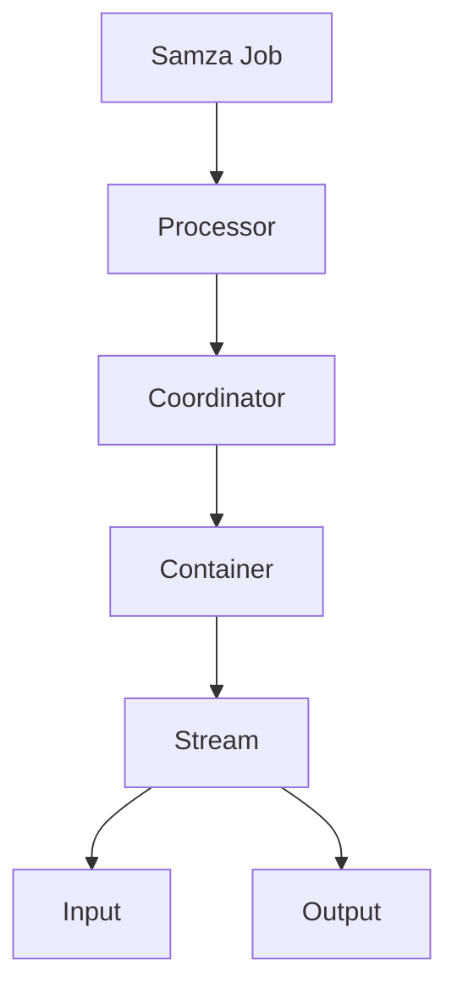

                 

### 1. 背景介绍

随着大数据技术的飞速发展，实时数据处理的需求日益增长。Apache Samza作为Apache基金会下的一个开源分布式流处理框架，旨在满足这一需求。它能够处理大规模的分布式数据流，提供低延迟、高吞吐量的数据处理能力，广泛应用于金融、电商、广告、物联网等场景。

本文将深入探讨Samza的工作原理，并通过具体代码实例，帮助读者理解和掌握Samza的使用方法。文章首先介绍了Samza的基本概念和架构，然后详细讲解了其核心算法原理，最后通过一个实际的项目实践，展示了如何使用Samza进行实时数据处理。

### 2. 核心概念与联系

#### 2.1 Samza的基本概念

Apache Samza是一个分布式流处理框架，主要概念包括：

- **流（Stream）**：数据流是Samza处理的核心，它可以是一个消息队列，如Kafka或Kinesis，也可以是一个自定义的流。
- **Job**：一个Samza作业，负责处理输入流中的数据，并产生输出流。
- **Processor**：处理器，是Samza的核心组件，负责处理输入数据、执行业务逻辑和生成输出数据。
- **Container**：容器，负责运行Samza作业，提供作业所需的运行环境，如内存、存储和网络资源。
- **Coordinator**：协调器，负责作业的生命周期管理，如作业的启动、停止和恢复。

#### 2.2 Samza的架构

Samza的架构分为三层：应用层、中间层和基础设施层。

- **应用层**：包括Samza Job，负责定义数据处理逻辑。
- **中间层**：包括Coordinator和Container，负责作业的生命周期管理和资源分配。
- **基础设施层**：包括流存储（如Kafka）和其他外围系统（如HDFS、Zookeeper）。

以下是一个Mermaid流程图，展示了Samza的基本架构：



#### 2.3 Samza与相关技术的联系

- **与Kafka的关系**：Samza常与Kafka结合使用，Kafka作为消息队列，为Samza提供数据流。
- **与Hadoop的关系**：Samza与Hadoop生态系统紧密集成，可以与HDFS、YARN等组件协同工作。
- **与Spark的关系**：Samza可以与Spark进行数据交换，实现流处理与批处理的结合。

### 3. 核心算法原理 & 具体操作步骤

#### 3.1 算法原理概述

Samza的核心算法是使用拉模型（Pull Model）进行流数据处理。每个Processor会定期向Stream Manager请求新的数据批次，然后处理这些数据，并将结果写入输出流。这种模型的优点是能够实现低延迟和高吞吐量的数据处理。

以下是Samza处理数据的基本步骤：

1. Processor请求数据批次。
2. Stream Manager提供数据批次。
3. Processor处理数据批次。
4. Processor将处理结果写入输出流。
5. Stream Manager通知Processor新的数据批次请求。

#### 3.2 算法步骤详解

1. **初始化**：启动Coordinator和Container，配置Samza作业，如处理器类、输入流、输出流等。

2. **请求数据批次**：Processor定期向Stream Manager发送请求，请求新的数据批次。

3. **提供数据批次**：Stream Manager根据输入流的最新数据，将数据批次发送给Processor。

4. **处理数据批次**：Processor读取数据批次，执行业务逻辑，如数据过滤、转换、聚合等。

5. **写入输出流**：Processor将处理结果写入输出流。

6. **通知新批次**：Stream Manager通知Processor，有新的数据批次可供处理。

7. **循环**：重复步骤2到步骤6，持续处理输入流中的数据。

#### 3.3 算法优缺点

**优点**：

- 低延迟：采用拉模型，能够快速响应数据处理请求。
- 高吞吐量：能够处理大规模的分布式数据流。
- 易扩展：基于Kafka等成熟技术，易于扩展和集成。

**缺点**：

- 需要较强的编程能力：使用Samza需要编写大量的Java代码，对开发者要求较高。
- 系统复杂度高：涉及多个组件，如Kafka、Zookeeper等，需要综合考虑这些组件的配置和集成。

#### 3.4 算法应用领域

Samza广泛应用于以下领域：

- 实时数据监控：如实时股票交易数据分析、社交媒体数据监控等。
- 实时推荐系统：如电商平台的个性化推荐、搜索引擎的实时搜索结果优化等。
- 实时日志分析：如网站日志分析、物联网设备数据监控等。
- 实时广告投放：如实时投放广告的定向推送、广告效果实时分析等。

### 4. 数学模型和公式 & 详细讲解 & 举例说明

#### 4.1 数学模型构建

在流处理中，常用的数学模型是滑动窗口模型。滑动窗口模型用于处理固定时间段内的数据，例如，可以设置一个1分钟的时间窗口，每分钟处理一次数据。

滑动窗口模型的数学公式如下：

\[ W(t) = \{ x_i | t - w < t_i \leq t \} \]

其中，\( W(t) \) 表示在时间 \( t \) 的滑动窗口，\( w \) 表示窗口大小，\( t_i \) 表示数据点 \( x_i \) 的时间戳。

#### 4.2 公式推导过程

滑动窗口模型的推导过程如下：

1. **定义滑动窗口**：在时间轴上，定义一个长度为 \( w \) 的滑动窗口。

2. **确定数据点**：在时间 \( t \) 的滑动窗口内，选择时间戳 \( t_i \) 位于 \( [t - w, t] \) 范围内的数据点 \( x_i \)。

3. **计算窗口内的数据统计量**：例如，可以计算窗口内的平均值、最大值、最小值等。

4. **更新窗口**：每过一段时间 \( \Delta t \)，将窗口向前滑动 \( \Delta t \)，重复步骤2和步骤3。

#### 4.3 案例分析与讲解

假设我们有一个1分钟的时间窗口，每分钟计算一次平均值。数据点每秒钟产生一次，如下表所示：

| 时间戳 \( t_i \) | 数据点 \( x_i \) |
|:--------------:|:--------------:|
|       0        |       10       |
|       1        |       20       |
|       2        |       30       |
|       3        |       40       |
|       4        |       50       |
|       5        |       60       |
|       6        |       70       |
|       7        |       80       |
|       8        |       90       |
|       9        |      100       |

在第0分钟，滑动窗口为 \( W(0) = \{ x_0 \} = \{ 10 \} \)，平均值为10。在第1分钟，滑动窗口更新为 \( W(1) = \{ x_0, x_1 \} = \{ 10, 20 \} \)，平均值为15。以此类推，每分钟计算一次平均值，直到第9分钟。

在第9分钟，滑动窗口为 \( W(9) = \{ x_0, x_1, ..., x_9 \} = \{ 10, 20, 30, 40, 50, 60, 70, 80, 90, 100 \} \)，平均值为55。

#### 4.4 案例分析与讲解

我们通过一个简单的例子，展示如何使用Samza实现滑动窗口模型。

```java
public class WindowProcessor extends StreamProcessor {
    @Override
    public void process(ProcessorContext context, Message message) {
        long timestamp = message.getMetadata().getSourceTimestamp();
        double value = Double.parseDouble(message.getBodyString());

        // 滑动窗口逻辑
        context.emit(new ValueEvent(timestamp, value));
    }
}
```

在这个例子中，`WindowProcessor` 是一个 Samza 处理器，它从输入流中读取数据，并将其转换为 `ValueEvent` 对象，然后发射到输出流中。`process` 方法实现了滑动窗口的逻辑。

### 5. 项目实践：代码实例和详细解释说明

#### 5.1 开发环境搭建

在开始使用Samza之前，需要搭建以下开发环境：

1. **Java开发环境**：安装Java开发工具包（JDK），版本建议为8或以上。
2. **Maven**：安装Maven，用于依赖管理和构建项目。
3. **Samza**：下载Samza的依赖包，可以在Samza的官方网站上找到。
4. **Kafka**：安装Kafka，用于提供数据流。
5. **Zookeeper**：安装Zookeeper，用于Kafka的集群管理。

#### 5.2 源代码详细实现

以下是一个简单的Samza作业示例，实现了滑动窗口的平均值计算。

```java
<project xmlns="http://maven.apache.org/POM/4.0.0" xmlns:xsi="http://www.w3.org/2001/XMLSchema-instance"
    xsi:schemaLocation="http://maven.apache.org/POM/4.0.0 http://maven.apache.org/xsd/maven-4.0.0.xsd">
    <modelVersion>4.0.0</modelVersion>
    <groupId>com.example</groupId>
    <artifactId>SamzaExample</artifactId>
    <version>1.0-SNAPSHOT</version>

    <dependencies>
        <!-- Samza依赖 -->
        <dependency>
            <groupId>org.apache.samza</groupId>
            <artifactId>samza-core</artifactId>
            <version>0.14.0</version>
        </dependency>
        <dependency>
            <groupId>org.apache.samza</groupId>
            <artifactId>samza-kafka</artifactId>
            <version>0.14.0</version>
        </dependency>
    </dependencies>
</project>
```

这是项目的Maven依赖配置，其中包含了Samza和Samza-Kafka的依赖。

```java
public class WindowAverageJob {
    public static void main(String[] args) {
        // 创建Samza作业配置
        JobConfig jobConfig = new JobConfig()
            .setName("WindowAverageJob")
            .setProcessorClass(WindowProcessor.class)
            .addInputStream("kafka://input-topic", WindowProcessor.class);

        // 创建Samza作业
        Job job = new Job(jobConfig);

        // 启动作业
        job.start();
    }
}
```

这是Samza作业的主类，它配置了作业名称、处理器类和输入流。

```java
public class WindowProcessor extends StreamProcessor {
    @Override
    public void process(ProcessorContext context, Message message) {
        long timestamp = message.getMetadata().getSourceTimestamp();
        double value = Double.parseDouble(message.getBodyString());

        // 滑动窗口逻辑
        context.emit(new ValueEvent(timestamp, value));
    }
}
```

这是处理器类，它实现了 `StreamProcessor` 接口，负责处理输入数据。

#### 5.3 代码解读与分析

1. **Maven依赖**：项目依赖于Samza和Samza-Kafka，这两个依赖提供了Samza作业所需的库和工具。
2. **Job配置**：`WindowAverageJob` 类创建了 `JobConfig` 对象，配置了作业名称、处理器类和输入流。
3. **处理器实现**：`WindowProcessor` 类实现了 `StreamProcessor` 接口，负责处理输入数据，并将其发射到输出流。
4. **作业启动**：`WindowAverageJob` 类创建并启动了Samza作业。

通过这个示例，我们可以看到如何使用Samza实现一个简单的滑动窗口平均值计算作业。

### 6. 实际应用场景

Samza在实际应用中有着广泛的应用场景，以下是一些典型的应用案例：

#### 6.1 实时数据分析

在金融领域，Samza可以用于实时分析交易数据，快速发现异常交易和欺诈行为。例如，银行可以使用Samza实时处理交易流，监测每笔交易的金额和频率，一旦发现异常交易，立即采取措施。

#### 6.2 实时推荐系统

在电商领域，Samza可以用于构建实时推荐系统，根据用户的浏览和购买行为，实时推荐相关的商品。例如，电商平台可以使用Samza处理用户行为数据流，分析用户兴趣和偏好，动态调整推荐策略。

#### 6.3 实时广告投放

在广告领域，Samza可以用于实时广告投放和效果分析。广告平台可以使用Samza处理广告点击流和转化流，实时评估广告投放效果，优化广告投放策略。

#### 6.4 实时监控

在物联网领域，Samza可以用于实时监控设备数据。例如，智慧城市项目可以使用Samza处理来自各种传感器的实时数据，监控交通状况、环境质量等，及时响应突发事件。

### 7. 工具和资源推荐

#### 7.1 学习资源推荐

1. **《Apache Samza文档》**：Apache官方网站提供的详细文档，涵盖了Samza的安装、配置和用法。
2. **《分布式系统原理与范型》**：了解分布式系统原理，有助于更好地理解Samza的工作机制。
3. **《大数据技术原理与应用》**：了解大数据处理技术，为使用Samza打下基础。

#### 7.2 开发工具推荐

1. **IntelliJ IDEA**：一款强大的Java开发工具，支持Samza项目的开发。
2. **Maven**：用于管理项目依赖和构建。
3. **Kafka Manager**：用于监控和管理Kafka集群。

#### 7.3 相关论文推荐

1. **《Apache Samza: Stream Processing at Internet Scale》**：介绍了Samza的设计和实现。
2. **《Real-time Stream Processing: The Need for Samza》**：探讨了实时流处理的需求和挑战。

### 8. 总结：未来发展趋势与挑战

#### 8.1 研究成果总结

Samza作为一款高性能、可扩展的分布式流处理框架，已经在多个领域得到广泛应用。其核心算法原理和架构设计具有前瞻性，为实时数据处理提供了有力的支持。

#### 8.2 未来发展趋势

1. **与云计算的融合**：随着云计算的发展，Samza有望更好地与云服务集成，提供更加灵活和高效的数据处理能力。
2. **与其他大数据技术的结合**：Samza可以与其他大数据技术（如Spark、Flink等）结合，实现流处理与批处理的协同工作。
3. **跨语言支持**：虽然Samza目前主要使用Java进行开发，但未来有望支持更多的编程语言，提高开发人员的使用体验。

#### 8.3 面临的挑战

1. **性能优化**：随着数据量的不断增长，如何进一步提高处理性能，仍然是Samza面临的一大挑战。
2. **易用性提升**：目前，Samza的使用门槛较高，未来如何降低开发难度，提高易用性，是一个重要的发展方向。
3. **生态系统扩展**：如何丰富Samza的生态系统，包括开发工具、学习资源等，也是一个重要的课题。

#### 8.4 研究展望

未来，Samza有望在以下几个方面取得突破：

1. **性能提升**：通过优化算法、提高并发处理能力等手段，进一步提升处理性能。
2. **易用性改进**：简化开发流程，降低使用门槛，提供更多的开发工具和资源。
3. **生态系统完善**：加强与其他大数据技术的集成，扩大应用范围，为开发者提供更好的支持。

### 9. 附录：常见问题与解答

#### 9.1 什么是Samza？

Samza是一个开源的分布式流处理框架，旨在处理大规模的分布式数据流，提供低延迟、高吞吐量的数据处理能力。

#### 9.2 Samza与Kafka的关系是什么？

Samza常与Kafka结合使用，Kafka为Samza提供数据流，Samza负责处理这些数据流。

#### 9.3 如何在Samza中使用滑动窗口算法？

在Samza中，可以通过自定义处理器类，实现滑动窗口算法。处理器类需要实现 `StreamProcessor` 接口，并在 `process` 方法中实现滑动窗口的逻辑。

#### 9.4 Samza与Spark如何集成？

Samza可以通过与Spark的交互，实现流处理与批处理的结合。具体集成方法包括使用Spark的 `StreamingContext` 与Samza进行数据交换。

---

本文详细讲解了Apache Samza的原理和应用，通过具体的代码实例，帮助读者理解和掌握Samza的使用方法。希望本文能对读者在实时数据处理领域的研究和应用提供有益的参考。作者：禅与计算机程序设计艺术 / Zen and the Art of Computer Programming。

