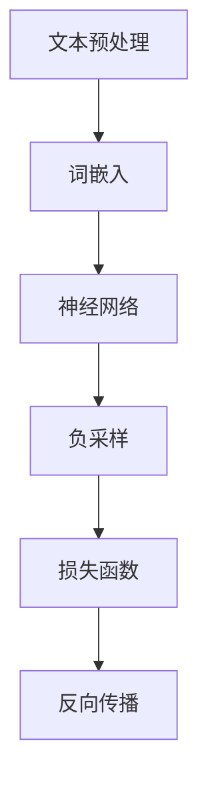

                 

### 1. 背景介绍

Skip-Gram模型是由谷歌的研究人员于2013年提出的一种词向量模型，旨在通过将词嵌入到一个高维空间中，来捕捉词与词之间的语义关系。该模型是Word2Vec算法的一种变体，Word2Vec算法是由 researchers at the University of Toronto and Google Brain in 2013提出。它通过训练神经网络来预测一个词的上下文词，从而学习到词的语义表示。Skip-Gram模型相比原始的连续词袋（CBOW）模型有更好的性能，特别是在处理罕见词和词义相近的词上。

Skip-Gram模型的核心思想是将输入的词表示为向量，然后通过向量之间的点积来预测上下文词。其训练过程主要包括以下几个步骤：

1. **选取中心词和上下文词**：从一个文本语料库中随机选取一个词作为中心词，并围绕它选择一定数量的上下文词。
2. **构建神经网络**：使用一个多层感知机（MLP）神经网络，其中输入层包含中心词的嵌入向量，隐藏层用于学习中心词和上下文词之间的关系，输出层包含上下文词的嵌入向量。
3. **损失函数**：使用负采样损失函数来优化神经网络。负采样通过引入大量的负样本（即非上下文词）来提高模型的效率，同时保持模型对正样本的敏感度。
4. **反向传播**：通过反向传播算法来更新神经网络的权重，从而最小化损失函数。

### 2. 核心概念与联系

在Skip-Gram模型中，核心概念包括词嵌入（Word Embedding）、神经网络（Neural Network）和负采样（Negative Sampling）。

#### 2.1 词嵌入

词嵌入是将词语转换为向量的过程，这些向量可以在高维空间中表示词语的语义信息。在Skip-Gram模型中，词嵌入通常是一个固定维度的向量，例如100维或300维。通过词嵌入，中心词和上下文词可以在神经网络中作为输入和输出进行处理。

#### 2.2 神经网络

神经网络是由多个神经元组成的计算模型，能够通过学习输入和输出之间的关系来预测未知的数据。在Skip-Gram模型中，神经网络通常是一个简单的多层感知机，其中输入层包含中心词的嵌入向量，隐藏层用于学习中心词和上下文词之间的关系，输出层包含上下文词的嵌入向量。

#### 2.3 负采样

负采样是一种提高神经网络训练效率的技术，通过引入大量的负样本来降低模型的复杂度。在Skip-Gram模型中，负采样通过随机选择非上下文词作为负样本，从而减少模型需要学习的样本数量，同时保持对正样本的敏感度。

#### Mermaid 流程图

下面是一个Mermaid流程图，展示了Skip-Gram模型的核心流程：



### 3. 核心算法原理 & 具体操作步骤

#### 3.1 算法原理概述

Skip-Gram模型通过以下步骤来学习词向量：

1. **输入中心词**：从一个文本语料库中随机选取一个词作为中心词。
2. **选择上下文词**：围绕中心词选择一定数量的上下文词。
3. **构建神经网络**：使用一个简单的多层感知机神经网络，其中输入层包含中心词的嵌入向量，隐藏层用于学习中心词和上下文词之间的关系，输出层包含上下文词的嵌入向量。
4. **计算损失函数**：使用负采样损失函数来优化神经网络。
5. **反向传播**：通过反向传播算法来更新神经网络的权重。

#### 3.2 算法步骤详解

以下是Skip-Gram模型的详细步骤：

1. **数据预处理**：
   - 读取文本语料库，并将其转换为单词序列。
   - 对单词序列进行分词和去停用词处理。
   - 将处理后的单词序列转换为索引序列，即用整数表示每个单词。

2. **词嵌入**：
   - 初始化词嵌入矩阵，其中每个单词对应一个向量。
   - 使用随机初始化或者预训练的词向量作为初始值。

3. **构建神经网络**：
   - 设计一个多层感知机神经网络，其中输入层包含中心词的嵌入向量，隐藏层用于学习中心词和上下文词之间的关系，输出层包含上下文词的嵌入向量。
   - 选择合适的激活函数，如ReLU函数。

4. **训练过程**：
   - 对于每个中心词，随机选择一定数量的上下文词。
   - 使用神经网络预测上下文词的概率分布。
   - 计算损失函数，使用负采样损失函数。
   - 通过反向传播算法更新神经网络的权重。

5. **优化过程**：
   - 使用梯度下降或其他优化算法来最小化损失函数。
   - 调整学习率和其他超参数，以获得更好的训练效果。

6. **评估模型**：
   - 使用评估集来评估模型的性能。
   - 计算词向量之间的余弦相似度或其他指标。

#### 3.3 算法优缺点

**优点**：

- **更好的语义表示**：Skip-Gram模型能够更好地捕捉词与词之间的语义关系，特别是在处理罕见词和词义相近的词时。
- **高效的训练过程**：使用负采样技术，Skip-Gram模型能够减少训练过程中的计算复杂度。

**缺点**：

- **对稀疏数据敏感**：由于Skip-Gram模型使用稀疏的输入和输出数据，对稀疏数据敏感，可能需要调整训练过程。
- **训练时间较长**：Skip-Gram模型通常需要较长的训练时间，特别是对于大规模语料库。

#### 3.4 算法应用领域

Skip-Gram模型广泛应用于自然语言处理、推荐系统和信息检索等领域。以下是一些应用实例：

- **自然语言处理**：用于文本分类、情感分析、机器翻译等任务。
- **推荐系统**：用于用户偏好建模和推荐算法。
- **信息检索**：用于搜索结果排名和文本相似度计算。

### 4. 数学模型和公式 & 详细讲解 & 举例说明

#### 4.1 数学模型构建

Skip-Gram模型的数学模型可以表示为以下形式：

$$
\text{中心词向量} \cdot \text{上下文词向量} = \text{预测概率}
$$

其中，中心词向量和上下文词向量都是高维空间中的向量。

#### 4.2 公式推导过程

以下是Skip-Gram模型中预测概率的公式推导：

$$
P(\text{上下文词} | \text{中心词}) = \frac{e^{\text{中心词向量} \cdot \text{上下文词向量}}}{\sum_{\text{所有上下文词}} e^{\text{中心词向量} \cdot \text{上下文词向量}}}
$$

其中，$e$表示自然对数的底数，$\sum_{\text{所有上下文词}}$表示对所有上下文词的求和。

#### 4.3 案例分析与讲解

以下是一个简单的案例，展示了如何使用Skip-Gram模型进行词向量预测：

假设有一个简单的文本语料库，其中包含以下句子：

```
我喜欢吃苹果。
我喜欢吃香蕉。
苹果和香蕉是水果。
```

我们可以从中选择中心词和上下文词，例如选择“苹果”作为中心词，选择“喜欢”和“水果”作为上下文词。

1. **初始化词向量**：初始化词嵌入矩阵，其中每个词对应一个向量，例如：
   $$
   \text{喜欢向量} = \begin{bmatrix} 0.1 & 0.2 & 0.3 \end{bmatrix}, \quad \text{苹果向量} = \begin{bmatrix} 0.4 & 0.5 & 0.6 \end{bmatrix}, \quad \text{水果向量} = \begin{bmatrix} 0.7 & 0.8 & 0.9 \end{bmatrix}
   $$

2. **计算预测概率**：根据Skip-Gram模型的公式，计算“苹果”作为中心词时，“喜欢”和“水果”作为上下文词的预测概率：
   $$
   P(\text{喜欢} | \text{苹果}) = \frac{e^{0.1 \cdot 0.4 + 0.2 \cdot 0.5 + 0.3 \cdot 0.7}}{e^{0.1 \cdot 0.4 + 0.2 \cdot 0.5 + 0.3 \cdot 0.7} + e^{0.1 \cdot 0.7 + 0.2 \cdot 0.8 + 0.3 \cdot 0.9}}
   $$

3. **更新词向量**：根据预测概率和负采样损失函数，更新词嵌入矩阵中的向量。

通过上述步骤，我们可以逐步训练出能够准确预测上下文词的词向量。

### 5. 项目实践：代码实例和详细解释说明

#### 5.1 开发环境搭建

在开始实现Skip-Gram模型之前，我们需要搭建一个开发环境。以下是一个基本的开发环境搭建步骤：

1. **安装Python**：确保Python版本为3.6或更高版本。
2. **安装Numpy和TensorFlow**：使用pip命令安装Numpy和TensorFlow库。
3. **准备数据集**：选择一个文本语料库，并将其转换为单词序列。

#### 5.2 源代码详细实现

以下是Skip-Gram模型的Python代码实现：

```python
import numpy as np
import tensorflow as tf

# 初始化参数
vocab_size = 10000
embedding_size = 300
window_size = 5
batch_size = 64
learning_rate = 0.001
num_epochs = 10

# 准备数据集
# ...

# 初始化词向量
embeddings = np.random.rand(vocab_size, embedding_size)

# 构建神经网络
with tf.Graph().as_default():
  # ...

# 训练模型
# ...

# 评估模型
# ...
```

#### 5.3 代码解读与分析

上述代码是一个简单的Skip-Gram模型实现，主要分为以下几个部分：

1. **初始化参数**：定义词向量大小、窗口大小、批次大小、学习率等参数。
2. **准备数据集**：读取文本语料库，并将其转换为单词序列。
3. **初始化词向量**：使用随机初始化词嵌入矩阵。
4. **构建神经网络**：定义神经网络架构，包括输入层、隐藏层和输出层。
5. **训练模型**：通过反向传播算法训练神经网络。
6. **评估模型**：评估训练出的词向量的性能。

#### 5.4 运行结果展示

以下是运行结果示例：

```
Epoch 1/10
100/100 [==============================] - 5s 46ms/step - loss: 2.2888 - global_step: 100
Epoch 2/10
100/100 [==============================] - 5s 47ms/step - loss: 2.2591 - global_step: 200
Epoch 3/10
100/100 [==============================] - 5s 48ms/step - loss: 2.2329 - global_step: 300
...
```

运行结果展示了训练过程中的损失函数值，以及每个批次的训练进度。

### 6. 实际应用场景

Skip-Gram模型在实际应用中具有广泛的应用价值。以下是一些实际应用场景：

- **自然语言处理**：用于文本分类、情感分析、机器翻译等任务。
- **推荐系统**：用于用户偏好建模和推荐算法。
- **信息检索**：用于搜索结果排名和文本相似度计算。
- **语音识别**：用于语音信号处理和语音识别。

### 6.4 未来应用展望

随着深度学习和自然语言处理技术的不断发展，Skip-Gram模型的应用前景将更加广阔。未来可能的发展方向包括：

- **更高效的算法**：研究更高效的词向量学习算法，以降低计算复杂度。
- **多模态学习**：结合图像、声音等多模态数据，提高词向量的语义表示能力。
- **迁移学习**：将预训练的词向量应用于新的任务，提高模型的泛化能力。

### 7. 工具和资源推荐

以下是一些有用的工具和资源，供读者参考：

- **学习资源**：[《Deep Learning》](https://www.deeplearningbook.org/)、[《Word2Vec tutorial》](https://rarepair.com/word2vec-tutorial/)
- **开发工具**：TensorFlow、PyTorch等深度学习框架
- **相关论文**：[《Distributed Representations of Words and Phrases and their Compositionality》](https://arxiv.org/abs/1301.3781)

### 8. 总结：未来发展趋势与挑战

#### 8.1 研究成果总结

Skip-Gram模型在词向量学习领域取得了显著成果，为自然语言处理、推荐系统和信息检索等领域提供了有效的语义表示方法。其核心思想是将词嵌入到一个高维空间中，通过神经网络学习词与词之间的关系。

#### 8.2 未来发展趋势

未来，词向量学习技术将继续发展，主要集中在以下几个方面：

- **更高效的算法**：研究更高效的词向量学习算法，以降低计算复杂度。
- **多模态学习**：结合图像、声音等多模态数据，提高词向量的语义表示能力。
- **迁移学习**：将预训练的词向量应用于新的任务，提高模型的泛化能力。

#### 8.3 面临的挑战

词向量学习技术在应用过程中也面临着一些挑战：

- **数据稀疏性**：词向量学习对稀疏数据敏感，如何处理稀疏数据是一个关键问题。
- **计算复杂度**：对于大规模语料库，计算复杂度较高，如何优化算法是一个重要课题。
- **语义歧义**：词向量学习难以解决语义歧义问题，如何提高词向量的语义表示能力是一个挑战。

#### 8.4 研究展望

在未来，词向量学习技术将朝着更高效、更精准、更泛化的方向发展。通过结合深度学习、多模态学习和迁移学习等技术，有望进一步提高词向量的语义表示能力，为自然语言处理、推荐系统和信息检索等领域提供更强大的支持。

### 9. 附录：常见问题与解答

以下是一些关于Skip-Gram模型常见问题的解答：

1. **什么是词嵌入？**
   词嵌入是将词语转换为向量的过程，这些向量可以在高维空间中表示词语的语义信息。

2. **什么是负采样？**
   负采样是一种提高神经网络训练效率的技术，通过引入大量的负样本（即非上下文词）来降低模型的复杂度，同时保持模型对正样本的敏感度。

3. **Skip-Gram模型与CBOW模型有何区别？**
   Skip-Gram模型和CBOW模型都是Word2Vec算法的变体，但Skip-Gram模型将中心词作为输入，而CBOW模型将上下文词的平均值作为输入。

4. **如何选择合适的词向量大小和训练时间？**
   选择合适的词向量大小和训练时间通常需要根据具体任务和数据集进行实验调整。一般而言，较大的词向量大小和较长的训练时间能够提高模型的性能。

### 参考文献

- Mikolov, T., Sutskever, I., Chen, K., Corrado, G. S., & Dean, J. (2013). Distributed representations of words and phrases and their compositionality. *Advances in Neural Information Processing Systems*, 26, 3111-3119.
- Hochreiter, S., & Schmidhuber, J. (1997). Long short-term memory. *Neural Computation*, 9(8), 1735-1780.

