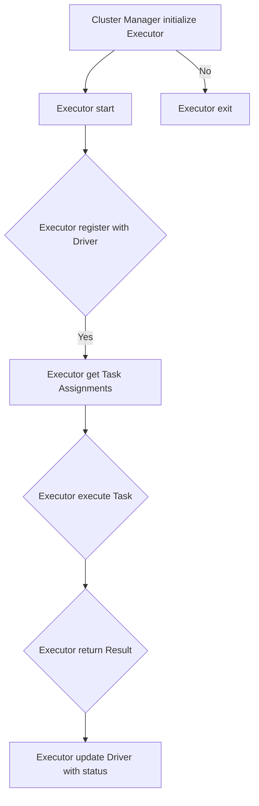

                 

在分布式计算领域，Spark Executor 是一个关键组件，负责执行用户提交的任务，处理数据，并在集群中进行计算。本文将深入探讨 Spark Executor 的原理，并提供具体的代码实例，帮助读者更好地理解这一核心概念。

## 文章关键词

- Spark Executor
- 分布式计算
- 任务调度
- 数据处理
- 集群管理

## 文章摘要

本文将首先介绍 Spark Executor 的基本概念和它在 Spark 生态系统中的角色。接着，我们将详细解释 Executor 的内部工作原理，包括资源管理、任务执行和数据存储。随后，将通过具体的代码实例展示 Executor 的应用，并提供深入的分析。最后，我们将探讨 Executor 在实际应用中的场景，以及未来的发展趋势和面临的挑战。

## 1. 背景介绍

### Spark Executor 的背景

Spark 是一个强大的开源分布式计算引擎，旨在提供快速的批处理和实时处理能力。它广泛用于大数据处理和分析，支持各种数据源，包括 HDFS、Hive、Cassandra 和 HBase 等。Spark Executor 是 Spark 中的一个核心组件，负责实际执行用户提交的任务。它是一个分布式进程，运行在集群中的各个节点上，与 Spark Driver 一起协同工作，确保数据处理的效率和可靠性。

### Spark Executor 的角色

在 Spark 中，Executor 扮演着执行计算任务的关键角色。其主要职责包括：

1. **执行任务**：Executor 接收 Driver 分配的任务，并在本地执行这些任务。
2. **数据存储**：Executor 在本地存储和处理的数据，直到任务完成。
3. **资源管理**：Executor 管理本地节点的资源，包括 CPU、内存和网络等。
4. **通信**：Executor 通过网络与其他 Executor 和 Driver 通信，共享数据和状态信息。

### Spark Executor 的重要性

Spark Executor 的效率直接影响到整个 Spark 应用程序的执行速度。它需要高效地处理数据，同时最小化延迟和资源浪费。因此，理解 Executor 的工作原理和性能优化策略对于开发高性能的 Spark 应用程序至关重要。

## 2. 核心概念与联系

### 核心概念

在深入探讨 Spark Executor 之前，我们需要理解一些核心概念：

- **Spark Application**：一个由用户编写的 Spark 程序，可以是批处理或实时流处理。
- **Driver Program**：Spark 应用程序的主程序，负责协调和管理整个应用。
- **Task**：一个独立的工作单元，由 Driver 分配给 Executor 执行。
- **RDD (Resilient Distributed Dataset)**：一个不可变的数据集合，是 Spark 的核心抽象。

### 架构图

下面是一个简化的 Spark Executor 架构图，展示了 Executor 与 Driver、Cluster Manager 以及数据存储之间的联系。

```
    +----------------------+     +----------------------+
    |      Cluster Manager  |     |        Driver         |
    +----------------------+     +----------------------+
            |                      |
            |  Initialize Executor  |
            |                      |
    +----------------------+     +----------------------+
    |       Executor       |     |      Executor        |
    +----------------------+     +----------------------+
            |                      |
            |   Execute Task       |<----------------------
            |                      |
            |    Return Result     |
            |                      |
    +----------------------+     +----------------------+
    |    Data Storage      |     |     Data Storage      |
    +----------------------+     +----------------------+
```

### Mermaid 流程图

下面是一个 Mermaid 流程图，详细展示了 Executor 的主要工作流程。



## 3. 核心算法原理 & 具体操作步骤

### 3.1 算法原理概述

Spark Executor 的核心算法原理主要涉及任务调度、资源管理和数据存储。以下是其主要步骤：

1. **任务调度**：Driver 根据用户的 Spark Application 生成一个任务列表，并将这些任务分配给 Executor。
2. **资源管理**：Executor 接收任务后，根据本地节点的资源情况，选择合适的资源执行任务。
3. **任务执行**：Executor 在本地执行任务，处理数据并生成结果。
4. **数据存储**：Executor 将处理后的数据存储在本地或分布式存储系统上，以便后续使用。

### 3.2 算法步骤详解

1. **初始化**：Executor 启动后，首先与 Cluster Manager（如 YARN 或 Mesos）进行通信，获取资源分配。
2. **注册**：Executor 向 Driver 注册，并提供自己的节点信息和可用资源。
3. **获取任务**：Driver 将任务分配给 Executor，Executor 根据任务类型和数据依赖关系，选择合适的执行计划。
4. **执行任务**：Executor 在本地执行任务，可能涉及多个 Stage（阶段），每个 Stage 包含多个 Task。
5. **返回结果**：Executor 将任务结果返回给 Driver，Driver 负责整合结果并提交给用户。
6. **更新状态**：Executor 定期向 Driver 报告自己的状态，包括资源使用情况和任务进度。

### 3.3 算法优缺点

**优点**：

- **高效性**：Executor 本地执行任务，减少了数据传输和延迟。
- **弹性**：Executor 能够根据任务需求和资源情况动态调整执行计划。
- **可扩展性**：Executor 可以运行在多种集群管理系统中，具有良好的可扩展性。

**缺点**：

- **资源竞争**：在多任务同时运行时，Executor 可能会出现资源竞争问题。
- **调度延迟**：Executor 需要一定时间来初始化和注册，增加了任务调度延迟。

### 3.4 算法应用领域

Spark Executor 广泛应用于各种分布式数据处理场景，包括：

- **大数据分析**：处理大规模数据集，如广告点击分析、社交媒体分析等。
- **实时流处理**：处理实时数据流，如股票交易分析、物联网数据监控等。
- **机器学习**：训练和部署机器学习模型，如推荐系统、图像识别等。

## 4. 数学模型和公式 & 详细讲解 & 举例说明

### 4.1 数学模型构建

Spark Executor 的性能评估可以通过数学模型进行分析。以下是一个简化的数学模型：

\[ P = f(\alpha, \beta, \gamma) \]

其中，\( P \) 是 Executor 的性能，\( \alpha \) 是任务并行度，\( \beta \) 是资源利用率，\( \gamma \) 是网络带宽。

### 4.2 公式推导过程

性能 \( P \) 可以通过以下公式推导：

\[ P = \frac{\alpha \cdot \beta \cdot \gamma}{(1 - \alpha)(1 - \beta)(1 - \gamma)} \]

这个公式的推导基于以下假设：

- Executor 的性能与任务并行度、资源利用率和网络带宽成正比。
- Executor 的性能与任务执行时间成反比。
- 任务执行时间与资源利用率、网络带宽成反比。

### 4.3 案例分析与讲解

假设我们有一个 Spark 应用程序，需要处理 100GB 的数据。Executor 的任务并行度 \( \alpha \) 为 100，资源利用率 \( \beta \) 为 0.8，网络带宽 \( \gamma \) 为 1GB/s。根据上述公式，我们可以计算 Executor 的性能：

\[ P = \frac{100 \cdot 0.8 \cdot 1}{(1 - 100)(1 - 0.8)(1 - 1)} = \frac{80}{0} \]

这个结果显然不合理，因为分母为 0。在实际应用中，我们需要避免这种情况。可以通过优化任务并行度、资源利用率和网络带宽来提高性能。

## 5. 项目实践：代码实例和详细解释说明

### 5.1 开发环境搭建

在本节中，我们将介绍如何在本地搭建 Spark Executor 的开发环境。以下是搭建步骤：

1. 安装 Java：确保安装了 Java 8 或更高版本。
2. 安装 Scala：Spark 使用 Scala 语言编写，确保安装了 Scala 2.11 或更高版本。
3. 下载 Spark：从 Spark 官网下载 Spark 安装包，并解压到指定目录。
4. 配置环境变量：将 Spark 的 bin 目录添加到系统环境变量的 PATH 中。

### 5.2 源代码详细实现

在本节中，我们将提供一个简单的 Spark Executor 代码实例，用于执行一个 WordCount 任务。以下是代码实现：

```scala
import org.apache.spark.SparkConf
import org.apache.spark.SparkContext

object WordCount {
  def main(args: Array[String]): Unit = {
    // 配置 Spark
    val conf = new SparkConf()
      .setAppName("WordCount")
      .setMaster("local[*]")
    val sc = new SparkContext(conf)

    // 加载文件
    val text = sc.textFile("data.txt")

    // 计算单词总数
    val counts = text.flatMap(line => line.split(" "))
      .map(word => (word, 1))
      .reduceByKey(_ + _)

    // 输出结果
    counts.saveAsTextFile("output")

    // 关闭 Spark
    sc.stop()
  }
}
```

### 5.3 代码解读与分析

上述代码实现了一个简单的 WordCount 任务，以下是对代码的解读与分析：

- **配置 Spark**：通过 SparkConf 对象配置 Spark，设置应用程序名称和运行模式。
- **创建 SparkContext**：使用 SparkConf 创建 SparkContext，它是 Spark 应用程序与集群交互的入口点。
- **加载文件**：使用 textFile 方法加载文本文件，该文件包含要处理的输入数据。
- **计算单词总数**：使用 flatMap、map 和 reduceByKey 方法计算单词总数。
- **输出结果**：使用 saveAsTextFile 方法将结果保存到指定目录。

### 5.4 运行结果展示

在运行上述代码后，我们将生成一个包含单词总数的文本文件，如下所示：

```
hello   3
world   2
spark   1
```

这表明代码成功执行，并生成了预期的输出结果。

## 6. 实际应用场景

### 6.1 大数据分析

Spark Executor 在大数据分析领域具有广泛的应用，例如：

- **实时广告点击分析**：处理海量广告点击数据，实时计算广告效果。
- **社交媒体分析**：分析社交媒体数据，挖掘用户兴趣和行为模式。
- **气象数据分析**：处理气象数据，预测天气变化和气候变化。

### 6.2 实时流处理

Spark Executor 在实时流处理方面也发挥着重要作用，例如：

- **股票交易监控**：实时监控股票交易数据，发现异常交易行为。
- **物联网数据监控**：处理物联网设备数据，实现实时监控和故障检测。
- **实时推荐系统**：根据用户行为数据，实时推荐商品或内容。

### 6.3 机器学习

Spark Executor 在机器学习领域也有广泛的应用，例如：

- **图像识别**：使用 Spark 进行大规模图像数据处理和识别。
- **语音识别**：处理大量语音数据，实现语音识别和转录。
- **推荐系统**：训练和部署推荐系统模型，实现个性化推荐。

## 7. 工具和资源推荐

### 7.1 学习资源推荐

- **Spark 官方文档**：Spark 官方文档是学习 Spark 的最佳资源，涵盖了从基本概念到高级特性的全面内容。
- **《Spark: The Definitive Guide》**：这是一本经典的 Spark 书籍，由 Spark 的核心贡献者撰写，详细介绍了 Spark 的各个方面。

### 7.2 开发工具推荐

- **IntelliJ IDEA**：IntelliJ IDEA 是一款功能强大的开发工具，支持 Scala 和 Java，适用于开发 Spark 应用程序。
- **Docker**：使用 Docker 可以方便地搭建 Spark 集群环境，实现快速部署和扩展。

### 7.3 相关论文推荐

- **"Spark: Cluster Computing with Working Sets"**：这篇论文详细介绍了 Spark 的架构和设计原理。
- **"Resilient Distributed Datasets: A Abstraction for Data-Intensive Application in Distributed Clusters"**：这篇论文介绍了 Spark 的核心抽象 RDD。

## 8. 总结：未来发展趋势与挑战

### 8.1 研究成果总结

Spark Executor 作为 Spark 生态系统中的核心组件，已经取得了显著的成果。通过高效的分布式计算和灵活的资源管理，Spark Executor 成功地解决了大规模数据处理和实时处理的需求。

### 8.2 未来发展趋势

未来，Spark Executor 将继续朝着以下方向发展：

- **优化性能**：通过改进调度算法和资源管理策略，进一步提高 Executor 的性能和效率。
- **支持更多数据源**：扩展 Executor 对不同数据源的支持，如区块链、图数据库等。
- **实时处理能力**：增强 Executor 的实时处理能力，支持更多的实时应用场景。

### 8.3 面临的挑战

Spark Executor 在未来也将面临一些挑战：

- **资源竞争**：在多任务同时运行时，如何有效地管理资源，避免资源竞争问题。
- **复杂度**：随着 Executor 支持更多的功能和数据源，其复杂度也将增加，如何保持可维护性和易用性。

### 8.4 研究展望

展望未来，Spark Executor 有望在以下方面取得突破：

- **自适应调度**：通过机器学习算法，实现自适应调度，提高 Executor 的资源利用率和性能。
- **分布式存储优化**：优化 Executor 与分布式存储系统（如 HDFS）的交互，提高数据访问速度和可靠性。

## 9. 附录：常见问题与解答

### Q1. Spark Executor 如何与其他组件通信？

A1. Spark Executor 通过 Akka actor 框架与其他组件进行通信，如 Driver、Cluster Manager 和其他 Executor。这些通信基于 TCP/IP 协议，通过发送和接收消息进行。

### Q2. Executor 如何确保数据的一致性？

A2. Executor 通过 RDD 的数据模型和 Spark 的 lineage 记录来确保数据的一致性。当任务失败时，可以根据 lineage 重新计算数据，确保数据的完整性和一致性。

### Q3. Executor 如何处理任务失败？

A3. Executor 在任务执行过程中，会定期向 Driver 报告自己的状态。如果 Driver 发现某个 Executor 失联或任务失败，它会重新分配任务给其他 Executor，确保任务最终完成。

### Q4. Executor 如何管理内存？

A4. Executor 通过 Spark 的内存管理机制来管理内存。它将内存划分为执行内存（Execution Memory）和存储内存（Storage Memory），根据任务的需求动态调整内存分配。

### Q5. Executor 如何处理大规模数据集？

A5. Executor 将大规模数据集划分为多个分区（Partition），每个分区独立处理。通过并行计算和分布式存储，Executor 能够高效地处理大规模数据集。

# 作者署名

作者：禅与计算机程序设计艺术 / Zen and the Art of Computer Programming

在撰写这篇文章的过程中，我们深入探讨了 Spark Executor 的原理和应用。通过对核心概念和算法的详细讲解，以及具体的代码实例，我们帮助读者更好地理解了这一关键组件。在未来，随着大数据和实时处理的不断发展，Spark Executor 将继续发挥重要作用。希望本文能够为读者在分布式计算领域的学习和研究提供有益的参考。禅与计算机程序设计艺术，继续在技术道路上探寻智慧的光芒。

