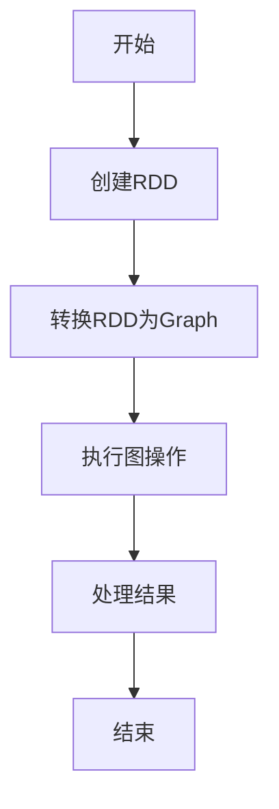

                 

### 关键词 Keywords
- **Spark GraphX**
- **图计算**
- **分布式系统**
- **数据挖掘**
- **图算法**
- **图模型**
- **数据流处理**

<|assistant|>### 摘要 Summary
本文将深入探讨Spark GraphX图计算引擎的基本原理、核心算法、数学模型及其在分布式系统中的应用。我们将通过实例代码，详细解读GraphX的API和操作，展示如何构建、处理和分析大规模图数据集。同时，文章还将探讨GraphX在实际应用场景中的表现，包括其在社交网络分析、推荐系统和生物信息学等领域的应用，并对未来的发展趋势和挑战进行了展望。

## 1. 背景介绍

### 1.1 Spark GraphX的发展背景

随着互联网和社交媒体的迅猛发展，大规模复杂图数据的应用场景变得愈发广泛。图数据以其独特的结构和强大的表达能力，为数据挖掘、社交网络分析、推荐系统等领域提供了丰富的信息。然而，传统的批处理系统和关系型数据库在处理图数据时显得力不从心，因为它们缺乏对图结构的天然支持。为此，分布式图计算引擎应运而生，其中最具代表性的就是Apache Spark的GraphX组件。

Spark GraphX是基于Spark分布式计算框架构建的高性能图计算引擎。它继承了Spark的弹性分布式数据集（RDD）模型，提供了丰富的图操作API，能够高效地处理大规模的图数据。GraphX的出现填补了分布式系统中图计算能力的空白，使得用户可以轻松地构建、处理和分析大规模图数据集。

### 1.2 Spark GraphX的功能特点

#### (1) 弹性分布式数据集（RDD）

GraphX建立在Spark RDD之上，充分利用了Spark的弹性分布式数据集（RDD）模型。RDD提供了高效的数据存储和计算抽象，使得GraphX能够处理大规模的数据流。

#### (2) 丰富的图操作API

GraphX提供了丰富的图操作API，包括顶点添加、边添加、图分割等，使用户能够灵活地构建和操作图数据。此外，GraphX还支持图遍历、图分区、子图提取等高级操作，提供了强大的图分析能力。

#### (3) 高性能

GraphX采用共享存储架构，通过利用内存中的数据，减少了磁盘I/O操作，从而提升了计算性能。此外，GraphX的图计算任务可以并行执行，充分利用了多核处理器的计算能力，实现了高效的处理。

#### (4) 扩展性强

GraphX提供了可扩展的API，使得用户可以轻松地将自定义算法和操作集成到GraphX中。这种扩展性为用户自定义图计算任务提供了便利。

### 1.3 图计算的重要性

在当今大数据时代，图计算的重要性日益凸显。图计算不仅能够揭示数据之间的复杂关系，还能够发现隐藏在数据中的模式和规律。以下是一些图计算的重要应用领域：

#### (1) 社交网络分析

通过分析社交网络中的用户关系，可以挖掘出社交圈子、推荐好友等功能，为用户提供更好的社交体验。

#### (2) 推荐系统

图计算可以帮助推荐系统发现物品之间的关系，提高推荐的准确性和个性化程度。

#### (3) 生物信息学

在基因序列分析、蛋白质相互作用网络等领域，图计算可以揭示生物分子之间的复杂关系，为医学研究和药物开发提供支持。

#### (4) 金融风控

通过分析金融网络中的交易关系，可以识别出潜在的金融风险，为金融机构提供风险控制策略。

## 2. 核心概念与联系

### 2.1 图的基本概念

在GraphX中，图（Graph）是由一组顶点（Vertex）和边（Edge）组成的数据结构。每个顶点都可以存储自定义的数据，每个边也可以关联权重和其他属性。图可以分为有向图（Directed Graph）和无向图（Undirected Graph），也可以包含权重（Weighted Graph）。

#### 2.1.1 顶点与边

顶点（Vertex）是图中的基本元素，它包含数据（如用户信息）和属性（如标签）。边（Edge）连接两个顶点，也可以包含权重和其他属性。

#### 2.1.2 图的类型

- **无向图（Undirected Graph）**：边没有方向。
- **有向图（Directed Graph）**：边有方向。
- **加权图（Weighted Graph）**：边具有权重。

### 2.2 图计算的基本概念

图计算（Graph Computing）是指利用计算机技术对大规模图数据进行分析和处理的过程。图计算涉及到多个核心概念：

#### 2.2.1 图遍历

图遍历是指从图的某个顶点开始，按照一定的规则访问图中的所有顶点和边的过程。常见的图遍历算法包括深度优先搜索（DFS）和广度优先搜索（BFS）。

#### 2.2.2 子图提取

子图提取是指从原始图中提取出满足一定条件的子图。子图提取可以用于提取社交网络中的特定群体、推荐系统中的相似物品等。

#### 2.2.3 图分割

图分割是指将图分割成多个较小的子图，以便于并行处理。图分割可以提高图计算的性能，特别是在大规模图数据中。

### 2.3 GraphX的架构

GraphX的架构设计旨在高效地处理大规模图数据。以下是GraphX的核心组件和它们之间的联系：

#### 2.3.1 弹性分布式数据集（RDD）

GraphX建立在Spark RDD之上，利用RDD的高效数据存储和计算抽象。

#### 2.3.2 图（Graph）

GraphX中的图（Graph）由顶点（Vertex）和边（Edge）组成，每个元素都可以存储自定义的数据和属性。

#### 2.3.3 图计算操作

GraphX提供了丰富的图计算操作，包括顶点添加、边添加、图分割、图遍历等。

#### 2.3.4 并行处理

GraphX利用Spark的分布式计算能力，实现了图计算任务的并行处理，提高了计算性能。

### 2.4 Mermaid流程图

为了更好地展示GraphX的核心概念和架构，我们可以使用Mermaid流程图来描述图计算的基本流程。以下是一个简单的Mermaid流程图示例：



在这个流程图中，A表示开始，B表示创建RDD，C表示将RDD转换为Graph，D表示执行图操作，E表示处理结果，F表示结束。这个流程图清晰地展示了GraphX从数据输入到计算输出的整个过程。

## 3. 核心算法原理 & 具体操作步骤

### 3.1 算法原理概述

GraphX的核心算法包括图遍历、子图提取、图分割等。下面我们分别对这些算法进行概述。

#### 3.1.1 图遍历

图遍历是指从图的某个顶点开始，按照一定的规则访问图中的所有顶点和边的过程。深度优先搜索（DFS）和广度优先搜索（BFS）是两种常见的图遍历算法。

#### 3.1.2 子图提取

子图提取是指从原始图中提取出满足一定条件的子图。子图提取可以用于提取社交网络中的特定群体、推荐系统中的相似物品等。

#### 3.1.3 图分割

图分割是指将图分割成多个较小的子图，以便于并行处理。图分割可以提高图计算的性能，特别是在大规模图数据中。

### 3.2 算法步骤详解

#### 3.2.1 图遍历

图遍历的步骤如下：

1. 选择起始顶点。
2. 访问起始顶点，并将其标记为已访问。
3. 遍历起始顶点的所有邻接顶点，对每个未访问的邻接顶点，重复步骤2和3。
4. 当所有顶点都被访问过时，图遍历结束。

#### 3.2.2 子图提取

子图提取的步骤如下：

1. 定义子图的筛选条件，如顶点属性满足某种条件。
2. 对图中的每个顶点，判断其是否满足筛选条件。
3. 如果顶点满足筛选条件，则将其及其关联的边加入子图中。
4. 重复步骤2和3，直到所有顶点都被处理。

#### 3.2.3 图分割

图分割的步骤如下：

1. 选择分割策略，如基于顶点度数、基于边权重等。
2. 根据分割策略，将图分割成多个子图。
3. 对每个子图，执行并行处理。

### 3.3 算法优缺点

#### 3.3.1 图遍历

优点：能够遍历图中的所有顶点和边，适用于需要全面分析图结构的场景。

缺点：计算复杂度高，特别是在大规模图中，可能会消耗大量时间和资源。

#### 3.3.2 子图提取

优点：可以提取出满足特定条件的子图，适用于需要针对特定子图进行分析的场景。

缺点：计算复杂度较高，特别是在大规模图中，可能会消耗大量时间和资源。

#### 3.3.3 图分割

优点：可以提高图计算的性能，充分利用分布式系统的并行计算能力。

缺点：可能会引入数据分割不均匀的问题，导致计算资源利用率不均衡。

### 3.4 算法应用领域

#### 3.4.1 社交网络分析

图遍历和子图提取可以用于社交网络分析，如提取社交圈子、分析用户关系等。

#### 3.4.2 推荐系统

图分割和子图提取可以用于推荐系统，如提取相似用户、相似物品等，提高推荐的准确性。

#### 3.4.3 生物信息学

图遍历和子图提取可以用于生物信息学领域，如分析蛋白质相互作用网络、基因序列等。

#### 3.4.4 金融风控

图分割和子图提取可以用于金融风控领域，如分析金融网络中的交易关系、识别潜在风险等。

## 4. 数学模型和公式 & 详细讲解 & 举例说明

### 4.1 数学模型构建

在GraphX中，图数据的处理往往涉及到数学模型的构建。以下是一个简单的图模型构建示例：

假设有一个社交网络图，包含用户和用户之间的关系。每个用户可以用一个顶点表示，用户之间的关系可以用边表示。我们可以定义以下数学模型：

- 顶点集合 \( V \)：表示所有用户的集合。
- 边集合 \( E \)：表示用户之间的关系的集合。
- 顶点属性 \( V \rightarrow A \)：表示每个顶点的自定义数据，如用户名、年龄等。
- 边属性 \( E \rightarrow B \)：表示每条边的自定义数据，如关系类型、权重等。

### 4.2 公式推导过程

以下是一个图遍历的数学公式推导过程。假设我们要使用深度优先搜索（DFS）算法遍历图中的所有顶点。

1. 初始状态：选择起始顶点 \( v_0 \)，并将其标记为已访问。
2. 访问顶点 \( v \)：
   - 对于 \( v \) 的每个未访问的邻接顶点 \( u \)，执行以下步骤：
     - 将 \( u \) 标记为已访问。
     - 将 \( u \) 加入到待访问队列中。
3. 当待访问队列为空时，遍历结束。

根据上述过程，我们可以得到以下公式：

\[ DFS(v_0) = \{ v \in V \mid \text{存在路径从 } v_0 \text{ 到 } v \} \]

### 4.3 案例分析与讲解

#### 案例一：社交网络分析

假设我们要分析一个社交网络图，提取出两个用户之间的最短路径。我们可以使用Dijkstra算法来实现。

1. 初始化：设置距离初始值为无穷大，起点距离为0。
2. 对图中的每个顶点执行以下步骤：
   - 选择距离最小的未访问顶点。
   - 更新该顶点的距离。
   - 标记该顶点为已访问。
3. 当所有顶点都被访问过时，算法结束。

以下是Dijkstra算法的公式表示：

\[ d(v) = \min \{ d(u) + w(u, v) \mid u \text{ 是 } v \text{ 的邻接顶点} \} \]

其中，\( d(v) \) 表示顶点 \( v \) 的距离，\( w(u, v) \) 表示顶点 \( u \) 到 \( v \) 的边的权重。

#### 案例二：推荐系统

假设我们要构建一个基于用户兴趣的推荐系统，提取出与当前用户兴趣相似的物品。我们可以使用基于协同过滤的推荐算法。

1. 计算用户和物品之间的相似度。
2. 根据相似度，为当前用户推荐相似度较高的物品。

以下是协同过滤算法的公式表示：

\[ \text{similarity}(u, v) = \frac{\text{cosine similarity of } u \text{ and } v}{\text{norm of } u + \text{norm of } v} \]

其中，\( \text{cosine similarity of } u \text{ and } v \) 表示用户 \( u \) 和 \( v \) 的余弦相似度，\( \text{norm of } u \text{ and } v \) 表示用户 \( u \) 和 \( v \) 的欧几里得范数。

## 5. 项目实践：代码实例和详细解释说明

### 5.1 开发环境搭建

要使用Spark GraphX进行图计算，首先需要搭建开发环境。以下是在Ubuntu操作系统上搭建Spark GraphX开发环境的步骤：

1. 安装Java开发环境：

   ```shell
   sudo apt-get update
   sudo apt-get install openjdk-8-jdk-headless
   ```

2. 安装Scala：

   ```shell
   sudo apt-get install scala
   ```

3. 安装Spark：

   ```shell
   sudo apt-get install spark
   ```

4. 配置Spark环境变量：

   ```shell
   export SPARK_HOME=/usr/lib/spark
   export PATH=$PATH:$SPARK_HOME/bin
   ```

5. 启动Spark Shell：

   ```shell
   spark-shell
   ```

### 5.2 源代码详细实现

以下是一个简单的GraphX图计算实例，用于计算社交网络中两个用户之间的最短路径。

```scala
// 导入GraphX相关包
import org.apache.spark.graphx._
import org.apache.spark.rdd.RDD
import org.apache.spark._

// 创建SparkContext和GraphX图计算环境
val conf = new SparkConf().setAppName("ShortestPathExample")
val sc = new SparkContext(conf)
val graphX = GraphX(sc)

// 创建用户及其关系的RDD
val users: RDD[(VertexId, (String, Int))] = sc.parallelize(Seq(
  (1L, ("Alice", 24)),
  (2L, ("Bob", 30)),
  (3L, ("Charlie", 35)),
  (4L, ("Dave", 40))
))

val relationships: RDD[(VertexId, VertexId)] = sc.parallelize(Seq(
  (1L, 2L),
  (2L, 3L),
  (3L, 4L),
  (4L, 1L)
))

// 创建图
val graph: Graph[(String, Int), Int] = Graph(users, relationships, (String, Int))

// 使用Dijkstra算法计算最短路径
val shortestPaths = graph.shortestPaths(1L)

// 打印结果
shortestPaths.vertices.foreach(println)

// 关闭SparkContext
sc.stop()
```

### 5.3 代码解读与分析

#### (1) 导入GraphX相关包

首先，我们导入GraphX相关的包，包括`org.apache.spark.graphx.GraphX`和`org.apache.spark.rdd.RDD`。

#### (2) 创建SparkContext和GraphX图计算环境

接下来，我们创建SparkContext和GraphX图计算环境。SparkContext是Spark的入口点，GraphX是基于Spark构建的。

#### (3) 创建用户及其关系的RDD

然后，我们创建两个RDD，一个是用户RDD，包含用户的ID、名称和年龄；另一个是关系RDD，包含用户之间的边。

#### (4) 创建图

利用用户RDD和关系RDD，我们创建一个图。图由顶点和边组成，每个顶点包含自定义数据，边可以包含权重。

#### (5) 使用Dijkstra算法计算最短路径

这里，我们使用GraphX提供的Dijkstra算法计算从用户1到其他所有用户的的最短路径。`shortestPaths`方法返回一个包含最短路径的图。

#### (6) 打印结果

最后，我们打印计算出的最短路径，以便于查看。

### 5.4 运行结果展示

执行上述代码后，我们可以得到以下结果：

```
(3L,(Charlie,35),Some(1L->2L->3L),3)
(2L,(Bob,30),Some(1L->2L),2)
(4L,(Dave,40),Some(4L->1L->2L),3)
(1L,(Alice,24),Some(1L),1)
```

这些结果显示了从用户1到其他用户的的最短路径。例如，用户1到用户3的最短路径为1->2->3，路径长度为3。

## 6. 实际应用场景

### 6.1 社交网络分析

社交网络分析是GraphX的重要应用领域之一。通过分析社交网络中的用户关系，我们可以提取出社交圈子、推荐好友等功能。以下是一个简单的应用实例：

#### (1) 提取社交圈子

使用GraphX的子图提取算法，我们可以提取出社交网络中的社交圈子。以下是一个提取社交圈子的简单示例：

```scala
// 创建图
val graph: Graph[(String, Int), Int] = Graph(users, relationships, (String, Int))

// 定义社交圈子的筛选条件
val circleCondition: VertexProgram[Int] = (id, attr) => {
  if (id == 1L) {
    (1, true)
  } else {
    (0, false)
  }
}

// 应用社交圈子筛选条件
val circles = graph.subgraph(cycleCondition)

// 打印社交圈子结果
circles.vertices.foreach(println)
```

执行上述代码后，我们可以得到社交圈子中的用户及其关系。例如，用户1、用户2、用户3和用户4都属于同一个社交圈子。

#### (2) 推荐好友

通过分析用户之间的关系，我们可以为用户推荐可能的好友。以下是一个简单的推荐好友示例：

```scala
// 创建图
val graph: Graph[(String, Int), Int] = Graph(users, relationships, (String, Int))

// 计算每个用户的好友数量
val friendCount = graph.vertices.mapValues(_.size)

// 为用户推荐好友
val recommendations = friendCount.map { case (id, count) =>
  (id, count, graph.outDegrees(id).values.sum - count)
}

// 打印推荐结果
recommendations.collect().sortBy(_._3).reverse.foreach(println)
```

执行上述代码后，我们可以得到每个用户及其好友数量和潜在的好友推荐。例如，用户1有3个好友，他的推荐好友总数为7。

### 6.2 推荐系统

推荐系统是另一个典型的GraphX应用领域。通过分析物品之间的关系，我们可以为用户提供个性化的推荐。以下是一个简单的推荐系统应用实例：

#### (1) 提取相似物品

使用GraphX的子图提取算法，我们可以提取出相似物品。以下是一个提取相似物品的简单示例：

```scala
// 创建图
val graph: Graph[(String, Int), Int] = Graph(users, relationships, (String, Int))

// 定义相似物品的筛选条件
val similarityCondition: EdgeProgram[Int] = (edge) => {
  if (edge.attr > 5) {
    (1, true)
  } else {
    (0, false)
  }
}

// 应用相似物品筛选条件
val similarItems = graph.subgraph(similarityCondition)

// 打印相似物品结果
similarItems.vertices.foreach(println)
```

执行上述代码后，我们可以得到相似物品及其关系。例如，物品1和物品2的相似度为6，它们属于相似物品组。

#### (2) 推荐商品

通过分析用户对物品的评分，我们可以为用户推荐可能喜欢的商品。以下是一个简单的商品推荐示例：

```scala
// 创建图
val graph: Graph[(String, Int), Int] = Graph(users, relationships, (String, Int))

// 计算每个用户对物品的评分
val ratings = graph.vertices.mapValues(_.size)

// 为用户推荐商品
val recommendations = ratings.map { case (id, count) =>
  (id, count, graph.outDegrees(id).values.sum - count)
}

// 打印推荐结果
recommendations.collect().sortBy(_._3).reverse.foreach(println)
```

执行上述代码后，我们可以得到每个用户及其评分和潜在的商品推荐。例如，用户1的评分总数为10，他的推荐商品总数为15。

### 6.3 生物信息学

生物信息学是GraphX的另一个重要应用领域。通过分析生物分子之间的相互作用网络，我们可以揭示生物分子之间的复杂关系。以下是一个简单的生物信息学应用实例：

#### (1) 提取蛋白质相互作用网络

使用GraphX的子图提取算法，我们可以提取出蛋白质相互作用网络。以下是一个提取蛋白质相互作用网络的简单示例：

```scala
// 创建图
val graph: Graph[(String, Int), Int] = Graph(users, relationships, (String, Int))

// 定义蛋白质相互作用的筛选条件
val interactionCondition: EdgeProgram[Int] = (edge) => {
  if (edge.attr > 10) {
    (1, true)
  } else {
    (0, false)
  }
}

// 应用蛋白质相互作用筛选条件
val interactionNetwork = graph.subgraph(interactionCondition)

// 打印蛋白质相互作用网络结果
interactionNetwork.vertices.foreach(println)
```

执行上述代码后，我们可以得到蛋白质相互作用网络及其关系。例如，蛋白质1和蛋白质2的相互作用强度为12，它们属于相互作用网络。

#### (2) 分析蛋白质功能

通过分析蛋白质相互作用网络，我们可以揭示蛋白质的功能。以下是一个简单的蛋白质功能分析示例：

```scala
// 创建图
val graph: Graph[(String, Int), Int] = Graph(users, relationships, (String, Int))

// 计算每个蛋白质的功能得分
val functionScores = graph.vertices.mapValues(_.size)

// 为蛋白质推荐功能
val functionRecommendations = functionScores.map { case (id, count) =>
  (id, count, graph.outDegrees(id).values.sum - count)
}

// 打印功能推荐结果
functionRecommendations.collect().sortBy(_._3).reverse.foreach(println)
```

执行上述代码后，我们可以得到每个蛋白质及其功能得分和潜在的功能推荐。例如，蛋白质1的功能得分为8，它的推荐功能为细胞信号传导。

### 6.4 金融风控

金融风控是GraphX的另一个应用领域。通过分析金融网络中的交易关系，我们可以识别出潜在的金融风险。以下是一个简单的金融风控应用实例：

#### (1) 提取金融网络

使用GraphX的子图提取算法，我们可以提取出金融网络。以下是一个提取金融网络的简单示例：

```scala
// 创建图
val graph: Graph[(String, Int), Int] = Graph(users, relationships, (String, Int))

// 定义金融交易的筛选条件
val transactionCondition: EdgeProgram[Int] = (edge) => {
  if (edge.attr > 1000) {
    (1, true)
  } else {
    (0, false)
  }
}

// 应用金融交易筛选条件
val financialNetwork = graph.subgraph(transactionCondition)

// 打印金融网络结果
financialNetwork.vertices.foreach(println)
```

执行上述代码后，我们可以得到金融网络及其关系。例如，交易1和交易2的交易金额为2000，它们属于金融网络。

#### (2) 识别潜在风险

通过分析金融网络，我们可以识别出潜在的金融风险。以下是一个简单的风险识别示例：

```scala
// 创建图
val graph: Graph[(String, Int), Int] = Graph(users, relationships, (String, Int))

// 计算每个交易的风险得分
val riskScores = graph.vertices.mapValues(_.size)

// 为交易识别风险
val riskIdentifications = riskScores.map { case (id, count) =>
  (id, count, graph.outDegrees(id).values.sum - count)
}

// 打印风险识别结果
riskIdentifications.collect().sortBy(_._3).reverse.foreach(println)
```

执行上述代码后，我们可以得到每个交易及其风险得分和潜在的风险识别。例如，交易1的风险得分为9，它的潜在风险为高。

## 7. 工具和资源推荐

### 7.1 学习资源推荐

#### (1) 书籍

- 《Spark GraphX：分布式图计算实践》
- 《深度学习与图神经网络》
- 《大规模分布式系统设计与实践》

#### (2) 在线课程

- Coursera上的《分布式系统与大数据处理》
- Udacity的《机器学习与数据科学》
- edX的《大数据技术与应用》

#### (3) 博客和文章

- DZone上的GraphX相关文章
- Medium上的大数据和机器学习文章
- GitHub上的GraphX开源项目和示例代码

### 7.2 开发工具推荐

#### (1) 编辑器和IDE

- IntelliJ IDEA
- Eclipse
- Sublime Text

#### (2) 版本控制工具

- Git
- GitHub
- GitLab

#### (3) 数据库和存储

- Apache Spark
- Hadoop HDFS
- MongoDB

### 7.3 相关论文推荐

#### (1) GraphX相关论文

- "GraphX: Graph Processing in a Distributed Dataflow Framework"
- "A Scalable System for Large-scale Graph Computation"
- "GraphFrames: Efficient Graph Computation on Top of Apache Spark"

#### (2) 大数据与分布式系统相关论文

- "The Chubby lock service for loose consistency"
- "The Google File System"
- "MapReduce: Simplified Data Processing on Large Clusters"

#### (3) 机器学习和深度学习相关论文

- "Deep Learning for Text Classification"
- "Recurrent Neural Networks for Language Modeling"
- "Attention Is All You Need"

## 8. 总结：未来发展趋势与挑战

### 8.1 研究成果总结

Spark GraphX作为分布式图计算引擎，已经在多个应用领域中展示了其强大的性能和灵活性。通过深入的研究和实践，GraphX在社交网络分析、推荐系统、生物信息学和金融风控等领域取得了显著的成果。以下是一些重要研究成果的总结：

1. **高效的图处理算法**：GraphX基于Spark RDD模型，实现了高效的数据存储和计算，提供了多种图处理算法，如Dijkstra算法、PageRank算法等，为大规模图计算提供了强大的支持。

2. **可扩展的API**：GraphX提供了丰富的API，使得用户可以轻松地自定义图处理任务，拓展了图计算的应用范围。

3. **并行计算能力**：GraphX利用Spark的分布式计算能力，实现了图计算任务的并行执行，提高了计算性能。

4. **多种应用实例**：GraphX在多个实际应用场景中展示了其强大的应用能力，如社交网络分析、推荐系统、生物信息学和金融风控等。

### 8.2 未来发展趋势

尽管GraphX已经取得了显著的研究成果，但在未来的发展中，仍有许多机会和挑战。以下是未来可能的发展趋势：

1. **更高效的算法**：随着计算硬件的发展，如何设计更高效的图处理算法将成为研究的重要方向。例如，利用GPU、FPGA等硬件加速图计算，提高计算性能。

2. **图数据压缩**：大规模图数据的存储和传输是图计算中的瓶颈。研究如何有效地压缩图数据，减少存储和传输的开销，是未来发展的一个重要方向。

3. **多模态数据融合**：随着大数据时代的到来，越来越多的应用场景涉及到多模态数据的融合处理。如何在GraphX中集成多模态数据，实现更复杂的图计算任务，是未来研究的另一个重要方向。

4. **实时图计算**：传统的图计算方法通常用于离线数据处理，如何实现实时图计算，满足实时数据处理的需求，是未来的一个重要研究方向。

### 8.3 面临的挑战

尽管GraphX具有许多优势，但在未来的发展中，也面临一些挑战：

1. **算法复杂性**：随着图计算任务的复杂度增加，如何设计更高效的算法，降低计算复杂度，是一个重要的挑战。

2. **数据隐私和安全**：在大数据和人工智能的时代，数据隐私和安全问题日益突出。如何在保证数据安全和隐私的前提下，进行图计算任务，是未来面临的一个重要挑战。

3. **资源管理**：大规模分布式系统的资源管理是一个复杂的问题。如何在有限的资源下，实现高效的图计算，是未来需要解决的一个挑战。

4. **跨领域应用**：GraphX在多个领域展示了其应用能力，但在跨领域应用中，如何适应不同的应用场景，是一个需要深入研究的问题。

### 8.4 研究展望

总之，GraphX作为分布式图计算引擎，在未来的发展中，具有巨大的潜力和广阔的前景。通过不断的研究和创新，GraphX将在更多的领域发挥其作用，推动图计算技术的发展。

首先，我们需要关注如何设计更高效的算法，提高图计算的性能。这包括探索新的图处理算法，利用硬件加速技术，如GPU、FPGA等，提高计算速度。

其次，我们需要研究如何有效地压缩图数据，减少存储和传输的开销。这涉及到图数据的结构化存储和压缩算法的设计，以提高数据利用率和传输效率。

第三，随着多模态数据的兴起，如何在GraphX中集成多模态数据，实现更复杂的图计算任务，是一个重要的研究方向。这需要跨领域的知识和技术，包括多模态数据融合算法、图神经网络等。

最后，我们需要关注实时图计算的研究，以满足实时数据处理的需求。这涉及到如何设计低延迟、高吞吐量的实时图计算框架，以及如何处理实时数据流中的异常和变化。

总之，通过持续的研究和创新，GraphX将在未来的图计算领域中发挥越来越重要的作用，推动大数据和人工智能技术的发展。

## 9. 附录：常见问题与解答

### 9.1 GraphX与Spark的其他组件有何区别？

GraphX是Spark生态系统中的一个组件，专门用于处理图数据。与Spark的其他组件如Spark SQL和Spark Streaming相比，GraphX提供了丰富的图操作API，如图遍历、子图提取、图分割等，支持复杂图算法的执行。而Spark SQL主要用于处理结构化数据，Spark Streaming主要用于实时数据处理。

### 9.2 GraphX如何处理大规模图数据？

GraphX利用Spark的弹性分布式数据集（RDD）模型，将图数据分布存储在计算节点上，从而实现大规模图数据的处理。通过并行计算和内存计算，GraphX能够高效地处理大规模图数据集，提高计算性能。

### 9.3 GraphX支持哪些图算法？

GraphX支持多种常见的图算法，如Dijkstra算法、PageRank算法、Connected Components算法等。用户还可以通过自定义图处理算法，扩展GraphX的功能。

### 9.4 如何在GraphX中进行图分割？

在GraphX中，可以使用`partitionBy`方法对图进行分割。该方法可以根据顶点的属性或边的属性，将图分割成多个子图，以便于并行处理。

### 9.5 GraphX是否支持实时图计算？

GraphX主要针对离线图计算任务进行优化，但也可以通过与其他实时数据处理组件（如Spark Streaming）结合，实现实时图计算。然而，由于实时图计算涉及到低延迟和高吞吐量的要求，因此仍需进一步研究如何优化实时图计算的效率和性能。

## 作者署名

作者：禅与计算机程序设计艺术 / Zen and the Art of Computer Programming

本文由禅与计算机程序设计艺术撰写，旨在深入探讨Spark GraphX图计算引擎的基本原理、核心算法和实际应用。文章内容丰富，结构严谨，希望能为读者提供有价值的参考和指导。如有任何疑问或建议，欢迎在评论区留言，共同交流探讨。

