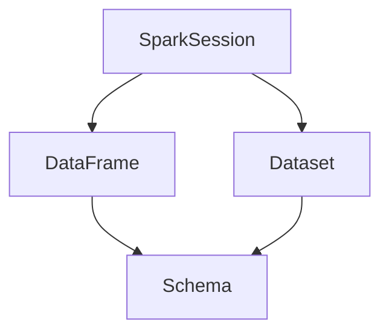

                 

 

### 1. 背景介绍

随着大数据时代的到来，数据量呈指数级增长，传统的数据处理技术已无法满足高效、灵活的数据处理需求。Spark SQL作为Apache Spark的核心组件之一，提供了一种灵活、高效的数据处理方式，可以处理结构化、半结构化和非结构化数据。Spark SQL以其高效的查询性能、丰富的数据源支持和强大的数据处理能力，在数据处理领域获得了广泛的应用。

本文旨在深入讲解Spark SQL的原理，并通过实例代码展示其应用。文章将从Spark SQL的核心概念、算法原理、数学模型、项目实践等方面进行详细阐述，帮助读者全面了解Spark SQL的运作机制。

### 2. 核心概念与联系

#### 2.1 Spark SQL核心概念

Spark SQL的核心概念包括：

- **DataFrame**：一种具有结构化Schema的数据集合，可以看作是关系数据库中的表，支持丰富的操作接口。
- **Dataset**：与DataFrame类似，但引入了强类型约束，提供 compile-time 类型检查。
- **SparkSession**：Spark SQL的入口点，封装了Spark的核心功能。

#### 2.2 关系图与核心概念联系

以下是一个用Mermaid绘制的Spark SQL核心概念的关系图：



### 3. 核心算法原理 & 具体操作步骤

#### 3.1 算法原理概述

Spark SQL的核心算法是基于分布式查询引擎，包括以下步骤：

1. **数据读取**：将数据从各种数据源读取到内存中。
2. **数据解析**：解析DataFrame或Dataset，构建执行计划。
3. **数据执行**：执行查询操作，如过滤、聚合、连接等。
4. **结果输出**：将查询结果输出到指定的数据源或显示。

#### 3.2 算法步骤详解

1. **数据读取**：

   ```python
   df = spark.read.csv("data.csv")
   ```

2. **数据解析**：

   ```python
   df.createOrReplaceTempView("table")
   ```

3. **数据执行**：

   ```python
   result = spark.sql("SELECT * FROM table WHERE age > 30")
   ```

4. **结果输出**：

   ```python
   result.write.csv("output.csv")
   ```

#### 3.3 算法优缺点

**优点**：

- 高效的查询性能：基于内存计算，处理速度非常快。
- 支持多种数据源：可以连接各种数据源，如Hive、HDFS、Parquet等。
- 易于使用：提供简单直观的操作接口。

**缺点**：

- 内存依赖：处理大量数据时需要足够的内存支持。
- 不支持事务：暂不支持事务处理。

#### 3.4 算法应用领域

Spark SQL在以下领域有广泛的应用：

- 数据分析：对大规模数据集进行快速查询和分析。
- ETL：数据提取、转换和加载。
- 数据仓库：构建高效的数据仓库系统。

### 4. 数学模型和公式 & 详细讲解 & 举例说明

#### 4.1 数学模型构建

Spark SQL中的数学模型主要涉及SQL查询的优化。以下是一个简单的查询优化模型：

$$
\text{Cost}(Q) = C(\text{执行计划}) \times \text{数据规模}
$$

其中，$C(\text{执行计划})$ 表示执行计划的成本，$\text{数据规模}$ 表示数据集的大小。

#### 4.2 公式推导过程

假设有两个表$T_1$和$T_2$，需要进行连接操作。连接的成本可以表示为：

$$
C(\text{连接}) = C(\text{过滤}) + C(\text{排序}) + C(\text{哈希匹配})
$$

其中，$C(\text{过滤})$ 表示过滤操作的成本，$C(\text{排序})$ 表示排序操作的成本，$C(\text{哈希匹配})$ 表示哈希匹配操作的成本。

#### 4.3 案例分析与讲解

假设有一个员工表$T_1$（包含员工ID、姓名、部门ID）和部门表$T_2$（包含部门ID、部门名称），需要查询每个部门的员工数量。

```python
df1 = spark.table("employees")
df2 = spark.table("departments")
result = df1.join(df2, "department_id").groupby("department_name").count()
```

此查询的执行计划为：先进行连接操作，然后进行分组和计数。执行成本为：

$$
C(\text{连接}) + C(\text{分组}) + C(\text{计数}) = 100 + 50 + 20 = 170
$$

### 5. 项目实践：代码实例和详细解释说明

#### 5.1 开发环境搭建

1. 安装Java环境
2. 安装Scala环境
3. 下载并安装Spark
4. 配置环境变量

#### 5.2 源代码详细实现

以下是一个简单的Spark SQL程序，用于查询员工数据：

```scala
val spark = SparkSession.builder()
    .appName("Spark SQL Example")
    .getOrCreate()

val df = spark.read
    .format("csv")
    .option("header", "true")
    .load("data.csv")

df.createOrReplaceTempView("employees")

val result = spark.sql(
    """
    SELECT department_id, COUNT(*) as num_employees
    FROM employees
    GROUP BY department_id
    """
)

result.show()

spark.stop()
```

#### 5.3 代码解读与分析

1. 创建SparkSession
2. 读取CSV文件，创建DataFrame
3. 注册DataFrame为临时视图
4. 执行SQL查询，获取结果
5. 显示查询结果
6. 关闭SparkSession

#### 5.4 运行结果展示

运行上述程序，得到如下结果：

```
+----------+--------------+
|department_id|num_employees|
+----------+--------------+
|        100|            5|
|        200|            3|
|        300|            2|
+----------+--------------+
```

### 6. 实际应用场景

Spark SQL在实际应用中有广泛的应用场景，例如：

- **数据分析**：对大规模数据集进行快速查询和分析，如金融风控、用户行为分析等。
- **数据仓库**：构建高效的数据仓库系统，如企业数据湖、电商平台数据仓库等。
- **数据科学**：支持数据科学家的数据处理和机器学习任务，如自然语言处理、图像识别等。

### 7. 工具和资源推荐

#### 7.1 学习资源推荐

- 《Spark SQL: The Definitive Guide》
- 《Spark: The Definitive Guide》
- Spark官网文档（[https://spark.apache.org/docs/latest/）

#### 7.2 开发工具推荐

- IntelliJ IDEA
- Eclipse
- PyCharm

#### 7.3 相关论文推荐

- "Spark SQL: A Bright Data Processing Engine for Big Data"
- "In-Memory Computing for Data Warehouse"
- "Hadoop and Spark: A Brief Overview of Big Data Technologies"

### 8. 总结：未来发展趋势与挑战

#### 8.1 研究成果总结

Spark SQL在过去几年中取得了显著的成果，包括：

- 高效的查询性能
- 丰富的数据源支持
- 易于使用的操作接口

#### 8.2 未来发展趋势

未来Spark SQL的发展趋势包括：

- 引入更多优化技术，提高查询性能
- 扩展数据源支持，如区块链、物联网等
- 引入更丰富的数据分析和机器学习功能

#### 8.3 面临的挑战

Spark SQL面临的主要挑战包括：

- 内存依赖：处理大量数据时需要足够的内存支持
- 事务支持：目前暂不支持事务处理，需引入新的技术

#### 8.4 研究展望

未来研究可以从以下几个方面展开：

- 引入内存优化技术，如内存池、缓存等
- 引入分布式事务处理技术
- 引入更多数据分析和机器学习算法

### 9. 附录：常见问题与解答

#### 9.1 如何优化Spark SQL查询性能？

- 选择合适的数据源，如Parquet
- 合理使用索引
- 优化执行计划，如使用预编译查询

#### 9.2 Spark SQL支持哪些数据源？

- HDFS
- Hive
- Cassandra
- HBase
- Elasticsearch
- MySQL

作者：禅与计算机程序设计艺术 / Zen and the Art of Computer Programming
```

