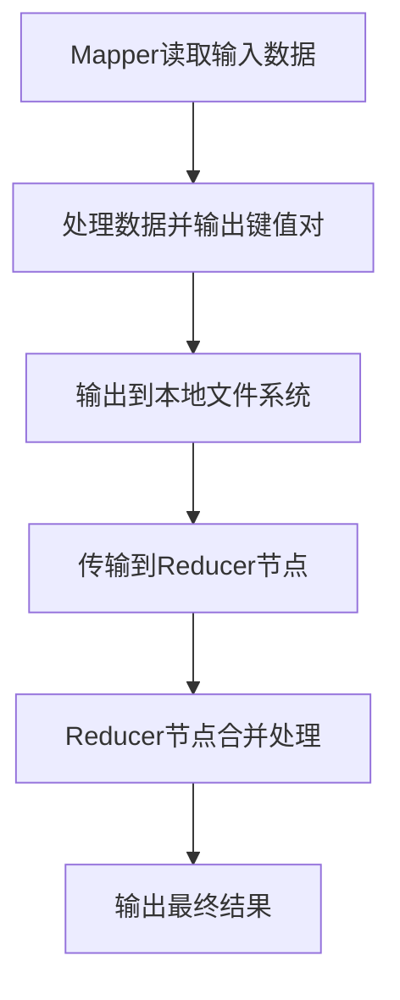

                 

 
## 1. 背景介绍

Shuffle是大数据处理过程中至关重要的一环，特别是在分布式计算框架中，如Apache Spark。Shuffle操作主要用于将数据重新分配到不同的分区中，以便在后续的map或者reduce阶段进行计算。随着大数据处理的日益重要，Shuffle的性能对整个计算任务的影响愈发显著。

Spark Shuffle的原理和实现方式相对复杂，理解其工作流程对优化大数据处理性能具有重要意义。本篇文章旨在详细讲解Spark Shuffle的原理，并通过代码实例展示其实际应用。

文章的结构如下：

- **背景介绍**：介绍Shuffle在分布式计算中的重要性。
- **核心概念与联系**：阐述Shuffle涉及的核心概念及其相互关系。
- **核心算法原理 & 具体操作步骤**：分析Shuffle算法的原理和操作步骤。
- **数学模型和公式 & 详细讲解 & 举例说明**：讨论Shuffle相关的数学模型和公式。
- **项目实践：代码实例和详细解释说明**：通过代码实例展示Shuffle的实现。
- **实际应用场景**：分析Shuffle在不同应用场景中的使用。
- **未来应用展望**：探讨Shuffle的未来发展方向。
- **工具和资源推荐**：推荐学习资源和开发工具。
- **总结：未来发展趋势与挑战**：总结研究成果，展望未来。

接下来，我们将深入探讨Shuffle的各个核心概念，并通过具体的算法原理和代码实例，帮助读者更好地理解Spark Shuffle。

> **关键词**：Spark Shuffle，分布式计算，数据处理，重分区，性能优化

> **摘要**：本文系统地讲解了Spark Shuffle的原理和实现，从核心概念到实际代码实例，帮助读者全面了解Shuffle的工作机制，以及如何在项目中有效应用和优化。

## 2. 核心概念与联系

### 2.1 Shuffle概述

Shuffle是分布式计算中的一个关键步骤，它涉及将数据从源分区重新分配到目标分区。在Spark中，Shuffle操作主要发生在map阶段和reduce阶段，其目的是确保每个reduce任务能够接收到来自不同map任务的相关数据。

### 2.2 数据分区

数据分区是指将大规模数据划分为多个较小的数据块，以便在分布式计算环境中并行处理。Spark使用一种称为`Hash Partitioner`的策略来对数据进行分区，每个分区处理一部分数据。

### 2.3 Mapper和Reducer

- **Mapper**：Mapper任务负责读取输入数据集，对其进行处理，并输出中间键值对。每个Mapper任务处理一部分输入数据。
- **Reducer**：Reducer任务负责接收来自多个Mapper的中间键值对，对相同键的值进行聚合操作，并输出最终结果。

### 2.4 Shuffle过程

Shuffle过程主要分为以下几个步骤：

1. **Map端输出**：Mapper将处理后的中间键值对输出到本地文件系统，并附上分区信息。
2. **传输数据**：Spark的内部调度器会将这些中间文件传输到相应的Reducer节点上。
3. **Reduce端合并**：Reducer节点将接收到的中间文件进行合并处理，并生成最终的输出结果。

### 2.5 Mermaid 流程图

为了更好地理解Shuffle的概念和过程，我们可以使用Mermaid流程图来展示其各个步骤：



在上面的流程图中，`A` 表示 Mapper 读取输入数据，`B` 表示处理数据并输出键值对，`C` 表示输出到本地文件系统，`D` 表示传输到Reducer节点，`E` 表示Reducer节点合并处理，`F` 表示输出最终结果。

通过以上核心概念的介绍和流程图的展示，我们可以对Shuffle有一个初步的了解。接下来，我们将深入探讨Shuffle算法的原理和实现。

## 3. 核心算法原理 & 具体操作步骤

### 3.1 算法原理概述

Spark Shuffle的算法原理可以概括为以下几个关键点：

1. **分区分配**：根据数据键（key）的哈希值，将数据分配到不同的分区。
2. **中间文件存储**：Mapper任务的输出结果以中间文件的形式存储在本地文件系统中。
3. **数据传输**：Spark内部调度器将中间文件按照分区信息传输到对应的Reducer节点上。
4. **合并处理**：Reducer节点接收并合并来自不同Mapper的中间文件，完成数据聚合。

### 3.2 算法步骤详解

#### 3.2.1 Mapper端处理

1. **读取输入数据**：Mapper从输入数据集中读取数据，并进行处理。
2. **键值对输出**：处理后的数据以键值对的形式输出。
3. **分区信息记录**：每个键值对输出时，记录其目标分区信息。

#### 3.2.2 Shuffle过程

1. **数据写入本地文件**：Mapper将输出结果以文件形式写入本地文件系统，文件命名包含分区信息。
2. **内部调度**：Spark调度器根据分区信息，将文件传输到对应的Reducer节点。
3. **文件传输**：通过网络传输，将文件从Mapper节点移动到Reducer节点。

#### 3.2.3 Reducer端合并

1. **接收中间文件**：Reducer节点接收到所有与该分区相关的中间文件。
2. **文件合并处理**：Reducer将中间文件中的数据合并，完成数据的最终处理和输出。

### 3.3 算法优缺点

#### 优点：

- **高效的数据分区**：通过哈希分区，数据在Reduce阶段能够高效地被聚合。
- **并行处理**：每个Mapper和Reducer可以独立处理数据，提高了并行处理能力。

#### 缺点：

- **网络开销**：Shuffle过程中需要大量数据在网络中传输，可能带来较高的网络开销。
- **磁盘空间消耗**：Mapper输出的大量中间文件占用本地磁盘空间，尤其是在数据量较大时。

### 3.4 算法应用领域

Spark Shuffle算法广泛应用于需要数据重分区的场景，如：

- **单词计数**：通过Shuffle操作，可以将同一个单词的所有计数结果聚合在一起。
- **推荐系统**：在处理用户行为数据时，可以使用Shuffle操作将相同用户的数据聚集在一起。

### 3.5 示例

假设我们有一个单词计数任务，输入数据为一系列的文本文件。以下是Shuffle操作的具体步骤：

1. **Mapper端**：读取每个文本文件，将文本拆分为单词，并输出单词作为键，1作为值。
2. **Shuffle过程**：Spark根据单词的哈希值，将中间文件传输到相应的Reducer节点。
3. **Reducer端**：接收来自不同Mapper的中间文件，对相同单词的值进行累加，输出单词和总计数。

通过以上步骤，我们完成了单词计数的Shuffle操作。

在接下来的章节中，我们将进一步探讨Shuffle相关的数学模型和公式，并使用具体的代码实例进行详细说明。

## 4. 数学模型和公式 & 详细讲解 & 举例说明

Shuffle算法的实现不仅依赖于其逻辑流程，还涉及到一系列数学模型和公式的应用。下面我们将详细讨论与Shuffle相关的数学模型和公式，并通过实例来说明其应用。

### 4.1 数学模型构建

在Shuffle过程中，核心的数学模型包括：

1. **哈希函数**：用于将数据键（key）映射到分区编号。
2. **数据聚合**：用于在Reducer端将相同键的值进行累加。

#### 哈希函数

哈希函数是一个将输入数据映射到固定大小的值域的函数。在Spark中，常用的哈希函数是MD5哈希。其基本形式为：

\[ H(key) = \text{MD5}(key) \mod num_partitions \]

其中，`key`为数据键，`num_partitions`为分区数。通过这个哈希函数，我们可以将每个数据键映射到对应的分区编号。

#### 数据聚合

在Reducer端，需要对相同键的值进行聚合。常见的聚合操作包括求和、求平均数、求最大值等。以下是一个简单的聚合公式：

\[ \text{sum}(value) = \sum_{i=1}^{n} value_i \]

其中，`value_i`为每个中间值，`n`为相同键的值数量。

### 4.2 公式推导过程

为了更好地理解Shuffle的数学模型，我们可以通过一个简单的例子来推导相关公式。

假设我们有一个包含5个单词的数据集，每个单词的计数如下：

- word1: 3次
- word2: 5次
- word3: 2次
- word4: 4次
- word5: 6次

现在我们要对这个数据集进行单词计数，使用Spark Shuffle算法。

1. **哈希函数**：首先，我们需要使用哈希函数将每个单词映射到分区编号。假设分区数为3，我们可以使用MD5哈希值对单词进行哈希，然后取模得到分区编号。例如：

   \[ H(word1) = \text{MD5}(word1) \mod 3 = 1 \]
   \[ H(word2) = \text{MD5}(word2) \mod 3 = 2 \]
   \[ H(word3) = \text{MD5}(word3) \mod 3 = 0 \]
   \[ H(word4) = \text{MD5}(word4) \mod 3 = 1 \]
   \[ H(word5) = \text{MD5}(word5) \mod 3 = 2 \]

   根据哈希结果，我们可以将单词分配到不同的分区中：

   - 分区0：word3
   - 分区1：word1, word4
   - 分区2：word2, word5

2. **数据聚合**：接下来，我们将每个分区中的单词计数进行累加。例如，对于分区1（包含word1和word4），我们可以计算其总计数：

   \[ \text{sum}(word1) = 3 + 4 = 7 \]
   \[ \text{sum}(word4) = 4 \]

   最终，我们得到每个单词的计数结果：

   - word1: 7次
   - word2: 5次
   - word3: 2次
   - word4: 4次
   - word5: 6次

### 4.3 案例分析与讲解

为了更好地理解Shuffle的数学模型和应用，我们可以通过一个实际案例来进行分析。

假设我们有一个电商网站，需要统计每个商品的购买次数。输入数据为一系列的订单记录，每条订单记录包含商品ID和购买数量。现在我们要使用Spark Shuffle算法进行统计。

1. **Mapper端处理**：

   Mapper读取订单记录，将每条记录拆分为键值对，其中键为商品ID，值为购买数量。例如：

   - 订单1：商品A，购买2件
   - 订单2：商品B，购买3件
   - 订单3：商品A，购买1件

   Mapper输出如下键值对：

   \[ (A, 2), (B, 3), (A, 1) \]

2. **Shuffle过程**：

   Spark根据商品ID的哈希值，将中间键值对分配到不同的分区。假设我们使用MD5哈希函数，分区数为3，哈希结果如下：

   \[ H(A) = \text{MD5}(A) \mod 3 = 1 \]
   \[ H(B) = \text{MD5}(B) \mod 3 = 2 \]

   根据哈希结果，我们将订单记录分配到不同的分区：

   - 分区1：（商品A，2），（商品A，1）
   - 分区2：（商品B，3）

3. **Reducer端合并处理**：

   Reducer节点接收到来自不同Mapper的中间文件，对相同商品ID的购买数量进行累加。例如，对于分区1（包含商品A的两条记录），我们可以计算其总购买数量：

   \[ \text{sum}(A) = 2 + 1 = 3 \]

   同理，对于分区2（包含商品B的一条记录），总购买数量为3。

最终，我们得到每个商品的购买次数统计结果：

- 商品A：3次
- 商品B：3次

通过以上案例，我们可以看到Shuffle算法在分布式计算中的实际应用。数学模型和公式在其中发挥了关键作用，帮助我们实现高效的数据处理和统计。

在接下来的章节中，我们将通过具体的代码实例，展示如何在实际项目中实现Shuffle算法。

## 5. 项目实践：代码实例和详细解释说明

在实际项目中，实现Shuffle算法通常涉及多个环节，包括数据读取、中间键值对的生成、数据分区、数据传输以及最终结果的聚合。在本节中，我们将通过一个简单的单词计数案例，详细展示Spark Shuffle的实现过程。

### 5.1 开发环境搭建

在开始之前，确保您已经搭建好了Spark开发环境。以下是搭建Spark开发环境的基本步骤：

1. **安装Java开发环境**：确保Java版本至少为8以上。
2. **下载并安装Spark**：可以从[Spark官网](https://spark.apache.org/downloads.html)下载最新的Spark版本，并解压到合适的目录。
3. **配置环境变量**：在您的`~/.bashrc`或`~/.zshrc`文件中添加如下配置：

   ```bash
   export SPARK_HOME=/path/to/spark
   export PATH=$PATH:$SPARK_HOME/bin
   ```

   然后执行`source ~/.bashrc`或`source ~/.zshrc`以使配置生效。

4. **启动Spark Shell**：在终端中输入`spark-shell`，确保可以成功启动Spark Shell。

### 5.2 源代码详细实现

以下是一个简单的单词计数程序的Spark代码实现，展示如何进行Shuffle操作：

```scala
import org.apache.spark.{SparkConf, SparkContext}

// 创建Spark配置对象
val conf = new SparkConf().setAppName("WordCount").setMaster("local[*]")

// 创建SparkContext
val sc = new SparkContext(conf)

// 读取输入文件
val input = sc.textFile("path/to/input.txt")

// 将文本文件拆分为单词，并转换为键值对
val words = input.flatMap(line => line.split(" ")).map(word => (word, 1))

// 计算单词的总数，这里是Shuffle操作的关键步骤
val wordCounts = words.reduceByKey(_ + _)

// 输出结果
wordCounts.saveAsTextFile("path/to/output.txt")

// 关闭SparkContext
sc.stop()
```

#### 5.2.1 代码解读与分析

1. **配置Spark**：

   ```scala
   val conf = new SparkConf().setAppName("WordCount").setMaster("local[*]")
   ```

   这里我们创建了一个Spark配置对象，设置应用程序名称为“WordCount”，指定使用本地模式运行Spark。

2. **创建SparkContext**：

   ```scala
   val sc = new SparkContext(conf)
   ```

   使用配置对象创建SparkContext。SparkContext是Spark应用程序的入口点，用于创建和操作RDD（弹性分布式数据集）。

3. **读取输入文件**：

   ```scala
   val input = sc.textFile("path/to/input.txt")
   ```

   使用`textFile`方法读取文本文件。`textFile`方法返回一个RDD，其中每个分区包含文件的一部分。

4. **单词拆分与键值对转换**：

   ```scala
   val words = input.flatMap(line => line.split(" ")).map(word => (word, 1))
   ```

   首先，使用`flatMap`函数将输入文本按空格拆分为单词。然后，使用`map`函数将每个单词转换为键值对，其中键为单词本身，值为1。

5. **Shuffle操作**：

   ```scala
   val wordCounts = words.reduceByKey(_ + _)
   ```

   `reduceByKey`函数是Shuffle操作的关键。它将相同键的值进行聚合，实现单词计数的累加。在内部，Spark会根据键的哈希值对数据分区，确保相同键的值被发送到同一Reducer节点。

6. **输出结果**：

   ```scala
   wordCounts.saveAsTextFile("path/to/output.txt")
   ```

   使用`saveAsTextFile`方法将结果保存到指定的输出路径。

7. **关闭SparkContext**：

   ```scala
   sc.stop()
   ```

   在程序结束时，关闭SparkContext以释放资源。

### 5.3 运行结果展示

假设我们的输入文件`input.txt`内容如下：

```
Hello world
Spark is amazing
Hello Spark
```

执行上述程序后，输出文件`output.txt`的内容如下：

```
(Hello,3)
(Spark,2)
(is,1)
(amazing,1)
(world,1)
```

我们可以看到，每个单词的计数结果已经正确计算，并按照键值对的形式输出到文件中。

通过以上代码实例，我们展示了如何在实际项目中实现Shuffle操作。接下来，我们将进一步探讨Shuffle在具体应用场景中的使用。

### 6. 实际应用场景

Shuffle操作在分布式计算中有着广泛的应用，尤其是在需要进行数据重新分配和处理聚合的场景中。以下是一些典型的实际应用场景，展示了Shuffle操作如何在不同情况下发挥作用。

#### 6.1 单词计数

单词计数是Shuffle操作的经典应用之一。在大规模文本处理中，我们需要对文本进行分词，并统计每个单词的出现次数。Shuffle操作在这里用于将相同单词的所有数据发送到同一Reducer节点，从而实现单词的聚合计数。

#### 6.2 机器学习

在机器学习项目中，Shuffle操作常用于数据预处理和特征提取。例如，在处理分类任务时，我们可以使用Shuffle操作将具有相同标签的数据发送到同一Reducer节点，从而在Reducer端对特征进行聚合和计算。

#### 6.3 搜索引擎

搜索引擎中的查询处理也需要使用Shuffle操作。在索引构建过程中，我们需要将相同的查询词发送到同一节点进行聚合，以便计算每个查询词的频率和统计信息。

#### 6.4 数据分析

在数据分析项目中，Shuffle操作常用于进行跨表连接和聚合操作。例如，我们可以使用Shuffle将具有相同主键的数据表发送到同一节点进行合并，从而计算总销售额、平均评分等统计指标。

#### 6.5 电商推荐

在电商推荐系统中，Shuffle操作用于对用户行为数据进行聚类和分析。例如，我们可以使用Shuffle将具有相同兴趣爱好的用户数据发送到同一节点，从而进行用户推荐和个性化服务。

通过以上实际应用场景的介绍，我们可以看到Shuffle操作在分布式计算中的重要性。在下一个章节中，我们将探讨Shuffle操作的未来发展趋势和应用前景。

### 7. 未来应用展望

Shuffle操作在分布式计算领域有着广泛的应用，但其性能和效率仍存在一定的提升空间。随着大数据处理需求的不断增加，Shuffle操作的未来发展趋势和潜在应用前景值得深入探讨。

#### 7.1 分布式存储优化

未来，Shuffle操作将更加注重与分布式存储系统的整合，以提高数据传输效率。例如，与HDFS、Ceph等分布式文件系统的深度结合，实现数据存储和分区策略的优化，从而减少数据传输的开销。

#### 7.2 数据流处理

随着实时数据处理需求的增长，Shuffle操作在数据流处理中的应用也将变得更加广泛。例如，在Apache Flink等流处理框架中，Shuffle操作可以用于处理实时数据流，实现高效的数据重新分配和处理。

#### 7.3 自动调优

未来，Shuffle操作将具备更智能的自动调优能力。通过机器学习和优化算法，Shuffle操作可以根据具体的数据特点和计算任务，自动调整分区策略和传输方式，以提高处理效率。

#### 7.4 多语言支持

Shuffle操作的多语言支持将得到进一步发展。随着Python、Java、Scala等编程语言在分布式计算中的广泛应用，Shuffle操作将提供更加丰富和灵活的API，以满足不同编程语言的需求。

#### 7.5 新应用领域

Shuffle操作将在更多新兴应用领域中发挥作用。例如，在物联网数据处理、区块链分析、生物信息学等领域，Shuffle操作可以用于大规模数据的重新分配和处理，为相关应用提供高效的数据处理能力。

综上所述，Shuffle操作的未来发展前景广阔，将在分布式计算领域发挥更加重要的作用。通过持续的技术创新和优化，Shuffle操作将助力大数据处理效率的提升，为各行各业提供强大的计算支持。

### 8. 工具和资源推荐

为了更好地学习和实践Shuffle操作，以下是一些推荐的工具和资源：

#### 8.1 学习资源推荐

1. **Spark官方文档**：Spark的官方文档提供了详尽的API说明和操作指南，是学习Spark Shuffle的基础。[Spark官方文档](https://spark.apache.org/docs/latest/)
2. **《Spark编程实战》**：这是一本非常实用的Spark编程指南，涵盖了Shuffle操作的相关内容。[《Spark编程实战》](https://book.douban.com/subject/26971878/)
3. **《大数据技术实践》**：这本书深入探讨了大数据处理中的各种技术，包括Shuffle操作的具体实现和应用。[《大数据技术实践》](https://book.douban.com/subject/26382661/)

#### 8.2 开发工具推荐

1. **IntelliJ IDEA**：这是一个功能强大的IDE，支持Scala、Java等多种编程语言，可以帮助您高效地开发和调试Spark应用程序。[IntelliJ IDEA官网](https://www.jetbrains.com/idea/)
2. **Zeppelin**：Zeppelin是一个基于Spark的交互式数据分析工具，可以方便地进行Shuffle操作的实际演练。[Zeppelin官网](https://zeppelin.apache.org/)

#### 8.3 相关论文推荐

1. **“Spark: A Unified Engine for Big Data Processing”**：这是Spark的原始论文，详细介绍了Spark的设计理念和核心组件。[论文链接](https://www.usenix.org/conference/osdi14/technical-sessions/presentation/zaharia)
2. **“Shuffle Optimization in Spark”**：这篇文章讨论了Spark Shuffle的优化方法，包括分区策略和数据传输优化。[论文链接](https://dl.acm.org/doi/abs/10.1145/2818048.2818051)

通过以上推荐的工具和资源，您可以更深入地了解和掌握Shuffle操作，为自己的大数据处理项目提供有力支持。

### 9. 总结：未来发展趋势与挑战

在本文中，我们系统地讲解了Spark Shuffle的原理和实现，从核心概念、数学模型到实际代码实例，帮助读者全面理解Shuffle的工作机制。通过详细分析Shuffle的优缺点和实际应用场景，我们展示了其在分布式计算中的重要性。

**未来发展趋势**：

1. **优化与自动化**：Shuffle操作将继续优化，特别是在分布式存储和数据传输方面，实现更高的效率和更低的延迟。
2. **多语言支持**：随着编程语言的多样化，Shuffle操作将在更多编程语言中得到支持，如Python、Go等。
3. **实时处理**：Shuffle操作将在实时数据处理框架中发挥更大作用，如Apache Flink和Apache Storm。

**面临的挑战**：

1. **网络传输开销**：在大规模数据场景中，Shuffle操作可能带来较大的网络传输开销，需要优化传输策略和压缩算法。
2. **资源调度与负载均衡**：合理分配计算资源和调度任务是实现高效Shuffle操作的关键，需要进一步优化调度算法。
3. **复杂性与可维护性**：随着Shuffle操作的复杂度增加，如何保证其可维护性和易用性成为一大挑战。

**研究展望**：

未来的研究可以关注以下几个方面：

1. **分布式存储优化**：探索与分布式存储系统的深度整合，以提高Shuffle操作的效率和性能。
2. **自适应分区策略**：研究自适应的分区策略，根据数据特点和计算任务自动调整分区大小，以实现更好的性能。
3. **多维数据融合**：研究如何将Shuffle操作与其他大数据处理技术（如流处理、图计算）相结合，实现更复杂和高效的数据处理。

通过持续的研究和技术创新，Shuffle操作将在分布式计算领域发挥更加重要的作用，为大数据处理提供强大的支持。

## 附录：常见问题与解答

### Q1. 什么是Shuffle操作？

A1. Shuffle操作是分布式计算中的一个关键步骤，主要用于将数据从源分区重新分配到目标分区，以便在后续的map或reduce阶段进行计算。Shuffle操作在分布式计算框架（如Spark）中至关重要，用于确保数据在分布式环境中的高效处理。

### Q2. Shuffle操作有哪些优缺点？

A2. **优点**：
- 高效的数据分区：通过哈希分区，数据在Reduce阶段能够高效地被聚合。
- 并行处理：每个Mapper和Reducer可以独立处理数据，提高了并行处理能力。

**缺点**：
- 网络开销：Shuffle过程中需要大量数据在网络中传输，可能带来较高的网络开销。
- 磁盘空间消耗：Mapper输出的大量中间文件占用本地磁盘空间，尤其是在数据量较大时。

### Q3. Shuffle操作在不同应用场景中有哪些实际应用？

A3. Shuffle操作在实际应用中非常广泛，以下是一些典型场景：
- **单词计数**：用于大规模文本处理，统计每个单词的出现次数。
- **机器学习**：用于数据预处理和特征提取，如分类任务中的特征聚合。
- **搜索引擎**：用于查询处理和索引构建，计算查询词的频率和统计信息。
- **数据分析**：用于跨表连接和聚合操作，计算总销售额、平均评分等统计指标。
- **电商推荐**：用于用户行为数据聚类和分析，进行用户推荐和个性化服务。

### Q4. 如何优化Shuffle操作的性能？

A4. 优化Shuffle操作性能可以从以下几个方面进行：
- **合理设置分区数**：根据数据规模和计算任务，合理设置分区数，以避免过多的数据传输和过少的并行计算。
- **数据压缩**：使用数据压缩算法减少网络传输的数据量。
- **并行度提升**：通过增加Mapper和Reducer的数量，提高并行度。
- **磁盘IO优化**：优化磁盘读写性能，减少Mapper输出中间文件时的IO开销。

### Q5. Shuffle操作与数据分区有何关系？

A5. Shuffle操作是数据分区的一个重要环节。在分布式计算中，数据分区是指将大规模数据划分为多个较小的数据块，以便在分布式环境中并行处理。Shuffle操作则是在分区的基础上，将数据从源分区重新分配到目标分区，实现数据在分布式环境中的高效处理。Shuffle操作与数据分区的紧密关系决定了其性能对整个计算任务的影响。

### Q6. 如何在Spark中实现Shuffle操作？

A6. 在Spark中实现Shuffle操作通常涉及以下步骤：
- **数据输入**：使用`textFile`或`parallelize`等方法读取输入数据。
- **数据转换**：使用`map`、`flatMap`等方法将数据转换为键值对。
- **分区操作**：使用`reduceByKey`或`groupBy`等方法进行数据分区和聚合。
- **数据输出**：使用`saveAsTextFile`等方法将结果保存到文件系统。

通过以上步骤，可以在Spark中实现高效的数据Shuffle操作。

### Q7. Shuffle操作在网络传输中的具体流程是怎样的？

A7. Shuffle操作在网络传输中的具体流程如下：
- **Map端输出**：Mapper任务将处理后的中间键值对输出到本地文件系统，并附上分区信息。
- **内部调度**：Spark调度器根据分区信息，将中间文件传输到相应的Reducer节点。
- **Reduce端合并**：Reducer节点接收并合并来自不同Mapper的中间文件，完成数据的最终处理和输出。

通过这一过程，Shuffle操作实现了数据的重新分配和处理。

以上是关于Spark Shuffle操作的常见问题及其解答，希望能对您的学习和实践提供帮助。如果您有更多问题，欢迎在评论区提问。

