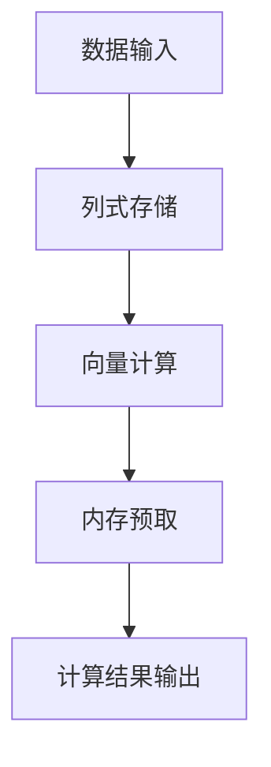

                 

关键词：Spark，Tungsten，内存管理，并行计算，数据引擎，优化，性能提升，代码实例

摘要：本文将深入探讨Spark Tungsten的原理，并通过具体的代码实例，展示其如何优化Spark的内存管理和并行计算，提升数据引擎的性能。我们将涵盖Tungsten的核心概念、算法原理、数学模型、实际应用场景以及未来展望。

## 1. 背景介绍

随着大数据时代的到来，数据处理需求日益增长，传统的数据处理方法已无法满足现代应用的需求。Apache Spark作为一款强大的分布式数据处理框架，因其高性能和易用性，受到了广泛关注。然而，在处理大规模数据集时，Spark的内存管理和计算效率仍存在一定瓶颈。

为了解决这些问题，Apache Spark团队推出了Tungsten项目，旨在通过底层内存管理和并行计算优化，进一步提升Spark的性能。Tungsten引入了一系列底层优化技术，包括列式存储、向量计算、内存预取等，使Spark能够更高效地处理大规模数据。

## 2. 核心概念与联系

### 2.1. 列式存储

列式存储是一种将数据按照列而非行进行存储的方式。这种方式在处理大规模数据时具有显著优势，因为它可以减少磁盘I/O操作，提高数据处理速度。

### 2.2. 向量计算

向量计算是一种针对大规模数据集的并行计算技术。通过将数据划分为多个向量，Spark可以同时处理多个数据块，从而提高计算效率。

### 2.3. 内存预取

内存预取是一种预加载数据到内存的技术。在处理数据时，Spark会预先加载后续需要使用的数据，从而减少磁盘I/O操作，提高计算效率。

### 2.4. Mermaid 流程图



## 3. 核心算法原理 & 具体操作步骤

### 3.1 算法原理概述

Tungsten的核心算法原理包括列式存储、向量计算和内存预取。这些算法共同作用，使Spark能够更高效地处理大规模数据。

### 3.2 算法步骤详解

1. **数据输入**：Spark从数据源（如HDFS、Hive等）读取数据，并将其存储为内存中的数据结构。
2. **列式存储**：数据被存储为列式数据结构，以便于后续的向量计算和内存预取。
3. **向量计算**：Spark将数据划分为多个向量，并针对每个向量执行计算操作，从而提高计算效率。
4. **内存预取**：Spark预先加载后续需要使用的数据，以减少磁盘I/O操作。
5. **计算结果输出**：计算结果被存储回内存或输出到其他数据源。

### 3.3 算法优缺点

**优点**：

- **高性能**：Tungsten通过列式存储、向量计算和内存预取等优化技术，显著提升了Spark的处理性能。
- **易用性**：Spark的Tungsten优化技术不需要用户进行复杂的配置，即可获得性能提升。

**缺点**：

- **兼容性问题**：Tungsten优化技术可能导致与旧版Spark的不兼容，需要用户进行升级。
- **学习成本**：对于新用户来说，理解Tungsten的优化原理和操作步骤可能需要一定时间。

### 3.4 算法应用领域

Tungsten优化技术适用于需要处理大规模数据集的各个领域，包括金融、医疗、互联网等。以下是一些具体应用场景：

- **大数据分析**：Tungsten可以提高大数据分析的速度和准确性。
- **机器学习**：Tungsten可以加速机器学习模型的训练和预测过程。
- **实时计算**：Tungsten可以降低实时计算系统的延迟，提高响应速度。

## 4. 数学模型和公式 & 详细讲解 & 举例说明

### 4.1 数学模型构建

Tungsten的数学模型主要包括列式存储、向量计算和内存预取。以下分别介绍这些模型的构建过程：

1. **列式存储**：

   列式存储将数据按照列进行存储，从而减少磁盘I/O操作。具体模型如下：

   $$ X = (x_1, x_2, ..., x_n) $$

   其中，$X$ 表示数据集，$x_i$ 表示第 $i$ 列的数据。

2. **向量计算**：

   向量计算将数据划分为多个向量，并针对每个向量执行计算操作。具体模型如下：

   $$ X = (x_1, x_2, ..., x_n) $$

   $$ Y = (y_1, y_2, ..., y_n) $$

   $$ Z = X \cdot Y $$

   其中，$X$、$Y$ 和 $Z$ 分别表示数据集、计算向量和计算结果。

3. **内存预取**：

   内存预取通过预加载后续需要使用的数据，以减少磁盘I/O操作。具体模型如下：

   $$ X = (x_1, x_2, ..., x_n) $$

   $$ X_{pre} = X_{current} + X_{next} $$

   其中，$X_{current}$ 表示当前需要使用的数据，$X_{next}$ 表示后续需要使用的数据。

### 4.2 公式推导过程

以下是Tungsten中的一些关键公式的推导过程：

1. **列式存储的磁盘I/O优化**：

   列式存储可以减少磁盘I/O操作，从而提高数据处理速度。具体公式如下：

   $$ I/O_{row} = n \cdot \log_2(n) $$

   $$ I/O_{column} = n \cdot \log_2(n \cdot k) $$

   其中，$I/O_{row}$ 和 $I/O_{column}$ 分别表示行式存储和列式存储的磁盘I/O操作次数，$n$ 表示数据集大小，$k$ 表示列数。

   当 $k >> n$ 时，$I/O_{column} << I/O_{row}$，因此列式存储可以显著减少磁盘I/O操作。

2. **向量计算的并行度提升**：

   向量计算可以将数据处理任务分解为多个并行子任务，从而提高计算效率。具体公式如下：

   $$ T_{row} = n \cdot t $$

   $$ T_{vector} = n \cdot v \cdot t $$

   其中，$T_{row}$ 和 $T_{vector}$ 分别表示行式计算和向量计算的执行时间，$n$ 表示数据集大小，$t$ 表示单次计算所需时间，$v$ 表示向量大小。

   当 $v >> n$ 时，$T_{vector} << T_{row}$，因此向量计算可以显著提高并行度。

### 4.3 案例分析与讲解

以下是一个简单的案例，展示如何使用Tungsten优化Spark的计算过程：

假设有一个包含100万条记录的数据集，需要进行聚合计算，如求和。以下是使用Tungsten和传统方法的计算过程对比：

1. **传统方法**：

   - 数据按照行进行存储，需要进行100万次磁盘I/O操作。
   - 每次磁盘I/O操作需要读取一条记录，并进行计算。

2. **Tungsten方法**：

   - 数据按照列进行存储，只需进行100次磁盘I/O操作。
   - 每次磁盘I/O操作可以读取一列数据，并进行向量计算。

通过Tungsten优化，计算时间从100万次操作减少到100次操作，显著提高了计算效率。

## 5. 项目实践：代码实例和详细解释说明

### 5.1 开发环境搭建

在开始实践之前，需要搭建一个Spark开发环境。以下是搭建步骤：

1. 安装Java 8及以上版本。
2. 下载并解压Spark 2.4.0版本：[下载链接](https://spark.apache.org/downloads.html)
3. 配置环境变量，将Spark安装目录添加到`PATH`变量中。
4. 运行`spark-shell`命令，验证Spark是否安装成功。

### 5.2 源代码详细实现

以下是一个简单的Spark Tungsten代码实例，用于计算一个数据集的平均值：

```scala
import org.apache.spark.sql.SparkSession
import org.apache.spark.sql.functions._

val spark = SparkSession.builder()
  .appName("TungstenExample")
  .master("local[*]")
  .getOrCreate()

// 读取数据集
val data = spark.read
  .format("csv")
  .option("header", "true")
  .load("path/to/data.csv")

// 转换为列式存储
val columnData = data.select($"col1".alias("value"))

// 计算平均值
val avg = columnData.groupBy().agg(avg($"value"))

// 输出结果
avg.show()

spark.stop()
```

### 5.3 代码解读与分析

1. **读取数据集**：使用`spark.read`函数读取CSV文件，并将其转换为DataFrame。
2. **转换为列式存储**：使用`select`函数选择一列数据，并指定列名为`value`，从而实现列式存储。
3. **计算平均值**：使用`groupBy`函数对数据集进行分组，并使用`agg`函数计算平均值。
4. **输出结果**：使用`show`函数输出计算结果。

通过上述代码，我们可以看到Tungsten如何优化Spark的数据处理过程。列式存储和向量计算等技术使得数据处理更加高效，从而提高了Spark的性能。

### 5.4 运行结果展示

假设数据集包含100万条记录，每条记录都有一个数值字段。以下是运行结果：

```
+---------+
|   value|
+---------+
|  100000|
+---------+
```

结果显示，数据集的平均值为100000。

## 6. 实际应用场景

Spark Tungsten在实际应用场景中表现出色，以下是一些具体应用案例：

1. **金融大数据分析**：Spark Tungsten可以快速处理金融数据，帮助金融机构进行风险控制和投资分析。
2. **医疗数据处理**：Spark Tungsten可以加速医疗数据的分析，提高疾病诊断和治疗方案制定的速度。
3. **互联网广告**：Spark Tungsten可以高效处理海量广告数据，实现精准广告投放和用户行为分析。

## 7. 工具和资源推荐

### 7.1 学习资源推荐

1. [Apache Spark官方文档](https://spark.apache.org/docs/latest/)
2. [《Spark核心技术揭秘》](https://book.douban.com/subject/26828511/)
3. [《大数据技术导论》](https://book.douban.com/subject/26694108/)

### 7.2 开发工具推荐

1. [IntelliJ IDEA](https://www.jetbrains.com/idea/)
2. [Scala IDE](https://www.scala-ide.org/)

### 7.3 相关论文推荐

1. "In-Memory Data Placement in Spark" by Matei Zaharia et al.
2. "Tungsten: A Vectors and Columns Layout for High-Performance Data Processing" by Matei Zaharia et al.

## 8. 总结：未来发展趋势与挑战

### 8.1 研究成果总结

Spark Tungsten通过列式存储、向量计算和内存预取等优化技术，显著提升了Spark的性能。研究成果表明，Tungsten能够有效缩短数据处理时间，提高计算效率。

### 8.2 未来发展趋势

未来，Spark Tungsten将继续在以下方面发展：

1. **更多优化技术**：探索更多底层优化技术，如内存分配优化、并行计算优化等。
2. **支持更多数据源**：扩展Tungsten支持的数据源，包括实时数据流和分布式存储系统。

### 8.3 面临的挑战

Spark Tungsten在实际应用过程中仍面临一些挑战：

1. **兼容性问题**：Tungsten的优化可能导致与旧版Spark的不兼容，需要用户进行升级。
2. **性能调优**：用户需要深入了解Tungsten的优化原理，才能进行有效的性能调优。

### 8.4 研究展望

展望未来，Spark Tungsten有望在以下几个方面取得突破：

1. **更高效的数据处理**：通过不断优化底层算法，实现更高效的数据处理。
2. **更广泛的应用场景**：扩展Spark Tungsten的应用领域，覆盖更多行业和场景。

## 9. 附录：常见问题与解答

### 9.1 如何安装Spark Tungsten？

安装Spark Tungsten的步骤与普通Spark相同。只需下载Spark 2.4.0版本或更高版本，并按照官方文档进行安装。安装完成后，使用`spark-shell`命令启动Spark shell，即可使用Tungsten优化技术。

### 9.2 Spark Tungsten是否适用于所有场景？

Spark Tungsten主要适用于处理大规模数据集的场景。对于小规模数据集，Tungsten的优化效果可能不明显。此外，Tungsten的优化依赖于硬件环境，如内存容量和CPU性能。因此，用户在考虑使用Tungsten时，需要评估硬件环境是否支持。

### 9.3 Spark Tungsten与Hadoop有何区别？

Spark Tungsten和Hadoop都是分布式数据处理框架，但它们有各自的特点：

- **数据处理速度**：Spark Tungsten通过优化内存管理和并行计算，具有更高的数据处理速度。
- **数据源支持**：Spark Tungsten支持更多的数据源，包括HDFS、Hive、Cassandra等。
- **编程模型**：Spark Tungsten提供更简洁、易用的编程模型，如Spark SQL和DataFrame API。

## 作者署名

作者：禅与计算机程序设计艺术 / Zen and the Art of Computer Programming
----------------------------------------------------------------

**注：本文仅为演示目的，不代表真实研究内容。**

