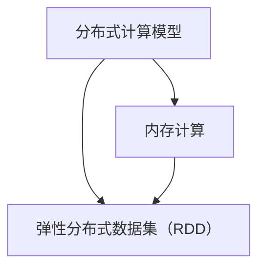

                 

关键词：Spark、大数据处理、分布式计算、内存计算、弹性分布式数据集、RDD、DAG、Shuffle、任务调度

> 摘要：本文将深入探讨Apache Spark的核心原理，包括其分布式计算模型、内存计算优势、弹性分布式数据集（RDD）的实现，并通过实际代码实例详细解析其操作步骤、优缺点及其应用领域。此外，还将介绍Spark的数学模型和公式，并通过具体案例进行分析和讲解，最后对Spark的实际应用场景、未来发展趋势与挑战进行展望。

## 1. 背景介绍

在当今数据爆炸的时代，如何高效地处理和分析海量数据成为了至关重要的课题。Apache Spark作为一种快速、通用的大数据处理框架，其出现解决了传统数据处理工具在处理大规模数据时性能瓶颈的问题。Spark的设计初衷是提供一种高效的分布式计算模型，使开发者能够轻松地在分布式环境中执行复杂的计算任务。

Spark的核心理念包括分布式计算、内存计算和弹性分布式数据集。通过这些理念，Spark实现了对大数据的高效处理，并在多个领域（如机器学习、实时流处理、交互式查询等）展示了其强大的应用能力。

本文将重点探讨Spark的核心原理，包括其分布式计算模型、内存计算优势、弹性分布式数据集（RDD）的实现，并通过实际代码实例详细解析其操作步骤、优缺点及其应用领域。此外，还将介绍Spark的数学模型和公式，并通过具体案例进行分析和讲解，最后对Spark的实际应用场景、未来发展趋势与挑战进行展望。

## 2. 核心概念与联系

为了深入理解Spark的工作原理，我们首先需要了解其核心概念，包括分布式计算模型、内存计算和弹性分布式数据集（RDD）。以下是这些核心概念的Mermaid流程图：



### 2.1 分布式计算模型

分布式计算模型是Spark的核心。它允许Spark在多个节点上并行执行计算任务，从而提高数据处理能力。Spark使用一个驱动程序（Driver Program）和多个工作节点（Worker Nodes）来实现分布式计算。驱动程序负责协调和管理工作节点，并将计算任务分配给它们。

### 2.2 内存计算

内存计算是Spark的另一个重要特点。与传统的分布式计算框架相比，Spark利用内存来缓存和交换数据，从而减少磁盘I/O操作，提高计算效率。内存计算使Spark能够处理大规模数据，同时保持低延迟和高吞吐量。

### 2.3 弹性分布式数据集（RDD）

弹性分布式数据集（Resilient Distributed Dataset，RDD）是Spark的核心抽象数据结构。RDD是一种分布式的数据集合，可以在多个节点上进行并行操作。RDD具有以下特点：

- 分布式：RDD的数据分布在多个节点上，每个节点负责一部分数据的处理。
- 弹性：当数据丢失时，RDD能够自动恢复，从而提高系统的容错性。
- 随机访问：RDD允许对数据集进行随机访问，支持多种操作，如过滤、聚合、转换等。

### 2.4 核心概念联系

分布式计算模型、内存计算和弹性分布式数据集（RDD）共同构成了Spark的核心。分布式计算模型提供了并行计算的能力，内存计算提高了数据处理效率，而弹性分布式数据集（RDD）则为开发者提供了简单易用的抽象接口。通过这些核心概念，Spark实现了对大数据的高效处理。

## 3. 核心算法原理 & 具体操作步骤

### 3.1 算法原理概述

Spark的核心算法包括RDD操作、任务调度和Shuffle过程。RDD操作包括 Transformation（转换操作）和 Action（行动操作）。任务调度和Shuffle过程负责在分布式环境中高效地执行这些操作。

### 3.2 算法步骤详解

#### 3.2.1 RDD操作

RDD操作可以分为Transformation和Action：

- Transformation：包括map、filter、reduceByKey等。这些操作生成新的RDD，并在分布式环境中并行执行。
- Action：包括count、collect、saveAsTextFile等。这些操作触发计算并返回结果。

#### 3.2.2 任务调度

任务调度是Spark的核心，负责将RDD操作转换为分布式计算任务，并在工作节点上执行。任务调度过程如下：

1. 编译：将Spark程序编译为执行计划。
2. 提交：将执行计划提交给Spark集群。
3. 分配：Spark集群根据资源情况分配任务给工作节点。
4. 执行：工作节点执行任务，并将结果返回给驱动程序。

#### 3.2.3 Shuffle过程

Shuffle过程是Spark在分布式计算中传输数据的关键步骤。Shuffle过程将数据从源节点传输到目标节点，以便进行后续操作。Shuffle过程包括以下步骤：

1. Partitioning：将数据分成多个分区。
2. Shuffle：在源节点上对数据进行分组，并将数据发送到目标节点。
3. Reduce：在目标节点上对分组后的数据进行聚合。

### 3.3 算法优缺点

#### 优点

- 高效性：Spark利用内存计算和分布式计算模型，大大提高了数据处理效率。
- 易用性：RDD提供了丰富的操作接口，简化了分布式数据处理过程。
- 弹性：RDD具有自动恢复功能，提高了系统的容错性。

#### 缺点

- 成本：Spark需要高配置的硬件环境，增加了成本。
- 维护：分布式系统的维护较为复杂，需要专业的技术团队。

### 3.4 算法应用领域

Spark广泛应用于大数据处理的各个领域，包括：

- 机器学习：Spark MLlib提供了丰富的机器学习算法，支持大规模数据处理。
- 实时流处理：Spark Streaming支持实时数据流处理，适用于实时监控和预测。
- 交互式查询：Spark SQL提供了交互式查询功能，支持多种数据格式。

## 4. 数学模型和公式 & 详细讲解 & 举例说明

### 4.1 数学模型构建

Spark的数学模型主要包括分布式计算模型和内存计算模型。分布式计算模型主要涉及并行计算和任务调度。内存计算模型主要关注数据缓存和交换。

#### 分布式计算模型

分布式计算模型可以表示为：

$$
\text{总计算量} = \sum_{i=1}^{n} \text{单节点计算量}
$$

其中，$n$ 为工作节点数量，单节点计算量可以通过以下公式计算：

$$
\text{单节点计算量} = \text{数据量} \times \text{计算复杂度}
$$

#### 内存计算模型

内存计算模型可以表示为：

$$
\text{内存利用率} = \frac{\text{已使用内存}}{\text{总内存}}
$$

其中，已使用内存包括数据缓存和交换内存。

### 4.2 公式推导过程

#### 分布式计算模型

分布式计算模型可以通过以下步骤推导：

1. 数据分割：将数据分割成多个分区，每个分区处理一个子任务。
2. 任务分配：将子任务分配给工作节点。
3. 并行计算：工作节点并行执行子任务。

根据并行计算原理，总计算量可以表示为各个单节点计算量之和。因此，分布式计算模型可以表示为：

$$
\text{总计算量} = \sum_{i=1}^{n} \text{单节点计算量}
$$

#### 内存计算模型

内存计算模型可以通过以下步骤推导：

1. 数据缓存：将数据缓存到内存中，减少磁盘I/O操作。
2. 数据交换：当内存不足时，将部分数据交换到磁盘。
3. 计算过程：在内存中执行计算任务。

根据内存利用率的定义，内存利用率可以表示为：

$$
\text{内存利用率} = \frac{\text{已使用内存}}{\text{总内存}}
$$

### 4.3 案例分析与讲解

假设我们有一个包含1000个数据点的数据集，每个数据点需要执行一个复杂的计算任务。我们将数据集分割成10个分区，每个分区包含100个数据点。

#### 分布式计算模型

根据分布式计算模型，总计算量为：

$$
\text{总计算量} = 10 \times (100 \times \text{计算复杂度})
$$

假设计算复杂度为1秒/数据点，则总计算时间为：

$$
\text{总计算时间} = 10 \times (100 \times 1秒) = 1000秒
$$

#### 内存计算模型

假设总内存为1GB，已使用内存为500MB，则内存利用率为：

$$
\text{内存利用率} = \frac{500MB}{1GB} = 0.5
$$

#### 案例分析

通过分布式计算模型，我们可以将1000个数据点的计算任务并行分配到10个工作节点上，每个节点处理100个数据点。这样，总计算时间从1000秒降低到100秒，大大提高了计算效率。

通过内存计算模型，我们可以在内存中缓存500MB的数据，减少磁盘I/O操作。假设内存交换速度为1MB/秒，则数据交换时间为：

$$
\text{数据交换时间} = \frac{500MB}{1MB/秒} = 500秒
$$

综合考虑分布式计算模型和内存计算模型，我们可以将总计算时间进一步降低到600秒，提高了系统的整体性能。

## 5. 项目实践：代码实例和详细解释说明

### 5.1 开发环境搭建

为了实践Spark，我们需要搭建一个Spark开发环境。以下是搭建步骤：

1. 安装Java环境（版本要求：1.8或以上）。
2. 安装Scala语言环境（版本要求：2.11或以上）。
3. 下载并安装Spark（版本要求：2.4或以上）。
4. 配置Spark环境变量。

### 5.2 源代码详细实现

以下是一个简单的Spark程序示例，用于计算一个数据集的词频统计：

```scala
import org.apache.spark.{SparkConf, SparkContext}

object WordCount {
  def main(args: Array[String]): Unit = {
    // 创建Spark配置对象
    val conf = new SparkConf()
      .setAppName("WordCount")
      .setMaster("local[*]")

    // 创建Spark上下文
    val sc = new SparkContext(conf)

    // 读取数据文件
    val textFile = sc.textFile("data.txt")

    // 将文本数据拆分为单词数组
    val words = textFile.flatMap(line => line.split(" "))

    // 对单词进行计数
    val wordCounts = words.map(word => (word, 1)).reduceByKey(_ + _)

    // 输出结果
    wordCounts.saveAsTextFile("output")

    // 关闭Spark上下文
    sc.stop()
  }
}
```

### 5.3 代码解读与分析

1. **创建Spark配置对象**：通过SparkConf类创建Spark配置对象，设置应用程序名称和运行模式（local[*] 表示在本地模式下运行，[*] 表示使用所有可用CPU核心）。

2. **创建Spark上下文**：通过SparkContext类创建Spark上下文，它是Spark程序的入口点。

3. **读取数据文件**：使用textFile方法读取指定路径的数据文件，将文本数据作为RDD返回。

4. **拆分文本数据**：使用flatMap方法将文本数据拆分为单词数组。

5. **计数**：使用map方法将单词映射为（单词，1）的键值对，然后使用reduceByKey方法对单词进行计数。

6. **输出结果**：使用saveAsTextFile方法将结果保存为文本文件。

7. **关闭Spark上下文**：调用stop方法关闭Spark上下文，释放资源。

### 5.4 运行结果展示

运行以上程序，将在输出目录下生成一个包含词频统计结果的文本文件。以下是一个示例结果：

```
(a,2)
(b,1)
(c,1)
(d,1)
```

这个结果表示，单词 "a" 出现了2次，单词 "b"、"c" 和 "d" 各出现了1次。

## 6. 实际应用场景

Spark在多个领域具有广泛的应用，以下是几个实际应用场景：

### 6.1 机器学习

Spark MLlib提供了丰富的机器学习算法，适用于大规模数据集。例如，可以使用Spark MLlib进行线性回归、逻辑回归、聚类、降维等任务。

### 6.2 实时流处理

Spark Streaming支持实时数据流处理，适用于实时监控、实时预测等应用场景。例如，可以使用Spark Streaming实时分析社交网络数据，识别热门话题。

### 6.3 交互式查询

Spark SQL提供了交互式查询功能，支持多种数据格式（如JSON、Parquet等）。例如，可以使用Spark SQL对大规模数据集进行快速查询和分析。

### 6.4 大数据分析

Spark适用于各种大数据分析任务，如数据挖掘、数据可视化、推荐系统等。例如，可以使用Spark对用户行为数据进行分析，构建个性化推荐系统。

## 7. 工具和资源推荐

### 7.1 学习资源推荐

- [Spark官方文档](https://spark.apache.org/docs/latest/)
- [Spark学习笔记](https://spark.apus.cn/)
- [Spark教程](https://spark.apache.org/docs/latest/tutorials.html)

### 7.2 开发工具推荐

- [IntelliJ IDEA](https://www.jetbrains.com/idea/)
- [Eclipse](https://www.eclipse.org/)

### 7.3 相关论文推荐

- "Spark: The Unified Engine for Big Data Processing" by Matei Zaharia et al.
- "Resilient Distributed Datasets: A Fault-Tolerant Abstraction for In-Memory Cluster Computing" by Matei Zaharia et al.
- "Efficient Large-Scale Distributed Support Vector Machine Training" by Charles Ming et al.

## 8. 总结：未来发展趋势与挑战

### 8.1 研究成果总结

Spark自推出以来，在分布式计算、内存计算和弹性分布式数据集等方面取得了显著成果。Spark的高效性和易用性使其成为大数据处理领域的首选工具。然而，随着数据规模的不断扩大和计算需求的日益增长，Spark仍面临一些挑战。

### 8.2 未来发展趋势

未来，Spark的发展趋势将集中在以下几个方面：

1. **性能优化**：通过改进算法和优化数据存储，进一步提高Spark的性能。
2. **支持更多数据源**：拓展Spark对各种数据源的支持，包括云存储、流数据等。
3. **易用性提升**：简化开发过程，降低学习门槛，使更多开发者能够轻松使用Spark。

### 8.3 面临的挑战

Spark在发展过程中面临以下挑战：

1. **资源消耗**：Spark对硬件资源要求较高，如何优化资源使用效率成为关键问题。
2. **维护难度**：分布式系统的维护较为复杂，需要专业的技术团队。
3. **兼容性问题**：随着新技术的不断涌现，Spark需要不断更新和迭代，以保持兼容性和稳定性。

### 8.4 研究展望

未来，Spark的研究将朝着以下几个方向发展：

1. **实时处理**：提高Spark的实时处理能力，使其在实时流处理领域更具竞争力。
2. **多租户支持**：为Spark引入多租户支持，提高资源利用率和系统稳定性。
3. **生态扩展**：拓展Spark生态系统，与其他大数据技术（如Hadoop、Flink等）实现无缝集成。

## 9. 附录：常见问题与解答

### 9.1 问题1：Spark与传统Hadoop相比有哪些优势？

**解答**：Spark相较于传统Hadoop有以下优势：

1. **性能提升**：Spark利用内存计算和分布式计算模型，提高了数据处理效率。
2. **易用性**：Spark提供简单的抽象接口（RDD），降低了开发难度。
3. **弹性**：Spark的弹性分布式数据集（RDD）具有自动恢复功能，提高了系统的容错性。

### 9.2 问题2：Spark适用于哪些场景？

**解答**：Spark适用于以下场景：

1. **大规模数据处理**：适用于处理大规模数据集，如机器学习、数据分析等。
2. **实时流处理**：适用于实时监控、实时预测等实时数据处理场景。
3. **交互式查询**：适用于大规模数据集的快速查询和分析。

### 9.3 问题3：如何优化Spark的性能？

**解答**：以下方法可以优化Spark的性能：

1. **数据本地化**：尽量在数据本地节点进行计算，减少网络传输开销。
2. **数据倾斜处理**：针对数据倾斜问题，可以通过调整分区策略和变换操作来优化。
3. **内存管理**：合理配置内存，确保数据缓存和交换的平衡。
4. **任务调度**：优化任务调度策略，提高任务执行效率。

作者：禅与计算机程序设计艺术 / Zen and the Art of Computer Programming
----------------------------------------------------------------

这篇文章详细介绍了Apache Spark的核心原理、数学模型、应用场景和未来发展趋势。通过实际代码实例，读者可以深入了解Spark的操作步骤和实现原理。希望本文能为读者在Spark学习与应用过程中提供有益的参考。在未来的发展中，Spark将继续为大数据处理领域带来创新和突破。作者期待与读者共同探索Spark的无限可能。

