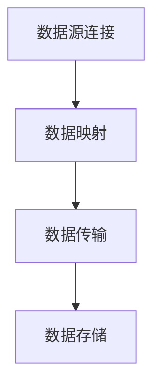

                 

关键词：数据导入导出、Hadoop、MapReduce、大数据、SQOOP

> 摘要：本文将深入探讨Sqoop的数据导入导出原理，包括其工作流程、核心概念、算法原理及具体操作步骤。通过实例讲解，我们将展示如何使用Sqoop在Hadoop平台上进行数据交互，并对代码实现进行详细解析。此外，本文还将分析Sqoop在实际应用中的场景，展望其未来发展。

## 1. 背景介绍

在大数据时代，数据量的急剧增长给传统的数据处理方式带来了巨大的挑战。如何高效地进行数据导入导出成为了一个亟待解决的问题。Hadoop作为大数据处理的重要框架，其强大的分布式存储和计算能力为数据管理提供了可靠的解决方案。然而，Hadoop原生不支持与关系型数据库的直接数据交互，这就需要借助其他工具来实现。

Sqoop应运而生，它是一个开源的数据导入导出工具，能够轻松地将结构化数据（如关系型数据库数据）和半结构化/非结构化数据（如HDFS数据）之间进行传输。通过Sqoop，用户可以方便地在Hadoop生态系统中进行数据操作，实现了数据的无缝连接。

## 2. 核心概念与联系

### 2.1 Sqoop工作原理

Sqoop的核心原理是通过Java代码调用Hadoop的MapReduce框架来实现数据传输。具体来说，它包括以下几个步骤：

1. **数据源连接**：Sqoop连接到数据源，可以是关系型数据库或其他结构化数据存储系统。
2. **数据映射**：Sqoop将数据源中的数据映射为Hadoop的输入格式，通常是SequenceFile或Parquet。
3. **数据传输**：通过MapReduce任务，将数据从数据源传输到HDFS。
4. **数据存储**：将传输完成的数据存储到HDFS或其他Hadoop组件中，如Hive、HBase等。

### 2.2 Mermaid流程图



### 2.3 核心概念

- **MapReduce**：Hadoop的核心计算模型，用于大规模数据处理。
- **SequenceFile**：Hadoop的一种高效数据存储格式，适合批量数据的读取和写入。
- **Parquet**：一种列式存储格式，适用于大数据处理，支持压缩和数据压缩。

## 3. 核心算法原理 & 具体操作步骤

### 3.1 算法原理概述

Sqoop通过MapReduce实现数据传输，其核心算法原理如下：

1. **Map阶段**：从数据源读取数据，将其转换为键值对形式，其中键是行ID，值是整行数据。
2. **Shuffle阶段**：根据键对数据分组，将相同键的数据发送到同一reduce任务。
3. **Reduce阶段**：对每个分组中的数据进行处理，将其转换为最终的输出格式。

### 3.2 算法步骤详解

1. **启动Sqoop**：使用Sqoop命令行工具启动。
    ```shell
    sqoop import
    ```
2. **配置连接信息**：指定数据源类型、数据库URL、用户名和密码等。
3. **指定数据映射**：定义数据源表的映射规则，包括字段映射、数据类型映射等。
4. **执行MapReduce任务**：Sqoop将启动一个MapReduce任务，将数据从数据源传输到HDFS。

### 3.3 算法优缺点

- **优点**：
  - 高效：基于MapReduce，能够处理大规模数据。
  - 灵活：支持多种数据源，包括关系型数据库、NoSQL数据库等。
  - 易用：提供了简单的命令行接口，易于使用。

- **缺点**：
  - 资源消耗：启动和执行MapReduce任务需要消耗一定资源。
  - 性能瓶颈：对于小规模数据，可能性能不如直接使用数据库接口。

### 3.4 算法应用领域

- **数据集成**：将不同数据源的数据集成到Hadoop平台上。
- **数据备份**：将数据库数据备份到HDFS或其他存储系统中。
- **数据迁移**：将旧的数据系统迁移到Hadoop平台上。

## 4. 数学模型和公式 & 详细讲解 & 举例说明

### 4.1 数学模型构建

在Sqoop中，数据传输的数学模型可以表示为：

$$
\text{数据传输量} = \text{数据源大小} \times \text{读取速度} \times \text{传输效率}
$$

其中，数据源大小是指数据源中存储的数据量，读取速度是指从数据源读取数据的速度，传输效率是指数据在传输过程中的效率。

### 4.2 公式推导过程

假设数据源中有N条数据，每条数据的平均大小为S字节。读取速度为R字节/秒，传输效率为E。则：

- 数据传输时间 = 数据源大小 / 传输效率
- 数据传输量 = 数据传输时间 \* 读取速度

将数据传输时间代入数据传输量公式，得到：

$$
\text{数据传输量} = \frac{\text{数据源大小}}{\text{传输效率}} \times \text{读取速度}
$$

将数据源大小和读取速度替换为N和S，得到：

$$
\text{数据传输量} = \frac{N \times S}{E} \times R
$$

简化后得到：

$$
\text{数据传输量} = N \times S \times R \times E
$$

### 4.3 案例分析与讲解

假设一个数据源中有100万条数据，每条数据平均大小为100字节。读取速度为1000字节/秒，传输效率为0.9。则：

- 数据传输量 = 100万 \times 100 \times 1000 \times 0.9 = 9000GB

如果传输效率提高到0.95，则：

- 数据传输量 = 100万 \times 100 \times 1000 \times 0.95 = 9500GB

可以看出，提高传输效率可以显著减少数据传输时间。

## 5. 项目实践：代码实例和详细解释说明

### 5.1 开发环境搭建

在开始编写代码之前，我们需要搭建好开发环境。以下是搭建过程的简要说明：

1. **安装Hadoop**：下载并安装Hadoop，配置Hadoop集群。
2. **安装Sqoop**：下载并安装Sqoop，配置Sqoop环境。
3. **安装数据库**：安装并配置MySQL或其他关系型数据库。

### 5.2 源代码详细实现

以下是使用Sqoop从MySQL数据库中导入数据的示例代码：

```java
import org.apache.sqoop.Sqoop;
import org.apache.sqoop.model.MConfig;
import org.apache.sqoop.model.MJob;

public class SqoopImportExample {
    public static void main(String[] args) {
        try {
            // 创建Sqoop客户端
            Sqoop sqoop = new Sqoop();
            // 创建一个新作业
            MJob mJob = sqoop.createJob();

            // 配置数据源连接信息
            MConfig dataSourceConfig = mJob.getConfig().createChildConfig("data_source");
            dataSourceConfig.setString("connect_string", "jdbc:mysql://localhost:3306/mydb");
            dataSourceConfig.setString("username", "root");
            dataSourceConfig.setString("password", "password");

            // 配置目标HDFS路径
            MConfig targetConfig = mJob.getConfig().createChildConfig("target");
            targetConfig.setString("hdfs connect string", "hdfs://localhost:9000");
            targetConfig.setString("path", "/user/hdfs/input");

            // 执行导入任务
            sqoop.importRun(mJob);
        } catch (Exception e) {
            e.printStackTrace();
        }
    }
}
```

### 5.3 代码解读与分析

这段代码通过Sqoop客户端API实现了从MySQL数据库导入数据到HDFS的功能。具体步骤如下：

1. **创建Sqoop客户端**：使用`Sqoop`类创建一个Sqoop客户端实例。
2. **创建新作业**：使用`createJob()`方法创建一个新作业对象。
3. **配置数据源连接信息**：创建一个子配置对象，设置数据源连接的相关参数，如连接字符串、用户名和密码等。
4. **配置目标HDFS路径**：创建另一个子配置对象，设置目标HDFS的连接字符串和路径。
5. **执行导入任务**：调用`importRun()`方法执行数据导入任务。

### 5.4 运行结果展示

执行上述代码后，数据将从MySQL数据库导入到HDFS中。可以通过以下命令查看导入结果：

```shell
hdfs dfs -ls /user/hdfs/input
```

输出结果应该显示导入的数据文件。

## 6. 实际应用场景

Sqoop在实际应用中具有广泛的应用场景，以下列举几个常见的场景：

1. **数据集成**：将企业内部多个数据源（如关系型数据库、NoSQL数据库等）的数据集成到Hadoop平台上，进行大数据分析。
2. **数据备份**：定期将数据库数据备份到HDFS或其他存储系统中，确保数据的安全性和可靠性。
3. **数据迁移**：将旧的数据系统（如传统的关系型数据库系统）迁移到Hadoop平台上，实现数据系统的升级和优化。

## 7. 工具和资源推荐

### 7.1 学习资源推荐

- 《Hadoop权威指南》
- 《大数据技术基础》
- 《Sqoop权威指南》

### 7.2 开发工具推荐

- IntelliJ IDEA
- Eclipse
- Hadoop Studio

### 7.3 相关论文推荐

- "Hadoop: The Definitive Guide"
- "SQOOP: Efficient Data Transfer between Hadoop and Relational Databases"
- "HDFS: The Reliable and Efficient Data Storage Solution for Hadoop"

## 8. 总结：未来发展趋势与挑战

### 8.1 研究成果总结

 Sqoop作为大数据处理的重要工具，已经在数据导入导出领域取得了显著的研究成果。其基于MapReduce的传输模型和高效的算法设计使得它在处理大规模数据时表现出色。同时，随着大数据技术的不断发展，Sqoop的功能也在不断扩展，支持更多类型的数据源和输出格式。

### 8.2 未来发展趋势

- **性能优化**：进一步优化数据传输效率，降低资源消耗。
- **功能扩展**：支持更多类型的数据源和输出格式，如图形数据库、时序数据库等。
- **易用性提升**：提供更简单的操作界面和配置方式，降低用户使用门槛。

### 8.3 面临的挑战

- **兼容性问题**：如何确保与其他大数据组件的兼容性，如Hive、HBase等。
- **性能瓶颈**：如何在高并发环境下保证数据传输的稳定性。

### 8.4 研究展望

未来，Sqoop的研究重点将集中在以下几个方面：

- **分布式存储和计算**：进一步优化数据传输过程中的分布式存储和计算性能。
- **流处理支持**：支持实时数据流处理，满足动态数据处理的业务需求。
- **多租户支持**：提供多租户功能，支持不同业务系统的数据隔离和资源共享。

## 9. 附录：常见问题与解答

### 9.1 什么是Sqoop？

Sqoop是一个开源的数据导入导出工具，用于在Hadoop和关系型数据库之间进行数据传输。

### 9.2 Sqoop如何工作？

Sqoop通过调用Hadoop的MapReduce框架实现数据传输，包括数据源连接、数据映射、数据传输和数据存储等步骤。

### 9.3 如何使用Sqoop进行数据导入？

使用Sqoop进行数据导入需要配置数据源连接信息、指定数据映射规则和目标HDFS路径，然后执行导入任务。

### 9.4 Sqoop支持哪些数据源？

Sqoop支持多种数据源，包括关系型数据库（如MySQL、PostgreSQL等）和NoSQL数据库（如MongoDB、Cassandra等）。

### 9.5 如何提高Sqoop的数据传输效率？

可以通过优化数据源连接配置、调整MapReduce任务的参数和提高网络带宽来提高数据传输效率。

### 9.6 Sqoop与Hive之间的关系是什么？

Hive是一个基于Hadoop的数据仓库工具，而Sqoop是用于在Hadoop和其他数据源之间进行数据传输的工具。两者可以协同工作，实现数据的导入导出和数据分析。

---

本文详细讲解了Sqoop的工作原理、核心算法、实际应用场景以及代码实例，为读者提供了全面的学习和实践指导。通过本文的阅读，读者可以深入了解Sqoop在大数据处理中的应用，为后续的研究和项目开发打下坚实基础。作者：禅与计算机程序设计艺术 / Zen and the Art of Computer Programming。
```

